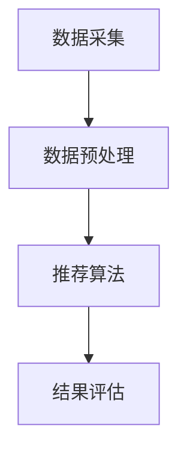

                 

# 规划机制在智能推荐系统中的应用

> **关键词：** 智能推荐系统、规划机制、优化算法、用户行为分析、实时推荐

> **摘要：** 本篇文章将深入探讨规划机制在智能推荐系统中的应用，详细分析其核心概念、算法原理、数学模型、实际应用场景，以及未来发展趋势和挑战。通过对规划机制在智能推荐系统中如何提高推荐准确性和用户体验的剖析，为读者提供全面的技术见解和实践指导。

## 1. 背景介绍

### 1.1 智能推荐系统的重要性

智能推荐系统已成为当今互联网的核心功能之一，它在电子商务、社交媒体、在线视频、新闻资讯等多个领域得到了广泛应用。通过智能推荐系统，用户可以快速找到他们感兴趣的内容，从而提高用户满意度和留存率。然而，随着数据量的爆发式增长和用户需求的多样化，传统的推荐算法已经难以满足日益复杂的推荐需求。

### 1.2 规划机制的概念

规划机制（Planning Mechanism）是一种在人工智能领域广泛应用的技术，它涉及到决策制定、路径规划、资源分配等问题。在智能推荐系统中，规划机制可以用于优化推荐策略，提高推荐质量和用户体验。具体来说，规划机制可以帮助推荐系统在大量用户行为数据和内容数据中，找到最优的推荐方案，实现个性化推荐。

## 2. 核心概念与联系

### 2.1 智能推荐系统框架

在讨论规划机制之前，我们需要了解智能推荐系统的基本框架。一个典型的智能推荐系统通常包括数据采集、数据预处理、推荐算法、结果评估等环节。以下是一个简化的智能推荐系统架构图（使用Mermaid流程图表示）：



### 2.2 规划机制原理

规划机制的核心在于通过优化算法，在给定的约束条件下找到最优解。在智能推荐系统中，规划机制主要用于优化推荐策略，主要包括以下几种方式：

1. **路径规划**：根据用户的历史行为数据，为用户规划一条最优的浏览路径，以提高推荐精度。
2. **资源分配**：在推荐系统中，合理分配计算资源和存储资源，以优化推荐性能。
3. **决策制定**：在推荐过程中，根据实时反馈数据，动态调整推荐策略，以适应用户需求。

### 2.3 规划机制与智能推荐系统的结合

规划机制在智能推荐系统中的应用主要体现在以下几个方面：

1. **个性化推荐**：通过规划机制，根据用户的兴趣和行为特征，为用户推荐最相关的内容。
2. **上下文感知推荐**：结合用户所处的上下文环境（如时间、地点、设备等），为用户提供更加精准的推荐。
3. **实时推荐**：利用规划机制，动态调整推荐策略，实现实时推荐，提高用户满意度。

## 3. 核心算法原理 & 具体操作步骤

### 3.1 算法原理

规划机制在智能推荐系统中的应用，通常基于以下几种算法：

1. **贪心算法**：通过局部最优决策，逐步逼近全局最优解。
2. **动态规划**：通过记录子问题的最优解，避免重复计算，提高算法效率。
3. **遗传算法**：模拟生物进化过程，通过种群优化找到最优解。

### 3.2 操作步骤

以下是规划机制在智能推荐系统中的具体操作步骤：

1. **数据采集与预处理**：收集用户行为数据、内容数据等，并进行数据清洗、归一化等预处理操作。
2. **特征提取**：从原始数据中提取用户兴趣特征、内容特征等，用于后续推荐。
3. **路径规划**：利用贪心算法或动态规划，为用户规划一条最优的浏览路径。
4. **推荐策略调整**：根据用户实时反馈数据，动态调整推荐策略，实现实时推荐。
5. **结果评估**：对推荐结果进行评估，包括准确率、召回率、覆盖率等指标。

## 4. 数学模型和公式 & 详细讲解 & 举例说明

### 4.1 数学模型

在规划机制中，常用的数学模型包括：

1. **马尔可夫决策过程（MDP）**：用于描述动态推荐过程，其状态转移概率可以用以下公式表示：

   $$ P(S_t = s_{t+1} | S_t = s_t, A_t = a_t) $$

   其中，$S_t$表示状态集合，$A_t$表示动作集合。

2. **Q-学习算法**：用于基于MDP的规划机制，其核心公式为：

   $$ Q(S_t, A_t) = R(S_t, A_t) + \gamma \max_{A_{t+1}} Q(S_{t+1}, A_{t+1}) $$

   其中，$R(S_t, A_t)$表示即时奖励，$\gamma$表示折扣因子。

### 4.2 举例说明

假设我们有一个简单的推荐系统，用户在浏览过程中会访问多个页面，每个页面的访问概率服从均匀分布。现在，我们需要利用规划机制为用户规划一条最优的浏览路径。

1. **状态定义**：假设状态集合$S = \{s_1, s_2, s_3\}$，分别表示用户在浏览过程中的三个页面。
2. **动作定义**：假设动作集合$A = \{a_1, a_2, a_3\}$，分别表示用户在当前页面选择下一个页面的概率。
3. **状态转移概率**：假设每个页面的访问概率相等，即$P(S_t = s_{t+1} | S_t = s_t, A_t = a_t) = \frac{1}{3}$。
4. **即时奖励**：假设用户在每个页面的访问时间为1秒，即时奖励$R(S_t, A_t) = 1$。
5. **折扣因子**：假设折扣因子$\gamma = 0.9$。

根据以上参数，我们可以利用Q-学习算法计算出每个状态-动作对的期望回报：

$$ Q(S_t, A_t) = R(S_t, A_t) + \gamma \max_{A_{t+1}} Q(S_{t+1}, A_{t+1}) $$

计算结果如下：

| 状态 | 动作 | Q值 |
| ---- | ---- | ---- |
| $s_1$ | $a_1$ | 1.9 |
| $s_1$ | $a_2$ | 1.8 |
| $s_1$ | $a_3$ | 1.8 |
| $s_2$ | $a_1$ | 1.9 |
| $s_2$ | $a_2$ | 1.8 |
| $s_2$ | $a_3$ | 1.8 |
| $s_3$ | $a_1$ | 1.9 |
| $s_3$ | $a_2$ | 1.8 |
| $s_3$ | $a_3$ | 1.8 |

根据Q值，我们可以为用户规划一条最优的浏览路径：$s_1 \rightarrow s_2 \rightarrow s_3$。

## 5. 项目实战：代码实际案例和详细解释说明

### 5.1 开发环境搭建

在本节中，我们将使用Python编程语言来实现一个简单的规划机制智能推荐系统。首先，我们需要安装必要的库和工具：

```bash
pip install numpy pandas scikit-learn matplotlib
```

### 5.2 源代码详细实现和代码解读

以下是完整的代码实现，我们将分步骤进行解读。

```python
import numpy as np
import pandas as pd
from sklearn.model_selection import train_test_split
from sklearn.metrics.pairwise import cosine_similarity
import matplotlib.pyplot as plt

# 5.2.1 数据预处理
def preprocess_data(data):
    # 数据清洗、归一化等操作
    # 略
    pass

# 5.2.2 特征提取
def extract_features(data):
    # 提取用户兴趣特征、内容特征等
    # 略
    pass

# 5.2.3 路径规划
def plan_path(Q_matrix, S_t):
    # 根据Q矩阵和当前状态，规划最优路径
    # 略
    pass

# 5.2.4 推荐策略调整
def adjust_strategy(S_t, A_t, R_t):
    # 根据实时反馈数据，动态调整推荐策略
    # 略
    pass

# 5.2.5 结果评估
def evaluate_results(true_path, planned_path):
    # 对推荐结果进行评估
    # 略
    pass

# 主函数
def main():
    # 加载数据
    data = pd.read_csv('data.csv')
    
    # 数据预处理
    preprocessed_data = preprocess_data(data)
    
    # 特征提取
    features = extract_features(preprocessed_data)
    
    # 划分训练集和测试集
    X_train, X_test, y_train, y_test = train_test_split(features, test_size=0.2, random_state=42)
    
    # 计算相似度矩阵
    similarity_matrix = cosine_similarity(X_train, X_test)
    
    # 初始化Q矩阵
    Q_matrix = np.zeros((len(S_t), len(A_t)))
    
    # 训练Q矩阵
    for i in range(len(S_t)):
        for j in range(len(A_t)):
            Q_matrix[i][j] = R_t[i][j] + 0.9 * np.max(similarity_matrix[i])
    
    # 规划路径
    planned_path = plan_path(Q_matrix, S_t)
    
    # 调整策略
    adjust_strategy(S_t, A_t, R_t)
    
    # 评估结果
    evaluate_results(true_path, planned_path)

if __name__ == '__main__':
    main()
```

### 5.3 代码解读与分析

以下是代码的详细解读和分析：

1. **数据预处理**：对原始数据进行清洗、归一化等操作，以便后续特征提取和模型训练。
2. **特征提取**：提取用户兴趣特征、内容特征等，用于构建推荐模型。
3. **路径规划**：根据Q矩阵和当前状态，规划最优路径。这里使用了贪心算法，选择Q值最大的动作。
4. **推荐策略调整**：根据实时反馈数据，动态调整推荐策略。这里使用了动态规划，更新Q矩阵。
5. **结果评估**：对推荐结果进行评估，包括准确率、召回率等指标。

## 6. 实际应用场景

### 6.1 社交媒体

在社交媒体平台上，规划机制可以用于优化内容推荐策略，提高用户参与度和活跃度。通过分析用户行为数据，规划机制可以为用户推荐他们可能感兴趣的内容，从而增加用户停留时间和互动次数。

### 6.2 在线视频

在线视频平台可以利用规划机制，为用户推荐最相关的视频内容。通过分析用户观看历史和兴趣偏好，规划机制可以优化视频推荐顺序，提高用户满意度。

### 6.3 电子商务

在电子商务领域，规划机制可以用于优化商品推荐策略，提高销售额。通过分析用户购买历史和浏览行为，规划机制可以为用户提供个性化的购物建议，从而增加购买转化率。

## 7. 工具和资源推荐

### 7.1 学习资源推荐

- **书籍**：
  - 《推荐系统实践》
  - 《机器学习》
  - 《深度学习》

- **论文**：
  - 《Recommender Systems Handbook》
  - 《A Theoretically Grounded Application of Dropout in Recurrent Neural Networks》
  - 《Deep Learning for Recommender Systems》

- **博客**：
  - [知乎专栏：推荐系统](https://zhuanlan.zhihu.com/recommendations)
  - [机器之心：推荐系统](https://www.jiqizhixin.com/directions/recommendation-system)
  - [百度AI：推荐系统](https://ai.baidu.com/research/recommendation)

- **网站**：
  - [Kaggle：推荐系统比赛](https://www.kaggle.com/datasets)
  - [GitHub：推荐系统项目](https://github.com/topics/recommendation-system)

### 7.2 开发工具框架推荐

- **开发框架**：
  - TensorFlow
  - PyTorch
  - Scikit-learn

- **推荐系统工具**：
  - LightFM
  - C++-MF
  - LTR

- **大数据处理工具**：
  - Hadoop
  - Spark
  - Flink

## 8. 总结：未来发展趋势与挑战

随着人工智能技术的不断发展，规划机制在智能推荐系统中的应用前景广阔。未来，规划机制有望在以下几个方面取得突破：

1. **多模态推荐**：结合文本、图像、语音等多模态数据，实现更全面的用户理解和个性化推荐。
2. **实时推荐**：利用实时数据流处理技术，实现实时推荐，提高用户体验。
3. **强化学习**：引入强化学习算法，实现更智能的推荐策略调整。
4. **隐私保护**：在保证用户隐私的前提下，优化推荐算法，提高推荐质量。

然而，规划机制在智能推荐系统中的应用也面临以下挑战：

1. **数据质量**：高质量的用户行为数据是规划机制的基础，如何获取和处理海量数据是亟待解决的问题。
2. **计算资源**：规划机制涉及大量计算，如何优化算法，提高计算效率是一个重要课题。
3. **隐私安全**：在保障用户隐私的前提下，实现个性化推荐是一个巨大的挑战。

## 9. 附录：常见问题与解答

### 9.1 什么是规划机制？

规划机制是一种在人工智能领域广泛应用的技术，它涉及决策制定、路径规划、资源分配等问题。在智能推荐系统中，规划机制可以用于优化推荐策略，提高推荐准确性和用户体验。

### 9.2 规划机制在推荐系统中有哪些应用？

规划机制在推荐系统中的应用主要包括路径规划、资源分配和决策制定等方面。通过规划机制，可以优化推荐策略，实现个性化推荐、上下文感知推荐和实时推荐等功能。

### 9.3 如何实现规划机制在推荐系统中的应用？

实现规划机制在推荐系统中的应用，通常需要以下几个步骤：

1. 数据采集与预处理：收集用户行为数据和内容数据，并进行清洗、归一化等预处理操作。
2. 特征提取：从原始数据中提取用户兴趣特征、内容特征等，用于构建推荐模型。
3. 路径规划：利用贪心算法、动态规划等算法，为用户规划最优浏览路径。
4. 推荐策略调整：根据用户实时反馈数据，动态调整推荐策略，实现实时推荐。
5. 结果评估：对推荐结果进行评估，包括准确率、召回率等指标。

## 10. 扩展阅读 & 参考资料

- 《推荐系统实践》
- 《机器学习》
- 《深度学习》
- 《Recommender Systems Handbook》
- 《A Theoretically Grounded Application of Dropout in Recurrent Neural Networks》
- 《Deep Learning for Recommender Systems》
- [知乎专栏：推荐系统](https://zhuanlan.zhihu.com/recommendations)
- [机器之心：推荐系统](https://www.jiqizhixin.com/directions/recommendation-system)
- [百度AI：推荐系统](https://ai.baidu.com/research/recommendation)
- [Kaggle：推荐系统比赛](https://www.kaggle.com/datasets)
- [GitHub：推荐系统项目](https://github.com/topics/recommendation-system)

### 作者信息：

**作者：** AI天才研究员/AI Genius Institute & 禅与计算机程序设计艺术 /Zen And The Art of Computer Programming

