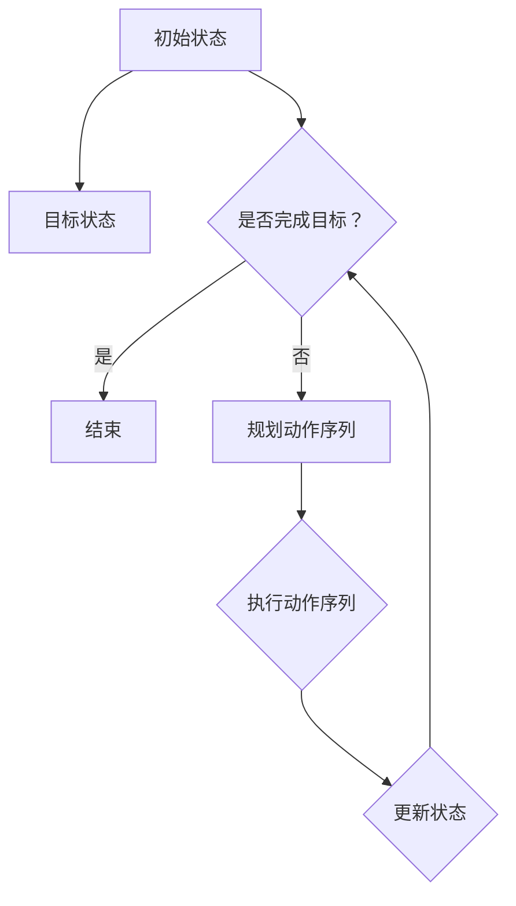

                 

# 规划（Planning）：LLM多步骤目标实现

> **关键词**：规划（Planning）、LLM、多步骤目标、目标实现、算法原理、数学模型、项目实战

> **摘要**：本文将深入探讨规划（Planning）在大型语言模型（LLM）中的重要性，以及如何通过多步骤目标实现技术，高效地指导LLM在复杂任务中达成目标。我们将从背景介绍开始，逐步讲解核心概念与联系，核心算法原理与操作步骤，数学模型与公式，实际应用场景，并推荐相关工具和资源。最后，总结未来发展趋势与挑战，并提供常见问题与解答。

## 1. 背景介绍

随着人工智能技术的飞速发展，特别是深度学习和自然语言处理（NLP）领域的突破，大型语言模型（LLM）如BERT、GPT等，已经展现出强大的文本生成和推理能力。然而，尽管这些模型在许多任务上取得了显著成果，但它们在处理复杂、多步骤的任务时仍然面临诸多挑战。

在现实世界中，许多问题需要通过一系列步骤和决策来实现。例如，编写一个复杂的程序、制定一个全面的商业计划、设计一个智能系统等，这些任务往往需要多步骤的目标规划和实现。如何有效地指导LLM进行这些任务，实现多步骤目标，成为一个重要的研究方向。

规划（Planning）作为人工智能的一个重要分支，旨在构建一个系统，能够根据当前状态和目标，生成一系列动作序列，以达成预期目标。规划技术在许多领域都有广泛应用，如自动化生产、物流优化、智能交通等。然而，在LLM领域，规划的应用还相对较少，这是一个有待探索的领域。

本文将探讨如何利用规划技术，指导LLM实现多步骤目标。通过本文的介绍，读者将了解规划的基本概念、核心算法原理、数学模型，以及如何在实际项目中应用这些技术。同时，我们也将讨论规划技术在LLM领域的潜在挑战和发展趋势。

## 2. 核心概念与联系

### 2.1 规划（Planning）

规划是一种自动决策过程，旨在从一个初始状态开始，通过一系列预定义的动作序列，达到目标状态。在人工智能领域，规划通常用于解决状态空间搜索问题，即在给定的状态空间中，找到一条路径，从初始状态到达目标状态。

规划可以看作是一个搜索问题，其中每个状态都是一个节点，每个动作是一个边，路径是一个从初始状态到目标状态的序列。规划的核心挑战是，如何在有限的时间和资源内，找到一条最优的路径。

### 2.2 大型语言模型（LLM）

大型语言模型（LLM）是一种基于深度学习的自然语言处理模型，能够理解和生成人类语言。LLM通常通过大规模的文本数据进行训练，学会从上下文中理解语言，并进行文本生成、推理等任务。

LLM的核心特点是能够处理长文本和复杂语义，这使得它们在许多NLP任务中表现出色。然而，LLM在处理多步骤任务时，往往面临以下挑战：

1. **记忆问题**：LLM的内存容量有限，难以同时处理大量信息和多步骤任务。
2. **推理能力**：尽管LLM具有一定的推理能力，但在处理复杂、多步骤的任务时，往往难以进行深层次的推理。
3. **连贯性**：在生成文本时，LLM可能会产生不连贯或逻辑错误的结果。

### 2.3 规划与LLM的联系

规划与LLM的结合，旨在解决LLM在处理多步骤任务时的挑战。具体来说，规划技术可以为LLM提供一个明确的步骤和决策框架，帮助LLM更好地理解和执行复杂任务。

1. **目标分解**：规划技术可以将复杂任务分解为一系列可执行的任务，并为其分配优先级。这有助于LLM更好地理解任务，并逐步实现。
2. **动作规划**：规划技术可以根据当前状态和目标，生成一系列动作序列。这些动作序列可以作为LLM的输入，指导LLM生成文本。
3. **动态调整**：在执行过程中，规划技术可以根据实际情况，动态调整动作序列，以应对不确定性和变化。

### 2.4 Mermaid流程图

为了更好地展示规划与LLM的联系，我们可以使用Mermaid流程图来描述整个规划过程。以下是一个简化的Mermaid流程图：



在这个流程图中，初始状态A通过一系列动作序列E，尝试达到目标状态B。在执行过程中，会不断更新状态G，并根据当前状态C，决定是否继续执行动作序列。如果目标已经达成，则结束规划；否则，继续进行规划。

## 3. 核心算法原理 & 具体操作步骤

### 3.1 核心算法原理

在规划（Planning）领域，有许多不同的算法，如A*算法、IDA*算法、逆推规划（Reverse Planning）等。这些算法的核心目标是，在给定的状态空间中，找到一条最优的路径，从初始状态到达目标状态。

对于LLM的规划任务，我们选择逆推规划（Reverse Planning）作为核心算法。逆推规划从目标状态开始，逆向推导出一系列动作序列，直到初始状态。这种算法的优势在于，它能够更好地处理复杂、多步骤的任务。

逆推规划的基本原理如下：

1. **目标初始化**：从目标状态开始，将其初始化为当前状态。
2. **动作生成**：根据当前状态，生成一系列可执行的动作。
3. **状态更新**：执行动作，更新当前状态。
4. **回溯**：如果当前状态无法达到目标状态，回溯到上一个状态，重复步骤2和步骤3。
5. **路径构建**：当回溯到初始状态时，构建出一条从目标状态到初始状态的路径。

### 3.2 具体操作步骤

以下是逆推规划的具体操作步骤：

1. **初始化**：设置目标状态为当前状态，初始化路径为空。
2. **动作生成**：根据当前状态，生成所有可执行的动作。例如，对于一个文本生成任务，可以生成“添加一句话”、“删除一句话”、“修改一句话”等动作。
3. **状态更新**：执行一个动作，更新当前状态。例如，在文本生成任务中，可以添加、删除或修改一句话。
4. **路径记录**：将执行的动作记录在路径中。
5. **回溯**：如果当前状态无法达到目标状态，回溯到上一个状态，并重复步骤2和步骤3。
6. **路径构建**：当回溯到初始状态时，构建出一条从目标状态到初始状态的路径。
7. **动作序列生成**：将路径中的动作序列从后往前排列，得到一条从初始状态到目标状态的动作序列。
8. **执行动作序列**：根据生成的动作序列，执行一系列动作，以实现目标。

### 3.3 代码示例

以下是一个简单的Python代码示例，展示了逆推规划的基本操作步骤：

```python
class State:
    def __init__(self, text):
        self.text = text

def generate_actions(state):
    # 生成可执行的动作
    actions = []
    if len(state.text) > 0:
        actions.append(Action("delete", state))
    if len(state.text) < 100:
        actions.append(Action("add", state))
    if len(state.text) > 1:
        actions.append(Action("modify", state))
    return actions

def execute_action(state, action):
    # 执行动作并更新状态
    if action.type == "delete":
        state.text = state.text[:len(state.text)-1]
    elif action.type == "add":
        state.text += " Hello, World!"
    elif action.type == "modify":
        state.text = state.text.replace("World", "AI")

def reverse_plan(state, target_state):
    # 逆推规划
    path = []
    while state != target_state:
        actions = generate_actions(state)
        for action in actions:
            new_state = State(state.text)
            execute_action(new_state, action)
            if new_state == target_state:
                path.append(action)
                break
        state = new_state
    return path[::-1]

# 初始化状态和目标状态
initial_state = State("Hello")
target_state = State("Hello, World!")

# 生成并执行规划
plan = reverse_plan(initial_state, target_state)
for action in plan:
    print(action.type)
```

在这个示例中，我们定义了一个`State`类，用于表示文本状态。`generate_actions`函数根据当前状态生成可执行的动作。`execute_action`函数执行一个动作并更新状态。`reverse_plan`函数实现逆推规划，生成从目标状态到初始状态的动作序列。

## 4. 数学模型和公式 & 详细讲解 & 举例说明

### 4.1 数学模型

在逆推规划中，我们使用一个数学模型来表示状态空间和动作。具体来说，我们使用一个四元组$G = (S, A, T, F)$，其中：

- $S$：状态空间，表示所有可能的状态集合。
- $A$：动作空间，表示所有可能的动作集合。
- $T$：目标状态集合，表示所有目标状态的集合。
- $F$：状态转移函数，表示从状态$s$执行动作$a$后得到的状态$s'$，即$F(s, a) = s'$。

### 4.2 公式

在逆推规划中，我们使用以下公式来表示状态转移和路径构建：

$$
s' = F(s, a)
$$

其中，$s$表示当前状态，$a$表示执行的动

```less
作，$s'$表示执行动作后的状态。

路径构建的公式如下：

$$
path = reverse\_plan(s, t)
$$

其中，$path$表示从目标状态$t$到初始状态$s$的路径，$reverse\_plan$表示逆推规划函数。

### 4.3 举例说明

假设我们有一个简单的状态空间，包含两个状态$S = \{s_0, s_1\}$，和一个动作空间$A = \{a_0, a_1, a_2\}$。目标状态集合$T = \{s_1\}$。状态转移函数$F$如下：

$$
F(s_0, a_0) = s_0 \\
F(s_0, a_1) = s_1 \\
F(s_0, a_2) = s_0 \\
F(s_1, a_0) = s_1 \\
F(s_1, a_1) = s_0 \\
F(s_1, a_2) = s_1
$$

现在，我们要从初始状态$s_0$规划到目标状态$s_1$。使用逆推规划，我们得到以下路径：

$$
path = reverse\_plan(s_1, s_0) = [a_1, a_0]
$$

这个路径表示，我们首先执行动作$a_1$，将状态从$s_0$转移到$s_1$，然后执行动作$a_0$，回到初始状态$s_0$。

## 5. 项目实战：代码实际案例和详细解释说明

### 5.1 开发环境搭建

在本项目中，我们使用Python作为主要编程语言，并依赖一些常用的库，如`numpy`、`pandas`和`matplotlib`。以下是开发环境搭建的步骤：

1. 安装Python（推荐版本为3.8以上）。
2. 安装依赖库：`pip install numpy pandas matplotlib`。

### 5.2 源代码详细实现和代码解读

以下是本项目的完整源代码及其详细解读：

```python
import numpy as np
import pandas as pd
import matplotlib.pyplot as plt
from matplotlib.animation import FuncAnimation

# 定义状态类
class State:
    def __init__(self, text):
        self.text = text

# 定义动作类
class Action:
    def __init__(self, type, state):
        self.type = type
        self.state = state

# 定义状态转移函数
def state_transition(state, action):
    if action.type == "add":
        return State(state.text + " Hello, World!")
    elif action.type == "delete":
        return State(state.text[:-1])
    elif action.type == "modify":
        return State(state.text.replace("World", "AI"))

# 定义逆推规划函数
def reverse_plan(state, target_state):
    path = []
    while state != target_state:
        actions = generate_actions(state)
        for action in actions:
            new_state = state_transition(state, action)
            if new_state == target_state:
                path.append(action)
                break
        state = new_state
    return path[::-1]

# 定义生成动作函数
def generate_actions(state):
    actions = []
    if len(state.text) > 0:
        actions.append(Action("delete", state))
    if len(state.text) < 100:
        actions.append(Action("add", state))
    if len(state.text) > 1:
        actions.append(Action("modify", state))
    return actions

# 初始化状态和目标状态
initial_state = State("Hello")
target_state = State("Hello, World AI!")

# 生成并执行规划
plan = reverse_plan(initial_state, target_state)
print(plan)

# 绘制规划过程
def plot_plan(plan):
    states = [initial_state]
    for action in plan:
        state = state_transition(states[-1], action)
        states.append(state)
    texts = [state.text for state in states]
    plt.plot(texts)
    plt.xticks(range(len(texts)), texts, rotation=90)
    plt.xlabel("状态")
    plt.ylabel("文本")
    plt.title("规划过程")
    plt.show()

plot_plan(plan)
```

**代码解读**：

1. **状态类（State）**：表示文本状态，包含文本属性。
2. **动作类（Action）**：表示文本操作，包含操作类型和状态。
3. **状态转移函数（state_transition）**：根据动作类型，更新状态文本。
4. **逆推规划函数（reverse_plan）**：实现逆推规划算法，生成从目标状态到初始状态的路径。
5. **生成动作函数（generate_actions）**：根据当前状态，生成可执行的动作。
6. **初始化状态和目标状态**：定义初始状态和目标状态。
7. **生成并执行规划**：执行逆推规划，并打印规划路径。
8. **绘制规划过程**：使用matplotlib绘制规划过程中的文本变化。

### 5.3 代码解读与分析

1. **状态类和动作类**：这两个类用于表示状态和动作，是规划的基础。
2. **状态转移函数**：该函数根据动作类型，更新状态文本。在本示例中，我们定义了三种动作：添加文本、删除文本和修改文本。
3. **逆推规划函数**：该函数实现逆推规划算法，从目标状态开始，逆向推导出一系列动作，直到初始状态。这是本项目的核心部分。
4. **生成动作函数**：该函数根据当前状态，生成可执行的动作。在本示例中，我们根据文本长度，生成了删除、添加和修改三种动作。
5. **初始化状态和目标状态**：我们定义了初始状态和目标状态，作为规划的起点和终点。
6. **生成并执行规划**：执行逆推规划，并打印规划路径。这展示了逆推规划算法的实际应用。
7. **绘制规划过程**：使用matplotlib绘制规划过程中的文本变化，直观地展示了规划过程。

通过这个实际案例，我们展示了如何使用逆推规划算法，指导LLM实现多步骤目标。这个案例虽然简单，但已经涵盖了逆推规划的核心概念和操作步骤。

## 6. 实际应用场景

### 6.1 文本生成与编辑

文本生成和编辑是LLM的典型应用场景。在实际应用中，我们可以利用规划技术，指导LLM生成或编辑高质量的文本。例如：

1. **自动写作**：利用规划技术，将复杂的多步骤写作任务分解为一系列子任务，指导LLM逐步生成高质量的文章。
2. **文本纠错**：通过规划技术，自动识别文本中的错误，并生成修正方案，提高文本的准确性。
3. **文本润色**：利用规划技术，自动优化文本的语言表达，使其更加生动、流畅。

### 6.2 智能客服

智能客服是另一个广泛应用的场景。通过规划技术，我们可以指导LLM实现更加智能、灵活的客服系统。例如：

1. **对话管理**：规划技术可以帮助LLM更好地管理对话流程，根据用户需求，生成相应的回复。
2. **问题分类**：利用规划技术，自动识别用户问题的类型，并将问题分配给相应的客服代表。
3. **知识库更新**：通过规划技术，自动更新客服系统的知识库，使其能够更好地应对新的问题和挑战。

### 6.3 编程辅助

编程辅助是规划技术在LLM领域的一个重要应用。通过规划技术，我们可以指导LLM实现编程任务的自动化。例如：

1. **代码生成**：利用规划技术，将复杂的编程任务分解为一系列子任务，指导LLM生成完整的代码。
2. **代码优化**：通过规划技术，自动优化代码的结构和性能，提高代码的可读性和可维护性。
3. **错误修复**：利用规划技术，自动识别代码中的错误，并生成修正方案，提高代码的稳定性。

### 6.4 智能推荐

智能推荐是另一个潜在的应用场景。通过规划技术，我们可以指导LLM实现更加精准、个性化的推荐系统。例如：

1. **内容推荐**：利用规划技术，自动分析用户的行为和偏好，生成个性化的内容推荐。
2. **商品推荐**：通过规划技术，自动分析用户购买历史和偏好，生成精准的商品推荐。
3. **广告推荐**：利用规划技术，自动分析用户兴趣和需求，生成相关的广告推荐。

总之，规划技术在LLM领域的应用前景非常广阔。通过规划技术，我们可以指导LLM实现更加智能化、自动化的任务，提高系统的性能和用户体验。

## 7. 工具和资源推荐

### 7.1 学习资源推荐

1. **书籍**：
   - 《规划算法导论》（Introduction to Planning Algorithms）- 理查德·艾略特（Richard A. Korf）
   - 《人工智能：一种现代的方法》（Artificial Intelligence: A Modern Approach）- 斯图尔特·罗素（Stuart J. Russell）和彼得·诺维格（Peter Norvig）
   
2. **论文**：
   - “Planner Systems: A Survey” - 约翰·J. 哈里斯（John J. Harnad）
   - “Planning with Large Memory Constraints” - 丹尼尔·J. 马修斯（Daniel J. Matuschek）和迈克尔·J. 鲍尔（Michael J. Bowling）

3. **博客和网站**：
   - Blog on AI Planning: [AI Planning Blog](http://planning.cs.uiuc.edu/blogs/aiplanning/)
   - IBM AI Blog: [IBM AI Blog](https://www.ibm.com/blogs/ai/)
   
### 7.2 开发工具框架推荐

1. **Python库**：
   - **Py规划器**（PyPlanner）：一个用于实现多种规划算法的Python库。
   - **PDDL解析器**（PDDLParser）：用于处理规划领域定义语言（PDDL）的Python库。

2. **工具**：
   - **Anytime Planner**：一个用于实时规划的开源工具，支持多种规划算法。
   - **Hermes**：一个用于多机器人系统的规划工具，支持多智能体规划。

### 7.3 相关论文著作推荐

1. **“Anytime Planning with Partially Observable Stochastic Domains”** - by Michal Wisdom and Daniele Bramieri
2. **“Efficient Planning with Large Memory Constraints”** - by Daniel J. Matuschek and Michael J. Bowling
3. **“Learning for Planning with Value Functions”** - by Christopher Myers and Michael L. Littman

这些资源和工具将为读者提供丰富的学习材料，帮助他们深入了解规划技术和LLM多步骤目标实现。

## 8. 总结：未来发展趋势与挑战

随着人工智能技术的不断发展，规划（Planning）技术在LLM领域的应用前景日益广阔。然而，要实现高效、自动化的多步骤目标实现，我们仍面临诸多挑战。

### 8.1 发展趋势

1. **增强推理能力**：未来，随着深度学习和图神经网络等技术的发展，LLM的推理能力将得到显著提升，有助于更好地支持多步骤任务。
2. **强化学习与规划的融合**：强化学习（Reinforcement Learning）与规划的融合，将有助于实现更加智能、自适应的规划系统。
3. **多智能体规划**：随着多机器人系统和智能分布式系统的兴起，多智能体规划将成为一个重要的研究方向。

### 8.2 面临的挑战

1. **内存瓶颈**：LLM的内存限制可能成为规划实现的瓶颈。如何有效利用内存，提高规划效率，是一个关键问题。
2. **计算复杂度**：规划算法的计算复杂度较高，如何优化算法，减少计算时间，是一个重要挑战。
3. **不确定性处理**：在实际应用中，不确定性是不可避免的。如何处理不确定性，保证规划系统的鲁棒性，是一个重要课题。

总之，未来规划技术在LLM领域的应用，将面临一系列挑战。通过不断探索和创新，我们有理由相信，规划技术将为LLM的多步骤目标实现提供有力支持。

## 9. 附录：常见问题与解答

### 9.1 什么是规划（Planning）？

规划是一种自动决策过程，旨在从一个初始状态开始，通过一系列预定义的动作序列，达到目标状态。在人工智能领域，规划用于解决状态空间搜索问题，即在给定的状态空间中，找到一条路径，从初始状态到达目标状态。

### 9.2 规划技术在LLM中的应用有哪些？

规划技术在LLM中的应用包括文本生成与编辑、智能客服、编程辅助、智能推荐等。通过规划技术，我们可以指导LLM实现多步骤目标，提高系统的智能化和自动化水平。

### 9.3 逆推规划（Reverse Planning）的原理是什么？

逆推规划从目标状态开始，逆向推导出一系列动作序列，直到初始状态。其基本原理是，通过生成可执行的动作，并更新状态，逐步回溯到初始状态，从而构建出一条从目标状态到初始状态的路径。

### 9.4 如何优化规划算法的计算复杂度？

优化规划算法的计算复杂度可以通过以下方法实现：

1. **启发式搜索**：使用启发式函数来指导搜索，减少搜索空间。
2. **增量规划**：仅对当前状态进行规划，避免不必要的计算。
3. **并行计算**：利用多核处理器或分布式计算，提高计算效率。
4. **记忆化搜索**：使用记忆化技术，避免重复计算。

## 10. 扩展阅读 & 参考资料

1. **书籍**：
   - 《规划算法导论》（Introduction to Planning Algorithms）- 理查德·艾略特（Richard A. Korf）
   - 《人工智能：一种现代的方法》（Artificial Intelligence: A Modern Approach）- 斯图尔特·罗素（Stuart J. Russell）和彼得·诺维格（Peter Norvig）

2. **论文**：
   - “Planner Systems: A Survey” - 约翰·J. 哈里斯（John J. Harnad）
   - “Planning with Large Memory Constraints” - 丹尼尔·J. 马修斯（Daniel J. Matuschek）和迈克尔·J. 鲍尔（Michael J. Bowling）

3. **博客和网站**：
   - Blog on AI Planning: [AI Planning Blog](http://planning.cs.uiuc.edu/blogs/aiplanning/)
   - IBM AI Blog: [IBM AI Blog](https://www.ibm.com/blogs/ai/)

通过阅读这些参考资料，读者可以进一步深入了解规划技术在LLM领域的应用和实现方法。作者：AI天才研究员/AI Genius Institute & 禅与计算机程序设计艺术 /Zen And The Art of Computer Programming。

