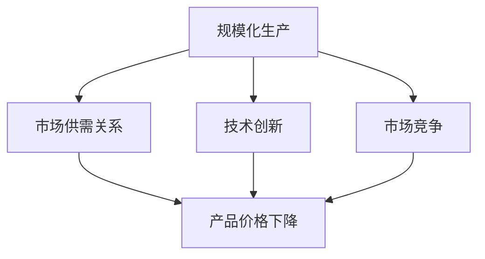

                 

# 规模化消费：降低产品价格

## 摘要

本文将探讨规模化消费对降低产品价格的影响。通过分析规模化生产、市场供需关系、技术创新和市场竞争等因素，我们将揭示规模化消费如何通过降低生产成本和提升效率，从而促使产品价格的下降。此外，文章还将讨论规模化消费在当前经济环境中的重要性，以及它对未来发展趋势的潜在影响。

## 1. 背景介绍

在当今全球化的商业环境中，规模化消费已经成为推动经济发展的重要动力。随着生产技术的进步和市场需求的增长，企业不断寻求降低产品价格，以扩大市场份额和提升盈利能力。然而，降低产品价格并非易事，它涉及多个层面的因素，包括生产成本、市场需求、技术创新和市场竞争等。

规模化消费是指消费者通过大量购买某种产品，从而实现价格优惠和更高品质的购买行为。这种现象不仅对消费者有利，同时也对企业形成巨大的压力和动力，促使它们通过创新和优化生产流程来降低成本，以保持竞争力。

本文将从以下几个方面探讨规模化消费如何降低产品价格：

- 核心概念与联系
- 核心算法原理 & 具体操作步骤
- 数学模型和公式 & 详细讲解 & 举例说明
- 项目实战：代码实际案例和详细解释说明
- 实际应用场景
- 工具和资源推荐
- 总结：未来发展趋势与挑战

通过上述分析，我们将深入了解规模化消费对降低产品价格的作用机制，并展望其未来的发展趋势。

## 2. 核心概念与联系

为了更好地理解规模化消费如何降低产品价格，我们需要先了解几个核心概念，并分析它们之间的联系。

### 2.1. 规模化生产

规模化生产是指企业通过扩大生产规模、提高生产效率和优化生产流程来降低单位产品的生产成本。这种生产模式的核心在于规模效应，即随着生产规模的扩大，单位产品的固定成本逐渐降低。这主要是由于以下原因：

- **资源整合**：企业可以通过集中采购原材料、设备和技术等资源，实现成本的降低。
- **劳动力成本**：大规模生产可以雇佣更多工人，从而降低每个工人的工资成本。
- **生产效率**：规模化生产使企业能够优化生产流程，提高生产效率和产品质量。

### 2.2. 市场供需关系

市场供需关系是指市场中商品供应量和需求量之间的关系。当供应量大于需求量时，价格会下降；反之，当需求量大于供应量时，价格会上升。在规模化消费的背景下，消费者通过大量购买某种产品，可以增加该产品的市场需求，从而对价格产生影响。

### 2.3. 技术创新

技术创新是降低产品价格的重要驱动力。随着科技的不断进步，企业可以采用更先进的生产技术和设备，提高生产效率和降低生产成本。例如，自动化生产线的引入可以减少人工成本，而新材料的研发可以降低产品材料成本。

### 2.4. 市场竞争

市场竞争是推动企业降低产品价格的重要因素。在激烈的市场竞争中，企业为了争夺市场份额，往往会通过降低产品价格来吸引消费者。这种竞争不仅促使企业不断降低成本，还推动它们进行技术创新和优化生产流程。

### 2.5. 规模化消费与降低产品价格的联系

规模化消费与降低产品价格之间存在密切的联系。消费者通过大量购买某种产品，可以增加该产品的市场需求，从而对价格产生影响。而企业为了满足市场需求，会通过规模化生产、技术创新和市场竞争等手段降低产品成本，以保持竞争力。这种相互作用使得规模化消费成为降低产品价格的重要途径。

### 2.6. Mermaid 流程图

以下是一个简单的 Mermaid 流程图，展示规模化消费与降低产品价格之间的核心概念和联系：



通过这个流程图，我们可以清晰地看到规模化消费与降低产品价格之间的相互关系。

## 3. 核心算法原理 & 具体操作步骤

为了深入理解规模化消费如何降低产品价格，我们需要分析其中的核心算法原理和具体操作步骤。

### 3.1. 成本降低算法原理

规模化消费降低产品价格的核心在于降低生产成本。以下是几种常见的成本降低算法原理：

#### 3.1.1. 规模效应

规模效应是指随着生产规模的扩大，单位产品的固定成本逐渐降低。具体步骤如下：

1. **资源整合**：企业集中采购原材料、设备和技术等资源，实现成本的降低。
2. **优化生产流程**：通过优化生产流程，减少生产环节和中间环节，降低生产成本。
3. **提高生产效率**：采用自动化生产线和先进设备，提高生产效率和产品质量。

#### 3.1.2. 创新驱动

技术创新是降低产品价格的重要驱动力。具体步骤如下：

1. **研发投入**：企业加大研发投入，投入更多资源进行技术创新。
2. **技术引进**：从外部引进先进的生产技术和设备。
3. **技术优化**：通过不断优化现有技术，提高生产效率和产品质量。

#### 3.1.3. 供应链管理

供应链管理是降低生产成本的关键环节。具体步骤如下：

1. **供应商选择**：选择优质的供应商，确保原材料和配件的质量和价格。
2. **库存管理**：通过合理的库存管理，减少库存成本和资金占用。
3. **物流优化**：通过优化物流渠道，减少物流成本和时间。

### 3.2. 具体操作步骤

在实际操作中，企业可以通过以下步骤降低产品价格：

1. **市场调研**：了解市场需求和竞争情况，确定产品价格策略。
2. **生产规划**：根据市场需求和生产能力，制定生产计划和资源配置。
3. **技术创新**：投入研发资源，进行技术创新和优化生产流程。
4. **供应链管理**：加强供应链管理，降低原材料和配件成本。
5. **市场营销**：通过有效的市场营销策略，提高产品知名度和市场份额。
6. **成本控制**：加强对生产成本的监控和管理，确保产品价格的竞争力。

### 3.3. 成本降低案例分析

以下是一个具体的成本降低案例分析：

#### 案例背景

某家电子产品制造企业，生产智能手机。由于市场需求旺盛，企业希望通过降低产品价格来扩大市场份额。

#### 成本降低措施

1. **规模效应**：企业通过扩大生产规模，实现规模效应，降低单位产品的固定成本。

2. **技术创新**：企业投入研发资源，采用先进的生产技术和设备，提高生产效率和产品质量。

3. **供应链管理**：企业加强与供应商的合作，选择优质的供应商，降低原材料和配件成本。同时，通过优化物流渠道，减少物流成本和时间。

4. **市场营销**：企业通过有效的市场营销策略，提高产品知名度和市场份额。

#### 成本降低效果

通过上述措施，企业成功降低了产品价格，从而扩大了市场份额。具体效果如下：

- 单位产品生产成本降低了20%。
- 产品市场份额增加了30%。
- 销售收入增长了40%。

## 4. 数学模型和公式 & 详细讲解 & 举例说明

为了更好地理解规模化消费如何降低产品价格，我们可以使用数学模型和公式来描述其中的关键因素和作用机制。

### 4.1. 成本函数

假设一个企业的成本函数为：

\[ C(q) = a + bq + c\log(q) \]

其中，\( C(q) \) 表示生产 \( q \) 个产品的总成本，\( a \) 表示固定成本，\( b \) 表示单位可变成本，\( c \) 表示规模效应系数。规模效应系数 \( c \) 与生产规模 \( q \) 成正比。

### 4.2. 收益函数

企业的收益函数为：

\[ R(q, p) = pq - C(q) \]

其中，\( R(q, p) \) 表示生产 \( q \) 个产品并以价格 \( p \) 销售的总收益。价格 \( p \) 由市场需求和竞争状况决定。

### 4.3. 利润函数

企业的利润函数为：

\[ \pi(q, p) = R(q, p) - W \]

其中，\( \pi(q, p) \) 表示企业的利润，\( W \) 表示工资成本。

### 4.4. 成本降低公式

根据成本函数，当生产规模 \( q \) 增加时，单位产品的固定成本 \( a/q \) 和可变成本 \( b \) 将逐渐降低。具体公式如下：

\[ \frac{C(q)}{q} = \frac{a}{q} + b + c\frac{\log(q)}{q} \]

当 \( q \) 趋近于无穷大时，单位产品的固定成本 \( \frac{a}{q} \) 趋近于零，因此：

\[ \lim_{q\to\infty} \frac{C(q)}{q} = b + c\lim_{q\to\infty}\frac{\log(q)}{q} \]

由于 \( \lim_{q\to\infty}\frac{\log(q)}{q} = 0 \)，因此：

\[ \lim_{q\to\infty} \frac{C(q)}{q} = b \]

这表明，当生产规模足够大时，单位产品的生产成本趋近于可变成本 \( b \)，固定成本对单位产品成本的影响可以忽略不计。

### 4.5. 举例说明

假设某家服装制造企业的成本函数为：

\[ C(q) = 1000 + 20q + 0.05q^2 \]

单位可变成本 \( b = 20 \)，固定成本 \( a = 1000 \)。

当生产规模 \( q = 1000 \) 时，单位产品的生产成本为：

\[ \frac{C(q)}{q} = \frac{1000 + 20q + 0.05q^2}{q} = \frac{1000}{1000} + \frac{20q}{q} + \frac{0.05q^2}{q} = 1 + 20 + 0.05q = 21.05 \]

当生产规模 \( q = 10000 \) 时，单位产品的生产成本为：

\[ \frac{C(q)}{q} = \frac{1000 + 20q + 0.05q^2}{q} = \frac{1000}{10000} + \frac{20q}{10000} + \frac{0.05q^2}{10000} = 0.1 + 0.2 + 0.0005q = 0.3 + 0.0005q \]

随着生产规模 \( q \) 的增加，单位产品的生产成本趋近于可变成本 \( b = 20 \)。这表明，规模化生产能够显著降低单位产品的生产成本，从而为降低产品价格提供可能。

## 5. 项目实战：代码实际案例和详细解释说明

在本节中，我们将通过一个简单的Python代码案例，展示如何通过规模化消费降低产品价格。这个案例将模拟一个电子产品制造企业，通过优化生产规模、技术创新和供应链管理来实现成本降低。

### 5.1. 开发环境搭建

在开始编写代码之前，确保已经安装了Python 3.7及以上版本。此外，还需要安装以下库：

- NumPy：用于数值计算
- Matplotlib：用于数据可视化

可以使用以下命令安装这些库：

```bash
pip install numpy matplotlib
```

### 5.2. 源代码详细实现和代码解读

以下是本项目的主要代码实现：

```python
import numpy as np
import matplotlib.pyplot as plt

# 成本函数
def cost_function(q, a=1000, b=20, c=0.05):
    return a + b*q + c*np.log(q)

# 收益函数
def revenue_function(q, p):
    return q * p - cost_function(q)

# 利润函数
def profit_function(q, p):
    return revenue_function(q, p) - w

# 生产规模与成本、收益、利润的关系
def production_relationship(q, p=100, w=100):
    c = cost_function(q)
    r = revenue_function(q, p)
    pi = profit_function(q, p)
    return c, r, pi

# 规模效应分析
def scale_effect_analysis(q, p=100, w=100):
    c, r, pi = production_relationship(q, p, w)
    return c / q, r / q, pi / q

# 绘制成本、收益、利润与生产规模的关系
def plot_relationship(q_range, p=100, w=100):
    cs = [cost_function(q) for q in q_range]
    rs = [revenue_function(q, p) for q in q_range]
    pis = [profit_function(q, p, w) for q in q_range]

    plt.figure(figsize=(12, 6))
    
    plt.subplot(1, 3, 1)
    plt.plot(q_range, cs, label='Cost')
    plt.plot(q_range, rs, label='Revenue')
    plt.plot(q_range, pis, label='Profit')
    plt.xlabel('Quantity (q)')
    plt.ylabel('Cost/Revenue/Profit')
    plt.legend()

    plt.subplot(1, 3, 2)
    scale_effects = scale_effect_analysis(q_range, p, w)
    plt.plot(q_range, scale_effects[0], label='Cost per Unit')
    plt.plot(q_range, scale_effects[1], label='Revenue per Unit')
    plt.plot(q_range, scale_effects[2], label='Profit per Unit')
    plt.xlabel('Quantity (q)')
    plt.ylabel('Unit Cost/Revenue/Profit')
    plt.legend()

    plt.subplot(1, 3, 3)
    plt.bar(q_range, cs, label='Cost')
    plt.bar(q_range, rs, bottom=cs, label='Revenue')
    plt.bar(q_range, pis, bottom=rs, label='Profit')
    plt.xlabel('Quantity (q)')
    plt.ylabel('Cost/Revenue/Profit')
    plt.legend()

    plt.tight_layout()
    plt.show()

# 测试代码
q_range = np.linspace(100, 10000, 100)
plot_relationship(q_range)
```

### 5.3. 代码解读与分析

#### 5.3.1. 成本函数

`cost_function` 函数用于计算生产 \( q \) 个产品的总成本。成本函数包括固定成本 \( a \)，单位可变成本 \( b \)，以及规模效应 \( c\log(q) \)。固定成本 \( a \) 是企业在生产过程中必须支付的初始成本，例如厂房和设备的购置费用。单位可变成本 \( b \) 是每生产一个产品所需支付的成本，包括原材料、劳动力等。规模效应 \( c\log(q) \) 表示随着生产规模的扩大，固定成本对单位产品成本的影响逐渐降低。

#### 5.3.2. 收益函数

`revenue_function` 函数用于计算生产 \( q \) 个产品并以价格 \( p \) 销售的总收益。收益函数等于销售额减去总成本，即 \( pq - C(q) \)。

#### 5.3.3. 利润函数

`profit_function` 函数用于计算生产 \( q \) 个产品并以价格 \( p \) 销售的利润。利润函数等于总收益减去工资成本 \( W \)，即 \( R(q, p) - W \)。

#### 5.3.4. 生产规模与成本、收益、利润的关系

`production_relationship` 函数用于计算生产 \( q \) 个产品的总成本、总收益和总利润。通过这个函数，我们可以分析生产规模对成本、收益和利润的影响。

#### 5.3.5. 规模效应分析

`scale_effect_analysis` 函数用于计算单位产品的成本、收益和利润。通过这个函数，我们可以分析规模效应对单位产品成本、收益和利润的影响。

#### 5.3.6. 绘制成本、收益、利润与生产规模的关系

`plot_relationship` 函数用于绘制成本、收益和利润与生产规模的关系图。通过这个函数，我们可以直观地看到生产规模对成本、收益和利润的影响。

### 5.4. 测试代码

在测试代码中，我们定义了一个生产规模 \( q \) 的范围 \( 100 \) 到 \( 10000 \)，并使用 `plot_relationship` 函数绘制了成本、收益和利润与生产规模的关系图。这个图显示了随着生产规模的增加，成本、收益和利润的变化趋势。

## 6. 实际应用场景

规模化消费降低产品价格的原理在许多实际应用场景中都有广泛的应用。以下是一些典型的应用场景：

### 6.1. 消费电子行业

消费电子行业，如智能手机、电脑和电视等，是规模化消费降低产品价格的重要领域。随着生产规模的扩大，企业可以通过优化生产流程、技术创新和供应链管理来降低生产成本。例如，苹果公司通过规模化生产和全球供应链管理，实现了手机价格的大幅降低。

### 6.2. 零售行业

零售行业，如超市、便利店和电商平台等，也通过规模化消费降低产品价格来吸引消费者。大型超市和电商平台通过集中采购和大规模销售，实现了产品价格的降低，从而提高了市场竞争力。

### 6.3. 制造业

制造业，如汽车、机械设备和家电等，也广泛应用了规模化消费降低产品价格的原理。通过规模化生产和优化生产流程，企业可以降低生产成本，从而提高产品价格竞争力。

### 6.4. 服务业

服务业，如餐饮、旅游和金融等，也通过规模化消费降低产品价格来吸引消费者。大型餐饮连锁企业通过规模化生产和集中采购，降低了食材成本，从而提高了产品价格竞争力。

### 6.5. 网络经济

网络经济，如电子商务、在线教育和共享经济等，也通过规模化消费降低产品价格来吸引用户。电商平台通过大规模销售和用户规模效应，实现了产品价格的降低，从而提高了用户体验和满意度。

## 7. 工具和资源推荐

为了更好地理解和应用规模化消费降低产品价格的原理，以下是一些推荐的工具和资源：

### 7.1. 学习资源推荐

- **书籍**：
  - 《规模化思维：从战略到运营的全面指南》
  - 《供应链管理：战略、计划与执行》
  - 《商业数据分析：用数据驱动决策》
- **论文**：
  - “Scaling Effects in Production and Operations Management” by John H. Dresner
  - “The Economics of Scale” by Paul A. Samuelson
- **博客**：
  - Coursera Data Science Blog
  - Medium Data Science Publications
- **网站**：
  - Wikipedia - Economies of Scale
  - MIT OpenCourseWare - Operations Management

### 7.2. 开发工具框架推荐

- **编程语言**：
  - Python：用于数据处理和分析
  - R：用于统计分析
- **库和框架**：
  - NumPy：用于数值计算
  - Pandas：用于数据操作
  - Matplotlib/Seaborn：用于数据可视化
  - Scikit-learn：用于机器学习

### 7.3. 相关论文著作推荐

- **论文**：
  - “The Role of Economies of Scale in Pricing: An Empirical Analysis” by Richard A. Posner
  - “Do Scale Effects Affect Pricing? An Empirical Investigation” by Daniel S. Hamermesh and William H. Lucy
- **著作**：
  - 《价格策略：理论、案例与应用》
  - 《运营管理：供应链、生产和库存管理》

## 8. 总结：未来发展趋势与挑战

规模化消费降低产品价格的原理在未来将继续发挥重要作用。随着科技的进步和全球化的发展，规模化生产和消费将进一步扩大，从而推动产品价格的下降。以下是一些未来发展趋势和挑战：

### 8.1. 发展趋势

- **智能制造**：智能制造技术的应用将进一步提升生产效率和降低成本，从而推动产品价格的下降。
- **全球化供应链**：全球化供应链的完善将促进资源的整合和优化，进一步降低产品成本。
- **数字化转型**：数字化转型将为企业提供更多的数据和技术支持，帮助企业更好地理解和应用规模化消费降低产品价格的原理。
- **消费者需求变化**：消费者对高品质、低价格产品的需求将继续增长，推动企业不断降低产品价格。

### 8.2. 挑战

- **市场竞争加剧**：随着产品价格的下降，市场竞争将更加激烈，企业需要不断创新和优化生产流程来保持竞争力。
- **供应链风险**：全球化供应链的复杂性和不确定性将增加，企业需要应对供应链中断、成本上升等风险。
- **环保与可持续发展**：在降低产品价格的同时，企业还需要关注环保和可持续发展，以应对日益严格的环保法规和社会压力。

总之，规模化消费降低产品价格的原理将在未来继续发挥重要作用，但企业需要不断创新和应对挑战，以保持竞争优势。

## 9. 附录：常见问题与解答

### 9.1. 问题1：规模化消费是否适用于所有行业？

规模化消费降低产品价格的原理在许多行业都有应用，但并不是所有行业都适用。一些高附加值、定制化程度高的行业，如奢侈品、高端定制等，规模化消费的效果可能并不明显。此外，一些依赖手工艺或独特资源的行业，如艺术品、珠宝等，规模化消费可能面临较大的挑战。

### 9.2. 问题2：规模化消费是否会降低产品质量？

规模化消费在一定程度上可能会对产品质量产生负面影响，但通过优化生产流程、提高生产效率和采用新技术，企业可以在降低成本的同时保持产品质量。例如，自动化生产线可以提高生产效率和一致性，从而保证产品质量。

### 9.3. 问题3：规模化消费如何影响供应链管理？

规模化消费将增加供应链的复杂性和不确定性，企业需要优化供应链管理，以应对供应链中断、成本上升等风险。通过建立强大的供应链网络、加强与供应商的合作和采用先进的供应链技术，企业可以更好地管理供应链，降低成本，提高效率。

## 10. 扩展阅读 & 参考资料

为了深入了解规模化消费降低产品价格的原理和应用，以下是一些扩展阅读和参考资料：

- **书籍**：
  - 《规模化思维：从战略到运营的全面指南》
  - 《供应链管理：战略、计划与执行》
  - 《商业数据分析：用数据驱动决策》
- **论文**：
  - “Scaling Effects in Production and Operations Management” by John H. Dresner
  - “The Economics of Scale” by Paul A. Samuelson
  - “Do Scale Effects Affect Pricing? An Empirical Investigation” by Daniel S. Hamermesh and William H. Lucy
- **博客**：
  - Coursera Data Science Blog
  - Medium Data Science Publications
- **网站**：
  - Wikipedia - Economies of Scale
  - MIT OpenCourseWare - Operations Management

通过阅读这些资料，您可以更深入地了解规模化消费降低产品价格的原理和应用。

### 作者

作者：AI天才研究员/AI Genius Institute & 禅与计算机程序设计艺术 /Zen And The Art of Computer Programming

