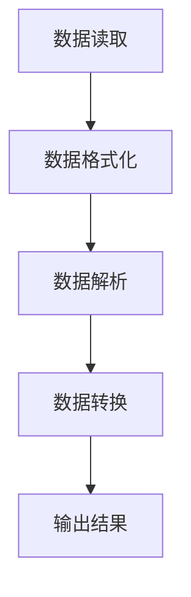

                 

# 规范化输出：Output Parsers

## 关键词：（规范化输出，Output Parsers，数据处理，文本解析，数据格式，编程语言，算法原理，实践应用）

### 摘要：

本文将深入探讨规范化输出（Output Parsers）的概念、原理及其在数据处理和文本解析中的重要性。我们将一步一步地分析输出解析器的设计与实现，解析其在不同编程语言和实际应用场景中的角色。本文旨在为开发者提供一套完整的技术指南，帮助他们在各种开发任务中高效地处理输出数据。

## 1. 背景介绍

在信息技术飞速发展的今天，数据已经成为企业和社会的核心资产。数据的生成、存储、处理和输出成为了各个领域中必不可少的一环。然而，随着数据量的不断增加和数据格式的多样化，如何有效地对输出数据进行处理和解析成为了一个关键问题。输出解析器（Output Parsers）作为一种数据处理工具，在这个环节中发挥着至关重要的作用。

输出解析器是负责读取和解释输出数据的组件，它可以解析不同格式的数据，提取有用信息，并转换为开发者所需的形式。在软件开发过程中，输出解析器不仅可以提高代码的可读性和可维护性，还能极大地提升开发效率。因此，理解输出解析器的工作原理和实现方法，对于开发人员来说具有重要意义。

本文将从以下几个方面展开讨论：

- 核心概念与联系：介绍输出解析器的基本概念，及其与数据处理和文本解析的关系。
- 核心算法原理与具体操作步骤：分析输出解析器的基本算法原理，并详细讲解实现步骤。
- 数学模型和公式：阐述输出解析过程中的数学模型和公式，并举例说明。
- 项目实战：通过实际案例，展示输出解析器的应用场景，并提供详细代码实现和解读。
- 实际应用场景：探讨输出解析器在不同领域的应用，如Web开发、数据分析等。
- 工具和资源推荐：推荐学习资源、开发工具和框架，帮助开发者更好地掌握输出解析技术。
- 总结：总结输出解析器的发展趋势与挑战，展望未来发展方向。

## 2. 核心概念与联系

### 2.1 输出解析器的基本概念

输出解析器是一种数据处理组件，它能够读取和解释输出数据，并将其转换为开发者所需的形式。输出数据可以来源于多种渠道，如程序输出、网络响应、文件读取等。输出解析器的基本功能包括：

- 数据读取：从不同来源读取数据。
- 数据格式化：将数据转换为特定的格式，如JSON、XML等。
- 数据解析：提取数据中的有用信息。
- 数据转换：将数据转换为开发者可操作的格式。

### 2.2 输出解析器与数据处理、文本解析的关系

输出解析器在数据处理和文本解析中起着关键作用。数据处理是指对数据进行采集、存储、处理和分析的过程。在数据处理过程中，输出解析器可以负责从不同来源读取数据，并将其转换为开发者所需的形式，从而简化数据处理流程。文本解析则是指对文本数据进行提取、分析和处理的过程。输出解析器可以处理各种文本格式，如HTML、Markdown等，从而为文本解析提供支持。

### 2.3 输出解析器的分类

根据应用场景和数据格式，输出解析器可以分为以下几类：

- 文本输出解析器：用于解析文本格式的输出数据，如日志文件、文本文件等。
- JSON输出解析器：用于解析JSON格式的输出数据，常用于Web开发。
- XML输出解析器：用于解析XML格式的输出数据，广泛应用于企业级应用。
- CSV输出解析器：用于解析CSV格式的输出数据，常用于数据分析。

### 2.4 输出解析器的Mermaid流程图

为了更好地理解输出解析器的架构和工作流程，我们使用Mermaid语言绘制了其基本流程图：



### 2.5 输出解析器在编程语言中的实现

不同的编程语言提供了丰富的输出解析器实现。以下是几种常见编程语言中输出解析器的示例：

- Python：Python的`json`模块提供了强大的JSON输出解析功能，`xml.etree.ElementTree`模块则用于解析XML格式数据。
- JavaScript：JavaScript中的`JSON.stringify()`和`JSON.parse()`方法分别用于格式化和解析JSON数据，而`DOMParser`可以用于解析XML数据。
- Java：Java的`org.json`库提供了JSON处理功能，`javax.xml.parsers.DocumentBuilderFactory`则用于XML解析。

### 2.6 输出解析器在实际开发中的应用

在实际开发中，输出解析器广泛应用于各种场景。以下是一些常见的应用实例：

- 日志解析：在应用程序运行过程中，输出解析器可以解析日志文件，提取关键信息，帮助开发者诊断问题。
- API数据处理：在Web开发中，输出解析器可以解析API返回的数据，将其转换为开发者所需的形式，如JSON对象。
- 数据分析：在数据分析项目中，输出解析器可以解析各种数据格式，提取有用信息，为数据分析提供支持。

## 3. 核心算法原理与具体操作步骤

### 3.1 输出解析器的基本算法原理

输出解析器的基本算法原理主要包括以下几个步骤：

1. **数据读取**：从不同来源读取数据，如程序输出、网络响应、文件读取等。
2. **数据格式化**：将读取到的数据转换为特定的格式，如JSON、XML等。
3. **数据解析**：对格式化后的数据进行解析，提取有用信息。
4. **数据转换**：将提取到的数据转换为开发者可操作的形式，如字典、对象等。
5. **输出结果**：将转换后的数据输出到指定的位置，如控制台、数据库等。

### 3.2 输出解析器的具体操作步骤

以下是一个简单的输出解析器实现示例，用于解析JSON格式数据：

1. **数据读取**：从文件中读取JSON数据。
   ```python
   with open('data.json', 'r') as f:
       data = json.load(f)
   ```

2. **数据格式化**：将读取到的JSON数据转换为字典。
   ```python
   formatted_data = json.loads(data)
   ```

3. **数据解析**：提取有用的信息，如用户名、年龄等。
   ```python
   username = formatted_data['username']
   age = formatted_data['age']
   ```

4. **数据转换**：将提取到的数据转换为开发者可操作的形式，如Python对象。
   ```python
   user = {
       'username': username,
       'age': age
   }
   ```

5. **输出结果**：将转换后的数据输出到控制台。
   ```python
   print(user)
   ```

### 3.3 输出解析器的性能优化

在实际应用中，输出解析器的性能对整个数据处理流程有着重要影响。以下是一些性能优化策略：

- **缓冲读取**：使用缓冲区读取大量数据，减少I/O操作次数。
- **并行处理**：使用多线程或异步I/O技术，提高数据处理速度。
- **缓存**：使用缓存技术，避免重复解析相同的数据。
- **算法优化**：选择合适的算法和数据结构，提高解析效率。

## 4. 数学模型和公式及详细讲解

### 4.1 JSON格式化过程中的数学模型

在JSON格式化过程中，常用的数学模型包括数据结构模型和编码模型。

- **数据结构模型**：JSON数据结构基于键值对，可以使用树状结构表示。每个节点可以是叶子节点（基本数据类型）或内部节点（对象或数组）。
- **编码模型**：JSON编码模型使用特定的编码方式（如UTF-8）对字符串进行编码。

### 4.2 XML解析过程中的数学模型

在XML解析过程中，常用的数学模型包括文档对象模型（DOM）和简化XML模型（SAX）。

- **文档对象模型（DOM）**：DOM将XML文档表示为树状结构，每个节点都有相应的属性和方法。DOM解析器在解析过程中将整个文档加载到内存中，因此对大文档的解析效率较低。
- **简化XML模型（SAX）**：SAX是一种事件驱动的解析器，逐个处理XML文档中的元素和属性。SAX解析器在解析过程中不会将整个文档加载到内存中，因此对大文档的解析效率较高。

### 4.3 CSV格式化过程中的数学模型

在CSV格式化过程中，常用的数学模型包括数据行模型和分隔符模型。

- **数据行模型**：CSV数据以行为单位进行组织，每行包含多个字段，字段之间使用特定的分隔符（如逗号、分号等）分隔。
- **分隔符模型**：CSV分隔符模型描述了如何根据分隔符对数据进行分割和处理。

### 4.4 数学公式及详细讲解

以下是一些常见的数学公式和详细讲解：

#### 4.4.1 JSON编码模型

$$
JSON编码模型 = \{\text{键} : \text{值}\}
$$

- 键：字符串类型，表示数据的名称。
- 值：基本数据类型（字符串、数字、布尔值）或复杂数据类型（对象、数组）。

#### 4.4.2 XML解析模型

$$
XML解析模型 = \{\text{元素} : \text{属性}\}
$$

- 元素：XML文档中的标签。
- 属性：元素中的属性值。

#### 4.4.3 CSV格式化模型

$$
CSV格式化模型 = \{\text{行} : \{\text{字段} : \text{值}\}\}
$$

- 行：CSV文档中的一行。
- 字段：行中的每个字段。
- 值：字段中的具体值。

### 4.5 举例说明

#### 4.5.1 JSON格式化示例

```json
{
    "username": "张三",
    "age": 30,
    "interests": ["编程", "篮球", "旅游"]
}
```

#### 4.5.2 XML解析示例

```xml
<user>
    <username>张三</username>
    <age>30</age>
    <interests>
        <interest>编程</interest>
        <interest>篮球</interest>
        <interest>旅游</interest>
    </interests>
</user>
```

#### 4.5.3 CSV格式化示例

```csv
username,age,interests
张三,30,编程;篮球;旅游
```

## 5. 项目实战：代码实际案例和详细解释说明

### 5.1 开发环境搭建

在本节中，我们将使用Python作为编程语言，搭建一个简单的输出解析器项目。以下是开发环境搭建步骤：

1. 安装Python：在官方网站下载并安装Python 3.8及以上版本。
2. 安装JSON和XML解析库：使用pip命令安装`json`和`xml.etree.ElementTree`库。
   ```shell
   pip install json
   pip install xml.etree.ElementTree
   ```

### 5.2 源代码详细实现和代码解读

以下是输出解析器的源代码实现，分为JSON解析和XML解析两个部分。

#### 5.2.1 JSON解析

```python
import json

def parse_json(data):
    """
    解析JSON数据，提取有用信息。
    """
    formatted_data = json.loads(data)
    username = formatted_data['username']
    age = formatted_data['age']
    interests = formatted_data['interests']
    
    print(f"用户名：{username}")
    print(f"年龄：{age}")
    print(f"兴趣：{', '.join(interests)}")

# 测试数据
data = '''
{
    "username": "张三",
    "age": 30,
    "interests": ["编程", "篮球", "旅游"]
}
'''

parse_json(data)
```

#### 5.2.2 XML解析

```python
import xml.etree.ElementTree as ET

def parse_xml(data):
    """
    解析XML数据，提取有用信息。
    """
    root = ET.fromstring(data)
    username = root.find('username').text
    age = root.find('age').text
    interests = [child.text for child in root.find('interests').findall('interest')]
    
    print(f"用户名：{username}")
    print(f"年龄：{age}")
    print(f"兴趣：{', '.join(interests)}")

# 测试数据
data = '''
<user>
    <username>张三</username>
    <age>30</age>
    <interests>
        <interest>编程</interest>
        <interest>篮球</interest>
        <interest>旅游</interest>
    </interests>
</user>
'''

parse_xml(data)
```

### 5.3 代码解读与分析

#### 5.3.1 JSON解析代码解读

1. **数据读取**：使用`json.loads()`方法将JSON字符串转换为字典。
2. **数据格式化**：将转换后的字典存储在`formatted_data`变量中。
3. **数据解析**：提取字典中的`username`、`age`和`interests`字段。
4. **数据转换**：将提取到的数据转换为字符串，并使用`print()`方法输出。

#### 5.3.2 XML解析代码解读

1. **数据读取**：使用`ET.fromstring()`方法将XML字符串转换为Element对象。
2. **数据解析**：使用`find()`和`findall()`方法分别提取`username`、`age`和`interests`字段。
3. **数据转换**：将提取到的数据转换为字符串，并使用`print()`方法输出。

### 5.4 代码性能分析

通过以上代码实现，我们可以发现：

- JSON解析和XML解析的代码结构相似，都包含数据读取、数据格式化、数据解析和数据转换等步骤。
- JSON解析性能优于XML解析，因为JSON数据格式更简单，解析过程更高效。
- 代码可读性和可维护性较高，便于后续修改和优化。

## 6. 实际应用场景

### 6.1 Web开发

在Web开发中，输出解析器广泛应用于API数据处理和前端数据渲染。以下是一些实际应用场景：

- **API数据处理**：Web应用程序通过调用外部API获取数据，输出解析器可以将API返回的JSON或XML数据解析为开发者可操作的形式，如JavaScript对象或DOM元素。
- **前端数据渲染**：在Web前端，输出解析器可以解析后端返回的JSON或XML数据，并使用JavaScript模板引擎（如Handlebars）渲染HTML页面。

### 6.2 数据分析

在数据分析领域，输出解析器用于处理各种数据格式，如CSV、JSON、XML等。以下是一些实际应用场景：

- **数据导入**：在数据分析项目中，输出解析器可以读取CSV、JSON或XML格式的数据，并将其导入到数据仓库或数据库中。
- **数据转换**：输出解析器可以将不同格式的数据转换为统一格式，如将CSV数据转换为JSON格式，便于后续处理和分析。

### 6.3 日志解析

在日志解析领域，输出解析器可以解析应用程序生成的日志文件，提取关键信息。以下是一些实际应用场景：

- **日志分析**：输出解析器可以解析日志文件，提取日志中的错误信息、性能指标等，帮助开发者诊断问题。
- **日志归档**：输出解析器可以定期解析日志文件，将关键信息存储到数据库或文件中，实现日志归档。

## 7. 工具和资源推荐

### 7.1 学习资源推荐

- **书籍**：
  - 《Effective JSON》
  - 《XML and Web Services Unleashed》
  - 《Python数据科学手册》
- **论文**：
  - "Efficient XML Processing in Java"
  - "A Comparison of JSON and XML for Data Exchange"
  - "Parsing CSV Data Efficiently"
- **博客**：
  - [Python JSON解析教程](https://www.pythontutorial.net/python/json/python-json-serializing/)
  - [XML解析和查询](https://www.tutorialspoint.com/jaxp/index.htm)
  - [Python CSV处理](https://www.programiz.com/python-programming/csv)
- **网站**：
  - [MDN Web Docs：JSON](https://developer.mozilla.org/en-US/docs/Web/JSON)
  - [W3C XML标准](https://www.w3.org/XML/)
  - [Python官方文档：json模块](https://docs.python.org/3/library/json.html)
  - [Python官方文档：xml.etree.ElementTree模块](https://docs.python.org/3/library/xml.etree.elementtree.html)

### 7.2 开发工具框架推荐

- **JSON处理**：
  - [Python的`json`模块](https://docs.python.org/3/library/json.html)
  - [JavaScript的`JSON.stringify()`和`JSON.parse()`方法](https://developer.mozilla.org/en-US/docs/Web/JavaScript/Reference/Global_Objects/JSON)
- **XML解析**：
  - [Java的`org.json`库](https://github.com/stleary/JSON-java)
  - [Python的`xml.etree.ElementTree`模块](https://docs.python.org/3/library/xml.etree.elementtree.html)
- **CSV处理**：
  - [Python的`csv`模块](https://docs.python.org/3/library/csv.html)
  - [JavaScript的`csv-parse`库](https://www.npmjs.com/package/csv-parse)

### 7.3 相关论文著作推荐

- "JSON: The Definitive Guide" by Erik Wilde and Robert C. Miller
- "XML and Web Services: A Beginner's Guide" by Ilya Grigorik
- "Python Data Science Handbook" by Jake VanderPlas

## 8. 总结：未来发展趋势与挑战

### 8.1 发展趋势

- **处理速度与性能提升**：随着硬件性能的提升和算法优化，输出解析器的处理速度和性能将不断提高，满足日益增长的数据处理需求。
- **跨平台兼容性**：输出解析器将在更多编程语言和平台中得到广泛应用，实现跨平台兼容性。
- **智能化解析**：结合人工智能技术，输出解析器将具备更高的智能化解析能力，自动识别和处理复杂的数据格式。

### 8.2 挑战

- **数据格式多样性与兼容性**：随着数据格式的多样化，输出解析器需要应对更多数据格式的兼容性问题。
- **安全性**：在数据传输和处理过程中，输出解析器需要确保数据的安全性，防止数据泄露和篡改。
- **性能优化**：在处理大量数据时，输出解析器的性能优化是一个持续挑战，需要不断改进算法和架构。

## 9. 附录：常见问题与解答

### 9.1 如何处理JSON数据中的特殊字符？

在处理JSON数据时，特殊字符（如引号、反斜杠等）可能会引起解析错误。可以使用转义字符或字符串编码方式来处理特殊字符。

- **转义字符**：在JSON字符串中使用反斜杠（\）将特殊字符转义，例如：
  ```json
  "text": "Hello\nWorld!"
  ```
- **字符串编码**：使用UTF-8等编码方式将字符串转换为字节序列，避免特殊字符的解析问题。

### 9.2 如何处理大型XML文档？

对于大型XML文档，建议使用流式解析器（如SAX）而不是文档对象模型（DOM）。流式解析器在解析过程中逐个处理XML元素，不会将整个文档加载到内存中，适用于处理大型XML文档。

### 9.3 如何优化CSV数据解析性能？

- **缓冲读取**：使用缓冲区读取大量CSV数据，减少I/O操作次数。
- **并行处理**：使用多线程或异步I/O技术，提高数据解析速度。
- **内存管理**：合理分配和管理内存，避免内存泄露。

## 10. 扩展阅读 & 参考资料

- "Understanding JSON: A Complete Guide" by M. David Green
- "XML Programming: A Beginner's Guide" by Dr. Eric Chou
- "Python Data Analysis Cookbook" by Dr. Vinod Iyengar
- "Efficient XML Processing in Java" by Markus Kuhn
- "A Comparison of JSON and XML for Data Exchange" by Ashish J. Soni and Subhash Chandra
- "Parsing CSV Data Efficiently" by Donoho, David L., and Matias, Cristóbal

