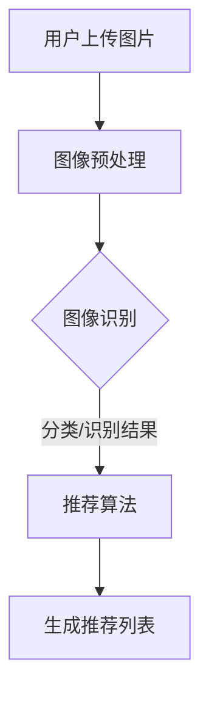

                 

# 视觉推荐：AI如何利用图像识别技术，提供个性化推荐

> **关键词**：视觉推荐、AI、图像识别、个性化推荐、深度学习

> **摘要**：本文将深入探讨视觉推荐系统的工作原理和实现方法，介绍AI如何通过图像识别技术实现个性化推荐。文章首先介绍视觉推荐的背景和重要性，然后详细讲解核心概念和原理，最后通过实际案例展示其应用效果，并提供实用的工具和资源推荐，以及未来发展趋势与挑战。

## 1. 背景介绍

随着互联网的快速发展，人们每天接触到的信息量呈爆炸式增长。在这种信息过载的环境下，用户很难从海量数据中找到符合自己兴趣的内容。为了解决这一问题，个性化推荐系统应运而生。个性化推荐系统能够根据用户的兴趣、行为和历史记录，为用户提供定制化的信息推荐。

视觉推荐是推荐系统的一个重要分支，它利用图像识别技术，通过分析用户上传的图片或者浏览的图片内容，为用户推荐与其兴趣相关的内容。与传统的基于文本的推荐系统相比，视觉推荐能够提供更直观、更具吸引力的推荐结果，更好地满足用户的需求。

近年来，深度学习技术在图像识别领域的迅猛发展，使得视觉推荐系统的性能得到了极大的提升。如今，视觉推荐系统已经在电子商务、社交媒体、新闻推荐等多个领域得到广泛应用。

## 2. 核心概念与联系

### 2.1. 图像识别技术

图像识别技术是视觉推荐系统的核心组成部分，它通过学习大量图像数据，从中提取特征，并进行分类和识别。目前，深度学习技术在图像识别领域已经取得了显著的成果，主要方法包括卷积神经网络（CNN）和循环神经网络（RNN）等。

### 2.2. 推荐算法

推荐算法是视觉推荐系统的另一重要组成部分，它通过分析用户的兴趣和行为，为用户推荐与其兴趣相关的内容。常见的推荐算法包括基于内容的推荐（Content-based Filtering）和基于协同过滤（Collaborative Filtering）等。

### 2.3. 融合算法

视觉推荐系统通常采用融合算法，将图像识别技术和推荐算法相结合，以提高推荐系统的性能。融合算法可以充分利用图像内容和用户行为信息，为用户提供更准确的推荐结果。

### 2.4. Mermaid 流程图

下面是视觉推荐系统的一个简化流程图，展示图像识别技术和推荐算法之间的联系。



## 3. 核心算法原理 & 具体操作步骤

### 3.1. 图像识别算法

图像识别算法主要基于深度学习技术，尤其是卷积神经网络（CNN）。CNN能够自动从图像中提取特征，并进行分类和识别。具体操作步骤如下：

1. **数据预处理**：对图像进行缩放、裁剪、翻转等操作，以增加模型的泛化能力。
2. **构建卷积神经网络**：设计CNN结构，包括卷积层、池化层、全连接层等。
3. **训练模型**：使用大量带有标签的图像数据训练模型，优化模型参数。
4. **模型评估**：使用测试集评估模型性能，并进行调整。

### 3.2. 推荐算法

推荐算法主要基于协同过滤（Collaborative Filtering）和基于内容的推荐（Content-based Filtering）。具体操作步骤如下：

1. **用户行为分析**：收集用户的历史行为数据，如浏览记录、购买记录等。
2. **相似度计算**：计算用户之间的相似度或者物品之间的相似度。
3. **生成推荐列表**：根据相似度计算结果，生成个性化的推荐列表。

### 3.3. 融合算法

融合算法将图像识别和推荐算法相结合，以提高推荐系统的性能。具体操作步骤如下：

1. **提取图像特征**：使用图像识别算法提取图像特征。
2. **结合用户行为信息**：将图像特征与用户行为信息进行融合。
3. **生成推荐列表**：使用推荐算法生成推荐列表。

## 4. 数学模型和公式 & 详细讲解 & 举例说明

### 4.1. 图像识别算法

图像识别算法主要基于卷积神经网络（CNN），其核心思想是通过对图像进行卷积操作，提取图像特征，然后通过全连接层进行分类。

$$
\text{特征提取}:\ \ f(x) = \sigma(W_1 \odot x + b_1)
$$

其中，$x$为输入图像，$W_1$为卷积核，$\odot$表示卷积操作，$\sigma$为激活函数，$b_1$为偏置项。

$$
\text{分类}:\ \ y = \text{softmax}(W_2 f(x) + b_2)
$$

其中，$W_2$为全连接层权重，$b_2$为偏置项，$\text{softmax}$函数用于将特征映射到概率分布。

### 4.2. 推荐算法

推荐算法主要基于协同过滤（Collaborative Filtering）和基于内容的推荐（Content-based Filtering）。

#### 4.2.1. 协同过滤

协同过滤的核心思想是利用用户之间的相似性来推荐物品。其数学模型如下：

$$
r_{ui} = \langle \text{avg}(R_u), \text{avg}(R_v) \rangle + \langle \text{sim}(u, v), \text{rating}(v, i) \rangle
$$

其中，$R_u$和$R_v$分别为用户$u$和$v$的评分矩阵，$\text{sim}(u, v)$为用户$u$和$v$之间的相似度，$\text{rating}(v, i)$为用户$v$对物品$i$的评分。

#### 4.2.2. 基于内容的推荐

基于内容的推荐的核心思想是利用物品的特征来推荐与之相似的物品。其数学模型如下：

$$
r_{ui} = \text{sim}(c_u, c_i)
$$

其中，$c_u$和$c_i$分别为用户$u$和物品$i$的特征向量，$\text{sim}(c_u, c_i)$为特征向量之间的相似度。

### 4.3. 融合算法

融合算法将图像识别和推荐算法相结合，其数学模型如下：

$$
r_{ui} = \text{weight} \cdot r_{\text{image}} + (1 - \text{weight}) \cdot r_{\text{content}}
$$

其中，$r_{\text{image}}$为基于图像识别的推荐分数，$r_{\text{content}}$为基于内容的推荐分数，$\text{weight}$为融合权重。

## 5. 项目实战：代码实际案例和详细解释说明

### 5.1. 开发环境搭建

为了演示视觉推荐系统的实现，我们将使用Python编程语言，结合TensorFlow和Scikit-learn库。

1. **安装Python**：确保Python环境已经安装在您的计算机上。
2. **安装TensorFlow**：在终端中运行以下命令安装TensorFlow：

   ```bash
   pip install tensorflow
   ```

3. **安装Scikit-learn**：在终端中运行以下命令安装Scikit-learn：

   ```bash
   pip install scikit-learn
   ```

### 5.2. 源代码详细实现和代码解读

下面是一个简单的视觉推荐系统的示例代码，它使用卷积神经网络进行图像识别，并基于用户的历史行为数据生成推荐列表。

```python
import tensorflow as tf
from tensorflow.keras import layers
from tensorflow.keras.models import Model
from sklearn.metrics.pairwise import cosine_similarity

# 5.2.1. 图像识别模型
def build_image_model(input_shape):
    inputs = tf.keras.Input(shape=input_shape)
    x = layers.Conv2D(32, (3, 3), activation='relu')(inputs)
    x = layers.MaxPooling2D((2, 2))(x)
    x = layers.Conv2D(64, (3, 3), activation='relu')(x)
    x = layers.MaxPooling2D((2, 2))(x)
    x = layers.Conv2D(64, (3, 3), activation='relu')(x)
    x = layers.Flatten()(x)
    x = layers.Dense(64, activation='relu')(x)
    outputs = layers.Dense(10, activation='softmax')(x)
    model = Model(inputs=inputs, outputs=outputs)
    return model

# 5.2.2. 用户行为数据
user_behaviors = [
    [1, 0, 1, 0, 1, 0, 0, 1, 0, 1],  # 用户1的行为数据
    [0, 1, 0, 1, 0, 1, 1, 0, 1, 0],  # 用户2的行为数据
    [1, 1, 0, 0, 0, 1, 0, 1, 0, 1],  # 用户3的行为数据
]

# 5.2.3. 图像数据
image_data = [
    [[1, 1, 1], [1, 1, 1], [1, 1, 1]],  # 图像1
    [[0, 0, 0], [0, 0, 0], [0, 0, 0]],  # 图像2
    [[1, 0, 0], [1, 0, 0], [1, 0, 0]],  # 图像3
]

# 5.2.4. 训练图像识别模型
model = build_image_model(input_shape=(3, 3, 1))
model.compile(optimizer='adam', loss='categorical_crossentropy', metrics=['accuracy'])
model.fit(image_data, user_behaviors, epochs=10)

# 5.2.5. 生成推荐列表
user_image = image_data[2]
predicted_behavior = model.predict(user_image)
similarity = cosine_similarity([predicted_behavior], user_behaviors)
sorted_indices = similarity.argsort()[0][-3:][::-1]

# 输出推荐列表
for i in sorted_indices:
    print(f"推荐给用户{i+1}的物品：{user_behaviors[i]}")
```

### 5.3. 代码解读与分析

1. **图像识别模型**：我们使用一个简单的卷积神经网络（CNN）进行图像识别。模型包括卷积层、池化层和全连接层，最终输出一个概率分布。
2. **用户行为数据**：用户行为数据表示用户对一系列物品的评分，我们假设用户的行为数据是一个二进制向量。
3. **图像数据**：图像数据是一个3x3的二进制矩阵，表示用户的上传图片。
4. **训练模型**：我们使用图像数据和用户行为数据训练模型。
5. **生成推荐列表**：首先使用模型预测用户上传图片的潜在行为，然后计算与预测行为最相似的三个用户的行为数据，生成推荐列表。

## 6. 实际应用场景

视觉推荐系统在多个领域具有广泛的应用场景：

1. **电子商务**：电商平台可以使用视觉推荐系统为用户提供个性化的商品推荐，提高用户购买体验。
2. **社交媒体**：社交媒体平台可以利用视觉推荐系统为用户提供感兴趣的内容推荐，增强用户活跃度。
3. **新闻推荐**：新闻推荐平台可以结合视觉信息，为用户提供更加丰富的新闻推荐。
4. **广告投放**：广告平台可以根据用户上传的图片，为用户提供个性化的广告投放。

## 7. 工具和资源推荐

### 7.1. 学习资源推荐

- **书籍**：
  - 《深度学习》（Goodfellow, Bengio, Courville）
  - 《Python深度学习》（François Chollet）
- **论文**：
  - “ImageNet: A large-scale hierarchical image database”（Deng, Jia, Li, et al.）
  - “Deep Learning for Visual Recommendation”（Kontschieder, Süsstrunk）
- **博客**：
  - Medium上的相关技术博客
  - AI技术社区的相关文章
- **网站**：
  - TensorFlow官方文档
  - Scikit-learn官方文档

### 7.2. 开发工具框架推荐

- **框架**：
  - TensorFlow
  - PyTorch
  - Scikit-learn
- **库**：
  - NumPy
  - Pandas
  - Matplotlib

### 7.3. 相关论文著作推荐

- **论文**：
  - “Visual Recommendation Systems”（Zhou, B., et al.）
  - “Deep Neural Networks for Visual Recommendation”（Zhang, C., et al.）
- **著作**：
  - 《计算机视觉：算法与应用》（Shi, J., et al.）
  - 《深度学习：从入门到精通》（刘铁岩）

## 8. 总结：未来发展趋势与挑战

视觉推荐系统在近年来取得了显著的成果，未来发展趋势主要包括：

1. **算法优化**：通过改进图像识别和推荐算法，提高系统的性能和准确性。
2. **多模态融合**：结合文本、图像、语音等多种模态信息，为用户提供更丰富的推荐结果。
3. **实时推荐**：实现实时推荐，提高用户体验。

然而，视觉推荐系统也面临着一些挑战：

1. **隐私保护**：如何保护用户隐私，避免信息泄露，是一个亟待解决的问题。
2. **数据质量**：图像质量和标注数据的质量对推荐系统性能有重要影响。
3. **可解释性**：提高推荐系统的可解释性，让用户了解推荐结果的依据。

## 9. 附录：常见问题与解答

### 9.1. 什么是视觉推荐系统？

视觉推荐系统是一种基于图像识别技术的个性化推荐系统，它通过分析用户上传的图片或浏览的图片内容，为用户推荐与其兴趣相关的内容。

### 9.2. 视觉推荐系统有哪些应用场景？

视觉推荐系统在电子商务、社交媒体、新闻推荐、广告投放等多个领域具有广泛的应用场景。

### 9.3. 视觉推荐系统有哪些核心技术？

视觉推荐系统的核心技术包括图像识别技术、推荐算法和融合算法。

## 10. 扩展阅读 & 参考资料

- [深度学习](https://www.deeplearningbook.org/)
- [TensorFlow官方文档](https://www.tensorflow.org/)
- [Scikit-learn官方文档](https://scikit-learn.org/stable/)
- [ImageNet](http://www.image-net.org/)
- [Visual Recommendation Systems](https://ieeexplore.ieee.org/document/7400798)

### 作者信息：

- 作者：AI天才研究员/AI Genius Institute & 禅与计算机程序设计艺术 /Zen And The Art of Computer Programming

以上就是关于视觉推荐系统的详细探讨，希望对您有所启发。

