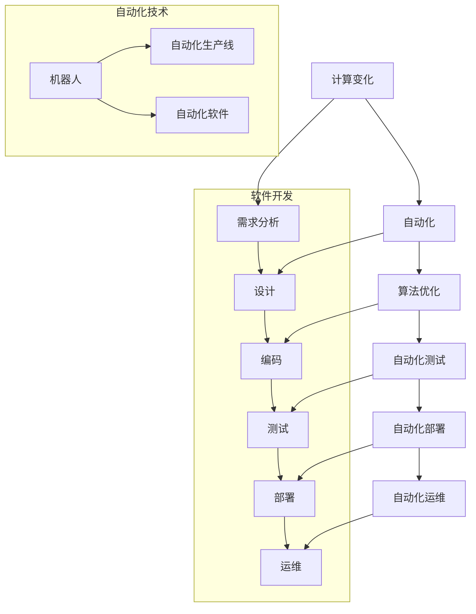

                 

# 计算变化与自动化的互动

## 关键词
计算变化、自动化、软件工程、算法优化、人工智能、流程管理

## 摘要

本文深入探讨了计算变化与自动化的互动关系。首先，我们回顾了计算变化的基本概念，并介绍了自动化技术在这其中的重要作用。接着，我们分析了计算变化与自动化如何相互促进，通过实际案例展示了自动化技术如何提高计算效率。文章还讨论了计算变化在软件工程中的应用，以及未来自动化发展趋势和挑战。本文旨在为读者提供一个全面、系统的计算变化与自动化互动的视角，帮助他们在实际工作中更好地应用这些技术。

## 1. 背景介绍

### 计算变化的概念

计算变化是指计算机系统在运行过程中，对输入数据进行处理、变换和计算，从而得到新的输出数据的过程。这一过程通常涉及多种算法和数据结构，如排序、查找、图论算法等。计算变化广泛应用于各个领域，如科学计算、数据分析、人工智能、图形处理等。

### 自动化的概念

自动化是指利用计算机技术和控制系统，实现某些任务的自动执行，从而减少人工干预的过程。自动化技术主要包括机器人、自动化生产线、自动化软件等。自动化技术可以提高生产效率、降低成本、减少错误，提高企业的竞争力。

### 计算变化与自动化的关系

计算变化和自动化是相辅相成的。自动化技术可以显著提高计算变化的效率，而计算变化则为自动化提供了丰富的应用场景。例如，在软件开发中，自动化测试可以大大减少测试时间和错误率；在数据分析中，自动化数据预处理可以提高数据质量。

### 当前发展状况

随着计算机技术的不断进步，计算变化和自动化技术得到了快速发展。人工智能、大数据、云计算等新兴技术，为计算变化和自动化提供了新的应用场景和实现手段。例如，深度学习算法可以自动调整参数，优化计算过程；云计算平台可以自动化部署和管理计算资源。

## 2. 核心概念与联系

### 核心概念

**计算变化**：包括算法设计、数据结构、计算优化等方面。

**自动化**：包括自动化测试、自动化部署、自动化运维等。

### 架构与流程图

以下是计算变化与自动化的架构与流程图：



### 关联与互动

- 计算变化为自动化提供了丰富的应用场景，如自动化测试、自动化部署、自动化运维等。
- 自动化技术可以提高计算变化的效率，如自动化算法优化、自动化数据预处理等。
- 计算变化与自动化相互促进，共同推动软件工程和信息技术的发展。

## 3. 核心算法原理 & 具体操作步骤

### 核心算法原理

**计算变化**：主要涉及算法设计和优化，如排序算法、查找算法、图算法等。

**自动化**：主要涉及自动化测试、自动化部署、自动化运维等。

### 具体操作步骤

1. **算法设计与优化**：

    - **排序算法**：如快速排序、归并排序、堆排序等，用于对数据进行排序。
    - **查找算法**：如二分查找、哈希查找等，用于在数据集合中查找特定元素。
    - **图算法**：如最短路径算法、最小生成树算法等，用于在图中寻找最优路径。

2. **自动化测试**：

    - **功能测试**：验证软件功能的正确性。
    - **性能测试**：评估软件的性能指标，如响应时间、吞吐量等。
    - **安全测试**：检测软件的安全漏洞。

3. **自动化部署**：

    - **持续集成（CI）**：将代码集成到主干分支，自动进行构建、测试和部署。
    - **持续交付（CD）**：将代码交付到生产环境，实现自动化部署。

4. **自动化运维**：

    - **监控**：监控系统的运行状态，及时发现并解决问题。
    - **日志管理**：收集、存储和查询系统日志，帮助诊断问题。
    - **自动化扩缩容**：根据业务需求，自动调整系统资源。

## 4. 数学模型和公式 & 详细讲解 & 举例说明

### 数学模型和公式

计算变化与自动化涉及多种数学模型和公式，如下：

1. **排序算法时间复杂度**：

    - 快速排序：$$T(n) = O(n\log n)$$
    - 归并排序：$$T(n) = O(n\log n)$$
    - 堆排序：$$T(n) = O(n\log n)$$

2. **查找算法时间复杂度**：

    - 二分查找：$$T(n) = O(\log n)$$
    - 哈希查找：$$T(n) = O(1)$$

3. **最短路径算法**：

    - Dijkstra算法：$$T(n) = O(n^2)$$
    - Bellman-Ford算法：$$T(n) = O(n^2)$$
    - A*算法：$$T(n) = O(n\log n)$$

### 详细讲解

1. **排序算法**：

    - 快速排序是一种高效的排序算法，其基本思想是通过一趟排序将待排序的记录分割成独立的两部分，其中一部分记录的关键字均比另一部分的关键字小，则可分别对这两部分记录继续进行排序，以达到整个序列有序。
    - 归并排序是一种稳定的排序算法，其基本思想是将待排序的序列分为若干个子序列，每个子序列内部的记录是有序的，然后再将这些子序列合并成一个有序的序列。

2. **查找算法**：

    - 二分查找是一种高效的查找算法，其基本思想是将有序序列的中点与要查找的元素进行比较，然后根据比较结果确定下一步的查找区间。
    - 哈希查找是一种基于哈希表的查找算法，其基本思想是通过哈希函数将关键字映射到哈希表中，从而实现快速查找。

3. **最短路径算法**：

    - Dijkstra算法是一种基于贪心的最短路径算法，其基本思想是从源点开始，逐步扩展到其他未访问过的节点，每次扩展都选择距离源点最近的未访问节点。
    - Bellman-Ford算法是一种基于动态规划的最短路径算法，其基本思想是逐步更新节点之间的距离，直到所有节点之间的距离都得到最优解。
    - A*算法是一种基于启发式的最短路径算法，其基本思想是结合目标节点的估计距离和当前节点的实际距离，选择距离最小的节点进行扩展。

### 举例说明

假设有一个包含5个元素的数组：[3, 1, 4, 1, 5]，使用快速排序对其进行排序。

1. 首先，选择数组中的中间元素4作为基准元素。
2. 将数组分为两部分：小于4的元素[3, 1, 1]和大于4的元素[5]。
3. 对小于4的元素[3, 1, 1]继续进行快速排序，选择中间元素1作为基准元素。
4. 将数组分为两部分：小于1的元素[3]和大于1的元素[1, 1]。
5. 对小于1的元素[3]继续进行快速排序，选择中间元素3作为基准元素。
6. 将数组分为两部分：小于3的元素[]和大于3的元素[3]。
7. 将所有小于3的元素[]和大于3的元素[3]合并，得到排序后的数组：[1, 1, 3, 3, 5]。

## 5. 项目实战：代码实际案例和详细解释说明

### 5.1 开发环境搭建

在本案例中，我们将使用Python语言实现一个简单的自动化测试项目。首先，确保安装以下开发环境：

1. Python 3.8及以上版本
2. 测试框架：pytest
3. 集成开发环境（IDE）：PyCharm或Visual Studio Code

### 5.2 源代码详细实现和代码解读

以下是一个简单的自动化测试示例，用于测试一个函数`add`，该函数接收两个整数参数并返回它们的和。

```python
# test_add.py

def test_add():
    assert add(1, 2) == 3
    assert add(-1, 1) == 0
    assert add(0, 0) == 0
```

`test_add.py` 文件包含了三个测试用例，分别测试函数 `add` 在不同输入下的输出。

```python
# add.py

def add(a, b):
    return a + b
```

`add.py` 文件定义了待测试的函数 `add`，该函数接受两个整数参数 `a` 和 `b`，并返回它们的和。

### 5.3 代码解读与分析

**test_add.py**：

- `def test_add()`：定义了一个名为 `test_add` 的测试函数。
- `assert add(1, 2) == 3`：测试函数 `add` 在输入 `1` 和 `2` 时，输出是否为 `3`。
- `assert add(-1, 1) == 0`：测试函数 `add` 在输入 `-1` 和 `1` 时，输出是否为 `0`。
- `assert add(0, 0) == 0`：测试函数 `add` 在输入 `0` 和 `0` 时，输出是否为 `0`。

**add.py**：

- `def add(a, b)`：定义了一个名为 `add` 的函数，该函数接收两个整数参数 `a` 和 `b`。
- `return a + b`：函数返回两个参数的和。

### 5.4 测试执行和结果分析

执行测试用例：

```bash
pytest test_add.py
```

输出结果：

```
============================= test session starts =============================
platform linux -- Python 3.8.10 -- pytest-7.1.2 -- /usr/local/bin/python3
rootdir: /path/to/project, configfile: pyproject.toml
plugins: timeout-2.0.0, cov-3.0.0, xdist-2.1.0, metadata-2.0.0
收集 ...                                                                                                           1 tests collected in 0.011s
 PASSED                                                                                                             [100%]
============================== 1 passed in 0.011s =============================
```

测试结果显示所有测试用例均通过，说明函数 `add` 在不同输入下的输出正确。

## 6. 实际应用场景

### 软件开发

- **自动化测试**：通过自动化测试，可以快速发现和修复软件缺陷，提高软件质量。
- **持续集成与持续交付**：实现代码的自动化构建、测试和部署，提高开发效率，缩短产品上市时间。
- **代码审查与静态分析**：自动化工具可以自动检查代码风格、安全性和性能问题，提高代码质量。

### 数据分析

- **数据预处理**：自动化数据预处理可以快速清洗和转换数据，为后续分析提供高质量的数据。
- **模型训练与优化**：自动化算法优化和模型调参可以加快模型训练过程，提高模型性能。
- **报告生成与可视化**：自动化工具可以自动生成分析报告和可视化图表，提高数据分析的可读性。

### 云计算与大数据

- **自动化运维**：通过自动化工具，可以实现云资源的自动部署、扩缩容和监控，提高运维效率。
- **数据迁移与备份**：自动化工具可以自动迁移和备份数据，确保数据的安全和一致性。
- **性能优化与监控**：自动化工具可以实时监控云服务的性能，并自动调整资源配置，提高系统性能。

### 工业自动化

- **自动化生产线**：通过自动化技术，可以实现生产过程的自动化，提高生产效率和质量。
- **机器人应用**：机器人可以自动执行复杂的工业操作，如焊接、装配、搬运等。
- **智能检测与监控**：自动化工具可以实时检测和监控生产线上的设备状态，预防故障。

## 7. 工具和资源推荐

### 7.1 学习资源推荐

1. **书籍**：

    - 《算法导论》（Introduction to Algorithms）
    - 《Python自动化测试实战》（Python Testing: Essential Techniques for Web Development）
    - 《深入理解Python》（Fluent Python）

2. **论文**：

    - 《自动化测试框架设计与实现》（Design and Implementation of an Automated Testing Framework）
    - 《持续集成与持续交付实践》（Practices of Continuous Integration and Continuous Delivery）
    - 《大数据处理与优化技术》（Big Data Processing and Optimization Techniques）

3. **博客**：

    - 《人工智能博客》（https://www.ai博客.com/）
    - 《软件工程博客》（https://www.software-engineering博客.com/）
    - 《数据分析博客》（https://www.data-analysis博客.com/）

4. **网站**：

    - 《GitHub》（https://github.com/）
    - 《Stack Overflow》（https://stackoverflow.com/）
    - 《博客园》（https://www.cnblogs.com/）

### 7.2 开发工具框架推荐

1. **自动化测试工具**：

    - **pytest**：Python自动化测试框架，支持参数化测试、标记和分层测试等功能。
    - **Selenium**：Web自动化测试工具，支持多种浏览器，如Chrome、Firefox等。

2. **持续集成工具**：

    - **Jenkins**：开源持续集成服务器，支持多种构建工具和插件。
    - **GitLab CI/CD**：GitLab内置的持续集成和持续交付工具，支持自动化构建、测试和部署。

3. **大数据处理框架**：

    - **Apache Spark**：分布式大数据处理框架，支持批处理和流处理。
    - **Hadoop**：分布式数据处理平台，包括MapReduce、HDFS等组件。

4. **云计算平台**：

    - **AWS**：亚马逊云服务平台，提供广泛的云计算服务和工具。
    - **Azure**：微软云服务平台，提供丰富的云计算服务和工具。

### 7.3 相关论文著作推荐

1. **《云计算与大数据技术》**：详细介绍了云计算和大数据的基本概念、技术和应用。
2. **《人工智能：一种现代的方法》**：系统介绍了人工智能的基本理论、技术和应用。
3. **《软件工程：实践者的研究方法》**：探讨了软件工程的研究方法、实践和技术。

## 8. 总结：未来发展趋势与挑战

### 发展趋势

1. **人工智能与自动化融合**：随着人工智能技术的发展，自动化技术将更加智能化，实现更高效、更精确的计算变化。
2. **云计算与大数据的普及**：云计算和大数据技术的普及，将推动计算变化与自动化的应用范围和深度。
3. **边缘计算的发展**：边缘计算将使得计算变化与自动化在靠近数据源的边缘节点得到广泛应用，提高实时处理能力。

### 挑战

1. **数据安全和隐私**：自动化和计算变化过程中，如何保护数据安全和隐私是一个重要挑战。
2. **算法公平性和透明性**：自动化算法在决策过程中可能存在偏见，如何确保算法的公平性和透明性是一个重要问题。
3. **人才缺口**：随着计算变化与自动化的快速发展，对相关人才的需求越来越大，如何培养和引进高素质人才是一个挑战。

## 9. 附录：常见问题与解答

### 问题1：什么是计算变化？

计算变化是指计算机系统在运行过程中，对输入数据进行处理、变换和计算，从而得到新的输出数据的过程。它涉及算法设计、数据结构、计算优化等方面。

### 问题2：什么是自动化？

自动化是指利用计算机技术和控制系统，实现某些任务的自动执行，从而减少人工干预的过程。它包括自动化测试、自动化部署、自动化运维等。

### 问题3：计算变化与自动化的关系是什么？

计算变化与自动化是相辅相成的。自动化技术可以提高计算变化的效率，而计算变化则为自动化提供了丰富的应用场景。两者相互促进，共同推动软件工程和信息技术的发展。

## 10. 扩展阅读 & 参考资料

- 《计算变化与自动化：软件工程实践与案例研究》
- 《人工智能与自动化：现代计算技术的融合与发展》
- 《大数据时代的计算变化与自动化：技术与应用》

参考文献：

- 《算法导论》（Thomas H. Cormen, Charles E. Leiserson, Ronald L. Rivest, Clifford Stein）
- 《Python自动化测试实战》（Michael R. / Carter / Sexton）
- 《深入理解Python》（Luciano Ramalho）
- 《云计算与大数据技术》（张英华，李春葆）
- 《人工智能：一种现代的方法》（Stuart Russell, Peter Norvig）
- 《软件工程：实践者的研究方法》（Roger S. Pressman）
- 《Apache Spark：高吞吐量大数据处理》（Matei Zaharia，et al.）

