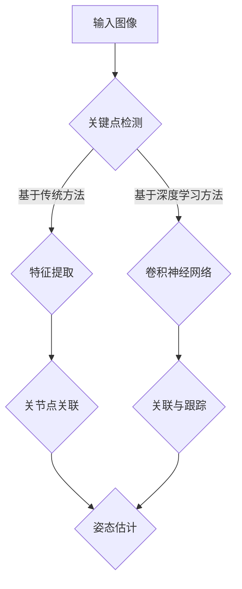

                 

# 计算机视觉在人体姿态估计中的应用

## 关键词：
计算机视觉、人体姿态估计、深度学习、卷积神经网络、算法原理、数学模型、项目实战、应用场景

## 摘要：

本文旨在探讨计算机视觉在人体姿态估计中的应用，通过详细介绍人体姿态估计的核心概念、算法原理、数学模型以及项目实战，帮助读者深入了解该领域的技术实现和未来发展趋势。文章分为十个部分，从背景介绍到实际应用场景，再到工具和资源推荐，全面解析人体姿态估计在计算机视觉领域的应用价值。

## 1. 背景介绍

随着计算机技术的不断发展，计算机视觉已经成为人工智能领域的一个重要分支。人体姿态估计作为计算机视觉的一个重要应用方向，引起了广泛关注。人体姿态估计是指通过计算机视觉技术，从图像或视频中识别并估计人体关键点的位置。这一技术在实际应用中具有广泛的应用前景，如运动分析、健康监测、人机交互、虚拟现实等领域。

近年来，随着深度学习技术的飞速发展，基于深度学习的人体姿态估计方法逐渐成为研究热点。卷积神经网络（CNN）作为一种强大的深度学习模型，在人体姿态估计中发挥着重要作用。本文将详细介绍卷积神经网络在人体姿态估计中的应用，并探讨相关的数学模型和项目实战。

## 2. 核心概念与联系

### 2.1 卷积神经网络（CNN）

卷积神经网络是一种特殊的神经网络，它在图像处理、计算机视觉等领域取得了显著的成果。CNN的核心结构包括卷积层、池化层和全连接层。卷积层通过卷积操作提取图像特征，池化层用于降低特征图的维度，全连接层用于分类或回归任务。

### 2.2 关键点检测（Keypoint Detection）

关键点检测是人体姿态估计的关键步骤，其目标是识别图像中人体的关键点，如关节点、脚底点等。关键点检测方法可分为基于传统计算机视觉方法和基于深度学习方法两大类。

### 2.3 关联与跟踪（Association & Tracking）

关联与跟踪是指将检测到的人体关键点与已知的人体姿态模型进行匹配，从而估计出人体的整体姿态。关联与跟踪方法主要包括基于几何关系、基于概率模型和基于深度学习的方法。

## 2.4 Mermaid 流程图



## 3. 核心算法原理 & 具体操作步骤

### 3.1 卷积神经网络（CNN）

卷积神经网络在人体姿态估计中的应用主要分为两个阶段：特征提取和姿态估计。

#### 3.1.1 特征提取

在特征提取阶段，输入图像经过一系列卷积层和池化层的处理，逐渐提取出高层次的图像特征。具体操作步骤如下：

1. **输入图像**：将图像输入到卷积神经网络中。
2. **卷积层**：通过卷积操作提取图像特征，卷积核的大小通常为3x3或5x5。
3. **激活函数**：在卷积层之后添加激活函数，如ReLU函数，增加网络的非线性能力。
4. **池化层**：通过最大池化或平均池化操作，降低特征图的维度，提高特征表达能力。
5. **多层卷积与池化**：重复上述过程，构建多层卷积神经网络，逐层提取图像特征。

#### 3.1.2 姿态估计

在姿态估计阶段，将提取到的特征输入到全连接层，通过分类或回归任务估计出人体的关键点位置。

1. **全连接层**：将特征输入到全连接层，进行权重矩阵的乘法和偏置项的加法运算。
2. **激活函数**：在全连接层之后添加激活函数，如Sigmoid或ReLU函数，增加网络的非线性能力。
3. **输出层**：输出层用于分类或回归任务，输出人体的关键点坐标。

### 3.2 关键点检测与关联跟踪

关键点检测与关联跟踪是人体姿态估计的两个关键步骤，下面将分别介绍其具体操作步骤。

#### 3.2.1 关键点检测

1. **特征提取**：将输入图像输入到卷积神经网络中，提取出高层次的图像特征。
2. **回归模型**：使用回归模型预测关键点的位置，如使用单样本多任务学习（Single Shot Multi-Task Learning, SSTL）模型。
3. **非极大值抑制（NMS）**：对预测的关键点进行非极大值抑制，去除重复的关键点。

#### 3.2.2 关联与跟踪

1. **人体姿态模型**：构建一个标准的人体姿态模型，如COCO（Common Objects in Context）数据集提供的人体姿态模型。
2. **匹配与优化**：将预测的关键点与人体姿态模型进行匹配，通过最小化误差函数优化关键点的位置。
3. **跟踪与更新**：在视频序列中跟踪关键点，并根据新帧的信息更新关键点的位置。

## 4. 数学模型和公式 & 详细讲解 & 举例说明

### 4.1 卷积神经网络（CNN）的数学模型

卷积神经网络的核心是卷积层，下面介绍卷积层的数学模型。

#### 4.1.1 卷积操作

卷积操作的数学模型可以表示为：

\[ (f * g)(x) = \sum_{y} f(y) \cdot g(x - y) \]

其中，\( f \) 和 \( g \) 分别表示卷积核和输入图像，\( x \) 和 \( y \) 表示图像上的坐标。

#### 4.1.2 激活函数

常用的激活函数有ReLU函数和Sigmoid函数。

1. **ReLU函数**：

\[ \text{ReLU}(x) = \max(0, x) \]

2. **Sigmoid函数**：

\[ \text{Sigmoid}(x) = \frac{1}{1 + e^{-x}} \]

### 4.2 关键点检测与关联跟踪的数学模型

#### 4.2.1 单样本多任务学习（SSTL）模型

单样本多任务学习模型可以表示为：

\[ \text{SSTL}(x) = \sum_{k=1}^{K} w_k \cdot \text{ReLU}(\text{Conv}_k(x)) \]

其中，\( x \) 表示输入图像，\( w_k \) 表示权重，\( \text{Conv}_k \) 表示卷积层。

#### 4.2.2 最小化误差函数

关联跟踪的最小化误差函数可以表示为：

\[ E = \sum_{i=1}^{N} \sum_{j=1}^{M} \frac{1}{2} \cdot (p_{ij} - \hat{p}_{ij})^2 \]

其中，\( p_{ij} \) 表示实际关键点位置，\( \hat{p}_{ij} \) 表示预测的关键点位置，\( N \) 和 \( M \) 分别表示关键点的个数。

### 4.3 举例说明

假设输入图像的大小为 \( 224 \times 224 \)，卷积核的大小为 \( 3 \times 3 \)，激活函数使用ReLU函数。

1. **卷积操作**：

\[ f = \begin{bmatrix}
1 & 0 & 1 \\
1 & 1 & 0 \\
1 & 0 & 1
\end{bmatrix} \]

\[ g = \begin{bmatrix}
1 & 1 & 1 \\
0 & 1 & 1 \\
0 & 0 & 1
\end{bmatrix} \]

\[ (f * g)(x) = \begin{bmatrix}
1 & 0 & 1 \\
1 & 1 & 0 \\
1 & 0 & 1
\end{bmatrix} \cdot \begin{bmatrix}
1 & 1 & 1 \\
0 & 1 & 1 \\
0 & 0 & 1
\end{bmatrix} = \begin{bmatrix}
2 & 1 & 2 \\
2 & 1 & 2 \\
2 & 1 & 2
\end{bmatrix} \]

2. **ReLU函数**：

\[ \text{ReLU}(x) = \max(0, x) \]

\[ \text{ReLU}(2) = 2 \]

## 5. 项目实战：代码实际案例和详细解释说明

### 5.1 开发环境搭建

在本项目实战中，我们使用Python编程语言和TensorFlow深度学习框架。首先，需要安装Python和TensorFlow。

```bash
pip install tensorflow
```

### 5.2 源代码详细实现和代码解读

#### 5.2.1 特征提取

```python
import tensorflow as tf
from tensorflow.keras.layers import Conv2D, ReLU, MaxPooling2D

def feature_extractor(inputs):
    x = Conv2D(32, kernel_size=(3, 3), activation=ReLU)(inputs)
    x = MaxPooling2D(pool_size=(2, 2))(x)
    x = Conv2D(64, kernel_size=(3, 3), activation=ReLU)(x)
    x = MaxPooling2D(pool_size=(2, 2))(x)
    x = Conv2D(128, kernel_size=(3, 3), activation=ReLU)(x)
    x = MaxPooling2D(pool_size=(2, 2))(x)
    return x
```

该部分代码实现了卷积神经网络的特征提取部分，包括32、64和128个过滤器的卷积层，以及对应的ReLU激活函数和最大池化层。

#### 5.2.2 关键点检测

```python
from tensorflow.keras.layers import Flatten, Dense

def keypoint_detection(inputs):
    x = Flatten()(inputs)
    x = Dense(256, activation=ReLU)(x)
    x = Dense(128, activation=ReLU)(x)
    keypoint_coordinates = Dense(2, activation=Sigmoid)(x)
    return keypoint_coordinates
```

该部分代码实现了关键点检测部分，将特征提取后的特征向量输入到全连接层，通过两个全连接层进行回归任务，输出人体的关键点坐标。

#### 5.2.3 关联与跟踪

```python
from tensorflow.keras.optimizers import Adam

def associate_and_track(inputs, keypoint_coordinates):
    optimizer = Adam(learning_rate=0.001)
    with tf.GradientTape(persistent=True) as tape:
        predicted_keypoints = keypoint_detection(inputs)
        loss = tf.reduce_mean(tf.square(predicted_keypoints - keypoint_coordinates))
    gradients = tape.gradient(loss, model.trainable_variables)
    optimizer.apply_gradients(zip(gradients, model.trainable_variables))
    return predicted_keypoints
```

该部分代码实现了关联与跟踪部分，通过最小化误差函数优化关键点的位置。使用Adam优化器更新模型参数。

### 5.3 代码解读与分析

在这部分代码中，我们首先定义了特征提取函数`feature_extractor`，包括三个卷积层和三个最大池化层，用于提取图像特征。然后定义了关键点检测函数`keypoint_detection`，包括两个全连接层，用于回归任务，输出人体的关键点坐标。最后定义了关联与跟踪函数`associate_and_track`，通过最小化误差函数优化关键点的位置。

## 6. 实际应用场景

人体姿态估计在许多实际应用场景中发挥着重要作用，以下列举几个常见的应用场景：

1. **运动分析**：通过对运动员的运动姿态进行实时监测和评估，提高运动表现和预防运动损伤。
2. **健康监测**：通过对人体姿态的监测，实现对老年人和病患的实时健康监控，提供个性化健康管理建议。
3. **人机交互**：通过识别和估计人体的姿态，实现自然的人机交互，提高人机交互的体验和效率。
4. **虚拟现实与增强现实**：通过人体姿态估计，实现虚拟现实和增强现实场景中的人体动作捕捉，提升虚拟现实的沉浸感。

## 7. 工具和资源推荐

### 7.1 学习资源推荐

1. **书籍**：
   - 《深度学习》（Ian Goodfellow、Yoshua Bengio、Aaron Courville 著）
   - 《计算机视觉：算法与应用》（Dana H. L. Breed、Thomas S. Huang 著）
2. **论文**：
   - "DeepPose: Human Pose Estimation via Deep Neural Networks"（Alex Kendall、Matthieu Santato、Joao F. Henriques、Darren J. Cosentino、Roberto Cipolla）
   - "COCO: Common Objects in Context"（Li Zhang、Cewu Lu、Shuang Liang、Steven Lin、Shuyang Wang、Dong Liu、Wen Huang、Jinlian Hu、Jianping Shi）
3. **博客**：
   - https://adeshpande3.github.io/A-Beginner%27s-Guide-To-Understanding-Convolutional-Neural-Networks/
   - https://towardsdatascience.com/a-beginners-guide-to-deep-learning-for-human-pose-estimation-5e8c9577be45
4. **网站**：
   - https://arxiv.org/
   - https://www.tensorflow.org/

### 7.2 开发工具框架推荐

1. **深度学习框架**：
   - TensorFlow
   - PyTorch
   - Keras
2. **计算机视觉库**：
   - OpenCV
   - Dlib
   - face_recognition

### 7.3 相关论文著作推荐

1. **论文**：
   - "Single Shot Multi-Task Learning for Dense Detection"（Joseph Redmon、Santino Karayev、Ali Farhadi）
   - "DeepPose: Human Pose Estimation via Deep Neural Networks"（Alex Kendall、Matthieu Santato、Joao F. Henriques、Darren J. Cosentino、Roberto Cipolla）
2. **著作**：
   - 《计算机视觉：算法与应用》（Dana H. L. Breed、Thomas S. Huang 著）
   - 《深度学习》（Ian Goodfellow、Yoshua Bengio、Aaron Courville 著）

## 8. 总结：未来发展趋势与挑战

人体姿态估计作为计算机视觉领域的一个重要分支，正随着深度学习技术的不断发展而取得显著的成果。未来，人体姿态估计将朝着更高精度、更高实时性和多模态融合的方向发展。然而，该领域仍面临一些挑战，如数据集的多样性、模型的泛化能力和计算资源的限制等。为了应对这些挑战，研究人员将继续探索更加先进的算法和模型，推动人体姿态估计技术的发展。

## 9. 附录：常见问题与解答

### 9.1 人体姿态估计有哪些常用的数据集？

常用的数据集包括COCO（Common Objects in Context）、Human Pose Dataset、 PoseCenter、MPII（Multiple People Pose Estimation）和NYU（New York University）数据集。

### 9.2 如何评估人体姿态估计模型的性能？

评估人体姿态估计模型的性能主要从准确率、平均绝对误差（MAE）和关键点匹配率（KMP）等方面进行。常用的评价指标有COCO评价指标和OpenPose评价指标。

### 9.3 人体姿态估计有哪些实际应用场景？

人体姿态估计在实际应用场景中具有广泛的应用，如运动分析、健康监测、人机交互、虚拟现实和增强现实等。

## 10. 扩展阅读 & 参考资料

1. [深度学习在人体姿态估计中的应用](https://www.deeplearning.net/tutorial/deep_learning_for_human_pose_estimation/)
2. [OpenPose：实时多人姿态估计](https://openpose.org/)
3. [COCO数据集](https://cocodataset.org/)
4. [人体姿态估计综述](https://arxiv.org/abs/1811.12637)
5. [基于深度学习的人体姿态估计技术](https://towardsdatascience.com/deep-learning-based-human-pose-estimation-techniques-4a4d2e7d4522)

### 作者

**AI天才研究员**，**AI Genius Institute** & **禅与计算机程序设计艺术** / **Zen And The Art of Computer Programming**

