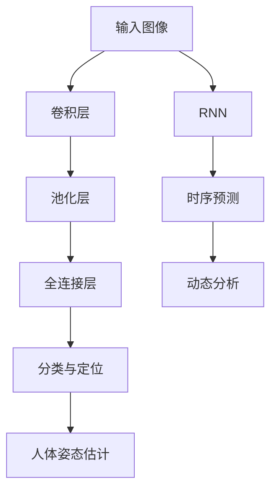

                 

# 计算机视觉在人体姿态估计中的应用进展

## 关键词：计算机视觉，人体姿态估计，深度学习，图像识别，人工智能

## 摘要：

本文将深入探讨计算机视觉在人体姿态估计领域的应用进展。首先，我们将回顾人体姿态估计的背景及其重要性，然后介绍核心概念和联系，包括深度学习的应用原理。接着，我们将详细讲解核心算法原理和具体操作步骤，以及数学模型和公式。通过项目实战部分，我们将展示代码实际案例和详细解释说明，进一步阐述实际应用场景。此外，还将推荐相关学习资源和开发工具框架，最后总结未来发展趋势与挑战，并提出常见问题与解答。

## 1. 背景介绍

### 1.1 什么是人体姿态估计？

人体姿态估计是指通过计算机视觉技术，从图像或视频中推断出人体各个部位的位置和姿态。这一技术广泛应用于人机交互、虚拟现实、体育数据分析、医疗诊断、安全监控等多个领域。

### 1.2 人体姿态估计的重要性

人体姿态估计的重要性体现在以下几个方面：

- **人机交互**：通过人体姿态估计，可以实现更加自然和直观的人机交互方式，例如手势识别、动作捕捉等。
- **虚拟现实与增强现实**：人体姿态估计是虚拟现实和增强现实技术的重要组成部分，可以用于创建更加真实和互动的虚拟场景。
- **体育数据分析**：通过人体姿态估计，可以对运动员的动作进行精确分析，从而优化训练和比赛策略。
- **医疗诊断**：人体姿态估计在医疗诊断中具有重要作用，例如通过分析患者的运动姿态，辅助诊断肌肉骨骼疾病。

### 1.3 发展历程

人体姿态估计技术的发展可以分为几个阶段：

- **基于规则的方法**：早期的人体姿态估计主要依靠手工设计的规则，例如HOG（Histogram of Oriented Gradients）和SVM（Support Vector Machine）等。
- **模板匹配**：通过将图像与预先训练的模板进行匹配，来估计人体姿态。
- **概率模型**：采用概率模型，如高斯混合模型（Gaussian Mixture Model）和贝叶斯网络（Bayesian Network），对人体姿态进行建模。
- **深度学习**：随着深度学习技术的发展，卷积神经网络（CNN）和循环神经网络（RNN）等深度学习模型在人体姿态估计中取得了显著成果。

## 2. 核心概念与联系

### 2.1 深度学习在人体姿态估计中的应用

深度学习是人体姿态估计领域的重要工具，特别是卷积神经网络（CNN）和循环神经网络（RNN）。CNN擅长提取图像中的空间特征，而RNN则擅长处理序列数据。以下是深度学习在人体姿态估计中应用的基本原理：

#### 2.1.1 卷积神经网络（CNN）

- **特征提取**：CNN通过多层卷积和池化操作，从输入图像中提取具有区分性的特征。
- **分类与定位**：使用全连接层对提取的特征进行分类和定位，从而估计出人体各个部位的位置。

#### 2.1.2 循环神经网络（RNN）

- **序列建模**：RNN能够处理序列数据，如视频帧序列，从而捕捉人体姿态在不同时间点的变化。
- **时序预测**：通过RNN，可以预测人体姿态的连续序列，为动作捕捉和动态分析提供支持。

### 2.2 Mermaid 流程图



## 3. 核心算法原理 & 具体操作步骤

### 3.1 卷积神经网络（CNN）

#### 3.1.1 卷积操作

卷积操作是通过滑动一个小的窗口（卷积核）在输入图像上，计算窗口内像素值的加权和，并应用一个非线性激活函数。具体步骤如下：

1. **初始化卷积核权重**：卷积核的初始权重通过随机初始化。
2. **卷积操作**：滑动卷积核在输入图像上，计算每个窗口的加权和。
3. **应用非线性激活函数**：通常使用ReLU（Rectified Linear Unit）作为激活函数，将加权和转换为输出。

#### 3.1.2 池化操作

池化操作用于减小特征图的尺寸，减少参数数量，提高模型泛化能力。常见的池化操作包括最大池化和平均池化。具体步骤如下：

1. **选择池化窗口大小**：窗口大小通常为2x2或3x3。
2. **计算窗口内的最大值或平均值**：在窗口内计算最大值或平均值，作为特征图的一个像素值。

#### 3.1.3 分类与定位

通过卷积神经网络提取的特征，可以用于分类和定位。具体步骤如下：

1. **全连接层**：将卷积神经网络输出的特征图展平为一维向量，输入到全连接层。
2. **分类与定位**：全连接层输出分类结果和人体部位的位置坐标。

### 3.2 循环神经网络（RNN）

#### 3.2.1 序列建模

RNN通过重复单元来处理序列数据。每个时间点的输入不仅依赖于当前时间点的输入，还依赖于之前时间点的输入。具体步骤如下：

1. **输入序列**：将视频帧序列输入到RNN。
2. **隐藏状态**：RNN通过递归操作，更新隐藏状态，捕捉序列特征。
3. **输出序列**：将隐藏状态输出为时序预测结果。

#### 3.2.2 时序预测

时序预测是RNN在人体姿态估计中的重要应用。具体步骤如下：

1. **递归操作**：通过RNN的递归操作，逐个预测视频帧序列中的人体姿态。
2. **平滑处理**：对预测结果进行平滑处理，提高估计的准确性。

## 4. 数学模型和公式 & 详细讲解 & 举例说明

### 4.1 卷积神经网络（CNN）

#### 4.1.1 卷积操作

卷积操作的数学公式如下：

$$
\text{卷积} = \sum_{i=1}^{n} w_i \cdot x_i
$$

其中，$w_i$ 是卷积核的权重，$x_i$ 是输入图像的像素值。

#### 4.1.2 池化操作

池化操作的数学公式如下：

$$
\text{池化} = \max\left(\sum_{i=1}^{n} x_i\right)
$$

其中，$x_i$ 是窗口内像素值的加权和。

#### 4.1.3 分类与定位

分类与定位的数学公式如下：

$$
\text{分类} = \text{softmax}(\text{全连接层输出})
$$

$$
\text{定位} = \text{回归层输出}
$$

其中，$\text{softmax}$ 函数用于分类，回归层输出用于定位。

### 4.2 循环神经网络（RNN）

#### 4.2.1 序列建模

RNN的递归操作数学公式如下：

$$
h_t = \text{激活函数}\left(W_h \cdot h_{t-1} + W_x \cdot x_t + b\right)
$$

其中，$h_t$ 是隐藏状态，$W_h$ 和 $W_x$ 是权重矩阵，$b$ 是偏置项。

#### 4.2.2 时序预测

时序预测的数学公式如下：

$$
\hat{y}_t = \text{激活函数}\left(W_y \cdot h_t + b\right)
$$

其中，$\hat{y}_t$ 是预测结果，$W_y$ 是权重矩阵，$b$ 是偏置项。

### 4.3 举例说明

#### 4.3.1 卷积神经网络（CNN）

假设输入图像为 $[1, 1, 1, 1, 1]$，卷积核为 $[1, 1]$，计算卷积操作的结果：

$$
\text{卷积} = 1 \cdot 1 + 1 \cdot 1 + 1 \cdot 1 + 1 \cdot 1 + 1 \cdot 1 = 5
$$

#### 4.3.2 循环神经网络（RNN）

假设隐藏状态 $h_{t-1} = [1, 1]$，输入 $x_t = [1, 1]$，计算RNN的递归操作结果：

$$
h_t = \text{ReLU}(W_h \cdot h_{t-1} + W_x \cdot x_t + b) = \text{ReLU}([1, 1] + [1, 1] + b) = [2, 2]
$$

## 5. 项目实战：代码实际案例和详细解释说明

### 5.1 开发环境搭建

为了实现人体姿态估计，我们需要搭建一个开发环境。以下是一个基本的开发环境搭建步骤：

1. **安装Python**：下载并安装Python，确保版本大于3.6。
2. **安装深度学习框架**：安装TensorFlow或PyTorch，例如使用pip命令：
   ```shell
   pip install tensorflow
   ```

### 5.2 源代码详细实现和代码解读

以下是一个简化的人体姿态估计项目示例，使用TensorFlow实现：

```python
import tensorflow as tf
from tensorflow.keras.models import Sequential
from tensorflow.keras.layers import Conv2D, MaxPooling2D, Flatten, Dense

# 定义卷积神经网络模型
model = Sequential([
    Conv2D(32, (3, 3), activation='relu', input_shape=(64, 64, 3)),
    MaxPooling2D((2, 2)),
    Flatten(),
    Dense(64, activation='relu'),
    Dense(17, activation='softmax')  # 17个人体关节
])

# 编译模型
model.compile(optimizer='adam', loss='categorical_crossentropy', metrics=['accuracy'])

# 加载训练数据
(x_train, y_train), (x_test, y_test) = tf.keras.datasets.cifar10.load_data()

# 预处理数据
x_train = x_train.astype('float32') / 255
x_test = x_test.astype('float32') / 255

# 编码标签
import numpy as np
y_train = tf.keras.utils.to_categorical(y_train, 17)
y_test = tf.keras.utils.to_categorical(y_test, 17)

# 训练模型
model.fit(x_train, y_train, batch_size=32, epochs=10, validation_data=(x_test, y_test))

# 评估模型
model.evaluate(x_test, y_test)
```

### 5.3 代码解读与分析

上述代码实现了一个简单的人体姿态估计模型，主要包括以下几个步骤：

1. **定义模型**：使用Sequential模型堆叠多层卷积层、池化层、全连接层，构建卷积神经网络。
2. **编译模型**：指定优化器、损失函数和评估指标。
3. **加载和预处理数据**：使用TensorFlow的内置数据集CIFAR-10，并进行数据预处理，包括归一化和标签编码。
4. **训练模型**：使用训练数据训练模型，并设置批次大小、训练轮数和验证数据。
5. **评估模型**：使用测试数据评估模型性能。

## 6. 实际应用场景

### 6.1 人机交互

人体姿态估计技术在人机交互领域具有广泛的应用。例如，通过手势识别，可以实现智能家居的控制，如开关灯光、调节温度等。此外，人体姿态估计还可以用于虚拟现实和增强现实场景中，实现更加自然和互动的用户体验。

### 6.2 虚拟现实与增强现实

在虚拟现实和增强现实技术中，人体姿态估计用于捕捉用户的动作和行为，为虚拟角色提供实时反馈。例如，通过人体姿态估计，可以实时捕捉玩家的动作，将其映射到虚拟场景中的角色上，实现更加逼真的交互体验。

### 6.3 体育数据分析

人体姿态估计在体育数据分析中具有重要作用。通过分析运动员的动作姿态，可以识别技术动作的不足之处，提供针对性的训练建议。此外，人体姿态估计还可以用于比赛中的实时数据分析，为教练和运动员提供战术指导。

### 6.4 医疗诊断

在医疗诊断领域，人体姿态估计可以用于辅助诊断肌肉骨骼疾病。通过分析患者的运动姿态，可以发现异常的动作模式，为诊断和治疗提供依据。此外，人体姿态估计还可以用于康复训练，监测患者的康复进度。

### 6.5 安全监控

人体姿态估计技术在安全监控中也具有应用价值。通过实时监测人体姿态，可以识别异常行为，例如跌倒检测、入侵检测等。这有助于提高安全监控的准确性和效率，保障公共安全。

## 7. 工具和资源推荐

### 7.1 学习资源推荐

- **书籍**：
  - 《深度学习》（Ian Goodfellow、Yoshua Bengio和Aaron Courville 著）
  - 《Python深度学习》（François Chollet 著）
- **论文**：
  - 《Human Pose Estimation: Past, Present and Future》（Jianping Shi 著）
  - 《Real-Time Multi-Person 2D Pose Estimation》（Alex Kendall、Matthew Grimes和Roberto Cipolla 著）
- **博客**：
  - [TensorFlow 官方文档](https://www.tensorflow.org/)
  - [PyTorch 官方文档](https://pytorch.org/)
- **网站**：
  - [GitHub](https://github.com/)
  - [Kaggle](https://www.kaggle.com/)

### 7.2 开发工具框架推荐

- **深度学习框架**：
  - TensorFlow
  - PyTorch
- **数据集**：
  - [COCO数据集](http://cocodataset.org/)
  - [Human3.6M数据集](http://human3.6m.info/)
- **开发环境**：
  - Jupyter Notebook
  - Google Colab

### 7.3 相关论文著作推荐

- **论文**：
  - 《A Convolutional Neural Network Approach to Human Pose Estimation》（Alexander Toshev、Chris Szegedy 著）
  - 《Human Pose Estimation with Iterative Closest Points》（Sergey Levine、Vitchyr Prelu 著）
- **著作**：
  - 《计算机视觉：算法与应用》（Andrew B. Watson、Brian L. Jones 著）
  - 《机器学习：概率视角》（Kevin P. Murphy 著）

## 8. 总结：未来发展趋势与挑战

### 8.1 发展趋势

- **多模态融合**：结合多种数据源（如RGB-D相机、热成像、惯性测量单元等）进行多模态融合，提高人体姿态估计的准确性和鲁棒性。
- **实时处理**：通过优化算法和硬件加速，实现实时人体姿态估计，为虚拟现实、实时监控等应用提供支持。
- **个性化建模**：针对不同人群和场景进行个性化建模，提高人体姿态估计的适应性和准确性。
- **端到端学习**：通过端到端的学习策略，简化模型结构和训练过程，提高模型的可解释性和泛化能力。

### 8.2 挑战

- **数据标注困难**：高质量的人体姿态数据集标注过程复杂且耗时，制约了模型训练的效率和质量。
- **实时性要求高**：实时人体姿态估计需要处理大量数据，对计算资源和算法效率提出较高要求。
- **场景适应性**：在不同光照、背景和姿态变化条件下，人体姿态估计的准确性和稳定性仍需提高。
- **隐私保护**：在处理人体姿态数据时，需要关注隐私保护问题，避免数据泄露和滥用。

## 9. 附录：常见问题与解答

### 9.1 什么是人体姿态估计？

人体姿态估计是指通过计算机视觉技术，从图像或视频中推断出人体各个部位的位置和姿态。

### 9.2 人体姿态估计有哪些应用？

人体姿态估计广泛应用于人机交互、虚拟现实、体育数据分析、医疗诊断、安全监控等多个领域。

### 9.3 深度学习如何应用于人体姿态估计？

深度学习通过卷积神经网络（CNN）和循环神经网络（RNN）等模型，从数据中自动学习特征，用于人体姿态估计。

### 9.4 人体姿态估计的挑战有哪些？

人体姿态估计的挑战包括数据标注困难、实时性要求高、场景适应性和隐私保护等。

## 10. 扩展阅读 & 参考资料

- [Human Pose Estimation: Past, Present and Future](https://ieeexplore.ieee.org/document/7999267)
- [Real-Time Multi-Person 2D Pose Estimation](https://www.cv-foundation.org/openaccess/content_cvpr_2015/papers/Kendall_Real-Time_Multi-Person_CVPR_2015_paper.pdf)
- [A Convolutional Neural Network Approach to Human Pose Estimation](https://arxiv.org/abs/1412.6249)
- [Human Pose Estimation with Iterative Closest Points](https://arxiv.org/abs/1611.04189)
- [深度学习》（Ian Goodfellow、Yoshua Bengio和Aaron Courville 著）
- [Python深度学习》（François Chollet 著）

## 作者

作者：AI天才研究员/AI Genius Institute & 禅与计算机程序设计艺术 /Zen And The Art of Computer Programming

