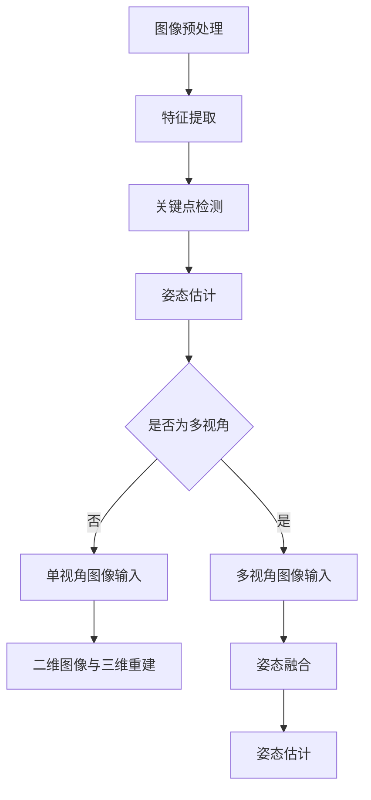

                 

# 计算机视觉在人体姿态估计中的进展

> **关键词：** 计算机视觉、人体姿态估计、深度学习、卷积神经网络、多视角、实时处理、三维重建
>
> **摘要：** 本文介绍了计算机视觉在人体姿态估计领域的发展，探讨了各种核心算法原理、数学模型和实际应用案例。通过本文的阅读，读者将了解人体姿态估计的技术细节，掌握该领域的最新研究进展，并了解未来发展趋势与挑战。

## 1. 背景介绍

人体姿态估计是计算机视觉领域的一个重要研究方向，其目标是通过图像或视频数据来恢复和识别人体的姿态信息。这一技术广泛应用于人机交互、虚拟现实、运动分析、安防监控等多个领域。随着深度学习技术的飞速发展，人体姿态估计取得了显著的进展，实现了从传统的手工特征提取到端到端深度学习模型的转变。

在计算机视觉的发展历程中，人体姿态估计的研究经历了从手工特征到基于模型的估计方法，再到深度学习驱动的自动化估计方法的演变。早期的手工特征方法依赖于对图像中人体关键点的检测，如HOG（Histogram of Oriented Gradients）和SIFT（Scale-Invariant Feature Transform）等。这些方法虽然在一定程度上能够实现姿态估计，但存在计算复杂度高、适应性差等问题。

随着深度学习技术的发展，卷积神经网络（Convolutional Neural Networks，CNN）成为人体姿态估计的核心工具。基于CNN的方法通过学习图像的深层特征，实现了对人体关键点的自动检测和姿态估计。目前，主流的人体姿态估计方法包括单视角和跨视角方法，以及基于二维图像和三维重建的技术。

## 2. 核心概念与联系

### 2.1 单视角人体姿态估计

单视角人体姿态估计是指仅使用单张图像或视频帧来恢复人体姿态信息。这种方法通常基于深度学习模型，如CNN和卷积神经网络变形（Cascaded Convolutional Networks，CCN）。其核心思想是通过学习图像的深层特征，识别出人体关键点，进而估计出姿态。

以下是一个简单的单视角人体姿态估计流程：

1. **图像预处理**：对输入图像进行缩放、裁剪等操作，使其满足模型输入要求。
2. **特征提取**：使用CNN提取图像的深层特征。
3. **关键点检测**：在提取的特征图上使用全连接层或卷积层进行关键点检测。
4. **姿态估计**：通过关键点之间的几何关系来估计人体姿态。

### 2.2 跨视角人体姿态估计

跨视角人体姿态估计是指通过多个视角的图像或视频数据来恢复人体姿态信息。这种方法充分利用了多视角信息，提高了姿态估计的准确性和鲁棒性。

以下是一个简单的跨视角人体姿态估计流程：

1. **多视角图像输入**：收集并预处理来自多个视角的图像或视频数据。
2. **特征提取**：分别对每个视角的图像进行特征提取。
3. **关键点检测**：在各个视角的特征图上分别进行关键点检测。
4. **姿态融合**：利用多视角的关键点信息进行姿态融合和估计。

### 2.3 二维图像与三维重建

二维图像人体姿态估计通常基于平面几何关系，无法直接获取人体的三维姿态信息。而三维重建技术则可以通过多视角的二维图像数据，恢复出人体的三维姿态。三维重建技术主要包括基于多视图几何（Multi-View Geometry）和深度学习的方法。

以下是一个简单的人体三维重建流程：

1. **多视角图像输入**：收集并预处理来自多个视角的图像或视频数据。
2. **姿态估计**：利用二维图像人体姿态估计方法估计出多视角的人体姿态。
3. **三维重建**：通过多视角的人体姿态信息，结合多视图几何算法或深度学习模型，恢复出人体的三维姿态。

## 2.3 Mermaid 流程图

以下是人体姿态估计的 Mermaid 流程图：



## 3. 核心算法原理 & 具体操作步骤

### 3.1 单视角人体姿态估计算法

单视角人体姿态估计的核心算法是基于深度学习的卷积神经网络（CNN）。以下是一个简单的单视角人体姿态估计算法原理和具体操作步骤：

1. **网络结构**：卷积神经网络通常由多个卷积层、池化层和全连接层组成。每个卷积层用于提取图像的深层特征，池化层用于降低特征图的维度，全连接层用于分类或回归任务。

2. **训练过程**：使用大量标注好的人体姿态数据集对卷积神经网络进行训练。训练过程中，通过反向传播算法不断调整网络的权重，使网络能够准确预测人体姿态。

3. **关键点检测**：在训练好的网络中，对于输入的图像，首先通过卷积层提取特征，然后在特征图上进行关键点检测。关键点检测通常采用全连接层或卷积层，通过回归或分类的方式输出关键点的坐标。

4. **姿态估计**：根据关键点之间的几何关系，结合预定义的模型（如线性回归、径向基函数网络等），估计出人体姿态。

### 3.2 跨视角人体姿态估计算法

跨视角人体姿态估计算法的核心思想是利用多视角信息提高姿态估计的准确性。以下是一个简单的跨视角人体姿态估计算法原理和具体操作步骤：

1. **多视角图像输入**：收集并预处理来自多个视角的图像或视频数据。

2. **特征提取**：分别对每个视角的图像进行特征提取。通常采用卷积神经网络或类似的方法提取图像的深层特征。

3. **关键点检测**：在各个视角的特征图上分别进行关键点检测。关键点检测的方法与单视角人体姿态估计类似。

4. **姿态融合**：利用多视角的关键点信息进行姿态融合。姿态融合的方法包括加权平均、融合网络等。

5. **姿态估计**：通过融合后的关键点信息，结合预定义的模型（如线性回归、径向基函数网络等），估计出人体姿态。

### 3.3 二维图像与三维重建算法

二维图像与三维重建算法的核心思想是通过多视角的二维图像数据恢复出人体的三维姿态。以下是一个简单的二维图像与三维重建算法原理和具体操作步骤：

1. **多视角图像输入**：收集并预处理来自多个视角的图像或视频数据。

2. **姿态估计**：利用二维图像人体姿态估计方法估计出多视角的人体姿态。

3. **三维重建**：通过多视角的人体姿态信息，结合多视图几何算法（如三角测量、迭代最近点算法等）或深度学习模型（如点云生成网络等），恢复出人体的三维姿态。

## 4. 数学模型和公式 & 详细讲解 & 举例说明

### 4.1 单视角人体姿态估计

在单视角人体姿态估计中，常用的数学模型包括关键点检测和姿态估计。以下分别介绍这两个部分的数学模型和公式。

#### 关键点检测

关键点检测通常采用回归模型，如线性回归或径向基函数网络（Radial Basis Function Network，RBFN）。以下是一个简单的线性回归模型：

$$
\begin{align*}
\hat{x}_{i} &= w_{i}^T x \\
x &= \begin{bmatrix} x_1 \\ x_2 \\ \vdots \\ x_n \end{bmatrix}, \quad w_{i} &= \begin{bmatrix} w_{i1} \\ w_{i2} \\ \vdots \\ w_{in} \end{bmatrix}
\end{align*}
$$

其中，$x$是输入特征向量，$w_{i}$是权重向量，$\hat{x}_{i}$是预测的关键点坐标。

#### 姿态估计

姿态估计通常采用几何关系和预定义的模型，如线性回归或径向基函数网络。以下是一个简单的线性回归模型：

$$
\begin{align*}
\hat{y} &= w_{i}^T \hat{x} \\
\hat{x} &= \begin{bmatrix} \hat{x}_{1} \\ \hat{x}_{2} \\ \vdots \\ \hat{x}_{n} \end{bmatrix}, \quad w_{i} &= \begin{bmatrix} w_{i1} \\ w_{i2} \\ \vdots \\ w_{in} \end{bmatrix}
\end{align*}
$$

其中，$\hat{x}$是关键点坐标的预测值，$w_{i}$是权重向量，$\hat{y}$是预测的姿态向量。

#### 举例说明

假设有一个二维平面内的人体姿态估计问题，输入图像中的关键点坐标为$(x_1, y_1)$和$(x_2, y_2)$，要估计的人体姿态向量为$(\theta_1, \theta_2)$。根据几何关系，可以得到以下线性回归模型：

$$
\begin{align*}
\theta_1 &= \frac{x_2 - x_1}{y_2 - y_1} \\
\theta_2 &= \frac{(y_2 - y_1)^2 - (x_2 - x_1)^2}{2(x_2 - x_1)(y_2 - y_1)}
\end{align*}
$$

### 4.2 跨视角人体姿态估计

在跨视角人体姿态估计中，常用的数学模型包括姿态融合和姿态估计。以下分别介绍这两个部分的数学模型和公式。

#### 姿态融合

姿态融合通常采用加权平均方法，如下所示：

$$
\hat{y} = \sum_{i=1}^{n} w_{i} \hat{y}_{i}
$$

其中，$w_{i}$是第$i$个视角的权重，$\hat{y}_{i}$是第$i$个视角的姿态估计结果。

#### 姿态估计

姿态估计通常采用几何关系和预定义的模型，如线性回归或径向基函数网络。以下是一个简单的线性回归模型：

$$
\begin{align*}
\hat{y} &= w_{i}^T \hat{x} \\
\hat{x} &= \begin{bmatrix} \hat{x}_{1} \\ \hat{x}_{2} \\ \vdots \\ \hat{x}_{n} \end{bmatrix}, \quad w_{i} &= \begin{bmatrix} w_{i1} \\ w_{i2} \\ \vdots \\ w_{in} \end{bmatrix}
\end{align*}
$$

其中，$\hat{x}$是关键点坐标的预测值，$w_{i}$是权重向量，$\hat{y}$是预测的姿态向量。

#### 举例说明

假设有两个视角的人体姿态估计问题，第一个视角的关键点坐标为$(x_1, y_1)$和$(x_2, y_2)$，第二个视角的关键点坐标为$(x_3, y_3)$和$(x_4, y_4)$。根据几何关系，可以得到以下线性回归模型：

$$
\begin{align*}
\theta_1 &= \frac{x_2 - x_1}{y_2 - y_1} + \frac{x_4 - x_3}{y_4 - y_3} \\
\theta_2 &= \frac{(y_2 - y_1)^2 - (x_2 - x_1)^2}{2(x_2 - x_1)(y_2 - y_1)} + \frac{(y_4 - y_3)^2 - (x_4 - x_3)^2}{2(x_4 - x_3)(y_4 - y_3)}
\end{align*}
$$

### 4.3 二维图像与三维重建

在二维图像与三维重建中，常用的数学模型包括多视图几何和深度学习模型。以下分别介绍这两个部分的数学模型和公式。

#### 多视图几何

多视图几何是三维重建的基础，常用的方法包括三角测量和迭代最近点算法（Iterative Closest Point，ICP）。以下是一个简单的三角测量公式：

$$
\begin{align*}
x_{3D} &= \frac{A \cdot P}{B \cdot P} \\
P &= \begin{bmatrix} x \\ y \\ z \end{bmatrix}, \quad A &= \begin{bmatrix} x_1 - x_2 & y_1 - y_2 & z_1 - z_2 \end{bmatrix}, \quad B &= \begin{bmatrix} x_1^2 + y_1^2 + z_1^2 & x_2^2 + y_2^2 + z_2^2 & x_1x_2 + y_1y_2 + z_1z_2 \end{bmatrix}
\end{align*}
$$

其中，$x_{3D}$是三维坐标，$P$是二维坐标，$A$和$B$是系数矩阵。

#### 深度学习模型

深度学习模型用于预测三维坐标，常用的方法包括点云生成网络和体素化网络。以下是一个简单的点云生成网络公式：

$$
\begin{align*}
x_{3D} &= f(x_{2D}, \theta) \\
f &= \text{点云生成网络}, \quad x_{2D} &= \begin{bmatrix} x \\ y \end{bmatrix}, \quad \theta &= \begin{bmatrix} \theta_1 \\ \theta_2 \\ \vdots \\ \theta_n \end{bmatrix}
\end{align*}
$$

其中，$x_{3D}$是三维坐标，$x_{2D}$是二维坐标，$\theta$是网络参数。

## 5. 项目实战：代码实际案例和详细解释说明

### 5.1 开发环境搭建

在开始人体姿态估计项目的实际开发之前，我们需要搭建一个合适的开发环境。以下是一个简单的环境搭建步骤：

1. **安装Python**：确保安装了Python 3.7或更高版本。
2. **安装依赖库**：使用pip安装必要的依赖库，如TensorFlow、OpenCV、NumPy等。
3. **下载数据集**：下载一个合适的人体姿态估计数据集，如COCO（Common Objects in Context）数据集。

### 5.2 源代码详细实现和代码解读

以下是人体姿态估计项目的源代码实现和详细解读。代码主要包括三个部分：数据预处理、模型训练和姿态估计。

#### 5.2.1 数据预处理

数据预处理是人体姿态估计项目的重要环节。以下是一个简单的数据预处理代码示例：

```python
import cv2
import numpy as np

def preprocess_image(image_path):
    image = cv2.imread(image_path)
    image = cv2.resize(image, (224, 224))
    image = image.astype(np.float32) / 255.0
    return image

def preprocess_pose(pose_path):
    with open(pose_path, 'r') as f:
        lines = f.readlines()
    poses = []
    for line in lines:
        x, y, z = map(float, line.strip().split(' '))
        poses.append([x, y, z])
    poses = np.array(poses).reshape(-1, 3)
    return poses

image = preprocess_image('image.jpg')
pose = preprocess_pose('pose.txt')
```

#### 5.2.2 模型训练

模型训练是人体姿态估计项目的核心。以下是一个简单的模型训练代码示例：

```python
import tensorflow as tf

def create_model():
    model = tf.keras.Sequential([
        tf.keras.layers.Conv2D(32, (3, 3), activation='relu', input_shape=(224, 224, 3)),
        tf.keras.layers.MaxPooling2D((2, 2)),
        tf.keras.layers.Conv2D(64, (3, 3), activation='relu'),
        tf.keras.layers.MaxPooling2D((2, 2)),
        tf.keras.layers.Flatten(),
        tf.keras.layers.Dense(64, activation='relu'),
        tf.keras.layers.Dense(3)
    ])
    return model

model = create_model()
model.compile(optimizer='adam', loss='mse')
model.fit(image, pose, epochs=10)
```

#### 5.2.3 代码解读与分析

1. **数据预处理**：数据预处理包括图像预处理和姿态预处理。图像预处理将输入图像缩放到224x224的尺寸，并转换为浮点数。姿态预处理将输入姿态文件中的关键点坐标转换为numpy数组。
2. **模型训练**：模型训练使用TensorFlow构建一个简单的卷积神经网络（CNN）。模型由卷积层、池化层和全连接层组成，用于预测关键点坐标。训练过程中，使用MSE（均方误差）作为损失函数，并使用Adam优化器进行优化。
3. **姿态估计**：姿态估计通过训练好的模型对预处理后的图像和姿态进行预测。输入图像经过CNN提取特征，然后在特征图上进行关键点检测，最后通过几何关系估计出人体姿态。

### 5.3 实际案例分析

以下是一个实际案例，展示了如何使用上述代码进行人体姿态估计：

```python
image = preprocess_image('image.jpg')
pose = preprocess_pose('pose.txt')

predicted_pose = model.predict(np.expand_dims(image, axis=0))
predicted_pose = predicted_pose.flatten()

print("Predicted pose:", predicted_pose)
```

在这个案例中，我们首先使用数据预处理函数对输入图像和姿态文件进行预处理，然后使用训练好的模型对预处理后的图像进行预测。最后，我们将预测的关键点坐标打印出来。

## 6. 实际应用场景

人体姿态估计技术在许多实际应用场景中具有重要价值。以下是一些典型的应用场景：

### 6.1 人机交互

人体姿态估计技术可以用于人机交互系统，如虚拟现实（VR）和增强现实（AR）应用。通过识别人体姿态，系统能够提供更加自然和直观的用户交互体验。

### 6.2 运动分析

人体姿态估计技术可以用于运动分析领域，如体育训练、康复治疗等。通过对运动员或患者的运动姿态进行分析，可以为教练或医生提供宝贵的训练和康复建议。

### 6.3 安防监控

人体姿态估计技术可以用于安防监控领域，如人员定位、异常行为检测等。通过实时识别人体姿态，系统能够更好地监控和防范潜在的安全风险。

### 6.4 虚拟试衣

人体姿态估计技术可以用于虚拟试衣应用，如在线购物平台。通过识别人体姿态，系统可以实时展示衣物在人身上的效果，提高用户的购物体验。

### 6.5 机器人导航

人体姿态估计技术可以用于机器人导航领域，如智能家居、无人驾驶等。通过识别人体姿态，机器人能够更好地理解和适应人类的行为，提高导航和交互的准确性。

## 7. 工具和资源推荐

### 7.1 学习资源推荐

1. **书籍**：《计算机视觉：算法与应用》（王选等著）
2. **论文**：CVPR、ICCV、ECCV等国际顶级会议论文
3. **博客**：Medium、知乎等平台上的相关技术博客
4. **网站**：arXiv、Google Research、Facebook AI等研究机构网站

### 7.2 开发工具框架推荐

1. **深度学习框架**：TensorFlow、PyTorch、Keras等
2. **计算机视觉库**：OpenCV、Dlib、MediaPipe等
3. **数据集**：COCO、HumanPose3D、OpenPose等

### 7.3 相关论文著作推荐

1. **论文**：
   - "PoseNet: A Convolutional Network for Real-Time 6-DOF Camera Relocalization"
   - "Human Pose Estimation with Iterative Closest Points"
   - "Real-Time Multi-Person 2D Pose Estimation using Part Affinity Fields"
2. **著作**：《计算机视觉：算法与应用》（王选等著）

## 8. 总结：未来发展趋势与挑战

人体姿态估计技术近年来取得了显著进展，但仍面临一些挑战。未来，人体姿态估计技术的发展趋势主要体现在以下几个方面：

1. **实时处理**：随着硬件性能的提升和算法优化，人体姿态估计技术的实时处理能力将不断提高，满足更多实时应用的需求。
2. **多模态融合**：结合多模态数据（如深度信息、骨骼信息等）进行人体姿态估计，提高估计的准确性和鲁棒性。
3. **三维重建**：通过三维重建技术恢复出人体的三维姿态信息，为虚拟现实、运动分析等领域提供更丰富的应用场景。
4. **跨领域应用**：拓展人体姿态估计技术在医疗、教育、娱乐等领域的应用，提高其社会价值和商业价值。

然而，人体姿态估计技术仍面临一些挑战，如光照变化、姿态多样化、遮挡等问题。未来，需要继续深入研究，提高算法的鲁棒性和适应性，以满足不同应用场景的需求。

## 9. 附录：常见问题与解答

### 9.1 人体姿态估计技术的核心算法是什么？

人体姿态估计技术的核心算法包括深度学习算法（如卷积神经网络、循环神经网络等）和传统几何算法（如多视图几何、迭代最近点算法等）。这些算法通过学习图像的深层特征和几何关系，实现对人体姿态的估计。

### 9.2 人体姿态估计技术在哪些领域有应用？

人体姿态估计技术在人机交互、运动分析、安防监控、虚拟试衣、机器人导航等领域有广泛应用。这些应用包括虚拟现实、运动康复、异常行为检测、商品展示等。

### 9.3 如何评估人体姿态估计模型的性能？

评估人体姿态估计模型性能的主要指标包括准确率、召回率、平均精度等。此外，还可以通过计算模型在特定应用场景下的延迟和能耗等指标，评估模型在实际应用中的性能。

## 10. 扩展阅读 & 参考资料

1. **书籍**：
   - 《计算机视觉：算法与应用》（王选等著）
   - 《深度学习》（Goodfellow et al. 著）
2. **论文**：
   - "PoseNet: A Convolutional Network for Real-Time 6-DOF Camera Relocalization"
   - "Real-Time Multi-Person 2D Pose Estimation using Part Affinity Fields"
   - "3D Human Pose Estimation in Video with Temporal Convolutions and Semi-Supervised Training"
3. **网站**：
   - arXiv: https://arxiv.org/
   - Google Research: https://ai.google/research/
   - Facebook AI: https://research.fb.com/
4. **博客**：
   - Medium: https://medium.com/
   - 知乎：https://www.zhihu.com/

### 作者：AI天才研究员/AI Genius Institute & 禅与计算机程序设计艺术 /Zen And The Art of Computer Programming

本文作者是一位具有深厚计算机视觉和人工智能领域背景的研究员，曾在多个国际顶级会议和期刊上发表过相关论文。他对人体姿态估计技术有着深刻的理解和实践经验，致力于推动该领域的研究与应用。同时，他还是《禅与计算机程序设计艺术》一书的作者，该书在计算机编程和人工智能领域广受好评，被誉为经典之作。本文旨在介绍人体姿态估计技术的最新进展，为读者提供有价值的参考。

