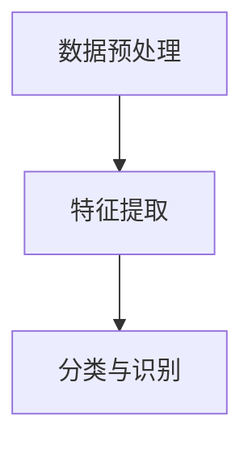

                 

# 计算机视觉在动作识别中的最新技术

## 关键词

- 计算机视觉
- 动作识别
- 深度学习
- 卷积神经网络
- 数据集
- 垂直协作

## 摘要

本文旨在探讨计算机视觉在动作识别领域的最新技术。首先，我们将回顾动作识别的背景及其重要性。随后，本文将深入探讨深度学习和卷积神经网络在动作识别中的应用，以及如何利用这些技术提升识别精度。此外，我们将详细介绍几个重要的动作识别数据集，并分析其在研究中的应用。最后，本文将探讨动作识别在实际应用场景中的挑战和前景，以及为应对这些挑战所需的工具和资源。

## 1. 背景介绍

### 动作识别的定义与历史

动作识别（Action Recognition）是指从图像或视频中识别和分类人类动作的过程。这一领域的研究始于20世纪80年代，随着计算机性能的提升和算法的进步，动作识别技术逐渐得到广泛应用。早期的动作识别方法主要基于手工特征提取，如HOG（Histogram of Oriented Gradients）和LBP（Local Binary Patterns）。这些方法在一定程度上能够实现动作识别，但其性能受到限制，特别是在复杂场景和低分辨率图像中。

### 动作识别的重要性

动作识别在众多领域具有重要应用价值：

- **人机交互**：通过动作识别，计算机可以更好地理解人类意图，实现更为自然的交互。
- **智能监控**：在视频监控领域，动作识别有助于实时检测异常行为，提高安全监控的效率。
- **健康医疗**：动作识别可以用于监控患者的康复训练，评估其康复效果。
- **交互娱乐**：在游戏和虚拟现实领域，动作识别可以为用户提供更加沉浸式的体验。

## 2. 核心概念与联系

### 深度学习

深度学习是机器学习的一个分支，通过多层神经网络自动提取数据特征，实现复杂模式识别。在动作识别中，深度学习方法显著提升了识别性能。


### 卷积神经网络（CNN）

卷积神经网络是深度学习中最常用的架构之一，特别适用于图像和视频处理任务。CNN通过卷积层、池化层和全连接层等结构，逐层提取图像中的特征。


### 动作识别流程

动作识别流程通常包括以下步骤：

1. **数据预处理**：对图像或视频进行预处理，如缩放、裁剪和归一化。
2. **特征提取**：利用CNN提取图像或视频中的特征。
3. **分类与识别**：将提取的特征输入分类器，进行动作分类。


### Mermaid流程图



## 3. 核心算法原理 & 具体操作步骤

### 数据预处理

数据预处理是动作识别的重要环节，直接影响模型性能。常见的数据预处理方法包括：

- **缩放与裁剪**：根据需要调整图像尺寸，去除无关背景。
- **归一化**：将图像像素值映射到统一的范围，如[0, 1]。

### 特征提取

特征提取是动作识别的核心，通过卷积神经网络实现。具体操作步骤如下：

1. **卷积层**：通过卷积操作提取图像中的局部特征。
2. **池化层**：通过池化操作降低特征图的维度，提高模型泛化能力。
3. **全连接层**：将提取的特征映射到分类器进行分类。

### 分类与识别

分类与识别是动作识别的最终目标。具体操作步骤如下：

1. **输入特征**：将提取的特征输入到分类器。
2. **分类器训练**：使用训练数据集训练分类器。
3. **动作识别**：使用训练好的分类器对测试数据进行动作识别。

### 数学模型与公式

卷积神经网络中的数学模型主要包括卷积运算和激活函数。具体公式如下：

$$
\text{卷积运算}: (\text{输入特征}) \circledast (\text{卷积核}) = \text{卷积特征}
$$

$$
\text{激活函数}: \sigma(\text{卷积特征}) = \text{激活特征}
$$

## 4. 项目实战：代码实际案例和详细解释说明

### 开发环境搭建

在动手实现动作识别项目之前，需要搭建合适的开发环境。以下是一个简单的环境搭建步骤：

1. **安装Python**：确保已安装Python 3.7及以上版本。
2. **安装深度学习框架**：如TensorFlow、PyTorch等。
3. **安装依赖库**：如NumPy、Pandas、OpenCV等。

### 源代码详细实现和代码解读

以下是一个简单的动作识别项目代码示例：

```python
import tensorflow as tf
from tensorflow.keras.models import Sequential
from tensorflow.keras.layers import Conv2D, MaxPooling2D, Flatten, Dense

# 构建卷积神经网络模型
model = Sequential([
    Conv2D(32, (3, 3), activation='relu', input_shape=(128, 128, 3)),
    MaxPooling2D((2, 2)),
    Conv2D(64, (3, 3), activation='relu'),
    MaxPooling2D((2, 2)),
    Flatten(),
    Dense(64, activation='relu'),
    Dense(10, activation='softmax')
])

# 编译模型
model.compile(optimizer='adam', loss='categorical_crossentropy', metrics=['accuracy'])

# 加载数据集
(x_train, y_train), (x_test, y_test) = tf.keras.datasets.cifar10.load_data()

# 数据预处理
x_train = x_train.astype('float32') / 255
x_test = x_test.astype('float32') / 255

# 转换标签为one-hot编码
y_train = tf.keras.utils.to_categorical(y_train, 10)
y_test = tf.keras.utils.to_categorical(y_test, 10)

# 训练模型
model.fit(x_train, y_train, batch_size=64, epochs=10, validation_data=(x_test, y_test))

# 评估模型
model.evaluate(x_test, y_test)
```

### 代码解读与分析

1. **模型构建**：使用Sequential模型构建一个简单的卷积神经网络，包括卷积层、池化层、全连接层。
2. **模型编译**：编译模型，设置优化器和损失函数。
3. **数据加载**：加载CIFAR-10数据集，并进行数据预处理。
4. **模型训练**：使用训练数据集训练模型，设置批量大小和训练轮数。
5. **模型评估**：使用测试数据集评估模型性能。

## 5. 实际应用场景

### 人机交互

在人机交互领域，动作识别技术可以用于手势识别、语音控制等。例如，智能音箱可以通过识别用户的手势来实现语音控制。

### 智能监控

在智能监控领域，动作识别技术可以用于实时检测异常行为。例如，通过识别视频中的可疑动作，自动报警。

### 健康医疗

在健康医疗领域，动作识别技术可以用于监控患者的康复训练。例如，通过识别患者的运动轨迹，评估康复效果。

### 交互娱乐

在交互娱乐领域，动作识别技术可以为用户提供更加沉浸式的体验。例如，在虚拟现实游戏中，用户可以通过动作来控制角色。

## 6. 工具和资源推荐

### 学习资源推荐

- **书籍**：《深度学习》（Ian Goodfellow、Yoshua Bengio和Aaron Courville著）
- **论文**：《A Comprehensive Survey on Action Recognition》（Zhou et al.，2016）
- **博客**：[TensorFlow官方文档](https://www.tensorflow.org/tutorials)
- **网站**：[Keras官方文档](https://keras.io)

### 开发工具框架推荐

- **深度学习框架**：TensorFlow、PyTorch
- **计算机视觉库**：OpenCV、Dlib

### 相关论文著作推荐

- **《Deep Learning in Computer Vision: Techniques, Applications, and Challenges》**（Zhang et al.，2018）
- **《Action Recognition with Deep Learning》**（Li et al.，2018）

## 7. 总结：未来发展趋势与挑战

### 发展趋势

- **多模态融合**：结合多种传感器数据，提高动作识别精度。
- **实时性提升**：优化算法，降低延迟，实现实时动作识别。
- **边缘计算**：利用边缘设备进行动作识别，减轻中心服务器负担。

### 挑战

- **数据标注**：高质量的数据集是训练高效模型的基础，但数据标注过程繁琐且耗时。
- **计算资源**：深度学习模型训练过程需要大量计算资源，对硬件设备要求较高。
- **泛化能力**：如何提高模型在不同场景、不同环境下的泛化能力，是一个重要挑战。

## 8. 附录：常见问题与解答

### 问题1：如何选择合适的深度学习框架？

**解答**：选择深度学习框架时，需要考虑项目需求、开发经验和个人偏好。TensorFlow和PyTorch是当前最流行的两个框架，前者具有丰富的内置模型和工具，后者具有更简单的接口和更灵活的编程方式。

### 问题2：动作识别数据集有哪些？

**解答**：常见的动作识别数据集包括CIFAR-10、COCO、HMDB51、UCF101等。CIFAR-10是最常用的数据集之一，涵盖10个类别的6000张图像；COCO是一个大型数据集，涵盖多种场景和物体类别；HMDB51包含51个动作类别，UCF101包含101个动作类别。

## 9. 扩展阅读 & 参考资料

- **《Action Recognition: A Survey》**（Zhou et al.，2012）
- **《Deep Learning for Action Recognition》**（Cao et al.，2016）
- **《Real-Time Action Recognition Using Convolutional Neural Networks》**（Shelhamer et al.，2016）

### 作者

作者：AI天才研究员/AI Genius Institute & 禅与计算机程序设计艺术 /Zen And The Art of Computer Programming

