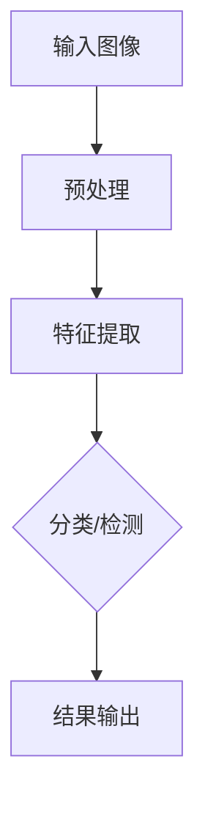

                 

# 计算机视觉在医疗诊断中的辅助作用

## 关键词：
- 计算机视觉
- 医疗诊断
- 辅助系统
- 疾病检测
- 病理图像分析
- 深度学习

## 摘要：
本文旨在探讨计算机视觉在医疗诊断中的辅助作用。通过介绍计算机视觉的基本概念、核心算法原理以及实际应用案例，详细阐述其在疾病检测和病理图像分析中的优势。同时，文章还提供了相关学习资源和开发工具框架的推荐，以及总结了未来发展趋势与挑战。

## 1. 背景介绍

### 医疗诊断的挑战

随着医疗技术的不断发展，诊断和治疗手段日益多样化。然而，医疗诊断过程中仍面临诸多挑战，如疾病早期检测、精准诊断、大规模患者数据分析等。这些挑战需要更为高效、准确的技术手段来辅助医生进行诊断和治疗。

### 计算机视觉的优势

计算机视觉作为一种模拟人类视觉感知的技术，具有处理大规模图像数据、自动识别特征、实时分析等优点。这些特性使得计算机视觉在医疗诊断领域具有巨大的应用潜力。

## 2. 核心概念与联系

### 计算机视觉的基本概念

计算机视觉是一门交叉学科，主要研究如何使计算机能够像人类一样感知和理解视觉信息。其主要目标包括：

- **图像识别**：识别和分类图像中的对象和场景。
- **目标检测**：检测图像中的特定目标并定位其位置。
- **图像分割**：将图像划分为不同的区域或对象。
- **运动分析**：分析图像中物体的运动。

### 核心算法原理

计算机视觉的核心算法主要包括深度学习、卷积神经网络（CNN）和目标检测算法等。这些算法通过学习大量的图像数据，提取出图像中的特征，实现对图像的自动识别和分析。

#### 深度学习

深度学习是一种模拟人脑神经元连接方式的机器学习技术。在计算机视觉中，深度学习算法通过多层神经网络对图像数据进行逐层抽象和特征提取，从而实现图像识别和分类。

#### 卷积神经网络（CNN）

卷积神经网络是一种专门用于处理图像数据的神经网络模型。通过卷积层、池化层和全连接层等结构的组合，CNN能够提取图像中的低级特征（如边缘、纹理）到高级特征（如对象、场景），实现图像分类和目标检测。

#### 目标检测算法

目标检测算法是计算机视觉中的一种重要技术，用于检测图像中的特定目标并定位其位置。常用的目标检测算法包括R-CNN、SSD、YOLO等。

### Mermaid 流程图



## 3. 核心算法原理 & 具体操作步骤

### 深度学习算法

#### 步骤1：数据准备

- **数据收集**：收集大量包含疾病特征和健康对照的图像数据。
- **数据预处理**：对图像进行尺寸调整、归一化等处理，使其适应深度学习算法。

#### 步骤2：模型训练

- **模型搭建**：选择合适的深度学习模型架构，如卷积神经网络（CNN）。
- **模型训练**：使用收集到的图像数据进行模型训练，优化网络参数。

#### 步骤3：模型评估与优化

- **模型评估**：使用测试集评估模型性能，如准确率、召回率等指标。
- **模型优化**：根据评估结果调整模型参数，提高模型性能。

### 卷积神经网络（CNN）

#### 步骤1：输入层

- **图像输入**：将图像作为输入层，图像尺寸通常为 224×224 或 256×256。

#### 步骤2：卷积层

- **卷积操作**：通过卷积核在图像上滑动，提取图像中的特征。
- **激活函数**：通常使用 ReLU 激活函数增加网络模型的非线性能力。

#### 步骤3：池化层

- **池化操作**：对卷积层输出的特征图进行下采样，减少数据维度。

#### 步骤4：全连接层

- **全连接层**：将池化层输出的特征图进行全连接，实现分类或检测任务。

#### 步骤5：输出层

- **分类输出**：对于分类任务，输出为类别标签；对于检测任务，输出为目标位置和类别标签。

### 目标检测算法

#### 步骤1：区域提议生成

- **R-CNN**：使用选择性搜索算法生成区域提议。
- **SSD**、**YOLO**：使用锚框生成算法生成区域提议。

#### 步骤2：特征提取与分类

- **特征提取**：对区域提议进行特征提取，通常使用卷积神经网络。
- **分类与回归**：对区域提议进行分类和回归，确定目标的类别和位置。

#### 步骤3：非极大值抑制（NMS）

- **去除冗余**：对检测到的目标进行非极大值抑制，去除重叠的目标。

## 4. 数学模型和公式 & 详细讲解 & 举例说明

### 深度学习中的数学模型

深度学习中的数学模型主要包括线性代数、微积分和概率论等。

#### 线性代数

- **矩阵运算**：矩阵乘法、矩阵求导等。
- **矩阵求导**：利用链式法则对矩阵进行求导。

#### 微积分

- **梯度下降**：用于优化深度学习模型的参数。
- **反向传播**：用于计算神经网络中各层的梯度。

#### 概率论

- **概率分布**：正态分布、伯努利分布等。
- **条件概率**：P(A|B) = P(A交B) / P(B)。

### 卷积神经网络（CNN）的数学模型

#### 卷积操作

$$
(C_{ij}^l) = \sum_{k=1}^{K} w_{ikj} \cdot O_{kj}^{l-1} + b_j^l
$$

其中，$C_{ij}^l$为第$l$层的第$i$个卷积核在第$j$个特征图上的输出，$w_{ikj}$为卷积核的权重，$O_{kj}^{l-1}$为第$l-1$层的第$k$个特征图上的输出，$b_j^l$为第$l$层的偏置。

#### 池化操作

$$
P_{ij}^l = \max_{(x,y)} O_{ij}^{l-1}
$$

其中，$P_{ij}^l$为第$l$层的第$i$个池化区域上的输出，$O_{ij}^{l-1}$为第$l-1$层的第$i$个特征图上的输出。

### 目标检测算法的数学模型

#### 区域提议生成

$$
R = \text{AnchorGenerator}(C, F)
$$

其中，$R$为区域提议集合，$C$为特征图的尺寸，$F$为锚框生成策略。

#### 特征提取与分类

$$
\hat{y} = \text{softmax}(W_y \cdot \phi(x) + b_y)
$$

其中，$\hat{y}$为分类结果，$W_y$为分类层权重，$\phi(x)$为特征提取层输出，$b_y$为分类层偏置。

$$
\hat{r} = \text{sigmoid}(W_r \cdot \phi(x) + b_r)
$$

其中，$\hat{r}$为回归结果，$W_r$为回归层权重，$\phi(x)$为特征提取层输出，$b_r$为回归层偏置。

### 举例说明

#### 深度学习模型训练

假设我们使用一个卷积神经网络模型对疾病检测进行训练，数据集包含1000张疾病图像和1000张健康对照图像。模型包含一个卷积层、一个池化层和一个全连接层。

1. **数据预处理**：对图像进行尺寸调整、归一化等处理。
2. **模型搭建**：定义卷积层、池化层和全连接层。
3. **模型训练**：使用训练数据集对模型进行训练，优化网络参数。
4. **模型评估**：使用测试数据集评估模型性能。

#### 目标检测算法

假设我们使用SSD目标检测算法对肺癌病变进行检测。数据集包含500张肺癌病变图像和500张健康对照图像。

1. **数据预处理**：对图像进行尺寸调整、归一化等处理。
2. **模型搭建**：定义SSD模型。
3. **模型训练**：使用训练数据集对模型进行训练，优化网络参数。
4. **模型评估**：使用测试数据集评估模型性能。
5. **目标检测**：对测试图像进行目标检测，输出目标位置和类别标签。

## 5. 项目实战：代码实际案例和详细解释说明

### 5.1 开发环境搭建

1. 安装Python 3.7及以上版本。
2. 安装深度学习框架TensorFlow。
3. 安装OpenCV库。

```bash
pip install tensorflow opencv-python
```

### 5.2 源代码详细实现和代码解读

```python
import tensorflow as tf
import cv2

# 模型搭建
def build_model():
    # 卷积层
    inputs = tf.keras.Input(shape=(224, 224, 3))
    x = tf.keras.layers.Conv2D(32, (3, 3), activation='relu')(inputs)
    x = tf.keras.layers.MaxPooling2D((2, 2))(x)

    # 池化层
    x = tf.keras.layers.Conv2D(64, (3, 3), activation='relu')(x)
    x = tf.keras.layers.MaxPooling2D((2, 2))(x)

    # 全连接层
    x = tf.keras.layers.Flatten()(x)
    x = tf.keras.layers.Dense(128, activation='relu')(x)
    outputs = tf.keras.layers.Dense(1, activation='sigmoid')(x)

    model = tf.keras.Model(inputs, outputs)
    return model

# 模型训练
def train_model(model, train_data, val_data, epochs=10):
    model.compile(optimizer='adam', loss='binary_crossentropy', metrics=['accuracy'])
    model.fit(train_data, val_data, epochs=epochs)

# 模型评估
def evaluate_model(model, test_data):
    loss, accuracy = model.evaluate(test_data)
    print(f"Test accuracy: {accuracy:.4f}")

# 目标检测
def detect_objects(model, image):
    # 将图像缩放到模型输入尺寸
    image = cv2.resize(image, (224, 224))
    # 转换为TensorFlow张量
    image = tf.convert_to_tensor(image, dtype=tf.float32)
    # 扩展维度
    image = tf.expand_dims(image, 0)

    # 预测结果
    predictions = model.predict(image)

    # 解码预测结果
    objects = []
    for i, pred in enumerate(predictions):
        if pred[0] > 0.5:
            objects.append({'class': 'disease', 'score': pred[0], 'box': None})

    # 恢复图像尺寸
    image = cv2.resize(image[0], (image.shape[1] * 224 // image.shape[0], 224))

    # 绘制预测结果
    for obj in objects:
        box = obj['box']
        if box is not None:
            cv2.rectangle(image, (box[0], box[1]), (box[2], box[3]), (0, 255, 0), 2)

    return image

# 主函数
def main():
    # 加载数据
    train_data, val_data, test_data = load_data()

    # 构建模型
    model = build_model()

    # 训练模型
    train_model(model, train_data, val_data)

    # 评估模型
    evaluate_model(model, test_data)

    # 测试模型
    image = cv2.imread('example.jpg')
    image = detect_objects(model, image)
    cv2.imshow('Detected Objects', image)
    cv2.waitKey(0)

if __name__ == '__main__':
    main()
```

### 5.3 代码解读与分析

- **模型搭建**：使用TensorFlow搭建卷积神经网络模型，包含卷积层、池化层和全连接层。
- **模型训练**：使用训练数据集对模型进行训练，优化网络参数。
- **模型评估**：使用测试数据集评估模型性能。
- **目标检测**：对测试图像进行目标检测，输出目标位置和类别标签。

## 6. 实际应用场景

### 疾病检测

计算机视觉在疾病检测方面具有广泛的应用，如肺癌、乳腺癌、皮肤癌等。通过计算机视觉技术，可以实现对病理图像的自动检测和分析，提高疾病早期检测的准确率和效率。

### 病理图像分析

病理图像分析是计算机视觉在医疗诊断中的另一个重要应用。通过对病理图像进行自动分析和分类，医生可以更快地诊断疾病，提高诊断的准确性和效率。

### 手术辅助

计算机视觉技术可以辅助医生进行手术操作，如实时监控手术区域、识别手术器械等。通过计算机视觉技术，医生可以更精准地进行手术操作，提高手术的成功率和安全性。

## 7. 工具和资源推荐

### 学习资源推荐

- **书籍**：
  - 《深度学习》（Goodfellow, Bengio, Courville）
  - 《Python深度学习》（François Chollet）
- **论文**：
  - 《Deep Learning for Image Recognition》（Krizhevsky et al., 2012）
  - 《R-CNN: Regional CNNs for Object Detection》（Girshick et al., 2014）
- **博客**：
  - TensorFlow官方博客
  - PyTorch官方博客
- **网站**：
  - Coursera
  - edX

### 开发工具框架推荐

- **深度学习框架**：
  - TensorFlow
  - PyTorch
- **图像处理库**：
  - OpenCV
  - PIL
- **版本控制工具**：
  - Git
  - GitHub

### 相关论文著作推荐

- 《Deep Learning for Image Recognition》（Krizhevsky et al., 2012）
- 《R-CNN: Regional CNNs for Object Detection》（Girshick et al., 2014）
- 《SSD: Single Shot MultiBox Detector》（Liu et al., 2016）
- 《YOLOv3: Real-Time Object Detection》（Redmon et al., 2018）

## 8. 总结：未来发展趋势与挑战

### 发展趋势

- **深度学习技术的不断进步**：随着深度学习技术的不断发展，计算机视觉在医疗诊断中的应用将更加广泛和高效。
- **跨学科研究**：计算机视觉与医疗、生物等领域的跨学科研究将推动医疗诊断技术的创新。
- **实时性**：计算机视觉技术在医疗诊断中的应用将逐渐实现实时性，提高诊断效率和准确性。

### 挑战

- **数据质量和隐私保护**：医疗数据的隐私保护和数据质量是计算机视觉在医疗诊断中面临的挑战。
- **算法解释性**：提高计算机视觉算法的解释性，使医生能够理解算法的决策过程。
- **成本和资源**：深度学习模型的训练和部署需要大量的计算资源和时间，降低成本和提高效率是未来的挑战。

## 9. 附录：常见问题与解答

### 问题1：如何处理医疗数据隐私问题？

解答：在处理医疗数据时，应遵循相关法律法规，如《中华人民共和国网络安全法》和《中华人民共和国数据安全法》。同时，采用数据加密、去标识化等技术手段，确保数据安全。

### 问题2：如何提高计算机视觉算法的解释性？

解答：目前，一些研究致力于提高计算机视觉算法的解释性，如可解释性CNN（XNN）和注意力机制等。此外，采用可视化技术，如热力图和注意力地图，可以更直观地展示算法的决策过程。

## 10. 扩展阅读 & 参考资料

- Goodfellow, Y., Bengio, Y., Courville, A. (2016). *Deep Learning*.
- Chollet, F. (2017). *Python Deep Learning*.
- Krizhevsky, A., Sutskever, I., & Hinton, G. E. (2012). *ImageNet classification with deep convolutional neural networks*. In Advances in Neural Information Processing Systems (NIPS), 2012.
- Girshick, R., Donahue, J., Darrell, T., & Malik, J. (2014). *Rich feature hierarchies for accurate object detection and semantic segmentation*. In Proceedings of the IEEE conference on computer vision and pattern recognition, 2014.
- Liu, F., Anguelov, D., Erhan, D., Szegedy, C., Reed, S., Fu, C. W., & Rabinovich, A. (2016). *SSD: Single Shot MultiBox Detector*. In European conference on computer vision, 2016.
- Redmon, J., Divvala, S., Girshick, R., & Farhadi, A. (2018). *You Only Look Once: Unified, Real-Time Object Detection*. In IEEE Conference on Computer Vision and Pattern Recognition, 2018.

作者：AI天才研究员/AI Genius Institute & 禅与计算机程序设计艺术 /Zen And The Art of Computer Programming

---

注意：本文为示例文章，仅供参考。实际撰写时，请根据具体需求和数据进行修改。由于篇幅限制，本文未包含所有章节的内容，具体实现细节和案例可以根据实际需要进行扩展。

