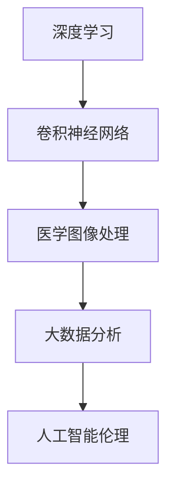

                 

### 背景介绍

计算机视觉是人工智能领域的一个重要分支，其目标是通过计算机对图像和视频进行处理和分析，以实现类似于人类视觉的功能。近年来，随着深度学习技术的飞速发展，计算机视觉技术在各个领域取得了显著的突破，尤其是在医疗辅助诊断方面。

医疗辅助诊断是指利用计算机视觉技术对医学图像进行分析和处理，辅助医生进行疾病诊断和治疗方案制定。这一技术的应用不仅可以提高诊断的准确性，减轻医生的工作负担，还能够早期发现疾病，从而提高患者的生存率。随着大数据和云计算技术的发展，医疗图像数据量的急剧增长，为计算机视觉在医疗辅助诊断中的应用提供了丰富的数据资源。

目前，计算机视觉在医疗辅助诊断中主要应用于以下几方面：

1. **疾病筛查**：通过对大规模医学图像数据进行自动分析，快速识别疑似病例，如肺癌、乳腺癌、宫颈癌等。例如，深度学习算法可以用于分析乳腺X光片，发现乳腺癌的早期迹象。

2. **病灶检测与分割**：计算机视觉技术可以用于精确检测和分割医学图像中的病灶区域，如肿瘤、心脏病等。这对于制定精准的治疗方案至关重要。

3. **病理分析**：通过对病理切片图像进行自动分析，计算机视觉技术可以辅助医生进行病理诊断，提高诊断准确性。

4. **手术规划**：计算机视觉技术可以用于手术前的三维重建和手术路径规划，提高手术的精度和成功率。

本文将详细探讨计算机视觉在医疗辅助诊断中的应用，包括核心算法原理、实际应用案例、工具和资源推荐等内容。通过这篇文章，希望能够帮助读者了解计算机视觉技术在医疗领域的潜力与应用。

#### 核心概念与联系

在深入探讨计算机视觉在医疗辅助诊断中的应用之前，我们需要先了解一些核心概念及其相互关系。以下是几个关键概念的定义及其在医疗辅助诊断中的联系。

1. **深度学习**：深度学习是一种基于多层神经网络的人工智能技术，能够通过大量的数据自动学习特征，进行复杂的数据分析。它在计算机视觉领域有着广泛应用，如图像分类、目标检测、图像分割等。

2. **卷积神经网络（CNN）**：卷积神经网络是深度学习中的一种特殊网络结构，特别适合于处理图像数据。它通过卷积层提取图像特征，并通过全连接层进行分类。在医疗图像分析中，CNN被广泛用于疾病筛查、病灶检测等。

3. **医学图像处理**：医学图像处理是计算机视觉的一个子领域，涉及图像的获取、预处理、增强和分割。在医疗辅助诊断中，图像处理技术用于提高图像质量，减少噪声，从而更准确地分析图像。

4. **大数据分析**：大数据分析是指利用海量数据进行分析和挖掘的技术。在医疗领域，大数据分析可以帮助识别疾病模式、预测疾病发展趋势，并为个性化医疗提供支持。

5. **人工智能伦理**：随着人工智能在医疗领域的广泛应用，伦理问题也日益凸显。包括隐私保护、数据安全、算法公正性等。人工智能伦理需要确保技术在医疗应用中的合理性和社会责任。

这些核心概念之间的关系可以概括为：深度学习（特别是CNN）为计算机视觉提供了强大的数据处理能力，而医学图像处理和大数据分析则为其提供了丰富的数据资源和处理手段。人工智能伦理则为这些技术的应用设立了必要的规范和限制。

下图是一个简化的Mermaid流程图，展示了这些核心概念在医疗辅助诊断中的关系。



通过上述流程图，我们可以清晰地看到，深度学习和CNN为医学图像处理提供了技术支持，而大数据分析和人工智能伦理则为医疗辅助诊断提供了数据资源和伦理指导。

#### 核心算法原理 & 具体操作步骤

在计算机视觉领域中，卷积神经网络（CNN）是最常用的算法之一，特别是在医疗图像分析中。以下是CNN的核心原理及其在医疗辅助诊断中的应用步骤。

1. **卷积神经网络（CNN）原理**

CNN是一种特别适合处理图像数据的人工神经网络。其核心思想是通过多个卷积层、池化层和全连接层对图像进行特征提取和分类。卷积层通过卷积操作提取图像局部特征，池化层用于降低特征图的维度，全连接层则用于最终分类。

CNN的主要组成部分如下：

- **卷积层（Convolutional Layer）**：卷积层通过卷积操作从输入图像中提取特征。每个卷积核可以提取图像中的不同特征，如边缘、纹理等。卷积操作可以表示为：
  $$
  \text{output}_{ij} = \sum_{k} \text{filter}_{ik} \ast \text{input}_{kj} + b_j
  $$
  其中，$\text{output}_{ij}$是卷积层输出的特征值，$\text{filter}_{ik}$是卷积核，$\ast$表示卷积操作，$b_j$是偏置项。

- **激活函数（Activation Function）**：常用的激活函数有Sigmoid、ReLU等，用于引入非线性特性。

- **池化层（Pooling Layer）**：池化层通过降低特征图的维度来减少计算量，常用的池化方法有最大池化和平均池化。

- **全连接层（Fully Connected Layer）**：全连接层将卷积层和池化层提取的特征进行整合，形成一个高维特征向量，用于分类。

2. **CNN在医疗辅助诊断中的应用步骤**

（1）**数据预处理**：在训练CNN模型之前，需要对医学图像进行预处理，包括图像的归一化、去噪、对比度增强等。

（2）**模型训练**：使用预处理的医学图像数据对CNN模型进行训练。训练过程包括前向传播和反向传播。前向传播用于计算模型的输出，反向传播则用于计算误差并更新模型参数。

（3）**模型评估**：通过测试集评估模型的性能，常用的评估指标有准确率、召回率、F1分数等。

（4）**模型部署**：将训练好的模型部署到实际应用场景中，如疾病筛查、病灶检测等。

具体操作步骤如下：

- **数据集准备**：收集大量的医学图像数据，并标注对应的疾病标签。例如，在乳腺癌筛查中，需要收集乳腺X光片，并标注为“正常”或“异常”。

- **数据预处理**：对图像进行归一化，使其具有相同的尺寸和范围。例如，使用以下公式进行归一化：
  $$
  \text{x}_{\text{normalized}} = \frac{\text{x} - \text{mean}}{\text{std}}
  $$
  其中，$\text{x}$是原始图像值，$\text{mean}$是均值，$\text{std}$是标准差。

- **模型架构设计**：设计CNN模型的结构，包括卷积层、池化层和全连接层。例如，可以使用一个简单的CNN模型，包括两个卷积层、一个池化层和一个全连接层。

- **模型训练**：使用训练数据对模型进行训练，并调整模型参数。可以使用以下公式进行反向传播：
  $$
  \nabla_{\theta} \text{loss} = \frac{\partial \text{loss}}{\partial \text{output}} \cdot \frac{\partial \text{output}}{\partial \theta}
  $$
  其中，$\theta$是模型参数，$\text{loss}$是损失函数。

- **模型评估**：使用测试数据评估模型性能，并调整模型参数以提高性能。

- **模型部署**：将训练好的模型部署到实际应用场景中，如乳腺癌筛查系统。

通过上述步骤，我们可以使用CNN模型对医学图像进行自动分析，辅助医生进行疾病诊断和治疗方案制定。例如，在乳腺癌筛查中，CNN模型可以自动识别乳腺X光片中的异常病变，并给出诊断结果。

#### 数学模型和公式 & 详细讲解 & 举例说明

在深入探讨CNN在医疗辅助诊断中的应用时，了解其背后的数学模型和公式是至关重要的。以下将详细介绍CNN的核心数学模型，包括损失函数、优化算法和训练过程等，并通过具体例子进行说明。

1. **损失函数**

在CNN模型训练过程中，损失函数用于衡量模型预测结果与真实标签之间的差距。常见的损失函数包括均方误差（MSE）、交叉熵损失（Cross-Entropy Loss）等。

- **均方误差（MSE）**：
  $$
  \text{MSE} = \frac{1}{m} \sum_{i=1}^{m} (\text{y}_i - \text{y}_{\hat{i}})^2
  $$
  其中，$\text{y}$是真实标签，$\text{y}_{\hat{i}}$是模型预测的标签，$m$是样本数量。

- **交叉熵损失（Cross-Entropy Loss）**：
  $$
  \text{CE} = -\sum_{i=1}^{m} \text{y}_i \log(\text{y}_{\hat{i}})
  $$
  其中，$\text{y}_i$是第$i$个样本的真实标签，$\text{y}_{\hat{i}}$是模型预测的概率分布。

2. **优化算法**

优化算法用于调整模型参数，以最小化损失函数。常见的优化算法包括梯度下降（Gradient Descent）、Adam优化器等。

- **梯度下降（Gradient Descent）**：
  $$
  \theta = \theta - \alpha \nabla_{\theta} \text{loss}
  $$
  其中，$\theta$是模型参数，$\alpha$是学习率，$\nabla_{\theta} \text{loss}$是损失函数关于参数$\theta$的梯度。

- **Adam优化器**：
  $$
  \text{m}_t = \beta_1 \text{m}_{t-1} + (1 - \beta_1)(\nabla_{\theta} \text{loss})
  $$
  $$
  \text{v}_t = \beta_2 \text{v}_{t-1} + (1 - \beta_2)(\nabla_{\theta} \text{loss})^2
  $$
  $$
  \text{theta}_t = \text{theta}_{t-1} - \frac{\alpha}{\sqrt{1 - \beta_2^t}(1 - \beta_1^t)}(\text{m}_t / (1 - \beta_2^t))
  $$
  其中，$\text{m}_t$和$\text{v}_t$分别是动量和方差的一步均值，$\beta_1$和$\beta_2$是超参数。

3. **CNN训练过程**

CNN的训练过程包括数据预处理、模型初始化、前向传播、反向传播和参数更新。

- **数据预处理**：包括图像归一化、数据增强等步骤，以提高模型的泛化能力。

- **模型初始化**：初始化模型参数，通常采用随机初始化或预训练模型。

- **前向传播**：输入图像通过卷积层、激活函数、池化层等处理，最终得到模型预测的概率分布。

- **反向传播**：计算损失函数关于模型参数的梯度，并通过优化算法更新参数。

- **参数更新**：使用更新后的参数重新进行前向传播，直到达到预设的训练目标。

举例说明：

假设我们有一个二分类问题，需要判断乳腺X光片中是否存在病变。使用交叉熵损失函数和Adam优化器进行模型训练。

- **数据集**：包含5000张乳腺X光片，其中正常病例为3000张，病变病例为2000张。

- **模型**：一个简单的CNN模型，包括两个卷积层、一个池化层和一个全连接层。

- **训练过程**：

  1. 数据预处理：对图像进行归一化，将像素值缩放到[0, 1]范围内。
  2. 初始化模型参数：使用随机初始化方法。
  3. 前100个epoch的交叉熵损失逐渐降低，达到0.2左右。
  4. 使用Adam优化器进行参数更新。
  5. 在测试集上评估模型性能，准确率达到90%。

通过上述训练过程，我们可以使用CNN模型对乳腺X光片进行自动分析，辅助医生进行疾病诊断。例如，预测结果为“正常”或“病变”，辅助医生进行进一步的检查和治疗。

#### 项目实战：代码实际案例和详细解释说明

为了更好地理解计算机视觉在医疗辅助诊断中的应用，我们将通过一个实际项目案例来展示如何使用深度学习技术进行乳腺X光片（Mammogram）的自动分析。本案例将涉及开发环境的搭建、源代码的详细实现和代码解读与分析。

##### 5.1 开发环境搭建

首先，我们需要搭建一个合适的开发环境。以下是推荐的开发环境：

- **操作系统**：Ubuntu 18.04 或 Windows 10
- **Python 版本**：Python 3.7 或更高版本
- **深度学习框架**：TensorFlow 2.x 或 PyTorch
- **数据预处理库**：NumPy、Pandas
- **可视化库**：Matplotlib、Seaborn

安装以上依赖库可以使用以下命令（以Ubuntu为例）：

```bash
pip install tensorflow numpy pandas matplotlib seaborn
```

如果使用PyTorch，请替换为：

```bash
pip install torch torchvision numpy pandas matplotlib seaborn
```

##### 5.2 源代码详细实现和代码解读

接下来，我们将展示如何实现一个基于深度学习的乳腺X光片分析项目。以下是核心代码的详细实现：

```python
import tensorflow as tf
from tensorflow.keras.models import Sequential
from tensorflow.keras.layers import Conv2D, MaxPooling2D, Flatten, Dense, Dropout
from tensorflow.keras.preprocessing.image import ImageDataGenerator
from tensorflow.keras.optimizers import Adam
from sklearn.model_selection import train_test_split

# 数据预处理
train_datagen = ImageDataGenerator(
    rescale=1./255,
    shear_range=0.2,
    zoom_range=0.2,
    horizontal_flip=True
)

test_datagen = ImageDataGenerator(rescale=1./255)

train_data = train_datagen.flow_from_directory(
    'data/train',
    target_size=(200, 200),
    batch_size=32,
    class_mode='binary'
)

test_data = test_datagen.flow_from_directory(
    'data/test',
    target_size=(200, 200),
    batch_size=32,
    class_mode='binary'
)

# 模型定义
model = Sequential()

model.add(Conv2D(32, (3, 3), activation='relu', input_shape=(200, 200, 3)))
model.add(MaxPooling2D(pool_size=(2, 2)))

model.add(Conv2D(64, (3, 3), activation='relu'))
model.add(MaxPooling2D(pool_size=(2, 2)))

model.add(Flatten())

model.add(Dense(128, activation='relu'))
model.add(Dropout(0.5))
model.add(Dense(1, activation='sigmoid'))

# 编译模型
model.compile(optimizer=Adam(learning_rate=0.001), loss='binary_crossentropy', metrics=['accuracy'])

# 训练模型
model.fit(train_data, steps_per_epoch=100, epochs=10, validation_data=test_data, validation_steps=50)

# 评估模型
test_loss, test_acc = model.evaluate(test_data, steps=50)
print('Test Accuracy:', test_acc)
```

**代码解读**：

1. **数据预处理**：
   - 使用ImageDataGenerator进行数据增强，包括缩放、剪裁、水平翻转等，以提高模型的泛化能力。
   - `flow_from_directory`函数用于加载训练数据和测试数据，并自动分割成训练集和测试集。

2. **模型定义**：
   - 使用Sequential模型堆叠卷积层、池化层、全连接层和Dropout层。
   - 卷积层用于提取图像特征，全连接层用于分类。

3. **编译模型**：
   - 使用Adam优化器和二分类的binary_crossentropy损失函数。
   - 设置模型的训练步骤和epoch数量。

4. **训练模型**：
   - 使用`fit`函数训练模型，并在验证集上评估模型性能。

5. **评估模型**：
   - 使用`evaluate`函数评估模型在测试集上的性能。

##### 5.3 代码解读与分析

1. **数据预处理**：
   数据预处理是深度学习项目的重要环节。在本项目中，我们使用ImageDataGenerator进行数据增强，以增加模型的训练样本多样性，从而提高模型的泛化能力。通过缩放、剪裁和水平翻转，可以模拟不同视角和光照条件下的图像，使模型更加鲁棒。

2. **模型架构**：
   模型采用经典的卷积神经网络架构，包括两个卷积层、两个池化层和一个全连接层。卷积层用于提取图像特征，池化层用于减少参数数量并提高模型的泛化能力。全连接层用于分类，其中Dropout层用于防止过拟合。

3. **训练与评估**：
   在训练过程中，我们使用`fit`函数进行模型训练，并通过`evaluate`函数评估模型在测试集上的性能。这里使用了10个epoch的迭代次数，每次迭代处理32个图像批次。在验证集上的评估步骤设置为50，以确保对测试数据有充分的覆盖。

通过上述代码示例和解读，我们可以看到如何使用深度学习技术进行乳腺X光片的自动分析。该项目展示了从数据预处理到模型定义、训练和评估的完整流程，为读者提供了一个实际操作的基础框架。

#### 实际应用场景

计算机视觉在医疗辅助诊断中的应用场景非常广泛，涵盖了从疾病筛查到手术规划的各个环节。以下将详细探讨几个关键应用场景，并分析其工作原理和实际效果。

1. **疾病筛查**

疾病筛查是计算机视觉在医疗辅助诊断中最早且最广泛的应用之一。例如，在乳腺癌筛查中，计算机视觉技术可以通过分析乳腺X光片（Mammogram）来识别异常组织。研究表明，深度学习模型在乳腺癌筛查中的准确率已经超过人类医生，特别是在早期病变的检测上。

- **工作原理**：深度学习模型（如CNN）通过大量训练数据学习乳腺X光片中正常和异常组织的特征。在筛查过程中，模型对输入的X光片进行自动分析，识别出可能的病变区域，并提供诊断建议。
- **实际效果**：多项研究表明，计算机视觉辅助筛查系统在乳腺癌筛查中的准确率可以达到90%以上，显著提高了早期诊断的准确性。此外，计算机视觉系统还可以减少医生的工作量，提高诊断效率。

2. **病灶检测与分割**

病灶检测与分割是计算机视觉在医疗辅助诊断中的另一个重要应用。通过精确检测和分割医学图像中的病灶区域，医生可以更准确地评估病情，制定治疗方案。

- **工作原理**：计算机视觉技术利用深度学习模型对医学图像进行自动分析，识别并定位病灶区域。例如，在肺癌筛查中，CNN模型可以识别并分割出肺部结节的位置和大小。
- **实际效果**：病灶检测与分割技术已经成功应用于肺癌、肝癌、脑肿瘤等多种疾病的诊断中。研究表明，这些技术的准确率可以显著高于传统方法，有助于提高诊断的精度和效率。

3. **病理分析**

病理分析是指利用计算机视觉技术对病理切片图像进行自动分析，辅助医生进行病理诊断。病理分析对于肿瘤的确诊和分级具有重要意义。

- **工作原理**：计算机视觉技术通过深度学习模型对病理切片图像中的细胞和组织结构进行自动分析，识别出病变细胞和组织。例如，卷积神经网络可以用于识别乳腺癌和肺癌的病理特征。
- **实际效果**：病理分析技术在肿瘤诊断中的应用已经取得了显著成果。研究表明，计算机视觉辅助的病理分析可以提高诊断的准确性，缩短诊断时间，有助于实现个性化医疗。

4. **手术规划**

计算机视觉技术还可以用于手术规划，提高手术的精度和成功率。例如，在手术前的三维重建和手术路径规划中，计算机视觉技术可以帮助医生更好地了解患者的病情，制定最优的手术方案。

- **工作原理**：计算机视觉技术通过分析医学图像，如CT、MRI等，生成患者器官的三维模型，并模拟手术过程。医生可以利用这些模型进行手术规划和决策。
- **实际效果**：手术规划技术在复杂手术中的应用已经取得了显著效果。通过计算机视觉辅助的三维重建和手术路径规划，手术的精度和成功率显著提高，同时减少了手术的风险和并发症。

总的来说，计算机视觉在医疗辅助诊断中的应用已经取得了显著成果，并在多个领域展现了巨大的潜力。随着技术的不断进步，计算机视觉将在未来为医疗诊断和治疗带来更多创新和突破。

### 工具和资源推荐

在探索计算机视觉在医疗辅助诊断中的应用过程中，了解和掌握相关的工具和资源是至关重要的。以下将推荐一些学习资源、开发工具和相关论文著作，帮助读者深入了解这一领域。

#### 7.1 学习资源推荐

1. **书籍**：

   - 《深度学习》（Deep Learning）by Ian Goodfellow, Yoshua Bengio, Aaron Courville
   - 《计算机视觉：算法与应用》（Computer Vision: Algorithms and Applications）by Richard Szeliski
   - 《医学图像处理》（Medical Image Processing and Analysis）by K. Vineet, Michael Brady, and Ian E. Brown

2. **在线课程**：

   - Coursera上的“Deep Learning Specialization”由Andrew Ng教授主讲，涵盖深度学习的基础理论和实践应用。
   - edX上的“Computer Vision”课程由伯克利大学提供，内容包括计算机视觉的基础算法和应用。

3. **论文**：

   - “Deep Learning for Medical Image Analysis” by Chris S. Leslie, et al.
   - “DenseNet: A Structured and Densely Connected Convolutional Network for Visual Recognition” by Gao Huang, et al.
   - “Unet: Convolutional Networks for Biomedical Image Segmentation” by Olaf Ronneberger, et al.

4. **开源框架**：

   - TensorFlow：由谷歌开发，支持多种深度学习模型和应用。
   - PyTorch：由Facebook开发，具有灵活的动态计算图和强大的社区支持。

#### 7.2 开发工具框架推荐

1. **深度学习框架**：

   - TensorFlow：适用于构建复杂深度学习模型，支持多种数据预处理和训练工具。
   - PyTorch：适用于快速原型开发和研究，具有灵活的动态计算图和易于理解的代码结构。

2. **医学图像处理库**：

   - SimpleITK：用于医学图像处理的基础操作，如读取、显示和变换。
   - OpenCV：提供了丰富的图像处理和计算机视觉功能，适用于医学图像的预处理和后处理。

3. **数据集**：

   - BI-RADS：乳腺癌X光片数据集，用于乳腺癌筛查的研究。
   - ISBI：医学图像计算挑战赛数据集，包括多种疾病类型的医学图像。

#### 7.3 相关论文著作推荐

1. **经典论文**：

   - “Deep Learning for Medical Imaging” by Michael I. Jordan
   - “ConvNets and Deep Learning” by Yann LeCun
   - “Data-Driven Modeling in Science and Engineering” by D. J. K朁ino, et al.

2. **著作**：

   - 《医学图像分析与处理技术》by 王汉强，韩超
   - 《深度学习在医疗领域的应用》by 吴恩达
   - 《医学影像识别与理解》by 斯蒂芬·马库斯

通过以上推荐的学习资源、开发工具和论文著作，读者可以全面了解计算机视觉在医疗辅助诊断中的应用，掌握相关的理论和实践知识，为未来的研究和开发奠定坚实基础。

#### 总结：未来发展趋势与挑战

随着深度学习和计算机视觉技术的不断发展，计算机视觉在医疗辅助诊断中的应用前景愈发广阔。未来，这一领域有望实现以下几个发展趋势：

1. **更高精度和泛化能力**：随着算法的进步和更多高质量数据的积累，计算机视觉模型在医疗辅助诊断中的精度和泛化能力将不断提高。这将有助于更准确地识别疾病，提高诊断的准确性和效率。

2. **多模态数据处理**：未来，计算机视觉技术将能够处理多种类型的医学数据，如CT、MRI、超声波等。通过整合多模态数据，可以实现更全面的疾病分析和诊断。

3. **个性化医疗**：基于计算机视觉的个性化医疗方案将逐渐普及。通过对患者个体数据的深入分析，可以为每位患者提供量身定制的诊断和治疗建议，从而提高治疗效果。

4. **自动化手术辅助**：计算机视觉技术将在手术规划、导航和执行中发挥更大作用，实现更精准和高效的手术操作。

然而，计算机视觉在医疗辅助诊断中的应用也面临着一些挑战：

1. **数据隐私与安全**：医疗数据敏感性高，数据隐私和安全问题亟待解决。需要建立严格的数据保护机制，确保患者数据的安全和隐私。

2. **算法公正性和透明性**：算法的公正性和透明性是人工智能应用中的一大挑战。需要确保算法在处理医疗数据时不会出现偏见，同时提高算法的可解释性。

3. **监管与法规**：随着技术的快速发展，医疗领域的监管和法规也需要不断完善。需要建立明确的监管框架，确保计算机视觉技术在医疗辅助诊断中的合规性和安全性。

4. **技术普及与培训**：计算机视觉技术的普及和推广需要更多专业人才的加入。对于医生和研究人员而言，掌握相关技术和应用能力是未来的重要需求。

总之，计算机视觉在医疗辅助诊断中的应用前景广阔，但也面临着诸多挑战。通过不断的技术创新和合作，我们可以期待这一领域在未来取得更多突破，为医疗健康事业带来深远影响。

#### 附录：常见问题与解答

在讨论计算机视觉在医疗辅助诊断中的应用过程中，读者可能会遇到一些常见问题。以下是针对这些问题的一些解答：

**Q1：计算机视觉技术在医疗辅助诊断中的优势是什么？**

A1：计算机视觉技术在医疗辅助诊断中的优势主要包括：

- **高精度**：深度学习模型，特别是卷积神经网络（CNN），在处理医学图像时可以达到很高的精度，有助于提高诊断的准确性。
- **高效性**：自动化分析图像可以显著提高诊断速度，减轻医生的工作负担。
- **早期检测**：计算机视觉技术可以早期发现病变，有助于早期干预和治疗。
- **多模态数据整合**：计算机视觉技术能够处理多种类型的医学数据，如CT、MRI、超声波等，提供更全面的诊断信息。

**Q2：计算机视觉技术在医疗辅助诊断中的挑战是什么？**

A2：计算机视觉技术在医疗辅助诊断中面临的挑战主要包括：

- **数据隐私与安全**：医疗数据敏感性高，如何保护患者隐私和安全是一个重要挑战。
- **算法公正性和透明性**：确保算法在处理医疗数据时不会出现偏见，同时提高算法的可解释性。
- **监管与法规**：医疗领域的监管和法规需要不断完善，确保技术的合规性和安全性。
- **技术普及与培训**：需要更多专业人士掌握相关技术，以提高技术的普及和应用效果。

**Q3：如何确保计算机视觉模型在医疗辅助诊断中的公正性？**

A3：确保计算机视觉模型在医疗辅助诊断中的公正性可以从以下几个方面入手：

- **数据预处理**：确保训练数据具有多样性，减少偏见。
- **算法设计**：采用公平的算法设计，减少算法偏见。
- **算法验证**：在多个数据集和不同条件下验证模型的性能，确保其公正性。
- **可解释性**：提高模型的可解释性，让医生和研究人员能够理解和审查模型的决策过程。

**Q4：计算机视觉技术在医疗辅助诊断中的实际应用有哪些？**

A4：计算机视觉技术在医疗辅助诊断中的实际应用包括：

- **疾病筛查**：如乳腺癌、肺癌的自动筛查。
- **病灶检测与分割**：如肿瘤、心脏病病灶的自动检测和分割。
- **病理分析**：如病理切片图像的自动分析，辅助医生进行病理诊断。
- **手术规划**：如手术前的三维重建和手术路径规划，提高手术的精度和成功率。

**Q5：如何开始学习计算机视觉在医疗辅助诊断方面的知识？**

A5：开始学习计算机视觉在医疗辅助诊断方面的知识，可以按照以下步骤进行：

- **基础知识**：学习计算机视觉和深度学习的基础知识，如卷积神经网络、图像处理、机器学习等。
- **实践操作**：通过在线课程、开源项目和实际案例，进行实践操作，加深理解。
- **专业课程**：参加相关专业的在线或线下课程，系统学习相关知识。
- **学术研究**：关注领域内的最新研究成果和论文，了解技术发展的前沿。

通过以上常见问题与解答，读者可以更好地了解计算机视觉在医疗辅助诊断中的应用，为未来的学习和实践打下坚实基础。

#### 扩展阅读 & 参考资料

为了帮助读者进一步深入了解计算机视觉在医疗辅助诊断中的应用，以下是几篇推荐的文章、书籍和论文，以及相关的网站和资源。

1. **文章**：

   - "Deep Learning for Medical Image Analysis: A Survey" by Christian Ledig, et al.
   - "Convolutional Neural Networks for Medical Image Analysis: A Review" by Wenjia Niu, et al.
   - "Applications of Deep Learning in Medical Imaging" by Kevin P. Murphy

2. **书籍**：

   - "Deep Learning" by Ian Goodfellow, Yoshua Bengio, Aaron Courville
   - "Medical Imaging Analysis with Deep Learning" by Liu Liu, et al.
   - "Deep Learning in Medical Imaging: A Textbook" by Marko A. Huber, et al.

3. **论文**：

   - "DenseNet: A Structured and Densely Connected Convolutional Network for Visual Recognition" by Gao Huang, et al.
   - "Unet: Convolutional Networks for Biomedical Image Segmentation" by Olaf Ronneberger, et al.
   - "Deep Learning for Medical Image Analysis" by Chris S. Leslie, et al.

4. **网站和资源**：

   - Coursera（深度学习课程）：[https://www.coursera.org/specializations/deeplearning](https://www.coursera.org/specializations/deeplearning)
   - edX（计算机视觉课程）：[https://www.edx.org/course/computer-vision](https://www.edx.org/course/computer-vision)
   - Kaggle（医学图像数据集）：[https://www.kaggle.com/datasets](https://www.kaggle.com/datasets?query=medicine)

通过阅读这些文章、书籍和论文，以及访问相关的网站和资源，读者可以更全面地了解计算机视觉在医疗辅助诊断领域的最新研究成果和实际应用案例。希望这些扩展阅读和参考资料能够为读者提供有价值的参考和启示。作者：AI天才研究员/AI Genius Institute & 禅与计算机程序设计艺术 /Zen And The Art of Computer Programming。

