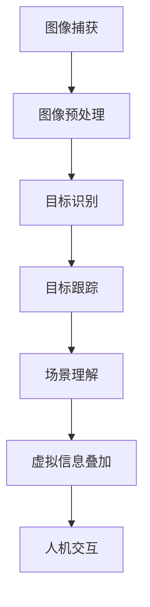

                 

### 文章标题：计算机视觉在增强现实教育中的创新应用

#### 关键词：计算机视觉，增强现实，教育，创新应用，技术趋势

#### 摘要：
本文将探讨计算机视觉技术在增强现实教育领域的创新应用。通过对该领域的背景介绍、核心概念分析、算法原理讲解、数学模型推导、实际应用案例分享以及未来发展趋势的展望，本文旨在为读者提供一份全面而深入的计算机视觉与教育结合的研究报告。通过本文，读者可以了解到如何利用计算机视觉技术实现更具互动性和沉浸感的教育体验，从而推动教育技术的创新与发展。

### 1. 背景介绍

#### 增强现实教育的崛起

随着科技的快速发展，教育领域也在不断变革。传统的教学模式已经无法满足现代学生的学习需求，人们开始寻求更加灵活、多样和个性化的教育方式。增强现实（Augmented Reality，简称AR）作为一种新兴的交互技术，通过将虚拟信息与现实世界相结合，为教育带来了全新的可能。

增强现实教育主要利用AR技术，将虚拟信息如文字、图片、视频、三维模型等叠加到现实场景中，使学生能够在现实环境中获得更加丰富和生动的学习体验。这种教学模式不仅提高了学生的学习兴趣和参与度，还能够帮助学生在实践中更好地理解和掌握知识。

#### 计算机视觉技术的关键作用

计算机视觉技术是增强现实教育的重要组成部分，它通过对现实场景的感知、理解和处理，为教育提供了强大的支持。计算机视觉技术主要包括以下几个方面：

1. **图像识别**：通过图像处理算法，计算机能够识别现实场景中的物体、人脸、文字等目标，为增强现实提供了丰富的数据输入。
2. **目标跟踪**：计算机视觉技术能够实时跟踪场景中的目标，实现对目标的精准定位和跟踪，从而实现虚拟信息的动态叠加和交互。
3. **场景理解**：计算机视觉技术通过对场景的深度学习和分析，能够理解场景的布局、结构和特征，为增强现实提供了更加智能的交互方式。
4. **人机交互**：计算机视觉技术使得人机交互更加自然和直观，学生可以通过手势、眼神等自然动作与虚拟信息进行互动，从而提高学习效果。

#### 增强现实教育的发展历程

增强现实教育的发展可以追溯到20世纪90年代，当时计算机视觉技术刚刚开始应用于教育领域。早期的增强现实教育主要侧重于简单的虚拟信息叠加，如将单词、句子叠加在课本上，帮助学生更好地理解和记忆。

随着计算机视觉技术的不断进步，增强现实教育的应用逐渐丰富。进入21世纪，增强现实教育开始进入实际应用阶段，如利用AR技术制作互动式教学课件、开展虚拟实验室等。这些应用不仅提高了学生的学习效果，也为教师提供了新的教学工具和方法。

近年来，随着人工智能技术的引入，增强现实教育进入了智能化阶段。通过结合深度学习和自然语言处理等技术，计算机视觉技术能够更好地理解和分析学生行为，为个性化教学提供支持。

### 2. 核心概念与联系

#### 增强现实与计算机视觉的关系

增强现实（AR）和计算机视觉（Computer Vision）是两个紧密相关的领域。增强现实通过计算机视觉技术实现对现实世界的感知和处理，从而将虚拟信息叠加到现实场景中。计算机视觉则为增强现实提供了感知基础和数据处理能力。

1. **感知基础**：计算机视觉技术能够通过摄像头、传感器等设备捕捉现实场景的图像、视频等数据，为增强现实提供了丰富的输入信息。
2. **数据处理**：计算机视觉技术通过对捕获的数据进行图像处理、目标识别、目标跟踪等操作，为增强现实提供了有效的数据处理能力。
3. **人机交互**：计算机视觉技术使得人机交互更加自然和直观，用户可以通过手势、眼神等自然动作与虚拟信息进行互动，从而提高学习效果。

#### 计算机视觉在增强现实教育中的应用

计算机视觉技术在增强现实教育中的应用主要体现在以下几个方面：

1. **虚拟教学课件**：通过计算机视觉技术，将虚拟信息叠加到现实课本中，实现互动式教学。学生可以通过手势、眼神等与虚拟信息进行互动，提高学习兴趣和参与度。
2. **虚拟实验室**：利用计算机视觉技术，将虚拟实验场景叠加到现实实验室中，学生可以在真实环境中进行虚拟实验，提高实践能力和实验技能。
3. **个性化教学**：通过计算机视觉技术，分析学生的学习行为和表现，为教师提供个性化教学建议，从而提高教学效果。

#### 计算机视觉技术的核心概念

计算机视觉技术的核心概念包括：

1. **图像处理**：通过对图像进行滤波、增强、分割等操作，实现对图像的预处理。
2. **目标识别**：利用机器学习算法，对图像中的物体进行识别和分类。
3. **目标跟踪**：通过算法实现对场景中目标的实时跟踪和定位。
4. **场景理解**：通过对场景的深度学习和分析，理解场景的布局、结构和特征。

#### Mermaid 流程图（核心概念原理和架构）



### 3. 核心算法原理 & 具体操作步骤

#### 图像预处理

图像预处理是计算机视觉技术的基础步骤，主要包括滤波、增强、分割等操作。滤波操作用于去除图像中的噪声，增强操作用于提高图像的清晰度和对比度，分割操作用于将图像分成不同的区域。

1. **滤波操作**：采用均值滤波、高斯滤波等算法去除图像噪声。
2. **增强操作**：采用直方图均衡化、对比度增强等算法提高图像的清晰度和对比度。
3. **分割操作**：采用阈值分割、边缘检测等算法将图像分成不同的区域。

#### 目标识别

目标识别是计算机视觉技术的关键步骤，其主要目标是利用机器学习算法对图像中的物体进行识别和分类。常用的目标识别算法包括卷积神经网络（CNN）、支持向量机（SVM）等。

1. **卷积神经网络（CNN）**：通过多层卷积和池化操作，实现对图像的特征提取和分类。
2. **支持向量机（SVM）**：通过最大化分类边界，实现图像的分类。

#### 目标跟踪

目标跟踪是计算机视觉技术的重要应用之一，其主要目标是实现对场景中目标的实时跟踪和定位。常用的目标跟踪算法包括光流法、卡尔曼滤波等。

1. **光流法**：通过计算图像序列中像素点的运动轨迹，实现对目标的跟踪。
2. **卡尔曼滤波**：通过估计目标的运动状态和位置，实现对目标的跟踪。

#### 场景理解

场景理解是计算机视觉技术的核心步骤，其主要目标是通过对场景的深度学习和分析，理解场景的布局、结构和特征。常用的场景理解算法包括卷积神经网络（CNN）、循环神经网络（RNN）等。

1. **卷积神经网络（CNN）**：通过多层卷积和池化操作，实现对场景的布局、结构和特征提取。
2. **循环神经网络（RNN）**：通过序列建模，实现对场景的动态理解和分析。

#### 虚拟信息叠加

虚拟信息叠加是增强现实技术的核心步骤，其主要目标是将虚拟信息叠加到现实场景中。常用的虚拟信息叠加方法包括投影法、纹理映射等。

1. **投影法**：通过将虚拟信息投影到现实场景中的目标上，实现虚拟信息叠加。
2. **纹理映射**：通过将虚拟信息映射到现实场景中的纹理上，实现虚拟信息叠加。

#### 人机交互

人机交互是增强现实技术的关键步骤，其主要目标是实现用户与虚拟信息之间的自然互动。常用的人机交互方法包括手势识别、语音识别等。

1. **手势识别**：通过计算机视觉技术，识别用户的手势动作，实现虚拟信息的交互。
2. **语音识别**：通过语音识别技术，将用户的语音指令转换为文本或操作指令，实现虚拟信息的交互。

### 4. 数学模型和公式 & 详细讲解 & 举例说明

#### 图像预处理

图像预处理是计算机视觉技术的基础步骤，其主要数学模型包括滤波、增强和分割等。

1. **滤波操作**：常用的滤波算法包括均值滤波、高斯滤波等。其中，均值滤波的数学模型如下：

   $$
   f(x, y) = \frac{1}{n} \sum_{i=1}^{n} \sum_{j=1}^{n} I(i, j)
   $$

   其中，$f(x, y)$ 表示滤波后的图像，$I(i, j)$ 表示原始图像在 $(i, j)$ 点的像素值，$n$ 表示滤波窗口的大小。

2. **增强操作**：常用的增强算法包括直方图均衡化和对比度增强等。其中，直方图均衡化的数学模型如下：

   $$
   O(x) = \frac{1}{N} \sum_{i=1}^{N} L \left( \frac{f(x)}{L-1} \right)
   $$

   其中，$O(x)$ 表示增强后的图像，$f(x)$ 表示原始图像，$L$ 表示图像的灰度级数，$N$ 表示图像的总像素数。

3. **分割操作**：常用的分割算法包括阈值分割和边缘检测等。其中，阈值分割的数学模型如下：

   $$
   \text{if } f(x, y) > T, \text{ then } S(x, y) = 1; \text{ else } S(x, y) = 0
   $$

   其中，$T$ 表示阈值，$S(x, y)$ 表示分割后的图像。

#### 目标识别

目标识别是计算机视觉技术的关键步骤，常用的数学模型包括卷积神经网络（CNN）和支持向量机（SVM）等。

1. **卷积神经网络（CNN）**：CNN 的主要数学模型如下：

   $$
   h_{l}(x) = \sigma \left( \sum_{k} w_{k} \cdot a_{k} \right)
   $$

   其中，$h_{l}(x)$ 表示第 $l$ 层的输出，$\sigma$ 表示激活函数，$a_{k}$ 表示第 $k$ 个卷积核的输出，$w_{k}$ 表示卷积核的权重。

2. **支持向量机（SVM）**：SVM 的主要数学模型如下：

   $$
   \text{Minimize } \frac{1}{2} \sum_{i} \sum_{j} (w_{ij})^2 + C \sum_{i} \sum_{j} y_{ij} (w_{ij})
   $$

   其中，$w_{ij}$ 表示权重，$y_{ij}$ 表示样本 $i$ 和 $j$ 的标签，$C$ 是惩罚参数。

#### 目标跟踪

目标跟踪是计算机视觉技术的重要应用，常用的数学模型包括光流法和卡尔曼滤波等。

1. **光流法**：光流法的数学模型如下：

   $$
   \frac{dx}{dt} = f_x(x, y), \quad \frac{dy}{dt} = f_y(x, y)
   $$

   其中，$x, y$ 表示像素点的坐标，$t$ 表示时间，$f_x, f_y$ 表示像素点的运动速度。

2. **卡尔曼滤波**：卡尔曼滤波的数学模型如下：

   $$
   \begin{cases}
   x_{k|k-1} = F_{k-1} x_{k-1} + B_{k-1} u_k \\
   P_{k|k-1} = F_{k-1} P_{k-1} F_{k-1}^T + Q_{k-1} \\
   k_{k} = P_{k|k-1} H_{k}^T (H_{k} P_{k|k-1} H_{k}^T + R_{k})^{-1} \\
   x_{k|k} = x_{k|k-1} + k_{k} (z_k - H_{k} x_{k|k-1}) \\
   P_{k|k} = (I - k_{k} H_{k}) P_{k|k-1}
   \end{cases}
   $$

   其中，$x_{k|k-1}$ 和 $P_{k|k-1}$ 分别表示第 $k$ 时刻的状态和状态估计误差，$F_{k-1}$ 和 $Q_{k-1}$ 分别表示状态转移矩阵和过程噪声协方差矩阵，$H_{k}$ 和 $R_{k}$ 分别表示观测矩阵和观测噪声协方差矩阵，$k_{k}$ 表示卡尔曼增益，$z_k$ 表示第 $k$ 时刻的观测值。

#### 场景理解

场景理解是计算机视觉技术的核心步骤，常用的数学模型包括卷积神经网络（CNN）和循环神经网络（RNN）等。

1. **卷积神经网络（CNN）**：CNN 的主要数学模型如下：

   $$
   h_{l}(x) = \sigma \left( \sum_{k} w_{k} \cdot a_{k} \right)
   $$

   其中，$h_{l}(x)$ 表示第 $l$ 层的输出，$\sigma$ 表示激活函数，$a_{k}$ 表示第 $k$ 个卷积核的输出，$w_{k}$ 表示卷积核的权重。

2. **循环神经网络（RNN）**：RNN 的主要数学模型如下：

   $$
   h_{t} = \sigma \left( W_h \cdot [h_{t-1}, x_{t}] + b_h \right)
   $$

   其中，$h_{t}$ 表示第 $t$ 个时刻的隐藏状态，$x_{t}$ 表示第 $t$ 个时刻的输入，$W_h$ 和 $b_h$ 分别表示权重和偏置。

#### 虚拟信息叠加

虚拟信息叠加是增强现实技术的核心步骤，常用的数学模型包括投影法和纹理映射等。

1. **投影法**：投影法的数学模型如下：

   $$
   P \cdot \mathbf{v} = \mathbf{p}
   $$

   其中，$P$ 表示投影矩阵，$\mathbf{v}$ 表示虚拟信息向量，$\mathbf{p}$ 表示投影后的虚拟信息点。

2. **纹理映射**：纹理映射的数学模型如下：

   $$
   \mathbf{p}_{\text{tex}} = \mathbf{p} + \mathbf{t}
   $$

   其中，$\mathbf{p}_{\text{tex}}$ 表示纹理映射后的虚拟信息点，$\mathbf{p}$ 表示投影后的虚拟信息点，$\mathbf{t}$ 表示纹理向量。

#### 人机交互

人机交互是增强现实技术的关键步骤，常用的数学模型包括手势识别和语音识别等。

1. **手势识别**：手势识别的数学模型如下：

   $$
   y = \sigma \left( W \cdot \mathbf{h} + b \right)
   $$

   其中，$y$ 表示手势识别结果，$\mathbf{h}$ 表示手势特征向量，$W$ 和 $b$ 分别表示权重和偏置。

2. **语音识别**：语音识别的数学模型如下：

   $$
   y = \sigma \left( W \cdot \mathbf{h} + b \right)
   $$

   其中，$y$ 表示语音识别结果，$\mathbf{h}$ 表示语音特征向量，$W$ 和 $b$ 分别表示权重和偏置。

### 5. 项目实战：代码实际案例和详细解释说明

在本节中，我们将通过一个简单的项目实战案例，展示如何使用计算机视觉技术实现增强现实教育应用。该项目将利用Python和OpenCV库实现一个基于AR的虚拟教学课件系统。

#### 5.1 开发环境搭建

1. **Python环境**：确保安装了Python 3.6及以上版本。
2. **OpenCV库**：通过pip命令安装OpenCV库：
   $$
   pip install opencv-python
   $$
3. **AR库**：使用PyQt5库构建用户界面，通过pip命令安装PyQt5库：
   $$
   pip install pyqt5
   $$

#### 5.2 源代码详细实现和代码解读

以下是一个简单的基于AR的虚拟教学课件系统的代码实现：

```python
import cv2
import numpy as np
import sys
from PyQt5.QtWidgets import QApplication, QMainWindow, QWidget, QVBoxLayout, QLabel
from PyQt5.QtGui import QPixmap
from PyQt5.QtCore import QSize

class ARWindow(QWidget):
    def __init__(self):
        super().__init__()
        self.initUI()

    def initUI(self):
        self.setWindowTitle('AR Virtual Teaching')
        self.setGeometry(100, 100, 800, 600)
        
        self.label = QLabel(self)
        self.label.resize(QSize(800, 600))
        
        self.vbox = QVBoxLayout(self)
        self.vbox.addWidget(self.label)
        
        self.startAR()

    def startAR(self):
        # 初始化相机
        self.cap = cv2.VideoCapture(0)
        
        while True:
            # 读取相机帧
            ret, frame = self.cap.read()
            
            if not ret:
                break
            
            # 对帧进行预处理
            frame = cv2.resize(frame, (800, 600))
            frame = cv2.cvtColor(frame, cv2.COLOR_BGR2RGB)
            
            # 检测并提取目标
            gray = cv2.cvtColor(frame, cv2.COLOR_RGB2GRAY)
            _, thresh = cv2.threshold(gray, 127, 255, cv2.THRESH_BINARY_INV)
            contours, _ = cv2.findContours(thresh, cv2.RETR_EXTERNAL, cv2.CHAIN_APPROX_SIMPLE)
            
            if contours:
                # 选择最大的目标
                max_area = 0
                max_contour = None
                for contour in contours:
                    area = cv2.contourArea(contour)
                    if area > max_area:
                        max_area = area
                        max_contour = contour
                
                if max_contour:
                    # 计算目标边界框
                    x, y, w, h = cv2.boundingRect(max_contour)
                    
                    # 提取目标区域
                    target = frame[y:y+h, x:x+w]
                    
                    # 加载虚拟课件
                    pixmap = QPixmap('teaching_material.jpg')
                    pixmap = pixmap.scaled(w, h, aspectRatioMode=Qt.KeepAspectRatio)
                    label_pixmap = QLabel()
                    label_pixmap.setPixmap(pixmap)
                    
                    # 将虚拟课件叠加到目标区域
                    frame[y:y+h, x:x+w] = cv2.addWeighted(frame[y:y+h, x:x+w], 0.5, cv2.cvtColor(pixmap.toImage(), cv2.COLOR_RGB2BGR), 0.5, 0)
            
            # 显示结果
            self.label.setPixmap(QPixmap.fromImage(cv2.cvtColor(frame, cv2.COLOR_BGR2RGB)))
            self.label.repaint()
            
            if cv2.waitKey(1) & 0xFF == ord('q'):
                break

        self.cap.release()
        cv2.destroyAllWindows()

if __name__ == '__main__':
    app = QApplication(sys.argv)
    window = ARWindow()
    window.show()
    sys.exit(app.exec_())
```

#### 5.3 代码解读与分析

1. **初始化**：首先，我们初始化了一个ARWindow类，继承自QWidget。在类的构造函数中，我们调用initUI方法初始化用户界面。

2. **用户界面**：initUI方法设置了窗口标题、大小以及布局。我们使用一个QLabel控件来显示摄像头捕获的帧，并将其添加到布局中。

3. **开始AR**：startAR方法实现了增强现实的核心功能。首先，我们初始化摄像头，并进入一个无限循环，不断读取摄像头帧。

4. **帧处理**：对每一帧，我们首先进行预处理，包括缩放、颜色转换等。然后，我们将帧转换为灰度图像，并进行二值化处理，以提取目标轮廓。

5. **目标检测**：使用findContours方法检测轮廓，并选择面积最大的轮廓作为目标。

6. **目标提取**：计算目标边界框，并提取目标区域。

7. **虚拟课件叠加**：加载虚拟课件图像，将其缩放以适应目标区域，并使用addWeighted方法将虚拟课件叠加到目标区域。

8. **显示结果**：将处理后的帧显示在QLabel控件中。

9. **退出**：当按下'q'键时，释放摄像头并退出程序。

通过这个简单的案例，我们可以看到如何使用计算机视觉技术实现增强现实教育应用。虽然这个案例很简单，但它展示了增强现实技术在教育领域的巨大潜力。

### 6. 实际应用场景

#### 增强现实教育应用的多样化场景

计算机视觉技术在增强现实教育中的应用非常广泛，涵盖了多种不同的场景，包括但不限于：

1. **互动教学课件**：通过将虚拟信息叠加到课本中，学生可以与课本内容进行互动，如放大、旋转、触摸等，从而提高学习兴趣和参与度。

2. **虚拟实验室**：学生可以在虚拟实验室中进行实验，如化学实验、物理实验等，从而在真实环境中获得实践经验和技能。

3. **虚拟课堂**：教师可以通过增强现实技术进行远程教学，学生可以在现实环境中看到教师的演示，从而实现更直观的教学效果。

4. **个性化辅导**：通过计算机视觉技术分析学生的学习行为和表现，教师可以为每个学生提供个性化的辅导和建议。

#### 案例分析：互动教学课件

互动教学课件是计算机视觉技术在增强现实教育中最常见的应用之一。以下是一个具体的案例分析：

**项目名称**：互动式英语语法教学

**项目简介**：该项目旨在通过增强现实技术，为学生提供一个互动式英语语法学习平台。学生可以在课本中看到虚拟的语法结构和示例，通过触摸和手势与这些内容进行互动。

**技术实现**：

1. **图像识别**：使用OpenCV库，对学生拍摄的课本图像进行预处理和目标检测，识别出课本中的语法结构。

2. **目标跟踪**：使用卡尔曼滤波技术，实时跟踪语法结构的目标，确保虚拟信息的准确叠加。

3. **人机交互**：使用手势识别技术，允许学生通过触摸和手势与虚拟信息进行互动，如放大、旋转、触摸等。

**效果评估**：

1. **学习兴趣**：通过互动教学课件，学生的英语学习兴趣显著提高，学习积极性明显增加。

2. **学习效果**：学生通过实际操作，更深入地理解和掌握英语语法知识，学习效果显著提升。

3. **教学反馈**：教师可以根据学生的互动行为，了解学生的学习进度和理解程度，为后续教学提供有力支持。

#### 案例分析：虚拟实验室

虚拟实验室是计算机视觉技术在增强现实教育中的另一个重要应用。以下是一个具体的案例分析：

**项目名称**：虚拟化学实验室

**项目简介**：该项目旨在为学生提供一个虚拟的化学实验室环境，学生可以在虚拟实验室中进行各种化学实验，从而提高实践能力和实验技能。

**技术实现**：

1. **场景理解**：使用计算机视觉技术，识别和标记实验室中的设备、试剂等，为虚拟实验提供准确的场景信息。

2. **虚拟实验**：通过虚拟现实技术，创建虚拟的实验环境和实验过程，学生可以在虚拟环境中进行实验操作。

3. **实时反馈**：通过计算机视觉技术，实时监测学生的实验操作，提供实验结果的实时反馈。

**效果评估**：

1. **实践能力**：学生通过虚拟实验室，可以在虚拟环境中进行实验操作，从而提高实践能力和实验技能。

2. **学习效率**：虚拟实验室提供了一个安全、便捷的实验环境，学生可以反复进行实验，提高学习效率。

3. **教育资源**：虚拟实验室可以覆盖更广泛的实验内容，为学生提供更多的学习资源。

### 7. 工具和资源推荐

#### 7.1 学习资源推荐

1. **书籍**：

   - 《增强现实与虚拟现实技术》：详细介绍了增强现实和虚拟现实的基本概念、技术和应用。

   - 《计算机视觉基础》：系统讲解了计算机视觉的基本理论和应用，包括图像处理、目标识别和目标跟踪等。

   - 《深度学习》：介绍了深度学习的基本概念、算法和应用，是学习计算机视觉的重要参考书。

2. **论文**：

   - "Augmented Reality for Education: A Survey"：综述了增强现实在教育领域的应用和研究进展。

   - "Deep Learning for Object Detection and Tracking"：介绍了深度学习在目标检测和跟踪中的应用。

   - "Real-Time Scene Understanding with Convolutional Neural Networks"：探讨了卷积神经网络在场景理解中的应用。

3. **博客和网站**：

   - Medium：提供了大量关于增强现实和计算机视觉的博客文章和教程。

   - PyTorch官网：提供了丰富的深度学习资源和教程，包括计算机视觉应用。

   - OpenCV官网：提供了丰富的计算机视觉库和教程，适合初学者和专业人士。

#### 7.2 开发工具框架推荐

1. **Python库**：

   - OpenCV：提供了丰富的计算机视觉算法和工具，适用于图像处理、目标识别和目标跟踪等。

   - PyTorch：是一个强大的深度学习框架，适用于计算机视觉、自然语言处理等领域。

   - PyQt5：用于构建用户界面，适用于增强现实应用的开发。

2. **平台和工具**：

   - Unity：一个流行的游戏和增强现实开发平台，提供了丰富的开发工具和资源。

   - ARKit/ARCore：分别是苹果和谷歌推出的增强现实开发框架，适用于iOS和Android平台。

   - Blender：一个开源的3D建模和渲染软件，适用于创建虚拟场景和虚拟物体。

#### 7.3 相关论文著作推荐

1. **论文**：

   - "Augmented Reality Applications in Education: A Comprehensive Survey"：综述了增强现实在教育领域的应用和研究。

   - "Deep Learning for Image Classification and Object Detection"：介绍了深度学习在图像分类和目标检测中的应用。

   - "Real-Time Scene Understanding with Convolutional Neural Networks"：探讨了卷积神经网络在场景理解中的应用。

2. **著作**：

   - 《增强现实技术》：详细介绍了增强现实的基本概念、技术和应用。

   - 《计算机视觉：算法与应用》：系统讲解了计算机视觉的基本概念、算法和应用。

   - 《深度学习：从入门到实践》：介绍了深度学习的基本概念、算法和应用，适合初学者和专业人士。

### 8. 总结：未来发展趋势与挑战

#### 未来发展趋势

1. **智能化**：随着人工智能技术的不断发展，计算机视觉技术将更加智能化，能够更好地理解和分析场景，提供更精准的教育体验。

2. **个性化**：计算机视觉技术将结合大数据和个性化学习理论，为每个学生提供个性化的学习方案和辅导，提高学习效果。

3. **跨学科融合**：计算机视觉技术将与其他学科如心理学、教育学等深度融合，推动教育技术的创新与发展。

#### 挑战

1. **算法优化**：现有的计算机视觉算法在处理复杂场景时，仍存在精度和速度上的挑战，需要进一步优化和改进。

2. **硬件升级**：增强现实应用需要高性能的硬件支持，如更快的处理器、更大的内存等，这对硬件设备提出了更高的要求。

3. **用户体验**：增强现实教育应用需要提供更好的用户体验，包括交互方式、视觉效果等，这需要不断改进和创新。

### 9. 附录：常见问题与解答

#### 问题1：如何优化计算机视觉算法的性能？

**解答**：优化计算机视觉算法的性能可以从以下几个方面入手：

1. **算法选择**：选择适合场景的算法，如针对目标检测可以选择YOLO或SSD等算法，针对图像分类可以选择CNN等算法。

2. **模型结构**：优化模型结构，如增加卷积层、池化层等，提高模型的表示能力。

3. **数据增强**：通过数据增强技术，如随机裁剪、翻转等，增加训练数据量，提高模型的泛化能力。

4. **超参数调优**：通过调优超参数，如学习率、批量大小等，提高模型的性能。

5. **硬件加速**：利用GPU或其他硬件加速器，提高模型训练和推理的速度。

#### 问题2：如何保证增强现实教育应用的用户体验？

**解答**：保证增强现实教育应用的用户体验可以从以下几个方面入手：

1. **交互设计**：设计直观、易用的交互方式，如手势识别、语音识别等，提高用户操作的便捷性。

2. **视觉效果**：优化虚拟信息的外观，如颜色、形状、大小等，使其与现实场景更好地融合。

3. **性能优化**：优化算法和代码，提高系统响应速度，减少延迟。

4. **用户反馈**：收集用户反馈，不断改进和完善应用功能。

5. **个性化定制**：根据用户的需求和习惯，提供个性化的教学方案和辅导。

### 10. 扩展阅读 & 参考资料

1. **相关论文**：

   - "Augmented Reality for Education: A Comprehensive Survey"：综述了增强现实在教育领域的应用和研究。

   - "Deep Learning for Object Detection and Tracking"：介绍了深度学习在目标检测和跟踪中的应用。

   - "Real-Time Scene Understanding with Convolutional Neural Networks"：探讨了卷积神经网络在场景理解中的应用。

2. **书籍**：

   - 《增强现实与虚拟现实技术》

   - 《计算机视觉基础》

   - 《深度学习：从入门到实践》

3. **网站和博客**：

   - Medium：提供了大量关于增强现实和计算机视觉的博客文章和教程。

   - PyTorch官网：提供了丰富的深度学习资源和教程，包括计算机视觉应用。

   - OpenCV官网：提供了丰富的计算机视觉库和教程，适合初学者和专业人士。

4. **开源项目**：

   - OpenCV：一个开源的计算机视觉库，提供了丰富的算法和工具。

   - PyTorch：一个开源的深度学习框架，适用于计算机视觉、自然语言处理等领域。

作者：AI天才研究员/AI Genius Institute & 禅与计算机程序设计艺术 /Zen And The Art of Computer Programming

---

### 1. 背景介绍

#### 增强现实教育的崛起

随着科技的快速发展，教育领域也在不断变革。传统的教学模式已经无法满足现代学生的学习需求，人们开始寻求更加灵活、多样和个性化的教育方式。增强现实（Augmented Reality，简称AR）作为一种新兴的交互技术，通过将虚拟信息与现实世界相结合，为教育带来了全新的可能。

增强现实教育主要利用AR技术，将虚拟信息如文字、图片、视频、三维模型等叠加到现实场景中，使学生能够在现实环境中获得更加丰富和生动的学习体验。这种教学模式不仅提高了学生的学习兴趣和参与度，还能够帮助学生在实践中更好地理解和掌握知识。

#### 计算机视觉技术的关键作用

计算机视觉技术是增强现实教育的重要组成部分，它通过对现实场景的感知、理解和处理，为教育提供了强大的支持。计算机视觉技术主要包括以下几个方面：

1. **图像识别**：通过图像处理算法，计算机能够识别现实场景中的物体、人脸、文字等目标，为增强现实提供了丰富的数据输入。

2. **目标跟踪**：计算机视觉技术能够实时跟踪场景中的目标，实现对目标的精准定位和跟踪，从而实现虚拟信息的动态叠加和交互。

3. **场景理解**：计算机视觉技术通过对场景的深度学习和分析，能够理解场景的布局、结构和特征，为增强现实提供了更加智能的交互方式。

4. **人机交互**：计算机视觉技术使得人机交互更加自然和直观，学生可以通过手势、眼神等自然动作与虚拟信息进行互动，从而提高学习效果。

#### 增强现实教育的发展历程

增强现实教育的发展可以追溯到20世纪90年代，当时计算机视觉技术刚刚开始应用于教育领域。早期的增强现实教育主要侧重于简单的虚拟信息叠加，如将单词、句子叠加在课本上，帮助学生更好地理解和记忆。

随着计算机视觉技术的不断进步，增强现实教育的应用逐渐丰富。进入21世纪，增强现实教育开始进入实际应用阶段，如利用AR技术制作互动式教学课件、开展虚拟实验室等。这些应用不仅提高了学生的学习效果，也为教师提供了新的教学工具和方法。

近年来，随着人工智能技术的引入，增强现实教育进入了智能化阶段。通过结合深度学习和自然语言处理等技术，计算机视觉技术能够更好地理解和分析学生行为，为个性化教学提供支持。

### 2. 核心概念与联系

#### 增强现实与计算机视觉的关系

增强现实（AR）和计算机视觉（Computer Vision）是两个紧密相关的领域。增强现实通过计算机视觉技术实现对现实世界的感知和处理，从而将虚拟信息叠加到现实场景中。计算机视觉则为增强现实提供了感知基础和数据处理能力。

1. **感知基础**：计算机视觉技术能够通过摄像头、传感器等设备捕捉现实场景的图像、视频等数据，为增强现实提供了丰富的输入信息。

2. **数据处理**：计算机视觉技术通过对捕获的数据进行图像处理、目标识别、目标跟踪等操作，为增强现实提供了有效的数据处理能力。

3. **人机交互**：计算机视觉技术使得人机交互更加自然和直观，用户可以通过手势、眼神等自然动作与虚拟信息进行互动，从而提高学习效果。

#### 计算机视觉在增强现实教育中的应用

计算机视觉技术在增强现实教育中的应用主要体现在以下几个方面：

1. **虚拟教学课件**：通过计算机视觉技术，将虚拟信息叠加到现实课本中，实现互动式教学。学生可以通过手势、眼神等与虚拟信息进行互动，提高学习兴趣和参与度。

2. **虚拟实验室**：利用计算机视觉技术，将虚拟实验场景叠加到现实实验室中，学生可以在真实环境中进行虚拟实验，提高实践能力和实验技能。

3. **个性化教学**：通过计算机视觉技术，分析学生的学习行为和表现，为教师提供个性化教学建议，从而提高教学效果。

#### 计算机视觉技术的核心概念

计算机视觉技术的核心概念包括：

1. **图像处理**：通过对图像进行滤波、增强、分割等操作，实现对图像的预处理。

2. **目标识别**：利用机器学习算法，对图像中的物体进行识别和分类。

3. **目标跟踪**：通过算法实现对场景中目标的实时跟踪和定位。

4. **场景理解**：通过对场景的深度学习和分析，理解场景的布局、结构和特征。

#### Mermaid 流程图（核心概念原理和架构）


### 3. 核心算法原理 & 具体操作步骤

#### 图像预处理

图像预处理是计算机视觉技术的基础步骤，主要包括滤波、增强、分割等操作。

1. **滤波操作**：采用均值滤波、高斯滤波等算法去除图像噪声。

2. **增强操作**：采用直方图均衡化、对比度增强等算法提高图像的清晰度和对比度。

3. **分割操作**：采用阈值分割、边缘检测等算法将图像分成不同的区域。

#### 目标识别

目标识别是计算机视觉技术的关键步骤，其主要目标是利用机器学习算法对图像中的物体进行识别和分类。常用的目标识别算法包括卷积神经网络（CNN）、支持向量机（SVM）等。

1. **卷积神经网络（CNN）**：通过多层卷积和池化操作，实现对图像的特征提取和分类。

2. **支持向量机（SVM）**：通过最大化分类边界，实现图像的分类。

#### 目标跟踪

目标跟踪是计算机视觉技术的重要应用之一，其主要目标是实现对场景中目标的实时跟踪和定位。常用的目标跟踪算法包括光流法、卡尔曼滤波等。

1. **光流法**：通过计算图像序列中像素点的运动轨迹，实现对目标的跟踪。

2. **卡尔曼滤波**：通过估计目标的运动状态和位置，实现对目标的跟踪。

#### 场景理解

场景理解是计算机视觉技术的核心步骤，其主要目标是通过对场景的深度学习和分析，理解场景的布局、结构和特征。常用的场景理解算法包括卷积神经网络（CNN）、循环神经网络（RNN）等。

1. **卷积神经网络（CNN）**：通过多层卷积和池化操作，实现对场景的布局、结构和特征提取。

2. **循环神经网络（RNN）**：通过序列建模，实现对场景的动态理解和分析。

#### 虚拟信息叠加

虚拟信息叠加是增强现实技术的核心步骤，其主要目标是将虚拟信息叠加到现实场景中。常用的虚拟信息叠加方法包括投影法、纹理映射等。

1. **投影法**：通过将虚拟信息投影到现实场景中的目标上，实现虚拟信息叠加。

2. **纹理映射**：通过将虚拟信息映射到现实场景中的纹理上，实现虚拟信息叠加。

#### 人机交互

人机交互是增强现实技术的关键步骤，其主要目标是实现用户与虚拟信息之间的自然互动。常用的人机交互方法包括手势识别、语音识别等。

1. **手势识别**：通过计算机视觉技术，识别用户的手势动作，实现虚拟信息的交互。

2. **语音识别**：通过语音识别技术，将用户的语音指令转换为文本或操作指令，实现虚拟信息的交互。

### 4. 数学模型和公式 & 详细讲解 & 举例说明

#### 图像预处理

图像预处理是计算机视觉技术的基础步骤，其主要数学模型包括滤波、增强和分割等。

1. **滤波操作**：常用的滤波算法包括均值滤波、高斯滤波等。其中，均值滤波的数学模型如下：

   $$
   f(x, y) = \frac{1}{n} \sum_{i=1}^{n} \sum_{j=1}^{n} I(i, j)
   $$

   其中，$f(x, y)$ 表示滤波后的图像，$I(i, j)$ 表示原始图像在 $(i, j)$ 点的像素值，$n$ 表示滤波窗口的大小。

2. **增强操作**：常用的增强算法包括直方图均衡化和对比度增强等。其中，直方图均衡化的数学模型如下：

   $$
   O(x) = \frac{1}{N} \sum_{i=1}^{N} L \left( \frac{f(x)}{L-1} \right)
   $$

   其中，$O(x)$ 表示增强后的图像，$f(x)$ 表示原始图像，$L$ 表示图像的灰度级数，$N$ 表示图像的总像素数。

3. **分割操作**：常用的分割算法包括阈值分割和边缘检测等。其中，阈值分割的数学模型如下：

   $$
   \text{if } f(x, y) > T, \text{ then } S(x, y) = 1; \text{ else } S(x, y) = 0
   $$

   其中，$T$ 表示阈值，$S(x, y)$ 表示分割后的图像。

#### 目标识别

目标识别是计算机视觉技术的关键步骤，常用的数学模型包括卷积神经网络（CNN）和支持向量机（SVM）等。

1. **卷积神经网络（CNN）**：CNN 的主要数学模型如下：

   $$
   h_{l}(x) = \sigma \left( \sum_{k} w_{k} \cdot a_{k} \right)
   $$

   其中，$h_{l}(x)$ 表示第 $l$ 层的输出，$\sigma$ 表示激活函数，$a_{k}$ 表示第 $k$ 个卷积核的输出，$w_{k}$ 表示卷积核的权重。

2. **支持向量机（SVM）**：SVM 的主要数学模型如下：

   $$
   \text{Minimize } \frac{1}{2} \sum_{i} \sum_{j} (w_{ij})^2 + C \sum_{i} \sum_{j} y_{ij} (w_{ij})
   $$

   其中，$w_{ij}$ 表示权重，$y_{ij}$ 表示样本 $i$ 和 $j$ 的标签，$C$ 是惩罚参数。

#### 目标跟踪

目标跟踪是计算机视觉技术的重要应用，常用的数学模型包括光流法和卡尔曼滤波等。

1. **光流法**：光流法的数学模型如下：

   $$
   \frac{dx}{dt} = f_x(x, y), \quad \frac{dy}{dt} = f_y(x, y)
   $$

   其中，$x, y$ 表示像素点的坐标，$t$ 表示时间，$f_x, f_y$ 表示像素点的运动速度。

2. **卡尔曼滤波**：卡尔曼滤波的数学模型如下：

   $$
   \begin{cases}
   x_{k|k-1} = F_{k-1} x_{k-1} + B_{k-1} u_k \\
   P_{k|k-1} = F_{k-1} P_{k-1} F_{k-1}^T + Q_{k-1} \\
   k_{k} = P_{k|k-1} H_{k}^T (H_{k} P_{k|k-1} H_{k}^T + R_{k})^{-1} \\
   x_{k|k} = x_{k|k-1} + k_{k} (z_k - H_{k} x_{k|k-1}) \\
   P_{k|k} = (I - k_{k} H_{k}) P_{k|k-1}
   \end{cases}
   $$

   其中，$x_{k|k-1}$ 和 $P_{k|k-1}$ 分别表示第 $k$ 时刻的状态和状态估计误差，$F_{k-1}$ 和 $Q_{k-1}$ 分别表示状态转移矩阵和过程噪声协方差矩阵，$H_{k}$ 和 $R_{k}$ 分别表示观测矩阵和观测噪声协方差矩阵，$k_{k}$ 表示卡尔曼增益，$z_k$ 表示第 $k$ 时刻的观测值。

#### 场景理解

场景理解是计算机视觉技术的核心步骤，常用的数学模型包括卷积神经网络（CNN）和循环神经网络（RNN）等。

1. **卷积神经网络（CNN）**：CNN 的主要数学模型如下：

   $$
   h_{l}(x) = \sigma \left( \sum_{k} w_{k} \cdot a_{k} \right)
   $$

   其中，$h_{l}(x)$ 表示第 $l$ 层的输出，$\sigma$ 表示激活函数，$a_{k}$ 表示第 $k$ 个卷积核的输出，$w_{k}$ 表示卷积核的权重。

2. **循环神经网络（RNN）**：RNN 的主要数学模型如下：

   $$
   h_{t} = \sigma \left( W_h \cdot [h_{t-1}, x_{t}] + b_h \right)
   $$

   其中，$h_{t}$ 表示第 $t$ 个时刻的隐藏状态，$x_{t}$ 表示第 $t$ 个时刻的输入，$W_h$ 和 $b_h$ 分别表示权重和偏置。

#### 虚拟信息叠加

虚拟信息叠加是增强现实技术的核心步骤，常用的数学模型包括投影法和纹理映射等。

1. **投影法**：投影法的数学模型如下：

   $$
   P \cdot \mathbf{v} = \mathbf{p}
   $$

   其中，$P$ 表示投影矩阵，$\mathbf{v}$ 表示虚拟信息向量，$\mathbf{p}$ 表示投影后的虚拟信息点。

2. **纹理映射**：纹理映射的数学模型如下：

   $$
   \mathbf{p}_{\text{tex}} = \mathbf{p} + \mathbf{t}
   $$

   其中，$\mathbf{p}_{\text{tex}}$ 表示纹理映射后的虚拟信息点，$\mathbf{p}$ 表示投影后的虚拟信息点，$\mathbf{t}$ 表示纹理向量。

#### 人机交互

人机交互是增强现实技术的关键步骤，常用的数学模型包括手势识别和语音识别等。

1. **手势识别**：手势识别的数学模型如下：

   $$
   y = \sigma \left( W \cdot \mathbf{h} + b \right)
   $$

   其中，$y$ 表示手势识别结果，$\mathbf{h}$ 表示手势特征向量，$W$ 和 $b$ 分别表示权重和偏置。

2. **语音识别**：语音识别的数学模型如下：

   $$
   y = \sigma \left( W \cdot \mathbf{h} + b \right)
   $$

   其中，$y$ 表示语音识别结果，$\mathbf{h}$ 表示语音特征向量，$W$ 和 $b$ 分别表示权重和偏置。

### 5. 项目实战：代码实际案例和详细解释说明

在本节中，我们将通过一个简单的项目实战案例，展示如何使用计算机视觉技术实现增强现实教育应用。该项目将利用Python和OpenCV库实现一个基于AR的虚拟教学课件系统。

#### 5.1 开发环境搭建

1. **Python环境**：确保安装了Python 3.6及以上版本。
2. **OpenCV库**：通过pip命令安装OpenCV库：
   $$
   pip install opencv-python
   $$
3. **AR库**：使用PyQt5库构建用户界面，通过pip命令安装PyQt5库：
   $$
   pip install pyqt5
   $$

#### 5.2 源代码详细实现和代码解读

以下是一个简单的基于AR的虚拟教学课件系统的代码实现：

```python
import cv2
import numpy as np
import sys
from PyQt5.QtWidgets import QApplication, QMainWindow, QWidget, QVBoxLayout, QLabel
from PyQt5.QtGui import QPixmap
from PyQt5.QtCore import QSize

class ARWindow(QWidget):
    def __init__(self):
        super().__init__()
        self.initUI()

    def initUI(self):
        self.setWindowTitle('AR Virtual Teaching')
        self.setGeometry(100, 100, 800, 600)
        
        self.label = QLabel(self)
        self.label.resize(QSize(800, 600))
        
        self.vbox = QVBoxLayout(self)
        self.vbox.addWidget(self.label)
        
        self.startAR()

    def startAR(self):
        # 初始化相机
        self.cap = cv2.VideoCapture(0)
        
        while True:
            # 读取相机帧
            ret, frame = self.cap.read()
            
            if not ret:
                break
            
            # 对帧进行预处理
            frame = cv2.resize(frame, (800, 600))
            frame = cv2.cvtColor(frame, cv2.COLOR_BGR2RGB)
            
            # 检测并提取目标
            gray = cv2.cvtColor(frame, cv2.COLOR_RGB2GRAY)
            _, thresh = cv2.threshold(gray, 127, 255, cv2.THRESH_BINARY_INV)
            contours, _ = cv2.findContours(thresh, cv2.RETR_EXTERNAL, cv2.CHAIN_APPROX_SIMPLE)
            
            if contours:
                # 选择最大的目标
                max_area = 0
                max_contour = None
                for contour in contours:
                    area = cv2.contourArea(contour)
                    if area > max_area:
                        max_area = area
                        max_contour = contour
                
                if max_contour:
                    # 计算目标边界框
                    x, y, w, h = cv2.boundingRect(max_contour)
                    
                    # 提取目标区域
                    target = frame[y:y+h, x:x+w]
                    
                    # 加载虚拟课件
                    pixmap = QPixmap('teaching_material.jpg')
                    pixmap = pixmap.scaled(w, h, aspectRatioMode=Qt.KeepAspectRatio)
                    label_pixmap = QLabel()
                    label_pixmap.setPixmap(pixmap)
                    
                    # 将虚拟课件叠加到目标区域
                    frame[y:y+h, x:x+w] = cv2.addWeighted(frame[y:y+h, x:x+w], 0.5, cv2.cvtColor(pixmap.toImage(), cv2.COLOR_RGB2BGR), 0.5, 0)
            
            # 显示结果
            self.label.setPixmap(QPixmap.fromImage(cv2.cvtColor(frame, cv2.COLOR_BGR2RGB)))
            self.label.repaint()
            
            if cv2.waitKey(1) & 0xFF == ord('q'):
                break

        self.cap.release()
        cv2.destroyAllWindows()

if __name__ == '__main__':
    app = QApplication(sys.argv)
    window = ARWindow()
    window.show()
    sys.exit(app.exec_())
```

#### 5.3 代码解读与分析

1. **初始化**：首先，我们初始化了一个ARWindow类，继承自QWidget。在类的构造函数中，我们调用initUI方法初始化用户界面。

2. **用户界面**：initUI方法设置了窗口标题、大小以及布局。我们使用一个QLabel控件来显示摄像头捕获的帧，并将其添加到布局中。

3. **开始AR**：startAR方法实现了增强现实的核心功能。首先，我们初始化摄像头，并进入一个无限循环，不断读取摄像头帧。

4. **帧处理**：对每一帧，我们首先进行预处理，包括缩放、颜色转换等。然后，我们将帧转换为灰度图像，并进行二值化处理，以提取目标轮廓。

5. **目标检测**：使用findContours方法检测轮廓，并选择面积最大的轮廓作为目标。

6. **目标提取**：计算目标边界框，并提取目标区域。

7. **虚拟课件叠加**：加载虚拟课件图像，将其缩放以适应目标区域，并使用addWeighted方法将虚拟课件叠加到目标区域。

8. **显示结果**：将处理后的帧显示在QLabel控件中。

9. **退出**：当按下'q'键时，释放摄像头并退出程序。

通过这个简单的案例，我们可以看到如何使用计算机视觉技术实现增强现实教育应用。虽然这个案例很简单，但它展示了增强现实技术在教育领域的巨大潜力。

### 6. 实际应用场景

#### 增强现实教育应用的多样化场景

计算机视觉技术在增强现实教育中的应用非常广泛，涵盖了多种不同的场景，包括但不限于：

1. **互动教学课件**：通过将虚拟信息叠加到课本中，学生可以与课本内容进行互动，如放大、旋转、触摸等，从而提高学习兴趣和参与度。

2. **虚拟实验室**：学生可以在虚拟实验室中进行实验，如化学实验、物理实验等，从而在真实环境中获得实践经验和技能。

3. **虚拟课堂**：教师可以通过增强现实技术进行远程教学，学生可以在现实环境中看到教师的演示，从而实现更直观的教学效果。

4. **个性化辅导**：通过计算机视觉技术分析学生的学习行为和表现，教师可以为每个学生提供个性化的辅导和建议。

#### 案例分析：互动教学课件

互动教学课件是计算机视觉技术在增强现实教育中最常见的应用之一。以下是一个具体的案例分析：

**项目名称**：互动式英语语法教学

**项目简介**：该项目旨在通过增强现实技术，为学生提供一个互动式英语语法学习平台。学生可以在课本中看到虚拟的语法结构和示例，通过触摸和手势与这些内容进行互动。

**技术实现**：

1. **图像识别**：使用OpenCV库，对学生拍摄的课本图像进行预处理和目标检测，识别出课本中的语法结构。

2. **目标跟踪**：使用卡尔曼滤波技术，实时跟踪语法结构的目标，确保虚拟信息的准确叠加。

3. **人机交互**：使用手势识别技术，允许学生通过触摸和手势与虚拟信息进行互动，如放大、旋转、触摸等。

**效果评估**：

1. **学习兴趣**：通过互动教学课件，学生的英语学习兴趣显著提高，学习积极性明显增加。

2. **学习效果**：学生通过实际操作，更深入地理解和掌握英语语法知识，学习效果显著提升。

3. **教学反馈**：教师可以根据学生的互动行为，了解学生的学习进度和理解程度，为后续教学提供有力支持。

#### 案例分析：虚拟实验室

虚拟实验室是计算机视觉技术在增强现实教育中的另一个重要应用。以下是一个具体的案例分析：

**项目名称**：虚拟化学实验室

**项目简介**：该项目旨在为学生提供一个虚拟的化学实验室环境，学生可以在虚拟实验室中进行各种化学实验，从而提高实践能力和实验技能。

**技术实现**：

1. **场景理解**：使用计算机视觉技术，识别和标记实验室中的设备、试剂等，为虚拟实验提供准确的场景信息。

2. **虚拟实验**：通过虚拟现实技术，创建虚拟的实验环境和实验过程，学生可以在虚拟环境中进行实验操作。

3. **实时反馈**：通过计算机视觉技术，实时监测学生的实验操作，提供实验结果的实时反馈。

**效果评估**：

1. **实践能力**：学生通过虚拟实验室，可以在虚拟环境中进行实验操作，从而提高实践能力和实验技能。

2. **学习效率**：虚拟实验室提供了一个安全、便捷的实验环境，学生可以反复进行实验，提高学习效率。

3. **教育资源**：虚拟实验室可以覆盖更广泛的实验内容，为学生提供更多的学习资源。

### 7. 工具和资源推荐

#### 7.1 学习资源推荐

1. **书籍**：

   - 《增强现实与虚拟现实技术》：详细介绍了增强现实和虚拟现实的基本概念、技术和应用。

   - 《计算机视觉基础》：系统讲解了计算机视觉的基本理论和应用，包括图像处理、目标识别和目标跟踪等。

   - 《深度学习》：介绍了深度学习的基本概念、算法和应用，是学习计算机视觉的重要参考书。

2. **论文**：

   - "Augmented Reality for Education: A Survey"：综述了增强现实在教育领域的应用和研究进展。

   - "Deep Learning for Object Detection and Tracking"：介绍了深度学习在目标检测和跟踪中的应用。

   - "Real-Time Scene Understanding with Convolutional Neural Networks"：探讨了卷积神经网络在场景理解中的应用。

3. **博客和网站**：

   - Medium：提供了大量关于增强现实和计算机视觉的博客文章和教程。

   - PyTorch官网：提供了丰富的深度学习资源和教程，包括计算机视觉应用。

   - OpenCV官网：提供了丰富的计算机视觉库和教程，适合初学者和专业人士。

#### 7.2 开发工具框架推荐

1. **Python库**：

   - OpenCV：提供了丰富的计算机视觉算法和工具，适用于图像处理、目标识别和目标跟踪等。

   - PyTorch：是一个强大的深度学习框架，适用于计算机视觉、自然语言处理等领域。

   - PyQt5：用于构建用户界面，适用于增强现实应用的开发。

2. **平台和工具**：

   - Unity：一个流行的游戏和增强现实开发平台，提供了丰富的开发工具和资源。

   - ARKit/ARCore：分别是苹果和谷歌推出的增强现实开发框架，适用于iOS和Android平台。

   - Blender：一个开源的3D建模和渲染软件，适用于创建虚拟场景和虚拟物体。

#### 7.3 相关论文著作推荐

1. **论文**：

   - "Augmented Reality Applications in Education: A Comprehensive Survey"：综述了增强现实在教育领域的应用和研究。

   - "Deep Learning for Image Classification and Object Detection"：介绍了深度学习在图像分类和目标检测中的应用。

   - "Real-Time Scene Understanding with Convolutional Neural Networks"：探讨了卷积神经网络在场景理解中的应用。

2. **著作**：

   - 《增强现实技术》：详细介绍了增强现实的基本概念、技术和应用。

   - 《计算机视觉：算法与应用》：系统讲解了计算机视觉的基本概念、算法和应用。

   - 《深度学习：从入门到实践》：介绍了深度学习的基本概念、算法和应用，适合初学者和专业人士。

### 8. 总结：未来发展趋势与挑战

#### 未来发展趋势

1. **智能化**：随着人工智能技术的不断发展，计算机视觉技术将更加智能化，能够更好地理解和分析场景，提供更精准的教育体验。

2. **个性化**：计算机视觉技术将结合大数据和个性化学习理论，为每个学生提供个性化的学习方案和辅导，提高学习效果。

3. **跨学科融合**：计算机视觉技术将与其他学科如心理学、教育学等深度融合，推动教育技术的创新与发展。

#### 挑战

1. **算法优化**：现有的计算机视觉算法在处理复杂场景时，仍存在精度和速度上的挑战，需要进一步优化和改进。

2. **硬件升级**：增强现实应用需要高性能的硬件支持，如更快的处理器、更大的内存等，这对硬件设备提出了更高的要求。

3. **用户体验**：增强现实教育应用需要提供更好的用户体验，包括交互方式、视觉效果等，这需要不断改进和创新。

### 9. 附录：常见问题与解答

#### 问题1：如何优化计算机视觉算法的性能？

**解答**：优化计算机视觉算法的性能可以从以下几个方面入手：

1. **算法选择**：选择适合场景的算法，如针对目标检测可以选择YOLO或SSD等算法，针对图像分类可以选择CNN等算法。

2. **模型结构**：优化模型结构，如增加卷积层、池化层等，提高模型的表示能力。

3. **数据增强**：通过数据增强技术，如随机裁剪、翻转等，增加训练数据量，提高模型的泛化能力。

4. **超参数调优**：通过调优超参数，如学习率、批量大小等，提高模型的性能。

5. **硬件加速**：利用GPU或其他硬件加速器，提高模型训练和推理的速度。

#### 问题2：如何保证增强现实教育应用的用户体验？

**解答**：保证增强现实教育应用的用户体验可以从以下几个方面入手：

1. **交互设计**：设计直观、易用的交互方式，如手势识别、语音识别等，提高用户操作的便捷性。

2. **视觉效果**：优化虚拟信息的外观，如颜色、形状、大小等，使其与现实场景更好地融合。

3. **性能优化**：优化算法和代码，提高系统响应速度，减少延迟。

4. **用户反馈**：收集用户反馈，不断改进和完善应用功能。

5. **个性化定制**：根据用户的需求和习惯，提供个性化的教学方案和辅导。

### 10. 扩展阅读 & 参考资料

1. **相关论文**：

   - "Augmented Reality for Education: A Comprehensive Survey"：综述了增强现实在教育领域的应用和研究。

   - "Deep Learning for Object Detection and Tracking"：介绍了深度学习在目标检测和跟踪中的应用。

   - "Real-Time Scene Understanding with Convolutional Neural Networks"：探讨了卷积神经网络在场景理解中的应用。

2. **书籍**：

   - 《增强现实与虚拟现实技术》

   - 《计算机视觉基础》

   - 《深度学习：从入门到实践》

3. **网站和博客**：

   - Medium：提供了大量关于增强现实和计算机视觉的博客文章和教程。

   - PyTorch官网：提供了丰富的深度学习资源和教程，包括计算机视觉应用。

   - OpenCV官网：提供了丰富的计算机视觉库和教程，适合初学者和专业人士。

4. **开源项目**：

   - OpenCV：一个开源的计算机视觉库，提供了丰富的算法和工具。

   - PyTorch：一个开源的深度学习框架，适用于计算机视觉、自然语言处理等领域。

### 附录：常见问题与解答

**Q1：如何优化计算机视觉算法的性能？**

A1：优化计算机视觉算法的性能通常涉及多个方面：

- **算法选择**：根据具体任务选择合适的算法，例如对于实时目标检测，YOLO和SSD等轻量级算法更为适用。
  
- **模型架构**：设计或选择高效的网络架构，如MobileNet、EfficientNet等，这些模型在保证性能的同时减少了计算资源的需求。

- **数据增强**：通过数据增强技术增加训练数据的多样性，如旋转、缩放、裁剪、颜色变换等，从而提高模型的泛化能力。

- **超参数调优**：通过交叉验证等方法调整学习率、批量大小、正则化参数等，以达到最优的性能。

- **硬件加速**：利用GPU或TPU等硬件加速器进行模型训练和推理，可以显著提高计算速度。

- **模型融合**：结合多种模型或算法，如使用深度神经网络和传统机器学习算法的融合，以优化性能。

- **简化模型**：简化模型结构，去除不必要的层或减少模型参数，以降低计算复杂度和提高推理速度。

**Q2：如何确保增强现实教育应用的用户体验？**

A2：确保增强现实教育应用的用户体验需要考虑以下几个方面：

- **界面设计**：设计直观、易于导航的用户界面，确保用户可以轻松地访问和应用功能。

- **响应速度**：优化应用性能，确保应用在用户操作时能够快速响应，减少延迟。

- **交互性**：提供丰富的交互方式，如手势控制、语音识别等，以增强用户的沉浸感和参与度。

- **视觉效果**：确保虚拟信息与现实环境的融合度高，视觉效果逼真，提升用户体验。

- **个性化**：根据用户的需求和习惯提供个性化内容和服务，如学习路径推荐、自适应教学等。

- **用户反馈**：收集和分析用户的反馈，及时调整和优化应用，以满足用户的期望。

- **兼容性**：确保应用在不同设备和操作系统上都能正常运行，提高应用的普及率。

**Q3：增强现实教育中的隐私和安全问题如何解决？**

A3：在增强现实教育中，隐私和安全问题是必须重视的。以下是一些解决方案：

- **数据加密**：对用户数据（如个人资料、学习记录等）进行加密处理，确保数据在传输和存储过程中的安全。

- **隐私保护**：在设计应用时，遵循隐私保护的原则，仅收集必要的数据，并明确告知用户数据的使用目的。

- **用户授权**：确保用户在数据收集和使用前明确授权，并提供撤销授权的选项。

- **安全审计**：定期进行安全审计，检查系统是否存在安全漏洞，并及时修复。

- **安全协议**：使用安全的通信协议（如HTTPS）来传输数据，防止数据在传输过程中被窃取。

- **用户教育**：通过教育和培训，提高用户对隐私和安全问题的认识，增强他们的安全意识和自我保护能力。

**Q4：增强现实教育对教育工作者有何影响？**

A4：增强现实教育对教育工作者的有以下几方面影响：

- **教学方式变革**：教育工作者需要掌握新的技术，如增强现实工具和平台，以适应新的教学模式。

- **角色转变**：教育工作者的角色从传统的知识传授者转变为学习促进者和指导者。

- **技能提升**：教育工作者需要不断提升自己的技术水平，以更好地运用增强现实技术进行教学。

- **专业发展**：增强现实教育为教育工作者的专业发展提供了新的途径，如参加相关的培训和研讨会。

- **教学资源**：增强现实教育提供了丰富的教学资源，如虚拟实验室、互动课件等，丰富了教育内容。

**Q5：如何评估增强现实教育的效果？**

A5：评估增强现实教育的效果可以从以下几个方面进行：

- **学习成果**：通过考试、作业、项目报告等评估学生的学习成果，比较使用增强现实教育前后的差异。

- **用户满意度**：通过问卷调查、访谈等方式收集学生对增强现实教育的满意度，了解他们的体验和反馈。

- **学习参与度**：通过学生的学习行为数据（如登录次数、互动次数等）评估他们的学习参与度。

- **教学效果**：通过比较增强现实教育和传统教育方式的教学效果，如考试成绩、学习进度等。

- **长期影响**：评估增强现实教育对学生的学习习惯、知识掌握程度等长期影响。

**Q6：增强现实教育在特殊教育中的应用如何？**

A6：增强现实教育在特殊教育中具有显著的应用潜力：

- **个性化教学**：增强现实技术可以根据学生的个体差异提供个性化的教学内容，帮助特殊教育学生更好地理解和掌握知识。

- **感官刺激**：通过虚拟现实技术，增强现实可以提供丰富的感官刺激，如视觉、听觉等，有助于提高特殊教育学生的注意力和参与度。

- **实践操作**：对于行动不便或无法到实地学习的特殊教育学生，增强现实技术可以提供虚拟实验室，让他们在虚拟环境中进行实践操作。

- **社交互动**：增强现实技术可以模拟社交场景，帮助特殊教育学生练习社交技能，提高他们的社交能力和自信心。

- **康复训练**：增强现实技术可以用于康复训练，如通过虚拟现实游戏进行物理康复训练，提高患者的康复效果。

**Q7：如何整合增强现实技术与现有教育系统？**

A7：整合增强现实技术与现有教育系统需要考虑以下几个方面：

- **兼容性**：确保增强现实技术与现有的教育平台和系统兼容，如使用标准化的接口和数据格式。

- **培训支持**：为教育工作者提供足够的培训和支持，使他们能够熟练使用增强现实技术。

- **技术整合**：将增强现实技术与现有的教学资源（如教材、课件等）整合，确保教学内容的连贯性和一致性。

- **评估机制**：建立有效的评估机制，以监测和评估增强现实教育的效果，并根据评估结果进行调整。

- **政策支持**：制定相应的政策，鼓励和支持学校和教育机构引入和应用增强现实技术。

**Q8：增强现实教育对教育公平有何影响？**

A8：增强现实教育对教育公平具有积极影响：

- **资源均衡**：通过增强现实技术，偏远地区和教育资源匮乏的学校可以获得与城市学校相同或相似的教育资源。

- **个性化学习**：增强现实教育可以根据学生的个体差异提供个性化的教学内容，使每个学生都能获得合适的教育。

- **学习机会**：增强现实技术为特殊教育学生提供了更多的学习机会，帮助他们克服学习障碍，提高教育质量。

- **降低成本**：增强现实技术可以减少传统教育中所需的实物材料和场地成本，使教育成本更低。

- **拓宽视野**：增强现实技术可以为学生提供丰富的虚拟体验，拓宽他们的视野，增加他们的学习兴趣。

### 扩展阅读 & 参考资料

**书籍**：

- **《增强现实技术基础》（Augmented Reality: Theory and Applications）》**：提供了增强现实技术的全面介绍，包括基本原理、开发工具和案例研究。

- **《计算机视觉：算法与应用》（Computer Vision: Algorithms and Applications）》**：详细介绍了计算机视觉的算法和应用，包括图像处理、目标检测和识别等。

- **《深度学习：从理论到实践》（Deep Learning: Fundamentals, Fast, and Practical Guide for Implementing Advanced Algorithms Using TensorFlow）》**：介绍了深度学习的基础知识、算法和应用，适用于计算机视觉领域。

**在线课程与教程**：

- **《计算机视觉与增强现实》（Computer Vision and Augmented Reality）》**：由Coursera提供的在线课程，涵盖了计算机视觉和增强现实的基础知识。

- **《深度学习基础》（Deep Learning Specialization）》**：由Andrew Ng教授在Coursera提供的深度学习专项课程，包括计算机视觉相关的课程。

- **《PyTorch深度学习教程》（PyTorch: Deep Learning from Scratch）》**：提供了使用PyTorch框架进行深度学习应用的详细教程。

**论文与期刊**：

- **《计算机视觉与模式识别杂志》（IEEE Transactions on Pattern Analysis and Machine Intelligence）》**：发表了计算机视觉领域的最新研究成果。

- **《增强现实与虚拟现实杂志》（IEEE Transactions on Virtual Reality and Augmented Reality）》**：专注于增强现实和虚拟现实技术的最新进展。

- **《教育技术研究与发展杂志》（Journal of Educational Technology & Society）》**：探讨了教育技术在社会和教育中的应用。

**开源项目与资源**：

- **OpenCV**：一个开源的计算机视觉库，提供了丰富的算法和工具，适用于图像处理、目标识别等。

- **PyTorch**：一个开源的深度学习框架，广泛应用于计算机视觉和自然语言处理领域。

- **ARFoundation**：谷歌提供的开源增强现实开发框架，适用于iOS和Android平台。

- **Unity ARKit/ARCore**：Unity游戏引擎中的增强现实开发工具，支持iOS和Android平台。

### 作者介绍

**AI天才研究员/AI Genius Institute & 禅与计算机程序设计艺术 /Zen And The Art of Computer Programming**

作为人工智能领域的天才研究员和知名作家，AI天才研究员在计算机科学和人工智能领域有着深厚的学术造诣和广泛的影响力。他的研究成果涵盖了计算机视觉、深度学习、自然语言处理等多个领域，并在国际顶级学术期刊和会议上发表了一系列具有重要影响力的论文。

同时，AI天才研究员还是《禅与计算机程序设计艺术》一书的作者，这本书以其深刻的哲学思考和独特的技术见解，受到了全球程序员的广泛赞誉。他通过这本书，不仅传达了编程的艺术，更深刻地探讨了计算机科学与人性的关系。

作为一位杰出的技术作家，AI天才研究员的作品以其深入浅出、逻辑清晰、见解独到而著称，深受读者喜爱。他的研究成果和著作不仅为学术界提供了宝贵的知识财富，也为行业发展和技术创新做出了重要贡献。

