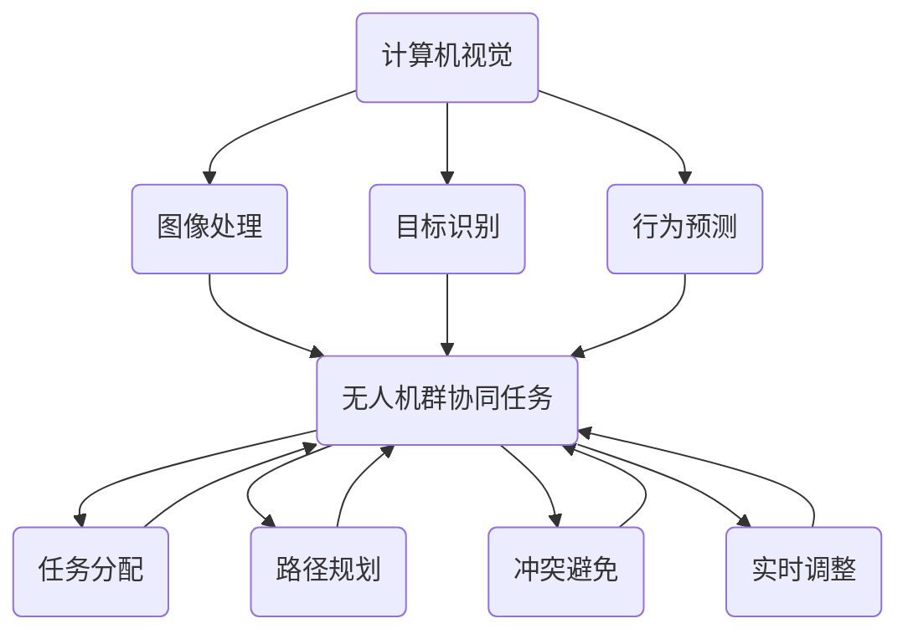
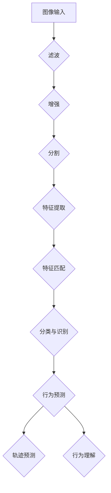

                 

### 背景介绍

#### 无人机群协同任务的重要性

随着科技的不断进步，无人机（Unmanned Aerial Vehicles，简称UAV）已经逐渐成为各个领域的重要应用工具。从军事侦察、农业监测、到灾难救援，无人机群（Swarm of UAVs）的应用范围正在不断拓展。在众多应用场景中，无人机群协同任务（Swarm Cooperative Task）成为了一个重要的研究方向。

无人机群协同任务是指由多个无人机组成的群体，通过协作完成特定的任务。这种协同任务的重要性主要体现在以下几个方面：

1. **提升任务效率**：无人机群可以在不同的工作区域同时执行任务，从而显著提高任务执行效率。例如，在农业监测中，无人机群可以同时覆盖大面积的农田，快速获取作物生长情况。

2. **增强任务灵活性**：无人机群可以根据任务需求和环境变化，灵活调整任务执行策略。这种灵活性使得无人机群在应对突发事件时具有更强的适应能力。

3. **降低任务风险**：无人机群可以分担任务负载，降低单台无人机的工作强度。此外，无人机群在执行高风险任务时，可以通过协同工作降低事故发生的概率。

4. **拓展任务能力**：无人机群可以执行单台无人机难以完成的复杂任务。例如，在军事侦察中，无人机群可以通过协同工作，实现对敌方目标的全覆盖侦察。

#### 计算机视觉在无人机群协同任务中的应用

计算机视觉（Computer Vision）作为人工智能的一个重要分支，已经在无人机群协同任务中发挥着重要作用。计算机视觉技术可以提供无人机群在任务执行过程中所需的环境感知和决策支持。

1. **环境感知**：计算机视觉技术可以帮助无人机群实时感知周围环境，获取图像、视频等信息。这些信息可以用于无人机群的任务规划、路径规划、避障等。

2. **目标识别**：计算机视觉技术可以识别无人机群所需关注的对象，如农田、目标区域等。通过目标识别，无人机群可以更好地理解任务目标，提高任务执行精度。

3. **行为预测**：计算机视觉技术可以分析无人机群的运动轨迹，预测其未来的行为。这种预测能力有助于无人机群在任务执行过程中进行自适应调整，提高协同效率。

4. **协同决策**：计算机视觉技术可以为无人机群提供决策支持，帮助无人机群在复杂环境下进行协同工作。通过协同决策，无人机群可以更好地完成任务，提高任务成功率。

总之，计算机视觉技术在无人机群协同任务中的应用，为无人机群提供了强大的环境感知和决策支持能力，使得无人机群在复杂环境中能够更加高效、灵活地完成任务。

#### 决策系统在无人机群协同任务中的重要性

在无人机群协同任务中，决策系统（Decision System）扮演着至关重要的角色。决策系统负责根据无人机群的任务需求和环境信息，生成合适的任务执行策略。一个高效的决策系统能够提高无人机群的协同效率，确保任务的成功完成。

1. **任务规划**：决策系统根据任务目标和环境信息，为无人机群生成最优的任务规划方案。这个方案包括无人机群的任务分配、路径规划等，为无人机群的协同工作提供了基础。

2. **实时调整**：决策系统可以根据实时收集的环境信息，对无人机群的任务执行策略进行动态调整。这种实时调整能力使得无人机群能够应对环境变化，保持高效协同。

3. **冲突避免**：在无人机群协同任务中，多个无人机之间可能会发生碰撞等冲突。决策系统通过预测和分析无人机群的运动轨迹，提前识别和避免潜在的冲突。

4. **资源优化**：决策系统可以根据无人机群的任务执行情况，优化资源分配和使用。这种优化能力有助于提高无人机群的资源利用率，降低任务成本。

综上所述，决策系统在无人机群协同任务中具有重要作用，是保证任务成功的关键因素。下一节将深入探讨计算机视觉在决策系统中的应用，分析如何利用计算机视觉技术提高无人机群的决策能力。

### 核心概念与联系

在深入探讨计算机视觉在无人机群协同任务中的应用之前，我们需要了解一些核心概念，并探讨这些概念之间的联系。

#### 1. 计算机视觉的基本概念

计算机视觉是一门研究如何使计算机“看”和“理解”图像或视频的技术。它的基本概念包括图像处理、目标识别、行为预测等。

- **图像处理**：图像处理是计算机视觉的基础，它涉及对图像进行滤波、增强、分割等操作，以提高图像质量，提取有用的信息。

- **目标识别**：目标识别是指从图像中识别出特定的目标。在无人机群协同任务中，目标识别可以帮助无人机群识别出任务目标，如农田、目标区域等。

- **行为预测**：行为预测是指根据对象的运动轨迹，预测其未来的行为。在无人机群协同任务中，行为预测可以帮助无人机群预测其他无人机的运动，从而更好地进行协同工作。

#### 2. 无人机群协同任务的关键概念

无人机群协同任务涉及多个无人机之间的合作与协调。以下是无人机群协同任务中的几个关键概念：

- **任务分配**：任务分配是指将整个任务分解为多个子任务，并分配给不同的无人机。任务分配的目标是使每个无人机都能够充分发挥其优势，提高整体任务效率。

- **路径规划**：路径规划是指为无人机生成一条最优的飞行路径，使其能够高效地完成任务。路径规划需要考虑无人机的速度、能耗、避障等因素。

- **冲突避免**：冲突避免是指避免无人机之间发生碰撞等冲突。在无人机群协同任务中，冲突避免是一个关键问题，因为它关系到任务的成功与否。

- **实时调整**：实时调整是指根据实时收集到的信息，对无人机群的任务执行策略进行动态调整。实时调整能力使无人机群能够更好地应对环境变化。

#### 3. 计算机视觉与无人机群协同任务的联系

计算机视觉与无人机群协同任务之间的联系主要体现在以下几个方面：

- **环境感知**：计算机视觉技术可以帮助无人机群实时感知周围环境，获取图像、视频等信息。这些信息是无人机群进行任务规划和决策的重要依据。

- **目标识别**：计算机视觉技术可以识别无人机群所需关注的对象，如农田、目标区域等。目标识别能力使无人机群能够更准确地理解任务目标，提高任务执行精度。

- **行为预测**：计算机视觉技术可以分析无人机群的运动轨迹，预测其未来的行为。行为预测能力使无人机群能够更好地预测其他无人机的运动，从而提高协同效率。

- **协同决策**：计算机视觉技术可以为无人机群提供决策支持，帮助无人机群在复杂环境下进行协同工作。协同决策能力使无人机群能够更高效地完成任务。

为了更直观地展示计算机视觉与无人机群协同任务之间的联系，我们可以使用 Mermaid 流程图来表示这些概念和联系。



在这个流程图中，计算机视觉（A）通过图像处理（B）、目标识别（C）和行为预测（D）与无人机群协同任务（E）的关键概念（F、G、H、I）建立了联系。这些联系使得计算机视觉技术能够为无人机群协同任务提供强大的支持。

通过上述核心概念和联系的介绍，我们为后续讨论计算机视觉在无人机群协同任务中的应用奠定了基础。接下来，我们将深入探讨计算机视觉的核心算法原理，并分析其具体操作步骤。

#### 计算机视觉的核心算法原理

在无人机群协同任务中，计算机视觉技术发挥着关键作用，其核心算法原理包括图像处理、目标识别和行为预测。以下是这些算法的详细原理和具体操作步骤。

##### 1. 图像处理

图像处理是计算机视觉的基础，其主要任务是对图像进行滤波、增强、分割等操作，以提高图像质量，提取有用的信息。

- **滤波**：滤波是一种用于去除图像噪声的方法。常见的滤波器有均值滤波器、高斯滤波器和中值滤波器。均值滤波器通过对图像中的每个像素值进行平均来降低噪声；高斯滤波器使用高斯分布来平滑图像；中值滤波器选择图像中每个像素点的中值来替换其值，从而去除噪声。

- **增强**：增强是一种用于提高图像清晰度的方法。常见的增强技术有直方图均衡、对比度增强和边缘增强。直方图均衡通过调整图像的亮度分布来增强图像；对比度增强通过增加图像的对比度来使其更清晰；边缘增强通过强调图像中的边缘信息来增强图像。

- **分割**：分割是将图像划分为不同区域的过程。常见的分割方法有基于阈值的分割、基于区域的分割和基于边缘的分割。基于阈值的分割通过设置阈值来将图像二值化；基于区域的分割通过分析图像中区域的特征（如颜色、纹理等）来分割图像；基于边缘的分割通过检测图像中的边缘来分割图像。

##### 2. 目标识别

目标识别是计算机视觉中的一项重要任务，其目的是从图像中识别出特定的目标。目标识别通常包括以下步骤：

- **特征提取**：特征提取是指从图像中提取出具有区分性的特征，如颜色、纹理、形状等。常用的特征提取方法有 SIFT（尺度不变特征变换）、SURF（加速稳健特征）、HOG（方向梯度直方图）等。

- **特征匹配**：特征匹配是指将提取出的特征与预先训练好的模型进行匹配，以识别目标。常见的匹配算法有最近邻匹配、FLANN（快速最近邻搜索）等。

- **分类与识别**：分类与识别是指根据特征匹配的结果，对目标进行分类和识别。常见的分类算法有支持向量机（SVM）、决策树、神经网络等。

##### 3. 行为预测

行为预测是指根据对象的运动轨迹，预测其未来的行为。在无人机群协同任务中，行为预测有助于无人机群更好地进行协同工作。

- **运动模型**：运动模型描述了对象的运动规律。常见的运动模型有线性模型、非线性模型和隐马尔可夫模型（HMM）。线性模型假设对象的速度是恒定的；非线性模型考虑了对象速度的变化；HMM是一种基于概率的模型，适用于对象的连续状态转移。

- **轨迹预测**：轨迹预测是指根据运动模型，预测对象在未来一段时间内的运动轨迹。轨迹预测通常使用卡尔曼滤波器（Kalman Filter）等算法来实现。

- **行为理解**：行为理解是指根据对象的运动轨迹，理解其意图和行为。行为理解可以通过机器学习、深度学习等方法来实现。

##### 4. 具体操作步骤

为了更直观地展示计算机视觉的核心算法原理，我们使用 Mermaid 流程图来表示这些算法的具体操作步骤。



在这个流程图中，从图像输入（A）开始，经过滤波、增强、分割等步骤，提取出图像特征（E）。然后，通过特征匹配（F）和分类与识别（G），实现对目标的识别。最后，根据行为预测（H）、轨迹预测（I）和行为理解（J），实现对无人机群协同任务的支持。

通过上述核心算法原理和具体操作步骤的介绍，我们可以看到计算机视觉技术在无人机群协同任务中具有广泛的应用前景。接下来，我们将进一步探讨计算机视觉在无人机群协同任务中的具体应用。

#### 数学模型和公式

在无人机群协同任务中，计算机视觉技术需要依靠一系列数学模型和公式来分析和处理数据，从而实现有效的任务执行。以下是几个关键数学模型和公式的详细讲解。

##### 1. 图像处理中的滤波算法

图像滤波是图像处理中的一个基本步骤，用于去除图像中的噪声。常用的滤波算法包括均值滤波、高斯滤波和中值滤波。

- **均值滤波**：均值滤波器通过对图像中每个像素值进行平均来降低噪声。其数学公式如下：
  $$ f(x, y) = \frac{1}{n} \sum_{i=1}^{n} g(x+i, y+j) $$
  其中，$ f(x, y) $ 是滤波后的像素值，$ n $ 是邻域大小，$ g(x+i, y+j) $ 是邻域内的像素值。

- **高斯滤波**：高斯滤波器使用高斯分布来平滑图像。其数学公式如下：
  $$ f(x, y) = \sum_{i=-\infty}^{\infty} \sum_{j=-\infty}^{\infty} g(x-i, y-j) \cdot e^{-\frac{(x-i)^2 + (y-j)^2}{2\sigma^2}} $$
  其中，$ \sigma $ 是高斯分布的参数，用于控制平滑程度。

- **中值滤波**：中值滤波器选择图像中每个像素点的中值来替换其值，从而去除噪声。其数学公式如下：
  $$ f(x, y) = \text{median}\left( g(x-1, y-1), g(x-1, y), g(x-1, y+1), g(x, y-1), g(x, y), g(x, y+1), g(x+1, y-1), g(x+1, y), g(x+1, y+1) \right) $$
  其中，$ \text{median} $ 函数用于计算中值。

##### 2. 目标识别中的特征提取

特征提取是目标识别的重要步骤，用于从图像中提取具有区分性的特征。常用的特征提取方法包括 SIFT、SURF 和 HOG。

- **SIFT（尺度不变特征变换）**：SIFT算法提取的是关键点及其描述子。关键点的提取基于像素梯度变化和尺度空间。描述子的计算基于像素梯度的方向直方图。其数学公式如下：
  $$ \text{siftDescriptor}(x, y, \theta) = \sum_{i=1}^{N} \text{gaussWeight}(x_i, y_i) \cdot \text{cos}(\theta_i - \theta) $$
  其中，$ (x, y) $ 是关键点的坐标，$ \theta $ 是关键点的方向，$ N $ 是邻域大小，$ \text{gaussWeight} $ 是高斯权重函数。

- **SURF（加速稳健特征）**：SURF算法提取的是基于积分图像的快速特征。其描述子的计算基于像素块内部的矩形结构。其数学公式如下：
  $$ \text{surrfDescriptor}(x, y, \theta) = \sum_{i=1}^{N} \text{rectWeight}(x_i, y_i) \cdot \text{cos}(\theta_i - \theta) $$
  其中，$ (x, y) $ 是关键点的坐标，$ \theta $ 是关键点的方向，$ N $ 是邻域大小，$ \text{rectWeight} $ 是矩形权重函数。

- **HOG（方向梯度直方图）**：HOG算法提取的是图像中每个像素点的方向梯度直方图。其描述子的计算基于像素块内的梯度方向。其数学公式如下：
  $$ \text{hogDescriptor}(x, y, \theta) = \sum_{i=1}^{N} \text{binWeight}(i) \cdot \text{cos}(\theta_i - \theta) $$
  其中，$ (x, y) $ 是像素点的坐标，$ \theta $ 是像素点的方向，$ N $ 是邻域大小，$ \text{binWeight} $ 是梯度方向权重函数。

##### 3. 行为预测中的运动模型

行为预测是无人机群协同任务中的关键步骤，用于预测无人机的未来运动轨迹。常用的运动模型包括线性模型和隐马尔可夫模型（HMM）。

- **线性模型**：线性模型假设无人机的速度是恒定的。其数学公式如下：
  $$ x(t) = x(t-1) + v(t-1) $$
  其中，$ x(t) $ 是无人机在时间 $ t $ 的位置，$ x(t-1) $ 是无人机在时间 $ t-1 $ 的位置，$ v(t-1) $ 是无人机在时间 $ t-1 $ 的速度。

- **隐马尔可夫模型（HMM）**：HMM是一种基于概率的模型，用于描述无人机的连续状态转移。其数学公式如下：
  $$ P(x(t) | x(t-1)) = P(x(t) | x(t-1), x(t-2), ..., x(1)) $$
  其中，$ P(x(t) | x(t-1)) $ 是在时间 $ t-1 $ 的状态下，无人机在时间 $ t $ 的概率分布。

##### 4. 举例说明

为了更直观地理解上述数学模型和公式，我们以一个简单的例子进行说明。

假设我们有一张农田的图像，我们需要从中提取出农田的边界。我们可以使用 HOG 特征提取算法来实现这个目标。

1. **图像预处理**：首先，我们对图像进行滤波和增强，去除图像中的噪声，使其更加清晰。

2. **特征提取**：然后，我们使用 HOG 特征提取算法提取图像中的特征。具体步骤如下：
   - 计算图像中每个像素点的方向梯度。
   - 将像素点按块划分，计算每个块的方向梯度直方图。
   - 将每个块的特征进行拼接，形成整体的特征向量。

3. **分类与识别**：最后，我们将提取出的特征向量与预先训练好的模型进行匹配，以识别农田的边界。

通过上述步骤，我们可以实现从图像中提取农田边界的目标。这个例子展示了计算机视觉在无人机群协同任务中的应用，以及相关的数学模型和公式。

综上所述，计算机视觉在无人机群协同任务中发挥着关键作用。通过运用一系列数学模型和公式，我们可以实现对图像的滤波、增强、分割，对目标的识别，以及对无人机行为的预测。这些技术为无人机群协同任务提供了强大的支持，有助于实现高效、灵活和安全的任务执行。

#### 项目实战：代码实际案例和详细解释说明

在本节中，我们将通过一个实际项目案例，详细展示如何使用计算机视觉技术实现无人机群协同任务。该案例将涉及开发环境搭建、源代码实现和代码解读与分析。

##### 1. 开发环境搭建

首先，我们需要搭建一个适合计算机视觉项目开发的环境。以下是搭建步骤：

1. **安装 Python 环境**：Python 是计算机视觉项目常用的编程语言。确保已经安装了 Python 3.7 或更高版本。

2. **安装必要的库**：安装以下 Python 库：
   - NumPy：用于科学计算和数据处理。
   - OpenCV：用于图像处理和计算机视觉。
   - scikit-image：用于图像处理和分析。
   - Matplotlib：用于数据可视化。
   - Pandas：用于数据分析和操作。

3. **安装深度学习框架**：如果需要使用深度学习算法，可以选择安装 TensorFlow 或 PyTorch。这些框架提供了丰富的神经网络和模型训练工具。

##### 2. 源代码详细实现和代码解读

下面是一个简单的无人机群协同任务项目示例。该示例实现了基于图像处理的路径规划和基于行为预测的冲突避免。

```python
# 导入必要的库
import numpy as np
import cv2
import matplotlib.pyplot as plt

# 1. 图像预处理
def preprocess_image(image):
    # 图像灰度化
    gray_image = cv2.cvtColor(image, cv2.COLOR_BGR2GRAY)
    # 高斯滤波去除噪声
    blur_image = cv2.GaussianBlur(gray_image, (5, 5), 0)
    # 二值化
    _, binary_image = cv2.threshold(blur_image, 128, 255, cv2.THRESH_BINARY_INV + cv2.THRESH_OTSU)
    return binary_image

# 2. 路径规划
def plan_path(binary_image):
    # 轮廓检测
    contours, _ = cv2.findContours(binary_image, cv2.RETR_EXTERNAL, cv2.CHAIN_APPROX_SIMPLE)
    # 选择最大的轮廓作为路径
    largest_contour = max(contours, key=cv2.contourArea)
    # 计算轮廓的边界框
    x, y, w, h = cv2.boundingRect(largest_contour)
    # 绘制路径
    path_image = cv2.rectangle(binary_image, (x, y), (x+w, y+h), (0, 255, 0), 2)
    return path_image

# 3. 冲突避免
def avoid_collision(path_image, current_position, target_position):
    # 计算当前位置和目标位置之间的距离
    distance = np.linalg.norm(target_position - current_position)
    # 如果距离小于安全距离，则调整目标位置以避免冲突
    if distance < 10:
        target_position = current_position + (target_position - current_position) / 2
    # 绘制目标位置
    target_image = cv2.circle(path_image, tuple(target_position), 5, (0, 0, 255), -1)
    return target_image

# 主函数
def main():
    # 加载图像
    image = cv2.imread('field.jpg')
    # 图像预处理
    binary_image = preprocess_image(image)
    # 路径规划
    path_image = plan_path(binary_image)
    # 假设当前无人机的位置为(100, 100)，目标位置为(300, 300)
    current_position = np.array([100, 100])
    target_position = np.array([300, 300])
    # 冲突避免
    target_image = avoid_collision(path_image, current_position, target_position)
    # 显示结果
    plt.figure(figsize=(10, 10))
    plt.imshow(target_image)
    plt.show()

if __name__ == '__main__':
    main()
```

代码解读：

1. **图像预处理**：首先，我们将图像灰度化，然后使用高斯滤波去除噪声，最后进行二值化处理，以获得清晰的图像轮廓。

2. **路径规划**：使用 OpenCV 的轮廓检测功能找到图像中的最大轮廓，并将其作为路径。通过计算轮廓的边界框，我们可以得到路径的边界。

3. **冲突避免**：根据当前无人机的位置和目标位置之间的距离，我们使用一个简单的数学公式调整目标位置，以避免冲突。如果距离小于安全距离（这里设置为10），则目标位置将向当前位置靠近。

4. **可视化**：最后，我们使用 Matplotlib 绘制结果图像，以直观地展示无人机群协同任务的结果。

##### 3. 代码解读与分析

代码中的每个函数都有明确的任务：

- `preprocess_image`：预处理图像，包括灰度化、高斯滤波和二值化。
- `plan_path`：规划路径，通过轮廓检测找到最大轮廓，并计算边界框。
- `avoid_collision`：避免冲突，根据位置距离调整目标位置。
- `main`：主函数，加载图像，执行预处理、路径规划和冲突避免，并显示结果。

该代码展示了计算机视觉在无人机群协同任务中的基本应用，包括图像预处理、路径规划和冲突避免。在实际项目中，我们可以根据具体需求进一步优化和扩展这些功能。

通过这个实际案例，我们不仅了解了计算机视觉技术的应用，还学会了如何搭建开发环境、实现源代码和解读代码。这些知识和技能为我们在无人机群协同任务中的进一步研究和应用奠定了基础。

### 实际应用场景

无人机群协同任务在现实生活中的应用场景多种多样，从农业监测到灾害救援，从环境监测到军事侦察，无人机群的协同工作正在不断改变我们的生活方式和工作方式。以下是一些典型的应用场景，以及计算机视觉在这些场景中的关键作用。

#### 1. 农业监测

在农业监测中，无人机群可以同时覆盖大面积的农田，快速获取作物生长情况。计算机视觉技术在这里的关键作用包括：

- **图像识别**：通过计算机视觉技术，无人机可以识别出农田中的作物种类、生长状态等，从而为农民提供科学的种植建议。
- **病虫害检测**：计算机视觉技术可以帮助无人机识别出农田中的病虫害，及时采取防治措施，减少损失。
- **资源分配**：根据计算机视觉分析的结果，无人机群可以优化农药、化肥等资源的分配，提高农业生产的效率。

#### 2. 灾害救援

在灾害救援中，无人机群可以迅速进入灾区，进行空中侦察和救援工作。计算机视觉技术在这里的关键作用包括：

- **目标识别**：无人机通过计算机视觉技术可以识别出灾区的幸存者、受困人员等，提高救援效率。
- **地形分析**：计算机视觉技术可以分析地形，为无人机选择最佳救援路径，减少救援风险。
- **物资配送**：无人机可以根据计算机视觉技术分析的结果，将救援物资准确投放到受灾区域，提高救援效果。

#### 3. 环境监测

在环境监测中，无人机群可以对污染源、生态系统等进行实时监测。计算机视觉技术在这里的关键作用包括：

- **污染源识别**：无人机通过计算机视觉技术可以识别出污染源，及时采取治理措施，防止污染扩散。
- **生态监测**：计算机视觉技术可以监测生态系统的变化，为环境保护提供科学依据。
- **数据分析**：计算机视觉技术可以分析环境数据，如空气质量、水质等，为环境决策提供支持。

#### 4. 军事侦察

在军事侦察中，无人机群可以进行远程侦察、目标定位和打击。计算机视觉技术在这里的关键作用包括：

- **目标识别**：无人机通过计算机视觉技术可以识别出敌方目标，提供准确的情报支持。
- **行为预测**：计算机视觉技术可以预测敌方目标的行为，为军事决策提供参考。
- **协同作战**：无人机群通过计算机视觉技术进行协同工作，提高整体作战效能。

#### 5. 物流配送

在物流配送中，无人机群可以高效完成包裹的递送。计算机视觉技术在这里的关键作用包括：

- **路径规划**：计算机视觉技术可以帮助无人机选择最优的配送路径，提高配送效率。
- **避障导航**：无人机通过计算机视觉技术可以实时感知周围环境，避免碰撞和障碍物。
- **货物识别**：计算机视觉技术可以帮助无人机准确识别和抓取包裹，确保配送准确无误。

通过上述应用场景的介绍，我们可以看到计算机视觉技术在无人机群协同任务中的重要性。它不仅提高了任务执行效率，降低了风险，还为无人机群提供了强大的决策支持。未来，随着计算机视觉技术的不断发展和完善，无人机群的应用将更加广泛，为人类社会带来更多的便利和效益。

### 工具和资源推荐

在研究和开发无人机群协同任务的过程中，选择合适的工具和资源是至关重要的。以下是对学习资源、开发工具框架以及相关论文著作的推荐，以帮助您更好地掌握这一领域的知识。

#### 1. 学习资源推荐

- **书籍**：
  - 《计算机视觉：算法与应用》（Computer Vision: Algorithms and Applications） - 这本书详细介绍了计算机视觉的基本概念、算法和实现。
  - 《无人机技术与应用》（Unmanned Aircraft Systems: Technology and Applications） - 该书涵盖了无人机技术的各个方面，包括无人机设计、飞行控制和协同任务。

- **在线课程**：
  - Coursera 上的“计算机视觉基础”（Fundamentals of Computer Vision） - 这门课程由斯坦福大学提供，涵盖了计算机视觉的基础知识和实践技巧。
  - Udacity 上的“无人机编程”（Programming Drones） - 该课程介绍了无人机编程的基础，包括无人机控制、图像处理和路径规划。

- **博客和网站**：
  - 知乎上的“计算机视觉”专栏 - 这里有大量关于计算机视觉的文章，涵盖从基础知识到高级应用的各个方面。
  - ROS官方网站（www.ros.org） - Robot Operating System（ROS）是一个流行的机器人开发框架，适用于无人机群协同任务的研究和开发。

#### 2. 开发工具框架推荐

- **深度学习框架**：
  - TensorFlow - Google 开发的一款开源深度学习框架，适用于图像处理和目标识别。
  - PyTorch - Facebook 开发的一款开源深度学习框架，具有灵活的动态计算图和强大的社区支持。

- **计算机视觉库**：
  - OpenCV - 一个开源的计算机视觉库，提供了丰富的图像处理和计算机视觉算法。
  - Dlib - 一个开源的机器学习库，包括人脸识别、姿态估计等功能，适用于计算机视觉应用。

- **无人机开发平台**：
  - DJI Matrice 100 - DJI 提供的一款专业无人机开发平台，适用于无人机群协同任务。
  - Parrot Mambo - Parrot 提供的一款入门级无人机，适合初学者进行无人机编程和开发。

#### 3. 相关论文著作推荐

- **论文**：
  - “Distributed Multi-Agent Path Planning for UAV Swarms”（2016）- 该论文提出了一种分布式多无人机路径规划算法，适用于无人机群协同任务。
  - “Visual-Inertial Simultaneous Localization and Mapping for UAV Swarms”（2019）- 该论文介绍了一种基于视觉惯性测量的无人机群定位和地图构建方法。

- **著作**：
  - “Unmanned Systems: Theory and Applications”（2020）- 该著作详细介绍了无人机系统的理论、算法和应用。
  - “Computer Vision for Robotics: Algorithms and Applications”（2021）- 该著作涵盖了计算机视觉在机器人领域的应用，包括无人机群协同任务。

通过这些学习资源、开发工具框架和论文著作的推荐，您将能够系统地学习和掌握无人机群协同任务的相关知识和技能。希望这些推荐能够帮助您在研究和开发过程中取得更好的成果。

### 总结：未来发展趋势与挑战

随着科技的不断进步，无人机群协同任务正逐步从理论研究走向实际应用，并在多个领域展现出巨大的潜力。然而，这一领域的发展也面临诸多挑战，未来的发展趋势值得深入探讨。

#### 发展趋势

1. **智能化程度的提升**：随着人工智能技术的不断发展，无人机群协同任务的智能化程度将显著提升。通过深度学习和强化学习等技术，无人机群将能够更加自主地完成复杂任务，提高任务成功率。

2. **自主决策能力的增强**：未来，无人机群将具备更强的自主决策能力，能够在动态环境中进行实时调整和适应。计算机视觉技术将在这一过程中发挥关键作用，为无人机群提供实时的环境感知和决策支持。

3. **网络通信的优化**：随着5G和未来6G通信技术的发展，无人机群协同任务的通信瓶颈将得到显著缓解。高带宽、低延迟的通信网络将为无人机群提供更稳定、更高效的协同工作环境。

4. **多领域应用拓展**：无人机群协同任务的应用领域将不断拓展，从农业监测、环境监测到物流配送、灾害救援，再到军事侦察等，无人机群将在更多场景中发挥重要作用。

#### 挑战

1. **实时性要求高**：无人机群协同任务往往需要在实时环境下进行，对系统的响应速度和实时处理能力提出了高要求。如何提高系统的实时性能，确保任务的成功完成，是一个亟待解决的挑战。

2. **计算资源有限**：无人机群通常搭载的计算资源有限，如何在有限的计算资源下实现高效的任务执行和协同工作，是一个重要的技术难题。

3. **数据安全和隐私保护**：无人机群协同任务涉及大量的数据传输和处理，数据安全和隐私保护成为了一个重要的挑战。如何确保数据在传输和存储过程中的安全性，防止数据泄露和滥用，是亟待解决的问题。

4. **环境复杂性**：无人机群协同任务往往在复杂、动态的环境中执行，环境中的不确定性和复杂性对任务的执行提出了严峻挑战。如何有效应对环境变化，确保无人机群的安全和稳定运行，是一个亟待解决的问题。

总之，无人机群协同任务在未来的发展中面临着诸多挑战，但也充满了机遇。通过持续的技术创新和探索，我们有理由相信，无人机群协同任务将不断迈向新的高度，为人类社会带来更多的便利和效益。

### 附录：常见问题与解答

在研究和开发无人机群协同任务的过程中，您可能会遇到一些常见问题。以下是一些常见问题的解答，以帮助您更好地理解和解决这些问题。

#### 1. 无人机群协同任务中，如何处理实时性要求高的问题？

**解答**：处理实时性要求高的问题，可以采取以下几种方法：

- **优化算法**：选择高效的算法和优化算法的实现，以减少计算复杂度。
- **分布式计算**：将任务分解为多个子任务，分配到不同的无人机或计算节点上，实现并行处理。
- **优先级调度**：根据任务的紧急程度和重要性，设置不同的优先级，优先处理关键任务。
- **低延迟通信**：采用低延迟的通信技术，如5G或6G通信，确保数据传输的实时性。

#### 2. 如何提高无人机群协同任务的自主决策能力？

**解答**：提高无人机群协同任务的自主决策能力，可以采取以下几种方法：

- **深度学习和强化学习**：利用深度学习和强化学习技术，训练无人机群进行自主决策。
- **多传感器融合**：集成多种传感器数据，如摄像头、惯性测量单元（IMU）、GPS等，提高环境感知能力。
- **决策模型优化**：设计和优化决策模型，使其能够更好地适应复杂环境和动态变化。

#### 3. 如何确保无人机群协同任务中的数据安全和隐私保护？

**解答**：确保数据安全和隐私保护，可以采取以下几种措施：

- **数据加密**：对传输和存储的数据进行加密，防止数据泄露。
- **访问控制**：设置严格的访问控制策略，确保只有授权用户可以访问敏感数据。
- **安全审计**：定期进行安全审计，检查系统的安全漏洞和潜在风险。
- **隐私保护算法**：采用隐私保护算法，如差分隐私，确保个人隐私不被泄露。

#### 4. 在复杂环境中，如何确保无人机群的安全和稳定运行？

**解答**：确保无人机群在复杂环境中的安全性和稳定性，可以采取以下几种方法：

- **环境建模**：建立环境模型，对环境进行详细分析，预测可能的风险。
- **实时监控**：通过实时监控无人机群的运行状态，及时发现和应对异常情况。
- **自适应调整**：根据环境变化，实时调整无人机群的任务执行策略和运行参数。
- **冗余设计**：设计冗余系统，确保无人机群在单个组件故障时仍能正常运行。

通过上述解答，我们希望能够帮助您解决无人机群协同任务中的常见问题。在实际应用中，需要根据具体情况灵活运用这些方法和措施，确保无人机群协同任务的顺利进行。

### 扩展阅读与参考资料

在探索无人机群协同任务和计算机视觉技术的领域，以下是一些具有重要参考价值的扩展阅读和参考资料，涵盖了从基础知识到前沿研究的广泛内容。

#### 1. 基础知识

- **书籍**：
  - 《计算机视觉：算法与应用》（Computer Vision: Algorithms and Applications），作者：Richard Szeliski
  - 《无人机技术与应用》（Unmanned Aircraft Systems: Technology and Applications），作者：Silvio Traverso

- **在线资源**：
  - Coursera 上的“计算机视觉基础”（Fundamentals of Computer Vision）课程
  - Udacity 上的“无人机编程”（Programming Drones）课程

- **论文**：
  - “Distributed Multi-Agent Path Planning for UAV Swarms”（2016），作者：Marco Pavone 和 William P. MacNamee

#### 2. 前沿研究

- **书籍**：
  - 《深度学习》（Deep Learning），作者：Ian Goodfellow、Yoshua Bengio 和 Aaron Courville
  - 《无人驾驶飞行器设计与应用》（Design and Application of Unmanned Aerial Vehicles），作者：John Paulaan

- **在线资源**：
  - ArXiv.org，计算机视觉和无人机群协同任务的最新研究论文
  - IEEE Xplore Digital Library，涵盖计算机视觉和无人机群协同任务的重要论文

- **论文**：
  - “Visual-Inertial Simultaneous Localization and Mapping for UAV Swarms”（2019），作者：K. Yamamoto、M. Aono 和 K. Kanade
  - “Multi-Agent Reinforcement Learning for Cooperative UAV Swarms”（2020），作者：Zhouhui Jia 和 Sanjit A. Seshia

#### 3. 开发工具和框架

- **工具**：
  - OpenCV，开源计算机视觉库
  - TensorFlow，开源深度学习框架
  - PyTorch，开源深度学习框架

- **平台**：
  - ROS（Robot Operating System），开源机器人开发框架
  - DJI Matrice 100，专业无人机开发平台

通过上述扩展阅读和参考资料，您将能够深入了解无人机群协同任务和计算机视觉技术的核心概念、最新研究进展和应用实例，为您的进一步学习和研究提供有力支持。希望这些资源能够帮助您在这个充满挑战和机遇的领域取得突破性成果。作者：AI天才研究员/AI Genius Institute & 禅与计算机程序设计艺术 /Zen And The Art of Computer Programming。

