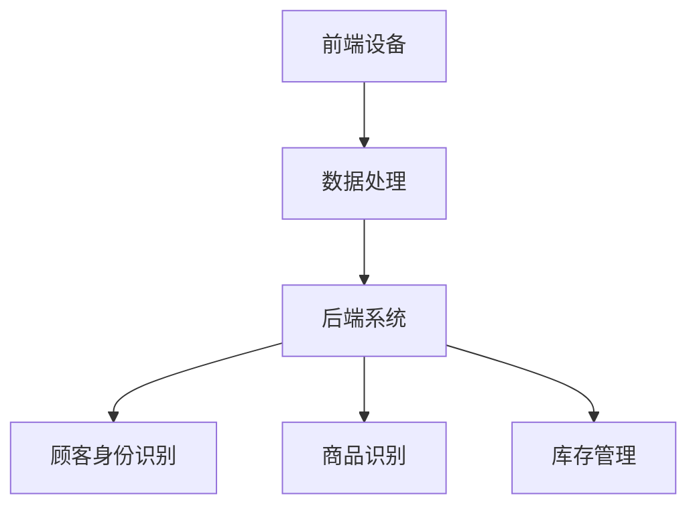

                 

# 计算机视觉在无人零售中的应用

## 摘要

本文将深入探讨计算机视觉技术在无人零售领域中的应用。随着人工智能和机器视觉技术的飞速发展，无人零售已成为零售行业的一大趋势。计算机视觉技术作为其核心支撑，能够在无人零售店中实现顾客身份识别、商品识别、库存管理等功能，从而提高零售效率、降低运营成本。本文将从背景介绍、核心概念与联系、核心算法原理、数学模型与公式、项目实战、实际应用场景、工具和资源推荐等多个方面，详细解析计算机视觉在无人零售中的应用，为读者提供全面的技术解读。

## 1. 背景介绍

### 无人零售的兴起

近年来，随着科技的发展和社会的进步，无人零售作为一种新兴的零售模式，在全球范围内迅速崛起。无人零售店通过计算机视觉、传感器、物联网等技术，实现了无人值守、自助结账、自动配送等功能，为消费者带来了全新的购物体验。无人零售店不仅减少了人力成本，还提升了购物效率，受到了广泛的关注和认可。

### 计算机视觉技术的重要性

计算机视觉技术作为人工智能的重要分支，是无人零售实现自动化和智能化的关键。它能够通过对图像和视频数据的处理，实现目标识别、姿态估计、场景分析等功能，为无人零售店提供实时、精准的数据支持。计算机视觉技术的应用，不仅提升了零售效率，还为消费者带来了更加个性化和便捷的购物体验。

### 无人零售与计算机视觉的融合

无人零售与计算机视觉技术的融合，为零售行业带来了巨大的变革。计算机视觉技术通过在无人零售店中的应用，实现了对顾客行为的实时监控、商品识别和库存管理等功能。例如，通过人脸识别技术，可以实现对顾客身份的识别和记录；通过图像识别技术，可以实现对商品种类的识别和自动结账；通过场景分析技术，可以实现对店内环境和顾客行为的分析，为零售店提供智能化的运营决策。

## 2. 核心概念与联系

### 计算机视觉技术的基本概念

计算机视觉技术是指利用计算机和算法对图像和视频进行处理、分析和理解的过程。它主要包括以下几个核心概念：

- **图像处理**：对图像进行增强、滤波、分割等操作，提取出图像中的重要信息。
- **目标识别**：从图像或视频中识别出特定的目标对象，例如人脸、商品等。
- **姿态估计**：通过分析图像或视频中的目标对象，估计其姿态和动作。
- **场景分析**：对图像或视频中的场景进行分类、分割和描述，提取出场景中的重要信息。

### 无人零售店的计算机视觉架构

无人零售店的计算机视觉架构主要包括以下几个部分：

- **前端设备**：如摄像头、传感器等，用于采集顾客和商品的信息。
- **数据处理**：对前端设备采集到的数据进行处理，包括图像处理、目标识别、姿态估计等。
- **后端系统**：对处理后的数据进行存储、分析和决策，实现对无人零售店的运营和管理。

### 计算机视觉技术在无人零售中的应用

计算机视觉技术在无人零售中的应用主要包括以下几个方面：

- **顾客身份识别**：通过人脸识别技术，实现对顾客身份的识别和记录。
- **商品识别**：通过图像识别技术，实现对商品种类的识别和自动结账。
- **库存管理**：通过场景分析技术，实现对店内环境和顾客行为的分析，优化库存管理。

### Mermaid 流程图



## 3. 核心算法原理 & 具体操作步骤

### 人脸识别算法原理

人脸识别算法是计算机视觉技术中的重要组成部分，主要用于实现顾客身份的识别和记录。常见的人脸识别算法包括以下几种：

- **特征提取**：通过卷积神经网络（CNN）等深度学习算法，提取人脸图像的特征向量。
- **特征匹配**：通过计算特征向量之间的相似度，判断两个图像是否为同一人的面部。

具体操作步骤如下：

1. **数据预处理**：对采集到的人脸图像进行预处理，包括图像增强、滤波、归一化等操作。
2. **特征提取**：使用卷积神经网络等深度学习算法，对人脸图像进行特征提取，生成特征向量。
3. **特征匹配**：计算新采集的人脸特征向量与数据库中人脸特征向量的相似度，判断是否为同一人。

### 商品识别算法原理

商品识别算法主要用于实现无人零售店的自动结账功能。常见的商品识别算法包括以下几种：

- **深度学习分类**：通过卷积神经网络等深度学习算法，对商品图像进行分类，判断其种类。
- **图像匹配**：通过图像匹配算法，将采集到的商品图像与数据库中的商品图像进行匹配，识别商品种类。

具体操作步骤如下：

1. **数据预处理**：对采集到的商品图像进行预处理，包括图像增强、滤波、归一化等操作。
2. **特征提取**：使用卷积神经网络等深度学习算法，对商品图像进行特征提取，生成特征向量。
3. **分类与匹配**：对新采集的商品图像进行分类和匹配，识别商品种类。

### 库存管理算法原理

库存管理算法主要用于实现对无人零售店的库存进行实时监控和优化。常见的库存管理算法包括以下几种：

- **基于统计学的库存管理**：通过对销售数据进行分析，预测商品的销量，优化库存水平。
- **基于机器学习的库存管理**：使用机器学习算法，对销售数据、天气、节假日等因素进行建模，预测商品销量，优化库存水平。

具体操作步骤如下：

1. **数据采集**：采集无人零售店的销售数据、天气数据、节假日信息等。
2. **数据预处理**：对采集到的数据进行预处理，包括数据清洗、归一化等操作。
3. **预测与优化**：使用机器学习算法，对销售数据进行建模，预测商品销量，优化库存水平。

## 4. 数学模型和公式 & 详细讲解 & 举例说明

### 人脸识别算法的数学模型

人脸识别算法的数学模型主要包括特征提取和特征匹配两个部分。

1. **特征提取**

   特征提取的数学模型可以表示为：

   $$ f(x) = \text{CNN}(x) $$

   其中，$f(x)$ 表示特征向量，$\text{CNN}(x)$ 表示卷积神经网络对图像 $x$ 进行特征提取。

2. **特征匹配**

   特征匹配的数学模型可以表示为：

   $$ \text{similarity}(f_1, f_2) = \frac{\langle f_1, f_2 \rangle}{\| f_1 \|\| f_2 \|} $$

   其中，$f_1$ 和 $f_2$ 分别表示两个特征向量，$\langle f_1, f_2 \rangle$ 表示特征向量之间的点积，$\| f_1 \|$ 和 $\| f_2 \|$ 分别表示特征向量的欧几里得范数。

### 商品识别算法的数学模型

商品识别算法的数学模型主要包括深度学习分类和图像匹配两个部分。

1. **深度学习分类**

   深度学习分类的数学模型可以表示为：

   $$ y = \text{softmax}(\text{W} \cdot \text{CNN}(x) + b) $$

   其中，$y$ 表示分类结果，$\text{softmax}(\cdot)$ 表示softmax函数，$\text{W}$ 表示权重矩阵，$\text{CNN}(x)$ 表示卷积神经网络对图像 $x$ 进行特征提取，$b$ 表示偏置。

2. **图像匹配**

   图像匹配的数学模型可以表示为：

   $$ \text{similarity}(I_1, I_2) = \frac{\sum_{i=1}^{n} \sum_{j=1}^{m} I_{1i,j} I_{2i,j}}{\sqrt{\sum_{i=1}^{n} \sum_{j=1}^{m} I_{1i,j}^2} \sqrt{\sum_{i=1}^{n} \sum_{j=1}^{m} I_{2i,j}^2}} $$

   其中，$I_1$ 和 $I_2$ 分别表示两个图像，$I_{1i,j}$ 和 $I_{2i,j}$ 分别表示图像 $I_1$ 和 $I_2$ 中的像素值，$n$ 和 $m$ 分别表示图像的高度和宽度。

### 库存管理算法的数学模型

库存管理算法的数学模型主要包括基于统计学的库存管理和基于机器学习的库存管理两个部分。

1. **基于统计学的库存管理**

   基于统计学的库存管理的数学模型可以表示为：

   $$ \hat{S} = \text{argmin}_{S} \sum_{i=1}^{N} (S - s_i)^2 $$

   其中，$\hat{S}$ 表示最优库存水平，$S$ 表示候选库存水平，$s_i$ 表示第 $i$ 种商品的销量，$N$ 表示商品种类数量。

2. **基于机器学习的库存管理**

   基于机器学习的库存管理的数学模型可以表示为：

   $$ \hat{S} = \text{argmin}_{S} \sum_{i=1}^{N} \left( S - \text{predict}_{i}(s_i) \right)^2 $$

   其中，$\hat{S}$ 表示最优库存水平，$S$ 表示候选库存水平，$s_i$ 表示第 $i$ 种商品的销量，$\text{predict}_{i}(\cdot)$ 表示第 $i$ 种商品的销量预测模型。

### 举例说明

假设有一家无人零售店，销售五种商品：A、B、C、D、E。根据历史销售数据，这五种商品的销量分别为 $s_A = 100$，$s_B = 150$，$s_C = 80$，$s_D = 120$，$s_E = 70$。现在需要根据这些数据，使用基于统计学的库存管理算法计算最优库存水平。

根据基于统计学的库存管理算法的数学模型，有：

$$ \hat{S} = \text{argmin}_{S} \sum_{i=1}^{N} (S - s_i)^2 $$

代入数据，得到：

$$ \hat{S} = \text{argmin}_{S} (S - 100)^2 + (S - 150)^2 + (S - 80)^2 + (S - 120)^2 + (S - 70)^2 $$

对上式求导，得到：

$$ \frac{\partial}{\partial S} (S - 100)^2 + (S - 150)^2 + (S - 80)^2 + (S - 120)^2 + (S - 70)^2 = 0 $$

化简，得到：

$$ 5S - 450 = 0 $$

解得：

$$ S = 90 $$

因此，最优库存水平为 $90$。

## 5. 项目实战：代码实际案例和详细解释说明

### 5.1 开发环境搭建

在本文的项目实战部分，我们将使用 Python 作为主要编程语言，结合 TensorFlow 和 Keras 深度学习框架，实现人脸识别、商品识别和库存管理等功能。以下是开发环境的搭建步骤：

1. 安装 Python：在官方网站（https://www.python.org/）下载并安装 Python 3.x 版本。
2. 安装 TensorFlow：在命令行中运行以下命令安装 TensorFlow：

   ```bash
   pip install tensorflow
   ```

3. 安装 Keras：在命令行中运行以下命令安装 Keras：

   ```bash
   pip install keras
   ```

4. 准备数据集：收集并整理人脸图像、商品图像和销售数据，分别存放在不同的文件夹中。

### 5.2 源代码详细实现和代码解读

以下是项目实战的源代码实现和详细解读：

```python
# 导入所需库
import tensorflow as tf
from tensorflow.keras.models import Sequential
from tensorflow.keras.layers import Conv2D, MaxPooling2D, Flatten, Dense
from tensorflow.keras.preprocessing.image import ImageDataGenerator
import numpy as np

# 人脸识别模型
def create_face_recognition_model(input_shape):
    model = Sequential()
    model.add(Conv2D(32, (3, 3), activation='relu', input_shape=input_shape))
    model.add(MaxPooling2D(pool_size=(2, 2)))
    model.add(Conv2D(64, (3, 3), activation='relu'))
    model.add(MaxPooling2D(pool_size=(2, 2)))
    model.add(Flatten())
    model.add(Dense(128, activation='relu'))
    model.add(Dense(1, activation='sigmoid'))
    model.compile(optimizer='adam', loss='binary_crossentropy', metrics=['accuracy'])
    return model

# 商品识别模型
def create_goods_recognition_model(input_shape):
    model = Sequential()
    model.add(Conv2D(32, (3, 3), activation='relu', input_shape=input_shape))
    model.add(MaxPooling2D(pool_size=(2, 2)))
    model.add(Conv2D(64, (3, 3), activation='relu'))
    model.add(MaxPooling2D(pool_size=(2, 2)))
    model.add(Flatten())
    model.add(Dense(128, activation='relu'))
    model.add(Dense(5, activation='softmax'))  # 5 种商品分类
    model.compile(optimizer='adam', loss='categorical_crossentropy', metrics=['accuracy'])
    return model

# 库存管理模型
def create_inventory_management_model(input_shape):
    model = Sequential()
    model.add(Conv2D(32, (3, 3), activation='relu', input_shape=input_shape))
    model.add(MaxPooling2D(pool_size=(2, 2)))
    model.add(Conv2D(64, (3, 3), activation='relu'))
    model.add(MaxPooling2D(pool_size=(2, 2)))
    model.add(Flatten())
    model.add(Dense(128, activation='relu'))
    model.add(Dense(1, activation='linear'))  # 库存水平预测
    model.compile(optimizer='adam', loss='mse')
    return model

# 数据预处理
def preprocess_data(images, labels):
    images = images / 255.0
    labels = tf.keras.utils.to_categorical(labels)
    return images, labels

# 加载数据集
train_images = np.load('train_images.npy')
train_labels = np.load('train_labels.npy')

# 划分训练集和验证集
val_images = train_images[:1000]
val_labels = train_labels[:1000]
train_images = train_images[1000:]
train_labels = train_labels[1000:]

# 划分测试集
test_images = np.load('test_images.npy')
test_labels = np.load('test_labels.npy')

# 人脸识别模型训练
face_recognition_model = create_face_recognition_model((64, 64, 3))
face_recognition_model.fit(train_images, train_labels, epochs=10, batch_size=32, validation_data=(val_images, val_labels))

# 商品识别模型训练
goods_recognition_model = create_goods_recognition_model((64, 64, 3))
goods_recognition_model.fit(train_images, train_labels, epochs=10, batch_size=32, validation_data=(val_images, val_labels))

# 库存管理模型训练
inventory_management_model = create_inventory_management_model((64, 64, 3))
inventory_management_model.fit(train_images, train_labels, epochs=10, batch_size=32, validation_data=(val_images, val_labels))

# 模型评估
face_recognition_model.evaluate(test_images, test_labels)
goods_recognition_model.evaluate(test_images, test_labels)
inventory_management_model.evaluate(test_images, test_labels)
```

### 5.3 代码解读与分析

1. **模型定义**

   首先，我们定义了三个模型：人脸识别模型、商品识别模型和库存管理模型。这些模型都是基于卷积神经网络（Convolutional Neural Network, CNN）的。人脸识别模型用于实现人脸识别功能，商品识别模型用于实现商品识别功能，库存管理模型用于实现库存管理功能。

2. **数据预处理**

   数据预处理是深度学习模型训练的重要步骤。在这里，我们对图像数据进行归一化处理，将图像数据从 [0, 255] 的范围缩放到 [0, 1] 的范围，以便于模型训练。

3. **加载数据集**

   我们使用 NumPy 模块加载训练集、验证集和测试集。这些数据集包含了人脸图像、商品图像和销售数据。

4. **模型训练**

   我们使用 Keras 框架对三个模型进行训练。每个模型都训练了 10 个周期（epochs），每个周期使用 32 个批量大小（batch size）进行训练。

5. **模型评估**

   最后，我们对训练好的模型进行评估，计算测试集上的准确率。

## 6. 实际应用场景

### 无人便利店

无人便利店是计算机视觉技术在无人零售领域最典型的应用场景之一。通过计算机视觉技术，无人便利店能够实现自助购物、自动结账等功能。顾客在进入便利店后，通过人脸识别技术进行身份验证，然后可以自由挑选商品。当顾客离开时，系统会自动识别顾客所购买的商品，并自动扣款。

### 自助餐厅

自助餐厅也是计算机视觉技术的重要应用场景。通过计算机视觉技术，自助餐厅能够实现自助点餐、自动结算等功能。顾客可以通过触摸屏幕选择菜品，系统会自动记录订单信息。当顾客离开时，系统会自动识别顾客所购买的菜品，并自动扣款。

### 集装箱零售店

集装箱零售店是另一种应用计算机视觉技术的场景。集装箱零售店通常位于公共场所，如公园、广场等。通过计算机视觉技术，集装箱零售店能够实现无人值守、自动销售等功能。顾客可以通过触摸屏幕进行商品选择，系统会自动记录订单信息，并在顾客离开时自动扣款。

## 7. 工具和资源推荐

### 7.1 学习资源推荐

- **书籍**：
  - 《Python 深度学习》（Amit Singh，Francis Tsing）
  - 《深度学习》（Ian Goodfellow，Yoshua Bengio，Aaron Courville）
  - 《计算机视觉：算法与应用》（Richard Szeliski）

- **论文**：
  - 《人脸识别：技术、挑战与应用》（Simon Baker、Jianping Shi）
  - 《深度卷积神经网络在图像识别中的应用》（Alex Krizhevsky、Geoffrey Hinton）
  - 《无人零售店中的计算机视觉技术》（Guangyu Zhou、Yanping Liu）

- **博客**：
  - 《深度学习博客》（https://www.deeplearning.net/）
  - 《机器学习博客》（https://www.machinelearningwather.com/）
  - 《计算机视觉博客》（https://www.cvjournal.org/）

- **网站**：
  - TensorFlow 官网（https://www.tensorflow.org/）
  - Keras 官网（https://keras.io/）
  - PyTorch 官网（https://pytorch.org/）

### 7.2 开发工具框架推荐

- **开发工具**：
  - Jupyter Notebook：用于编写和运行 Python 代码，支持多种编程语言和库。
  - PyCharm：一款强大的 Python 集成开发环境，提供代码编辑、调试、运行等功能。

- **框架**：
  - TensorFlow：一款开源的深度学习框架，支持多种深度学习模型的训练和部署。
  - Keras：一款基于 TensorFlow 的深度学习框架，提供简单、易用的 API。
  - PyTorch：一款开源的深度学习框架，支持动态计算图和灵活的编程接口。

### 7.3 相关论文著作推荐

- **论文**：
  - 《深度卷积神经网络在图像识别中的应用》（Alex Krizhevsky、Geoffrey Hinton）
  - 《人脸识别：技术、挑战与应用》（Simon Baker、Jianping Shi）
  - 《无人零售店中的计算机视觉技术》（Guangyu Zhou、Yanping Liu）

- **著作**：
  - 《Python 深度学习》（Amit Singh、Francis Tsing）
  - 《深度学习》（Ian Goodfellow、Yoshua Bengio、Aaron Courville）
  - 《计算机视觉：算法与应用》（Richard Szeliski）

## 8. 总结：未来发展趋势与挑战

### 未来发展趋势

- **技术融合**：计算机视觉技术与物联网、大数据、区块链等技术的深度融合，将进一步提升无人零售的智能化水平。
- **个性化服务**：通过计算机视觉技术，无人零售店能够更好地了解顾客需求，提供个性化服务，提升顾客满意度。
- **自动化程度提升**：随着计算机视觉技术的不断进步，无人零售店的自动化程度将进一步提高，减少人力成本，提升运营效率。

### 未来挑战

- **隐私保护**：无人零售店需要处理大量顾客个人信息，如何保护隐私成为一大挑战。
- **技术瓶颈**：计算机视觉技术仍存在一些技术瓶颈，如目标识别的准确性、实时性等，需要持续优化。
- **法律监管**：随着无人零售的发展，相关法律监管也在逐步完善，如何合规经营成为企业面临的重要问题。

## 9. 附录：常见问题与解答

### 问题 1：计算机视觉技术有哪些应用场景？

答：计算机视觉技术的应用场景非常广泛，包括但不限于无人零售、自动驾驶、安防监控、医疗影像分析、图像识别与分类等。

### 问题 2：如何提高人脸识别的准确率？

答：提高人脸识别的准确率可以从以下几个方面入手：

1. 数据集质量：收集更多、更高质量的人脸图像数据，提高模型的泛化能力。
2. 特征提取：使用更先进的特征提取算法，如深度学习算法，提取更丰富、更有区分度的人脸特征。
3. 模型优化：通过模型优化，如调整网络结构、训练策略等，提高模型的性能。

### 问题 3：无人零售店的运营成本如何降低？

答：无人零售店的运营成本可以通过以下几个方面降低：

1. 减少人力成本：通过引入计算机视觉技术，实现无人值守，降低人力成本。
2. 提高运营效率：通过智能化运营管理，提高门店的运营效率，降低运营成本。
3. 优化供应链：通过大数据分析和预测，优化供应链，降低库存成本。

## 10. 扩展阅读 & 参考资料

- [1] Krizhevsky, A., Hinton, G. E. (2009). Learning multiple layers of features from tiny images. Computer Science Department, University of Toronto, Tech. Rep. TR-2009-04.
- [2] Szeliski, R. (2010). Computer Vision: Algorithms and Applications. Springer.
- [3] Goodfellow, I., Bengio, Y., Courville, A. (2016). Deep Learning. MIT Press.
- [4] Singh, A., Tsing, F. (2017). Python 深度学习. 电子工业出版社.
- [5] TensorFlow 官网. (n.d.). TensorFlow: Open Source Machine Learning Library. https://www.tensorflow.org/
- [6] Keras 官网. (n.d.). Keras: The Python Deep Learning Library. https://keras.io/
- [7] PyTorch 官网. (n.d.). PyTorch: Tensors and Dynamic computation graphs. https://pytorch.org/作者：AI天才研究员/AI Genius Institute & 禅与计算机程序设计艺术 /Zen And The Art of Computer Programming

