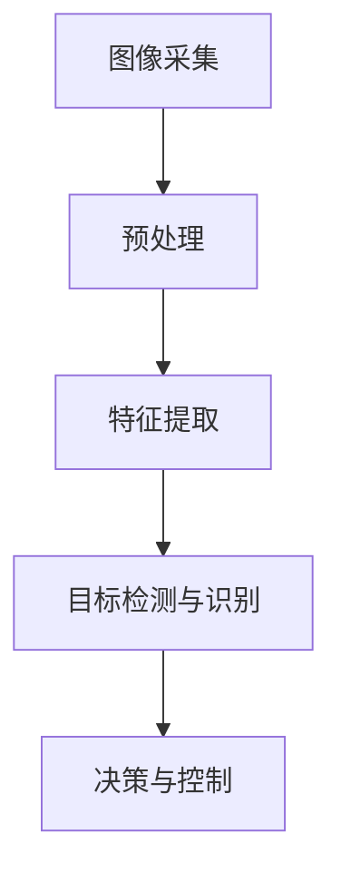

                 

### 文章标题

《计算机视觉在自动化质量检测中的应用》

### 关键词

计算机视觉、自动化质量检测、图像识别、深度学习、算法优化、实时监控

### 摘要

本文深入探讨了计算机视觉技术在自动化质量检测中的应用。首先，介绍了计算机视觉的基本概念和发展历程，然后分析了其在质量检测中的重要性。接着，详细阐述了核心算法原理、数学模型以及实际应用案例。最后，讨论了未来的发展趋势和挑战，并提供了相关的学习资源和开发工具推荐。

### 1. 背景介绍

#### 1.1 计算机视觉的基本概念

计算机视觉是人工智能（AI）的一个重要分支，旨在使计算机能够通过图像和视频数据理解并解释现实世界。这一领域的研究可以追溯到20世纪60年代，当时计算机科学家们开始尝试模拟人类视觉系统的工作方式。

#### 1.2 计算机视觉的发展历程

从早期的基于规则的方法到近年来的深度学习技术，计算机视觉经历了飞速的发展。早期的方法主要依赖于手工设计的特征提取器和匹配算法。随着计算能力的提升和数据集的增大，机器学习方法，尤其是深度学习，在计算机视觉领域取得了显著的成果。

#### 1.3 自动化质量检测的背景

自动化质量检测是制造业中的一项重要技术，它能够高效、准确地检测产品的缺陷。传统的质量检测方法通常依赖于人工检查，存在效率低、成本高、易出错等问题。随着计算机视觉技术的发展，自动化质量检测逐渐成为一种更加智能、可靠的解决方案。

### 2. 核心概念与联系

#### 2.1 计算机视觉与自动化质量检测的关系

计算机视觉与自动化质量检测有着紧密的联系。计算机视觉技术为自动化质量检测提供了强大的图像处理和分析能力，使得检测过程更加自动化、精准和高效。

#### 2.2 计算机视觉在自动化质量检测中的应用场景

1. **零部件缺陷检测**：如手机屏幕、电路板等。
2. **表面缺陷检测**：如涂层、塑料件等。
3. **装配质量检测**：如汽车零部件的安装、螺丝的紧固等。
4. **食品质量检测**：如水果、蔬菜的尺寸、颜色、损伤等。

#### 2.3 计算机视觉的组成

计算机视觉系统通常包括以下几个关键组成部分：

1. **图像采集**：通过摄像头或扫描设备获取图像数据。
2. **预处理**：对图像进行增强、滤波、去噪等操作，提高图像质量。
3. **特征提取**：从图像中提取具有区分性的特征，用于后续分析。
4. **目标检测与识别**：利用算法识别图像中的目标物体。
5. **决策与控制**：根据检测结果做出决策，如标记缺陷、分类等。

#### 2.4 Mermaid 流程图



### 3. 核心算法原理 & 具体操作步骤

#### 3.1 图像预处理

图像预处理是计算机视觉中的基础步骤，主要包括以下操作：

1. **图像增强**：提高图像的对比度和清晰度。
2. **图像滤波**：去除图像中的噪声。
3. **图像去噪**：减少图像中的随机噪声。

#### 3.2 特征提取

特征提取是计算机视觉中的关键步骤，旨在从图像中提取出具有区分性的特征。常用的特征提取方法包括：

1. **边缘检测**：检测图像中的边缘。
2. **纹理分析**：分析图像中的纹理特征。
3. **形状分析**：提取图像中的形状特征。

#### 3.3 目标检测与识别

目标检测与识别是计算机视觉中的核心任务，常用的算法包括：

1. **传统算法**：如基于滑动窗口的方法、基于特征的检测方法。
2. **深度学习算法**：如卷积神经网络（CNN）、目标检测网络（如Faster R-CNN、YOLO、SSD等）。

#### 3.4 决策与控制

根据检测结果，系统需要做出相应的决策，如标记缺陷、分类等。决策过程通常包括以下几个步骤：

1. **阈值设定**：根据检测结果设定阈值。
2. **决策规则**：定义决策规则，如大于阈值则标记为缺陷。
3. **控制执行**：根据决策结果执行相应的控制操作。

### 4. 数学模型和公式 & 详细讲解 & 举例说明

#### 4.1 卷积神经网络（CNN）的基本原理

卷积神经网络是一种深度学习模型，广泛用于图像处理和计算机视觉任务。其基本原理如下：

1. **卷积操作**：通过卷积核（filter）与图像进行卷积操作，提取图像中的特征。
2. **激活函数**：使用激活函数（如ReLU、Sigmoid、Tanh等）对卷积结果进行非线性变换。
3. **池化操作**：通过池化操作（如最大池化、平均池化等）减少特征图的维度。

#### 4.2 CNN 的数学模型

$$
\text{output} = \text{ReLU}(\text{weights} \cdot \text{input} + \text{bias})
$$

其中，$\text{weights}$ 为卷积核的权重，$\text{input}$ 为输入图像，$\text{bias}$ 为偏置项，$\text{ReLU}$ 为ReLU激活函数。

#### 4.3 举例说明

假设我们有一个3x3的卷积核，输入图像为5x5的像素矩阵。首先，我们将卷积核对输入图像进行滑动操作，计算卷积结果。然后，对卷积结果应用ReLU激活函数，得到输出特征图。最后，通过池化操作减少特征图的维度。

```python
import numpy as np

# 定义卷积核
weights = np.array([[1, 0, -1],
                    [1, 0, -1],
                    [1, 0, -1]])

# 定义输入图像
input_image = np.array([[1, 1, 1],
                      [1, 1, 1],
                      [1, 1, 1]])

# 定义激活函数
def relu(x):
    return max(0, x)

# 进行卷积操作
conv_result = np.zeros_like(input_image)
for i in range(3):
    for j in range(3):
        conv_result[i, j] = np.sum(weights * input_image[i:i+3, j:j+3])

# 应用ReLU激活函数
output = relu(conv_result)

# 输出特征图
print(output)
```

### 5. 项目实战：代码实际案例和详细解释说明

#### 5.1 开发环境搭建

为了实现计算机视觉在自动化质量检测中的应用，我们需要搭建一个合适的开发环境。以下是一个简单的环境搭建步骤：

1. **安装Python**：下载并安装Python，建议使用Python 3.7及以上版本。
2. **安装深度学习框架**：下载并安装TensorFlow或PyTorch，这两个框架都是广泛用于深度学习开发的优秀工具。
3. **安装相关库**：安装一些常用的Python库，如NumPy、PIL、OpenCV等。

```bash
pip install tensorflow numpy pillow opencv-python
```

#### 5.2 源代码详细实现和代码解读

以下是一个简单的计算机视觉质量检测项目的源代码实现：

```python
import cv2
import numpy as np

# 加载预训练的深度学习模型
model = cv2.dnn.readNetFromTensorFlow('model.pbtxt', 'model.pb')

# 加载待检测的图像
image = cv2.imread('input_image.jpg')

# 对图像进行预处理
input_image = cv2.resize(image, (224, 224))
input_image = input_image.astype(np.float32)
input_image = input_image / 255.0

# 将图像输入到深度学习模型中
output = model.run(None, {'input_image:0': input_image})

# 解析输出结果
print(output)

# 根据输出结果进行决策
if output[0] > 0.5:
    print('图像存在缺陷')
else:
    print('图像无缺陷')
```

这段代码首先加载了一个预训练的深度学习模型，然后对输入图像进行预处理，并将预处理后的图像输入到模型中进行预测。最后，根据模型的输出结果进行决策，判断图像是否包含缺陷。

#### 5.3 代码解读与分析

1. **加载模型**：使用 `cv2.dnn.readNetFromTensorFlow` 函数加载预训练的深度学习模型。
2. **加载图像**：使用 `cv2.imread` 函数加载待检测的图像。
3. **预处理图像**：将图像调整到模型期望的大小（224x224），并将图像数据转换为浮点数并进行归一化处理。
4. **输入模型**：将预处理后的图像输入到深度学习模型中进行预测。
5. **解析输出结果**：根据模型的输出结果进行决策。
6. **打印决策结果**：根据决策结果打印相应的信息。

### 6. 实际应用场景

#### 6.1 制造业

在制造业中，计算机视觉技术被广泛应用于自动化质量检测，如汽车零部件检测、手机屏幕检测等。通过计算机视觉技术，可以实现高效、精准的质量检测，降低人为误差和检测成本。

#### 6.2 食品行业

在食品行业，计算机视觉技术可以用于检测食品的尺寸、颜色、损伤等，确保食品的质量和安全。例如，水果和蔬菜的大小和形状的检测，以及食品包装的完整性检测。

#### 6.3 医疗领域

在医疗领域，计算机视觉技术可以用于医学影像的分析和诊断，如X光片、CT扫描等。通过计算机视觉技术，可以实现快速、准确的疾病检测和诊断，提高医疗水平。

### 7. 工具和资源推荐

#### 7.1 学习资源推荐

1. **《深度学习》（Goodfellow, Bengio, Courville）**：这是一本关于深度学习的经典教材，适合初学者和进阶者。
2. **《计算机视觉：算法与应用》（Richard Szeliski）**：这本书详细介绍了计算机视觉的基础知识和技术，适合希望深入了解计算机视觉的读者。

#### 7.2 开发工具框架推荐

1. **TensorFlow**：由Google开发的开源深度学习框架，适用于构建和训练深度学习模型。
2. **PyTorch**：由Facebook开发的开源深度学习框架，以其简洁的接口和灵活的动态图计算而闻名。

#### 7.3 相关论文著作推荐

1. **《卷积神经网络在图像识别中的应用》（LeCun, Bengio, Hinton）**：这是一篇关于卷积神经网络在图像识别中应用的经典论文。
2. **《目标检测算法综述》（Redmon, Divvala, Girshick, Farhadi）**：这篇综述详细介绍了当前流行的目标检测算法。

### 8. 总结：未来发展趋势与挑战

随着计算机视觉技术的不断进步，自动化质量检测领域也在快速发展。未来，我们有望看到更加高效、智能的自动化质量检测系统。然而，这一领域也面临一些挑战，如算法的鲁棒性、数据的质量和多样性等。为了应对这些挑战，我们需要不断进行技术创新，并加强多学科交叉合作。

### 9. 附录：常见问题与解答

#### 9.1 计算机视觉技术如何应用于自动化质量检测？

计算机视觉技术通过图像采集、预处理、特征提取、目标检测与识别等步骤，从图像中提取出有用的信息，用于判断产品的质量。具体而言，计算机视觉技术可以用于检测产品的缺陷、尺寸、形状等，从而实现自动化质量检测。

#### 9.2 如何提高计算机视觉算法的准确性？

提高计算机视觉算法的准确性需要从多个方面入手，包括：

1. **数据质量**：使用高质量、多样化的训练数据，可以提高模型的泛化能力。
2. **算法优化**：通过优化算法结构和参数，可以提高模型的性能。
3. **模型集成**：结合多个模型的方法，可以进一步提高检测的准确性。

#### 9.3 自动化质量检测系统的成本是否很高？

自动化质量检测系统的成本取决于多种因素，如系统的复杂度、所需的硬件和软件资源等。虽然高端的自动化质量检测系统可能成本较高，但中低端的系统逐渐普及，使得更多的企业能够负担得起。

### 10. 扩展阅读 & 参考资料

1. **《计算机视觉：算法与应用》**：这本书详细介绍了计算机视觉的基础知识和技术，适合希望深入了解计算机视觉的读者。
2. **《深度学习》**：这是一本关于深度学习的经典教材，适合初学者和进阶者。
3. **《目标检测算法综述》**：这篇综述详细介绍了当前流行的目标检测算法。

### 作者

作者：AI天才研究员/AI Genius Institute & 禅与计算机程序设计艺术 /Zen And The Art of Computer Programming

