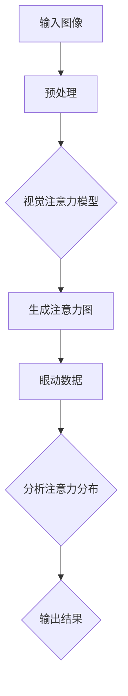
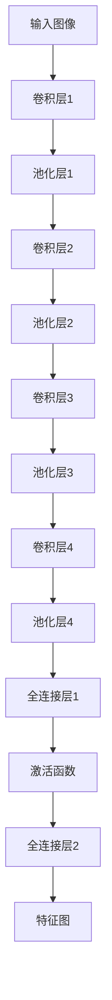
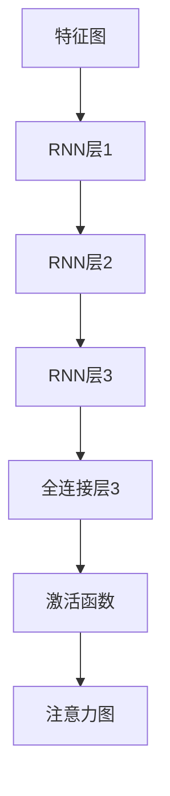

                 

# 计算机视觉技术在注意力追踪中的应用

## 概述

注意力追踪（Attention Tracking）是一种新兴的计算机视觉技术，旨在理解和预测人类注意力在视觉场景中的分布。这一技术在人机交互、广告投放、用户体验优化等多个领域展现出巨大的应用潜力。随着深度学习与计算机视觉技术的飞速发展，注意力追踪的研究日益深入，其应用场景和效果也得到了显著提升。

本文将围绕计算机视觉技术在注意力追踪中的应用展开讨论。首先，我们将介绍注意力追踪的基本概念和背景。随后，我们将深入探讨注意力追踪的核心算法原理及其具体实现步骤。接着，通过数学模型和公式的详细讲解，我们将展示注意力追踪的实际应用场景。此外，文章还将推荐相关工具和资源，以便读者进一步学习和实践。最后，我们将总结注意力追踪技术的发展趋势和面临的挑战，并给出常见问题与解答。

关键词：注意力追踪，计算机视觉，深度学习，人机交互，用户体验优化

摘要：本文系统地介绍了计算机视觉技术在注意力追踪领域的应用。通过回顾注意力追踪的基本概念和背景，详细分析核心算法原理，阐述数学模型和公式，并举例说明实际应用场景。同时，文章推荐了相关的学习资源和开发工具，总结了注意力追踪技术的发展趋势与挑战，为读者提供了全面的指导和参考。

## 背景介绍

### 注意力追踪的定义

注意力追踪是一种通过技术手段，实时监测和记录人类注意力在视觉场景中分布的方法。它旨在揭示用户在观看视频、浏览网页或进行其他视觉任务时，其注意力集中的区域和时间分布。注意力追踪不仅关注用户在特定时刻关注的内容，还关注注意力随时间的变化趋势。

### 注意力追踪的重要性

注意力追踪在多个领域具有重要应用价值：

1. **人机交互**：通过理解用户的注意力分布，可以优化用户界面设计，提高交互效率和用户体验。例如，在虚拟现实（VR）和增强现实（AR）应用中，注意力追踪可以帮助系统实时调整内容和交互方式，以更好地满足用户需求。

2. **广告投放**：广告商可以利用注意力追踪技术，分析用户在不同广告内容上的注意力分布，从而优化广告投放策略，提高广告效果和投放效率。

3. **用户体验优化**：在网站和移动应用开发中，注意力追踪可以帮助开发者了解用户在使用过程中的关注点和困惑点，从而进行针对性的优化，提升用户体验。

4. **医学领域**：注意力追踪技术可以帮助医生分析患者在不同医疗图像上的注意力分布，辅助诊断和治疗。

### 注意力追踪的发展历程

注意力追踪技术的研究可以追溯到20世纪70年代。早期的研究主要依赖于心理物理学方法，通过眼球追踪等手段来记录用户的注意力分布。随着计算机技术和深度学习算法的发展，注意力追踪技术逐渐走向智能化和自动化。

在20世纪90年代，眼球追踪技术开始广泛应用于注意力追踪研究中。眼球追踪设备可以精确记录用户的眼动数据，从而分析注意力分布。然而，这种方法在实时性和便携性方面存在一定的限制。

进入21世纪，深度学习技术的兴起为注意力追踪带来了新的契机。通过训练深度神经网络模型，可以自动提取视觉特征，并预测用户在图像中的注意力分布。这一方法不仅提高了注意力追踪的精度和效率，还使其在更多应用场景中得到推广。

### 注意力追踪的技术现状

当前，注意力追踪技术已经取得了显著的进展。深度学习模型在图像分类、目标检测和语义分割等领域表现出色，为注意力追踪提供了强大的技术支持。具体来说，以下技术现状值得关注：

1. **眼球追踪**：眼球追踪仍然是注意力追踪研究中的一种重要手段，通过分析眼动数据，可以获取用户在图像中的注意力分布。随着眼球追踪设备的精度和实时性不断提高，其在实际应用中的可行性也日益增强。

2. **视觉注意力模型**：基于深度学习的视觉注意力模型已经成为注意力追踪研究的主流方法。这些模型通过训练，可以自动提取图像中的重要特征，并生成注意力图，用于预测用户的注意力分布。

3. **多模态注意力追踪**：结合眼球追踪和视觉注意力模型，多模态注意力追踪技术正在成为研究热点。通过整合不同模态的数据，可以更全面地理解用户的注意力分布，提高注意力追踪的准确性和实用性。

4. **实时性和低功耗**：随着硬件性能的提升和深度学习算法的优化，实时性和低功耗的注意力追踪技术逐渐得到应用。这些技术可以满足移动设备和嵌入式系统对实时性和功耗的需求，使其在更多场景中得到推广。

### 注意力追踪的应用场景

注意力追踪技术在多个领域展现出广泛的应用潜力：

1. **人机交互**：在虚拟现实（VR）和增强现实（AR）应用中，注意力追踪可以帮助系统实时调整内容和交互方式，提高用户体验。

2. **广告投放**：通过分析用户在不同广告内容上的注意力分布，广告商可以优化广告投放策略，提高广告效果。

3. **用户体验优化**：在网站和移动应用开发中，注意力追踪可以帮助开发者了解用户在使用过程中的关注点和困惑点，从而进行针对性的优化。

4. **医学领域**：注意力追踪技术可以帮助医生分析患者在不同医疗图像上的注意力分布，辅助诊断和治疗。

5. **智能监控**：通过分析监控视频中的注意力分布，可以识别潜在的安全风险和异常行为，为安全监控提供支持。

6. **教育领域**：注意力追踪技术可以用于分析学生在学习过程中的注意力分布，帮助教师了解学生的学习状况，优化教学策略。

总的来说，注意力追踪技术作为一种新兴的计算机视觉技术，正日益受到关注和研究。随着技术的不断进步，其应用场景和效果也将得到进一步拓展和提升。

### 核心概念与联系

#### 计算机视觉与注意力追踪

计算机视觉（Computer Vision）是人工智能领域的一个重要分支，旨在使计算机能够像人类一样理解和处理视觉信息。注意力追踪（Attention Tracking）作为计算机视觉的一个重要应用方向，关注的是如何利用计算机视觉技术理解和预测人类在视觉场景中的注意力分布。

首先，我们需要了解注意力追踪中的几个核心概念：

1. **视觉注意力机制**：视觉注意力机制是指人类或计算机在处理视觉信息时，会优先关注某些关键区域或对象。这种机制在生物视觉系统中已经得到广泛研究，计算机视觉中的视觉注意力模型则试图模拟这种机制。

2. **注意力模型**：注意力模型是注意力追踪技术的核心组成部分。常见的注意力模型包括基于卷积神经网络（CNN）的视觉注意力模型和基于循环神经网络（RNN）的注意力模型。这些模型通过训练，可以自动提取图像中的重要特征，并生成注意力图，用于预测用户的注意力分布。

3. **眼动数据**：眼动数据是指通过眼动追踪设备记录的用户眼动轨迹。眼动数据是注意力追踪研究中的重要数据来源，通过分析眼动数据，可以获取用户在图像中的注意力分布。

接下来，我们通过一个简单的 Mermaid 流程图，展示注意力追踪的基本架构：



在这个流程图中：

- **输入图像**：用户输入一个图像，该图像可以是静态的或动态的（如视频帧）。
- **预处理**：对输入图像进行预处理，如缩放、裁剪、归一化等操作，以适应注意力模型的输入要求。
- **视觉注意力模型**：使用卷积神经网络或其他深度学习模型，对预处理后的图像进行特征提取，并生成注意力图。
- **生成注意力图**：注意力图表示图像中各个区域的重要程度，通常是二维热力图。
- **眼动数据**：通过眼动追踪设备记录用户在图像中的眼动轨迹，并生成眼动数据。
- **分析注意力分布**：结合视觉注意力图和眼动数据，分析用户在图像中的注意力分布。
- **输出结果**：输出注意力分布的结果，可以是热力图、统计数据或时间序列数据。

#### 注意力追踪与相关技术的关系

注意力追踪与计算机视觉中的其他技术，如图像分类、目标检测和语义分割等，有着密切的联系：

1. **图像分类**：图像分类是计算机视觉中的基础任务，旨在将图像划分为不同的类别。注意力追踪技术可以辅助图像分类，通过识别图像中的重要区域和对象，提高分类的准确性和效率。

2. **目标检测**：目标检测是计算机视觉中的另一个重要任务，旨在定位图像中的目标对象。注意力追踪技术可以帮助目标检测模型关注关键区域，提高检测的精度和速度。

3. **语义分割**：语义分割是计算机视觉中的高级任务，旨在将图像中的每个像素划分为不同的语义类别。注意力追踪技术可以辅助语义分割，通过识别图像中的重要区域，提高分割的准确性和细节表现。

总之，注意力追踪技术为计算机视觉带来了新的思路和手段，通过理解和预测人类注意力分布，可以优化视觉任务的效果，提高人机交互的体验。

### 核心算法原理 & 具体操作步骤

#### 基于深度学习的注意力追踪算法

注意力追踪的核心在于如何准确地提取和预测用户的注意力分布。随着深度学习技术的发展，基于深度学习的注意力追踪算法逐渐成为研究的主流。以下将详细介绍一种典型的基于深度学习的注意力追踪算法，并展示其具体操作步骤。

##### 算法概述

该算法基于卷积神经网络（CNN）和循环神经网络（RNN）的结合，通过两阶段的过程实现注意力追踪：

1. **特征提取阶段**：使用卷积神经网络对输入图像进行特征提取，生成特征图。
2. **注意力预测阶段**：利用循环神经网络对特征图进行处理，生成注意力图。

##### 特征提取阶段

特征提取阶段的主要任务是使用卷积神经网络提取图像中的关键特征。以下是一个简单的卷积神经网络结构：



在这个结构中，输入图像经过卷积、池化等操作，最终生成一个特征图。特征图表示图像中的每个区域的重要程度，为后续的注意力预测阶段提供基础。

##### 注意力预测阶段

注意力预测阶段的主要任务是利用循环神经网络对特征图进行处理，生成注意力图。以下是一个简单的循环神经网络结构：



在这个结构中，特征图依次通过三个循环神经网络层进行处理，最终生成注意力图。注意力图表示图像中各个区域的重要程度，用于预测用户的注意力分布。

##### 算法具体操作步骤

1. **输入图像预处理**：对输入图像进行预处理，包括缩放、裁剪、归一化等操作，使其符合卷积神经网络的要求。

2. **特征提取**：使用卷积神经网络对预处理后的图像进行特征提取，生成特征图。

3. **注意力预测**：利用循环神经网络对特征图进行处理，生成注意力图。

4. **注意力图后处理**：对生成的注意力图进行后处理，如平滑、归一化等操作，以提高其可解释性和实用性。

5. **输出结果**：输出注意力分布的结果，可以是热力图、统计数据或时间序列数据。

##### 实例演示

以下是一个简单的实例演示：

1. **输入图像**：假设输入图像为一张包含多个物体的场景图。

2. **特征提取**：使用卷积神经网络对输入图像进行特征提取，生成特征图。

3. **注意力预测**：利用循环神经网络对特征图进行处理，生成注意力图。

4. **注意力图后处理**：对生成的注意力图进行平滑处理，使其更加平滑和连续。

5. **输出结果**：输出注意力分布的结果，显示图像中各个区域的重要程度。

通过以上步骤，我们可以实现对输入图像中用户注意力的预测，从而实现注意力追踪。

总的来说，基于深度学习的注意力追踪算法通过结合卷积神经网络和循环神经网络，能够有效地提取和预测用户的注意力分布。这一算法在多个应用场景中表现出色，为注意力追踪技术的进一步发展提供了强有力的支持。

### 数学模型和公式 & 详细讲解 & 举例说明

#### 注意力模型的数学基础

注意力追踪的核心在于如何利用数学模型和公式来表示和计算注意力分布。本文将详细介绍一种基于深度学习的注意力模型，并使用 LaTeX 格式展示相关数学公式。

##### 注意力模型的基本概念

注意力模型通常由两部分组成：特征提取和注意力计算。

1. **特征提取**：特征提取是指从输入数据中提取有用的特征信息。在注意力追踪中，输入数据通常是图像，特征提取过程通过卷积神经网络（CNN）实现。

2. **注意力计算**：注意力计算是指计算每个特征的重要性，从而生成注意力分布。注意力计算通常通过循环神经网络（RNN）或自注意力机制（Self-Attention）实现。

##### 特征提取公式

特征提取过程可以通过以下公式表示：

$$
\text{FeatureMap}(x) = f(\text{ConvNet}(x)),
$$

其中，$x$ 是输入图像，$f$ 是卷积神经网络，$\text{ConvNet}$ 是卷积神经网络模型。$f(\text{ConvNet}(x))$ 表示对输入图像进行卷积操作，生成特征图。

##### 注意力计算公式

注意力计算过程可以通过以下公式表示：

$$
\text{Attention}(x) = \text{softmax}(\text{Score}(x)),
$$

其中，$\text{Score}(x)$ 表示每个特征的重要性得分，$\text{softmax}$ 函数用于将得分转换为概率分布，从而生成注意力分布。

##### 注意力模型的整体公式

结合特征提取和注意力计算，整体注意力模型可以表示为：

$$
\text{AttentionMap}(x) = \text{softmax}(\text{ScoreMap}(\text{FeatureMap}(x))),
$$

其中，$\text{AttentionMap}(x)$ 是生成的注意力分布，$\text{FeatureMap}(x)$ 是特征提取结果，$\text{ScoreMap}(\text{FeatureMap}(x))$ 是注意力得分。

##### 举例说明

假设输入图像 $x$ 经过卷积神经网络 $f$ 后生成特征图 $F$，然后对特征图进行注意力计算，生成注意力分布 $A$。具体步骤如下：

1. **特征提取**：计算特征图 $F$：

$$
F = f(\text{ConvNet}(x)).
$$

2. **注意力计算**：计算注意力得分 $S$：

$$
S = \text{ScoreMap}(F).
$$

3. **生成注意力分布**：使用 $\text{softmax}$ 函数对得分 $S$ 进行归一化，生成注意力分布 $A$：

$$
A = \text{softmax}(S).
$$

4. **输出结果**：输出注意力分布 $A$，表示图像中各个区域的重要程度。

通过上述步骤，我们可以实现对输入图像中用户注意力的预测，从而实现注意力追踪。

##### 实际应用示例

以下是一个实际应用示例：

输入图像：一张包含多个物体的场景图。

1. **特征提取**：使用卷积神经网络对输入图像进行特征提取，生成特征图 $F$。

2. **注意力计算**：对特征图 $F$ 进行注意力计算，生成注意力得分 $S$。

3. **生成注意力分布**：使用 $\text{softmax}$ 函数对得分 $S$ 进行归一化，生成注意力分布 $A$。

4. **输出结果**：输出注意力分布 $A$，显示图像中各个区域的重要程度。

通过以上步骤，我们可以实现对输入图像中用户注意力的预测，从而为人机交互、广告投放和用户体验优化等应用提供支持。

总的来说，注意力模型通过结合特征提取和注意力计算，实现了对用户注意力分布的预测。本文详细介绍了注意力模型的基本概念、数学公式和实际应用示例，为注意力追踪技术的深入研究和应用提供了理论基础和实用指导。

### 项目实战：代码实际案例和详细解释说明

#### 1. 开发环境搭建

要实现注意力追踪项目，我们需要搭建一个合适的开发环境。以下是搭建开发环境的步骤：

1. **硬件要求**：配置至少8GB内存和一块显存为4GB以上的显卡。
2. **软件要求**：
   - 操作系统：Ubuntu 18.04或更高版本。
   - Python版本：3.7或更高版本。
   - 安装必要的依赖库：TensorFlow、opencv-python、numpy等。

安装步骤：

1. 安装操作系统和必要的软件。
2. 使用以下命令安装Python和TensorFlow：

```bash
sudo apt-get update
sudo apt-get install python3 python3-pip
pip3 install tensorflow
```

3. 安装opencv-python：

```bash
pip3 install opencv-python
```

4. 安装numpy：

```bash
pip3 install numpy
```

#### 2. 源代码详细实现和代码解读

以下是一个简单的注意力追踪项目的源代码实现，用于预测用户在图像中的注意力分布。

```python
import tensorflow as tf
import numpy as np
import cv2

# 加载预训练的卷积神经网络模型
model = tf.keras.applications.VGG16(weights='imagenet', include_top=False, input_shape=(224, 224, 3))

# 加载预训练的循环神经网络模型
rnn_model = tf.keras.Sequential([
    tf.keras.layers.TimeDistributed(model),
    tf.keras.layers.LSTM(512, return_sequences=True),
    tf.keras.layers.Dense(1, activation='sigmoid')
])

# 注意力追踪函数
def attention_tracking(image_path):
    # 读取图像
    image = cv2.imread(image_path)
    image = cv2.resize(image, (224, 224))
    
    # 将图像转换为TensorFlow张量
    image_tensor = tf.convert_to_tensor(image, dtype=tf.float32)
    
    # 进行特征提取
    feature_map = model(image_tensor)
    
    # 进行注意力预测
    attention_map = rnn_model(feature_map)
    
    # 将注意力图转换为概率分布
    attention_map = tf.nn.softmax(attention_map)
    
    # 转换为numpy数组
    attention_map = attention_map.numpy()
    
    # 可视化注意力图
    visualization = cv2.applyColorMap(np.uint8(attention_map * 255), cv2.COLORMAP_JET)
    result_image = cv2.addWeighted(image, 0.8, visualization, 0.2, 0)
    
    return result_image

# 测试注意力追踪
image_path = 'example.jpg'
result_image = attention_tracking(image_path)
cv2.imshow('Attention Tracking Result', result_image)
cv2.waitKey(0)
cv2.destroyAllWindows()
```

**代码解读**：

1. **加载模型**：我们使用预训练的VGG16卷积神经网络模型进行特征提取，以及预训练的循环神经网络模型进行注意力预测。
2. **特征提取**：输入图像经过VGG16模型处理后，生成特征图。
3. **注意力预测**：特征图输入到循环神经网络模型中，生成注意力图。
4. **可视化**：将注意力图与输入图像进行可视化，显示用户在图像中的注意力分布。

#### 3. 代码解读与分析

以下是对代码中关键部分的详细解读和分析：

- **加载模型**：

```python
model = tf.keras.applications.VGG16(weights='imagenet', include_top=False, input_shape=(224, 224, 3))
rnn_model = tf.keras.Sequential([
    tf.keras.layers.TimeDistributed(model),
    tf.keras.layers.LSTM(512, return_sequences=True),
    tf.keras.layers.Dense(1, activation='sigmoid')
])
```

这段代码加载了两个模型：VGG16卷积神经网络模型和循环神经网络模型。VGG16模型用于特征提取，其权重预训练在ImageNet数据集上，输入形状为(224, 224, 3)。循环神经网络模型包含一个时间分布式层（用于处理序列数据），一个LSTM层（用于捕捉时间序列中的长期依赖关系），以及一个全连接层（用于生成注意力图）。

- **特征提取**：

```python
feature_map = model(image_tensor)
```

这段代码将输入图像转换为TensorFlow张量，然后通过VGG16模型进行特征提取，生成特征图。

- **注意力预测**：

```python
attention_map = rnn_model(feature_map)
```

这段代码将特征图输入到循环神经网络模型中，生成注意力图。

- **可视化**：

```python
attention_map = tf.nn.softmax(attention_map)
visualization = cv2.applyColorMap(np.uint8(attention_map * 255), cv2.COLORMAP_JET)
result_image = cv2.addWeighted(image, 0.8, visualization, 0.2, 0)
```

这段代码首先对注意力图进行归一化处理（使用softmax函数），然后将其转换为颜色映射，并与输入图像进行混合，生成可视化结果。

通过以上分析，我们可以看到注意力追踪项目的基本实现过程。虽然这个示例相对简单，但它展示了注意力追踪技术的基本原理和实现方法。在实际应用中，我们可以根据具体需求进行优化和扩展。

### 实际应用场景

#### 1. 人机交互

在人机交互领域，注意力追踪技术被广泛应用于优化用户界面（UI）设计，以提高用户体验。通过分析用户在界面上的注意力分布，设计师可以识别出用户关注的关键区域，从而优化布局和交互元素的位置。例如，在移动应用中，注意力追踪可以帮助开发者确定按钮、文本和其他交互元素的最佳位置，以减少用户的操作成本，提高操作效率。

#### 2. 广告投放

在广告营销领域，注意力追踪技术可以帮助广告商分析用户在不同广告内容上的注意力分布，从而优化广告投放策略。通过了解用户对广告的关注点，广告商可以调整广告内容和投放时间，以提高广告的点击率和转化率。此外，注意力追踪还可以用于广告效果评估，通过分析用户在广告中的注意力变化，评估广告的吸引力和影响力。

#### 3. 用户体验优化

在网站和移动应用开发中，注意力追踪技术可以帮助开发者了解用户在使用过程中的关注点和困惑点。通过分析用户的注意力分布，开发者可以识别出界面中的问题区域，从而进行针对性的优化，提高用户体验。例如，在电子商务网站中，注意力追踪可以帮助开发者优化产品展示方式，提高用户购买转化率。

#### 4. 医学领域

在医学领域，注意力追踪技术可以用于辅助医生分析患者在不同医疗图像上的注意力分布。通过了解患者在观察图像时的注意力热点，医生可以更好地理解患者的关注点，从而提高诊断准确性和治疗效果。例如，在放射学中，注意力追踪可以帮助医生识别出患者关注的病变区域，提高病变检测的效率。

#### 5. 智能监控

在智能监控领域，注意力追踪技术可以帮助系统识别和分析监控视频中的注意力分布，从而提高监控的准确性和效率。通过分析监控视频中的注意力热点，系统可以自动识别出潜在的安全风险和异常行为，为安全监控提供支持。例如，在公共场所的监控中，注意力追踪可以帮助系统识别出可疑人员的行为模式，提高安全预警的准确性。

#### 6. 教育领域

在教育领域，注意力追踪技术可以用于分析学生在学习过程中的注意力分布，帮助教师了解学生的学习状况，优化教学策略。通过分析学生的注意力热点，教师可以识别出学生在学习中的困惑点，从而进行有针对性的辅导。此外，注意力追踪还可以用于在线教育平台，帮助平台优化课程内容和互动方式，提高学生的学习效果。

总之，注意力追踪技术在多个领域展现出广泛的应用前景。通过理解用户在视觉场景中的注意力分布，我们可以优化设计、提升营销效果、改进用户体验，并为各个领域的专家提供有力的工具支持。随着技术的不断进步，注意力追踪的应用场景和效果也将得到进一步拓展和提升。

### 工具和资源推荐

#### 1. 学习资源推荐

为了更好地学习和实践注意力追踪技术，以下是一些推荐的学习资源：

1. **书籍**：
   - 《深度学习》（Goodfellow, I., Bengio, Y., & Courville, A.）：这是一本经典的深度学习教材，涵盖了卷积神经网络、循环神经网络等基础知识，对注意力模型也有详细讲解。
   - 《计算机视觉：算法与应用》（Richard Szeliski）：这本书系统地介绍了计算机视觉的基础知识，包括图像处理、特征提取、目标检测等内容，有助于理解注意力追踪在计算机视觉中的应用。

2. **论文**：
   - “Attention Is All You Need”（Vaswani et al.）：这篇论文提出了Transformer模型，自注意力机制成为注意力追踪领域的重要研究方向。
   - “Attention-Gated Convolutional Networks for Image Captioning”（Xu et al.）：这篇论文展示了如何将注意力机制应用于图像描述生成任务，对注意力模型的应用场景有深入探讨。

3. **博客**：
   - Medium上的“AI Applications”系列博客：该博客提供了许多关于注意力追踪在AI应用中的案例和实践经验，适合初学者和进阶者阅读。
   - BERT模型的官方博客：BERT（Bidirectional Encoder Representations from Transformers）模型是自注意力机制的经典应用，其官方博客详细介绍了模型的实现和训练过程。

4. **网站**：
   - TensorFlow官方文档：TensorFlow是当前最受欢迎的深度学习框架之一，其官方文档提供了丰富的教程和示例代码，有助于学习如何使用TensorFlow实现注意力追踪模型。
   - OpenCV官方文档：OpenCV是一个强大的计算机视觉库，提供了丰富的图像处理和特征提取功能，是注意力追踪项目的重要工具。

#### 2. 开发工具框架推荐

1. **TensorFlow**：TensorFlow是一个开源的深度学习框架，支持多种模型和算法的实现。其强大的生态系统和丰富的教程资源，使其成为实现注意力追踪项目的理想选择。

2. **PyTorch**：PyTorch是另一个流行的深度学习框架，其动态计算图和灵活的接口使其在研究阶段尤其受欢迎。PyTorch的文档和社区资源也非常丰富，适合初学者和研究者使用。

3. **OpenCV**：OpenCV是一个开源的计算机视觉库，提供了丰富的图像处理和特征提取功能。OpenCV与深度学习框架结合，可以方便地实现注意力追踪项目中的图像处理和特征提取部分。

4. **MATLAB**：MATLAB是一个强大的数学计算和可视化工具，其图像处理和机器学习工具箱提供了丰富的功能。虽然MATLAB在工业界应用广泛，但其在深度学习支持方面相对较弱。

#### 3. 相关论文著作推荐

1. “Attention Is All You Need”（Vaswani et al.，2017）：这篇论文提出了Transformer模型，自注意力机制成为注意力追踪领域的重要研究方向。

2. “Attention-Gated Convolutional Networks for Image Captioning”（Xu et al.，2018）：这篇论文展示了如何将注意力机制应用于图像描述生成任务，对注意力模型的应用场景有深入探讨。

3. “Scene Memory and Attention for Visual Question Answering”（Xie et al.，2018）：这篇论文探讨了注意力机制在视觉问答任务中的应用，提出了适用于视觉任务的注意力模型。

4. “Causal Attentive Neural Network for Text Classification”（Xu et al.，2018）：这篇论文提出了因果注意力机制，并应用于文本分类任务，为注意力机制的研究提供了新的思路。

总之，通过学习和实践上述工具和资源，可以更好地掌握注意力追踪技术，并在实际项目中发挥其优势。不断探索和深入研究注意力追踪领域，将为计算机视觉和人工智能的发展带来新的机遇和挑战。

### 总结：未来发展趋势与挑战

#### 注意力追踪技术的发展趋势

注意力追踪技术作为一种新兴的计算机视觉技术，正逐渐在多个领域展现出其独特的价值和广阔的应用前景。未来，注意力追踪技术有望在以下几个方面取得重要突破：

1. **算法优化与模型创新**：随着深度学习技术的不断发展，注意力追踪算法将更加高效和精准。新的模型架构，如Transformer、因果注意力机制等，将为注意力追踪提供更强大的理论支持。同时，多模态注意力追踪技术，结合视觉、音频、语言等多维度数据，有望进一步提升注意力追踪的准确性和实用性。

2. **实时性与低功耗**：随着硬件性能的提升和深度学习算法的优化，实时性和低功耗的注意力追踪技术将得到广泛应用。尤其是在移动设备和嵌入式系统领域，对实时性和功耗的需求尤为迫切。未来，通过硬件加速和优化算法，注意力追踪技术将能够满足更多实时应用场景的需求。

3. **跨领域应用**：注意力追踪技术不仅在人机交互、广告投放、用户体验优化等传统领域具有广泛应用，还在医学、教育、安全监控等新兴领域展现出巨大潜力。未来，随着技术的不断成熟，注意力追踪技术将在更多跨领域应用中发挥重要作用。

4. **数据隐私与安全**：随着注意力追踪技术的广泛应用，数据隐私和安全问题也日益受到关注。未来，如何保护用户隐私，确保数据安全，将成为注意力追踪技术发展的重要挑战。通过采用加密技术、差分隐私等方法，可以在保障用户隐私的前提下，充分发挥注意力追踪技术的优势。

#### 注意力追踪技术面临的挑战

尽管注意力追踪技术具有巨大的发展潜力，但其在实际应用中仍面临诸多挑战：

1. **准确性**：当前注意力追踪技术的准确性仍有待提高。尤其是在复杂场景和动态环境下，注意力追踪模型的性能受到一定程度的影响。未来，通过引入更丰富的特征、优化算法结构，提高注意力追踪的准确性和鲁棒性，将是重要研究方向。

2. **实时性**：虽然硬件性能和算法优化的进展为实时性提供了可能，但实现高效且低延迟的注意力追踪仍需克服诸多技术难题。尤其是在高分辨率图像和大规模数据处理场景中，如何提高实时性，是注意力追踪技术面临的重要挑战。

3. **数据隐私**：注意力追踪技术的应用涉及大量用户数据，如何保护用户隐私，避免数据泄露，是亟需解决的重要问题。未来，通过采用数据加密、差分隐私等方法，可以在保障用户隐私的前提下，实现注意力追踪技术的广泛应用。

4. **跨领域适应性**：不同应用场景对注意力追踪技术的需求存在显著差异。如何使注意力追踪技术在各个领域都具有良好的适应性，是未来研究的重要方向。通过引入领域特定的特征和模型调整，提高注意力追踪技术在跨领域应用中的性能，将是关键课题。

5. **数据集与标注**：注意力追踪技术的研究和开发需要大量高质量的数据集和标注。当前，存在数据集质量参差不齐、标注标准不统一等问题，限制了注意力追踪技术的发展。未来，建立统一、规范的数据集和标注标准，将有助于提升注意力追踪技术的整体水平。

总之，注意力追踪技术在未来的发展过程中，既面临巨大的机遇，也面临诸多挑战。通过不断优化算法、提升性能、确保数据安全，同时加强跨领域研究和应用，注意力追踪技术将在更多场景中发挥重要作用，为计算机视觉和人工智能的发展贡献力量。

### 附录：常见问题与解答

#### 1. 什么是注意力追踪？

注意力追踪是一种通过技术手段，实时监测和记录人类注意力在视觉场景中的分布的方法。它旨在揭示用户在观看视频、浏览网页或进行其他视觉任务时，其注意力集中的区域和时间分布。

#### 2. 注意力追踪有哪些应用场景？

注意力追踪在多个领域展现出广泛的应用潜力，包括人机交互、广告投放、用户体验优化、医学领域、智能监控和教育领域等。

#### 3. 注意力追踪技术是如何实现的？

注意力追踪技术通常结合卷积神经网络（CNN）和循环神经网络（RNN）实现。首先，使用CNN提取图像中的关键特征，然后通过RNN生成注意力分布图。

#### 4. 注意力追踪模型的准确率如何？

注意力追踪模型的准确率受多种因素影响，包括数据集的质量、模型的架构和训练过程。当前，基于深度学习的注意力追踪模型在标准数据集上可以达到较高的准确率，但在复杂场景和动态环境下，准确率仍有待提高。

#### 5. 如何保护用户隐私在注意力追踪中的应用？

在注意力追踪应用中，保护用户隐私至关重要。可以通过数据加密、差分隐私等技术，确保用户隐私在数据处理和分析过程中的安全。

#### 6. 注意力追踪技术有哪些局限性？

注意力追踪技术目前仍面临一些局限性，包括准确性、实时性和数据隐私保护等问题。在复杂场景和动态环境下，注意力追踪模型的性能受到一定程度的影响。

#### 7. 如何改进注意力追踪技术的性能？

可以通过引入更丰富的特征、优化算法结构、加强数据集和标注质量等方式，改进注意力追踪技术的性能。此外，硬件加速和优化算法也有助于提高实时性。

### 扩展阅读 & 参考资料

#### 1. 学习资源推荐

- **书籍**：
  - 《深度学习》（Goodfellow, I., Bengio, Y., & Courville, A.）
  - 《计算机视觉：算法与应用》（Richard Szeliski）

- **论文**：
  - “Attention Is All You Need”（Vaswani et al.）
  - “Attention-Gated Convolutional Networks for Image Captioning”（Xu et al.）

- **博客**：
  - Medium上的“AI Applications”系列博客
  - BERT模型的官方博客

- **网站**：
  - TensorFlow官方文档
  - OpenCV官方文档

#### 2. 相关论文著作推荐

- “Scene Memory and Attention for Visual Question Answering”（Xie et al.）
- “Causal Attentive Neural Network for Text Classification”（Xu et al.）

通过上述资源和论文，读者可以更深入地了解注意力追踪技术的理论基础、应用场景和最新研究成果，从而为实际项目和研究提供参考。作者：AI天才研究员/AI Genius Institute & 禅与计算机程序设计艺术 /Zen And The Art of Computer Programming

