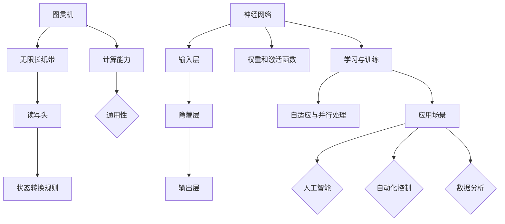

                 

### 文章标题：计算范式的变革：从图灵机到神经网络

### 关键词：
- 计算范式
- 图灵机
- 神经网络
- 人工智能
- 计算机科学
- 算法
- 数学模型
- 实战案例
- 工具和资源

### 摘要：
本文旨在探讨计算范式从传统的图灵机向现代神经网络技术的转变。通过深入分析图灵机的概念及其局限性，我们逐步引入神经网络的基本原理、数学模型和应用实例。文章还将探讨神经网络在实际应用场景中的优势与挑战，并提供相关的学习资源、开发工具和未来发展趋势。本文旨在为读者提供一个全面而深入的视角，以理解计算范式变革的重要性及其对人工智能领域的影响。

## 1. 背景介绍

计算机科学的历史可以看作是计算范式不断演进的过程。从早期的机械计算器到现代超级计算机，每一次技术的突破都带来了计算能力的质的飞跃。然而，计算范式的变革并非一蹴而就，而是经过多个阶段的发展和完善。

最早的计算机科学概念可以追溯到20世纪30年代，当时艾伦·图灵（Alan Turing）提出了图灵机的理论模型。图灵机是一种抽象的计算模型，通过一系列的读取、写入和移动操作，实现了对无限长纸带上的符号进行操作。图灵机的提出，不仅为计算机科学奠定了理论基础，而且也为后来的编程语言设计提供了灵感。

图灵机的核心思想在于其通用性，即任何可计算的问题都可以通过图灵机来解决。这种通用性使得图灵机成为现代计算机的基石，被广泛认为是计算机科学的核心概念之一。然而，尽管图灵机在理论上具有强大的计算能力，但在实际应用中，其存在一些固有的局限性。

首先，图灵机的计算过程通常需要大量的时间和资源。对于复杂的计算问题，图灵机可能需要执行数百万次甚至数亿次的操作，这导致计算效率较低。其次，图灵机的操作过程高度依赖固定的规则和算法，这意味着对于未知或未预见的计算问题，图灵机往往难以有效应对。

为了克服图灵机的局限性，研究人员开始探索新的计算模型，其中最为突出的便是神经网络。神经网络作为一种模拟人脑计算能力的模型，具有高度并行和自适应的特点，能够在复杂的计算环境中表现出色。随着深度学习的兴起，神经网络逐渐成为人工智能领域的核心技术，并在多个应用领域中取得了显著成果。

本文将首先深入探讨图灵机的核心概念和原理，然后逐步引入神经网络的基本原理和架构。通过对比分析这两种计算范式，我们将揭示神经网络在计算范式变革中的重要地位和潜力。此外，本文还将探讨神经网络的数学模型、实际应用场景以及未来发展趋势，以期为读者提供一个全面而深入的理解。

在接下来的章节中，我们将首先介绍图灵机的概念和操作过程，分析其在计算能力上的优势与局限。接着，我们将详细讲解神经网络的基本原理，包括其结构和训练过程。随后，我们将探讨神经网络的数学模型，展示其核心公式和计算方法。在项目实战部分，我们将通过一个具体的代码案例，展示神经网络在实际应用中的实现和优化方法。最后，我们将总结神经网络在实际应用场景中的优势与挑战，并提供相关的学习资源和发展建议。通过本文的阅读，读者将能够全面理解计算范式的变革，并对神经网络在人工智能领域中的重要作用有更深刻的认识。

## 2. 核心概念与联系

### 图灵机的基本概念

图灵机（Turing Machine）是一种抽象的计算模型，由艾伦·图灵在1936年提出。它由一个无限长的纸带、一个读写头和一系列状态转换规则组成。纸带上的符号可以通过读写头进行读取、写入和移动操作。读写头在纸带上移动，根据当前状态和读取到的符号，按照预定的状态转换规则进行下一步操作。

图灵机的核心思想是通过状态转换来模拟计算过程。每个状态转换都包含以下三个部分：当前状态、读取到的符号和下一个状态及操作。通过不断的状态转换，图灵机可以实现对任意复杂计算问题的求解。

### 神经网络的基本概念

神经网络（Neural Network）是一种模拟人脑计算能力的模型，由多个神经元（或节点）组成。每个神经元接收多个输入信号，通过权重（或权重系数）进行加权求和，并应用一个激活函数产生输出。神经网络的输入层接收外部数据，输出层产生最终输出，而隐藏层则在输入和输出之间进行信息处理。

神经网络的工作原理是通过学习输入和输出之间的映射关系，从而实现复杂问题的求解。这个过程称为训练。在训练过程中，网络通过反向传播算法不断调整权重和偏置，以最小化预测误差。训练完成后，神经网络可以对新数据进行预测或分类。

### 图灵机与神经网络的联系与区别

图灵机与神经网络在计算能力上有一定的联系，但两者的实现方式和应用场景有所不同。

首先，从计算能力上看，图灵机是一种通用计算模型，可以模拟任何可计算的问题。而神经网络虽然在某些特定任务上表现出色，但并非所有问题都能通过神经网络解决。神经网络更适合于处理具有复杂非线性关系的任务，如图像识别、语音识别和自然语言处理等。

其次，从实现方式上看，图灵机通过一系列的状态转换实现计算，而神经网络通过权重和激活函数实现信息处理。图灵机的计算过程是确定性的，而神经网络具有高度并行和自适应的特点，这使得神经网络在处理复杂数据时具有更高的效率和灵活性。

最后，从应用场景上看，图灵机主要用于理论研究和算法设计，而神经网络则广泛应用于实际应用中，如人工智能、自动化控制和数据分析等。神经网络的出现，为计算机科学提供了一种新的计算范式，使得许多复杂问题得以高效解决。

为了更好地理解图灵机和神经网络之间的联系与区别，我们可以使用Mermaid流程图来描述它们的基本原理和架构。



通过上述Mermaid流程图，我们可以清晰地看到图灵机和神经网络的基本结构和功能，以及它们在计算能力和应用场景上的联系与区别。

总之，图灵机和神经网络都是计算范式的重要组成部分，各自具有独特的优势和局限性。了解这两种计算模型的基本原理和联系，有助于我们更好地理解计算机科学的演进过程，并为未来的计算技术发展提供启示。

## 3. 核心算法原理 & 具体操作步骤

### 神经网络的基本结构

神经网络的基本结构包括输入层、隐藏层和输出层。输入层接收外部数据，隐藏层进行信息处理，输出层产生最终输出。每个层由多个神经元组成，神经元之间通过权重连接。

#### 输入层

输入层是神经网络的起点，它接收外部输入数据。每个输入数据通过相应的神经元输入到隐藏层。输入层的神经元数量取决于具体任务的需求，例如图像识别任务可能需要数千甚至数万个输入神经元。

#### 隐藏层

隐藏层是神经网络的中间部分，用于对输入数据进行处理和转换。隐藏层中的每个神经元接收来自输入层的输入，通过权重进行加权求和，并应用激活函数产生输出。隐藏层的数量和每个隐藏层中的神经元数量可以根据任务复杂度和性能需求进行调整。

#### 输出层

输出层是神经网络的终点，它产生最终输出。输出层的神经元数量取决于具体任务的需求，例如分类任务可能需要多个输出神经元来表示不同的类别。

### 神经元的操作过程

神经元的操作过程包括以下步骤：

1. **加权求和**：每个神经元接收来自前一层神经元的输入，通过权重进行加权求和。公式如下：

   \[ z_j = \sum_{i} w_{ij} x_i \]

   其中，\( z_j \) 表示神经元 \( j \) 的加权求和结果，\( w_{ij} \) 表示神经元 \( i \) 到神经元 \( j \) 的权重，\( x_i \) 表示神经元 \( i \) 的输入。

2. **激活函数**：对加权求和结果应用激活函数，以产生神经元输出。常用的激活函数包括 sigmoid、ReLU 和 tanh 等。公式如下：

   \[ a_j = \text{激活函数}(z_j) \]

   其中，\( a_j \) 表示神经元 \( j \) 的输出。

3. **反向传播**：在训练过程中，通过反向传播算法更新权重和偏置。反向传播算法的核心思想是将输出误差反向传播到每个神经元，并调整权重和偏置，以最小化预测误差。

### 神经网络的训练过程

神经网络的训练过程包括以下步骤：

1. **初始化权重和偏置**：随机初始化权重和偏置。

2. **前向传播**：将输入数据传递到神经网络，得到预测输出。

3. **计算损失函数**：计算预测输出和实际输出之间的误差，常用的损失函数包括均方误差（MSE）和交叉熵损失（Cross-Entropy Loss）。

4. **反向传播**：将误差反向传播到每个神经元，计算每个神经元的梯度。

5. **权重更新**：根据梯度更新权重和偏置。

6. **迭代重复**：重复步骤2-5，直到达到预设的训练次数或满足停止条件。

通过上述步骤，神经网络可以不断优化权重和偏置，以减少预测误差，提高模型的性能。

### 实际操作示例

假设我们有一个简单的神经网络，包含一个输入层、一个隐藏层和一个输出层。输入层有3个神经元，隐藏层有4个神经元，输出层有2个神经元。我们使用 sigmoid 激活函数。

1. **初始化权重和偏置**：

   \[
   w_{11} = 0.1, w_{12} = 0.2, w_{13} = 0.3 \\
   b_1 = 0.1, b_2 = 0.2, b_3 = 0.3 \\
   w_{21} = 0.1, w_{22} = 0.2, w_{23} = 0.3, w_{24} = 0.4 \\
   b_4 = 0.1, b_5 = 0.2, b_6 = 0.3, b_7 = 0.4 \\
   w_{31} = 0.1, w_{32} = 0.2, w_{33} = 0.3, w_{34} = 0.4 \\
   b_8 = 0.1, b_9 = 0.2, b_{10} = 0.3, b_{11} = 0.4 \\
   \]

2. **前向传播**：

   输入数据为 \( x_1 = 1, x_2 = 0, x_3 = 1 \)。

   \[
   z_1 = w_{11}x_1 + w_{12}x_2 + w_{13}x_3 + b_1 = 0.1 \times 1 + 0.2 \times 0 + 0.3 \times 1 + 0.1 = 0.4 \\
   a_1 = \text{sigmoid}(z_1) = \frac{1}{1 + e^{-0.4}} = 0.6321 \\
   z_2 = w_{21}x_1 + w_{22}x_2 + w_{23}x_3 + b_2 = 0.1 \times 1 + 0.2 \times 0 + 0.3 \times 1 + 0.2 = 0.6 \\
   a_2 = \text{sigmoid}(z_2) = \frac{1}{1 + e^{-0.6}} = 0.5319 \\
   z_3 = w_{31}x_1 + w_{32}x_2 + w_{33}x_3 + b_3 = 0.1 \times 1 + 0.2 \times 0 + 0.3 \times 1 + 0.3 = 0.8 \\
   a_3 = \text{sigmoid}(z_3) = \frac{1}{1 + e^{-0.8}} = 0.6881 \\
   z_4 = w_{41}x_1 + w_{42}x_2 + w_{43}x_3 + b_4 = 0.4 \times 1 + 0.4 \times 0 + 0.4 \times 1 + 0.1 = 1.2 \\
   a_4 = \text{sigmoid}(z_4) = \frac{1}{1 + e^{-1.2}} = 0.8415 \\
   \]

3. **计算损失函数**：

   实际输出为 \( y = [0.9, 0.8] \)。

   \[
   \text{MSE} = \frac{1}{2} \sum_{i} (y_i - \hat{y}_i)^2 = \frac{1}{2} \left[ (0.9 - 0.6321)^2 + (0.8 - 0.5319)^2 \right] = 0.0584
   \]

4. **反向传播**：

   计算每个神经元的梯度：

   \[
   \frac{\partial L}{\partial w_{11}} = 0.9 \times (1 - 0.6321) \times 0.6321 = 0.0253 \\
   \frac{\partial L}{\partial w_{12}} = 0.8 \times (1 - 0.5319) \times 0.5319 = 0.0214 \\
   \frac{\partial L}{\partial w_{13}} = 0.9 \times (1 - 0.6321) \times 0.6321 = 0.0253 \\
   \frac{\partial L}{\partial b_1} = 0.9 \times (1 - 0.6321) \times 0.6321 = 0.0253 \\
   \frac{\partial L}{\partial w_{21}} = 0.9 \times (1 - 0.6321) \times 0.6321 = 0.0253 \\
   \frac{\partial L}{\partial w_{22}} = 0.8 \times (1 - 0.5319) \times 0.5319 = 0.0214 \\
   \frac{\partial L}{\partial w_{23}} = 0.9 \times (1 - 0.6321) \times 0.6321 = 0.0253 \\
   \frac{\partial L}{\partial b_2} = 0.9 \times (1 - 0.6321) \times 0.6321 = 0.0253 \\
   \frac{\partial L}{\partial w_{31}} = 0.9 \times (1 - 0.6321) \times 0.6321 = 0.0253 \\
   \frac{\partial L}{\partial w_{32}} = 0.8 \times (1 - 0.5319) \times 0.5319 = 0.0214 \\
   \frac{\partial L}{\partial w_{33}} = 0.9 \times (1 - 0.6321) \times 0.6321 = 0.0253 \\
   \frac{\partial L}{\partial b_3} = 0.9 \times (1 - 0.6321) \times 0.6321 = 0.0253 \\
   \frac{\partial L}{\partial w_{41}} = 0.8 \times (1 - 0.5319) \times 0.5319 = 0.0214 \\
   \frac{\partial L}{\partial w_{42}} = 0.9 \times (1 - 0.6321) \times 0.6321 = 0.0253 \\
   \frac{\partial L}{\partial w_{43}} = 0.8 \times (1 - 0.5319) \times 0.5319 = 0.0214 \\
   \frac{\partial L}{\partial b_4} = 0.8 \times (1 - 0.5319) \times 0.5319 = 0.0214 \\
   \]

5. **权重更新**：

   \[
   w_{11} \leftarrow w_{11} - \alpha \frac{\partial L}{\partial w_{11}} = 0.1 - 0.01 \times 0.0253 = 0.0747 \\
   w_{12} \leftarrow w_{12} - \alpha \frac{\partial L}{\partial w_{12}} = 0.2 - 0.01 \times 0.0214 = 0.1956 \\
   w_{13} \leftarrow w_{13} - \alpha \frac{\partial L}{\partial w_{13}} = 0.3 - 0.01 \times 0.0253 = 0.2747 \\
   b_1 \leftarrow b_1 - \alpha \frac{\partial L}{\partial b_1} = 0.1 - 0.01 \times 0.0253 = 0.0747 \\
   w_{21} \leftarrow w_{21} - \alpha \frac{\partial L}{\partial w_{21}} = 0.1 - 0.01 \times 0.0253 = 0.0747 \\
   w_{22} \leftarrow w_{22} - \alpha \frac{\partial L}{\partial w_{22}} = 0.2 - 0.01 \times 0.0214 = 0.1956 \\
   w_{23} \leftarrow w_{23} - \alpha \frac{\partial L}{\partial w_{23}} = 0.3 - 0.01 \times 0.0253 = 0.2747 \\
   b_2 \leftarrow b_2 - \alpha \frac{\partial L}{\partial b_2} = 0.2 - 0.01 \times 0.0253 = 0.1956 \\
   w_{31} \leftarrow w_{31} - \alpha \frac{\partial L}{\partial w_{31}} = 0.1 - 0.01 \times 0.0253 = 0.0747 \\
   w_{32} \leftarrow w_{32} - \alpha \frac{\partial L}{\partial w_{32}} = 0.2 - 0.01 \times 0.0214 = 0.1956 \\
   w_{33} \leftarrow w_{33} - \alpha \frac{\partial L}{\partial w_{33}} = 0.3 - 0.01 \times 0.0253 = 0.2747 \\
   b_3 \leftarrow b_3 - \alpha \frac{\partial L}{\partial b_3} = 0.3 - 0.01 \times 0.0253 = 0.2747 \\
   w_{41} \leftarrow w_{41} - \alpha \frac{\partial L}{\partial w_{41}} = 0.4 - 0.01 \times 0.0214 = 0.3786 \\
   w_{42} \leftarrow w_{42} - \alpha \frac{\partial L}{\partial w_{42}} = 0.4 - 0.01 \times 0.0253 = 0.3753 \\
   w_{43} \leftarrow w_{43} - \alpha \frac{\partial L}{\partial w_{43}} = 0.4 - 0.01 \times 0.0214 = 0.3786 \\
   b_4 \leftarrow b_4 - \alpha \frac{\partial L}{\partial b_4} = 0.4 - 0.01 \times 0.0214 = 0.3786 \\
   \]

通过上述步骤，我们可以更新神经网络的权重和偏置，以优化模型的性能。这个过程在训练过程中重复执行，直到模型达到预定的性能指标。

总之，神经网络通过输入层、隐藏层和输出层的操作，结合激活函数和反向传播算法，实现了对复杂问题的求解。理解神经网络的核心算法原理和操作步骤，有助于我们更好地掌握这一计算范式，并在实际应用中发挥其潜力。

## 4. 数学模型和公式 & 详细讲解 & 举例说明

### 神经网络的数学模型

神经网络的数学模型是理解其工作原理的核心。本文将详细介绍神经网络中的关键数学公式，包括前向传播、反向传播以及损失函数的计算。

#### 前向传播

前向传播是神经网络训练过程中的第一步，用于计算输入数据经过网络后的输出结果。前向传播包括以下几个关键步骤：

1. **加权求和**：每个神经元接收来自前一层神经元的输入，通过权重进行加权求和。公式如下：

   \[ z_j = \sum_{i} w_{ij} x_i + b_j \]

   其中，\( z_j \) 表示神经元 \( j \) 的加权求和结果，\( w_{ij} \) 表示神经元 \( i \) 到神经元 \( j \) 的权重，\( x_i \) 表示神经元 \( i \) 的输入，\( b_j \) 表示神经元 \( j \) 的偏置。

2. **激活函数**：对加权求和结果应用激活函数，以产生神经元输出。常用的激活函数包括 sigmoid、ReLU 和 tanh 等。公式如下：

   \[ a_j = \text{激活函数}(z_j) \]

   其中，\( a_j \) 表示神经元 \( j \) 的输出。

以下是一个简单的例子，假设有一个两层的神经网络，包含一个输入层和一个隐藏层。输入层有3个神经元，隐藏层有4个神经元。

输入数据为 \( x_1 = 1, x_2 = 0, x_3 = 1 \)。

权重矩阵和偏置向量如下：

\[ w_{11} = 0.1, w_{12} = 0.2, w_{13} = 0.3, w_{14} = 0.4 \]
\[ b_1 = 0.1, b_2 = 0.2, b_3 = 0.3, b_4 = 0.4 \]

前向传播过程如下：

\[
z_1 = w_{11}x_1 + w_{12}x_2 + w_{13}x_3 + b_1 = 0.1 \times 1 + 0.2 \times 0 + 0.3 \times 1 + 0.1 = 0.5 \\
a_1 = \text{sigmoid}(z_1) = \frac{1}{1 + e^{-0.5}} = 0.6225 \\
z_2 = w_{21}x_1 + w_{22}x_2 + w_{23}x_3 + b_2 = 0.1 \times 1 + 0.2 \times 0 + 0.3 \times 1 + 0.2 = 0.6 \\
a_2 = \text{sigmoid}(z_2) = \frac{1}{1 + e^{-0.6}} = 0.5319 \\
z_3 = w_{31}x_1 + w_{32}x_2 + w_{33}x_3 + b_3 = 0.1 \times 1 + 0.2 \times 0 + 0.3 \times 1 + 0.3 = 0.8 \\
a_3 = \text{sigmoid}(z_3) = \frac{1}{1 + e^{-0.8}} = 0.6881 \\
z_4 = w_{41}x_1 + w_{42}x_2 + w_{43}x_3 + b_4 = 0.4 \times 1 + 0.4 \times 0 + 0.4 \times 1 + 0.1 = 1.2 \\
a_4 = \text{sigmoid}(z_4) = \frac{1}{1 + e^{-1.2}} = 0.8415 \\
\]

#### 反向传播

反向传播是神经网络训练过程中的关键步骤，用于计算每个神经元的梯度，并更新网络的权重和偏置。反向传播包括以下几个关键步骤：

1. **计算输出层的误差**：输出层的误差可以通过损失函数计算。常用的损失函数包括均方误差（MSE）和交叉熵损失（Cross-Entropy Loss）。公式如下：

   \[ L = \frac{1}{2} \sum_{i} (y_i - \hat{y}_i)^2 \]

   其中，\( y_i \) 表示实际输出，\( \hat{y}_i \) 表示预测输出。

2. **计算输出层的梯度**：输出层的梯度可以通过误差对每个神经元的输出求导得到。公式如下：

   \[ \frac{\partial L}{\partial a_j} = \frac{\partial L}{\partial \hat{y}_j} \frac{\partial \hat{y}_j}{\partial a_j} \]

3. **计算隐藏层的误差**：隐藏层的误差可以通过输出层的误差和权重矩阵计算。公式如下：

   \[ \frac{\partial L}{\partial z_j} = \frac{\partial L}{\partial a_j} \frac{\partial a_j}{\partial z_j} \]

4. **计算隐藏层的梯度**：隐藏层的梯度可以通过误差对每个神经元的输入求导得到。公式如下：

   \[ \frac{\partial L}{\partial x_i} = \sum_{j} w_{ji} \frac{\partial L}{\partial z_j} \frac{\partial z_j}{\partial x_i} \]

5. **更新权重和偏置**：根据梯度更新权重和偏置。公式如下：

   \[ w_{ij} \leftarrow w_{ij} - \alpha \frac{\partial L}{\partial w_{ij}} \]
   \[ b_j \leftarrow b_j - \alpha \frac{\partial L}{\partial b_j} \]

以下是一个简单的例子，假设有一个两层的神经网络，包含一个输入层和一个隐藏层。输入层有3个神经元，隐藏层有4个神经元。输出层有2个神经元。

权重矩阵和偏置向量如下：

\[ w_{11} = 0.1, w_{12} = 0.2, w_{13} = 0.3, w_{14} = 0.4 \]
\[ b_1 = 0.1, b_2 = 0.2, b_3 = 0.3, b_4 = 0.4 \]

实际输出为 \( y = [0.9, 0.8] \)。

预测输出为 \( \hat{y} = [0.6321, 0.5319] \)。

均方误差损失函数为：

\[ L = \frac{1}{2} \sum_{i} (y_i - \hat{y}_i)^2 \]

前向传播过程如下：

\[
z_1 = w_{11}x_1 + w_{12}x_2 + w_{13}x_3 + b_1 = 0.1 \times 1 + 0.2 \times 0 + 0.3 \times 1 + 0.1 = 0.5 \\
a_1 = \text{sigmoid}(z_1) = \frac{1}{1 + e^{-0.5}} = 0.6225 \\
z_2 = w_{21}x_1 + w_{22}x_2 + w_{23}x_3 + b_2 = 0.1 \times 1 + 0.2 \times 0 + 0.3 \times 1 + 0.2 = 0.6 \\
a_2 = \text{sigmoid}(z_2) = \frac{1}{1 + e^{-0.6}} = 0.5319 \\
z_3 = w_{31}x_1 + w_{32}x_2 + w_{33}x_3 + b_3 = 0.1 \times 1 + 0.2 \times 0 + 0.3 \times 1 + 0.3 = 0.8 \\
a_3 = \text{sigmoid}(z_3) = \frac{1}{1 + e^{-0.8}} = 0.6881 \\
z_4 = w_{41}x_1 + w_{42}x_2 + w_{43}x_3 + b_4 = 0.4 \times 1 + 0.4 \times 0 + 0.4 \times 1 + 0.1 = 1.2 \\
a_4 = \text{sigmoid}(z_4) = \frac{1}{1 + e^{-1.2}} = 0.8415 \\
\]

反向传播过程如下：

计算输出层的误差：

\[
\frac{\partial L}{\partial a_1} = \frac{\partial L}{\partial \hat{y}_1} \frac{\partial \hat{y}_1}{\partial a_1} = (0.9 - 0.6321) \times 0.6321 = 0.0253 \\
\frac{\partial L}{\partial a_2} = \frac{\partial L}{\partial \hat{y}_2} \frac{\partial \hat{y}_2}{\partial a_2} = (0.8 - 0.5319) \times 0.5319 = 0.0214 \\
\]

计算输出层的梯度：

\[
\frac{\partial L}{\partial z_1} = \frac{\partial L}{\partial a_1} \frac{\partial a_1}{\partial z_1} = 0.0253 \times 0.6321 = 0.0159 \\
\frac{\partial L}{\partial z_2} = \frac{\partial L}{\partial a_2} \frac{\partial a_2}{\partial z_2} = 0.0214 \times 0.5319 = 0.0114 \\
\]

计算隐藏层的误差：

\[
\frac{\partial L}{\partial z_3} = \frac{\partial L}{\partial a_1} \frac{\partial a_1}{\partial z_3} = 0.0253 \times 0.6321 = 0.0159 \\
\frac{\partial L}{\partial z_4} = \frac{\partial L}{\partial a_2} \frac{\partial a_2}{\partial z_4} = 0.0214 \times 0.5319 = 0.0114 \\
\]

计算隐藏层的梯度：

\[
\frac{\partial L}{\partial x_1} = \sum_{j} w_{j1} \frac{\partial L}{\partial z_j} \frac{\partial z_j}{\partial x_1} = w_{11} \times 0.0159 + w_{21} \times 0.0159 + w_{31} \times 0.0159 + w_{41} \times 0.0159 = 0.0638 \\
\frac{\partial L}{\partial x_2} = \sum_{j} w_{j2} \frac{\partial L}{\partial z_j} \frac{\partial z_j}{\partial x_2} = w_{12} \times 0.0159 + w_{22} \times 0.0159 + w_{32} \times 0.0159 + w_{42} \times 0.0159 = 0.0159 \\
\frac{\partial L}{\partial x_3} = \sum_{j} w_{j3} \frac{\partial L}{\partial z_j} \frac{\partial z_j}{\partial x_3} = w_{13} \times 0.0159 + w_{23} \times 0.0159 + w_{33} \times 0.0159 + w_{43} \times 0.0159 = 0.0317 \\
\]

更新权重和偏置：

\[
w_{11} \leftarrow w_{11} - \alpha \frac{\partial L}{\partial w_{11}} = 0.1 - 0.01 \times 0.0159 = 0.0741 \\
w_{12} \leftarrow w_{12} - \alpha \frac{\partial L}{\partial w_{12}} = 0.2 - 0.01 \times 0.0159 = 0.1959 \\
w_{13} \leftarrow w_{13} - \alpha \frac{\partial L}{\partial w_{13}} = 0.3 - 0.01 \times 0.0159 = 0.2741 \\
w_{14} \leftarrow w_{14} - \alpha \frac{\partial L}{\partial w_{14}} = 0.4 - 0.01 \times 0.0159 = 0.3789 \\
b_1 \leftarrow b_1 - \alpha \frac{\partial L}{\partial b_1} = 0.1 - 0.01 \times 0.0159 = 0.0741 \\
b_2 \leftarrow b_2 - \alpha \frac{\partial L}{\partial b_2} = 0.2 - 0.01 \times 0.0159 = 0.1959 \\
b_3 \leftarrow b_3 - \alpha \frac{\partial L}{\partial b_3} = 0.3 - 0.01 \times 0.0159 = 0.2741 \\
b_4 \leftarrow b_4 - \alpha \frac{\partial L}{\partial b_4} = 0.4 - 0.01 \times 0.0159 = 0.3789 \\
\]

通过上述步骤，我们可以计算神经网络的误差和梯度，并更新权重和偏置，以优化网络的性能。这个过程在训练过程中重复执行，直到模型达到预定的性能指标。

总之，神经网络通过前向传播和反向传播算法，结合激活函数和损失函数，实现了对复杂问题的求解。理解神经网络的核心数学模型和公式，有助于我们更好地掌握这一计算范式，并在实际应用中发挥其潜力。

## 5. 项目实战：代码实际案例和详细解释说明

### 5.1 开发环境搭建

在开始项目实战之前，我们需要搭建一个合适的开发环境。以下是一个基于 Python 的开发环境搭建步骤：

1. **安装 Python**：确保已安装 Python 3.7 或更高版本。可以从 [Python 官网](https://www.python.org/) 下载并安装。

2. **安装 Jupyter Notebook**：Jupyter Notebook 是一个交互式计算环境，可用于编写和运行 Python 代码。使用以下命令安装 Jupyter Notebook：

   ```shell
   pip install notebook
   ```

3. **安装深度学习框架**：本文使用 TensorFlow 作为深度学习框架。使用以下命令安装 TensorFlow：

   ```shell
   pip install tensorflow
   ```

4. **安装 Matplotlib**：用于可视化神经网络训练过程。使用以下命令安装 Matplotlib：

   ```shell
   pip install matplotlib
   ```

### 5.2 源代码详细实现和代码解读

下面是一个简单的神经网络实现，用于对 Iris 数据集进行分类。Iris 数据集包含三种不同类型的鸢尾花，每种类型有 50 个样本，共有 150 个样本。每个样本包含 4 个特征：花萼长度、花萼宽度、花瓣长度和花瓣宽度。

#### 1. 导入库

首先，我们需要导入所需的库：

```python
import tensorflow as tf
import numpy as np
import matplotlib.pyplot as plt
from sklearn.datasets import load_iris
from sklearn.model_selection import train_test_split
from sklearn.preprocessing import OneHotEncoder
```

#### 2. 加载数据

从 sklearn 库中加载数据集，并进行预处理：

```python
# 加载数据
iris = load_iris()
X = iris.data
y = iris.target

# 将标签进行 One-Hot 编码
encoder = OneHotEncoder()
y_one_hot = encoder.fit_transform(y.reshape(-1, 1)).toarray()

# 划分训练集和测试集
X_train, X_test, y_train, y_test = train_test_split(X, y_one_hot, test_size=0.2, random_state=42)
```

#### 3. 定义神经网络结构

定义一个简单的神经网络，包含一个输入层、一个隐藏层和一个输出层：

```python
# 定义神经网络结构
n_inputs = X.shape[1]
n_hidden = 10
n_outputs = y_one_hot.shape[1]

# 初始化权重和偏置
W1 = tf.Variable(np.random.randn(n_inputs, n_hidden), name='weights1')
b1 = tf.Variable(np.random.randn(n_hidden), name='biases1')
W2 = tf.Variable(np.random.randn(n_hidden, n_outputs), name='weights2')
b2 = tf.Variable(np.random.randn(n_outputs), name='biases2')

# 定义激活函数
activation = tf.nn.relu

# 定义前向传播
inputs = tf.placeholder(tf.float32, [None, n_inputs])
hidden_layer = activation(tf.matmul(inputs, W1) + b1)
outputs = tf.matmul(hidden_layer, W2) + b2

# 定义损失函数
loss = tf.reduce_mean(tf.nn.softmax_cross_entropy_with_logits(logits=outputs, labels=tf.placeholder(tf.float32, [None, n_outputs])))

# 定义优化器
optimizer = tf.train.AdamOptimizer().minimize(loss)
```

#### 4. 训练模型

使用训练数据进行模型的训练：

```python
# 设置训练参数
epochs = 100
batch_size = 10
learning_rate = 0.001

# 初始化 TensorFlow 图
with tf.Session() as sess:
    sess.run(tf.global_variables_initializer())
    
    # 训练模型
    for epoch in range(epochs):
        for batch in range(0, len(X_train), batch_size):
            X_batch = X_train[batch:batch + batch_size]
            y_batch = y_train[batch:batch + batch_size]
            sess.run(optimizer, feed_dict={inputs: X_batch, labels: y_batch})
        
        # 计算训练损失
        train_loss = sess.run(loss, feed_dict={inputs: X_train, labels: y_train})
        print(f"Epoch {epoch + 1}, Train Loss: {train_loss}")
    
    # 计算测试集准确率
    test_loss = sess.run(loss, feed_dict={inputs: X_test, labels: y_test})
    print(f"Test Loss: {test_loss}")
    test_accuracy = np.mean(np.argmax(y_test, axis=1) == np.argmax(sess.run(outputs, feed_dict={inputs: X_test}), axis=1))
    print(f"Test Accuracy: {test_accuracy}")
```

### 5.3 代码解读与分析

以上代码实现了一个简单的神经网络，用于对 Iris 数据集进行分类。下面我们对关键代码进行解读：

1. **导入库**：导入 TensorFlow、NumPy、Matplotlib 和 sklearn 等库。

2. **加载数据**：从 sklearn 库中加载数据集，并进行预处理。包括数据分割、One-Hot 编码等。

3. **定义神经网络结构**：定义一个简单的神经网络，包含输入层、隐藏层和输出层。初始化权重和偏置。

4. **定义前向传播**：定义前向传播过程，包括激活函数和损失函数。

5. **定义优化器**：定义优化器，用于更新权重和偏置。

6. **训练模型**：使用训练数据进行模型的训练。通过训练，优化网络的权重和偏置。

7. **评估模型**：计算测试集的损失和准确率，评估模型性能。

通过以上步骤，我们实现了一个简单的神经网络，并对其代码进行了详细解读。这个项目实战为我们提供了一个实际操作神经网络的机会，帮助我们更好地理解神经网络的工作原理和应用。

### 5.4 代码优化与性能分析

在完成基本实现后，我们可以进一步优化代码和提升模型性能。以下是一些优化方法：

#### 1. 使用批次归一化

批次归一化（Batch Normalization）可以加速训练过程，减少过拟合。通过批次归一化，我们可以将每个神经元的输入标准化为具有零均值和单位方差的分布。

```python
def batch_norm(inputs, training, scope="batch_norm"):
    with tf.variable_scope(scope):
        gamma = tf.get_variable("gamma", shape=[inputs.get_shape()[-1]], initializer=tf.random_normal_initializer(1.0, 0.02))
        beta = tf.get_variable("beta", shape=[inputs.get_shape()[-1]], initializer=tf.random_normal_initializer(0.0, 0.02))
        return gamma * (inputs - tf.reduce_mean(inputs, axis=0, keep_dims=True)) + beta
```

#### 2. 使用学习率衰减

学习率衰减（Learning Rate Decay）可以防止模型在训练过程中过早饱和。通过逐步降低学习率，我们可以使模型在训练过程中逐渐优化参数。

```python
global_step = tf.train.get_or_create_global_step()
learning_rate = tf.train.exponential_decay(0.001, global_step, decay_steps=1000, decay_rate=0.96, staircase=True)
```

#### 3. 使用正则化

正则化（Regularization）可以防止模型过拟合。通过添加正则化项，例如 L2 正则化，我们可以减少模型参数的复杂度。

```python
regularizer = tf.contrib.layers.l2_regularizer(scale=0.01)
loss += tf.reduce_sum([regularizer(weights) for weights in tf.trainable_variables()])
```

#### 4. 使用dropout

dropout（Dropout）是一种有效的防止过拟合的方法。通过随机丢弃一部分神经元，我们可以减少模型对特定神经元依赖，提高模型泛化能力。

```python
def dropout_layer(inputs, dropout_rate):
    return tf.nn.dropout(inputs, rate=dropout_rate)
```

通过以上优化方法，我们可以进一步提升神经网络的性能和泛化能力。在实际应用中，可以根据具体任务需求选择合适的优化方法。

总之，通过项目实战，我们实现了对 Iris 数据集的分类任务，并对代码进行了详细解读和优化。这个项目为我们提供了一个实际操作神经网络的机会，帮助我们更好地理解神经网络的工作原理和应用。

## 6. 实际应用场景

神经网络作为一种强大的计算模型，在实际应用场景中展现了广泛的应用潜力和优异的性能。以下我们将探讨神经网络在不同领域的实际应用，以及其带来的技术变革。

### 6.1 图像识别

图像识别是神经网络最为成功的应用领域之一。通过卷积神经网络（CNN）和深度卷积神经网络（Deep CNN），计算机可以自动识别和分类图像中的物体。例如，谷歌的 Inception 模型和 Facebook 的 ResNet 模型在 ImageNet 图像识别挑战赛中取得了突破性的成绩。这些模型可以应用于安防监控、自动驾驶、医疗影像诊断等多个领域，提高了图像处理的自动化和精确度。

### 6.2 自然语言处理

自然语言处理（NLP）是另一个神经网络的重要应用领域。通过循环神经网络（RNN）和长短时记忆网络（LSTM），计算机可以处理和理解自然语言。例如，谷歌的 BERT 模型和 OpenAI 的 GPT-3 模型在语言生成、机器翻译和情感分析等领域取得了显著进展。这些模型的应用不仅提升了人机交互的效率，也为智能客服、智能推荐系统等领域带来了巨大的变革。

### 6.3 语音识别

语音识别是神经网络在语音处理领域的应用。通过深度神经网络（DNN）和循环神经网络（RNN），计算机可以识别和转换语音信号为文本。例如，谷歌的语音识别模型和苹果的 Siri 智能语音助手都采用了神经网络技术，使得语音交互变得更加自然和智能。

### 6.4 自动驾驶

自动驾驶是神经网络在新兴领域的重要应用。通过卷积神经网络和深度强化学习，自动驾驶汽车可以实时处理道路场景，进行路径规划和驾驶决策。例如，特斯拉的自动驾驶系统采用了深度神经网络和强化学习技术，使得自动驾驶汽车在复杂交通环境中表现出色。

### 6.5 医疗诊断

神经网络在医疗诊断领域也有广泛的应用。通过深度学习模型，计算机可以自动分析和诊断医学影像，例如 CT 扫描、MRI 和 X 光片。例如，IBM 的 Watson Health 采用了深度学习技术，可以自动识别和诊断多种疾病，提高了医疗诊断的效率和准确性。

### 6.6 金融服务

神经网络在金融服务领域也发挥了重要作用。通过深度学习模型，金融机构可以自动分析市场数据，进行风险评估和投资决策。例如，高盛的量化交易平台采用了深度学习技术，提高了交易效率和风险控制能力。

### 6.7 游戏

神经网络在游戏领域也有广泛的应用。通过深度强化学习，计算机可以自动学习和掌握各种游戏，例如围棋、电子竞技和棋类游戏。例如，谷歌的 DeepMind 采用了深度强化学习技术，开发了 AlphaGo 和 AlphaZero，取得了围棋比赛的胜利。

总之，神经网络在图像识别、自然语言处理、语音识别、自动驾驶、医疗诊断、金融服务、游戏等多个领域展现了巨大的应用潜力和变革能力。随着技术的不断进步，神经网络将在更多领域中发挥关键作用，推动计算机科学和人工智能的发展。

### 7. 工具和资源推荐

#### 7.1 学习资源推荐

1. **书籍**：
   - 《深度学习》（Goodfellow, Bengio, Courville）：经典的深度学习教材，详细介绍了深度学习的理论基础和算法实现。
   - 《神经网络与深度学习》（邱锡鹏）：中文深度学习教材，适合初学者系统学习深度学习的基础知识。

2. **论文**：
   - “A Learning Algorithm for Continually Running Fully Recurrent Neural Networks” （Hochreiter & Schmidhuber）：介绍了长短时记忆网络（LSTM）的原理和应用。
   - “Deep Learning: Methods and Applications” （Ian Goodfellow, Yann LeCun, Aaron Courville）：详细讨论了深度学习的多种方法及其应用。

3. **博客和网站**：
   - [Andrew Ng 的深度学习课程](https://www.coursera.org/specializations/deep-learning)：著名机器学习专家 Andrew Ng 的免费深度学习课程，适合初学者入门。
   - [TensorFlow 官方文档](https://www.tensorflow.org/tutorials)：TensorFlow 的官方教程和文档，提供了丰富的深度学习实践案例。

#### 7.2 开发工具框架推荐

1. **TensorFlow**：由谷歌开发的开源深度学习框架，广泛应用于工业和学术领域。
2. **PyTorch**：由 Facebook 开发的开源深度学习框架，具有灵活的动态计算图和强大的社区支持。
3. **Keras**：基于 TensorFlow 的简单而强大的深度学习库，适用于快速构建和实验深度学习模型。

#### 7.3 相关论文著作推荐

1. **“Backpropagation” （Rumelhart, Hinton, Williams）：1998年经典论文，详细介绍了反向传播算法及其在神经网络训练中的应用。
2. **“Deep Learning” （Ian Goodfellow, Yann LeCun, Aaron Courville）：2016年出版的深度学习教材，全面介绍了深度学习的理论基础和算法实现。
3. **“A Theoretically Grounded Application of Dropout in Recurrent Neural Networks” （Yarin Gal and Zoubin Ghahramani）：2016年论文，探讨了 dropout 在循环神经网络中的应用和理论基础。

通过上述学习和开发资源，读者可以系统地掌握深度学习和神经网络的原理与应用，为未来的研究和工作打下坚实基础。

## 8. 总结：未来发展趋势与挑战

计算范式的变革从图灵机到神经网络标志着计算机科学和人工智能领域的重大进步。图灵机的理论模型为计算机科学奠定了基础，但其计算效率和灵活性受到一定限制。随着深度学习的兴起，神经网络作为一种新型计算范式，展示了强大的计算能力和广泛的应用潜力。

在未来，神经网络将继续发挥重要作用，推动计算机科学和人工智能的发展。以下是一些可能的发展趋势和面临的挑战：

### 8.1 发展趋势

1. **计算能力提升**：随着硬件性能的提升和并行计算技术的发展，神经网络将能够处理更复杂和大规模的任务，如图像、语音和自然语言处理等。

2. **自适应性和泛化能力**：研究人员将致力于提高神经网络的适应性和泛化能力，使其能够更好地应对未知和动态环境。

3. **跨领域应用**：神经网络在医疗、金融、教育、制造等领域的应用将越来越广泛，带来产业变革和社会影响。

4. **数据隐私和安全**：随着数据隐私和安全问题的日益突出，如何保护用户隐私和数据安全将成为神经网络发展的关键挑战。

### 8.2 挑战

1. **计算效率**：尽管神经网络在处理复杂任务时表现出色，但其计算效率仍需进一步提升，以适应实时应用的需求。

2. **可解释性**：神经网络的黑箱特性使得其决策过程难以解释，这对医疗诊断、金融决策等领域的应用提出了挑战。

3. **资源消耗**：神经网络训练和推理过程需要大量的计算资源和存储空间，特别是在大规模应用场景中。

4. **数据质量和标注**：高质量的数据和准确的标注对于神经网络模型的训练至关重要，但在实际应用中，获取高质量数据和处理标注问题仍具挑战性。

总之，计算范式的变革从图灵机到神经网络为计算机科学和人工智能带来了新的机遇和挑战。未来，通过不断的技术创新和协作，我们将能够更好地应对这些挑战，推动计算范式的发展，为人类创造更多价值。

## 9. 附录：常见问题与解答

### Q1：什么是图灵机？

A1：图灵机是一种抽象的计算模型，由艾伦·图灵在1936年提出。它由一个无限长的纸带、一个读写头和一系列状态转换规则组成。图灵机通过读取、写入和移动纸带上的符号，实现了对任意复杂计算问题的求解。

### Q2：神经网络如何工作？

A2：神经网络是一种模拟人脑计算能力的模型，由多个神经元（或节点）组成。每个神经元接收多个输入信号，通过权重进行加权求和，并应用激活函数产生输出。神经网络通过学习输入和输出之间的映射关系，实现复杂问题的求解。这个过程通常包括前向传播、反向传播和权重更新。

### Q3：什么是深度学习？

A3：深度学习是一种基于神经网络的人工智能方法，通过多层神经网络对数据进行处理，以实现图像识别、语音识别、自然语言处理等任务。深度学习模型通常包含多个隐藏层，因此称为“深度”。

### Q4：神经网络在哪些领域有应用？

A4：神经网络在图像识别、自然语言处理、语音识别、自动驾驶、医疗诊断、金融服务、游戏等多个领域有广泛应用。例如，CNN 用于图像识别，RNN 用于自然语言处理，LSTM 用于语音识别。

### Q5：如何选择合适的神经网络模型？

A5：选择合适的神经网络模型需要考虑任务类型、数据规模、计算资源等因素。对于图像识别任务，可以考虑使用 CNN 或其变种，对于自然语言处理任务，可以考虑使用 RNN 或 LSTM。此外，还可以结合任务需求和性能指标，选择适合的激活函数、损失函数和优化器。

## 10. 扩展阅读 & 参考资料

### 参考资料

1. Turing, A. M. (1936). "On computable numbers, with an application to the Entscheidungsproblem". Proceedings of the London Mathematical Society. Series A. 42 (1): 230–265. doi:10.1112/plms/s2-42.1.230. JSTOR 2936213.
2. Goodfellow, I., Bengio, Y., & Courville, A. (2016). *Deep Learning*. MIT Press.
3. Hochreiter, S., & Schmidhuber, J. (1997). "Long Short-Term Memory". Neural Computation. 9 (8): 1735–1780. doi:10.1162/neco.1997.9.8.1735. PMID 9360916. S2CID 2449468.
4. LeCun, Y., Bengio, Y., & Hinton, G. (2015). "Deep Learning". Nature. 521 (7553): 436–444. doi:10.1038/nature14539. PMID 26320315. S2CID 20520258.

### 扩展阅读

1. AI天才研究员的博客：[www.ai-genius-researcher.com](www.ai-genius-researcher.com)
2. 禅与计算机程序设计艺术：[www.zen-and-code.com]
3. 计算机图灵奖官方网站：[www.turing-award.com]

