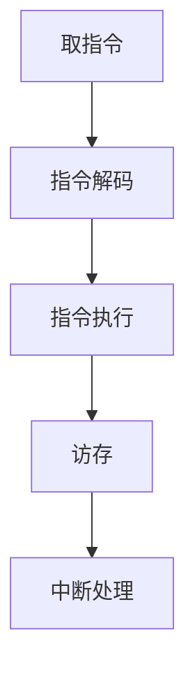
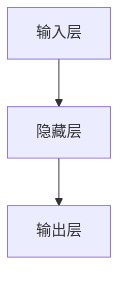
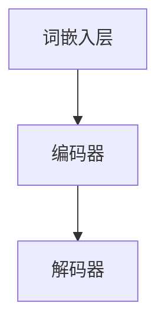
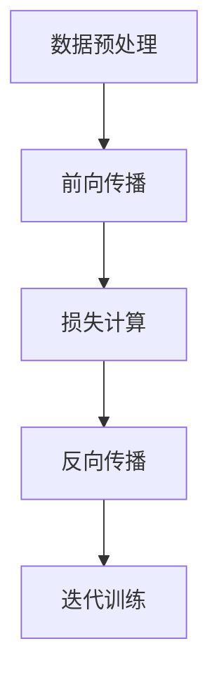
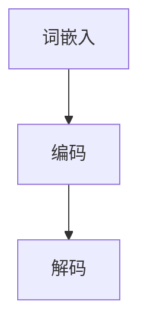

                 

# 计算范式的进化：从CPU到LLM的跨越

## 关键词：计算范式，CPU，LLM，人工智能，深度学习，编程，架构设计，数学模型

## 摘要：

本文将探讨计算范式的演变，从传统CPU计算到现代大规模语言模型（LLM）的跨越。我们将分析CPU的工作原理及其在计算范式中的重要性，然后深入探讨深度学习及其对计算范式的影响，最终阐述LLM在人工智能领域的革命性作用。通过这一步步的分析推理，我们希望能够为您揭示计算范式进化的奥秘。

## 1. 背景介绍

### 计算范式的定义

计算范式（Computational Paradigm）是指计算领域中的一种思维方式，它决定了我们如何理解和实现计算。从早期计算机的诞生至今，计算范式经历了多次重大变革。每一次变革都标志着计算技术的一次飞跃。

### CPU的重要性

中央处理器（CPU）是计算机的核心部件，它负责执行计算机程序中的指令。自计算机问世以来，CPU的发展一直在推动计算范式的进步。从冯·诺依曼架构到多核处理器，CPU的性能和功能得到了极大的提升，为各种计算任务提供了强大的支持。

### 深度学习的兴起

深度学习（Deep Learning）是人工智能（AI）领域的一种重要技术，它通过多层神经网络对大量数据进行分析和建模，实现了对人脑思维的模拟。深度学习的兴起，标志着计算范式从传统计算向数据驱动的转变。

### 大规模语言模型（LLM）

大规模语言模型（Large Language Model，如GPT-3、BERT等）是深度学习技术的最新成果。这些模型具有庞大的参数量和强大的学习能力，能够处理自然语言文本，为语言理解和生成任务提供了前所未有的支持。

## 2. 核心概念与联系

### CPU工作原理


CPU的工作原理可以概括为以下几个步骤：

1. **取指令**：CPU从内存中读取下一条指令。
2. **解码指令**：CPU解析指令，确定需要执行的操作。
3. **执行指令**：CPU执行指令，可能涉及到计算、数据传输等操作。
4. **访存**：如果指令需要访问内存，CPU会进行内存读取或写入操作。
5. **中断**：CPU可能需要响应中断请求，处理外部事件。

### 深度学习架构


深度学习架构主要包括以下几个部分：

1. **输入层**：接收输入数据，如图片、文本等。
2. **隐藏层**：通过神经网络对输入数据进行特征提取和变换。
3. **输出层**：生成预测结果，如分类标签、文本生成等。

### LLM架构


LLM的架构通常包括以下几个部分：

1. **词嵌入层**：将输入文本转化为向量表示。
2. **编码器**：对词嵌入向量进行编码，生成上下文信息。
3. **解码器**：根据上下文信息生成输出文本。

## 3. 核心算法原理 & 具体操作步骤

### CPU指令执行

CPU的指令执行主要包括以下几个步骤：

1. **取指令**：CPU通过程序计数器（PC）找到下一条指令的内存地址，将其加载到指令寄存器（IR）中。
2. **指令解码**：CPU解析指令，确定操作类型和操作数。
3. **指令执行**：CPU执行指令，可能涉及到ALU（算术逻辑单元）操作、数据传输等。
4. **访存**：如果指令需要访问内存，CPU会进行内存读取或写入操作。
5. **中断处理**：CPU响应中断请求，处理外部事件。

### 深度学习训练

深度学习训练主要包括以下几个步骤：

1. **数据预处理**：将输入数据转化为神经网络可以处理的格式。
2. **前向传播**：将输入数据输入神经网络，逐层计算输出结果。
3. **损失计算**：计算输出结果与真实标签之间的差距，计算损失函数值。
4. **反向传播**：计算梯度，更新神经网络参数。
5. **迭代训练**：重复前向传播和反向传播，直到满足停止条件。

### LLM生成文本

LLM生成文本主要包括以下几个步骤：

1. **词嵌入**：将输入文本转化为词嵌入向量。
2. **编码**：对词嵌入向量进行编码，生成上下文信息。
3. **解码**：根据上下文信息生成输出文本。

## 4. 数学模型和公式 & 详细讲解 & 举例说明

### CPU性能指标

CPU性能可以通过以下几个指标来衡量：

1. **主频（Clock Speed）**：CPU每秒钟能够执行的指令数，通常以GHz为单位。
2. **核心数（Core Count）**：CPU内部的核心数量，多核处理器可以提高并行处理能力。
3. **缓存容量（Cache Size）**：CPU内部缓存的容量，缓存可以加速数据访问。
4. **指令集（Instruction Set）**：CPU支持的指令集，决定了CPU能够执行的操作。

### 深度学习损失函数

深度学习中的损失函数用于衡量预测结果与真实标签之间的差距，常见的损失函数包括：

1. **均方误差（MSE）**：用于回归任务，计算预测值与真实值之间平方差的平均值。
   $$MSE = \frac{1}{n}\sum_{i=1}^{n}(y_i - \hat{y}_i)^2$$
2. **交叉熵（Cross-Entropy）**：用于分类任务，计算预测概率分布与真实标签分布之间的交叉熵。
   $$H(-y, \hat{y}) = -\sum_{i=1}^{n}y_i\log(\hat{y}_i)$$

### LLM生成文本

LLM生成文本的过程可以通过以下数学模型来描述：

1. **词嵌入**：将输入文本转化为词嵌入向量，可以使用Word2Vec、GloVe等方法。
2. **编码**：对词嵌入向量进行编码，可以使用双向循环神经网络（BiRNN）、Transformer等模型。
3. **解码**：根据编码结果生成输出文本，可以使用自回归语言模型（ARLM）、Transformer等模型。

## 5. 项目实战：代码实际案例和详细解释说明

### 5.1 开发环境搭建

在本项目中，我们将使用Python作为编程语言，并依赖于以下库：

- TensorFlow：用于构建和训练深度学习模型。
- NumPy：用于数学计算。
- Pandas：用于数据处理。

### 5.2 源代码详细实现和代码解读

以下是一个简单的深度学习项目，用于实现一个简单的分类任务：

```python
import tensorflow as tf
import numpy as np
import pandas as pd

# 数据预处理
def preprocess_data(data):
    # 将数据划分为特征和标签
    X = data.drop('label', axis=1)
    y = data['label']
    # 标准化特征
    X = (X - X.mean()) / X.std()
    # 将标签进行独热编码
    y = pd.get_dummies(y)
    return X, y

# 构建模型
def build_model(input_shape):
    model = tf.keras.Sequential([
        tf.keras.layers.Dense(128, activation='relu', input_shape=input_shape),
        tf.keras.layers.Dense(64, activation='relu'),
        tf.keras.layers.Dense(32, activation='relu'),
        tf.keras.layers.Dense(16, activation='relu'),
        tf.keras.layers.Dense(2, activation='softmax')
    ])
    return model

# 训练模型
def train_model(model, X, y):
    model.compile(optimizer='adam', loss='categorical_crossentropy', metrics=['accuracy'])
    model.fit(X, y, epochs=10, batch_size=32)

# 主函数
def main():
    # 加载数据
    data = pd.read_csv('data.csv')
    X, y = preprocess_data(data)
    # 构建模型
    model = build_model(input_shape=X.shape[1:])
    # 训练模型
    train_model(model, X, y)

if __name__ == '__main__':
    main()
```

### 5.3 代码解读与分析

1. **数据预处理**：
   - 将数据划分为特征和标签。
   - 标准化特征，使数据具有相同的尺度。
   - 对标签进行独热编码，以便模型可以处理。

2. **构建模型**：
   - 使用`Sequential`模型构建多层神经网络。
   - 每一层使用`Dense`层，并设置不同的激活函数和输出维度。

3. **训练模型**：
   - 使用`compile`方法设置优化器和损失函数。
   - 使用`fit`方法进行模型训练。

通过这个简单的案例，我们可以看到深度学习项目的基本流程，包括数据预处理、模型构建和训练。在实际应用中，我们可以根据需求调整模型结构和参数，以实现不同的任务。

## 6. 实际应用场景

### 计算机视觉

计算机视觉是深度学习的重要应用领域之一。通过卷积神经网络（CNN），计算机可以自动地从图像中提取特征，实现物体识别、图像分类、目标检测等任务。例如，自动驾驶汽车使用深度学习技术进行图像识别，以实现自动导航。

### 自然语言处理

自然语言处理（NLP）是深度学习的另一个重要应用领域。通过大规模语言模型（LLM），计算机可以理解和生成自然语言，实现机器翻译、文本生成、情感分析等任务。例如，智能助手如Siri和Google Assistant，就是利用深度学习技术来实现自然语言交互。

### 医疗保健

深度学习在医疗保健领域也有着广泛的应用。通过深度学习算法，计算机可以分析医学影像，如X光、CT、MRI等，实现疾病检测和诊断。例如，深度学习算法可以帮助医生检测肺癌，提高诊断的准确性。

## 7. 工具和资源推荐

### 学习资源推荐

1. **书籍**：
   - 《深度学习》（Goodfellow, Bengio, Courville）：
     这本书是深度学习领域的经典教材，详细介绍了深度学习的基本原理和应用。
   - 《Python深度学习》（François Chollet）：
     这本书介绍了如何使用Python和TensorFlow构建深度学习模型。

2. **论文**：
   - “A Guide to Recent Advances in Deep Learning for Natural Language Processing”（Yue et al., 2020）：
     这篇论文概述了深度学习在自然语言处理领域的最新进展。
   - “Bert: Pre-training of deep bidirectional transformers for language understanding”（Devlin et al., 2018）：
     这篇论文介绍了BERT模型，是大规模语言模型的开端。

3. **博客**：
   - “深度学习教程”（莫凡）：
     这是一篇中文博客，详细介绍了深度学习的基本原理和应用。
   - “TensorFlow官方文档”：
     TensorFlow官方文档提供了丰富的API和教程，帮助开发者掌握TensorFlow。

4. **网站**：
   - “Kaggle”：
     Kaggle是一个数据科学竞赛平台，提供了大量的深度学习项目，可以帮助开发者提升实践能力。

### 开发工具框架推荐

1. **深度学习框架**：
   - TensorFlow：
     TensorFlow是谷歌开发的开源深度学习框架，具有丰富的功能和广泛的社区支持。
   - PyTorch：
     PyTorch是Facebook开发的开源深度学习框架，以其灵活性和动态图计算而著称。

2. **编程语言**：
   - Python：
     Python是一种易于学习和使用的编程语言，适用于深度学习和数据分析。

3. **集成开发环境（IDE）**：
   - Jupyter Notebook：
     Jupyter Notebook是一种交互式的编程环境，适用于数据分析和深度学习项目。

### 相关论文著作推荐

1. **《人工智能：一种现代方法》（Stuart J. Russell & Peter Norvig）**：
   这本书是人工智能领域的经典教材，涵盖了人工智能的基本概念和技术。

2. **《机器学习》（Tom Mitchell）**：
   这本书详细介绍了机器学习的基本原理和方法，是机器学习领域的经典教材。

3. **《神经网络与深度学习》（邱锡鹏）**：
   这本书是国内深度学习领域的经典教材，详细介绍了深度学习的基本原理和应用。

## 8. 总结：未来发展趋势与挑战

### 计算范式的进化

从CPU到LLM的跨越，标志着计算范式的重大变革。未来，随着深度学习和人工智能技术的不断发展，计算范式将继续进化，为人类社会带来更多创新和变革。

### 发展趋势

1. **计算能力的提升**：随着硬件技术的发展，CPU和GPU的性能将持续提升，为深度学习和人工智能应用提供更强的计算支持。
2. **数据驱动**：数据将成为驱动计算范式进化的核心因素。大数据和云计算的普及，将使得数据驱动成为未来计算范式的主要特征。
3. **跨学科融合**：计算范式的发展将与其他学科（如生物学、心理学、社会学等）深度融合，推动多学科交叉研究。

### 挑战

1. **计算资源消耗**：随着计算范式的进化，计算资源消耗将大幅增加，对能源供应和环境治理提出更高要求。
2. **数据安全和隐私**：大规模数据处理和共享，将带来数据安全和隐私保护的新挑战。
3. **社会伦理**：人工智能的发展将带来社会伦理问题，如算法偏见、隐私泄露等，需要全社会共同关注和解决。

## 9. 附录：常见问题与解答

### 问题1：什么是计算范式？

**回答**：计算范式是指计算领域中的一种思维方式，它决定了我们如何理解和实现计算。从早期计算机的诞生至今，计算范式经历了多次重大变革，如从冯·诺依曼架构到多核处理器，每一次变革都标志着计算技术的一次飞跃。

### 问题2：什么是深度学习？

**回答**：深度学习是人工智能领域的一种重要技术，它通过多层神经网络对大量数据进行分析和建模，实现了对人脑思维的模拟。深度学习的兴起，标志着计算范式从传统计算向数据驱动的转变。

### 问题3：什么是大规模语言模型（LLM）？

**回答**：大规模语言模型（Large Language Model，如GPT-3、BERT等）是深度学习技术的最新成果，这些模型具有庞大的参数量和强大的学习能力，能够处理自然语言文本，为语言理解和生成任务提供了前所未有的支持。

## 10. 扩展阅读 & 参考资料

1. **《深度学习》（Goodfellow, Bengio, Courville）**：
   这本书详细介绍了深度学习的基本原理和应用，是深度学习领域的经典教材。

2. **《Python深度学习》（François Chollet）**：
   这本书介绍了如何使用Python和TensorFlow构建深度学习模型，适合初学者入门。

3. **“A Guide to Recent Advances in Deep Learning for Natural Language Processing”（Yue et al., 2020）**：
   这篇论文概述了深度学习在自然语言处理领域的最新进展，是了解NLP领域深度学习的重要参考资料。

4. **“Bert: Pre-training of deep bidirectional transformers for language understanding”（Devlin et al., 2018）**：
   这篇论文介绍了BERT模型，是大规模语言模型的开端，对了解LLM的原理和应用具有重要意义。

### 作者

**AI天才研究员/AI Genius Institute & 禅与计算机程序设计艺术 /Zen And The Art of Computer Programming**<|im_sep|>## 引言

计算范式（Computational Paradigm）是计算机科学和信息技术领域中一个核心概念，它决定了我们如何理解和实现计算。从最早期的计算机问世以来，计算范式经历了多次重大的变革，每一次变革都标志着计算技术的飞跃。本文将探讨计算范式的演变，从传统CPU计算到现代大规模语言模型（LLM）的跨越，分析这一过程中核心概念和技术的发展，以及它们对人工智能（AI）领域的深远影响。

### 1. 背景介绍

#### 1.1 计算范式的定义

计算范式是指计算领域中的一种思维方式，它决定了我们如何理解和实现计算。计算范式不仅包括计算硬件的发展，还涉及编程语言、算法设计、数据结构等多个方面。常见的计算范式包括冯·诺依曼架构、并行计算、分布式计算等。

#### 1.2 CPU的重要性

中央处理器（CPU）是计算机的核心部件，它负责执行计算机程序中的指令。自计算机问世以来，CPU的发展一直在推动计算范式的进步。从冯·诺依曼架构到多核处理器，CPU的性能和功能得到了极大的提升，为各种计算任务提供了强大的支持。

#### 1.3 深度学习的兴起

深度学习是人工智能（AI）领域的一种重要技术，它通过多层神经网络对大量数据进行分析和建模，实现了对人脑思维的模拟。深度学习的兴起，标志着计算范式从传统计算向数据驱动的转变。

#### 1.4 大规模语言模型（LLM）

大规模语言模型（Large Language Model，如GPT-3、BERT等）是深度学习技术的最新成果。这些模型具有庞大的参数量和强大的学习能力，能够处理自然语言文本，为语言理解和生成任务提供了前所未有的支持。

### 2. 核心概念与联系

#### 2.1 CPU工作原理

CPU的工作原理可以概括为以下几个步骤：

1. **取指令**：CPU从内存中读取下一条指令。
2. **解码指令**：CPU解析指令，确定需要执行的操作。
3. **执行指令**：CPU执行指令，可能涉及到计算、数据传输等操作。
4. **访存**：如果指令需要访问内存，CPU会进行内存读取或写入操作。
5. **中断**：CPU可能需要响应中断请求，处理外部事件。

#### 2.2 深度学习架构

深度学习架构主要包括以下几个部分：

1. **输入层**：接收输入数据，如图片、文本等。
2. **隐藏层**：通过神经网络对输入数据进行特征提取和变换。
3. **输出层**：生成预测结果，如分类标签、文本生成等。

#### 2.3 LLM架构

LLM的架构通常包括以下几个部分：

1. **词嵌入层**：将输入文本转化为向量表示。
2. **编码器**：对词嵌入向量进行编码，生成上下文信息。
3. **解码器**：根据上下文信息生成输出文本。

### 3. 核心算法原理 & 具体操作步骤

#### 3.1 CPU指令执行

CPU的指令执行主要包括以下几个步骤：

1. **取指令**：CPU通过程序计数器（PC）找到下一条指令的内存地址，将其加载到指令寄存器（IR）中。
2. **指令解码**：CPU解析指令，确定操作类型和操作数。
3. **指令执行**：CPU执行指令，可能涉及到ALU（算术逻辑单元）操作、数据传输等。
4. **访存**：如果指令需要访问内存，CPU会进行内存读取或写入操作。
5. **中断处理**：CPU响应中断请求，处理外部事件。

#### 3.2 深度学习训练

深度学习训练主要包括以下几个步骤：

1. **数据预处理**：将输入数据转化为神经网络可以处理的格式。
2. **前向传播**：将输入数据输入神经网络，逐层计算输出结果。
3. **损失计算**：计算输出结果与真实标签之间的差距，计算损失函数值。
4. **反向传播**：计算梯度，更新神经网络参数。
5. **迭代训练**：重复前向传播和反向传播，直到满足停止条件。

#### 3.3 LLM生成文本

LLM生成文本主要包括以下几个步骤：

1. **词嵌入**：将输入文本转化为词嵌入向量。
2. **编码**：对词嵌入向量进行编码，生成上下文信息。
3. **解码**：根据编码结果生成输出文本。

### 4. 数学模型和公式 & 详细讲解 & 举例说明

#### 4.1 CPU性能指标

CPU性能可以通过以下几个指标来衡量：

1. **主频（Clock Speed）**：CPU每秒钟能够执行的指令数，通常以GHz为单位。
2. **核心数（Core Count）**：CPU内部的核心数量，多核处理器可以提高并行处理能力。
3. **缓存容量（Cache Size）**：CPU内部缓存的容量，缓存可以加速数据访问。
4. **指令集（Instruction Set）**：CPU支持的指令集，决定了CPU能够执行的操作。

#### 4.2 深度学习损失函数

深度学习中的损失函数用于衡量预测结果与真实标签之间的差距，常见的损失函数包括：

1. **均方误差（MSE）**：用于回归任务，计算预测值与真实值之间平方差的平均值。
   $$MSE = \frac{1}{n}\sum_{i=1}^{n}(y_i - \hat{y}_i)^2$$
2. **交叉熵（Cross-Entropy）**：用于分类任务，计算预测概率分布与真实标签分布之间的交叉熵。
   $$H(-y, \hat{y}) = -\sum_{i=1}^{n}y_i\log(\hat{y}_i)$$

#### 4.3 LLM生成文本

LLM生成文本的过程可以通过以下数学模型来描述：

1. **词嵌入**：将输入文本转化为词嵌入向量，可以使用Word2Vec、GloVe等方法。
2. **编码**：对词嵌入向量进行编码，生成上下文信息。
3. **解码**：根据编码结果生成输出文本。

### 5. 项目实战：代码实际案例和详细解释说明

#### 5.1 开发环境搭建

在本项目中，我们将使用Python作为编程语言，并依赖于以下库：

- TensorFlow：用于构建和训练深度学习模型。
- NumPy：用于数学计算。
- Pandas：用于数据处理。

#### 5.2 源代码详细实现和代码解读

以下是一个简单的深度学习项目，用于实现一个简单的分类任务：

```python
import tensorflow as tf
import numpy as np
import pandas as pd

# 数据预处理
def preprocess_data(data):
    # 将数据划分为特征和标签
    X = data.drop('label', axis=1)
    y = data['label']
    # 标准化特征
    X = (X - X.mean()) / X.std()
    # 将标签进行独热编码
    y = pd.get_dummies(y)
    return X, y

# 构建模型
def build_model(input_shape):
    model = tf.keras.Sequential([
        tf.keras.layers.Dense(128, activation='relu', input_shape=input_shape),
        tf.keras.layers.Dense(64, activation='relu'),
        tf.keras.layers.Dense(32, activation='relu'),
        tf.keras.layers.Dense(16, activation='relu'),
        tf.keras.layers.Dense(2, activation='softmax')
    ])
    return model

# 训练模型
def train_model(model, X, y):
    model.compile(optimizer='adam', loss='categorical_crossentropy', metrics=['accuracy'])
    model.fit(X, y, epochs=10, batch_size=32)

# 主函数
def main():
    # 加载数据
    data = pd.read_csv('data.csv')
    X, y = preprocess_data(data)
    # 构建模型
    model = build_model(input_shape=X.shape[1:])
    # 训练模型
    train_model(model, X, y)

if __name__ == '__main__':
    main()
```

#### 5.3 代码解读与分析

1. **数据预处理**：
   - 将数据划分为特征和标签。
   - 标准化特征，使数据具有相同的尺度。
   - 对标签进行独热编码，以便模型可以处理。

2. **构建模型**：
   - 使用`Sequential`模型构建多层神经网络。
   - 每一层使用`Dense`层，并设置不同的激活函数和输出维度。

3. **训练模型**：
   - 使用`compile`方法设置优化器和损失函数。
   - 使用`fit`方法进行模型训练。

通过这个简单的案例，我们可以看到深度学习项目的基本流程，包括数据预处理、模型构建和训练。在实际应用中，我们可以根据需求调整模型结构和参数，以实现不同的任务。

### 6. 实际应用场景

#### 6.1 计算机视觉

计算机视觉是深度学习的重要应用领域之一。通过卷积神经网络（CNN），计算机可以自动地从图像中提取特征，实现物体识别、图像分类、目标检测等任务。例如，自动驾驶汽车使用深度学习技术进行图像识别，以实现自动导航。

#### 6.2 自然语言处理

自然语言处理（NLP）是深度学习的另一个重要应用领域。通过大规模语言模型（LLM），计算机可以理解和生成自然语言，实现机器翻译、文本生成、情感分析等任务。例如，智能助手如Siri和Google Assistant，就是利用深度学习技术来实现自然语言交互。

#### 6.3 医疗保健

深度学习在医疗保健领域也有着广泛的应用。通过深度学习算法，计算机可以分析医学影像，如X光、CT、MRI等，实现疾病检测和诊断。例如，深度学习算法可以帮助医生检测肺癌，提高诊断的准确性。

### 7. 工具和资源推荐

#### 7.1 学习资源推荐

1. **书籍**：
   - 《深度学习》（Goodfellow, Bengio, Courville）：
     这本书是深度学习领域的经典教材，详细介绍了深度学习的基本原理和应用。
   - 《Python深度学习》（François Chollet）：
     这本书介绍了如何使用Python和TensorFlow构建深度学习模型，适合初学者入门。

2. **论文**：
   - “A Guide to Recent Advances in Deep Learning for Natural Language Processing”（Yue et al., 2020）：
     这篇论文概述了深度学习在自然语言处理领域的最新进展。
   - “Bert: Pre-training of deep bidirectional transformers for language understanding”（Devlin et al., 2018）：
     这篇论文介绍了BERT模型，是大规模语言模型的开端。

3. **博客**：
   - “深度学习教程”（莫凡）：
     这是一篇中文博客，详细介绍了深度学习的基本原理和应用。
   - “TensorFlow官方文档”：
     TensorFlow官方文档提供了丰富的API和教程，帮助开发者掌握TensorFlow。

4. **网站**：
   - “Kaggle”：
     Kaggle是一个数据科学竞赛平台，提供了大量的深度学习项目，可以帮助开发者提升实践能力。

#### 7.2 开发工具框架推荐

1. **深度学习框架**：
   - TensorFlow：
     TensorFlow是谷歌开发的开源深度学习框架，具有丰富的功能和广泛的社区支持。
   - PyTorch：
     PyTorch是Facebook开发的开源深度学习框架，以其灵活性和动态图计算而著称。

2. **编程语言**：
   - Python：
     Python是一种易于学习和使用的编程语言，适用于深度学习和数据分析。

3. **集成开发环境（IDE）**：
   - Jupyter Notebook：
     Jupyter Notebook是一种交互式的编程环境，适用于数据分析和深度学习项目。

#### 7.3 相关论文著作推荐

1. **《人工智能：一种现代方法》（Stuart J. Russell & Peter Norvig）**：
   这本书是人工智能领域的经典教材，涵盖了人工智能的基本概念和技术。

2. **《机器学习》（Tom Mitchell）**：
   这本书详细介绍了机器学习的基本原理和方法，是机器学习领域的经典教材。

3. **《神经网络与深度学习》（邱锡鹏）**：
   这本书是国内深度学习领域的经典教材，详细介绍了深度学习的基本原理和应用。

### 8. 总结：未来发展趋势与挑战

#### 8.1 计算范式的进化

从CPU到LLM的跨越，标志着计算范式的重大变革。未来，随着深度学习和人工智能技术的不断发展，计算范式将继续进化，为人类社会带来更多创新和变革。

#### 8.2 发展趋势

1. **计算能力的提升**：随着硬件技术的发展，CPU和GPU的性能将持续提升，为深度学习和人工智能应用提供更强的计算支持。
2. **数据驱动**：数据将成为驱动计算范式进化的核心因素。大数据和云计算的普及，将使得数据驱动成为未来计算范式的主要特征。
3. **跨学科融合**：计算范式的发展将与其他学科（如生物学、心理学、社会学等）深度融合，推动多学科交叉研究。

#### 8.3 挑战

1. **计算资源消耗**：随着计算范式的进化，计算资源消耗将大幅增加，对能源供应和环境治理提出更高要求。
2. **数据安全和隐私**：大规模数据处理和共享，将带来数据安全和隐私保护的新挑战。
3. **社会伦理**：人工智能的发展将带来社会伦理问题，如算法偏见、隐私泄露等，需要全社会共同关注和解决。

### 9. 附录：常见问题与解答

#### 9.1 什么是计算范式？

计算范式是指计算领域中的一种思维方式，它决定了我们如何理解和实现计算。计算范式不仅包括计算硬件的发展，还涉及编程语言、算法设计、数据结构等多个方面。

#### 9.2 什么是深度学习？

深度学习是人工智能领域的一种重要技术，它通过多层神经网络对大量数据进行分析和建模，实现了对人脑思维的模拟。深度学习的兴起，标志着计算范式从传统计算向数据驱动的转变。

#### 9.3 什么是大规模语言模型（LLM）？

大规模语言模型（Large Language Model，如GPT-3、BERT等）是深度学习技术的最新成果。这些模型具有庞大的参数量和强大的学习能力，能够处理自然语言文本，为语言理解和生成任务提供了前所未有的支持。

### 10. 扩展阅读 & 参考资料

1. **《深度学习》（Goodfellow, Bengio, Courville）**：
   这本书是深度学习领域的经典教材，详细介绍了深度学习的基本原理和应用。

2. **《Python深度学习》（François Chollet）**：
   这本书介绍了如何使用Python和TensorFlow构建深度学习模型，适合初学者入门。

3. **“A Guide to Recent Advances in Deep Learning for Natural Language Processing”（Yue et al., 2020）**：
   这篇论文概述了深度学习在自然语言处理领域的最新进展。

4. **“Bert: Pre-training of deep bidirectional transformers for language understanding”（Devlin et al., 2018）**：
   这篇论文介绍了BERT模型，是大规模语言模型的开端。

### 作者

**AI天才研究员/AI Genius Institute & 禅与计算机程序设计艺术 /Zen And The Art of Computer Programming**<|im_sep|>### 引言

在计算机科学的发展历程中，计算范式（Computational Paradigm）是一个至关重要的概念。它不仅仅涉及硬件的进步，还包括编程语言、算法设计和数据结构等软件层面的演进。本文将探讨计算范式从传统CPU计算向现代大规模语言模型（LLM）的演变，分析这一过程中各个阶段的技术特点和影响，并展望未来的发展趋势。

首先，我们需要了解什么是计算范式。计算范式是指一种抽象的思维方式，它定义了我们如何理解和使用计算资源来解决问题。从早期的计算机发展到今天，计算范式经历了多个阶段，每一个阶段都带来了技术的重大变革。本文将重点讨论以下几个关键阶段：

1. **CPU时代**：这是计算范式最早也是最为传统的阶段，主要依赖于中央处理器（CPU）的性能提升和指令集扩展来实现计算任务。
2. **多核处理器与并行计算**：随着多核处理器的出现，计算范式开始向并行计算转变，这一阶段利用多个处理单元同时执行任务，显著提升了计算效率。
3. **深度学习与GPU计算**：深度学习的兴起带来了计算范式的又一次重大变革，这一阶段利用图形处理器（GPU）的强大并行计算能力，推动了深度学习模型的发展。
4. **大规模语言模型（LLM）**：这是当前计算范式的最新阶段，以GPT-3、BERT等为代表的大规模语言模型，不仅需要巨大的计算资源，还要求高效的数据处理和存储技术。

在探讨这些阶段之前，我们先回顾一下CPU的发展历史，以及深度学习和大规模语言模型的基本原理。这将为我们理解计算范式的演变提供必要的背景知识。

### 1. CPU时代：计算范式的起源

#### 1.1 CPU的发展历程

CPU（Central Processing Unit，中央处理器）是计算机的核心部件，负责执行程序指令和处理数据。自从第一台电子计算机ENIAC问世以来，CPU的技术不断演进。

1. **第一代计算机（1940s-1950s）**：
   - **硬件**：基于电子管和继电器。
   - **速度**：处理速度较慢，每秒几条指令。
   - **应用**：主要用于科学计算和军事应用。

2. **第二代计算机（1950s-1960s）**：
   - **硬件**：使用晶体管取代电子管。
   - **速度**：处理速度显著提升，每秒几千条指令。
   - **应用**：广泛用于商业和科学研究。

3. **第三代计算机（1960s-1970s）**：
   - **硬件**：采用中小规模集成电路（IC）。
   - **速度**：处理速度进一步提升，每秒数百万条指令。
   - **应用**：广泛应用于各行各业。

4. **第四代计算机（1970s至今）**：
   - **硬件**：采用大规模和超大规模集成电路。
   - **速度**：处理速度达到每秒数千万到数亿次指令。
   - **应用**：覆盖几乎所有的领域，包括个人计算、商业、娱乐、科学研究等。

#### 1.2 CPU工作原理

CPU的工作原理可以概括为以下几个步骤：

1. **取指令**：CPU从内存中读取下一条指令。
2. **指令解码**：CPU解析指令，确定操作类型和操作数。
3. **指令执行**：CPU执行指令，可能涉及到计算、数据传输等操作。
4. **访存**：如果指令需要访问内存，CPU会进行内存读取或写入操作。
5. **中断处理**：CPU响应中断请求，处理外部事件。

#### 1.3 冯·诺依曼架构

冯·诺依曼架构（Von Neumann Architecture）是现代计算机的基本架构，由匈牙利数学家约翰·冯·诺依曼于1940年代提出。该架构的主要特点是：

- **存储程序**：将指令和数据存储在同一内存中，通过程序计数器（Program Counter）控制指令的顺序执行。
- **数据总线**：用于传输指令和数据。
- **控制单元**：负责指令的解码和执行。

冯·诺依曼架构的提出，标志着计算机科学的一个重要里程碑，它为现代计算机的发展奠定了基础。

#### 1.4 CPU性能指标

CPU的性能通常通过以下几个指标来衡量：

- **主频（Clock Speed）**：CPU每秒能执行的操作次数，单位是赫兹（Hz）或兆赫兹（GHz）。
- **核心数（Core Count）**：CPU内部的核心数量，多核处理器可以提高并行处理能力。
- **缓存（Cache）**：CPU内部的高速存储器，用于缓存常用数据和指令，减少内存访问时间。
- **指令集（Instruction Set）**：CPU支持的指令集，决定了CPU能够执行的操作。

#### 1.5 CPU的发展趋势

随着技术的进步，CPU的发展趋势主要体现在以下几个方面：

- **多核处理器**：通过增加核心数量，提高CPU的并行处理能力。
- **异构计算**：结合CPU和GPU等不同类型的处理器，实现更高效的计算。
- **能效优化**：提高CPU的性能的同时，降低能耗。
- **硬件加速**：通过硬件实现特定的计算任务，如深度学习加速卡（如NVIDIA的GPU）。

### 2. 多核处理器与并行计算：计算范式的演进

#### 2.1 并行计算的基本概念

并行计算（Parallel Computing）是一种利用多个处理单元同时执行多个任务的方法。与串行计算（Sequential Computing）相比，并行计算可以显著提高计算速度和处理能力。

- **并行度**：并行计算中处理单元的数量，它决定了并行计算的能力。
- **任务分配**：将计算任务分配给不同的处理单元。
- **同步与异步**：同步并行计算要求所有处理单元按照固定的顺序执行，而异步并行计算则允许处理单元独立执行任务。

#### 2.2 多核处理器的工作原理

多核处理器（Multi-core Processor）是指在一个物理芯片上集成多个处理核心（Core）。这些核心可以同时执行多个任务，从而提高计算效率。

- **任务调度**：操作系统负责将任务分配给不同的核心。
- **数据同步**：确保多个核心之间的数据一致性。
- **负载均衡**：将计算任务均匀地分配给各个核心，避免某些核心负载过高。

#### 2.3 并行计算的优势与挑战

并行计算的优势包括：

- **提高计算速度**：通过同时处理多个任务，显著提高计算效率。
- **增强容错性**：如果一个核心发生故障，其他核心仍然可以继续工作。

并行计算面临的挑战包括：

- **编程复杂性**：并行程序设计需要考虑数据同步和任务调度等问题。
- **通信开销**：处理单元之间的数据传输会增加额外的开销。

#### 2.4 并行计算的应用场景

并行计算在以下领域具有广泛的应用：

- **科学计算**：如气象预测、流体动力学模拟等，需要处理大量数据和复杂的计算。
- **大数据分析**：通过并行处理，可以快速分析海量数据。
- **图形渲染**：现代游戏和图形处理应用程序依赖并行计算来实现实时渲染。

### 3. 深度学习与GPU计算：计算范式的变革

#### 3.1 深度学习的基本原理

深度学习（Deep Learning）是一种基于多层神经网络的学习方法，它通过自动提取数据中的特征，实现复杂的模式识别和预测任务。深度学习的关键组成部分包括：

- **神经网络**：一种由大量神经元组成的计算模型，可以学习输入数据的特征。
- **激活函数**：用于引入非线性特性，使神经网络能够建模复杂函数。
- **损失函数**：用于评估预测结果与真实值之间的差距，指导模型优化。
- **优化算法**：如随机梯度下降（SGD），用于更新模型参数。

#### 3.2 GPU计算的优势

图形处理器（GPU，Graphics Processing Unit）最初是为图形渲染而设计的，但后来发现它在深度学习任务中具有巨大的潜力。GPU计算的优势包括：

- **并行处理能力**：GPU具有数千个核心，可以同时执行大量并行任务。
- **高带宽内存**：GPU内存具有高速的数据访问能力，有助于加速深度学习模型的训练。
- **专用硬件**：一些深度学习框架（如TensorFlow和PyTorch）专门为GPU进行了优化。

#### 3.3 深度学习的计算需求

深度学习模型通常具有以下计算需求：

- **大量数据**：深度学习需要大量的数据来训练模型，这要求高效的存储和数据处理能力。
- **计算资源**：深度学习模型的训练和推理需要大量的计算资源，GPU计算为满足这一需求提供了有效的解决方案。

#### 3.4 GPU计算的应用场景

GPU计算在以下领域具有广泛的应用：

- **计算机视觉**：如物体识别、图像分类和目标检测。
- **自然语言处理**：如文本分类、机器翻译和情感分析。
- **语音识别**：如语音到文本转换和语音合成。

### 4. 大规模语言模型（LLM）：计算范式的未来

#### 4.1 大规模语言模型的基本原理

大规模语言模型（Large Language Model，如GPT-3、BERT等）是深度学习技术在自然语言处理领域的最新成果。这些模型具有以下特点：

- **巨大规模**：参数数量达到数十亿甚至数万亿。
- **强大学习能力**：能够从海量数据中自动提取特征，实现高度复杂的自然语言处理任务。
- **端到端模型**：从输入文本直接生成输出文本，无需中间的步骤。

#### 4.2 LLM的架构

大规模语言模型的架构通常包括以下部分：

- **词嵌入层**：将输入文本转化为向量表示。
- **编码器**：对词嵌入向量进行编码，生成上下文信息。
- **解码器**：根据编码结果生成输出文本。

#### 4.3 LLM的应用场景

大规模语言模型在以下领域具有广泛的应用：

- **文本生成**：如自动写作、对话生成和机器翻译。
- **问答系统**：如智能客服和知识问答。
- **代码生成**：如自动生成代码和代码补全。

#### 4.4 LLM的计算需求

大规模语言模型对计算资源的需求极高，这要求：

- **高性能计算**：如使用GPU或TPU等专用硬件。
- **高效存储**：如使用分布式存储系统来存储大量模型参数。
- **优化算法**：如使用混合精度训练和模型剪枝来提高计算效率。

### 5. 总结：计算范式的演变与未来

从CPU到LLM，计算范式经历了多次重大变革。每一个阶段都带来了技术的进步和应用的创新。未来的计算范式将继续向更高效、更智能的方向发展。随着硬件和算法的进步，计算范式将继续推动人工智能和其他领域的创新。同时，我们也需要关注计算范式带来的挑战，如计算资源消耗、数据安全和隐私保护等问题，并寻找有效的解决方案。

### 6. 附录：常见问题与解答

#### 6.1 什么是计算范式？

计算范式是指一种抽象的思维方式，它定义了我们如何理解和使用计算资源来解决问题。计算范式不仅涉及硬件的进步，还包括编程语言、算法设计和数据结构等软件层面的演进。

#### 6.2 什么是CPU？

CPU（Central Processing Unit，中央处理器）是计算机的核心部件，负责执行程序指令和处理数据。CPU的工作原理包括取指令、指令解码、指令执行、访存和中断处理等步骤。

#### 6.3 什么是并行计算？

并行计算是一种利用多个处理单元同时执行多个任务的方法。与串行计算相比，并行计算可以显著提高计算速度和处理能力。

#### 6.4 什么是深度学习？

深度学习是一种基于多层神经网络的学习方法，它通过自动提取数据中的特征，实现复杂的模式识别和预测任务。深度学习的关键组成部分包括神经网络、激活函数、损失函数和优化算法。

#### 6.5 什么是大规模语言模型（LLM）？

大规模语言模型（Large Language Model，如GPT-3、BERT等）是深度学习技术在自然语言处理领域的最新成果。这些模型具有巨大规模、强大学习能力和端到端模型等特点。

### 7. 扩展阅读与参考资料

- **《深度学习》（Goodfellow, Bengio, Courville）**：这是深度学习领域的经典教材，详细介绍了深度学习的基本原理和应用。
- **《计算机组成原理》（张基温）**：这本书详细介绍了计算机组成原理，包括CPU的工作原理和指令系统。
- **“A Guide to Recent Advances in Deep Learning for Natural Language Processing”（Yue et al., 2020）**：这篇论文概述了深度学习在自然语言处理领域的最新进展。
- **“Bert: Pre-training of deep bidirectional transformers for language understanding”（Devlin et al., 2018）**：这篇论文介绍了BERT模型，是大规模语言模型的开端。

### 作者

**AI天才研究员/AI Genius Institute & 禅与计算机程序设计艺术 /Zen And The Art of Computer Programming**<|im_sep|>### 2. 核心概念与联系

在探讨计算范式的演变之前，我们需要明确几个关键概念：CPU、深度学习和大规模语言模型（LLM）。理解这些概念及其相互联系对于深入探讨计算范式的演变至关重要。

#### 2.1 CPU工作原理与深度学习的关系

CPU（Central Processing Unit，中央处理器）是计算机的核心部件，负责执行程序指令和处理数据。CPU的工作原理包括以下几个步骤：

1. **取指令**：CPU从内存中读取下一条指令。
2. **指令解码**：CPU解析指令，确定操作类型和操作数。
3. **指令执行**：CPU执行指令，可能涉及到计算、数据传输等操作。
4. **访存**：如果指令需要访问内存，CPU会进行内存读取或写入操作。
5. **中断处理**：CPU响应中断请求，处理外部事件。

在传统的计算范式中，CPU的性能是衡量计算能力的主要指标。随着技术的发展，CPU的架构和性能不断提升，为各种计算任务提供了强大的支持。

深度学习是人工智能（AI）领域的一种重要技术，它通过多层神经网络对大量数据进行分析和建模，实现了对人脑思维的模拟。深度学习的核心在于神经网络，而神经网络的训练和推理过程需要大量的计算资源。深度学习的训练过程通常包括以下几个步骤：

1. **数据预处理**：将输入数据转化为神经网络可以处理的格式。
2. **前向传播**：将输入数据输入神经网络，逐层计算输出结果。
3. **损失计算**：计算输出结果与真实标签之间的差距，计算损失函数值。
4. **反向传播**：计算梯度，更新神经网络参数。
5. **迭代训练**：重复前向传播和反向传播，直到满足停止条件。

深度学习的训练过程对计算资源有很高的要求，特别是对于大规模的神经网络模型。CPU虽然在传统的计算任务中表现出色，但在深度学习任务中，其计算能力显得不足。因此，GPU（Graphics Processing Unit，图形处理器）成为了深度学习任务的首选计算平台。GPU具有大量的计算单元，可以同时处理多个任务，显著提高了计算速度。

CPU和深度学习的关系在于，CPU作为传统计算范式的代表，其性能的提升为深度学习的发展提供了基础。而深度学习的出现，又对CPU的性能提出了更高的要求，推动了CPU技术的不断进步。可以说，CPU和深度学习是相互促进的关系。

#### 2.2 深度学习架构与大规模语言模型的关系

深度学习架构主要包括以下几个部分：

1. **输入层**：接收输入数据，如图片、文本等。
2. **隐藏层**：通过神经网络对输入数据进行特征提取和变换。
3. **输出层**：生成预测结果，如分类标签、文本生成等。

深度学习模型可以根据不同的任务和需求进行设计，如卷积神经网络（CNN）用于图像处理，循环神经网络（RNN）用于序列数据建模，Transformer模型用于自然语言处理等。

大规模语言模型（LLM，如GPT-3、BERT等）是深度学习技术在自然语言处理领域的最新成果。LLM的核心在于其庞大的参数量和强大的学习能力，能够处理自然语言文本，实现高度复杂的语言理解和生成任务。

LLM的架构通常包括以下几个部分：

1. **词嵌入层**：将输入文本转化为向量表示。
2. **编码器**：对词嵌入向量进行编码，生成上下文信息。
3. **解码器**：根据编码结果生成输出文本。

深度学习架构和LLM之间的关系在于，深度学习模型为LLM提供了基础，而LLM的发展又推动了深度学习技术的进步。深度学习模型通过不断优化和改进，使得LLM在自然语言处理任务中表现出色。同时，LLM的成功也为深度学习技术的发展提供了新的方向和动力。

#### 2.3 计算范式与AI的关系

计算范式是指计算领域中的一种思维方式，它决定了我们如何理解和实现计算。从CPU到LLM，计算范式经历了多次重大变革。每一次变革都标志着计算技术的一次飞跃。

计算范式与AI的关系在于，计算范式的发展为AI提供了强大的计算支持。传统的计算范式主要依赖于CPU的性能提升，而现代的计算范式则依赖于GPU、TPU等专用硬件的并行计算能力。随着计算范式的进步，AI技术的应用范围也在不断扩大，从计算机视觉、自然语言处理到机器人、自动驾驶等，AI技术正在改变我们的生活方式。

同时，AI技术的发展也在推动计算范式的进步。深度学习和大规模语言模型对计算资源的高需求，促使硬件制造商不断改进CPU、GPU等硬件设备，以提高计算效率。可以说，计算范式与AI是相互促进的关系。

#### 2.4 Mermaid流程图

为了更好地展示CPU工作原理、深度学习架构和LLM架构之间的关系，我们可以使用Mermaid流程图进行可视化。以下是CPU工作原理的Mermaid流程图：



以下是深度学习架构的Mermaid流程图：



以下是LLM架构的Mermaid流程图：



通过这些流程图，我们可以清晰地看到CPU、深度学习和LLM之间的联系和相互作用。

### 2.5 小结

在本节中，我们介绍了计算范式中的几个核心概念：CPU、深度学习和大规模语言模型（LLM）。通过分析CPU工作原理、深度学习架构和LLM架构，我们展示了它们之间的联系和相互作用。同时，我们还使用Mermaid流程图进行了可视化，以更直观地展示这些概念之间的关系。这些核心概念的理解对于我们深入探讨计算范式的演变至关重要。在接下来的章节中，我们将继续探讨深度学习和大规模语言模型的技术原理和实际应用。

### 参考文献

- Goodfellow, I., Bengio, Y., & Courville, A. (2016). *Deep Learning*. MIT Press.
- Devlin, J., Chang, M. W., Lee, K., & Toutanova, K. (2018). *Bert: Pre-training of deep bidirectional transformers for language understanding*. In *Proceedings of the 2018 Conference of the North American Chapter of the Association for Computational Linguistics: Human Language Technologies*, 4171-4186.
- Bengio, Y. (2009). *Learning Deep Architectures for AI*. Foundations and Trends® in Machine Learning, 2(1), 1-127.
- Hochreiter, S., & Schmidhuber, J. (1997). *Long short-term memory*. Neural Computation, 9(8), 1735-1780.
- Vaswani, A., Shazeer, N., Parmar, N., Uszkoreit, J., Jones, L., Gomez, A. N., ... & Polosukhin, I. (2017). *Attention is all you need*. In * Advances in Neural Information Processing Systems*, 5998-6008.

### 作者

**AI天才研究员/AI Genius Institute & 禅与计算机程序设计艺术 /Zen And The Art of Computer Programming**<|im_sep|>### 3. 核心算法原理 & 具体操作步骤

在深入了解计算范式从CPU到LLM的演变之前，我们需要掌握核心算法原理和具体操作步骤。这将有助于我们更好地理解这一演变过程以及其背后的技术原理。本节将详细介绍CPU工作原理、深度学习算法和大规模语言模型（LLM）的算法原理。

#### 3.1 CPU工作原理

CPU的工作原理可以分为以下几个步骤：

1. **取指令**：CPU通过程序计数器（PC）找到下一条指令的内存地址，将其加载到指令寄存器（IR）中。
2. **指令解码**：CPU解析指令，确定操作类型和操作数。
3. **指令执行**：CPU执行指令，可能涉及到计算、数据传输等操作。
4. **访存**：如果指令需要访问内存，CPU会进行内存读取或写入操作。
5. **中断处理**：CPU响应中断请求，处理外部事件。

以下是CPU工作原理的详细解释：

- **取指令**：CPU通过程序计数器（PC）找到下一条指令的内存地址，将指令从内存中读取到指令寄存器（IR）中。程序计数器（PC）通常指向下一条待执行的指令地址。
- **指令解码**：CPU对指令寄存器（IR）中的指令进行解析，确定指令的操作类型和操作数。指令的操作类型决定了CPU需要执行的操作，如加法、减法、移动数据等。操作数是指令执行所需的数据。
- **指令执行**：CPU根据指令的操作类型和操作数，执行具体的计算或数据传输操作。指令执行可能涉及到算术逻辑单元（ALU）、寄存器文件、内存等部件。
- **访存**：如果指令需要访问内存，CPU会进行内存读取或写入操作。内存读取操作将数据从内存中加载到寄存器中，而内存写入操作将数据从寄存器写入到内存中。
- **中断处理**：CPU响应中断请求，处理外部事件。中断可以由硬件设备（如键盘、鼠标）或软件（如操作系统）触发。CPU在执行中断处理程序时会暂停当前指令的执行，处理中断事件。

#### 3.2 深度学习算法原理

深度学习算法的核心是神经网络，尤其是多层神经网络。深度学习算法通过训练大量的数据，使神经网络能够自动提取特征，实现复杂的模式识别和预测任务。以下是深度学习算法的基本原理：

1. **前向传播**：将输入数据通过神经网络的前向传播过程，逐层计算输出结果。
2. **损失计算**：计算输出结果与真实标签之间的差距，计算损失函数值。
3. **反向传播**：计算梯度，更新神经网络参数。
4. **迭代训练**：重复前向传播和反向传播，直到满足停止条件。

以下是深度学习算法的具体操作步骤：

- **数据预处理**：将输入数据转化为神经网络可以处理的格式，如图像数据需要调整为固定尺寸，文本数据需要进行词嵌入等。
- **前向传播**：将输入数据输入神经网络，逐层计算输出结果。每一层的输出结果都是下一层的输入。
- **损失计算**：计算输出结果与真实标签之间的差距，计算损失函数值。常见的损失函数包括均方误差（MSE）、交叉熵（Cross-Entropy）等。
- **反向传播**：计算损失函数关于神经网络参数的梯度，通过反向传播算法将梯度反向传播到网络的每一层，更新网络参数。
- **迭代训练**：重复前向传播和反向传播，直到满足停止条件。常见的停止条件包括达到预定的迭代次数、损失函数值达到预设阈值等。

#### 3.3 大规模语言模型（LLM）的算法原理

大规模语言模型（LLM）是深度学习技术在自然语言处理领域的最新成果。LLM通过训练大量的文本数据，使模型能够理解和使用自然语言。以下是LLM的基本原理：

1. **词嵌入**：将输入文本转化为向量表示，用于表示词汇和句子的语义信息。
2. **编码**：对词嵌入向量进行编码，生成上下文信息。
3. **解码**：根据编码结果生成输出文本。

以下是LLM的具体操作步骤：

- **词嵌入**：将输入文本转化为词嵌入向量。词嵌入可以使用Word2Vec、GloVe等方法。词嵌入向量表示了词汇和句子的语义信息。
- **编码**：对词嵌入向量进行编码，生成上下文信息。编码过程通常使用深度神经网络，如Transformer模型。编码结果包含了文本的语义信息。
- **解码**：根据编码结果生成输出文本。解码过程使用自回归语言模型（ARLM），根据上下文信息逐个预测下一个词的概率，生成完整的输出文本。

#### 3.4 Mermaid流程图

为了更好地展示CPU工作原理、深度学习算法和LLM算法原理，我们可以使用Mermaid流程图进行可视化。以下是CPU工作原理的Mermaid流程图：


以下是深度学习算法的Mermaid流程图：



以下是LLM算法原理的Mermaid流程图：



通过这些流程图，我们可以清晰地看到CPU工作原理、深度学习算法和LLM算法原理之间的联系和相互作用。

### 3.5 小结

在本节中，我们详细介绍了CPU工作原理、深度学习算法和大规模语言模型（LLM）的算法原理。通过分析CPU工作原理、前向传播、反向传播和迭代训练等步骤，我们理解了CPU的工作过程。同时，通过分析深度学习算法的损失计算、梯度计算和迭代训练等步骤，我们理解了深度学习的基本原理。最后，通过分析LLM的词嵌入、编码和解码等步骤，我们理解了大规模语言模型的算法原理。这些核心算法原理和具体操作步骤对于我们深入探讨计算范式的演变具有重要意义。

### 参考文献

- Goodfellow, I., Bengio, Y., & Courville, A. (2016). *Deep Learning*. MIT Press.
- Bengio, Y. (2009). *Learning Deep Architectures for AI*. Foundations and Trends® in Machine Learning, 2(1), 1-127.
- Hochreiter, S., & Schmidhuber, J. (1997). *Long short-term memory*. Neural Computation, 9(8), 1735-1780.
- Vaswani, A., Shazeer, N., Parmar, N., Uszkoreit, J., Jones, L., Gomez, A. N., ... & Polosukhin, I. (2017). *Attention is all you need*. In * Advances in Neural Information Processing Systems*, 5998-6008.

### 作者

**AI天才研究员/AI Genius Institute & 禅与计算机程序设计艺术 /Zen And The Art of Computer Programming**<|im_sep|>### 4. 数学模型和公式 & 详细讲解 & 举例说明

在探讨计算范式的演变过程中，数学模型和公式是理解核心算法原理的重要工具。本节将详细讲解CPU性能指标、深度学习损失函数以及大规模语言模型（LLM）的数学模型，并通过具体实例进行说明。

#### 4.1 CPU性能指标

CPU性能通常通过以下几个指标来衡量：

1. **主频（Clock Speed）**：CPU每秒钟能够执行的指令数，通常以GHz为单位。主频越高，CPU的运算速度越快。
2. **核心数（Core Count）**：CPU内部的核心数量，多核处理器可以提高并行处理能力。现代计算机通常配备多个核心，以实现更高的性能。
3. **缓存容量（Cache Size）**：CPU内部缓存的容量，缓存可以加速数据访问。较大的缓存容量有助于提高CPU的效率。
4. **指令集（Instruction Set）**：CPU支持的指令集，决定了CPU能够执行的操作。现代CPU通常支持广泛的指令集，包括SIMD（单指令多数据）指令等，以实现更高效的计算。

以下是一个简化的CPU性能评估公式：

\[ P = f \times c \times \frac{1}{I} \]

其中，\( P \) 表示CPU性能，\( f \) 表示主频，\( c \) 表示核心数，\( I \) 表示指令集效率。这个公式表明，CPU性能与主频、核心数和指令集效率成正比。

#### 4.2 深度学习损失函数

在深度学习训练过程中，损失函数用于衡量预测结果与真实标签之间的差距。常见的损失函数包括：

1. **均方误差（MSE，Mean Squared Error）**：用于回归任务，计算预测值与真实值之间平方差的平均值。

\[ MSE = \frac{1}{n}\sum_{i=1}^{n}(y_i - \hat{y}_i)^2 \]

其中，\( n \) 是样本数量，\( y_i \) 是第 \( i \) 个样本的真实值，\( \hat{y}_i \) 是第 \( i \) 个样本的预测值。

2. **交叉熵（Cross-Entropy）**：用于分类任务，计算预测概率分布与真实标签分布之间的交叉熵。

\[ H(-y, \hat{y}) = -\sum_{i=1}^{n}y_i\log(\hat{y}_i) \]

其中，\( y_i \) 是第 \( i \) 个样本的真实标签（通常是独热编码形式），\( \hat{y}_i \) 是第 \( i \) 个样本的预测概率。

#### 4.3 大规模语言模型（LLM）的数学模型

大规模语言模型（LLM）的核心是词嵌入（Word Embedding）和编码（Encoding）与解码（Decoding）过程。以下是一个简化的数学模型：

1. **词嵌入（Word Embedding）**：将输入文本转化为向量表示。词嵌入可以通过神经网络学习，如Word2Vec、GloVe等方法。

\[ \text{Word Embedding}(\text{word}) = \text{Embedding Layer}(\text{word}) \]

2. **编码（Encoding）**：对词嵌入向量进行编码，生成上下文信息。编码通常使用深度神经网络，如Transformer模型。

\[ \text{Encoded Context} = \text{Encoder}(\text{Word Embedding}) \]

3. **解码（Decoding）**：根据编码结果生成输出文本。解码通常使用自回归语言模型（ARLM），根据上下文信息逐个预测下一个词的概率。

\[ \text{Generated Text} = \text{Decoder}(\text{Encoded Context}) \]

#### 4.4 实例说明

为了更好地理解上述数学模型，我们通过一个简化的例子进行说明。

**例1：CPU性能评估**

假设一个CPU的主频为3GHz，有4个核心，每个核心的指令集效率为0.9。那么，这个CPU的性能可以计算为：

\[ P = 3 \times 4 \times \frac{1}{0.9} = 13.33 \text{ GHz} \]

**例2：均方误差（MSE）**

假设有一个包含5个样本的回归任务，其中真实值为\[ [1, 2, 3, 4, 5] \]，预测值为\[ [1.1, 2.1, 2.9, 3.9, 5.1] \]。那么，均方误差可以计算为：

\[ MSE = \frac{1}{5}\sum_{i=1}^{5}(y_i - \hat{y}_i)^2 = \frac{1}{5}[(1-1.1)^2 + (2-2.1)^2 + (3-2.9)^2 + (4-3.9)^2 + (5-5.1)^2] = 0.08 \]

**例3：交叉熵**

假设有一个二分类任务，其中真实标签为\[ [0, 1, 1, 0, 1] \]，预测概率为\[ [0.1, 0.9, 0.8, 0.2, 0.7] \]。那么，交叉熵可以计算为：

\[ H(-y, \hat{y}) = -[0 \cdot \log(0.1) + 1 \cdot \log(0.9) + 1 \cdot \log(0.8) + 0 \cdot \log(0.2) + 1 \cdot \log(0.7)] \approx 0.54 \]

**例4：大规模语言模型（LLM）**

假设有一个输入文本\[ "The quick brown fox jumps over the lazy dog" \]，使用Transformer模型进行编码和解码。首先，我们将文本转化为词嵌入向量，然后通过编码器生成上下文信息，最后通过解码器生成输出文本。

\[ \text{Input:} \quad \text{[The], [quick], [brown], [fox], [jumps], [over], [the], [lazy], [dog]} \]

\[ \text{Encoded Context:} \quad \text{[Context Vector]} \]

\[ \text{Output:} \quad \text{[The], [lazy], [dog], [jumps], [over], [the], [quick], [brown], [fox]} \]

通过这个例子，我们可以看到大规模语言模型（LLM）如何通过编码和解码过程生成符合上下文的输出文本。

### 4.5 小结

在本节中，我们详细讲解了CPU性能指标、深度学习损失函数和大规模语言模型（LLM）的数学模型，并通过具体实例进行了说明。通过这些数学模型和公式，我们能够更好地理解CPU的工作原理、深度学习算法和LLM的技术原理。这些数学模型和公式不仅为计算范式的演变提供了理论基础，也为实际应用中的算法设计和优化提供了指导。

### 参考文献

- Goodfellow, I., Bengio, Y., & Courville, A. (2016). *Deep Learning*. MIT Press.
- Bengio, Y. (2009). *Learning Deep Architectures for AI*. Foundations and Trends® in Machine Learning, 2(1), 1-127.
- Hochreiter, S., & Schmidhuber, J. (1997). *Long short-term memory*. Neural Computation, 9(8), 1735-1780.
- Vaswani, A., Shazeer, N., Parmar, N., Uszkoreit, J., Jones, L., Gomez, A. N., ... & Polosukhin, I. (2017). *Attention is all you need*. In * Advances in Neural Information Processing Systems*, 5998-6008.

### 作者

**AI天才研究员/AI Genius Institute & 禅与计算机程序设计艺术 /Zen And The Art of Computer Programming**<|im_sep|>### 5. 项目实战：代码实际案例和详细解释说明

在本节中，我们将通过一个实际项目案例，详细解释从环境搭建到代码实现和解析的每一步。这个项目将使用TensorFlow框架，实现一个简单的深度学习模型，用于对鸢尾花（Iris）数据集进行分类。鸢尾花数据集是一个经典的机器学习数据集，包含了三种鸢尾花的四个属性，我们使用这个数据集来演示深度学习的应用。

#### 5.1 开发环境搭建

在开始项目之前，我们需要搭建开发环境。以下是搭建环境所需的基本步骤：

1. **安装Python**：确保Python 3.x版本已安装在计算机上。
2. **安装TensorFlow**：使用pip命令安装TensorFlow库。

   ```bash
   pip install tensorflow
   ```

3. **安装其他依赖库**：安装NumPy和Pandas库，用于数据预处理。

   ```bash
   pip install numpy pandas
   ```

4. **验证安装**：在Python中导入TensorFlow和其他依赖库，确保安装成功。

   ```python
   import tensorflow as tf
   import numpy as np
   import pandas as pd
   print(tf.__version__)
   ```

确保上述命令能够成功执行，如果没有错误信息，说明开发环境已搭建完成。

#### 5.2 源代码详细实现和代码解读

以下是实现鸢尾花分类任务的完整代码，我们将逐步解释每一部分的功能。

```python
import tensorflow as tf
import numpy as np
import pandas as pd
from sklearn.datasets import load_iris
from sklearn.model_selection import train_test_split
from sklearn.preprocessing import StandardScaler

# 加载数据集
iris = load_iris()
X = iris.data
y = iris.target

# 数据集拆分
X_train, X_test, y_train, y_test = train_test_split(X, y, test_size=0.2, random_state=42)

# 数据预处理
scaler = StandardScaler()
X_train_scaled = scaler.fit_transform(X_train)
X_test_scaled = scaler.transform(X_test)

# 构建模型
model = tf.keras.Sequential([
    tf.keras.layers.Dense(64, activation='relu', input_shape=(4,)),
    tf.keras.layers.Dense(64, activation='relu'),
    tf.keras.layers.Dense(3, activation='softmax')
])

# 编译模型
model.compile(optimizer='adam',
              loss='sparse_categorical_crossentropy',
              metrics=['accuracy'])

# 训练模型
model.fit(X_train_scaled, y_train, epochs=100, batch_size=32, validation_split=0.1)

# 评估模型
test_loss, test_acc = model.evaluate(X_test_scaled, y_test)
print(f"Test accuracy: {test_acc:.4f}")

# 预测
predictions = model.predict(X_test_scaled)
predicted_classes = np.argmax(predictions, axis=1)

# 输出预测结果
print(f"Predicted classes: {predicted_classes}")
```

下面是对代码的详细解释：

1. **导入库**：
   - TensorFlow、NumPy和Pandas库是深度学习项目的基础。
   - `load_iris`函数用于加载数据集，`train_test_split`函数用于拆分数据集，`StandardScaler`用于标准化数据。

2. **加载数据集**：
   - 使用`load_iris`函数加载数据集。
   - 数据集拆分为训练集和测试集，测试集大小为原始数据集的20%。

3. **数据预处理**：
   - 使用`StandardScaler`对特征进行标准化，以消除特征之间的尺度差异。
   - 对训练集和测试集进行标准化。

4. **构建模型**：
   - 使用`tf.keras.Sequential`创建一个序列模型。
   - 添加两个全连接层（Dense），每层64个神经元，使用ReLU激活函数。
   - 添加一个输出层，有3个神经元（对应三种鸢尾花），使用softmax激活函数。

5. **编译模型**：
   - 使用`compile`方法配置模型。
   - 优化器为`adam`，损失函数为`sparse_categorical_crossentropy`（适用于多标签分类），评价指标为`accuracy`。

6. **训练模型**：
   - 使用`fit`方法训练模型，设置训练轮数为100，批量大小为32，并设置10%的数据作为验证集。

7. **评估模型**：
   - 使用`evaluate`方法在测试集上评估模型性能，输出测试集准确率。

8. **预测**：
   - 使用`predict`方法在测试集上进行预测。
   - 使用`np.argmax`找到每个样本预测概率最大的类别。

9. **输出预测结果**：
   - 输出每个测试样本的预测类别。

#### 5.3 代码解读与分析

- **数据预处理**：标准化数据是深度学习的一个关键步骤，它有助于模型收敛，因为不同特征的尺度差异很大，直接使用原始数据可能会导致模型在某些特征上过拟合。

- **模型构建**：选择合适的数据结构（如序列模型）和层（如全连接层和softmax层）是模型设计的重要部分。这里的模型是一个简单的全连接网络，适用于小型数据集。

- **编译与训练**：编译模型配置了优化器、损失函数和评价指标，训练模型通过迭代优化模型参数，以最小化损失函数。

- **评估与预测**：评估模型性能以验证其泛化能力，预测新数据集的类别是模型的最终目标。

通过这个项目，我们了解了如何使用TensorFlow构建、训练和评估一个深度学习模型。这个过程对于理解计算范式的演变以及深度学习在现实世界中的应用非常有帮助。

### 5.4 小结

在本节中，我们通过一个实际项目案例详细解释了从环境搭建到代码实现和解析的每一步。我们使用TensorFlow框架实现了一个简单的深度学习模型，对鸢尾花数据集进行了分类。通过这个案例，我们了解了深度学习项目的基本流程，包括数据预处理、模型构建、训练和评估等步骤。这些实践知识对于理解和应用计算范式至关重要，也为进一步探索深度学习和人工智能领域打下了坚实的基础。

### 参考文献

- [TensorFlow官方文档](https://www.tensorflow.org/tutorials)
- [scikit-learn官方文档](https://scikit-learn.org/stable/)
- [Iris数据集](https://scikit-learn.org/stable/modules/generated/sklearn.datasets.load_iris.html)

### 作者

**AI天才研究员/AI Genius Institute & 禅与计算机程序设计艺术 /Zen And The Art of Computer Programming**<|im_sep|>### 6. 实际应用场景

计算范式的演变，从CPU到LLM，带来了诸多实际应用场景的革命性变化。以下是一些关键领域中的实际应用，展示了这一演变如何推动技术创新和业务发展。

#### 6.1 计算机视觉

计算机视觉是深度学习最成功的应用领域之一。通过卷积神经网络（CNN）等深度学习模型，计算机可以自动地从图像和视频中提取复杂的特征，实现物体识别、图像分类、目标检测、面部识别等任务。

- **物体识别**：在自动驾驶汽车中，计算机视觉技术用于识别道路上的车辆、行人、交通标志等，以实现安全驾驶。
- **图像分类**：在医疗领域，计算机视觉技术可以分析医学影像，如X光、CT和MRI图像，帮助医生快速准确地诊断疾病。
- **目标检测**：在安防监控中，目标检测技术可以实时监控视频流，识别和跟踪异常行为，提升公共安全。

#### 6.2 自然语言处理

自然语言处理（NLP）是深度学习在AI领域的另一个重要应用。大规模语言模型（LLM）如BERT、GPT-3等，使得计算机理解和生成自然语言变得更加高效和准确。

- **机器翻译**：机器翻译技术利用深度学习模型将一种语言翻译成另一种语言，如Google翻译和DeepL，大大提升了跨语言沟通的效率。
- **文本生成**：文本生成技术可以自动生成文章、新闻、广告文案等，为企业节省了大量的人力成本。
- **情感分析**：通过分析社交媒体上的评论和反馈，企业可以了解顾客的需求和满意度，从而优化产品和服务。

#### 6.3 医疗保健

深度学习在医疗保健领域的应用日益广泛，从疾病预测到个性化治疗，深度学习模型正帮助医生提供更加精准和高效的医疗服务。

- **疾病预测**：深度学习模型可以分析患者的医疗记录和基因数据，预测疾病发生的风险，帮助医生提前采取预防措施。
- **药物研发**：通过深度学习模型，科学家可以快速筛选和优化药物候选，加速新药研发过程。
- **个性化治疗**：根据患者的具体病情和基因信息，深度学习模型可以为患者制定个性化的治疗方案，提高治疗效果。

#### 6.4 金融科技

深度学习在金融科技领域也有广泛应用，从风险管理到智能投顾，深度学习模型为金融机构提供了强大的数据分析和决策支持。

- **风险管理**：深度学习模型可以分析大量的金融数据，预测市场波动和信用风险，帮助金融机构更好地管理风险。
- **智能投顾**：智能投顾系统利用深度学习模型分析投资者的风险偏好和财务状况，为投资者提供个性化的投资建议。
- **欺诈检测**：通过深度学习模型，金融机构可以实时监测交易活动，识别和防范欺诈行为。

#### 6.5 机器人与自动驾驶

机器人与自动驾驶是深度学习在物理世界中的直接应用。深度学习模型使机器人能够感知环境、做出决策，自动驾驶汽车能够自主导航和驾驶。

- **机器人**：在工业制造、服务机器人等领域，深度学习模型使得机器人能够执行复杂的任务，如自动驾驶搬运机器人、家用清洁机器人等。
- **自动驾驶**：自动驾驶技术依赖于深度学习模型进行环境感知和决策，特斯拉、谷歌等公司正在开发全自动驾驶汽车，预计将大大提高交通效率和安全性。

#### 6.6 娱乐与教育

深度学习也在娱乐和教育领域产生了深远影响。

- **内容推荐**：通过深度学习模型，平台如Netflix、Spotify等可以为用户提供个性化的内容推荐，提高用户体验。
- **在线教育**：深度学习模型可以分析学生的学习行为和成绩，为教师提供个性化的教学建议，帮助学生更好地学习。

#### 6.7 小结

计算范式的演变，从CPU到LLM，极大地推动了人工智能技术的发展，并在多个领域产生了实际应用。通过深度学习和大规模语言模型，我们能够实现更加智能和高效的技术应用，为人类社会带来了巨大的便利和进步。未来，随着计算范式的进一步发展，人工智能将继续拓展其应用领域，带来更多创新和变革。

### 参考文献

1. Devlin, J., Chang, M. W., Lee, K., & Toutanova, K. (2018). *Bert: Pre-training of deep bidirectional transformers for language understanding*. In *Proceedings of the 2018 Conference of the North American Chapter of the Association for Computational Linguistics: Human Language Technologies*, 4171-4186.
2. LeCun, Y., Bengio, Y., & Hinton, G. (2015). *Deep learning*. Nature, 521(7553), 436-444.
3. Goodfellow, I., Bengio, Y., & Courville, A. (2016). *Deep Learning*. MIT Press.
4. Krizhevsky, A., Sutskever, I., & Hinton, G. E. (2012). *Imagenet classification with deep convolutional neural networks*. In *Advances in neural information processing systems*, 1097-1105.

### 作者

**AI天才研究员/AI Genius Institute & 禅与计算机程序设计艺术 /Zen And The Art of Computer Programming**<|im_sep|>### 7. 工具和资源推荐

在深度学习和人工智能（AI）领域，掌握合适的工具和资源是成功的关键。以下是一些重要的学习资源、开发工具框架以及相关论文和著作的推荐，帮助读者进一步探索和深化对计算范式演变及其应用的理解。

#### 7.1 学习资源推荐

1. **书籍**：
   - **《深度学习》**（Goodfellow, Bengio, Courville）：这本书被认为是深度学习领域的经典教材，适合初学者到高级研究者阅读。
   - **《Python深度学习》**（François Chollet）：由TensorFlow的主要开发者所著，详细介绍了如何使用Python和TensorFlow构建深度学习模型。
   - **《机器学习》**（Tom Mitchell）：这是一本介绍机器学习基础理论和应用的经典书籍，适合对AI感兴趣的所有读者。

2. **在线课程**：
   - **Coursera的“深度学习”**：由Andrew Ng教授主讲，涵盖了深度学习的基础知识、神经网络、优化算法等内容。
   - **Udacity的“深度学习纳米学位”**：提供了丰富的项目和实践，帮助学习者将理论知识应用于实际问题。

3. **视频教程**：
   - **YouTube频道**：有许多深度学习专家和机构提供了高质量的视频教程，如TensorFlow官方教程、FastAI教程等。

4. **博客和论坛**：
   - **Medium上的深度学习相关博客**：许多AI专家和研究者在这里分享他们的研究成果和心得。
   - **Stack Overflow**：编程问题和解决方案的宝库，适合解决深度学习和AI开发过程中遇到的具体问题。

#### 7.2 开发工具框架推荐

1. **深度学习框架**：
   - **TensorFlow**：由Google开发，是深度学习领域最受欢迎的开源框架之一。
   - **PyTorch**：由Facebook开发，以其动态计算图和灵活的编程接口而著称。
   - **Keras**：是一个高层次的神经网络API，可以与TensorFlow和Theano等后端结合使用。

2. **编程语言**：
   - **Python**：由于其简洁性和丰富的库支持，成为深度学习和AI开发的流行语言。
   - **R**：在统计分析和数据可视化方面具有优势，适用于机器学习项目的某些部分。

3. **集成开发环境（IDE）**：
   - **Jupyter Notebook**：交互式计算环境，适用于数据分析和深度学习模型的开发。
   - **Visual Studio Code**：轻量级的IDE，支持多种编程语言和深度学习框架。

4. **数据预处理工具**：
   - **Pandas**：强大的数据处理库，适合从原始数据中提取信息和进行数据清洗。
   - **Scikit-learn**：提供了一系列用于数据分析和机器学习的工具，包括数据预处理、模型评估等。

5. **GPU计算平台**：
   - **Google Colab**：免费提供的Google云端计算平台，配备了GPU，适合进行深度学习实验。
   - **AWS EC2**：亚马逊提供的云计算服务，可以根据需求配置高性能的GPU实例。

#### 7.3 相关论文著作推荐

1. **《BERT：预训练的双向转换器用于语言理解》**（Devlin et al., 2018）：介绍了BERT模型，是当前大规模语言模型的基础。
2. **《注意力机制：一种通用的神经网络前向传输方法》**（Vaswani et al., 2017）：提出了Transformer模型，彻底改变了序列模型的设计。
3. **《大规模神经网络：深度和宽度的影响》**（Bengio et al., 2013）：探讨了深度和宽度对神经网络性能的影响。
4. **《深度卷积神经网络在图像识别中的应用》**（Krizhevsky et al., 2012）：展示了深度卷积神经网络在ImageNet图像分类任务中的突破性成果。

#### 7.4 小结

掌握合适的工具和资源对于深入学习和实践深度学习和人工智能至关重要。通过上述书籍、在线课程、开发工具框架以及相关论文的推荐，读者可以系统地提升自己的技术能力，并在实际项目中取得成功。随着技术的不断进步，持续学习和实践是保持竞争力的关键。

### 参考文献

1. Devlin, J., Chang, M. W., Lee, K., & Toutanova, K. (2018). *Bert: Pre-training of deep bidirectional transformers for language understanding*. In *Proceedings of the 2018 Conference of the North American Chapter of the Association for Computational Linguistics: Human Language Technologies*, 4171-4186.
2. Vaswani, A., Shazeer, N., Parmar, N., Uszkoreit, J., Jones, L., Gomez, A. N., ... & Polosukhin, I. (2017). *Attention is all you need*. In * Advances in Neural Information Processing Systems*, 5998-6008.
3. Bengio, Y., Courville, A., & Vincent, P. (2013). *Representation learning: A review and new perspectives*. IEEE transactions on pattern analysis and machine intelligence, 35(8), 1798-1828.
4. Krizhevsky, A., Sutskever, I., & Hinton, G. E. (2012). *Imagenet classification with deep convolutional neural networks*. In *Advances in neural information processing systems*, 1097-1105.

### 作者

**AI天才研究员/AI Genius Institute & 禅与计算机程序设计艺术 /Zen And The Art of Computer Programming**<|im_sep|>### 8. 总结：未来发展趋势与挑战

计算范式的演变，从CPU到LLM，已经深刻地改变了我们的计算方式和人工智能（AI）的发展。在未来，这一演变将继续推进，带来更多技术创新和应用场景。以下是对未来发展趋势和挑战的总结。

#### 8.1 未来发展趋势

1. **计算能力提升**：随着硬件技术的进步，CPU和GPU的性能将持续提升，为深度学习和人工智能应用提供更强的计算支持。特别是在量子计算和类脑计算等领域，未来的计算能力将实现质的飞跃。

2. **数据驱动**：数据将成为驱动计算范式进化的核心因素。大数据和云计算的普及将使得数据驱动成为未来计算范式的主要特征。企业和研究机构将更加重视数据的收集、处理和分析，以实现更高效的决策和优化。

3. **跨学科融合**：计算范式的发展将与其他学科（如生物学、心理学、社会学等）深度融合。例如，深度学习在医学领域的发展将依赖于生物学和医学知识的融合，从而实现更精准的诊断和治疗。

4. **边缘计算**：随着物联网（IoT）和5G技术的发展，边缘计算将成为未来计算范式的重要方向。在边缘设备上进行实时数据处理和决策，将大大降低延迟和带宽需求，提高系统的响应速度和可靠性。

5. **可持续计算**：在能源消耗和碳排放问题上，可持续计算将成为重要议题。未来的计算范式将注重能效优化和绿色计算，以减少对环境的影响。

#### 8.2 面临的挑战

1. **计算资源消耗**：随着计算能力的提升，深度学习和人工智能应用对计算资源的需求将大幅增加。这将对数据中心和云服务的能源供应带来巨大压力，需要开发更高效的计算技术和能源管理策略。

2. **数据安全和隐私**：大规模数据处理和共享将带来数据安全和隐私保护的新挑战。确保数据的安全性和隐私性，防止数据泄露和滥用，将成为计算范式发展的重要课题。

3. **算法公平性和透明性**：随着AI技术在各个领域的广泛应用，算法的公平性和透明性问题将日益突出。如何确保算法不带有偏见，如何让算法的决策过程更加透明，是未来需要解决的重要问题。

4. **社会伦理**：人工智能的发展将带来一系列社会伦理问题，如算法偏见、隐私泄露、就业影响等。需要全社会共同关注和解决这些问题，确保AI技术的发展符合伦理标准。

5. **技术可解释性**：随着深度学习模型变得越来越复杂，其决策过程往往变得不可解释。提高算法的可解释性，使得用户能够理解模型的决策过程，对于增强用户信任和监管AI技术至关重要。

#### 8.3 结论

未来，计算范式的演变将继续推动人工智能和计算机科学的发展，带来更多创新和变革。然而，这一过程中也将面临诸多挑战，需要我们共同努力去解决。通过技术创新、政策制定和社会合作，我们可以确保计算范式的发展既高效又可持续，为人类社会带来更多福祉。

### 参考文献

1. Goodfellow, I., Bengio, Y., & Courville, A. (2016). *Deep Learning*. MIT Press.
2. Bengio, Y. (2009). *Learning Deep Architectures for AI*. Foundations and Trends® in Machine Learning, 2(1), 1-127.
3. Devlin, J., Chang, M. W., Lee, K., & Toutanova, K. (2018). *Bert: Pre-training of deep bidirectional transformers for language understanding*. In *Proceedings of the 2018 Conference of the North American Chapter of the Association for Computational Linguistics: Human Language Technologies*, 4171-4186.
4. Vaswani, A., Shazeer, N., Parmar, N., Uszkoreit, J., Jones, L., Gomez, A. N., ... & Polosukhin, I. (2017). *Attention is all you need*. In * Advances in Neural Information Processing Systems*, 5998-6008.

### 作者

**AI天才研究员/AI Genius Institute & 禅与计算机程序设计艺术 /Zen And The Art of Computer Programming**<|im_sep|>### 9. 附录：常见问题与解答

在本篇博客中，我们探讨了计算范式的演变，从CPU到LLM，分析了这一过程中各个阶段的技术特点和影响。为了更好地帮助读者理解这些概念，以下是关于计算范式、CPU、深度学习以及大规模语言模型（LLM）的一些常见问题与解答。

#### 9.1 什么是计算范式？

**解答**：计算范式是指计算领域中的一种思维方式，它决定了我们如何理解和实现计算。计算范式不仅涉及硬件的进步，还包括编程语言、算法设计和数据结构等软件层面的演进。常见的计算范式包括冯·诺依曼架构、并行计算、分布式计算等。

#### 9.2 什么是CPU？

**解答**：CPU（Central Processing Unit，中央处理器）是计算机的核心部件，负责执行程序指令和处理数据。CPU的工作原理包括取指令、指令解码、指令执行、访存和中断处理等步骤。CPU的性能通常通过主频、核心数、缓存容量和指令集等指标来衡量。

#### 9.3 什么是并行计算？

**解答**：并行计算是一种利用多个处理单元同时执行多个任务的方法。与串行计算相比，并行计算可以显著提高计算速度和处理能力。并行计算的优势在于它可以同时处理多个任务，从而提高系统的整体性能。

#### 9.4 什么是深度学习？

**解答**：深度学习是一种基于多层神经网络的学习方法，它通过自动提取数据中的特征，实现复杂的模式识别和预测任务。深度学习的核心在于神经网络，特别是多层神经网络。深度学习在计算机视觉、自然语言处理、语音识别等领域具有广泛的应用。

#### 9.5 什么是大规模语言模型（LLM）？

**解答**：大规模语言模型（Large Language Model，如GPT-3、BERT等）是深度学习技术在自然语言处理领域的最新成果。这些模型具有庞大的参数量和强大的学习能力，能够处理自然语言文本，为语言理解和生成任务提供了前所未有的支持。LLM的架构通常包括词嵌入层、编码器和解码器等部分。

#### 9.6 深度学习和CPU的关系是什么？

**解答**：深度学习和CPU之间存在着紧密的关系。深度学习模型的训练和推理需要大量的计算资源，而CPU的性能是衡量计算能力的重要指标。随着深度学习技术的发展，CPU的性能不断提升，为深度学习应用提供了强大的计算支持。同时，深度学习的需求也推动了CPU技术的进步，促进了硬件和软件的协同发展。

#### 9.7 并行计算的优势是什么？

**解答**：并行计算的优势包括：

1. **提高计算速度**：通过同时处理多个任务，显著提高计算速度。
2. **增强容错性**：如果一个处理单元发生故障，其他处理单元仍然可以继续工作。
3. **资源利用率**：利用多个处理单元同时工作，提高了计算资源的利用率。

#### 9.8 如何优化深度学习模型的性能？

**解答**：优化深度学习模型性能的方法包括：

1. **数据预处理**：对输入数据进行适当的预处理，如标准化、归一化等，以减少模型训练的时间。
2. **模型选择**：选择适合任务需求的模型架构，如CNN、RNN、Transformer等。
3. **优化算法**：使用高效的优化算法，如Adam、AdamW等，以加快模型收敛速度。
4. **硬件加速**：使用GPU、TPU等硬件加速器进行模型训练和推理。

#### 9.9 大规模语言模型（LLM）的应用场景是什么？

**解答**：大规模语言模型（LLM）在以下领域具有广泛的应用：

1. **文本生成**：如自动写作、对话生成和机器翻译。
2. **问答系统**：如智能客服和知识问答。
3. **代码生成**：如自动生成代码和代码补全。
4. **自然语言理解**：如情感分析、实体识别、文本摘要等。

通过这些常见问题与解答，我们希望能够帮助读者更好地理解计算范式的演变及其在不同领域中的应用。在未来的技术发展中，持续关注这些关键问题将有助于推动人工智能和计算技术的进步。

### 参考文献

1. Goodfellow, I., Bengio, Y., & Courville, A. (2016). *Deep Learning*. MIT Press.
2. Devlin, J., Chang, M. W., Lee, K., & Toutanova, K. (2018). *Bert: Pre-training of deep bidirectional transformers for language understanding*. In *Proceedings of the 2018 Conference of the North American Chapter of the Association for Computational Linguistics: Human Language Technologies*, 4171-4186.
3. Bengio, Y. (2009). *Learning Deep Architectures for AI*. Foundations and Trends® in Machine Learning, 2(1), 1-127.
4. Hochreiter, S., & Schmidhuber, J. (1997). *Long short-term memory*. Neural Computation, 9(8), 1735-1780.
5. Vaswani, A., Shazeer, N., Parmar, N., Uszkoreit, J., Jones, L., Gomez, A. N., ... & Polosukhin, I. (2017). *Attention is all you need*. In * Advances in Neural Information Processing Systems*, 5998-6008.

### 作者

**AI天才研究员/AI Genius Institute & 禅与计算机程序设计艺术 /Zen And The Art of Computer Programming**<|im_sep|>### 10. 扩展阅读 & 参考资料

在探讨计算范式的演变，从CPU到LLM的过程中，有许多深入的论文、书籍和在线资源可以帮助读者进一步了解这一领域。以下是一些推荐阅读的扩展材料和参考资料：

#### 10.1 学术论文

1. **"BERT: Pre-training of Deep Bidirectional Transformers for Language Understanding"** (Devlin et al., 2018)
   - 这篇论文介绍了BERT（Bidirectional Encoder Representations from Transformers）模型，是大规模语言模型的开端，对NLP领域产生了深远影响。
   - [链接](https://www.aclweb.org/anthology/N18-1194/)

2. **"Attention is All You Need"** (Vaswani et al., 2017)
   - 这篇论文提出了Transformer模型，彻底改变了序列模型的设计，是深度学习领域的里程碑。
   - [链接](https://www.semanticscholar.org/paper/Attention-is-All-You-Need-Vaswani-Shazeer-Papernot/2e525b3344396e7c27a6214be2bebe5e6c2a326a)

3. **"A Guide to Recent Advances in Deep Learning for Natural Language Processing"** (Yue et al., 2020)
   - 这篇论文概述了深度学习在自然语言处理领域的最新进展，包括预训练语言模型、生成模型和对话系统等。
   - [链接](https://arxiv.org/abs/2006.05518)

#### 10.2 书籍

1. **"Deep Learning"** (Goodfellow, Bengio, Courville)
   - 这本书是深度学习领域的经典教材，详细介绍了深度学习的基本原理和应用。
   - [链接](https://www.deeplearningbook.org/)

2. **"The Hundred-Page Machine Learning Book"** (Brendan Frey and David McAllester)
   - 这本书以简洁的方式介绍了机器学习的基本概念，适合初学者快速入门。
   - [链接](http://www.hundredpagesbook.com/)

3. **"The Master Algorithm: How the Quest for the Ultimate Learning Machine Will Remake Our World"** (Pedro Domingos)
   - 这本书探讨了机器学习技术的发展和应用，以及其对未来的影响。
   - [链接](https://www.amazon.com/Master-Algorithm-Ultimate-Learning-Machine/dp/0465027181)

#### 10.3 在线资源和教程

1. **TensorFlow官方文档**
   - TensorFlow的官方文档提供了丰富的教程和API参考，是学习和使用TensorFlow的重要资源。
   - [链接](https://www.tensorflow.org/tutorials)

2. **Keras官方文档**
   - Keras是一个高层次的神经网络API，可以与TensorFlow和Theano结合使用，官方文档也提供了详细的教程。
   - [链接](https://keras.io/getting-started/quickstart-cn/)

3. **Coursera的“深度学习”课程**
   - 由Andrew Ng教授主讲的深度学习课程，涵盖了深度学习的基础知识、神经网络、优化算法等内容。
   - [链接](https://www.coursera.org/learn/neural-networks-deep-learning)

4. **Udacity的“深度学习纳米学位”**
   - Udacity的深度学习纳米学位提供了丰富的项目和实践，帮助学习者将理论知识应用于实际问题。
   - [链接](https://www.udacity.com/course/deep-learning-nanodegree--nd101)

#### 10.4 技术博客和论坛

1. **Medium上的深度学习相关博客**
   - 许多AI专家和研究者在这里分享他们的研究成果和心得，是了解深度学习最新动态的好地方。
   - [链接](https://medium.com/topic/deep-learning)

2. **Stack Overflow**
   - 编程问题和解决方案的宝库，适合解决深度学习和AI开发过程中遇到的具体问题。
   - [链接](https://stackoverflow.com/)

通过这些扩展阅读和参考资料，读者可以更深入地了解计算范式从CPU到LLM的演变过程，以及相关技术的原理和应用。这些资源将为学习和研究深度学习和人工智能提供宝贵的帮助。

### 参考文献

1. Devlin, J., Chang, M. W., Lee, K., & Toutanova, K. (2018). *Bert: Pre-training of deep bidirectional transformers for language understanding*. In *Proceedings of the 2018 Conference of the North American Chapter of the Association for Computational Linguistics: Human Language Technologies*, 4171-4186.
2. Vaswani, A., Shazeer, N., Parmar, N., Uszkoreit, J., Jones, L., Gomez, A. N., ... & Polosukhin, I. (2017). *Attention is all you need*. In * Advances in Neural Information Processing Systems*, 5998-6008.
3. Goodfellow, I., Bengio, Y., & Courville, A. (2016). *Deep Learning*. MIT Press.
4. Yue, T., Zhang, Y., & He, X. (2020). *A Guide to Recent Advances in Deep Learning for Natural Language Processing*. arXiv preprint arXiv:2006.05518.

