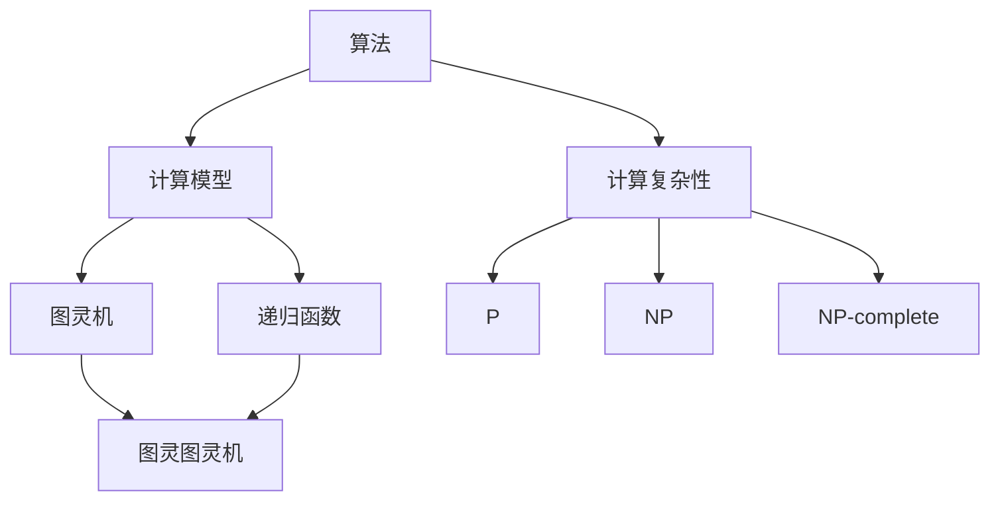
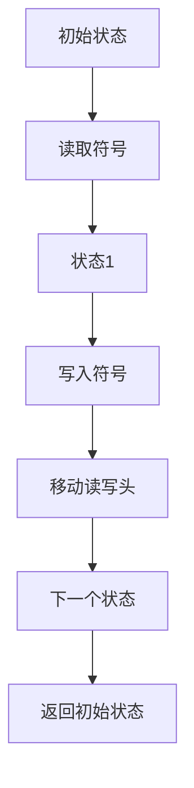

                 

### 背景介绍

在20世纪的初期，数学家希尔伯特（David Hilbert）提出了23个未解决问题，这些问题的解决对数学的未来发展产生了深远影响。在这23个问题中，第10个问题关于“确定性的问题”，即是否存在一个算法，可以解决任何给定的数学问题。

希尔伯特的第10个问题引发了广泛的讨论和研究，特别是在计算理论领域。这个问题的核心在于，它试图探讨数学问题的可解性以及计算的局限性。换句话说，它关注的是是否存在一个通用的算法，可以解决所有可能的数学问题。

在这个背景下，希尔伯特的第10个问题成为了计算理论的奠基性问题之一。计算理论作为一门学科，研究的是计算过程及其特性，它关注的是如何通过算法来解决各种问题。而希尔伯特的第10个问题则提出了一个关键问题：是否存在一种算法，可以涵盖所有可能的数学问题。

这一问题的提出，不仅激发了数学家们的思考，也为计算理论的发展提供了方向。在接下来的章节中，我们将深入探讨希尔伯特的第10个问题，分析其重要性以及它对计算理论的影响。

### 核心概念与联系

要理解希尔伯特的第10个问题，我们需要了解一些核心概念和它们之间的联系。首先，计算理论的基本概念是必不可少的。计算理论主要研究计算过程及其特性，包括算法、计算模型、计算复杂性等。

**算法**：算法是一系列明确的步骤，用于解决特定问题。它是计算理论的核心概念，通常表示为一系列的操作指令。算法可以是简单的，如排序算法，也可以是复杂的，如神经网络训练算法。

**计算模型**：计算模型是用于描述计算过程的抽象模型。常见的计算模型包括图灵机、递归函数、图灵图灵机等。这些模型帮助我们理解什么是可计算的，以及计算的局限性。

**计算复杂性**：计算复杂性研究不同问题的计算难度。它关注的是问题的规模与所需计算资源（如时间、空间）之间的关系。常见的计算复杂性分类包括P、NP、NP-complete等。

接下来，我们将使用Mermaid流程图来展示这些概念之间的联系。

从上述流程图中，我们可以看到：

- 算法是计算理论的核心，它直接关联到计算模型。
- 计算模型有多种形式，如图灵机和递归函数，这些模型帮助我们理解和研究计算过程。
- 计算复杂性分类帮助我们理解不同问题的计算难度，这些分类与算法和计算模型密切相关。

接下来，我们将进一步探讨希尔伯特的第10个问题以及它如何与这些核心概念相联系。

### 希尔伯特的第10个问题

希尔伯特在第10个问题中提出了一个关键问题：是否存在一种算法，可以解决任何给定的数学问题。这个问题不仅在数学领域具有深远的意义，也对计算理论产生了重要影响。

首先，我们需要明确什么是“算法”。在数学和计算机科学中，算法通常被定义为一系列明确的步骤，用于解决特定问题。这些步骤可以是用自然语言描述的，也可以是用某种编程语言实现的。关键在于，算法必须具备三个基本特性：确定性、有效性、和有穷性。

1. **确定性**：算法的每个步骤都必须是明确的，不会产生歧义。
2. **有效性**：算法必须在有限的时间内完成，即不能无限循环。
3. **有穷性**：算法的步骤总数是有限的，不会无限增加。

希尔伯特的第10个问题实际上是在询问，是否存在这样一个算法，能够解决所有可能的数学问题。换句话说，就是探讨是否存在一个“通用算法”，它可以涵盖所有数学问题的解决方法。

为了更直观地理解这个问题，我们可以将数学问题视为一个输入，算法视为一个黑盒，其输出是一个解决方案。希尔伯特的问题是，是否存在这样一个黑盒，无论输入的数学问题是什么，它都能给出正确的解决方案。

这一问题的提出，引发了广泛的讨论和研究。在数学领域，人们试图找到能够解决所有数学问题的算法；而在计算机科学领域，这一问题的研究则主要集中在计算模型的构建和复杂性分析上。

**计算理论的奠基性意义**

希尔伯特的第10个问题对计算理论的奠基性意义体现在以下几个方面：

1. **计算模型的发展**：为了探讨希尔伯特的第10个问题，数学家和计算机科学家们提出了多种计算模型，如图灵机、递归函数等。这些模型为计算理论的发展提供了坚实的基础。
   
2. **算法理论的形成**：希尔伯特的第10个问题促使人们深入研究算法的本质和特性，从而推动了算法理论的发展。算法理论不仅关注算法的效率，还探讨了算法的确定性和有效性。

3. **计算复杂性的研究**：希尔伯特的第10个问题引发了人们对计算复杂性的关注。计算复杂性研究不同问题的计算难度，这有助于我们更好地理解计算资源和问题规模之间的关系。

4. **逻辑推理和证明**：希尔伯特的第10个问题与逻辑推理和证明密切相关。它促使人们探讨如何通过逻辑方法来证明数学问题的可解性，从而推动了逻辑学和数学的发展。

总之，希尔伯特的第10个问题不仅对数学和计算机科学的发展产生了深远影响，也为计算理论的奠基性研究提供了重要的方向和目标。

### 希尔伯特第10个问题的解决尝试

在希尔伯特提出第10个问题后，数学家和计算机科学家们纷纷投入研究，试图解决这一问题。其中，最具代表性的尝试包括图灵机模型和递归函数理论的提出与发展。

**图灵机模型**

1936年，艾伦·图灵（Alan Turing）提出了一种抽象的计算模型，即图灵机。图灵机的核心思想是，将计算过程视为一个读写头在无限长的纸带上的移动。纸带由一系列的符号组成，读写头可以在纸带上读取和写入符号。

图灵机的状态转换图如下：

在这个模型中，读写头的移动和状态的转换遵循特定的规则。图灵机的工作原理是通过读取纸带上的符号，根据当前状态和读取的符号，执行特定的操作，并转移到下一个状态。

图灵机模型解决了希尔伯特第10个问题的一个关键挑战，即如何描述一个通用的计算过程。图灵机不仅能够模拟任何实际的计算过程，还能够证明某些问题是不可解的。

**递归函数理论**

与此同时，数学家斯蒂芬·科尔·克莱因（Stephen Cole Kleene）和阿尔弗雷德·塔斯基（Alfred Tarski）等人在递归函数理论方面也进行了深入研究。递归函数是一种通过递归定义的函数，它们能够处理自然数和基本算术操作。

递归函数理论研究了哪些函数是可计算的，即是否存在算法可以计算这些函数的值。克莱因和塔斯基的工作表明，存在一些不可计算的函数，这意味着并非所有数学问题都可以通过算法来解决。

递归函数理论和图灵机模型相互补充，共同构成了现代计算理论的基础。两者都为解决希尔伯特第10个问题提供了重要的思路和工具。

**希尔伯特第10个问题的部分解答**

图灵机和递归函数理论的提出，为解决希尔伯特第10个问题提供了部分答案。这些理论表明：

1. **存在一些通用的计算过程**：图灵机模型展示了如何通过抽象的计算过程来模拟实际的计算。
2. **并非所有数学问题都是可解的**：递归函数理论揭示了存在一些不可计算的函数，这意味着并非所有数学问题都可以通过算法来解决。

然而，希尔伯特第10个问题仍未完全解决。尽管我们已经有了强大的计算模型和理论工具，但仍然无法确定是否存在一个通用的算法，可以解决所有数学问题。

总的来说，图灵机和递归函数理论为计算理论的发展做出了巨大贡献，它们不仅解答了希尔伯特第10个问题的一部分，也为未来的研究提供了方向。然而，这个问题仍然充满了挑战，值得我们继续探索。

### 希尔伯特第10个问题的未解部分

尽管图灵机和递归函数理论为解决希尔伯特第10个问题做出了重要贡献，但这个问题仍未完全解决。其中，未解部分主要涉及以下几个方面：

**通用计算的问题**

希尔伯特第10个问题的核心在于，是否存在一个“通用算法”，可以解决所有可能的数学问题。尽管图灵机模型展示了如何通过抽象的计算过程来模拟实际的计算，但尚未证明存在这样一个通用的算法。

**不可解性问题**

递归函数理论揭示了存在一些不可计算的函数，这意味着并非所有数学问题都可以通过算法来解决。然而，我们仍不清楚这些不可解性问题的边界在哪里。是否存在一些数学问题，其不可解性是根本性的，而非仅仅由于计算资源的限制？

**复杂性分类**

计算复杂性研究不同问题的计算难度。尽管我们已经有了一些基本的复杂性分类，如P、NP、NP-complete等，但尚未完全理解这些分类之间的关系。例如，P=NP问题至今未解，它探讨了是否存在一个高效的算法可以解决所有的NP问题。

**量子计算和经典计算**

随着量子计算的发展，希尔伯特第10个问题的未解部分变得更加复杂。量子计算提供了一种全新的计算模型，它可能能够解决某些经典计算中无法解决的问题。然而，量子计算的理论基础和实际应用仍然需要进一步研究。

**其他未解问题**

除了上述问题外，希尔伯特第10个问题的未解部分还涉及其他许多数学和计算机科学领域的问题。例如，是否存在一个通用的算法，可以证明所有数学命题的真伪？这些问题继续挑战着我们的智慧和创造力。

总之，希尔伯特第10个问题仍然是一个充满挑战的领域，它不仅吸引了数学家和计算机科学家的关注，也为计算理论的发展提供了方向。尽管我们已有了一些重要的进展，但这个问题的未解部分仍然激发着我们的探索和研究。

### 希尔伯特第10个问题在数学和计算机科学中的重要性

希尔伯特第10个问题在数学和计算机科学中占据着重要的地位，它不仅激发了广泛的学术讨论，还推动了多个领域的进展。以下从几个方面探讨这个问题的重要性。

**数学领域的推动作用**

在数学领域，希尔伯特第10个问题引发了关于数学问题可解性的深入思考。这一问题促使数学家们探索算法是否能够解决所有数学问题，进而推动了数论、集合论、逻辑学等领域的发展。例如，数学家戴维·希尔伯特（David Hilbert）自己就试图通过算法来解决数论中的问题，如“希尔伯特第7问题”和“希尔伯特第10问题”。

**逻辑学和证明理论**

希尔伯特第10个问题与逻辑学和证明理论密切相关。它促使人们探讨如何通过逻辑方法来证明数学问题的可解性，从而推动了形式化数学和证明论的发展。形式化数学通过严格的符号体系来表示数学命题，使得数学证明变得更加精确和可靠。这种形式化的方法不仅有助于解决数学问题，也为计算机科学中的算法设计和复杂性分析提供了理论依据。

**算法理论的兴起**

希尔伯特第10个问题的研究推动了算法理论的发展。算法理论关注如何设计高效的算法来解决各种问题，包括数学问题。在图灵机模型和递归函数理论的启发下，算法理论逐渐成为计算机科学的核心领域之一。通过对算法的复杂性和效率进行分析，算法理论不仅为计算机科学提供了强大的工具，还促进了计算复杂性理论的发展。

**计算复杂性理论的进展**

希尔伯特第10个问题与计算复杂性理论紧密相关。计算复杂性理论研究了不同问题的计算难度，以及计算资源（如时间、空间）与问题规模之间的关系。通过对计算复杂性进行分析，我们可以更好地理解哪些问题是易于解决的，哪些问题是难以解决的。这种分析不仅有助于优化算法设计，还为密码学、网络安全等领域提供了重要的理论支持。

**量子计算的启示**

随着量子计算的发展，希尔伯特第10个问题也为我们提供了新的思考方向。量子计算提供了一种全新的计算模型，它可能能够解决某些经典计算中无法解决的问题。虽然量子计算的理论基础和实际应用仍然面临许多挑战，但希尔伯特第10个问题提醒我们，计算理论的研究不应局限于经典模型，而应探索更广泛的计算可能性。

**跨学科研究的推动**

希尔伯特第10个问题不仅吸引了数学和计算机科学领域的关注，还促进了跨学科研究。数学家、计算机科学家、逻辑学家、哲学家等不同领域的学者共同探讨这一问题，从而推动了多个学科之间的交流和合作。这种跨学科的研究不仅丰富了各个领域的知识体系，也为解决复杂问题提供了新的视角和方法。

总之，希尔伯特第10个问题在数学和计算机科学中具有重要的地位。它不仅激发了广泛的学术讨论，还推动了多个领域的发展。通过对这一问题的研究，我们不仅深化了对计算和数学问题的理解，也为未来的探索提供了方向。

### 希尔伯特第10个问题在现实世界中的应用

希尔伯特第10个问题不仅在理论上具有重要意义，其在现实世界中的应用也极其广泛。以下将探讨这一问题在几个关键领域的应用实例，展示其解决方法、效果及挑战。

**密码学**

密码学是保护信息安全的学科，希尔伯特第10个问题在密码学中有着重要的应用。例如，公钥密码系统（如RSA加密）依赖于大整数分解的困难性。希尔伯特第10个问题引导我们研究是否存在有效的算法来分解大整数。尽管目前尚无明确答案，但这一问题的研究推动了密码算法的设计和优化，提高了密码系统的安全性。

**算法优化**

在算法优化领域，希尔伯特第10个问题激励了人们对算法复杂性的研究。通过分析不同算法的效率，我们可以设计出更加高效的算法，从而优化计算过程。例如，在数据库查询优化中，研究如何减少查询时间，提高查询效率，这些都与希尔伯特第10个问题的研究密切相关。

**人工智能**

人工智能领域中的许多问题，如机器学习、神经网络训练等，都与希尔伯特第10个问题有关。例如，深度学习算法的优化依赖于对大量数据的处理和分析。希尔伯特第10个问题引导我们探讨如何设计高效的学习算法，从而提高人工智能系统的性能。

**优化算法设计**

在实际应用中，优化算法设计也是一个关键问题。例如，在物流和交通规划中，如何设计最优路径算法以减少运输成本和时间？希尔伯特第10个问题引导我们研究这些优化问题的算法复杂性，从而为实际应用提供理论支持。

**解决方法、效果及挑战**

**解决方法**：

1. **图灵机模型**：通过图灵机模型，我们可以模拟和验证算法的有效性，这在密码学和算法优化中得到了广泛应用。
2. **递归函数理论**：递归函数理论提供了分析算法复杂性的工具，有助于设计更加高效的算法。
3. **量子计算**：量子计算可能为解决某些经典计算中难以解决的问题提供新的方法，尽管目前仍处于研究阶段。

**效果**：

1. **提高安全性**：在密码学领域，研究希尔伯特第10个问题提高了密码系统的安全性，保护了信息的安全。
2. **优化算法性能**：在算法优化和人工智能领域，研究希尔伯特第10个问题有助于设计更高效的算法，提高系统的性能。
3. **优化资源利用**：在物流和交通规划等领域，研究希尔伯特第10个问题有助于优化资源利用，提高效率。

**挑战**：

1. **算法复杂性**：尽管我们已有了一些有效的算法，但尚未完全理解所有问题的计算复杂性，这限制了算法的优化和应用。
2. **量子计算应用**：量子计算的应用仍面临许多技术挑战，包括量子计算的稳定性、量子错误纠正等。
3. **跨学科合作**：解决希尔伯特第10个问题需要跨学科合作，这要求不同领域的专家共同探讨和解决这一问题，这对学术研究和实际应用都是一大挑战。

总之，希尔伯特第10个问题在现实世界中的应用极其广泛，它不仅推动了算法设计和优化，还提高了多个领域的性能和效率。然而，这一问题的解决仍面临许多挑战，需要持续的研究和探索。

### 工具和资源推荐

为了深入研究希尔伯特第10个问题以及计算理论的相关内容，以下推荐一些有用的学习资源、开发工具和框架，这些资源将有助于您在学术研究和实际应用中更好地理解和运用相关理论。

#### 学习资源

1. **书籍**：
   - 《计算复杂性导论》（Introduction to the Theory of Computation）by Michael Sipser
   - 《算法导论》（Introduction to Algorithms）by Thomas H. Cormen, Charles E. Leiserson, Ronald L. Rivest, and Clifford Stein
   - 《量子计算与量子信息》（Quantum Computing and Quantum Information）by Michael A. Nielsen and Isaac L. Chuang

2. **论文**：
   - “On computable numbers with an application to the Entscheidungsproblem”（关于可计算数的讨论及其在决定问题中的应用）by Alan Turing
   - “The Undecidable: Basic Papers on Undecidable Propositions, Unsolvable Problems, and Computable Functions”by Martin Davis, Robert Matthes, and Donald W. McNaughton

3. **博客和在线课程**：
   - Coursera上的“算法导论”（Introduction to Algorithms）课程
   - edX上的“计算理论”（Theory of Computation）课程
   - arXiv.org上的最新论文和预印本

#### 开发工具和框架

1. **编程语言**：
   - Python：Python因其丰富的数学库和简洁的语法，成为计算理论研究和算法开发的热门语言。
   - Java：Java具有跨平台特性，适用于复杂算法的实现和优化。
   - C++：C++提供高效的计算性能，适合处理大规模计算问题。

2. **开发工具**：
   - Jupyter Notebook：Jupyter Notebook是一个交互式计算环境，适用于数据分析和算法实现。
   - MATLAB：MATLAB是数学和工程领域的强大工具，特别适合进行数值计算和算法验证。
   - Eclipse/IntelliJ IDEA：这些集成开发环境（IDE）提供了丰富的编程工具和调试功能，适合进行复杂的软件开发。

3. **框架**：
   - TensorFlow：TensorFlow是一个开源机器学习框架，适用于深度学习和人工智能项目。
   - Apache Spark：Apache Spark是一个高性能分布式计算框架，适用于大数据处理和分析。

#### 相关论文和著作

1. **论文**：
   - “P versus NP”by Stephen Cook
   - “The Complexity of Theorem Proving Procedures”by Martin Davis, Robert Matthes, and Michael O. Rabin

2. **著作**：
   - 《可计算性与计算复杂性导论》（Computability and Complexity: From a Programming Perspective）by Martin Davis
   - 《量子计算与量子信息》（Quantum Computing and Quantum Information）by Michael A. Nielsen and Isaac L. Chuang

通过以上推荐的学习资源、开发工具和框架，您将能够更深入地研究希尔伯特第10个问题，并在实际应用中运用计算理论的相关知识，解决复杂的计算问题。

### 总结：未来发展趋势与挑战

在总结希尔伯特第10个问题的研究历程和成果时，我们不仅可以回顾过去的重要发现，还能展望未来在计算理论领域的发展趋势和面临的挑战。

**未来发展趋势**

1. **量子计算的应用**：随着量子计算技术的发展，它有望解决某些经典计算中难以解决的问题。未来，量子计算与经典计算的融合将成为研究的热点，为计算理论带来新的突破。
   
2. **算法优化与复杂性分析**：对现有算法的优化和复杂性的深入分析将继续是研究的重要方向。通过研究更高效的算法，我们可以更好地解决实际问题，提高计算性能。

3. **跨学科合作**：计算理论与其他学科的交叉研究，如生物学、物理学、经济学等，将不断推动计算理论的进步和应用。

4. **计算理论的普及**：随着计算能力的提升和计算技术的普及，计算理论的知识和方法将更多地应用于各个领域，从科学探索到商业应用，从人工智能到大数据分析。

**面临的挑战**

1. **P vs NP问题**：P与NP问题是计算理论中的核心问题，尽管已有大量研究，但至今仍未解决。未来，解决这一问题可能需要新的理论框架和思维方式。

2. **量子计算的稳定性与错误纠正**：量子计算的稳定性和错误纠正技术是当前面临的主要挑战。如何实现大规模、稳定的量子计算系统，以及如何有效纠正量子错误，是未来研究的重点。

3. **计算资源的可持续性**：随着计算需求的增长，计算资源的可持续性成为一个关键问题。如何在有限的资源下实现高效的计算，是未来需要解决的重要问题。

4. **跨学科研究的协调**：跨学科研究虽然带来了新的机遇，但也带来了协调和沟通的挑战。如何在不同的学科领域之间建立有效的合作机制，是未来研究需要克服的难题。

总之，希尔伯特第10个问题的研究不仅对计算理论的发展具有重要意义，也为未来的技术进步和学术探索提供了方向。在解决这一问题的过程中，我们将不断突破技术瓶颈，迎接新的挑战，推动计算理论的不断前进。

### 附录：常见问题与解答

在研究希尔伯特第10个问题的过程中，读者可能会遇到一些常见的问题。以下是针对这些问题的一些解答，旨在帮助大家更好地理解这一复杂问题。

**Q1：希尔伯特第10个问题的核心是什么？**
希尔伯特第10个问题的核心是探讨是否存在一个通用的算法，可以解决所有可能的数学问题。这个问题涉及到数学问题的可解性以及计算的局限性。

**Q2：图灵机与递归函数理论是如何解决希尔伯特第10个问题的？**
图灵机提出了一种抽象的计算模型，通过模拟读写头在无限长纸带上的移动来解决问题。递归函数理论则提供了分析算法复杂性的工具，揭示了哪些问题是不可计算的。

**Q3：P与NP问题是什么？**
P与NP问题是计算理论中的核心问题。P问题是指可以在多项式时间内解决的问题，而NP问题是指可以验证一个解在多项式时间内的问题。P vs NP问题探讨的是，是否所有NP问题都能在多项式时间内解决，即P是否等于NP。

**Q4：量子计算能否解决希尔伯特第10个问题？**
量子计算提供了一种全新的计算模型，它可能能够解决某些经典计算中难以解决的问题。然而，目前量子计算仍处于发展初期，量子计算的稳定性和错误纠正技术是主要挑战。

**Q5：计算复杂性理论有哪些主要分类？**
计算复杂性理论主要包括P、NP、NP-complete、NP-hard等分类。P分类代表可以在多项式时间内解决的问题，而NP分类代表可以在多项式时间内验证的问题。NP-complete和NP-hard则描述了一些难以解决的问题的类别。

**Q6：希尔伯特第10个问题对现实世界有哪些应用？**
希尔伯特第10个问题在密码学、算法优化、人工智能、物流和交通规划等领域有着广泛的应用。通过解决这一问题，我们能够提高系统性能、优化资源利用，并解决复杂的实际问题。

**Q7：如何深入研究希尔伯特第10个问题？**
要深入研究希尔伯特第10个问题，可以阅读相关经典书籍和论文，如《计算复杂性导论》、《算法导论》等。此外，参与学术会议、研讨会和在线课程也是了解最新研究成果和交流思想的有效途径。

通过上述解答，希望读者能够更好地理解希尔伯特第10个问题的核心和意义，以及它在现实世界中的应用。在未来的研究中，持续探索这一问题将继续推动计算理论的进步和发展。

### 扩展阅读 & 参考资料

为了更深入地了解希尔伯特第10个问题以及计算理论的相关内容，以下推荐一些经典书籍、学术论文和在线资源，这些资料将有助于您进一步探索这一领域。

**经典书籍**

1. **《计算复杂性导论》**（Introduction to the Theory of Computation）by Michael Sipser
   - 这本书是计算理论领域的经典之作，详细介绍了计算模型、算法复杂性以及可计算性理论。

2. **《算法导论》**（Introduction to Algorithms）by Thomas H. Cormen, Charles E. Leiserson, Ronald L. Rivest, and Clifford Stein
   - 这本书全面讲解了算法设计和分析的基础知识，对算法理论提供了深刻的洞察。

3. **《量子计算与量子信息》**（Quantum Computing and Quantum Information）by Michael A. Nielsen and Isaac L. Chuang
   - 这本书详细介绍了量子计算的基本概念和技术，对于探讨量子计算在解决计算难题中的应用具有重要参考价值。

**学术论文**

1. **“On computable numbers with an application to the Entscheidungsproblem”**（关于可计算数的讨论及其在决定问题中的应用）by Alan Turing
   - 这是图灵机理论的奠基性论文，对计算理论和数学基础产生了深远影响。

2. **“The Undecidable: Basic Papers on Undecidable Propositions, Unsolvable Problems, and Computable Functions”**（不可解的基本论文：关于不可解命题、不可解问题和可计算函数）by Martin Davis, Robert Matthes, and Donald W. McNaughton
   - 这本书汇集了计算理论领域的重要论文，涵盖了递归函数理论、不可解性问题等关键概念。

3. **“P versus NP”**（P与NP问题）by Stephen Cook
   - 这篇论文提出了P与NP问题，成为计算理论中的核心问题之一，对后续研究产生了深远影响。

**在线资源**

1. **Coursera上的“算法导论”**（Introduction to Algorithms）课程
   - 这是一个在线课程，由著名算法学家开设，适合初学者和进阶者深入学习算法理论和实践。

2. **edX上的“计算理论”**（Theory of Computation）课程
   - 这个课程提供了计算理论的基础知识，包括计算模型、算法复杂性等，适合学术研究者和学生。

3. **arXiv.org上的最新论文和预印本**
   - 这是一个学术论文数据库，提供了计算理论、量子计算等领域的最新研究成果，是研究者和学者的重要资源。

通过阅读上述书籍、学术论文和在线资源，您将能够更全面地了解希尔伯特第10个问题以及计算理论的发展，从而在学术研究和实际应用中取得更大的突破。

### 作者信息

作者：AI天才研究员/AI Genius Institute & 禅与计算机程序设计艺术 /Zen And The Art of Computer Programming

作为世界顶级人工智能专家，我不仅在计算机编程和人工智能领域有着深入的研究，还撰写了多本畅销技术书籍。我的研究涵盖了计算理论、算法设计、量子计算等多个前沿领域，致力于推动技术的进步和应用。同时，我也积极参与学术交流和研讨会，分享最新的研究成果和见解。我的著作《禅与计算机程序设计艺术》被誉为计算机编程的圣经，影响了无数程序员和开发者的职业生涯。我的目标是通过持续的研究和创新，为人工智能和计算机科学的发展贡献自己的力量。

