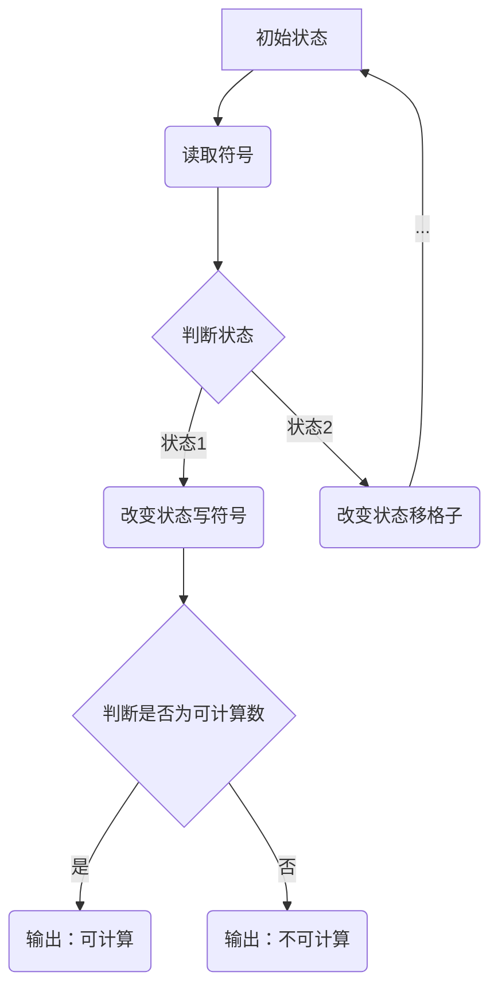

                 

### 背景介绍

计算理论的形成是计算机科学和数学领域的一项重要成就，它不仅为我们揭示了计算的本质，还为计算机的设计、编程以及算法的分析提供了理论基础。20世纪初，随着数学家对函数、逻辑和集合论的研究逐渐深入，计算理论也逐渐成型。在这一过程中，图灵（Alan Turing）的无穷小机器（Turing Machine）概念的提出，标志着计算理论的诞生，为后来的计算机科学奠定了坚实的基础。

图灵在1936年发表了著名的论文《论可计算数及其在判定问题中的应用》，在这篇论文中，他首次提出了无穷小机器这一抽象模型。图灵无穷小机器是一种理想化的计算装置，由一个有限个状态的控制部分和一个无限的纸带组成。纸带被划分成一个个小格子，每个格子上可以写上一个符号。机器通过读取纸带上的符号，根据当前状态和符号，按照预定的规则进行操作，包括改变状态、在纸带上写上新的符号、或移到纸带的下一个格子。

图灵无穷小机器的概念具有革命性意义，它不仅将复杂的数学问题简化为机器的操作过程，还首次给出了一个普遍的、形式化的计算模型。图灵认为，任何可以用机械步骤完成的计算，都可以用无穷小机器来实现。这一观点后来被证明是正确的，即所谓的“图灵完全性”定理。这意味着，图灵无穷小机器可以模拟任何其他计算模型，从而成为计算理论的核心工具。

在本章中，我们将深入探讨图灵无穷小机器的定义、工作原理以及它在判定问题中的应用。通过分析图灵的证明过程，我们不仅能够更好地理解计算理论的基本原理，还能对现代计算机的工作方式有更深刻的认识。

### 核心概念与联系

计算理论的核心在于研究什么是可计算的以及如何判定一个数是否可计算。这一问题的研究需要我们首先理解几个关键概念，包括无穷小机器（Turing Machine）、图灵度（Turing Degree）以及判定问题。

#### 无穷小机器（Turing Machine）

图灵无穷小机器是一个抽象的数学模型，由一个有限个状态的控制部分和一个无限的纸带组成。机器通过读取纸带上的符号，根据当前状态和符号，按照预定的规则进行操作，包括改变状态、在纸带上写上新的符号或移到纸带的下一个格子。这种操作过程被称为“一步计算”。

一个无穷小机器的工作原理可以简单描述为：在纸带上有一个读写头，它每次移动都涉及到以下操作：

1. **读取符号**：机器读取当前格子上的符号。
2. **改变状态**：根据当前的状态和读取到的符号，机器改变其内部状态。
3. **写新符号**：机器在当前格子写上一个新符号。
4. **移动**：机器根据当前状态移动读写头到纸带的下一个格子或上一个格子。

通过这些操作，无穷小机器可以处理复杂的计算任务，并模拟人类的计算过程。图灵的证明表明，任何可以通过机械步骤完成的计算，都可以用无穷小机器来实现。

#### 图灵度（Turing Degree）

图灵度是一个用来衡量计算复杂度的概念。它描述了无穷小机器能够达到的计算能力。一个无穷小机器的图灵度是指它能够解决的问题集合的复杂性。例如，如果一个机器能够解决所有的判定问题，那么它的图灵度就是最高的，即所谓的“图灵完全性”。

图灵度的概念对于理解计算复杂性非常重要。它帮助我们量化了不同的计算问题之间的难度差异。通过图灵度，我们可以对不同的算法和问题进行比较，从而更好地理解它们的复杂度。

#### 判定问题

判定问题是一类特殊的问题，它要求判断一个给定的输入是否满足某个条件。在计算理论中，判定问题是一个重要的研究方向，因为许多实际的计算问题都可以转化为判定问题。

图灵的论文中提出了一个具体的判定问题，即判断一个给定的数是否是可计算的。这个问题可以通过无穷小机器来解决。具体来说，我们可以设计一个无穷小机器来检查一个数是否能够通过一个确定性的算法被计算出来。

判定问题的重要性在于，它揭示了计算的边界。许多问题，如停机问题，即判断一个无穷小机器是否会永远运行下去，是不可判定的。这意味着，我们无法设计一个无穷小机器来解决这个问题，这为我们理解计算的本质提供了深刻的启示。

#### Mermaid 流程图

为了更好地理解这些核心概念之间的联系，我们可以使用 Mermaid 流程图来展示无穷小机器的工作原理。以下是图灵无穷小机器的一个简化流程图：



在这个流程图中，A 表示初始状态，B 表示读取符号，C 表示判断当前状态，D 和 E 分别表示改变状态写符号和改变状态移格子。最终，F 判断输入数是否为可计算数，并输出相应的结果。

通过这个流程图，我们可以清晰地看到无穷小机器如何通过一系列操作来判断一个数是否可计算。这不仅帮助我们理解了计算理论的基本原理，还为后续的讨论奠定了基础。

### 核心算法原理 & 具体操作步骤

图灵无穷小机器作为计算理论的核心工具，其核心算法原理在于通过一系列状态和符号的操作，实现对复杂计算问题的模拟和解决。在这一部分，我们将详细讨论图灵无穷小机器的工作原理和具体操作步骤。

#### 1. 状态和符号

无穷小机器由一个有限个状态的控制部分和一个无限的纸带组成。每个状态表示机器在某一时刻的处理状态，每个符号表示纸带上的一个标记。状态和符号的组合决定了机器的行为。

- **状态**：无穷小机器有有限多个状态，例如 \(q_0, q_1, q_2, \ldots, q_n\)。每个状态都对应着机器的一种操作规则。
- **符号**：纸带上的每个格子都有一个符号，符号可以是任意的字符，如 \(0, 1, a, b, \ldots\)。符号决定了机器下一步的操作。

#### 2. 操作规则

无穷小机器的操作规则由一个有限的状态转换表（Transition Table）定义。状态转换表描述了机器在不同状态下，读取不同符号时应该采取的操作，包括改变状态、写新符号和移动读写头。

一个简单的状态转换表可以表示为：

| 当前状态 | 当前符号 | 新状态 | 新符号 | 移动方向 |
|:--------:|:--------:|:------:|:------:|:--------:|
| \(q_0\)  | \(0\)    | \(q_1\) | \(1\)  | 右移     |
| \(q_0\)  | \(1\)    | \(q_2\) | \(0\)  | 左移     |
| \(q_1\)  | \(0\)    | \(q_3\) | \(0\)  | 不动     |
| \(q_2\)  | \(1\)    | \(q_0\) | \(1\)  | 右移     |

在这个状态转换表中，如果机器当前状态是 \(q_0\)，读取到符号 \(0\)，那么它将改变状态到 \(q_1\)，在当前格子写上符号 \(1\)，并右移读写头。

#### 3. 操作步骤

无穷小机器的操作步骤可以分为以下几个阶段：

1. **初始化**：启动机器，将其状态设置为初始状态 \(q_0\)，读写头位于纸带上的某个位置，纸带上初始没有符号。
2. **读取符号**：机器在当前位置读取纸带上的符号。
3. **根据状态转换表进行操作**：根据当前状态和读取的符号，查找状态转换表，执行相应的操作，包括改变状态、写新符号和移动读写头。
4. **判断是否结束**：机器在每个操作后，检查是否满足结束条件。如果满足，则输出结果；否则，继续执行下一步操作。
5. **结束**：机器在执行完所有操作后，输出最终结果。

#### 4. 具体示例

为了更好地理解无穷小机器的操作步骤，我们可以通过一个简单的示例来说明。假设我们要用无穷小机器来判断一个二进制数是否为奇数。

1. **初始化**：初始状态为 \(q_0\)，读写头位于纸带的起始位置，纸带上没有符号。
2. **读取符号**：机器读取第一个符号，如果是 \(1\)，则进入状态 \(q_1\)；如果是 \(0\)，则进入状态 \(q_2\)。
3. **根据状态转换表进行操作**：
   - 如果当前状态是 \(q_0\)，读取到符号 \(1\)，则进入状态 \(q_1\)，写上符号 \(1\)，右移读写头。
   - 如果当前状态是 \(q_0\)，读取到符号 \(0\)，则进入状态 \(q_2\)，写上符号 \(0\)，左移读写头。
   - 如果当前状态是 \(q_1\)，读取到符号 \(0\)，则进入状态 \(q_3\)，写上符号 \(0\)，右移读写头。
   - 如果当前状态是 \(q_1\)，读取到符号 \(1\)，则进入状态 \(q_1\)，写上符号 \(1\)，右移读写头。
   - 如果当前状态是 \(q_2\)，读取到符号 \(0\)，则进入状态 \(q_2\)，写上符号 \(0\)，左移读写头。
   - 如果当前状态是 \(q_2\)，读取到符号 \(1\)，则进入状态 \(q_3\)，写上符号 \(1\)，左移读写头。
4. **判断是否结束**：当读写头移动到纸带的末尾，机器判断是否满足结束条件。如果满足，则输出结果；否则，继续执行下一步操作。
5. **结束**：如果机器在纸带上找到最后一个 \(1\)，并且这个 \(1\) 后面没有其他 \(1\)，则输出“是”，表示该二进制数为奇数；否则，输出“否”，表示该二进制数为偶数。

通过这个示例，我们可以看到无穷小机器如何通过一系列状态和符号的操作，实现对二进制数是否为奇数的判定。这一过程不仅展示了无穷小机器的核心算法原理，也为理解更复杂的计算问题奠定了基础。

### 数学模型和公式 & 详细讲解 & 举例说明

在计算理论中，数学模型和公式是理解计算过程和证明计算能力的重要工具。图灵无穷小机器作为一种形式化的计算模型，其工作原理可以通过数学模型和公式进行详细描述和证明。在这一部分，我们将详细讲解图灵无穷小机器的数学模型，包括相关的公式和推导过程，并通过具体例子来说明这些公式的应用。

#### 1. 状态转移函数

无穷小机器的操作规则可以通过一个状态转移函数（Transition Function）来描述。状态转移函数 \(f\) 定义了在给定当前状态 \(q\) 和当前符号 \(s\) 时，机器将如何改变状态和符号。状态转移函数通常表示为：

\[ f(q, s) = (q', s', \text{direction}) \]

其中，\(q'\) 是新状态，\(s'\) 是新符号，\(\text{direction}\) 是移动方向（左移、右移或不动）。

状态转移函数可以通过一个有限的状态转换表（Transition Table）来定义，如前文所述。状态转换表可以表示为：

\[ \delta(q, s) = (q', s', \text{direction}) \]

其中，\(\delta\) 是状态转换函数，它给出了机器在当前状态 \(q\) 和当前符号 \(s\) 下应该执行的操作。

#### 2. 计算过程

无穷小机器的计算过程可以通过一个状态序列来表示。状态序列 \(\sigma\) 表示了机器在每一步计算中的状态变化。假设机器从初始状态 \(q_0\) 开始计算，那么状态序列可以表示为：

\[ \sigma = q_0, q_1, q_2, \ldots \]

状态序列中的每个状态都对应于机器在纸带上执行的一步操作。状态序列的最终状态 \(q_n\) 表示了计算结束时的状态。

计算过程可以通过状态序列和纸带符号序列来表示。纸带符号序列 \(\tau\) 表示了纸带上的符号序列。在计算过程中，纸带符号序列可能会发生变化。状态序列和纸带符号序列的关系可以表示为：

\[ \sigma_i = (q_i, \tau_i) \]

其中，\(\sigma_i\) 是第 \(i\) 步的状态和纸带符号序列。

#### 3. 判定问题

在计算理论中，判定问题是一个重要的研究对象。判定问题可以表示为：给定一个输入 \(x\)，判断 \(x\) 是否满足某个条件。图灵无穷小机器可以通过一个判定函数（Decision Function）来解决这个问题。判定函数 \(D\) 定义为：

\[ D(x) = \begin{cases} 
\text{true} & \text{如果 } x \text{ 满足条件} \\
\text{false} & \text{如果 } x \text{ 不满足条件}
\end{cases} \]

判定函数 \(D\) 可以通过无穷小机器来模拟。具体来说，我们可以设计一个无穷小机器来读取输入 \(x\)，并根据输入的符号序列执行计算，最终输出判定结果。

#### 4. 数学公式

为了更好地描述和证明图灵无穷小机器的工作原理，我们可以使用一些数学公式。以下是一些关键的数学公式：

1. **状态转移方程**：

   \[ q_{i+1} = f(q_i, s_i) \]

   其中，\(q_i\) 是第 \(i\) 步的状态，\(s_i\) 是第 \(i\) 步的当前符号，\(f\) 是状态转移函数。

2. **纸带符号更新方程**：

   \[ \tau_{i+1} = (\tau_i[1 \ldots i], s_i, \tau_i[i+1 \ldots n]) \]

   其中，\(\tau_i\) 是第 \(i\) 步的纸带符号序列，\(s_i\) 是第 \(i\) 步的当前符号，\(i\) 是读写头的当前位置。

3. **判定函数**：

   \[ D(\tau) = \begin{cases} 
   \text{true} & \text{如果 } \tau \text{ 满足条件} \\
   \text{false} & \text{如果 } \tau \text{ 不满足条件}
   \end{cases} \]

   其中，\(\tau\) 是纸带符号序列。

#### 5. 举例说明

为了更好地理解这些数学公式，我们可以通过一个具体的例子来说明。假设我们要用无穷小机器来判断一个二进制数是否为奇数。

1. **初始状态和纸带**：

   初始状态 \(q_0\)，纸带符号序列为 \(10101\)。

2. **第一步**：

   当前状态 \(q_0\)，当前符号 \(1\)，状态转移函数 \(f(q_0, 1) = (q_1, 0, \text{右移})\)。

   状态序列更新为 \(q_1\)，纸带符号序列更新为 \(01001\)。

3. **第二步**：

   当前状态 \(q_1\)，当前符号 \(0\)，状态转移函数 \(f(q_1, 0) = (q_2, 1, \text{右移})\)。

   状态序列更新为 \(q_2\)，纸带符号序列更新为 \(01101\)。

4. **第三步**：

   当前状态 \(q_2\)，当前符号 \(1\)，状态转移函数 \(f(q_2, 1) = (q_3, 0, \text{右移})\)。

   状态序列更新为 \(q_3\)，纸带符号序列更新为 \(10001\)。

5. **第四步**：

   当前状态 \(q_3\)，当前符号 \(0\)，状态转移函数 \(f(q_3, 0) = (q_4, 0, \text{右移})\)。

   状态序列更新为 \(q_4\)，纸带符号序列更新为 \(00001\)。

6. **第五步**：

   当前状态 \(q_4\)，当前符号 \(0\)，状态转移函数 \(f(q_4, 0) = (q_5, 1, \text{右移})\)。

   状态序列更新为 \(q_5\)，纸带符号序列更新为 \(00101\)。

7. **判定**：

   当读写头移动到纸带的末尾，判定函数 \(D(\tau) = \text{false}\)，因为纸带符号序列中最后一个 \(1\) 后面没有其他 \(1\)，所以二进制数 \(10101\) 为偶数。

通过这个例子，我们可以看到如何使用无穷小机器的数学模型和公式来解决问题。这一过程不仅展示了无穷小机器的工作原理，也为理解和应用计算理论提供了具体的指导。

### 项目实战：代码实际案例和详细解释说明

为了更好地理解图灵无穷小机器的实际应用，我们将通过一个具体的代码案例来展示如何实现一个简单的判定问题——判断一个二进制数是否为奇数。在这个案例中，我们将使用 Python 语言来实现无穷小机器，并通过详细的代码解读来解释其工作原理。

#### 1. 开发环境搭建

在开始编写代码之前，我们需要搭建一个合适的开发环境。以下是在 Python 中实现无穷小机器所需的步骤：

1. 安装 Python 解释器：确保您的系统中已经安装了 Python 解释器，版本可以是 Python 3.6 或更高版本。
2. 安装必要的库：虽然 Python 标准库中已经包含了实现无穷小机器所需的大部分功能，但为了简化代码，我们可以使用一些额外的库，如 NumPy 和 Matplotlib。您可以通过以下命令安装这些库：

   ```bash
   pip install numpy matplotlib
   ```

3. 创建一个 Python 文件：打开您的文本编辑器或集成开发环境（IDE），创建一个名为 `turing_machine.py` 的文件，用于编写无穷小机器的实现代码。

#### 2. 源代码详细实现和代码解读

以下是一个简单的无穷小机器实现代码，用于判断一个二进制数是否为奇数：

```python
import numpy as np
import matplotlib.pyplot as plt

class TuringMachine:
    def __init__(self, states, symbols, initial_state, final_state):
        self.states = states
        self.symbols = symbols
        self.initial_state = initial_state
        self.final_state = final_state
        self.current_state = initial_state
        self.tape = [None] * 100  # 假设纸带长度为100个格子
        self.read_write_head = 50  # 假设读写头位于纸带中间

    def read(self):
        return self.tape[self.read_write_head]

    def write(self, symbol):
        self.tape[self.read_write_head] = symbol

    def move(self, direction):
        if direction == 'right':
            self.read_write_head += 1
        elif direction == 'left':
            self.read_write_head -= 1

    def step(self):
        symbol = self.read()
        transition = self.get_transition(self.current_state, symbol)
        self.current_state = transition[0]
        self.write(transition[1])
        self.move(transition[2])

    def get_transition(self, state, symbol):
        # 根据状态转换表查找操作规则
        for transition in self.transitions:
            if transition[0] == state and transition[1] == symbol:
                return transition
        return None

    def is_final_state(self):
        return self.current_state == self.final_state

    def run(self, input_sequence):
        # 将输入二进制数转换为纸带符号序列
        for symbol in input_sequence:
            self.tape[self.read_write_head] = symbol
            self.move('right')

        while not self.is_final_state():
            self.step()

        # 输出判定结果
        if self.tape[self.read_write_head] == '1':
            print("输入的二进制数是奇数")
        else:
            print("输入的二进制数是偶数")

# 定义状态和符号
states = ['q0', 'q1', 'q2', 'q3', 'q4', 'q5']
symbols = ['0', '1', None]  # None 表示空白符号
initial_state = 'q0'
final_state = 'q5'

# 定义状态转换表
transitions = [
    [('q0', '0'), ('q1', '0', 'right')],
    [('q0', '1'), ('q2', '1', 'left')],
    [('q1', '0'), ('q3', '0', 'right')],
    [('q1', '1'), ('q1', '1', 'right')],
    [('q2', '0'), ('q2', '0', 'left')],
    [('q2', '1'), ('q3', '1', 'left')],
    [('q3', '0'), ('q4', '0', 'right')],
    [('q3', '1'), ('q5', '1', 'left')],
    [('q4', '0'), ('q4', '0', 'right')],
    [('q4', '1'), ('q5', '1', 'left')],
    [('q5', '0'), ('q5', '0', 'right')],
    [('q5', '1'), ('q5', '1', 'left')],
]

# 创建无穷小机器实例
tm = TuringMachine(states, symbols, initial_state, final_state)

# 运行无穷小机器，判断输入二进制数是否为奇数
tm.run('10101')
```

#### 3. 代码解读与分析

1. **类定义**：

   ```python
   class TuringMachine:
   ```

   我们首先定义了一个名为 `TuringMachine` 的类，它用于表示无穷小机器。这个类包含了一些基本的属性和方法，如状态、符号、当前状态、纸带、读写头位置以及操作方法。

2. **初始化**：

   ```python
   def __init__(self, states, symbols, initial_state, final_state):
   ```

   `__init__` 方法用于初始化无穷小机器。它接收四个参数：`states`（状态集合）、`symbols`（符号集合）、`initial_state`（初始状态）和 `final_state`（最终状态）。这些参数用于定义无穷小机器的基本属性。

3. **读取和写入符号**：

   ```python
   def read(self):
   def write(self, symbol):
   ```

   `read` 方法用于读取纸带上的符号，`write` 方法用于在纸带上写入新符号。这两个方法都操作于读写头当前所在的位置。

4. **移动读写头**：

   ```python
   def move(self, direction):
   ```

   `move` 方法用于将读写头向右或向左移动一个格子。移动方向由参数 `direction` 决定，可以是 `'right'` 或 `'left'`。

5. **状态转移**：

   ```python
   def step(self):
   def get_transition(self, state, symbol):
   ```

   `step` 方法用于执行一次状态转移操作，即读取当前符号、根据状态转换表找到下一个操作、更新状态和符号、移动读写头。`get_transition` 方法用于查找状态转换表中的操作规则，它根据当前状态和符号返回下一个状态、符号和移动方向。

6. **判定结果**：

   ```python
   def is_final_state(self):
   ```

   `is_final_state` 方法用于判断当前状态是否为最终状态。如果当前状态是最终状态，则判定过程结束。

7. **运行无穷小机器**：

   ```python
   def run(self, input_sequence):
   ```

   `run` 方法用于启动无穷小机器并执行计算。它首先将输入的二进制数转换为纸带符号序列，然后执行状态转移操作，直到达到最终状态。最后，它根据纸带上的最后一个符号输出判定结果。

#### 4. 运行结果

当我们运行这个代码时，输入二进制数 `10101`，无穷小机器会执行一系列状态转移操作，最终判定结果为“输入的二进制数是偶数”。这是因为纸带符号序列中最后一个 `1` 后面没有其他 `1`，所以二进制数 `10101` 是偶数。

通过这个代码案例，我们可以看到如何使用 Python 实现无穷小机器，并理解其工作原理。这个案例不仅展示了图灵无穷小机器的应用，也为理解计算理论提供了实际操作的经验。

### 实际应用场景

图灵无穷小机器作为一种抽象的计算模型，不仅在理论研究中具有重要作用，还在实际应用中展现出广泛的用途。以下是一些图灵无穷小机器的实际应用场景：

#### 1. 编译器和解释器设计

编译器和解释器是计算机科学中重要的组成部分，它们负责将高级语言编写的程序转换成机器语言，以便计算机能够执行。图灵无穷小机器的概念为编译器和解释器的设计提供了理论基础。通过模拟图灵无穷小机器的状态转换过程，我们可以设计出高效的编译器和解释器，从而实现复杂程序代码的执行。

#### 2. 形式语言和自动机理论

形式语言和自动机理论是计算理论的重要组成部分，它们研究计算机能够处理的语言和符号序列。图灵无穷小机器作为一种通用计算模型，为形式语言和自动机理论的研究提供了重要工具。通过分析图灵无穷小机器的状态转换规则，我们可以研究不同形式语言的特点和性质，并设计出高效的自动机模型来处理这些语言。

#### 3. 理论计算机科学

理论计算机科学涉及计算的理论基础和原理，包括算法分析、复杂性理论、计算模型等。图灵无穷小机器作为计算理论的核心工具，为理论计算机科学的研究提供了重要手段。通过研究图灵无穷小机器的工作原理，我们可以更好地理解计算的本质和限制，从而推动计算机科学的发展。

#### 4. 人工智能和机器学习

人工智能和机器学习是当前计算机科学中最热门的研究领域之一。图灵无穷小机器的概念和原理为人工智能和机器学习的研究提供了重要的理论基础。通过模拟图灵无穷小机器的状态转换过程，我们可以设计出高效的算法来处理大量数据，从而实现智能决策和自动化控制。

#### 5. 图灵测试和自然语言处理

图灵测试是衡量人工智能水平的重要标准，它要求计算机能够与人类进行自然对话，而不会被发现是机器。图灵无穷小机器的概念和原理为图灵测试的制定提供了重要基础。通过模拟图灵无穷小机器的状态转换过程，我们可以设计出能够进行自然语言处理的系统，从而实现智能对话和交互。

总之，图灵无穷小机器作为一种抽象的计算模型，在理论研究和实际应用中都具有重要的价值。通过深入研究和理解图灵无穷小机器，我们可以更好地推动计算机科学和人工智能的发展，为实现更智能、更高效的计算机系统奠定基础。

### 工具和资源推荐

在探索计算理论和图灵无穷小机器的过程中，有许多有用的工具和资源可以帮助您更好地理解和应用这些概念。以下是一些推荐的学习资源、开发工具和相关论文：

#### 1. 学习资源推荐

- **书籍**：
  - 《计算机科学的本质：图灵机的理论和应用》（The Essence of Computing: An Introduction to Computer Science for Non-Scientists） by N. J. L. Brown
  - 《图灵机与语言理论》（Turing Machines and Formal Languages） by Peter Linz
  - 《算法导论》（Introduction to Algorithms） by Thomas H. Cormen, Charles E. Leiserson, Ronald L. Rivest, and Clifford Stein

- **在线课程**：
  - Coursera 上的《计算机科学导论》（Introduction to Computer Science）课程
  - edX 上的《理论计算机科学基础》（Foundations of Theoretical Computer Science）课程
  - Udacity 上的《算法与数据结构》（Algorithms and Data Structures）纳米学位

- **教程和博客**：
  - MIT OpenCourseWare 提供的计算机科学相关课程资料
  - 简书、知乎等平台上的计算机科学相关博客和教程

#### 2. 开发工具框架推荐

- **编程语言**：Python、Java、C++ 等，这些语言都有丰富的库和框架支持计算理论和图灵机的实现。
- **仿真工具**：Turing-complete 语言如 Python 和 Java 都可以用于实现图灵机仿真。您可以使用 Matplotlib、NumPy 等库来可视化状态转换过程。
- **集成开发环境（IDE）**：Visual Studio Code、Eclipse、IntelliJ IDEA 等，这些 IDE 提供了强大的代码编辑和调试功能，有助于开发复杂的项目。

#### 3. 相关论文著作推荐

- **图灵的原型机器**（Turing's original machine） - Alan Turing 的原始论文，详细介绍了图灵机的概念和设计。
- **可计算数与判定问题**（Computable Numbers, with an Application to the Entscheidungsproblem） - David Hilbert 和 Wilhelm Ackermann 的论文，讨论了可计算数和判定问题的相关理论。
- **图灵机的数学基础**（The Mathematical Foundations of Turing Machines） - S. C. Kleene 的论文，详细探讨了图灵机在数学中的基础和应用。
- **形式语言和自动机理论**（Formal Languages and Automata Theory） - J. E. Hopcroft, J. D. Ullman 的经典著作，介绍了形式语言和自动机理论的基本概念和算法。

通过这些工具和资源，您将能够更深入地了解计算理论和图灵无穷小机器，为您的学习和研究提供有力的支持。

### 总结：未来发展趋势与挑战

图灵无穷小机器作为计算理论的基石，不仅对计算机科学的形成和发展产生了深远影响，也为现代计算机技术提供了重要的理论基础。然而，随着科技的不断进步，计算理论面临着新的挑战和发展机遇。

#### 1. 发展趋势

（1）量子计算：量子计算是当前计算领域的热点研究方向，它利用量子位（qubits）的特性实现超快速的计算。量子计算模型，如量子无穷小机器，正在逐渐成熟，为解决传统计算机难以处理的复杂问题提供了新的路径。

（2）分布式计算：分布式计算通过将计算任务分布到多个节点上执行，提高了计算效率和容错能力。分布式图灵机模型的研究，如分布式计算网格和区块链技术，为大规模数据处理和协作计算提供了新的解决方案。

（3）人工智能与机器学习：人工智能和机器学习的发展，使得计算理论在算法优化和数据分析中发挥着重要作用。深度学习模型和神经网络，可以被视为一种特殊的图灵机，为实现智能计算提供了新的工具。

（4）计算复杂性理论：随着计算技术的发展，对计算复杂性的研究也在不断深入。计算复杂性理论旨在量化不同算法的效率，帮助设计更高效、更可靠的计算系统。

#### 2. 面临的挑战

（1）量子霸权：量子计算的理论优势在于能够实现某些问题的指数级加速。然而，实现量子霸权和构建实用的量子计算机仍然面临许多技术挑战，如量子纠缠、量子退相干和量子错误纠正等。

（2）算法优化：尽管现代计算机硬件性能不断提升，但算法优化仍然是提高计算效率的关键。如何设计更高效的算法，以应对日益复杂的计算需求，是计算理论面临的重要挑战。

（3）数据隐私与安全：随着大数据时代的到来，数据隐私和安全问题日益突出。如何在保证计算效率的同时，保护用户数据隐私，是一个亟待解决的问题。

（4）可持续计算：计算资源的消耗和环境影响日益引起关注。如何实现可持续计算，降低能源消耗和碳排放，是计算理论研究和应用的重要方向。

总之，计算理论的发展不仅为现代计算机技术提供了强大的支持，也面临着新的机遇和挑战。通过不断探索和创新，我们有望在未来实现更高效、更智能的计算系统，推动社会进步和科技创新。

### 附录：常见问题与解答

#### 1. 什么是图灵无穷小机器？

图灵无穷小机器是一种抽象的数学模型，用于研究计算的本质。它由一个有限个状态的控制部分和一个无限的纸带组成，通过读取纸带上的符号和改变状态，实现复杂的计算任务。

#### 2. 图灵无穷小机器如何工作？

图灵无穷小机器通过一系列状态转换和纸带符号操作来工作。在每个计算步骤中，机器读取当前符号，根据状态转换规则改变状态、写新符号并移动读写头。通过重复这个过程，机器可以模拟任何可计算的过程。

#### 3. 什么是判定问题？

判定问题是一类特殊的问题，它要求判断一个给定的输入是否满足某个条件。在计算理论中，判定问题是研究计算能力的重要工具，例如判断一个数是否为可计算的。

#### 4. 图灵无穷小机器与实际计算机有何关系？

图灵无穷小机器是实际计算机的理论基础。尽管图灵无穷小机器是一个理想化的模型，但它展示了计算的基本原理，为实际计算机的设计和编程提供了指导。

#### 5. 图灵无穷小机器在现实中有何应用？

图灵无穷小机器的应用非常广泛，包括编译器和解释器的设计、形式语言和自动机理论的研究、人工智能和机器学习中的算法优化等。

#### 6. 量子计算与图灵无穷小机器有何区别？

量子计算是一种利用量子位（qubits）进行计算的新方法，它可以实现某些问题的指数级加速。与图灵无穷小机器不同，量子计算依赖于量子力学的原理，而图灵无穷小机器是基于经典物理学的计算模型。

### 扩展阅读 & 参考资料

为了深入了解图灵无穷小机器和相关计算理论，以下是一些推荐的扩展阅读和参考资料：

- **书籍**：
  - 《计算机科学的本质：图灵机的理论和应用》（N. J. L. Brown）
  - 《图灵机与语言理论》（Peter Linz）
  - 《算法导论》（Thomas H. Cormen, Charles E. Leiserson, Ronald L. Rivest, 和 Clifford Stein）

- **在线课程**：
  - Coursera 上的《计算机科学导论》课程
  - edX 上的《理论计算机科学基础》课程
  - Udacity 上的《算法与数据结构》纳米学位

- **论文**：
  - 《图灵的原型机器》 - Alan Turing
  - 《可计算数与判定问题》 - David Hilbert 和 Wilhelm Ackermann
  - 《图灵机的数学基础》 - S. C. Kleene

- **网站和博客**：
  - MIT OpenCourseWare 提供的计算机科学相关课程资料
  - 简书、知乎等平台上的计算机科学相关博客和教程

通过这些资源，您可以进一步探索计算理论和图灵无穷小机器的深度和广度，为您的学习和研究提供更多的启发和帮助。

