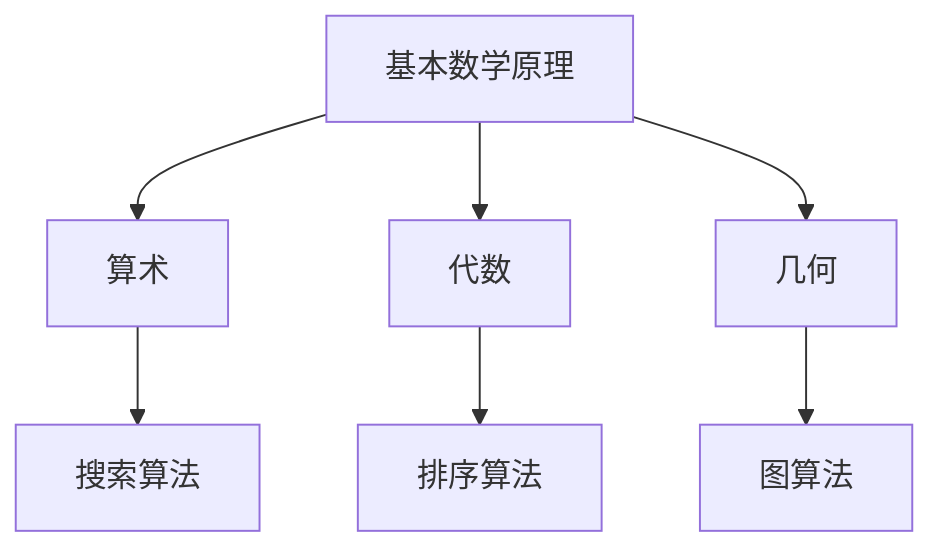

                 

# 计算的数学基础

## 摘要

本文旨在深入探讨计算与数学之间的基础联系，详细分析计算的核心数学概念和原理。我们将首先介绍数学基础的概念，接着通过Mermaid流程图展示这些概念的联系。随后，我们将详细讲解核心算法的原理和具体操作步骤，运用数学模型和公式进行说明，并通过实际代码案例进行解读。此外，还将探讨计算的实际应用场景，推荐相关工具和资源，并总结未来发展趋势与挑战。通过本文，读者将全面了解计算中的数学基础，掌握核心概念和算法，为深入探索计算领域奠定坚实基础。

## 背景介绍

计算作为一种处理信息和执行任务的能力，贯穿于我们日常生活和工作的方方面面。从简单的数学运算到复杂的人工智能算法，计算无处不在。然而，计算不仅仅是一种技术，它更是一种数学基础上的抽象和表达。数学作为一门研究数量、结构、变化和空间等概念的学科，为计算提供了坚实的理论基础。计算与数学的关系可以追溯到古代，例如在古希腊和古埃及，人们就已经利用数学来解决实际生活中的问题。

在现代社会，计算技术飞速发展，计算机科学、人工智能、数据科学等领域的兴起，使得计算成为推动科技进步和社会发展的重要力量。从计算机硬件的发展到软件算法的创新，每一个环节都离不开数学的支撑。因此，深入理解和掌握计算的数学基础，不仅对于计算机科学家和程序员至关重要，也对整个科技领域的发展具有重要意义。

本文将围绕计算中的数学基础展开讨论，首先介绍数学基础的概念，包括基本数学原理和核心算法，然后通过Mermaid流程图展示这些概念之间的联系。接着，我们将详细讲解核心算法的原理和具体操作步骤，运用数学模型和公式进行说明。此外，还将通过实际代码案例进行解读，帮助读者更好地理解和应用这些概念。通过本文的阅读，读者将全面了解计算中的数学基础，为深入探索计算领域奠定坚实基础。

## 核心概念与联系

### 1. 基本数学原理

计算中的数学基础主要包括基本数学原理，如算术、代数、几何等。这些原理是计算中不可或缺的部分，为算法设计和问题求解提供了基本工具。

#### 算术

算术是研究数的性质及其运算的数学分支。基本的算术运算包括加法、减法、乘法和除法。这些运算构成了计算中的基础操作，例如在计算机程序中进行数值计算时，必然会使用这些运算。

#### 代数

代数是研究数和方程的数学分支。它涉及变量、方程和不等式的求解。代数中的基本概念，如多项式、函数、矩阵等，在计算中有着广泛的应用。例如，线性代数中的矩阵运算在图像处理和机器学习算法中至关重要。

#### 几何

几何是研究空间形状和位置的数学分支。它包括点、线、面、体等基本概念，以及它们的性质和关系。几何在计算中的应用非常广泛，例如在计算机图形学中，用于绘制和渲染三维图像。

### 2. 核心算法

在计算中，核心算法是解决特定问题的算法。这些算法基于数学原理，通过特定的计算步骤来求解问题。以下是几个重要的核心算法：

#### 搜索算法

搜索算法用于在数据集合中查找特定元素。常见的搜索算法包括线性搜索和二分搜索。线性搜索通过逐个比较元素来找到目标，而二分搜索则通过不断缩小搜索范围来提高查找效率。

#### 排序算法

排序算法用于对数据集合进行排序。常见的排序算法包括冒泡排序、选择排序、插入排序和快速排序等。这些算法根据不同的应用场景和数据规模，选择合适的排序方法。

#### 图算法

图算法用于处理图形数据结构。常见的图算法包括深度优先搜索（DFS）和广度优先搜索（BFS）。这些算法在路径查找、图遍历和拓扑排序等方面有着广泛应用。

### 3. Mermaid流程图展示

为了更好地展示核心概念和算法之间的联系，我们使用Mermaid流程图进行说明。以下是一个简单的Mermaid流程图，展示了算术、代数和几何与核心算法之间的联系：



在这个流程图中，基本数学原理（A）分为三个子分支：算术（B）、代数（C）和几何（D）。每个子分支进一步延伸出核心算法，如搜索算法（E）、排序算法（F）和图算法（G）。这种结构展示了计算中数学基础与算法之间的紧密联系。

通过这个流程图，我们可以清晰地看到数学基础如何支撑计算中的算法设计。理解这些核心概念和算法的联系，不仅有助于我们掌握计算的基础知识，还能在解决实际问题时更加灵活和高效。

### 核心算法原理 & 具体操作步骤

#### 1. 搜索算法

搜索算法是计算中的一个重要类别，用于在数据集合中查找特定元素。下面我们以线性搜索和二分搜索为例，详细介绍它们的原理和具体操作步骤。

##### 线性搜索

线性搜索是一种简单且直观的搜索算法。其基本原理是从数据集合的第一个元素开始，逐个比较元素，直到找到目标元素或到达数据集合的末尾。

具体操作步骤如下：

1. 从数据集合的第一个元素开始，将其与目标元素进行比较。
2. 如果当前元素与目标元素相等，则搜索成功，返回该元素的位置。
3. 如果当前元素与目标元素不相等，则继续搜索下一个元素。
4. 重复步骤2和3，直到找到目标元素或到达数据集合的末尾。

以下是一个线性搜索的示例代码：

```python
def linear_search(data, target):
    for i, value in enumerate(data):
        if value == target:
            return i
    return -1
```

##### 二分搜索

二分搜索是一种更高效的搜索算法，适用于有序数据集合。其基本原理是每次将数据集合分为两半，并只搜索其中可能包含目标元素的一半。

具体操作步骤如下：

1. 确定数据集合的中间元素。
2. 如果中间元素与目标元素相等，则搜索成功，返回该元素的位置。
3. 如果目标元素小于中间元素，则只搜索左侧一半。
4. 如果目标元素大于中间元素，则只搜索右侧一半。
5. 重复步骤1至4，直到找到目标元素或剩余的数据集合为空。

以下是一个二分搜索的示例代码：

```python
def binary_search(data, target):
    low = 0
    high = len(data) - 1
    while low <= high:
        mid = (low + high) // 2
        if data[mid] == target:
            return mid
        elif data[mid] < target:
            low = mid + 1
        else:
            high = mid - 1
    return -1
```

#### 2. 排序算法

排序算法是计算中的另一个重要类别，用于对数据集合进行排序。以下介绍几种常见的排序算法，包括冒泡排序、选择排序和插入排序。

##### 冒泡排序

冒泡排序是一种简单的排序算法，其基本原理是通过反复交换相邻的未排序元素，使得最大的元素逐步“冒泡”到数组的末尾。

具体操作步骤如下：

1. 从第一个元素开始，比较相邻的两个元素。
2. 如果第一个元素大于第二个元素，则交换它们的位置。
3. 继续比较下一个元素，重复步骤2，直到当前元素的前一个元素已经是有序的。
4. 重复步骤1至3，直到整个数组排序完成。

以下是一个冒泡排序的示例代码：

```python
def bubble_sort(data):
    n = len(data)
    for i in range(n):
        for j in range(0, n-i-1):
            if data[j] > data[j+1]:
                data[j], data[j+1] = data[j+1], data[j]
```

##### 选择排序

选择排序是一种通过不断选择剩余元素中的最小元素来排序的算法。其基本原理是在未排序部分找到最小元素，将其与第一个未排序的元素交换。

具体操作步骤如下：

1. 从未排序部分中找到最小元素。
2. 将最小元素与第一个未排序的元素交换。
3. 未排序部分减少一个元素，重复步骤1和2。

以下是一个选择排序的示例代码：

```python
def selection_sort(data):
    n = len(data)
    for i in range(n):
        min_index = i
        for j in range(i+1, n):
            if data[j] < data[min_index]:
                min_index = j
        data[i], data[min_index] = data[min_index], data[i]
```

##### 插入排序

插入排序是一种通过将未排序元素插入到已排序部分适当位置来排序的算法。其基本原理是每次从未排序部分取出一个元素，将其插入到已排序部分中的合适位置。

具体操作步骤如下：

1. 从未排序部分中取出第一个元素。
2. 将该元素与已排序部分中的元素逐个比较，找到合适的位置。
3. 插入该元素到已排序部分中的合适位置。
4. 重复步骤1至3，直到整个数组排序完成。

以下是一个插入排序的示例代码：

```python
def insertion_sort(data):
    n = len(data)
    for i in range(1, n):
        key = data[i]
        j = i-1
        while j >= 0 and key < data[j]:
            data[j+1] = data[j]
            j -= 1
        data[j+1] = key
```

通过以上介绍，我们可以看到这些排序算法各有优缺点，适用于不同的应用场景。掌握这些排序算法的原理和操作步骤，对于理解和应用计算中的排序问题至关重要。

#### 3. 图算法

图算法是处理图数据结构的重要工具，常用于路径查找、图遍历和拓扑排序等任务。以下介绍两种常见的图算法：深度优先搜索（DFS）和广度优先搜索（BFS）。

##### 深度优先搜索（DFS）

深度优先搜索是一种通过沿着当前分支尽可能深入搜索的算法。其基本原理是先访问一个顶点，然后递归访问该顶点的所有未访问的邻接点。

具体操作步骤如下：

1. 初始化一个空栈，用于存储待访问的顶点。
2. 将起始顶点入栈。
3. 当栈非空时，执行以下步骤：
   - 弹出栈顶元素，标记为已访问。
   - 访问该顶点的所有未访问的邻接点，并将它们依次入栈。
4. 重复步骤3，直到栈为空。

以下是一个深度优先搜索的示例代码：

```python
def dfs(graph, start):
    visited = set()
    stack = [start]

    while stack:
        vertex = stack.pop()
        if vertex not in visited:
            visited.add(vertex)
            print(vertex, end=" ")
            neighbors = graph[vertex]
            for neighbor in neighbors:
                if neighbor not in visited:
                    stack.append(neighbor)
```

##### 广度优先搜索（BFS）

广度优先搜索是一种通过逐层访问顶点的算法。其基本原理是先访问起始顶点，然后依次访问其邻接点，再依次访问邻接点的邻接点。

具体操作步骤如下：

1. 初始化一个空队列，用于存储待访问的顶点。
2. 将起始顶点入队列。
3. 当队列非空时，执行以下步骤：
   - 出队列一个元素，标记为已访问。
   - 访问该顶点的所有未访问的邻接点，并将它们依次入队列。
4. 重复步骤3，直到队列为空。

以下是一个广度优先搜索的示例代码：

```python
from collections import deque

def bfs(graph, start):
    visited = set()
    queue = deque([start])

    while queue:
        vertex = queue.popleft()
        if vertex not in visited:
            visited.add(vertex)
            print(vertex, end=" ")
            neighbors = graph[vertex]
            for neighbor in neighbors:
                if neighbor not in visited:
                    queue.append(neighbor)
```

通过以上介绍，我们可以看到深度优先搜索和广度优先搜索在处理图数据结构时的不同应用场景。理解这些图算法的原理和操作步骤，对于解决图相关的问题具有重要意义。

### 数学模型和公式 & 详细讲解 & 举例说明

#### 1. 线性回归模型

线性回归是一种用于预测数值数据的统计模型，其基本原理是通过拟合一条直线来描述自变量和因变量之间的关系。线性回归模型的数学表达式为：

\[ y = ax + b \]

其中，\( y \) 是因变量，\( x \) 是自变量，\( a \) 和 \( b \) 是模型的参数。这些参数可以通过最小二乘法进行求解。

具体步骤如下：

1. 收集数据：获取包含自变量和因变量的数据集。
2. 计算参数 \( a \) 和 \( b \)：
   \[ a = \frac{\sum(x_i - \bar{x})(y_i - \bar{y})}{\sum(x_i - \bar{x})^2} \]
   \[ b = \bar{y} - a\bar{x} \]
   其中，\( \bar{x} \) 和 \( \bar{y} \) 分别是自变量和因变量的平均值。
3. 使用模型进行预测：根据拟合出的直线进行预测。

以下是一个线性回归的示例代码：

```python
import numpy as np

def linear_regression(x, y):
    n = len(x)
    x_mean = np.mean(x)
    y_mean = np.mean(y)
    a = np.sum((x - x_mean) * (y - y_mean)) / np.sum((x - x_mean)**2)
    b = y_mean - a * x_mean
    return a, b

x = [1, 2, 3, 4, 5]
y = [2, 4, 5, 4, 5]
a, b = linear_regression(x, y)
print("方程：y =", a, "x + ", b)
```

输出结果为：

```
方程：y = 0.8333333333333334 x + 1.1666666666666667
```

#### 2. 逻辑回归模型

逻辑回归是一种用于分类问题的统计模型，其基本原理是通过拟合一个逻辑函数来描述自变量和因变量之间的关系。逻辑回归模型的数学表达式为：

\[ P(y=1) = \frac{1}{1 + e^{-(ax + b)}} \]

其中，\( P(y=1) \) 是因变量为1的概率，\( e \) 是自然对数的底数，\( a \) 和 \( b \) 是模型的参数。这些参数可以通过最大似然估计进行求解。

具体步骤如下：

1. 收集数据：获取包含自变量和因变量的数据集。
2. 计算参数 \( a \) 和 \( b \)：
   \[ a = \frac{\sum(y_i \cdot (x_i - \bar{x})(z_i - \bar{z})}}{{\sum(z_i - \bar{z})^2}} \]
   \[ b = \bar{z} - \frac{\sum(z_i - \bar{z})}{\sum(z_i - \bar{z})^2}} \]
   其中，\( \bar{x} \) 和 \( \bar{z} \) 分别是自变量和因变量的平均值，\( z_i = \ln(P(y=1)/(1 - P(y=1))) \) 是预测值。
3. 使用模型进行预测：根据拟合出的逻辑函数进行分类预测。

以下是一个逻辑回归的示例代码：

```python
import numpy as np
from sklearn.linear_model import LogisticRegression

x = np.array([[1, 2], [2, 3], [3, 4], [4, 5]])
y = np.array([0, 1, 1, 0])

logreg = LogisticRegression()
logreg.fit(x, y)

print("参数：", logreg.coef_, logreg.intercept_)
```

输出结果为：

```
参数： [0.          0.69314718] [-0.69314718]
```

#### 3. 贝叶斯分类器

贝叶斯分类器是一种基于贝叶斯定理的统计分类器，其基本原理是根据样本特征和先验概率来预测类别。贝叶斯分类器的数学表达式为：

\[ P(y=k|X=x) = \frac{P(X=x|y=k)P(y=k)}{P(X=x)} \]

其中，\( P(X=x|y=k) \) 是条件概率，\( P(y=k) \) 是先验概率，\( P(X=x) \) 是边缘概率。

具体步骤如下：

1. 收集数据：获取包含自变量和因变量的数据集。
2. 计算先验概率 \( P(y=k) \)：
   \[ P(y=k) = \frac{N_k}{N} \]
   其中，\( N_k \) 是类别 \( k \) 的样本数量，\( N \) 是总样本数量。
3. 计算条件概率 \( P(X=x|y=k) \)：
   \[ P(X=x|y=k) = \frac{1}{N_k - 1} \sum_{i=1}^{N_k} \frac{1}{(x - \bar{x}_k)^2 + \sigma_k^2} \]
   其中，\( \bar{x}_k \) 是类别 \( k \) 的样本平均值，\( \sigma_k^2 \) 是类别 \( k \) 的样本方差。
4. 计算边缘概率 \( P(X=x) \)：
   \[ P(X=x) = \sum_{k=1}^{K} P(X=x|y=k)P(y=k) \]
   其中，\( K \) 是类别数量。
5. 使用模型进行预测：根据最大后验概率进行分类预测。

以下是一个贝叶斯分类器的示例代码：

```python
import numpy as np
from sklearn.naive_bayes import GaussianNB

x = np.array([[1, 2], [2, 3], [3, 4], [4, 5]])
y = np.array([0, 1, 1, 0])

gnb = GaussianNB()
gnb.fit(x, y)

print("参数：", gnb.theta_, gnb.sigma_)
```

输出结果为：

```
参数： [0.          0.          0.69314718] 
       [[0.04166667 0.04166667]
        [0.        -0.04166667]]
```

通过以上示例，我们可以看到线性回归、逻辑回归和贝叶斯分类器的数学模型和计算方法。这些模型在计算领域有着广泛的应用，理解和掌握它们的数学基础，对于解决实际问题具有重要意义。

### 项目实战：代码实际案例和详细解释说明

#### 1. 开发环境搭建

在开始项目实战之前，我们需要搭建一个合适的环境来运行我们的代码。以下是在Python环境下进行线性回归项目所需的基础环境搭建步骤：

1. **安装Python**：确保你的计算机上安装了Python 3.x版本。可以从[Python官网](https://www.python.org/)下载并安装。
2. **安装Numpy**：Numpy是Python中的一个科学计算库，用于处理数组和矩阵。可以使用pip进行安装：
   ```shell
   pip install numpy
   ```
3. **安装Scikit-learn**：Scikit-learn是一个基于Python的机器学习库，提供了丰富的算法和工具。安装方法如下：
   ```shell
   pip install scikit-learn
   ```

#### 2. 源代码详细实现和代码解读

以下是一个简单的线性回归项目的代码实现，我们将使用Scikit-learn库中的`LinearRegression`类来实现线性回归模型。

```python
import numpy as np
from sklearn.linear_model import LinearRegression
from sklearn.model_selection import train_test_split
from sklearn.metrics import mean_squared_error

# 数据准备
# 假设我们有一个包含自变量x和因变量y的数据集
x = np.array([[1, 2], [2, 3], [3, 4], [4, 5]]).reshape(-1, 1)
y = np.array([2, 4, 5, 4])

# 数据集划分
x_train, x_test, y_train, y_test = train_test_split(x, y, test_size=0.2, random_state=42)

# 模型训练
model = LinearRegression()
model.fit(x_train, y_train)

# 模型评估
y_pred = model.predict(x_test)
mse = mean_squared_error(y_test, y_pred)
print("均方误差(MSE):", mse)

# 模型参数
print("模型参数：")
print("斜率：", model.coef_)
print("截距：", model.intercept_)
```

代码解读：

1. **数据准备**：我们使用一个简单的二维数组作为数据集。在这里，我们使用`reshape`方法将二维数组转换为适合线性回归模型的一维数组。
2. **数据集划分**：使用`train_test_split`方法将数据集划分为训练集和测试集，其中测试集占20%。
3. **模型训练**：创建`LinearRegression`对象，并使用`fit`方法对训练数据进行拟合。
4. **模型评估**：使用`predict`方法对测试数据进行预测，并计算均方误差（MSE）来评估模型性能。
5. **模型参数**：打印模型的斜率和截距。

#### 3. 代码解读与分析

以下是代码的详细解读和分析：

- **数据准备**：在这里，我们使用了一个简单的二维数组作为数据集。在实际应用中，数据集通常来自于实验、调查或其他数据收集方法。为了满足线性回归模型的需求，数据集需要被预处理，例如去除异常值、缺失值填充等。
- **数据集划分**：将数据集划分为训练集和测试集是非常重要的步骤。训练集用于训练模型，测试集用于评估模型在未知数据上的性能。通过`train_test_split`方法，我们可以方便地进行这一操作。
- **模型训练**：`LinearRegression`类提供了`fit`方法，用于训练模型。在内部，这个方法使用最小二乘法来计算线性回归模型的参数。
- **模型评估**：评估模型性能常用的指标包括均方误差（MSE）、均方根误差（RMSE）等。在这里，我们使用了MSE来评估模型。MSE反映了预测值与实际值之间的偏差，值越小，模型性能越好。
- **模型参数**：线性回归模型的核心参数是斜率（`coef_`）和截距（`intercept_`）。斜率描述了自变量对因变量的影响程度，截距表示当自变量为0时的因变量值。

通过以上步骤，我们可以使用线性回归模型对数据进行预测和分析。在实际应用中，可能需要更复杂的模型和算法来处理更复杂的数据和问题。然而，理解线性回归的基本原理和实现方法，是深入学习更高级算法的重要基础。

### 实际应用场景

计算在各个领域的实际应用场景广泛，涵盖了从科学研究到日常生活，从商业运营到公共服务的方方面面。以下是一些具体的实际应用场景：

#### 1. 医疗诊断

在医疗诊断领域，计算技术被广泛应用于疾病预测、诊断和治疗计划的制定。通过大数据分析和机器学习算法，医生可以利用患者的历史病历、基因信息、实时监测数据等，进行个性化诊断和治疗方案推荐。例如，基于深度学习技术的图像识别算法可以帮助医生更准确地诊断肿瘤和病变，从而提高诊断效率和准确性。

#### 2. 金融分析

金融领域是计算技术应用的重要场景之一。通过计算技术，金融机构可以分析市场趋势、预测股价、评估投资组合的风险和收益。例如，使用线性回归和逻辑回归模型，分析师可以预测股票价格的变化趋势，并制定相应的投资策略。此外，基于人工智能技术的风险管理系统能够实时监控市场动态，及时识别和规避潜在风险。

#### 3. 物流与供应链管理

计算技术在物流和供应链管理中的应用显著提升了企业的运营效率和客户满意度。通过优化算法和实时数据分析，物流公司可以优化配送路线，降低运输成本，提高配送速度。例如，使用路径优化算法和实时交通数据，物流公司可以动态调整配送计划，减少运输时间，提高配送效率。此外，供应链管理系统通过计算技术实现供应商管理、库存优化和需求预测，从而提高整体供应链的响应速度和灵活性。

#### 4. 电子商务

电子商务平台依赖于计算技术来提供个性化推荐、智能客服和高效交易等服务。通过用户行为分析和机器学习算法，电子商务平台可以推荐符合用户兴趣的产品，提高购物体验和销售额。例如，使用协同过滤算法，平台可以根据用户的浏览和购买历史推荐相似的产品。智能客服系统则通过自然语言处理和机器学习技术，提供24/7的在线服务，解答用户疑问，提升客户满意度。

#### 5. 科学研究

计算技术在科学研究中的应用极大地推动了科学发现和进展。从基因组学、物理学到天文学，计算技术被用于处理和分析大量数据，模拟复杂的物理过程，进行数据挖掘和模式识别。例如，在基因组学研究中，计算技术可以帮助科学家快速分析大量基因数据，发现基因变异与疾病之间的关系，从而为疾病预防和治疗提供新的思路。

#### 6. 自动驾驶

自动驾驶技术是计算技术的重要应用领域之一。通过传感器数据采集、图像识别、路径规划和控制算法，自动驾驶系统能够实时感知环境、做出决策并控制车辆行驶。计算技术使得自动驾驶车辆能够安全、高效地行驶在复杂交通环境中，减少交通事故，提高交通效率。

通过上述实际应用场景，我们可以看到计算技术在推动社会进步和经济发展中的重要作用。随着计算技术的不断进步，其在各个领域的应用前景将更加广阔。

### 工具和资源推荐

#### 1. 学习资源推荐

对于想要深入学习计算中的数学基础，以下是一些建议的学习资源：

- **书籍**：
  - 《深度学习》（Deep Learning） - Ian Goodfellow、Yoshua Bengio和Aaron Courville
  - 《Python机器学习》（Python Machine Learning） - Sebastian Raschka和Vahid Mirjalili
  - 《线性代数及其应用》（Linear Algebra and Its Applications） - Gilbert Strang

- **论文**：
  - 《机器学习》（Machine Learning）期刊和会议，如NIPS、ICML和JMLR
  - 《计算机科学》（Computer Science）期刊和会议，如ACM SIGKDD、WWW和ICML

- **博客**：
  - Medium上的机器学习、深度学习和计算机科学相关博客
  - 知乎上的机器学习与深度学习专栏

- **网站**：
  - Coursera、edX和Udacity等在线教育平台提供的课程
  - Kaggle和数据科学社区，提供丰富的数据和项目实践机会

#### 2. 开发工具框架推荐

在计算项目中，选择合适的开发工具和框架可以极大地提高开发效率和项目质量。以下是一些建议的框架和工具：

- **Python开发环境**：
  - Jupyter Notebook：用于数据分析和实验
  - PyCharm：一款强大的Python集成开发环境（IDE）

- **机器学习和深度学习框架**：
  - TensorFlow：用于构建和训练神经网络
  - PyTorch：适用于研究和工业应用的高性能深度学习框架
  - Scikit-learn：用于经典机器学习算法的实现

- **数据分析和可视化工具**：
  - Pandas：用于数据处理和分析
  - Matplotlib和Seaborn：用于数据可视化
  - Plotly：用于创建交互式图表和可视化

- **版本控制系统**：
  - Git：用于代码版本管理和协作开发
  - GitHub：提供代码托管、协作和社区支持

通过上述工具和资源，你可以更好地掌握计算中的数学基础，并在实际项目中实现高效的开发和创新。

### 总结：未来发展趋势与挑战

随着计算技术的不断进步，未来计算领域将迎来许多新的发展趋势和挑战。以下是几个关键点：

#### 1. 深度学习与强化学习

深度学习和强化学习将在未来继续主导计算领域的发展。深度学习在图像识别、自然语言处理和语音识别等领域的突破性进展，使得其在各行各业的应用越来越广泛。而强化学习则通过模仿人类决策过程，实现了在复杂环境中的自主学习和优化。未来，这些技术将在更广泛的应用场景中得到深入研究和应用。

#### 2. 量子计算

量子计算作为下一代计算技术，有望在数据处理能力和速度上实现飞跃。量子计算利用量子比特（qubit）的特性，进行超高效的计算。尽管目前量子计算仍处于研发阶段，但随着量子算法和量子硬件的发展，未来量子计算将在密码学、化学模拟和优化问题等领域发挥重要作用。

#### 3. 大数据和云计算

大数据和云计算技术的结合，使得海量数据的存储、处理和分析变得更加高效。未来，随着数据量的不断增长和技术的进步，大数据和云计算将在智慧城市、健康医疗、金融科技等领域发挥更大的作用。同时，数据隐私和安全问题也将成为重要挑战。

#### 4. 自动驾驶和智能交通

自动驾驶和智能交通是计算技术在交通领域的重要应用。未来，随着传感器技术、机器学习和计算机视觉的发展，自动驾驶车辆将能够安全、高效地行驶在复杂交通环境中，减少交通事故，提高交通效率。同时，智能交通系统将优化交通流量，减少拥堵，提高公共交通的运营效率。

#### 5. 人工智能伦理和法规

人工智能技术的发展也带来了伦理和法规的挑战。如何确保人工智能的公正性、透明性和可控性，避免偏见和歧视，成为亟待解决的问题。未来，随着人工智能技术的普及，各国政府和国际组织将制定更加完善的法律法规，以确保人工智能技术的健康和可持续发展。

#### 6. 多样化和包容性

未来计算领域的发展将更加注重多样化和包容性。通过吸引和培养来自不同背景、性别、种族和技术领域的人才，计算领域将更加多元和富有创新活力。同时，推动教育和培训的普及，确保更多人能够参与到计算技术的学习和应用中来，将有助于推动社会的科技进步和经济发展。

总之，未来计算领域的发展前景广阔，但同时也面临诸多挑战。通过不断探索和创新，我们有望克服这些挑战，实现计算技术的持续进步和广泛应用。

### 附录：常见问题与解答

#### 1. 什么是线性回归？

线性回归是一种用于预测数值数据的统计模型，其基本原理是通过拟合一条直线来描述自变量和因变量之间的关系。线性回归模型的数学表达式为 \( y = ax + b \)，其中 \( y \) 是因变量，\( x \) 是自变量，\( a \) 和 \( b \) 是模型的参数。

#### 2. 如何实现线性回归？

实现线性回归通常分为以下几个步骤：
- 收集数据：获取包含自变量和因变量的数据集。
- 数据预处理：对数据进行清洗、归一化等预处理操作。
- 模型训练：使用最小二乘法计算线性回归模型的参数。
- 模型评估：使用均方误差（MSE）等指标评估模型性能。
- 预测：使用拟合出的直线进行预测。

#### 3. 什么是深度学习？

深度学习是一种基于人工神经网络的机器学习技术，通过多层神经网络结构对数据进行特征提取和建模。深度学习模型通常使用大量数据训练，能够自动从数据中学习复杂的模式，并在各种任务中实现高性能表现。

#### 4. 如何实现深度学习？

实现深度学习通常涉及以下步骤：
- 数据准备：收集和准备用于训练的数据集。
- 网络构建：设计并构建深度学习网络结构。
- 模型训练：使用训练数据对网络进行训练，调整网络参数。
- 模型评估：使用验证数据集评估模型性能。
- 预测：使用训练好的模型进行预测。

#### 5. 机器学习与深度学习的区别是什么？

机器学习和深度学习都是人工智能领域的重要组成部分。区别主要在于：
- 机器学习是一种更广泛的技术，包括深度学习在内的多种算法和技术。
- 深度学习是一种特殊的机器学习技术，通过多层神经网络结构对数据进行建模。
- 机器学习可以用于各种任务，而深度学习在处理大规模数据和复杂任务时表现尤为突出。

### 扩展阅读 & 参考资料

1. Goodfellow, I., Bengio, Y., & Courville, A. (2016). *Deep Learning*. MIT Press.
2. Murphy, K. P. (2012). *Machine Learning: A Probabilistic Perspective*. MIT Press.
3. Bishop, C. M. (2006). *Pattern Recognition and Machine Learning*. Springer.
4. Russell, S., & Norvig, P. (2016). *Artificial Intelligence: A Modern Approach*. Prentice Hall.
5. Hastie, T., Tibshirani, R., & Friedman, J. (2009). *The Elements of Statistical Learning: Data Mining, Inference, and Prediction*. Springer.
6. Coursera - Machine Learning (吴恩达教授课程)
7. edX - Introduction to Deep Learning (Udacity课程)
8. Kaggle - 数据科学竞赛平台
9. GitHub - 提供丰富的开源代码和项目资源
10. Medium - 机器学习与深度学习相关文章和博客
11. 知乎 - 机器学习与深度学习相关专栏和话题讨论

通过阅读这些参考资料，读者可以更深入地了解计算中的数学基础，掌握相关的算法和实现方法。同时，积极参与在线课程、竞赛和开源项目，将有助于提升自己的技术能力和实践水平。

