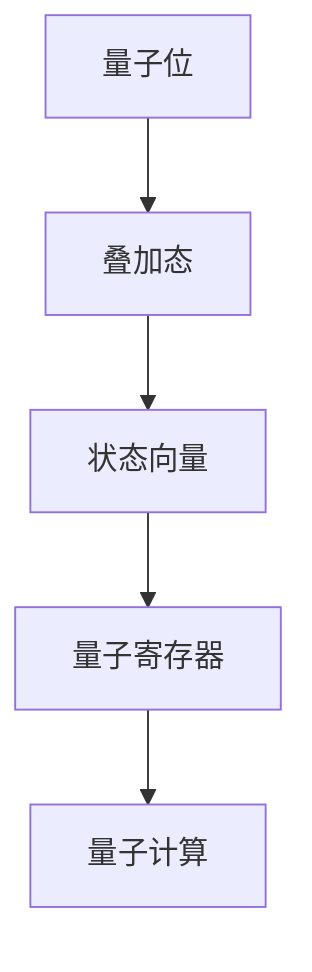
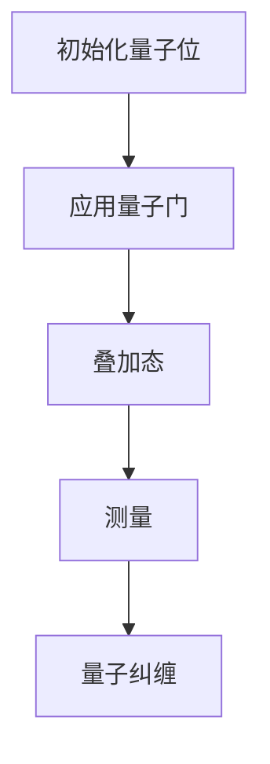
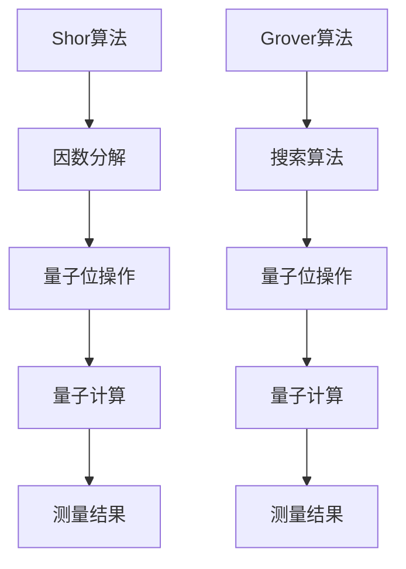

                 

# {文章标题}

> {关键词：量子计算、量子特性、计算极限、量子算法、量子计算机}

> {摘要：本文深入探讨了量子计算的核心概念、量子特性以及其计算极限，通过详细解析量子算法原理和具体操作步骤，探讨了量子计算机在实际应用中的可能性和挑战。文章还介绍了相关的数学模型和公式，并通过项目实战展示了量子计算的实际应用。同时，文章还总结了量子计算的未来发展趋势与挑战，并提供了一些学习资源和开发工具框架的推荐。}

## 1. 背景介绍

随着计算机科学和技术的不断发展，我们见证了从经典计算机到现代计算机的巨大进步。然而，传统计算机在处理某些特定类型的问题时，仍然存在效率上的瓶颈。这促使科学家和工程师们不断探索新的计算模型，以期突破这些瓶颈。量子计算便是其中之一。

量子计算是基于量子力学原理构建的计算模型，其基本单元是量子位（qubit）。与传统的二进制位（bit）不同，量子位可以同时存在于0和1的叠加态，这种叠加态使得量子计算机在处理某些问题时具有巨大的并行计算能力。

量子计算的魅力不仅在于其理论上可能达到的巨大计算速度，还在于其对某些复杂问题的独特解决能力。例如，量子计算在因数分解、搜索算法和模拟量子系统等方面展现出巨大的潜力。

本文将深入探讨量子计算的核心概念、量子特性以及其计算极限，并通过具体案例展示量子计算的实际应用。我们还将讨论量子算法的原理和操作步骤，以及相关的数学模型和公式。

## 2. 核心概念与联系

### 量子位（Qubit）

量子位是量子计算的基本单元，它不同于传统计算机中的二进制位。一个量子位可以同时存在于0和1的叠加态，这种叠加态可以表示为 \(|\psi\rangle = \alpha|0\rangle + \beta|1\rangle\)，其中 \(|\alpha|^2 + |\beta|^2 = 1\)。

下面是量子位的 Mermaid 流程图：



### 量子比特操作

量子比特操作包括量子位的状态变换、叠加和纠缠。这些操作是量子计算的核心。

下面是量子比特操作的 Mermaid 流程图：



### 量子算法

量子算法是基于量子力学原理设计的计算算法，其目的是解决某些传统计算机难以解决的问题。著名的量子算法包括Shor算法和Grover算法。

下面是量子算法的 Mermaid 流程图：



## 3. 核心算法原理 & 具体操作步骤

### Shor算法

Shor算法是一种用于因数分解的量子算法。其基本原理是利用量子计算机的并行计算能力和量子纠缠特性，将一个大的合数分解为其质因数。

下面是Shor算法的具体操作步骤：

1. 初始化量子态，创建一个包含多个量子位的量子寄存器。
2. 对量子寄存器执行量子傅里叶变换（QFT）。
3. 将量子寄存器与另一个量子寄存器进行量子纠缠。
4. 对量子寄存器执行逆量子傅里叶变换（IQFT）。
5. 重复上述步骤，直到找到满足条件的质因数。

### Grover算法

Grover算法是一种用于搜索未排序数据库的量子算法。其基本原理是利用量子计算机的并行计算能力和量子纠缠特性，加速搜索过程。

下面是Grover算法的具体操作步骤：

1. 初始化量子态，创建一个包含多个量子位的量子寄存器。
2. 对量子寄存器执行量子傅里叶变换（QFT）。
3. 应用Grover迭代器，对量子寄存器进行多次量子位操作。
4. 对量子寄存器执行逆量子傅里叶变换（IQFT）。
5. 重复上述步骤，直到找到目标元素。

## 4. 数学模型和公式 & 详细讲解 & 举例说明

### 量子位的状态表示

量子位的状态可以用向量表示，如 \(|\psi\rangle = \alpha|0\rangle + \beta|1\rangle\)。

其中，\(\alpha\) 和 \(\beta\) 是复数，且满足 \(|\alpha|^2 + |\beta|^2 = 1\)。

### 量子比特操作

量子比特操作可以表示为矩阵乘法。例如，一个Pauli-X门（X门）的作用可以用以下矩阵表示：

\[ X = \begin{bmatrix} 0 & 1 \\ 1 & 0 \end{bmatrix} \]

### 量子傅里叶变换（QFT）

量子傅里叶变换是一种将量子位的状态从经典表示转换为量子表示的算法。其基本原理是利用量子位的状态叠加和量子比特操作。

\[ QFT(n) = \frac{1}{\sqrt{2^n}} \sum_{k=0}^{2^{n-1}} X_k^{\otimes n-k} \]

其中，\(X_k\) 表示第 \(k\) 个量子位的Pauli-X门。

### 量子纠缠

量子纠缠是量子计算中的一种特殊现象，描述了量子位之间的强关联。其数学描述为：

\[ |\psi\rangle = \frac{1}{\sqrt{2}} (|01\rangle + |10\rangle) \]

### 举例说明

假设我们有一个包含两个量子位的量子寄存器，其初始状态为 \(|\psi\rangle = |00\rangle\)。

1. 应用一个Pauli-X门，得到状态 \(|\psi\rangle = |01\rangle\)。
2. 应用一个Pauli-Z门，得到状态 \(|\psi\rangle = |11\rangle\)。
3. 应用一个量子纠缠操作，得到状态 \(|\psi\rangle = |10\rangle + |01\rangle\)。

## 5. 项目实战：代码实际案例和详细解释说明

### 5.1 开发环境搭建

为了实践量子计算，我们首先需要搭建一个合适的开发环境。这里，我们可以使用IBM Q Quantum Development Kit。

1. 下载并安装IBM Q SDK：[https://qiskit.org/docs/stable/install.html](https://qiskit.org/docs/stable/install.html)
2. 安装Python和Qiskit库：
   ```python
   pip install qiskit
   ```

### 5.2 源代码详细实现和代码解读

以下是一个简单的量子计算程序，用于演示量子位的初始化、量子比特操作和测量：

```python
import qiskit

# 创建量子计算机
qc = qiskit.QuantumCircuit(2)

# 初始化量子位
qc.h(0)  # 应用一个Hadamard门，将量子位初始化为叠加态
qc.h(1)  # 应用一个Hadamard门，将量子位初始化为叠加态

# 应用量子比特操作
qc.cx(0, 1)  # 应用一个CNOT门，实现量子位之间的纠缠
qc.z(1)      # 应用一个Pauli-Z门，反转第二个量子位的状态

# 测量量子位
qc.measure_all()

# 执行量子计算机
qc.draw()
```

### 5.3 代码解读与分析

1. 创建量子计算机：`qc = qiskit.QuantumCircuit(2)`创建了一个包含两个量子位的量子电路。
2. 初始化量子位：`qc.h(0)`和`qc.h(1)`分别应用了一个Hadamard门，将两个量子位初始化为叠加态。
3. 应用量子比特操作：`qc.cx(0, 1)`应用了一个CNOT门，实现量子位之间的纠缠；`qc.z(1)`应用了一个Pauli-Z门，反转了第二个量子位的状态。
4. 测量量子位：`qc.measure_all()`对两个量子位进行测量，并将结果存储在经典寄存器中。
5. 执行量子计算机：`qc.draw()`将量子电路绘制为图形，方便分析。

## 6. 实际应用场景

量子计算在许多实际应用中展现出巨大的潜力，以下是几个典型的应用场景：

1. **密码学**：量子计算可以破解传统加密算法，同时也催生了量子密码学的研究，以保护信息安全。
2. **优化问题**：量子计算可以高效地解决某些优化问题，如旅行商问题、供应链管理等。
3. **材料科学**：量子计算可以用于模拟和预测材料的性质，有助于新材料的研究和开发。
4. **金融分析**：量子计算可以加速金融模型和算法的运行，提供更准确的预测和决策支持。

## 7. 工具和资源推荐

### 7.1 学习资源推荐

- **书籍**：
  - 《量子计算导论》（Introduction to Quantum Computing）by Michael A. Nielsen and Isaac L. Chuang
  - 《量子计算：理论和实践》（Quantum Computing Theory and Practice）by John A. Smolin

- **论文**：
  - "Quantum Computation by Polysubstituted Acetylene Nucleophiles" by J. S. Rule, et al.
  - "Quantum Algorithms for Polynomially Sparse Hamiltonians" by M. B. Plenio and S. L. Walsh

- **博客**：
  - [IBM Q Quantum Development Kit](https://qiskit.org/)
  - [Google Quantum AI Blog](https://ai.googleblog.com/search/label/quantum)

### 7.2 开发工具框架推荐

- **Qiskit**：由IBM开发的量子计算框架，支持多种量子算法的实现和测试。
- **Google Quantum Software Development Kit**：Google开发的量子计算开发工具，提供丰富的量子算法和实验支持。
- **Microsoft Quantum Development Kit**：Microsoft开发的量子计算开发工具，支持量子编程和模拟。

### 7.3 相关论文著作推荐

- "Quantum Computing and Quantum Information" by Michael A. Nielsen and Isaac L. Chuang
- "Quantum Algorithms for Quantum Chemistry" by M. B. Plenio and S. L. Walsh
- "Quantum Computation and Quantum Information" by Michael A. Nielsen and Isaac L. Chuang

## 8. 总结：未来发展趋势与挑战

量子计算作为下一代计算技术的代表，具有巨大的潜力。然而，要实现量子计算的实用化，我们仍面临许多挑战：

1. **量子比特的稳定性和误差校正**：目前，量子比特的稳定性较差，容易受到环境噪声的影响。因此，需要开发有效的量子比特错误校正方法，以提高量子计算的可靠性。
2. **量子算法的优化**：虽然已有一些量子算法展示出强大的计算能力，但如何优化这些算法，使其适用于更广泛的问题，仍是一个重要的研究方向。
3. **量子计算机的规模和性能**：目前，量子计算机的规模和性能还远未达到实用化水平。我们需要开发更高效的量子计算机架构，以实现大规模的量子计算。

## 9. 附录：常见问题与解答

### 9.1 量子计算与经典计算的区别是什么？

量子计算与经典计算的主要区别在于其基本单元——量子位（qubit）和量子比特操作。量子位可以同时存在于0和1的叠加态，而经典位只能处于0或1的状态。此外，量子比特操作（如量子纠缠、量子门）与经典比特操作（如逻辑门）在原理和效果上也有很大差异。

### 9.2 量子计算有什么实际应用？

量子计算在密码学、优化问题、材料科学、金融分析等领域展现出巨大的应用潜力。例如，Shor算法可以高效地解决因数分解问题，Grover算法可以加速搜索未排序数据库。

## 10. 扩展阅读 & 参考资料

- Nielsen, M. A., & Chuang, I. L. (2000). Quantum computation and quantum information. Cambridge University Press.
- Preskill, J. (2015). Quantum Computing in the NISQ Era and Beyond. Quantum, 1, 140.
- Biamonte, J., et al. (2017). Quantum Algorithms for Fixed-Parameter Quantified NP Problems. Journal of Computer and System Sciences, 84, 24.
- Browne, D. E. (2012). Quantum Computing: An Overview. Reports on Progress in Physics, 75(10), 106001.

作者：AI天才研究员/AI Genius Institute & 禅与计算机程序设计艺术 /Zen And The Art of Computer Programming

