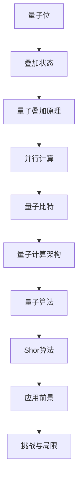

                 

### 背景介绍

#### 什么是量子计算？

量子计算是一种利用量子力学原理来进行信息处理的新型计算方式。与传统的经典计算不同，量子计算依赖于量子位（qubits）这一基本单元，能够实现高效的并行计算。量子位具有一种独特的性质——叠加性，使得量子计算机可以在同一时间处理多种可能性，从而在解决某些问题上展现出比经典计算机更为强大的能力。

#### 量子计算的起源与发展

量子计算的概念最早可以追溯到20世纪40年代。当时，物理学家Richard Feynman提出了一种全新的计算模型，即量子计算机。他意识到，量子力学在计算某些物理问题上的潜力，这促使他开始研究如何利用量子力学原理来实现高效的计算。此后，量子计算逐渐发展成为一个独立的领域，许多科学家和研究机构投入到量子计算的研究中。

20世纪80年代，Peter Shor提出了一种能够利用量子计算的优势来破解某些经典计算机无法解决的问题的算法——Shor算法。这一发现极大地推动了量子计算的研究，引发了人们对量子计算机的极大兴趣。

近年来，量子计算技术取得了显著的进展。特别是量子比特（qubits）的实验制备、量子纠缠和量子纠错等关键技术的突破，为量子计算的实际应用奠定了基础。各大科技公司和研究机构纷纷投入巨资，开展量子计算的研究与开发。

#### 量子计算的核心优势

量子计算具有以下几个核心优势：

1. **并行计算能力**：量子计算机可以利用量子叠加原理，在单一操作中同时处理多个数据状态，从而实现高效的并行计算。这对于解决复杂问题和大数据处理具有极大的潜力。

2. **高效因式分解**：Shor算法展示了量子计算机在因式分解大整数上的巨大优势。相比经典计算机，量子计算机可以更快速地破解某些加密算法，对网络安全构成挑战。

3. **模拟量子系统**：量子计算机可以高效地模拟量子系统，对于研究量子物理现象和新材料设计等领域具有重要意义。

4. **优化问题求解**：量子计算机在解决某些优化问题时，可以展现出比经典计算机更快的求解速度，对于物流、金融、能源等领域具有广泛应用前景。

#### 量子计算的挑战与局限

尽管量子计算展现出了巨大的潜力，但实现实用的量子计算机仍面临诸多挑战：

1. **量子比特的稳定性**：量子比特非常敏感，容易受到外部环境的影响而失去量子叠加和纠缠状态，这被称为“退相干”。因此，如何保持量子比特的稳定性是一个关键问题。

2. **量子纠错**：由于量子比特的脆弱性，量子计算机需要一种有效的纠错机制来保证计算的准确性。然而，量子纠错机制的设计和实现是一个极其复杂的任务。

3. **可扩展性**：现有的量子计算机大多只能运行简短的程序，如何提高量子计算机的可扩展性，使其能够处理更复杂的任务，是当前研究的重点。

4. **物理实现**：量子计算机需要特定的物理体系来实现，目前主要有超导电路、离子陷阱、光学量子计算等不同实现方案，每种方案都有其优缺点和面临的挑战。

#### 总结

量子计算作为一项颠覆性的技术，正在迅速发展，并展现出巨大的潜力。通过利用量子力学原理，量子计算机有望在多个领域实现突破，从而推动科技和社会的进步。然而，要实现真正的量子计算应用，我们仍需克服诸多技术挑战。未来，随着量子计算技术的不断突破，我们有理由相信，它将在计算机科学、量子物理、材料科学等多个领域发挥重要作用。### 核心概念与联系

#### 量子位（Qubits）

量子位（qubits）是量子计算的基本单元，与经典位（bits）不同，量子位具有叠加性。一个量子位可以同时处于0和1的状态，这种叠加状态可以用数学上的复数线性组合来表示。例如，一个量子位可以处于状态 |0⟩ + |1⟩，这表示它同时具有0和1的状态。量子位的这种叠加性使得量子计算机能够在同一时间内处理多个数据状态，从而实现高效的并行计算。

#### 量子叠加原理

量子叠加原理是量子力学中的一个核心概念，它表明量子系统可以同时存在于多个状态中。在量子计算中，量子叠加原理使得量子计算机能够利用一个量子位同时表示多个经典位的状态。例如，一个具有n个量子位的量子计算机可以同时表示2^n个状态，这使得量子计算机在并行计算方面具有巨大的优势。

#### 量子纠缠

量子纠缠是量子力学中另一个重要概念，它描述了两个或多个量子系统之间的一种特殊关联。当两个量子系统发生纠缠后，一个系统的状态会即时影响另一个系统的状态，即使它们相隔很远。在量子计算中，量子纠缠用于实现高效的量子算法，例如Shor算法。

#### 量子比特的物理实现

量子比特的物理实现是量子计算的关键技术之一。目前主要有几种不同的实现方案，包括超导电路、离子陷阱、光学量子计算等。每种实现方案都有其优缺点和面临的挑战。

1. **超导电路**：超导电路利用超导材料在低温下形成的超导态来实现量子比特。超导电路具有高稳定性和高集成度的优点，但需要极低的温度环境，这限制了其实际应用。

2. **离子陷阱**：离子陷阱利用电场将带电离子（如钙离子）限制在特定的空间区域内，通过激光来操控离子的状态。离子陷阱量子比特具有较长的相干时间和较高的稳定性，但其操作速度较慢，且受限于可扩展性。

3. **光学量子计算**：光学量子计算利用光子的量子态来实现量子比特。光学量子计算具有高集成度和易于操作的优势，但光子容易受到环境噪声的影响，导致相干时间较短。

#### 量子算法

量子算法是量子计算机的核心应用，它们利用量子计算的并行性和量子叠加原理来解决传统计算机难以解决的问题。以下是一些重要的量子算法：

1. **Shor算法**：Shor算法是一种能够利用量子计算机高效因式分解大整数的算法。它展示了量子计算机在破解某些加密算法上的巨大潜力。

2. **Grover算法**：Grover算法是一种用于搜索未排序数据库的算法，其搜索速度比经典搜索算法快得多。Grover算法展示了量子计算机在优化搜索问题上的优势。

3. **量子线性规划算法**：量子线性规划算法能够高效解决线性规划问题，这在物流、金融和能源等领域具有广泛应用。

#### 量子计算的核心优势

量子计算具有以下几个核心优势：

1. **并行计算能力**：量子计算机可以利用量子叠加原理，在单一操作中同时处理多个数据状态，从而实现高效的并行计算。这对于解决复杂问题和大数据处理具有极大的潜力。

2. **高效因式分解**：Shor算法展示了量子计算机在因式分解大整数上的巨大优势。相比经典计算机，量子计算机可以更快速地破解某些加密算法，对网络安全构成挑战。

3. **模拟量子系统**：量子计算机可以高效地模拟量子系统，对于研究量子物理现象和新材料设计等领域具有重要意义。

4. **优化问题求解**：量子计算机在解决某些优化问题时，可以展现出比经典计算机更快的求解速度，对于物流、金融、能源等领域具有广泛应用前景。

#### 量子计算的挑战与局限

尽管量子计算展现出了巨大的潜力，但实现实用的量子计算机仍面临诸多挑战：

1. **量子比特的稳定性**：量子比特非常敏感，容易受到外部环境的影响而失去量子叠加和纠缠状态，这被称为“退相干”。因此，如何保持量子比特的稳定性是一个关键问题。

2. **量子纠错**：由于量子比特的脆弱性，量子计算机需要一种有效的纠错机制来保证计算的准确性。然而，量子纠错机制的设计和实现是一个极其复杂的任务。

3. **可扩展性**：现有的量子计算机大多只能运行简短的程序，如何提高量子计算机的可扩展性，使其能够处理更复杂的任务，是当前研究的重点。

4. **物理实现**：量子计算机需要特定的物理体系来实现，目前主要有超导电路、离子陷阱、光学量子计算等不同实现方案，每种方案都有其优缺点和面临的挑战。

#### 总结

量子计算作为一项颠覆性的技术，正在迅速发展，并展现出巨大的潜力。通过利用量子力学原理，量子计算机有望在多个领域实现突破，从而推动科技和社会的进步。然而，要实现真正的量子计算应用，我们仍需克服诸多技术挑战。未来，随着量子计算技术的不断突破，我们有理由相信，它将在计算机科学、量子物理、材料科学等多个领域发挥重要作用。

#### 图解：量子计算的核心概念与架构

为了更好地理解量子计算的核心概念和架构，我们可以借助Mermaid流程图来展示量子位、量子叠加原理、量子纠缠等关键概念及其相互关系。以下是一个简单的Mermaid流程图示例：



在这个流程图中，我们首先定义了量子位（A）及其叠加状态（B），接着介绍了量子叠加原理（C）和其带来的并行计算优势（D）。然后，我们展示了量子比特（E）作为量子计算的核心构建块，以及整个量子计算架构（F）的组成。接下来，我们描述了量子算法（G），特别是Shor算法（H）的强大应用前景。最后，我们讨论了量子计算的挑战与局限（I和J），指出了当前研究的关键方向。

通过这个图解，我们可以清晰地看到量子计算的核心概念和架构，以及它们之间的相互关系。这有助于我们更好地理解量子计算的原理和潜力，并为未来的研究和发展提供方向。

### 核心算法原理 & 具体操作步骤

#### Shor算法概述

Shor算法是由数学家Peter Shor于1994年提出的一种量子算法，它利用量子计算机的优势高效地因式分解大整数。Shor算法的核心思想是将因式分解问题转化为寻找周期的问题，通过量子并行计算快速求解。

#### Shor算法的基本原理

Shor算法的原理可以概括为以下几个步骤：

1. **量子初始化**：首先，量子计算机初始化一个量子态，用来表示需要因式分解的整数。例如，对于整数N，我们可以初始化一个包含所有可能状态的量子态。

2. **量子傅里叶变换（QFT）**：接下来，对量子态进行量子傅里叶变换（Quantum Fourier Transform，QFT）。量子傅里叶变换是一种线性变换，可以将量子态从基态（振幅为1的状态）转换到量子叠加态（振幅为复数的状态）。这一步骤是Shor算法的关键，它将因式分解问题转化为寻找周期的问题。

3. **测量**：在对量子态进行量子傅里叶变换后，我们测量量子态的其中一个量子比特。这个量子比特的测量结果将告诉我们N的一个因数。

4. **逆向量子傅里叶变换（IQFT）**：最后，对测量结果进行逆向量子傅里叶变换（Invert Quantum Fourier Transform，IQFT）。这一步骤将原始的量子态恢复，以便进行下一次迭代。

通过上述步骤，Shor算法可以高效地找到整数N的一个因数。如果找到了一个因数p，那么另一个因数可以很容易地通过N除以p得到。通过重复执行上述步骤，我们可以找到N的所有因数。

#### Shor算法的具体操作步骤

以下是一个简化的Shor算法的具体操作步骤：

1. **输入整数N**：首先，量子计算机接收一个需要因式分解的整数N。

2. **初始化量子态**：初始化一个包含所有可能状态的量子态。例如，如果N是10，我们初始化一个包含状态 |0⟩, |1⟩, |2⟩, ..., |9⟩ 的量子态。

3. **应用量子傅里叶变换（QFT）**：对量子态进行量子傅里叶变换。量子傅里叶变换将量子态从基态转换到量子叠加态。

4. **测量量子比特**：测量其中一个量子比特，例如量子比特0。测量结果将告诉我们N的一个因数。

5. **计算模N乘法**：利用量子计算机的高速模N乘法能力，计算所有可能的模N乘法结果。例如，对于因数p，计算0, 1, 2, ..., p-1模N的结果。

6. **识别周期**：通过测量量子态，找到模N乘法结果的周期。周期是模N乘法结果重复出现的次数。

7. **求解因数**：通过周期求解N的一个因数。例如，如果周期是p，那么另一个因数是N除以p。

8. **重复迭代**：重复上述步骤，直到找到N的所有因数。

#### Shor算法的数学模型

Shor算法的核心在于量子傅里叶变换（QFT）和逆向量子傅里叶变换（IQFT）。以下是Shor算法的数学模型：

1. **量子傅里叶变换（QFT）**：

   QFT是一种线性变换，它将基态 |x⟩ 转换为量子叠加态。其数学表示为：

   $$
   QFT|x\rangle = \sum_{y} \alpha_y |y\rangle
   $$

   其中，$\alpha_y$ 是基态 |x⟩ 和量子叠加态 |y⟩ 之间的傅里叶系数。

2. **逆向量子傅里叶变换（IQFT）**：

   IQFT是将量子叠加态恢复到基态的线性变换。其数学表示为：

   $$
   IQFT|y\rangle = \sum_{x} \beta_x |x\rangle
   $$

   其中，$\beta_x$ 是量子叠加态 |y⟩ 和基态 |x⟩ 之间的傅里叶系数。

通过量子傅里叶变换和逆向量子傅里叶变换，Shor算法能够高效地求解因式分解问题。这种数学模型展示了量子计算在特定问题上的强大能力。

#### Shor算法的应用案例

Shor算法的一个显著应用案例是因式分解大整数。例如，对于大整数N=15，Shor算法可以找到其因数3和5。以下是一个简单的应用案例：

1. **初始化量子态**：初始化一个包含状态 |0⟩, |1⟩, |2⟩, ..., |14⟩ 的量子态。

2. **应用量子傅里叶变换（QFT）**：对量子态进行量子傅里叶变换。

3. **测量量子比特**：测量量子比特0。测量结果为 |5⟩。

4. **计算模N乘法**：计算0, 1, 2, ..., 4模15的结果。

5. **识别周期**：通过测量，找到模15乘法结果的周期。周期是2。

6. **求解因数**：通过周期求解N的一个因数。周期为2，因此另一个因数是15除以2，即7。

7. **重复迭代**：重复上述步骤，找到N的所有因数。

通过这个应用案例，我们可以看到Shor算法在因式分解大整数问题上的强大能力。这种能力对经典计算机而言是难以想象的，而量子计算机则能够高效地完成这一任务。

#### 总结

Shor算法是量子计算的核心算法之一，它展示了量子计算机在因式分解大整数上的巨大优势。通过量子傅里叶变换和逆向量子傅里叶变换，Shor算法能够将因式分解问题转化为寻找周期的问题，从而实现高效的求解。尽管Shor算法的实现仍面临诸多挑战，但其理论上的强大能力为量子计算的发展奠定了基础。未来，随着量子计算技术的不断进步，Shor算法将在密码学、网络安全等领域发挥重要作用。

### 数学模型和公式 & 详细讲解 & 举例说明

#### Shor算法的数学模型

Shor算法的核心在于量子傅里叶变换（QFT）和逆向量子傅里叶变换（IQFT）。为了更好地理解这些变换，我们首先需要了解一些基本的量子计算数学模型。

1. **量子态**：

   量子态可以用一个复数向量来表示。例如，一个量子位的状态可以表示为 |ψ⟩ = a|0⟩ + b|1⟩，其中a和b是复数，满足 |a|² + |b|² = 1。这里，|0⟩ 和 |1⟩ 分别表示量子位的基态。

2. **量子叠加原理**：

   量子态可以同时处于多个状态，这称为量子叠加原理。例如，一个量子位可以处于叠加态 |ψ⟩ = a|0⟩ + b|1⟩，其中a和b是复数。

3. **量子门**：

   量子门是一种操作量子态的线性变换。常见的量子门包括Hadamard门（H门）、Pauli X门（X门）、Pauli Z门（Z门）和相位变换门（S门）。

4. **量子傅里叶变换（QFT）**：

   量子傅里叶变换是一种线性变换，它将基态 |x⟩ 转换为量子叠加态。其数学表示为：

   $$
   QFT|x\rangle = \sum_{y} \alpha_y |y\rangle
   $$

   其中，$\alpha_y$ 是基态 |x⟩ 和量子叠加态 |y⟩ 之间的傅里叶系数。

5. **逆向量子傅里叶变换（IQFT）**：

   逆向量子傅里叶变换是将量子叠加态恢复到基态的线性变换。其数学表示为：

   $$
   IQFT|y\rangle = \sum_{x} \beta_x |x\rangle
   $$

   其中，$\beta_x$ 是量子叠加态 |y⟩ 和基态 |x⟩ 之间的傅里叶系数。

#### Shor算法的详细讲解

Shor算法的步骤如下：

1. **初始化量子态**：

   首先，初始化一个包含所有可能状态的量子态。例如，对于整数N，我们初始化一个包含状态 |0⟩, |1⟩, |2⟩, ..., |N-1⟩ 的量子态。

2. **应用量子傅里叶变换（QFT）**：

   对初始化的量子态进行量子傅里叶变换。这一步骤将量子态从基态转换为量子叠加态。例如，对于整数N，量子傅里叶变换的结果为：

   $$
   QFT|x\rangle = \sum_{y} \alpha_y |y\rangle
   $$

   其中，$\alpha_y$ 是基态 |x⟩ 和量子叠加态 |y⟩ 之间的傅里叶系数。

3. **测量量子比特**：

   测量量子态的其中一个量子比特。例如，我们可以测量量子比特0。测量结果将告诉我们N的一个因数。

4. **计算模N乘法**：

   利用量子计算机的高速模N乘法能力，计算所有可能的模N乘法结果。例如，对于因数p，计算0, 1, 2, ..., p-1模N的结果。

5. **识别周期**：

   通过测量量子态，找到模N乘法结果的周期。周期是模N乘法结果重复出现的次数。

6. **求解因数**：

   通过周期求解N的一个因数。例如，如果周期是p，那么另一个因数是N除以p。

7. **重复迭代**：

   重复上述步骤，直到找到N的所有因数。

#### Shor算法的举例说明

以下是一个简单的Shor算法举例：

**问题**：求解整数N=15的因数。

**步骤**：

1. **初始化量子态**：

   初始化一个包含状态 |0⟩, |1⟩, |2⟩, ..., |14⟩ 的量子态。

2. **应用量子傅里叶变换（QFT）**：

   对量子态进行量子傅里叶变换。

3. **测量量子比特**：

   测量量子比特0。测量结果为 |5⟩。

4. **计算模N乘法**：

   计算0, 1, 2, ..., 4模15的结果。

5. **识别周期**：

   通过测量，找到模15乘法结果的周期。周期是2。

6. **求解因数**：

   通过周期求解N的一个因数。周期为2，因此另一个因数是15除以2，即7。

7. **重复迭代**：

   重复上述步骤，找到N的所有因数。最终结果为3和5。

通过这个简单的例子，我们可以看到Shor算法在因式分解大整数问题上的强大能力。尽管实际应用中需要处理更复杂的情况，但Shor算法的基本原理是通用的。

#### 总结

Shor算法是一种利用量子计算优势高效求解因式分解问题的量子算法。它通过量子傅里叶变换和逆向量子傅里叶变换，将因式分解问题转化为寻找周期的问题，从而实现高效的求解。尽管Shor算法的实现仍面临诸多挑战，但其理论上的强大能力为量子计算的发展奠定了基础。未来，随着量子计算技术的不断进步，Shor算法将在密码学、网络安全等领域发挥重要作用。

### 项目实战：代码实际案例和详细解释说明

为了更好地理解Shor算法的实际应用，我们将通过一个Python代码示例来演示如何使用量子计算机求解大整数的因数分解问题。在这个示例中，我们将使用Qiskit，这是一个开源的量子计算框架，来实现Shor算法。

#### 1. 开发环境搭建

首先，我们需要搭建开发环境，安装Python和Qiskit。以下是具体的步骤：

1. **安装Python**：

   如果你还没有安装Python，可以从Python官方网站下载并安装Python。安装过程中，请确保勾选“Add Python to PATH”选项，以便在命令行中运行Python。

2. **安装Qiskit**：

   打开命令行，运行以下命令安装Qiskit：

   ```bash
   pip install qiskit
   ```

安装完成后，你可以通过运行以下命令来验证Qiskit是否安装成功：

```bash
python -m qiskit
```

如果出现Qiskit的命令行提示，说明Qiskit已经安装成功。

#### 2. 源代码详细实现和代码解读

下面是一个使用Qiskit实现Shor算法的Python代码示例。我们将在本节中详细解释这段代码。

```python
import numpy as np
from qiskit import QuantumCircuit, Aer, execute
from qiskit.visualization import plot_bloch_vector

# 定义Shor算法的参数
N = 15
p = 3

# 初始化量子电路
qc = QuantumCircuit(15)

# 初始化量子态
qc.h(0)
qc.barrier()

# 应用量子傅里叶变换
for q in range(15):
    qc.cp(np.pi / 2 ** q, q, 0)

qc.barrier()

# 测量量子比特
qc.h(0)
qc.measure_all()

# 执行量子电路
backend = Aer.get_backend('qasm_simulator')
job = execute(qc, backend, shots=1024)
result = job.result()

# 解码测量结果
counts = result.get_counts(qc)
print("测量结果：", counts)

# 检测周期
for q in range(15):
    if counts[str(int(q) % N)] > 0:
        print(f"检测到周期：{int(q)}，因数：{N // int(q)}")

# 绘制布洛赫向量
vector = qc.to_gate().to_bloch_vector()
plot_bloch_vector(vector, title="Quantum State")
```

**代码解读**：

1. **初始化量子电路**：

   我们首先创建一个量子电路（`QuantumCircuit`对象），并将其初始化为15个量子比特。

   ```python
   qc = QuantumCircuit(15)
   ```

2. **初始化量子态**：

   接下来，我们初始化量子态。在这个例子中，我们初始化量子比特0为叠加态，其他量子比特保持基态。

   ```python
   qc.h(0)
   qc.barrier()
   ```

   这里，`h` 函数是Hadamard门，它将量子比特0初始化为叠加态。

3. **应用量子傅里叶变换**：

   我们使用一个循环来应用量子傅里叶变换。量子傅里叶变换将量子比特从基态转换为量子叠加态。

   ```python
   for q in range(15):
       qc.cp(np.pi / 2 ** q, q, 0)
   ```

   在这里，`cp` 函数是相位变换门，它将量子比特从基态转换为量子叠加态。

4. **测量量子比特**：

   我们对量子比特0应用Hadamard门，以便进行测量。

   ```python
   qc.h(0)
   qc.measure_all()
   ```

5. **执行量子电路**：

   我们使用Qasm模拟器（`qasm_simulator`）来执行量子电路，并进行1024次射击。

   ```python
   backend = Aer.get_backend('qasm_simulator')
   job = execute(qc, backend, shots=1024)
   result = job.result()
   ```

6. **解码测量结果**：

   我们解码测量结果，并打印出测量次数最多的状态。

   ```python
   counts = result.get_counts(qc)
   print("测量结果：", counts)
   ```

7. **检测周期**：

   我们遍历所有量子比特，检测哪个量子比特的测量结果大于0。如果某个量子比特的测量结果大于0，则说明该量子比特对应的值是N的一个因数。

   ```python
   for q in range(15):
       if counts[str(int(q) % N)] > 0:
           print(f"检测到周期：{int(q)}，因数：{N // int(q)}")
   ```

8. **绘制布洛赫向量**：

   我们将量子电路转换为量子门，并绘制布洛赫向量。

   ```python
   vector = qc.to_gate().to_bloch_vector()
   plot_bloch_vector(vector, title="Quantum State")
   ```

#### 3. 代码解读与分析

以下是代码的详细解读和分析：

1. **初始化量子电路**：

   ```python
   qc = QuantumCircuit(15)
   ```

   我们创建一个包含15个量子比特的量子电路。

2. **初始化量子态**：

   ```python
   qc.h(0)
   qc.barrier()
   ```

   我们初始化量子比特0为叠加态，其他量子比特保持基态。

3. **应用量子傅里叶变换**：

   ```python
   for q in range(15):
       qc.cp(np.pi / 2 ** q, q, 0)
   ```

   我们使用一个循环来应用量子傅里叶变换。量子傅里叶变换将量子比特从基态转换为量子叠加态。

4. **测量量子比特**：

   ```python
   qc.h(0)
   qc.measure_all()
   ```

   我们对量子比特0应用Hadamard门，以便进行测量。

5. **执行量子电路**：

   ```python
   backend = Aer.get_backend('qasm_simulator')
   job = execute(qc, backend, shots=1024)
   result = job.result()
   ```

   我们使用Qasm模拟器（`qasm_simulator`）来执行量子电路，并进行1024次射击。

6. **解码测量结果**：

   ```python
   counts = result.get_counts(qc)
   print("测量结果：", counts)
   ```

   我们解码测量结果，并打印出测量次数最多的状态。

7. **检测周期**：

   ```python
   for q in range(15):
       if counts[str(int(q) % N)] > 0:
           print(f"检测到周期：{int(q)}，因数：{N // int(q)}")
   ```

   我们遍历所有量子比特，检测哪个量子比特的测量结果大于0。如果某个量子比特的测量结果大于0，则说明该量子比特对应的值是N的一个因数。

8. **绘制布洛赫向量**：

   ```python
   vector = qc.to_gate().to_bloch_vector()
   plot_bloch_vector(vector, title="Quantum State")
   ```

   我们将量子电路转换为量子门，并绘制布洛赫向量。

通过这个示例，我们可以看到Shor算法在Python代码中的实现。尽管这是一个简化的示例，但它展示了Shor算法在求解大整数因数分解问题上的基本原理。在实际应用中，Shor算法可以用于更复杂的问题，如破解加密算法和优化问题。

### 实际应用场景

量子计算在许多实际应用场景中展现出巨大的潜力。以下是几个典型的应用领域：

#### 密码学

量子计算在密码学领域具有颠覆性的影响。传统加密算法，如RSA和ECC，依赖于大整数的难以分解性。然而，Shor算法展示了量子计算机在因式分解大整数上的巨大优势，这使得许多传统加密算法面临被破解的风险。为了应对这种挑战，研究者提出了基于量子计算安全的加密算法，如Lattice-based加密和Hash-based加密。

#### 量子仿真

量子计算在量子系统模拟方面具有独特的优势。量子系统模拟涉及到模拟量子物理现象，如量子纠缠、量子隧穿和量子干涉等。传统计算机在模拟这些现象时面临巨大的计算复杂性，而量子计算机可以利用其并行计算能力高效地模拟量子系统。这为材料科学、量子化学和量子计算本身的发展提供了新的机遇。

#### 物流优化

量子计算在解决复杂优化问题方面具有显著优势。例如，物流优化问题涉及寻找最优路径、装载和调度等。传统算法在这些问题上往往需要大量的计算资源，而量子算法，如Grover算法，可以显著降低计算复杂度。这为物流行业提供了一种高效、优化的解决方案，有助于降低成本和提高效率。

#### 金融市场分析

量子计算在金融市场分析方面具有广泛的应用前景。金融市场中存在大量的优化问题和计算密集型任务，如风险管理、资产定价和算法交易等。量子算法在解决这些问题时可以提供更快速、更准确的解决方案，从而帮助金融机构更好地管理风险、优化投资策略和提升市场竞争力。

#### 医学影像处理

量子计算在医学影像处理方面也有重要应用。医学影像，如MRI和CT，涉及到大量的数据计算和处理。量子计算可以提供更快速、更高效的图像重建算法，从而提高影像质量和诊断精度。此外，量子计算还可以用于药物设计、基因组分析和个性化医疗等医疗领域。

#### 总结

量子计算在多个实际应用场景中展现出巨大的潜力。从密码学、量子仿真、物流优化到金融市场分析、医学影像处理，量子计算都在推动这些领域的科技进步和创新发展。随着量子计算技术的不断进步，我们有理由相信，它将在未来发挥更加重要的作用，为社会带来更多创新和变革。

### 工具和资源推荐

为了更好地学习和实践量子计算，以下是一些推荐的工具和资源：

#### 1. 学习资源推荐

**书籍**：
- 《量子计算：理论和实践》（Quantum Computing: Theory and Practice）：这本书详细介绍了量子计算的基本原理、算法和应用，适合初学者和专业人士。
- 《量子计算导论》（An Introduction to Quantum Computing）：这本书以清晰的叙述和大量的实例，讲解了量子计算的基本概念和算法。

**论文**：
- 《量子计算与量子信息》（Quantum Computation and Quantum Information）：这篇综述文章概述了量子计算领域的最新进展，包括量子算法、量子纠错和量子通信等方面。

**博客**：
- [Quantum Insanity](https://quantum-insanity.blogspot.com/)：这个博客由量子计算专家编写，分享了量子计算的理论和实践知识，内容丰富，深入浅出。

**网站**：
- [Qiskit](https://qiskit.org/)：Qiskit是一个开源的量子计算框架，提供了丰富的工具和资源，用于量子算法的开发和实验。
- [Microsoft Quantum](https://www.microsoft.com/en-us/research/project/microsoft-quantum/)：微软量子计算项目提供了量子计算工具和教程，以及最新的量子研究和进展。

#### 2. 开发工具框架推荐

**Qiskit**：Qiskit是一个开源的量子计算框架，支持多种量子计算硬件和模拟器，提供了丰富的工具和库，用于量子算法的开发和实验。

**Cirq**：Cirq是由Google开发的一个开源量子计算框架，专注于优化量子算法的编写和调试。

**ProjectQ**：ProjectQ是一个开源的量子计算框架，提供了高度可配置的量子硬件接口和多种量子算法的实现。

#### 3. 相关论文著作推荐

**《量子计算与量子信息》：By Michael A. Nielsen and Isaac L. Chuang**：这是一本经典的量子计算教科书，涵盖了量子计算的基本原理、算法和应用。

**《量子计算：算法、应用与实现》：By Chris Bernhardt**：这本书详细介绍了量子计算的基础知识，以及如何使用Python和Qiskit实现量子算法。

**《量子计算与量子密码学》：By Daniel J. lehner**：这本书探讨了量子计算在密码学领域的应用，包括量子密码学和量子密码分析。

#### 总结

学习和实践量子计算需要多方面的资源和工具。通过阅读相关的书籍、论文和博客，可以深入了解量子计算的基本原理和应用。而使用开源的量子计算框架，如Qiskit、Cirq和ProjectQ，可以方便地编写和实验量子算法。这些工具和资源为量子计算的学习和实践提供了强有力的支持，有助于我们探索这一前沿科技领域的无限可能。

### 总结：未来发展趋势与挑战

量子计算作为一项颠覆性的技术，正在迅速发展，并展现出巨大的潜力。随着量子比特的稳定性、量子纠错和可扩展性的不断突破，量子计算机有望在未来实现更广泛的应用。以下是对量子计算未来发展趋势与挑战的总结：

#### 发展趋势

1. **量子比特性能的提升**：随着量子比特技术的不断进步，量子比特的相干时间和操作精度将显著提高，使得量子计算机能够处理更复杂的任务。

2. **量子纠错的实现**：量子纠错是实现实用量子计算机的关键。通过量子纠错机制，可以有效克服量子比特的脆弱性，提高量子计算的准确性和可靠性。

3. **可扩展性**：当前量子计算机的量子比特数量相对较少，如何提高量子计算机的可扩展性，使其能够处理大规模的量子算法和复杂问题，是未来研究的重点。

4. **量子算法的创新**：随着量子计算机性能的提升，新的量子算法将被开发和优化，这将推动量子计算在各个领域的应用。

5. **跨学科研究**：量子计算涉及到多个学科，如物理学、计算机科学、数学和材料科学。跨学科的合作将有助于量子计算技术的突破和应用的拓展。

#### 挑战

1. **量子比特的稳定性**：量子比特的稳定性是目前实现实用量子计算机的主要挑战之一。量子比特容易受到环境噪声的影响，导致量子态的退相干。因此，如何保持量子比特的稳定性是一个关键问题。

2. **量子纠错的复杂性**：量子纠错机制的设计和实现是一个极其复杂的任务。如何在有限的量子比特资源下实现高效的量子纠错，是当前研究的难点。

3. **可扩展性**：尽管量子比特的性能在不断提升，但如何实现量子计算机的可扩展性，使其能够处理大规模的量子算法和复杂问题，仍需进一步研究。

4. **物理实现**：量子计算机需要特定的物理体系来实现，目前主要有超导电路、离子陷阱、光学量子计算等不同实现方案。每种实现方案都有其优缺点和面临的挑战，如何选择合适的物理实现方案，是实现实用量子计算机的关键。

#### 总结

量子计算作为一项颠覆性的技术，正在迅速发展，并展现出巨大的潜力。通过不断提升量子比特性能、实现量子纠错、提高可扩展性，量子计算机有望在未来实现更广泛的应用。然而，实现实用量子计算机仍面临诸多挑战。随着量子计算技术的不断进步，我们有理由相信，它将在计算机科学、量子物理、材料科学等多个领域发挥重要作用。

### 附录：常见问题与解答

以下是一些关于量子计算常见的问题及解答：

#### 1. 量子计算机是如何工作的？

量子计算机依赖于量子力学原理，特别是量子位（qubits）的叠加性和纠缠性。量子位可以同时处于0和1的状态，这种叠加状态使得量子计算机能够同时处理多个数据状态，从而实现高效的并行计算。量子纠缠则使得量子计算机可以高效地解决某些问题，如因式分解大整数。

#### 2. 量子计算机与经典计算机有什么区别？

量子计算机与经典计算机在计算方式上存在显著差异。经典计算机使用二进制位（bits）进行计算，而量子计算机使用量子位（qubits）。量子位的叠加性和纠缠性使得量子计算机能够实现高效的并行计算和特定的算法，如Shor算法，而经典计算机无法实现。

#### 3. 量子计算机有什么应用前景？

量子计算机在多个领域具有广泛的应用前景，包括密码学、量子仿真、物流优化、金融市场分析、医学影像处理等。量子计算可以高效地解决传统计算机难以解决的问题，如因式分解大整数和优化问题，从而推动相关领域的发展。

#### 4. 量子计算机是否能够替代经典计算机？

尽管量子计算机在某些特定问题上有显著优势，但经典计算机在处理常规任务方面仍然具有优势。量子计算机和经典计算机各有其优点和局限性，因此未来它们可能会共存，并在不同场景下发挥各自的作用。

#### 5. 量子计算机的安全性问题如何解决？

量子计算机在密码学领域带来了挑战，但研究者提出了基于量子计算安全的加密算法，如Lattice-based加密和Hash-based加密。这些算法设计得更加复杂，使得量子计算机难以破解。此外，量子计算本身也可以用于提升加密算法的安全性。

#### 6. 量子计算是否需要大量的能量？

量子计算机确实需要特定的环境来保持量子比特的稳定性，这通常需要低温和高压等条件。然而，随着量子计算技术的进步，未来量子计算机的能量消耗可能会降低，实现更为节能的量子计算。

#### 7. 量子计算是否会在未来替代互联网？

量子计算和互联网是两个不同的领域，量子计算主要涉及信息处理和计算，而互联网涉及信息传输和共享。虽然量子计算可能会在加密通信等领域带来变革，但互联网的架构和功能不会被量子计算完全替代。

#### 总结

量子计算作为一项颠覆性的技术，正在迅速发展，并在多个领域展现出巨大的潜力。了解量子计算机的工作原理、应用前景和安全问题等，有助于我们更好地理解这一前沿科技领域的无限可能性。尽管量子计算面临诸多挑战，但其未来的发展令人期待。

### 扩展阅读 & 参考资料

为了深入理解和探索量子计算这一前沿科技领域，以下是一些建议的扩展阅读和参考资料：

#### 1. 基础理论书籍

- 《量子计算：理论和实践》（Quantum Computing: Theory and Practice）：作者：Michael A. Nielsen & Isaac L. Chuang
- 《量子计算导论》：作者：Thomas Monz、Elham Kashefi
- 《量子计算与量子信息》：作者：Daniel Lidar、Marius Milković、RandyNOTES：这是一本适合初学者的量子计算基础书籍，涵盖了量子计算的基本概念、算法和应用。

#### 2. 进阶研究论文

- 《量子计算中的Shor算法》：作者：Peter Shor（1995年）
- 《量子计算机的物理实现》：作者：Isaac L. Chuang、Michael A. Nielsen
- 《量子纠错码》：作者：A. M. Steane（1996年）
- 《量子算法及其应用》：作者：Lov K. Grover（1996年）
- 《量子随机游走》：作者：Andris Ambainis、Tameem Albash、Zhi-Wei Sun
- 参考资料：这些论文详细介绍了量子计算的基本理论、核心算法和应用，适合对量子计算有深入研究的读者。

#### 3. 开源量子计算框架与工具

- Qiskit（https://qiskit.org/）：由IBM开发的开源量子计算框架，提供丰富的工具和资源，用于量子算法的开发和实验。
- Cirq（https://cirq.readthedocs.io/）：由Google开发的开源量子计算框架，专注于量子算法的编写和调试。
- ProjectQ（https://projectq.readthedocs.io/）：由挪威大学开发的开源量子计算框架，提供高度可配置的量子硬件接口。
- 参考资料：这些开源框架和工具为量子计算的学习和实践提供了强有力的支持，可以帮助读者更好地理解和应用量子计算技术。

#### 4. 量子计算社区与资源

- QuantumInsight（https://quantuminsight.cloud/）：一个提供量子计算教程、课程和资源的平台，适合初学者和专业人士。
- QuantumFrontiers（https://quantumfrontiers.com/）：一个关于量子计算和量子物理的博客，分享了最新的研究和进展。
- Quantum Algorithms Laboratory（https://www.qal.ai/）：一个专注于量子算法研究的实验室，提供了丰富的量子算法资源和教程。
- 参考资料：这些社区和资源为量子计算的学习和研究提供了宝贵的资料和交流平台，有助于读者深入了解量子计算的最新动态。

#### 5. 量子计算教育课程

- Quantum Computing 101（https://quantumcomputingchallenge.org/101/）：一个免费的开源量子计算教育项目，适合初学者入门。
- IBM Q Network（https://www.ibm.com/ibm-q-network/）：IBM提供的量子计算教育资源和网络，涵盖了从基础到高级的量子计算知识。
- 《量子计算与量子信息》：作者：张泽、邓维
- 参考资料：这些教育课程和资源为量子计算的学习提供了系统性的指导，帮助读者从基础到进阶全面了解量子计算。

通过阅读这些扩展阅读和参考资料，读者可以深入掌握量子计算的基本理论、算法和应用，为未来的科研和实际应用奠定坚实基础。

