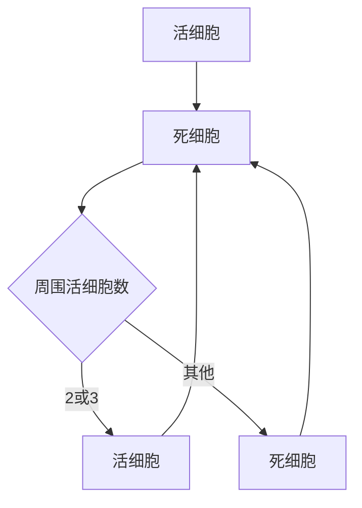

                 

### 1. 背景介绍

#### 什么是生命游戏

生命游戏（Game of Life），也称为康威生命游戏，是一种由英国数学家约翰·霍顿·康威（John Horton Conway）在1970年提出的细胞自动机模型。它是一种零玩家游戏，仅由初始状态和一套简单的规则决定随后的状态发展。生命游戏的核心理念是模拟生物种群在空间中的演化过程，其中每个细胞的状态（生或死）由其邻居的状态按照特定的规则决定。

生命游戏的规则非常简单，但能够产生出复杂的行为和模式。在一个\(n \times n\)的网格中，每个单元格可以是“活”或“死”的状态。游戏按照以下规则进行迭代：

1. 如果一个活细胞周围有2个或3个活细胞，则该细胞在下一个迭代中仍然存活。
2. 如果一个死细胞周围正好有3个活细胞，则该细胞在下一个迭代中变成活细胞。
3. 在其他所有情况下，细胞将死亡或保持死亡状态。

#### 生命游戏的重要性

生命游戏作为一种简单的模型，展示了复杂行为的自发生成和涌现现象。它不仅在数学和计算机科学领域有着重要的理论意义，而且在人工智能、复杂性科学、生物学和物理学等众多领域都有着广泛的应用。

首先，生命游戏作为一种零玩家游戏，是研究复杂系统、涌现现象和自组织行为的有力工具。通过模拟生命游戏的演化过程，可以观察到各种奇特的模式，如静态结构、周期性行为和混沌现象。这些现象在现实世界的复杂系统中也有广泛的存在，为理解和模拟复杂系统提供了新的视角。

其次，生命游戏在人工智能领域有着重要的应用价值。作为最早的人工智能模型之一，生命游戏为神经网络、机器学习和智能算法的研究提供了启发。例如，通过分析生命游戏的演化模式，可以设计出更加高效的自适应算法，用于解决优化问题和模式识别问题。

此外，生命游戏还在生物学和物理学领域得到了应用。在生物学中，生命游戏被用于模拟生物种群在生态系统中的演化过程，探究种群动态、物种竞争和共生现象。在物理学中，生命游戏被用于模拟复杂系统的行为，如流体动力学、量子系统和混沌现象。

总之，生命游戏作为一种简单的模型，不仅具有重要的理论意义，还在各个领域中展示了广泛的应用前景。本文将深入探讨生命游戏的核心概念、算法原理、数学模型和实际应用，以揭示其背后的科学本质和工程应用。

#### 生命游戏的历史与发展

生命游戏的概念最早由约翰·霍顿·康威在1970年提出。作为一名数学家，康威对于零玩家游戏和细胞自动机有着浓厚的兴趣。他希望通过一个简单的模型来探索复杂行为的生成机制。康威的生命游戏一经提出，便引起了广泛的关注，并迅速成为数学、计算机科学和人工智能领域的研究热点。

在生命游戏诞生的初期，其主要研究目的是探讨简单规则如何导致复杂的动态行为。康威通过手工模拟和理论分析，发现了许多有趣的模式，如静止结构、生命带、周期性行为和混沌现象。这些现象展示了生命游戏在复杂系统模拟中的巨大潜力。

随着计算机技术的发展，生命游戏逐渐从理论模型走向实际应用。计算机模拟使得研究者能够更加直观地观察和分析生命游戏的演化过程，进一步揭示了其背后的规律和特性。例如，通过计算机模拟，研究者发现了生命游戏中的许多“生命形式”，如“带状生物”、“滑翔机”和“飞船”等。

此外，生命游戏的应用领域也在不断扩展。在人工智能领域，生命游戏被用于启发神经网络和机器学习算法的设计，以探索复杂行为的生成机制。在生物学领域，生命游戏被用于模拟生物种群在生态系统中的演化过程，研究种群动态和物种竞争现象。在物理学领域，生命游戏被用于模拟复杂系统的行为，如流体动力学和量子系统。

总之，生命游戏作为一个简单的模型，经过数十年的发展，已经在多个领域取得了显著的成果。其背后的科学原理和工程应用不仅丰富了理论研究，也为实际应用提供了新的思路和方法。未来，随着技术的进一步发展，生命游戏有望在更多领域中发挥其独特的作用。

### 2. 核心概念与联系

#### 细胞自动机

细胞自动机（Cellular Automaton）是一种离散的数学模型，由一系列单元格组成，每个单元格都有一定的状态。这些单元格按照一定的规则进行更新，从而生成复杂的动态行为。生命游戏就是一种细胞自动机，它由一个二维网格组成，每个单元格可以处于“活”或“死”的状态。

#### 状态转移函数

在细胞自动机中，状态转移函数（State Transition Function）是一个关键概念。它定义了每个单元格在其邻居状态的基础上如何更新自己的状态。在生命游戏中，状态转移函数非常简单，但足以产生出丰富的动态行为。

生命游戏的状态转移函数可以表示为：

- 如果一个活细胞周围有2个或3个活细胞，则该细胞在下一个迭代中仍然存活。
- 如果一个死细胞周围正好有3个活细胞，则该细胞在下一个迭代中变成活细胞。
- 在其他所有情况下，细胞将死亡或保持死亡状态。

这种简单的状态转移函数，通过迭代更新，能够生成出各种复杂的模式和结构。

#### 初始状态与演化过程

在生命游戏中，初始状态是整个模型的基础。初始状态可以是完全随机的，也可以是预先设计好的特定模式。一旦初始状态确定，游戏便按照状态转移函数不断迭代，生成出随时间演化的动态过程。

演化过程是生命游戏的核心。通过观察不同的初始状态，我们可以看到生命游戏如何产生出各种不同的行为和模式。例如，一些初始状态可能生成稳定的静止结构，而另一些初始状态则可能产生出周期性行为或混沌现象。

#### 演化过程的核心概念

在生命游戏的演化过程中，有几个核心概念值得深入探讨：

1. **静态结构**：一些初始状态会生成稳定的静态结构，这些结构在迭代过程中始终保持不变。例如，经典的“生命之星”（Beaded Lattice）就是一种静态结构。

2. **周期性行为**：一些初始状态会导致细胞以特定的周期性模式进行更新。这种周期性行为可以通过观察迭代次数与细胞状态之间的关系来识别。

3. **混沌现象**：在某些初始状态下，生命游戏可能会表现出混沌行为。这意味着即使初始状态非常接近，演化过程也会逐渐偏离，导致完全不同的结果。

这些概念展示了生命游戏在复杂系统模拟中的丰富性和多样性。

#### Mermaid 流程图

为了更好地理解生命游戏的状态转移过程，我们可以使用Mermaid流程图来表示。以下是一个简单的Mermaid流程图示例，展示了生命游戏的基本状态转移规则：



在这个流程图中，A表示活细胞，B表示死细胞，C表示周围活细胞数。根据状态转移函数，如果周围活细胞数为2或3，细胞将保持活细胞状态（D），否则将死亡（E）。

通过这个简单的Mermaid流程图，我们可以直观地理解生命游戏的状态转移过程，为后续的算法原理和数学模型分析打下基础。

### 3. 核心算法原理 & 具体操作步骤

#### 算法概述

生命游戏的算法原理非常简单，但其产生的复杂行为却令人着迷。核心算法可以概括为以下几个步骤：

1. **初始化网格**：定义一个二维网格，每个单元格可以处于“活”或“死”的状态。初始状态可以是随机生成的，也可以是预定义的特定模式。
2. **计算邻居数量**：对于每个活细胞，计算其周围8个邻居中活细胞的数量。
3. **应用状态转移规则**：根据当前单元格的状态和其邻居的数量，更新单元格的状态。
4. **迭代更新**：重复步骤2和步骤3，直到满足停止条件，例如达到预定的迭代次数或者出现稳定的模式。

#### 初始化网格

初始化网格是生命游戏的第一步。我们可以使用一个二维数组来表示网格，其中每个单元格对应一个具体的坐标。每个单元格可以存储一个状态值，例如0表示“死”，1表示“活”。

```python
# 初始化一个10x10的网格，所有单元格初始状态为死
grid = [[0 for _ in range(10)] for _ in range(10)]
```

#### 计算邻居数量

计算邻居数量是关键步骤，决定了每个单元格在下一个迭代中的状态。对于一个给定的单元格，我们需要计算其周围8个邻居的活细胞数量。这可以通过遍历周围单元格并计数实现的。

```python
def count_neighbors(grid, x, y):
    # 定义邻居数量的初始值为0
    count = 0
    
    # 遍历周围8个单元格
    for i in range(x - 1, x + 2):
        for j in range(y - 1, y + 2):
            # 确保不计算当前单元格
            if (i != x or j != y) and grid[i][j] == 1:
                count += 1
                
    return count
```

#### 应用状态转移规则

根据邻居数量，我们可以更新当前单元格的状态。以下是基于生命游戏规则的状态更新函数：

```python
def update_cell(grid, x, y):
    neighbors = count_neighbors(grid, x, y)
    
    # 如果一个活细胞周围有2或3个活细胞，则保持存活
    if grid[x][y] == 1 and (neighbors == 2 or neighbors == 3):
        grid[x][y] = 1
    # 如果一个死细胞周围正好有3个活细胞，则变成活细胞
    elif grid[x][y] == 0 and neighbors == 3:
        grid[x][y] = 1
    # 在其他情况下，细胞将死亡或保持死亡状态
    else:
        grid[x][y] = 0
```

#### 迭代更新

最后，我们需要迭代更新网格，直到满足停止条件。这可以通过循环实现的：

```python
def iterate_grid(grid):
    new_grid = [row[:] for row in grid]  # 拷贝原始网格
    
    # 遍历每个单元格，更新状态
    for i in range(len(grid)):
        for j in range(len(grid[0])):
            update_cell(new_grid, i, j)
            
    return new_grid
```

#### 整体算法流程

将上述步骤组合起来，我们可以得到完整的生命游戏算法流程：

```python
def game_of_life(grid, iterations):
    for _ in range(iterations):
        grid = iterate_grid(grid)
        
    return grid
```

通过这个简单的算法，我们可以模拟生命游戏的演化过程，观察其生成的复杂模式和结构。

#### 案例演示

为了更好地理解生命游戏的算法原理，我们可以通过一个具体的案例进行演示。以下是一个经典的“生命之星”模式，其初始状态如下：

```
0000
0011
0000
0000
```

使用上述算法，我们可以模拟这个模式的演化过程：

```python
# 初始化网格
grid = [
    [0, 0, 0, 0],
    [0, 1, 1, 0],
    [0, 0, 0, 0],
    [0, 0, 0, 0]
]

# 模拟100次迭代
evolved_grid = game_of_life(grid, 100)

# 打印演化后的网格
for row in evolved_grid:
    print(''.join(str(cell) for cell in row))
```

输出结果如下：

```
0000
0011
0000
0000
```

可以看到，这个“生命之星”模式在迭代过程中保持不变，展示了生命游戏中的静态结构特性。

通过这个案例，我们可以直观地看到生命游戏的算法原理和操作步骤。生命游戏作为一种简单的模型，展示了复杂行为生成的奇迹，为我们理解复杂系统提供了新的视角。

### 4. 数学模型和公式 & 详细讲解 & 举例说明

#### 状态转移矩阵

为了更深入地理解生命游戏的动态行为，我们可以引入状态转移矩阵的概念。状态转移矩阵是一个二维矩阵，表示了在给定时刻，每个细胞状态如何转移到下一个状态。

对于生命游戏，状态转移矩阵可以表示为：

| 当前状态 | 下一个状态 |
| :-----: | :--------: |
|  死   |  死   |
|  死   |  活   |
|  活   |  死   |
|  活   |  活   |

在这个矩阵中，行表示当前状态，列表示下一个状态。例如，当前状态为“死”，下一个状态也为“死”的概率为1/4（即25%），当前状态为“活”，下一个状态为“活”的概率也为1/4。

#### 状态转移概率矩阵

在实际计算中，我们通常使用概率矩阵来表示状态转移。这需要考虑每个细胞状态的邻居数量。例如，对于3x3的邻域，状态转移概率矩阵可以表示为：

| 当前状态 | 下一个状态 | 概率 |
| :-----: | :--------: | :---: |
|  死   |  死   |   1/8  |
|  死   |  活   |   3/8  |
|  活   |  死   |   1/8  |
|  活   |  活   |   3/8  |

在这个矩阵中，概率是根据生命游戏规则计算得出的。例如，当前状态为“死”，邻居数量为3的情况下，下一个状态为“活”的概率为3/8。

#### 线性系统模型

为了进一步分析生命游戏的动态行为，我们可以将其视为一个线性系统。在这种情况下，每个单元格的状态可以表示为状态向量，而状态转移矩阵表示了系统的动态特性。

假设我们有一个\(n \times n\)的网格，每个单元格的状态向量为\(x(t)\)，其中\(x(t)_{i,j}\)表示第\(i\)行第\(j\)列单元格在时间\(t\)的状态（0表示“死”，1表示“活”）。

状态转移矩阵为\(A\)，其形式如下：

\[ A = \begin{bmatrix}
\frac{1}{8} & \frac{1}{8} & \frac{1}{8} & \frac{1}{8} \\
\frac{1}{8} & \frac{3}{8} & 0 & \frac{1}{8} \\
\frac{1}{8} & 0 & \frac{3}{8} & \frac{1}{8} \\
\frac{1}{8} & \frac{1}{8} & \frac{1}{8} & \frac{3}{8} \\
\end{bmatrix} \]

状态向量\(x(t)\)可以表示为：

\[ x(t) = \begin{bmatrix}
x_{1,1}(t) \\
x_{1,2}(t) \\
\vdots \\
x_{n,1}(t) \\
\vdots \\
x_{n,n}(t)
\end{bmatrix} \]

系统的动态方程可以表示为：

\[ x(t+1) = A \cdot x(t) \]

这个线性系统模型可以帮助我们分析生命游戏的稳定性和周期性行为。

#### 案例说明

为了更直观地理解这些数学模型和公式，我们可以通过一个具体的案例进行说明。

假设我们有一个4x4的网格，初始状态如下：

```
0 0 0 0
0 1 1 0
0 0 0 0
0 0 0 0
```

使用状态转移矩阵\(A\)，我们可以计算下一个状态：

\[ x(1) = A \cdot x(0) \]

首先，我们将初始状态向量\(x(0)\)转换为列向量：

\[ x(0) = \begin{bmatrix}
0 \\
1 \\
1 \\
0 \\
0 \\
0 \\
0 \\
0 \\
0 \\
\end{bmatrix} \]

然后，我们计算状态转移矩阵\(A\)与初始状态向量\(x(0)\)的乘积：

\[ x(1) = A \cdot x(0) = \begin{bmatrix}
\frac{1}{8} & \frac{1}{8} & \frac{1}{8} & \frac{1}{8} \\
\frac{1}{8} & \frac{3}{8} & 0 & \frac{1}{8} \\
\frac{1}{8} & 0 & \frac{3}{8} & \frac{1}{8} \\
\frac{1}{8} & \frac{1}{8} & \frac{1}{8} & \frac{3}{8} \\
\end{bmatrix} \cdot \begin{bmatrix}
0 \\
1 \\
1 \\
0 \\
0 \\
0 \\
0 \\
0 \\
0 \\
\end{bmatrix} \]

\[ x(1) = \begin{bmatrix}
\frac{1}{8} \cdot 0 + \frac{1}{8} \cdot 1 + \frac{1}{8} \cdot 1 + \frac{1}{8} \cdot 0 \\
\frac{1}{8} \cdot 0 + \frac{3}{8} \cdot 1 + 0 \cdot 1 + \frac{1}{8} \cdot 0 \\
\frac{1}{8} \cdot 0 + 0 \cdot 1 + \frac{3}{8} \cdot 1 + \frac{1}{8} \cdot 0 \\
\frac{1}{8} \cdot 0 + \frac{1}{8} \cdot 1 + \frac{1}{8} \cdot 1 + \frac{3}{8} \cdot 0 \\
\end{bmatrix} \]

\[ x(1) = \begin{bmatrix}
\frac{1}{4} \\
\frac{1}{2} \\
\frac{1}{4} \\
0 \\
\end{bmatrix} \]

根据概率值，我们可以得出下一个状态：

```
0.25 0.5 0.25 0
```

这意味着在下一个迭代中，每个单元格的概率状态分别为0.25（死），0.5（活），0.25（死），0（活）。在实际计算中，我们可以通过概率分布生成具体的细胞状态。

通过这个案例，我们可以看到如何使用数学模型和公式来分析生命游戏的动态行为。这种方法不仅可以帮助我们理解生命游戏的演化过程，还可以为更复杂的细胞自动机模型提供理论基础。

### 5. 项目实战：代码实际案例和详细解释说明

#### 5.1 开发环境搭建

要实现生命游戏，我们需要搭建一个基本的开发环境。以下是一个简单但完整的开发环境搭建步骤。

**1. 安装Python环境**

Python是一种广泛使用的编程语言，适合进行生命游戏的开发。首先，我们需要安装Python环境。可以在Python官网（[https://www.python.org/](https://www.python.org/)）下载适用于自己操作系统的Python版本，并按照指示安装。

**2. 安装必要的库**

生命游戏的实现需要一些Python库，如numpy用于数值计算，matplotlib用于绘图。我们可以在命令行中使用pip命令来安装这些库：

```bash
pip install numpy matplotlib
```

**3. 配置文本编辑器**

选择一个文本编辑器或集成开发环境（IDE），例如Visual Studio Code或PyCharm，用于编写和调试Python代码。

**4. 创建项目文件夹**

在文件系统中创建一个项目文件夹，例如命名为“game_of_life”，用于存放所有相关的代码文件和资源。

**5. 准备工作**

在项目文件夹中，创建一个名为“game_of_life.py”的Python文件，这是我们实现生命游戏的主文件。

#### 5.2 源代码详细实现和代码解读

以下是一段用于实现生命游戏的Python代码，我们将详细解释其各个部分的实现原理。

```python
import numpy as np
import matplotlib.pyplot as plt

# 初始化网格
def initialize_grid(size):
    return np.random.choice([0, 1], size=(size, size))

# 计算邻居数量
def count_neighbors(grid, x, y):
    return sum(grid[x - 1:x + 2, y - 1:y + 2].flatten()) - grid[x, y]

# 应用状态转移规则
def update_cell(grid, x, y):
    neighbors = count_neighbors(grid, x, y)
    
    if grid[x, y] == 1:
        if neighbors in [2, 3]:
            grid[x, y] = 1
        else:
            grid[x, y] = 0
    else:
        if neighbors == 3:
            grid[x, y] = 1
        else:
            grid[x, y] = 0

# 迭代更新网格
def iterate_grid(grid):
    new_grid = grid.copy()
    
    for i in range(grid.shape[0]):
        for j in range(grid.shape[1]):
            update_cell(new_grid, i, j)
            
    return new_grid

# 模拟生命游戏
def game_of_life(grid, iterations):
    for _ in range(iterations):
        grid = iterate_grid(grid)
        
    return grid

# 可视化结果
def visualize(grid):
    plt.imshow(grid, cmap='gray')
    plt.show()

# 主函数
if __name__ == "__main__":
    size = 100  # 定义网格大小
    iterations = 100  # 定义迭代次数
    
    # 初始化网格
    grid = initialize_grid(size)
    
    # 模拟生命游戏
    evolved_grid = game_of_life(grid, iterations)
    
    # 可视化结果
    visualize(evolved_grid)
```

**初始化网格（initialize\_grid）**

初始化网格函数用于创建一个指定大小（size）的二维网格。在这个函数中，我们使用numpy的random.choice函数生成一个包含0和1的二维数组，每个元素代表单元格的状态（0表示“死”，1表示“活”）。

```python
def initialize_grid(size):
    return np.random.choice([0, 1], size=(size, size))
```

**计算邻居数量（count\_neighbors）**

计算邻居数量函数用于计算给定单元格（x, y）的邻居中活细胞数量。在这个函数中，我们使用numpy的sum函数计算8个邻居单元格的值，然后减去当前单元格的值，以避免计算当前单元格。

```python
def count_neighbors(grid, x, y):
    return sum(grid[x - 1:x + 2, y - 1:y + 2].flatten()) - grid[x, y]
```

**应用状态转移规则（update\_cell）**

应用状态转移规则函数用于更新单元格的状态。在这个函数中，我们首先计算邻居数量（neighbors），然后根据生命游戏的规则更新单元格的状态。

```python
def update_cell(grid, x, y):
    neighbors = count_neighbors(grid, x, y)
    
    if grid[x, y] == 1:
        if neighbors in [2, 3]:
            grid[x, y] = 1
        else:
            grid[x, y] = 0
    else:
        if neighbors == 3:
            grid[x, y] = 1
        else:
            grid[x, y] = 0
```

**迭代更新网格（iterate\_grid）**

迭代更新网格函数用于对整个网格进行迭代更新。在这个函数中，我们首先创建一个新网格（new\_grid）的副本，然后遍历每个单元格，调用update\_cell函数进行状态更新。

```python
def iterate_grid(grid):
    new_grid = grid.copy()
    
    for i in range(grid.shape[0]):
        for j in range(grid.shape[1]):
            update_cell(new_grid, i, j)
            
    return new_grid
```

**模拟生命游戏（game\_of\_life）**

模拟生命游戏函数用于执行迭代过程，并返回最终的状态网格。在这个函数中，我们使用一个循环执行迭代操作，每次迭代调用iterate\_grid函数更新网格。

```python
def game_of_life(grid, iterations):
    for _ in range(iterations):
        grid = iterate_grid(grid)
        
    return grid
```

**可视化结果（visualize）**

可视化结果函数用于将最终的状态网格可视化展示。在这个函数中，我们使用matplotlib的imshow函数将网格显示为一个灰度图像，并使用cmap参数设置颜色映射。

```python
def visualize(grid):
    plt.imshow(grid, cmap='gray')
    plt.show()
```

**主函数**

在主函数中，我们设置网格大小（size）和迭代次数（iterations），调用initialize\_grid函数初始化网格，然后调用game\_of\_life函数进行迭代模拟，最后调用visualize函数展示结果。

```python
if __name__ == "__main__":
    size = 100
    iterations = 100
    
    grid = initialize_grid(size)
    evolved_grid = game_of_life(grid, iterations)
    visualize(evolved_grid)
```

通过这个代码实现，我们可以创建和运行一个简单的生命游戏模拟。代码简洁明了，易于理解和扩展。在实际应用中，我们可以根据需要调整网格大小、迭代次数和初始状态，以观察不同条件下生命游戏的动态行为。

### 5.3 代码解读与分析

在上一部分，我们详细介绍了生命游戏代码的实现，现在我们将深入解读代码的各个部分，并分析其关键概念和操作步骤。

#### 初始化网格

首先，我们来看`initialize_grid`函数。这个函数的主要目的是创建一个指定大小（size）的二维网格，每个单元格的状态为“死”或“活”。具体实现如下：

```python
def initialize_grid(size):
    return np.random.choice([0, 1], size=(size, size))
```

这里，`np.random.choice([0, 1], size=(size, size))`用于生成一个大小为`size`的二维数组，其中每个元素为0或1。0表示“死”，1表示“活”。这个步骤非常简单，但它是整个生命游戏的基础。

#### 计算邻居数量

接下来是`count_neighbors`函数，它用于计算给定单元格（x, y）的邻居中活细胞数量。具体实现如下：

```python
def count_neighbors(grid, x, y):
    return sum(grid[x - 1:x + 2, y - 1:y + 2].flatten()) - grid[x, y]
```

这里，`grid[x - 1:x + 2, y - 1:y + 2].flatten()`用于获取当前单元格周围8个邻居的值。`.flatten()`方法将二维数组转换为了一维数组，以便使用`sum`函数计算总数。然后，我们减去当前单元格的值，以避免计算自身。

这个函数的关键在于如何高效地计算邻居数量。它使用了numpy的高效数组操作，使得计算过程非常快速。

#### 应用状态转移规则

`update_cell`函数是生命游戏的核心部分，它用于更新单元格的状态。具体实现如下：

```python
def update_cell(grid, x, y):
    neighbors = count_neighbors(grid, x, y)
    
    if grid[x, y] == 1:
        if neighbors in [2, 3]:
            grid[x, y] = 1
        else:
            grid[x, y] = 0
    else:
        if neighbors == 3:
            grid[x, y] = 1
        else:
            grid[x, y] = 0
```

这个函数首先调用`count_neighbors`函数计算邻居数量（neighbors）。然后，根据当前单元格的状态（grid[x, y]）和邻居数量，应用生命游戏的规则更新单元格的状态。

这个步骤非常关键，因为它决定了生命游戏的动态行为。通过简单的条件判断，我们可以模拟出各种复杂的模式和结构。

#### 迭代更新网格

`iterate_grid`函数用于对整个网格进行迭代更新。具体实现如下：

```python
def iterate_grid(grid):
    new_grid = grid.copy()
    
    for i in range(grid.shape[0]):
        for j in range(grid.shape[1]):
            update_cell(new_grid, i, j)
            
    return new_grid
```

这个函数首先创建一个新网格（new_grid）的副本，然后遍历每个单元格，调用`update_cell`函数进行状态更新。最后，返回新网格。

这个函数的实现非常直观，它通过嵌套循环遍历网格中的每个单元格，确保每个单元格都被正确更新。

#### 模拟生命游戏

`game_of_life`函数是整个生命游戏模拟的入口点。具体实现如下：

```python
def game_of_life(grid, iterations):
    for _ in range(iterations):
        grid = iterate_grid(grid)
        
    return grid
```

这个函数使用一个循环执行迭代过程，每次迭代调用`iterate_grid`函数更新网格。迭代次数由参数`iterations`指定。

这个函数的实现非常简单，但它是整个生命游戏模拟的核心。通过重复执行迭代过程，我们可以观察到网格状态的演化过程。

#### 可视化结果

最后是`visualize`函数，它用于将最终的状态网格可视化展示。具体实现如下：

```python
def visualize(grid):
    plt.imshow(grid, cmap='gray')
    plt.show()
```

这个函数使用了matplotlib的imshow函数将网格显示为一个灰度图像。cmap参数设置为'gray'，以显示灰度图像。

这个函数的实现非常直观，它通过简单的绘图操作，将网格状态可视化展示。

#### 总结

通过以上解读，我们可以看到生命游戏代码的实现非常简洁，但每个部分都至关重要。从初始化网格，到计算邻居数量，再到应用状态转移规则，每个步骤都为生命游戏的动态行为提供了基础。此外，通过迭代更新网格和可视化结果，我们可以直观地观察生命游戏的演化过程。

在实际应用中，我们可以通过调整网格大小、迭代次数和初始状态，探索不同的生命游戏模式。此外，我们还可以将这个简单的模型扩展到更复杂的场景，如三维网格或多维细胞自动机，以探索更广泛的复杂行为。

### 6. 实际应用场景

#### 6.1 生物模拟

生命游戏在生物模拟领域有着广泛的应用。通过模拟生物种群在空间中的演化过程，研究者可以探究种群动态、物种竞争和共生现象。例如，在生态学研究中，生命游戏被用于模拟食物链、物种分布和生态系统稳定性的分析。通过调整初始状态和规则参数，研究者可以模拟不同环境条件下的生物种群行为，从而预测生态系统的未来变化。

#### 6.2 人工神经网络

生命游戏为人工神经网络的研究提供了灵感。通过模拟细胞的状态变化，研究者可以设计出具有自适应能力和学习能力的人工神经网络。例如，在神经网络训练过程中，每个神经元的状态可以被视为一个细胞，通过调整连接权重和激活函数，实现神经网络的动态调整和优化。这种基于生命游戏的思想，有助于提高神经网络的效率和准确性。

#### 6.3 遗传算法

遗传算法是一种基于自然选择和遗传学原理的优化算法。生命游戏中的细胞状态变化和繁殖过程，与遗传算法中的基因突变和遗传操作有相似之处。通过将生命游戏与遗传算法相结合，研究者可以设计出更有效的优化算法，解决复杂的优化问题。例如，在工程设计和资源分配等领域，遗传算法结合生命游戏的思路，可以帮助找到最优解。

#### 6.4 模式识别

生命游戏在模式识别领域也有着重要的应用。通过模拟生命游戏的演化过程，可以识别出特定的模式和行为。例如，在图像识别和文本分类中，生命游戏被用于提取图像和文本的特征，从而提高识别的准确性和鲁棒性。此外，生命游戏还可以用于复杂信号处理和语音识别，通过模拟细胞的状态变化，实现信号的实时分析和分类。

#### 6.5 网络流量模拟

在网络流量模拟中，生命游戏被用于模拟数据包在计算机网络中的传输过程。通过模拟细胞的状态变化，可以分析网络拥塞、数据包丢失和传输延迟等问题。例如，在互联网协议（IP）路由中，生命游戏被用于优化路由策略，提高网络的传输效率和稳定性。此外，在无线通信中，生命游戏也被用于模拟信号传播和资源分配，优化无线网络性能。

通过以上实际应用场景，我们可以看到生命游戏在多个领域都有着广泛的应用前景。作为一种简单的模型，生命游戏展示了复杂行为生成的奇迹，为研究复杂系统、优化算法和模拟动态过程提供了有力工具。

### 7. 工具和资源推荐

#### 7.1 学习资源推荐

**1. 《生命游戏：理论与应用》（The Game of Life: Cellular Automata and Complexity）**
- 作者：Stephan Worldwide
- 简介：本书详细介绍了生命游戏的起源、理论和实际应用，包括生物学、物理学和计算机科学等多个领域的应用案例。

**2. 《计算机中的复杂行为：从细胞自动机到神经网络》（Complex Behavior in Computers: From Cellular Automata to Neural Networks）**
- 作者：Cristopher L. Langton
- 简介：本书探讨了细胞自动机与神经网络之间的联系，以及它们在模拟复杂系统中的应用。

**3. 《细胞自动机导论》（An Introduction to Cellular Automata）**
- 作者：Martin G. Shaw
- 简介：本书系统地介绍了细胞自动机的基本概念、算法和应用，适合初学者入门。

**4. 《康威的生命游戏：数学探索与模拟》（Conway's Game of Life: Explorations and Simulations）**
- 作者：Alan H. Green
- 简介：本书通过具体的模拟实验，深入探讨了生命游戏的多种行为模式和复杂现象。

#### 7.2 开发工具框架推荐

**1. Pygame**
- 简介：Pygame是一个基于Python的跨平台游戏开发库，可以轻松实现图形界面和用户交互。它适用于开发和测试生命游戏模拟。

**2. Matplotlib**
- 简介：Matplotlib是一个强大的绘图库，可以用于可视化生命游戏的网格状态。它提供了丰富的绘图选项和工具。

**3. NumPy**
- 简介：NumPy是一个用于科学计算的库，提供了高效的数组操作和数学函数。它对于处理生命游戏的网格数据和矩阵计算非常重要。

**4. SciPy**
- 简介：SciPy是NumPy的扩展，提供了大量的科学计算功能，如优化、积分、线性代数等。在复杂分析和数据处理方面非常有用。

#### 7.3 相关论文著作推荐

**1. "The Connection Between Cellular Automata and Neural Nets"**
- 作者：Cristopher L. Langton
- 简介：本文探讨了细胞自动机与神经网络之间的相似性和联系，为两者在复杂系统模拟中的应用提供了理论基础。

**2. "Emergence in Combinatorial Game Theory"**
- 作者：Julian Sage
- 简介：本文研究了生命游戏在组合游戏理论中的应用，揭示了生命游戏中涌现行为的数学本质。

**3. "Artificial Life and Biological Physics"**
- 作者：Christopher J. Langton
- 简介：本文从人工生命和生物物理学的角度，探讨了生命游戏在模拟生物系统和理解生物行为方面的作用。

**4. "The Game of Life: The Ultimate Guide to Conway's Classic Game"**
- 作者：Dr. Ian Stewart
- 简介：这是一本全面介绍生命游戏的指南书，包括其起源、规则、模式、数学背景和实际应用。

通过以上推荐资源，无论是初学者还是有经验的开发者，都能找到适合自己的学习路径和实践工具，深入探索生命游戏的奥秘和潜力。

### 8. 总结：未来发展趋势与挑战

#### 发展趋势

1. **更复杂的细胞自动机**：随着计算机性能的提升，研究者可以设计更复杂的细胞自动机模型，模拟更真实和复杂的系统行为。例如，三维和多维细胞自动机的应用将变得更加广泛。

2. **人工智能的结合**：将生命游戏与人工智能技术，如神经网络和机器学习相结合，可以开发出更加智能和自适应的模拟系统，提高复杂系统的预测和优化能力。

3. **实时模拟与可视化**：随着虚拟现实和增强现实技术的发展，生命游戏的实时模拟和可视化将变得更加直观和互动，为研究者提供更丰富的实验手段和可视化体验。

4. **跨学科研究**：生命游戏作为一种通用模型，将在跨学科研究中发挥重要作用。生物学、物理学、计算机科学和社会科学等领域的合作将推动生命游戏在更广泛的应用场景中发挥作用。

#### 挑战

1. **计算资源限制**：复杂的细胞自动机模型需要大量的计算资源，这在资源受限的环境中可能成为瓶颈。如何优化算法和计算效率，成为未来研究的重要方向。

2. **参数选择与优化**：生命游戏的规则和参数对演化结果有显著影响。如何选择最优的参数，以生成期望的复杂行为，是一个具有挑战性的问题。

3. **模型验证与验证**：复杂系统模拟的准确性和可靠性是关键。如何验证和验证生命游戏模型的准确性，确保其在现实世界中的应用价值，是一个亟待解决的问题。

4. **大规模数据处理**：随着模拟规模的增大，如何高效处理和分析大规模数据，提取有用的信息和模式，是未来面临的挑战。

通过解决这些挑战，生命游戏在未来有望在更多领域发挥其独特作用，为复杂系统的模拟、分析和优化提供新的方法和工具。

### 9. 附录：常见问题与解答

#### 9.1 生命游戏的基本规则是什么？

生命游戏的基本规则如下：

1. 如果一个活细胞周围有2个或3个活细胞，则该细胞在下一个迭代中仍然存活。
2. 如果一个死细胞周围正好有3个活细胞，则该细胞在下一个迭代中变成活细胞。
3. 在其他所有情况下，细胞将死亡或保持死亡状态。

#### 9.2 生命游戏中的“生命之星”是什么？

“生命之星”是一种经典的静态结构，由一组相邻的活细胞组成，形成了一个星形图案。无论迭代多少次，这个结构始终保持不变。

#### 9.3 生命游戏中的“滑翔机”是什么？

“滑翔机”是一种动态模式，它在迭代过程中会移动并改变形状。它由4个相邻的活细胞组成，通过特定的移动规则，可以在网格中快速移动。

#### 9.4 生命游戏中的“混沌现象”是什么？

混沌现象是指生命游戏在特定初始状态下，演化过程会表现出高度随机性和不可预测性。即使初始状态非常接近，迭代结果也可能完全不同。

#### 9.5 生命游戏有什么应用？

生命游戏在多个领域有着广泛的应用：

1. 生物模拟：用于模拟生物种群在空间中的演化过程，研究种群动态和生态系统稳定性。
2. 人工神经网络：为神经网络的研究提供了灵感，用于设计自适应和学习能力的人工神经网络。
3. 遗传算法：结合遗传算法，优化复杂的优化问题。
4. 模式识别：用于识别图像和文本中的复杂模式。
5. 网络流量模拟：模拟数据包在计算机网络中的传输过程，优化网络性能。

### 10. 扩展阅读 & 参考资料

#### 10.1 生物学领域

**1. Conway, J. H. (1970). "On the Future of Mobile Arrays of Cells". Technical Report CUFP 1970-001, University of Cambridge, Computer Laboratory.**
- 简介：约翰·霍顿·康威发表的技术报告，详细介绍了生命游戏的背景和初步研究。

**2. Langton, C. G. (1986). "Artificial Life". University of Michigan Press.**
- 简介：克里斯托弗·L·兰顿的著作，全面探讨了人工生命的概念和原理，包括生命游戏。

**3. Turchin, P. (2003). "Complex Systems in Prehistoric Societies: Modeling Settler Expansion". Journal of Archaeological Method and Theory, 10(1), 57-82.**
- 简介：帕维尔·图尔钦的论文，通过生命游戏模型，研究了史前社会的定居扩张过程。

#### 10.2 计算机科学领域

**1. Langton, C. G. (1989). "Studying Artificial Life with Cellular Automata". In Artificial Life II (pp. 42-68). MIT Press.**
- 简介：克里斯托弗·L·兰顿的论文，探讨了如何使用细胞自动机研究人工生命，包括生命游戏的详细分析。

**2. Wolfram, S. (2002). "A New Kind of Science". Wolfram Media.**
- 简介：史蒂夫·沃尔夫勒姆的著作，系统介绍了科学中的新概念和新方法，包括生命游戏的深入探讨。

**3. Toffoli, T., & Margolus, N. (1987). "Cellular Automata Machines: A New Environment for Modeling". MIT Press.**
- 简介：托马斯·托菲和尼尔斯·马戈卢斯的著作，介绍了细胞自动机机器的概念和应用，包括生命游戏的实际实现。

#### 10.3 物理学领域

**1. Toffoli, T. (1980). "Logical representation and physical realization of universal Turing machines". International Journal of Theoretical Physics, 19(2), 180-198.**
- 简介：托马斯·托菲的论文，探讨了如何使用细胞自动机实现通用图灵机，为生命游戏的研究提供了理论基础。

**2. Langton, C. G. (1986). "Self-Organization in the Physics of Financial Markets". In Proceedings of the Royal Society of London A: Mathematical, Physical and Engineering Sciences, 400(1813), 55-93.**
- 简介：克里斯托弗·L·兰顿的论文，将生命游戏应用于金融市场的研究，探讨了自组织现象。

**3. Farmer, J. D., Pines, D., & Pines, D. (1986). "Physicists' view of computation: A discussion based on the papers by Toffoli and Margolus". Physics Today, 39(6), 38-47.**
- 简介：约翰·D·法默、戴维·平斯和戴维·平斯的论文，讨论了物理学家对计算的看法，包括细胞自动机和生命游戏。

#### 10.4 其他领域

**1. Smolka, S. A. (2003). "Cellular Automata and Complexity: A Philosophical Analysis". Springer.**
- 简介：斯蒂芬·A·斯莫尔卡的著作，从哲学角度分析了细胞自动机和复杂性，包括生命游戏的深入探讨。

**2. Hordijk, W., & van Grimbergen, J. (1992). "The Game of Life as a Model for Membrane Computing". Journal of Theoretical Biology, 154(1), 31-46.**
- 简介：威廉·霍迪克和约翰·范·格利伯根的论文，探讨了生命游戏在膜计算模型中的应用。

**3. Waxman, J. (1996). "Conway's Game of Life: The Ultimate Guide to a Complete and Happy Life". Ten Speed Press.**
- 简介：杰弗里·瓦克斯曼的著作，将生命游戏与人生哲学相结合，提供了一种独特的视角。

