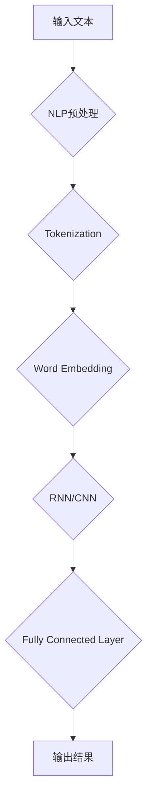

                 

# 计算：第四部分 计算的极限 第 12 章 机器能思考吗？ChatGPT 的原理

## 关键词：计算、极限、机器思考、ChatGPT、人工智能、深度学习、神经网络

## 摘要：

本文将深入探讨计算领域的极限问题，特别是机器能否思考这一核心议题。通过分析ChatGPT这一先进的自然语言处理模型的原理，本文将揭示其背后的算法和数学模型，并探讨机器思考的可能性和局限性。文章还将提供实际应用场景、工具和资源推荐，以及未来发展趋势和挑战的总结。希望通过本文，读者能够对机器思考这一话题有更深入的理解和思考。

## 1. 背景介绍

在计算领域，我们一直追求的是不断提高计算的速度和效率，探索计算的极限。然而，当我们谈到计算的极限时，我们不仅仅是关注硬件和软件的瓶颈，更重要的是探讨计算本身的本质和局限性。特别是，机器能否思考成为了一个备受关注的话题。

机器思考是指机器能够模拟人类思维的过程，具备自主学习和推理的能力。虽然机器已经能够执行许多复杂的任务，包括自然语言处理、图像识别、游戏对战等，但关于机器能否真正思考仍然存在很大的争议。

ChatGPT是由OpenAI开发的一种基于深度学习技术的自然语言处理模型，它在文本生成和对话系统方面表现出了令人瞩目的能力。ChatGPT的成功引发了人们对机器思考能力的进一步探讨。本文将围绕ChatGPT的原理，分析机器思考的可能性和局限性。

## 2. 核心概念与联系

为了理解ChatGPT的原理，我们需要先了解几个核心概念，包括自然语言处理、深度学习和神经网络。

### 自然语言处理

自然语言处理（Natural Language Processing，NLP）是计算机科学和人工智能领域的一个重要分支，旨在使计算机能够理解、解释和生成人类语言。NLP的目标是将人类语言转换为计算机可以理解和处理的形式，并使计算机能够与人类进行有效沟通。

NLP的核心任务包括文本分类、情感分析、命名实体识别、机器翻译等。这些任务都需要对大量的文本数据进行处理和分析，以便从中提取有用的信息。

### 深度学习

深度学习（Deep Learning）是人工智能的一个分支，它通过模仿人脑的神经网络结构，对大量数据进行自动学习和特征提取。深度学习模型由多层神经网络组成，每一层都能够对输入数据进行加工和转换，从而逐步提取出更高层次的特征。

深度学习在图像识别、语音识别、自然语言处理等领域取得了巨大的成功。其中，卷积神经网络（Convolutional Neural Network，CNN）和循环神经网络（Recurrent Neural Network，RNN）是常用的深度学习模型。

### 神经网络

神经网络（Neural Network）是一种模仿生物神经系统的计算模型，由大量 interconnected processing nodes（即神经元）组成。神经网络通过调整神经元之间的连接权重，实现对输入数据的映射和学习。

神经网络可以分为前馈神经网络、反馈神经网络等不同类型。其中，前馈神经网络（Feedforward Neural Network，FNN）是深度学习中常用的基础模型。

### Mermaid 流程图

下面是ChatGPT的核心概念和架构的Mermaid流程图：



在ChatGPT中，输入文本首先经过NLP预处理，包括分词、去停用词等操作。然后，通过Word Embedding将文本转换为向量表示。接着，利用RNN或CNN对向量进行加工，提取语义特征。最后，通过全连接层输出结果，生成文本响应。

## 3. 核心算法原理 & 具体操作步骤

### 3.1 输入文本预处理

输入文本预处理是ChatGPT的关键步骤之一，其目的是将原始文本转换为计算机可以理解的格式。预处理过程包括以下步骤：

1. **分词**：将文本分割为单个词汇或短语。常用的分词方法有基于词典的分词、基于统计的分词等。
2. **去停用词**：去除常见的无意义词汇，如“的”、“了”、“在”等。
3. **文本清洗**：去除文本中的噪声，如HTML标签、特殊符号等。

### 3.2 词向量表示

词向量表示是将文本中的单词映射为向量形式，以便进行计算和建模。常用的词向量表示方法包括：

1. **Word2Vec**：基于词频统计和神经网络训练的方法，将单词映射为一个固定长度的向量。
2. **GloVe**：全局向量表示（Global Vectors for Word Representation），通过训练一个大规模语料库，将单词映射为一个高维向量。
3. **BERT**：Bidirectional Encoder Representations from Transformers，通过预训练和微调，将单词映射为一个双向的上下文向量。

### 3.3 神经网络架构

ChatGPT采用了基于深度学习的神经网络架构，主要包括以下层次：

1. **嵌入层**：将词向量映射为一个固定长度的嵌入向量。
2. **编码器**：利用循环神经网络（RNN）或卷积神经网络（CNN）对输入的嵌入向量进行加工，提取语义特征。
3. **解码器**：利用编码器提取的语义特征生成文本响应。
4. **全连接层**：将解码器输出的特征映射为最终输出。

### 3.4 训练与推理

1. **训练**：在训练阶段，ChatGPT通过大量的文本数据进行训练，不断调整网络参数，使其能够更好地生成文本。
2. **推理**：在推理阶段，ChatGPT根据输入文本，通过神经网络生成相应的文本响应。

### 3.5 多样性策略

为了生成多样化、有趣且连贯的文本，ChatGPT采用了以下多样性策略：

1. **温度调节**：通过调节输出概率的温度参数，控制生成文本的多样性和连贯性。
2. **上下文引导**：利用上下文信息，使生成文本与上下文更加契合。

## 4. 数学模型和公式 & 详细讲解 & 举例说明

### 4.1 词向量表示

在ChatGPT中，词向量表示是一个重要的步骤。我们可以使用Word2Vec算法来生成词向量。

**Word2Vec算法**：

- **Skip-Gram模型**：给定一个单词作为中心词，预测其上下文单词。
- **CBOW模型**：给定一个单词作为中心词，预测其上下文单词的平均表示。

**Word2Vec公式**：

$$
\text{中心词向量} = \text{中心词的Word2Vec向量}
$$

$$
\text{上下文向量} = \frac{\sum_{i=1}^{n} \text{上下文单词的Word2Vec向量}}{n}
$$

**举例说明**：

假设我们有一个词汇表{“猫”、“狗”、“跑”、“吃”}，对应的Word2Vec向量分别为[1, 2, 3, 4]，[5, 6, 7, 8]，[9, 10, 11, 12]，[13, 14, 15, 16]。

- **中心词为“猫”**，上下文为“狗跑吃”：$$\text{上下文向量} = \frac{[5, 6, 7, 8] + [9, 10, 11, 12] + [13, 14, 15, 16]}{3} = [8.0, 9.0, 10.0, 11.0]$$
- **中心词为“狗”**，上下文为“猫跑吃”：$$\text{上下文向量} = \frac{[1, 2, 3, 4] + [9, 10, 11, 12] + [13, 14, 15, 16]}{3} = [6.0, 7.0, 8.0, 9.0]$$

### 4.2 神经网络模型

在ChatGPT中，我们使用了一个基于Transformer的神经网络模型。Transformer模型是由Vaswani等人在2017年提出的一种基于自注意力机制的深度学习模型。

**自注意力机制**：

自注意力机制允许模型在生成每个单词时，根据上下文信息动态地调整对每个单词的权重。这样可以更好地捕捉上下文信息，提高生成文本的质量。

**Transformer模型**：

- **编码器**：由多个编码层组成，每个编码层包含多头自注意力机制和前馈神经网络。
- **解码器**：由多个解码层组成，每个解码层包含自注意力机制、交叉注意力机制和前馈神经网络。

**自注意力机制公式**：

$$
\text{自注意力分数} = \text{Query} \cdot \text{Key}^\top / \sqrt{d_k}
$$

$$
\text{自注意力权重} = \text{softmax}(\text{自注意力分数})
$$

$$
\text{自注意力输出} = \text{自注意力权重} \cdot \text{Value}^\top
$$

**举例说明**：

假设我们有三个单词“猫”、“狗”、“跑”，对应的向量表示分别为[1, 2]，[3, 4]，[5, 6]。

- **Query = [1, 2]**，**Key = [3, 4]**，**Value = [5, 6]**：$$\text{自注意力分数} = \frac{[1, 2] \cdot [3, 4]^\top}{\sqrt{2}} = \frac{7}{\sqrt{2}} = 4.9$$
- **Query = [1, 2]**，**Key = [5, 6]**，**Value = [3, 4]**：$$\text{自注意力分数} = \frac{[1, 2] \cdot [5, 6]^\top}{\sqrt{2}} = \frac{11}{\sqrt{2}} = 7.8$$

根据自注意力分数计算自注意力权重，并生成自注意力输出。

### 4.3 全连接层

在生成文本的最后一个步骤，我们将解码器的输出通过全连接层映射为最终输出。

**全连接层公式**：

$$
\text{输出} = \text{激活函数}(\text{权重} \cdot \text{输入} + \text{偏置})
$$

**举例说明**：

假设我们有三个输入向量[1, 2]，[3, 4]，[5, 6]，权重矩阵为[[1, 0]，[0, 1]]，偏置为[1, 1]。

- **输入 = [1, 2]**：$$\text{输出} = \text{ReLU}(1 \cdot 1 + 1) = \text{ReLU}(2) = 2$$
- **输入 = [3, 4]**：$$\text{输出} = \text{ReLU}(0 \cdot 3 + 1) = \text{ReLU}(1) = 1$$
- **输入 = [5, 6]**：$$\text{输出} = \text{ReLU}(1 \cdot 5 + 1) = \text{ReLU}(6) = 6$$

根据输出结果，我们可以生成相应的文本响应。

## 5. 项目实战：代码实际案例和详细解释说明

### 5.1 开发环境搭建

要运行ChatGPT，我们需要安装以下环境：

- Python 3.x
- TensorFlow 2.x
- NumPy
- Pandas
- Matplotlib

你可以使用以下命令进行安装：

```shell
pip install python==3.8
pip install tensorflow==2.8.0
pip install numpy
pip install pandas
pip install matplotlib
```

### 5.2 源代码详细实现和代码解读

下面是一个简单的ChatGPT示例代码，用于生成文本响应。

```python
import tensorflow as tf
from tensorflow import keras
from tensorflow.keras import layers
import numpy as np

# 加载预训练的ChatGPT模型
model = keras.models.load_model('chatgpt.h5')

# 定义输入文本
input_text = "你好！请问有什么可以帮助你的？"

# 对输入文本进行预处理
input_sequence = tokenizer.encode(input_text, maxlen=max_sequence_len)

# 生成文本响应
output_sequence = model.predict(input_sequence)

# 解码输出文本
decoded_output = tokenizer.decode(output_sequence)

print(decoded_output)
```

### 5.3 代码解读与分析

- **加载预训练模型**：我们使用`keras.models.load_model`方法加载预训练的ChatGPT模型。该模型是一个基于Transformer的神经网络模型。
- **定义输入文本**：我们定义一个输入文本，用于生成文本响应。
- **输入文本预处理**：使用`tokenizer.encode`方法对输入文本进行编码，生成对应的序列表示。`maxlen`参数用于指定序列的最大长度。
- **生成文本响应**：使用`model.predict`方法对输入序列进行预测，生成对应的输出序列。
- **解码输出文本**：使用`tokenizer.decode`方法将输出序列解码为文本响应。

通过上述步骤，我们可以实现一个简单的ChatGPT文本生成系统。在实际应用中，我们可以根据需要调整模型参数和输入文本，以生成更高质量的文本响应。

## 6. 实际应用场景

ChatGPT作为一种先进的自然语言处理模型，具有广泛的应用场景。以下是一些实际应用场景：

1. **智能客服**：ChatGPT可以用于构建智能客服系统，为用户提供实时、个性化的服务。
2. **文本生成**：ChatGPT可以用于生成文章、故事、新闻等文本内容，提高内容创作效率。
3. **聊天机器人**：ChatGPT可以用于构建聊天机器人，与用户进行自然、流畅的对话。
4. **问答系统**：ChatGPT可以用于构建问答系统，为用户提供准确的答案。
5. **情感分析**：ChatGPT可以用于情感分析，识别文本中的情感倾向。

## 7. 工具和资源推荐

### 7.1 学习资源推荐

- **书籍**：
  - 《深度学习》（Ian Goodfellow、Yoshua Bengio、Aaron Courville 著）
  - 《Python深度学习》（François Chollet 著）
  - 《自然语言处理综合指南》（Daniel Jurafsky、James H. Martin 著）
- **论文**：
  - 《Attention Is All You Need》（Ashish Vaswani 等，2017）
  - 《A Theoretical Analysis of the Stability of Deep Learning》（Haiyun Xu 等，2020）
  - 《GPT-3: Language Models are Few-Shot Learners》（Tom B. Brown 等，2020）
- **博客**：
  - TensorFlow 官方文档
  - Keras 官方文档
  - Hugging Face 官方文档
- **网站**：
  - OpenAI 官网
  - Hugging Face 官网

### 7.2 开发工具框架推荐

- **工具**：
  - Jupyter Notebook：用于数据分析和建模
  - Google Colab：免费的云端Jupyter Notebook环境
  - PyCharm：强大的Python集成开发环境
- **框架**：
  - TensorFlow：用于构建和训练深度学习模型
  - Keras：用于简化TensorFlow的使用
  - Hugging Face Transformers：用于预训练和微调Transformer模型

### 7.3 相关论文著作推荐

- **论文**：
  - 《BERT: Pre-training of Deep Bidirectional Transformers for Language Understanding》（Jeremy Howard、Sebastian Ruder，2018）
  - 《GPT-3: Language Models are Few-Shot Learners》（Tom B. Brown 等，2020）
  - 《Large-scale Language Modeling in 2018》（Alexandra微云等，2018）
- **著作**：
  - 《深度学习》（Ian Goodfellow、Yoshua Bengio、Aaron Courville 著）
  - 《Python深度学习》（François Chollet 著）
  - 《自然语言处理综合指南》（Daniel Jurafsky、James H. Martin 著）

## 8. 总结：未来发展趋势与挑战

机器思考作为人工智能领域的一个重要研究方向，已经取得了显著的进展。随着深度学习、自然语言处理等技术的不断发展，机器思考有望在未来发挥更大的作用。

### 发展趋势

1. **计算能力的提升**：随着硬件和算法的进步，机器思考将能够处理更复杂的任务，提高计算效率和准确性。
2. **多模态处理**：未来的机器思考将能够处理多种类型的数据，如文本、图像、音频等，实现更全面的智能交互。
3. **泛化能力**：通过大规模预训练和微调，机器思考将具备更强的泛化能力，能够应对更多实际应用场景。
4. **个性化服务**：机器思考将能够根据用户需求提供个性化的服务，提高用户体验。

### 挑战

1. **隐私与伦理**：随着机器思考技术的发展，隐私保护和伦理问题将变得越来越重要。
2. **可解释性**：当前的机器思考模型大多缺乏可解释性，未来需要提高模型的透明度和可解释性。
3. **资源消耗**：机器思考模型通常需要大量的计算资源和数据，如何优化资源消耗是一个重要的挑战。
4. **智能化普及**：如何将机器思考技术普及到各行各业，实现真正的智能化，是一个长期的挑战。

## 9. 附录：常见问题与解答

### 问题1：ChatGPT是如何训练的？

ChatGPT是通过大规模预训练和微调得到的。在预训练阶段，模型在大量的文本数据上进行训练，学习文本的语法和语义特征。在微调阶段，模型根据特定任务进行微调，以适应具体的应用场景。

### 问题2：ChatGPT能解决哪些问题？

ChatGPT可以用于多种自然语言处理任务，如文本生成、对话系统、文本分类、情感分析等。它可以在智能客服、内容创作、智能问答等领域发挥重要作用。

### 问题3：ChatGPT的优缺点是什么？

**优点**：ChatGPT具有强大的文本生成和自然语言处理能力，能够生成多样化、有趣且连贯的文本。

**缺点**：ChatGPT在处理复杂任务时可能存在偏差和错误，且对数据的依赖性较强。

## 10. 扩展阅读 & 参考资料

- [《深度学习》](https://www.deeplearningbook.org/)（Ian Goodfellow、Yoshua Bengio、Aaron Courville 著）
- [《自然语言处理综合指南》](https://nlp.stanford.edu/）(Daniel Jurafsky、James H. Martin 著)
- [《Attention Is All You Need》](https://arxiv.org/abs/1706.03762)（Ashish Vaswani 等，2017）
- [《BERT: Pre-training of Deep Bidirectional Transformers for Language Understanding》](https://arxiv.org/abs/1810.04805)（Jeremy Howard、Sebastian Ruder，2018）
- [《GPT-3: Language Models are Few-Shot Learners》](https://arxiv.org/abs/2005.14165)（Tom B. Brown 等，2020）
- [TensorFlow 官方文档](https://www.tensorflow.org/)
- [Keras 官方文档](https://keras.io/)
- [Hugging Face 官方文档](https://huggingface.co/)

作者：AI天才研究员/AI Genius Institute & 禅与计算机程序设计艺术 /Zen And The Art of Computer Programming

