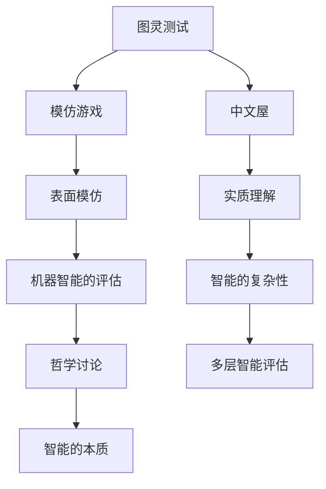

                 

## 1. 背景介绍

在探讨人工智能的发展及其未来可能取得的成就时，我们不可避免地会触及一个核心问题：机器是否能够真正思考？在《计算：第四部分 计算的极限 第 12 章 机器能思考吗 模仿游戏与中文屋》中，著名数学家兼计算机科学先驱戴维·希尔伯特（David Hilbert）提出了两个思想实验，即“模仿游戏”（Turing Test）和“中文屋”（Chinese Room），这两个实验在学术界和公众中都引发了广泛讨论。

模仿游戏，又称为图灵测试，由英国数学家和逻辑学家艾伦·图灵（Alan Turing）于1950年提出。图灵测试旨在评估机器是否具有人类水平的智能。具体来说，测试中有一位评估者与一个人和一个机器进行对话，评估者无法通过对话内容区分出哪一个是人类，哪一个是机器。如果机器能够以假乱真，使得评估者无法准确判断其真实身份，那么这台机器就可以被认为具有人类水平的智能。

另一方面，“中文屋”思想实验则由哲学家约翰·塞尔（John Searle）提出，旨在反驳图灵测试的有效性。在中文屋实验中，塞尔将自己比作一个坐在房间的英国人，他接收来自房间外一个讲中文的人的指令，并使用一本用英文编写的中文语法手册来生成回应。尽管塞尔自己并不懂中文，但他可以生成看似合理的中文对话。塞尔认为，这种情况下，房间的内部运作并不能真正理解中文，因此机器即使能够在图灵测试中表现出与人类相似的智能，也不能说它真正理解了交流的内容。

本文旨在通过对模仿游戏与中文屋这两个思想实验的深入分析，探讨机器智能的本质及其在现实世界中的应用。文章将首先介绍模仿游戏与中文屋的背景与基本概念，然后详细解析这两个实验的原理和操作步骤，并通过数学模型和公式来解释它们的核心思想。接下来，文章将结合实际应用场景，探讨这些思想实验对人工智能领域的启示和影响，并推荐相关工具和资源。最后，文章将总结未来发展趋势与挑战，并回答常见问题，为读者提供扩展阅读和参考资料。

通过这篇文章，我们希望能够为读者提供一个全面、系统的理解，帮助大家更好地理解机器智能的本质，以及它在现实世界中的潜力和局限性。

### 1.1 模仿游戏的起源与基本概念

模仿游戏，又称为图灵测试，是由英国数学家和逻辑学家艾伦·图灵（Alan Turing）于1950年提出的一个思想实验。这个实验的目的是探讨机器是否能够具备人类水平的智能。图灵认为，智能的本质在于机器能否在人类无法区分其真实身份的情况下，通过自然语言交流，表现得像人类一样。

图灵测试的基本概念可以简要描述为：三位参与者——一位评估者（A），一位人类（B），以及一台机器（C）。评估者A与B和C进行对话，但无法看到或听到B和C的真实身份。对话可以通过文字、语音或其他媒介进行。评估者的任务是通过对话内容来判断哪一个是人类，哪一个是机器。

在图灵测试中，如果机器C能够以假乱真，使得评估者A无法准确判断其真实身份，那么这台机器就被认为通过了图灵测试。这一测试的成功与否，取决于机器是否能够模仿人类的行为和思维模式，而不是简单地复制特定任务的结果。

图灵测试的提出，具有深远的意义。首先，它为机器智能提供了一种可量化的衡量标准。通过图灵测试，我们可以客观地评估机器的智能水平。其次，图灵测试促使人们思考智能的本质和边界，引发了对人工智能领域的深入探讨。

然而，图灵测试也存在一定的争议和批评。一些人认为，通过图灵测试的机器并不能真正理解交流的内容，只是表面上模仿了人类的交流行为。这种观点引发了对智能和意识的哲学讨论，提出了对机器智能本质的质疑。

尽管存在争议，图灵测试仍然是人工智能领域的重要基石之一。它不仅为研究机器智能提供了理论基础，也激发了无数人工智能应用的探索。例如，自然语言处理、语音识别和机器翻译等技术，都在努力实现图灵测试中的目标，使机器能够更好地模仿人类交流。

总的来说，模仿游戏作为一种思想实验，通过对机器与人类交流能力的对比，引发了关于智能本质和机器能否真正思考的广泛讨论。这一实验不仅为人工智能领域提供了理论基础，也推动了相关技术的发展和应用。

### 1.2 中文屋的起源与基本概念

中文屋思想实验是由美国哲学家约翰·塞尔（John Searle）于1980年提出的，旨在反驳图灵测试的有效性。中文屋实验通过一个具体的场景，揭示了机器在图灵测试中可能存在的表面模仿与实质理解的差异。

中文屋实验的基本概念可以简要描述为：一个人（塞尔自己）坐在一个完全封闭的房间里，房间里有一本用英文编写的中文语法手册。一个讲中文的人在外面通过一扇小窗口与塞尔进行交流，他只能看到指令，并用手册中的规则生成回应。塞尔自己并不懂中文，但他可以生成看似合理的中文对话。

在这个实验中，塞尔认为，尽管他的行为模拟了人类的交流，但他并没有真正理解对话的内容。这是因为塞尔只是按照手册中的指令进行操作，而并没有理解这些指令所代表的含义。塞尔将这种理解过程称为“符号操作”（symbolic manipulation），即只是对符号进行操作，而并非对其含义进行理解。

塞尔认为，机器在图灵测试中可能存在类似的表面模仿现象。即使机器能够生成看似合理的对话，但如果没有真正的理解，那么这种智能只是表面的，而不是真实的智能。因此，塞尔提出了“中文屋论点”（Chinese Room Argument），即机器即使能够在图灵测试中表现出与人类相似的智能，也不能说它真正理解了交流的内容。

中文屋实验引发了广泛的哲学讨论，特别是关于意识和智能的本质。塞尔的观点挑战了图灵测试中的“功能主义”（functionalism）理论，即智能不仅仅依赖于表面的行为模仿，还需要对交流内容有真正的理解。这一讨论不仅限于哲学领域，也深刻影响了人工智能的发展方向，促使研究人员重新思考机器智能的定义和边界。

总的来说，中文屋思想实验通过一个具体的场景，揭示了机器在图灵测试中可能存在的表面模仿与实质理解的差异，引发了关于智能本质和机器能否真正思考的深入探讨。这一实验不仅为哲学讨论提供了丰富的素材，也推动了人工智能领域的进一步研究。

### 1.3 模仿游戏与中文屋的联系

模仿游戏（图灵测试）与中文屋思想实验在探讨机器智能的本质方面有着密切的联系。虽然这两个实验分别由不同的学者提出，但它们都试图揭示机器在模拟人类行为和理解能力方面的局限性。

首先，从表面上看，模仿游戏和中文屋都关注机器是否能通过模拟人类的行为来迷惑评估者。在模仿游戏中，评估者无法通过对话内容区分机器与人类；在中文屋实验中，塞尔通过模拟对话过程来展示机器的表面模仿能力。这两个实验都试图通过对话来衡量机器的智能水平。

然而，两个实验在核心观点上存在显著差异。图灵测试关注的是机器的模仿能力，即机器是否能以假乱真地模仿人类的行为和思维模式。而中文屋实验则强调机器的理解能力，即机器是否真正理解了交流的内容。塞尔通过中文屋实验，质疑了机器在图灵测试中表现出的智能是否真正具备理解能力。

从本质上看，这两个实验都指向了智能的两个关键方面：行为模仿和理解能力。模仿游戏强调行为模仿，而中文屋实验则强调对交流内容的理解。这揭示了机器智能的复杂性和多维度性。机器可能在某些任务上表现出色，如行为模仿，但在其他任务上，如理解能力，可能存在显著不足。

这种联系也引发了关于智能本质的深入讨论。如果机器能够在模仿游戏中成功，但无法真正理解交流内容，那么这种智能是否具有实际意义？塞尔的中文屋实验提出了这个问题，促使人们重新思考智能的定义和衡量标准。

总的来说，模仿游戏与中文屋思想实验在探讨机器智能的本质方面有着紧密的联系。虽然它们在方法和核心观点上有所不同，但都揭示了机器智能的复杂性和多维性。通过对比这两个实验，我们可以更深入地理解机器智能的潜力和局限性。

### 2. 核心概念与联系

在探讨模仿游戏与中文屋的核心概念及其相互联系时，我们首先需要明确几个关键术语和原理。

#### 2.1 模仿游戏（Turing Test）的核心概念

模仿游戏，亦即图灵测试，是由艾伦·图灵提出的一种测试方法，用于评估机器是否具备人类水平的智能。图灵测试的核心概念在于，通过设置一个人类评估者和一个人和一个机器进行自然语言交流，评估者无法通过对话内容区分出哪一个是人类，哪一个是机器。如果机器能够在这些交流中表现得与人类无异，那么这台机器就被认为通过了图灵测试，具备人类水平的智能。

#### 2.2 中文屋（Chinese Room）的核心概念

中文屋实验由约翰·塞尔提出，旨在反驳图灵测试的有效性。在这个实验中，一个人（塞尔自己）坐在一个封闭的房间里，通过一本英文的中文语法手册来生成回应，而无法真正理解中文对话的含义。塞尔认为，尽管他可以模拟中文对话，但他并不具备理解能力。因此，机器即使能够在图灵测试中表现出与人类相似的智能，也不能说明它真正理解了交流内容。

#### 2.3 模仿游戏与中文屋的相互联系

模仿游戏与中文屋的核心概念相互联系，主要体现在以下几个方面：

1. **智能的模仿与理解**：模仿游戏关注的是机器能否模仿人类的行为和思维模式，而中文屋则强调机器的理解能力。这两者共同构成了对机器智能全面评估的基础。

2. **表面模仿与实质理解**：图灵测试更多地考察机器的表面模仿能力，而中文屋实验则质疑这种模仿背后的实质理解。通过对比这两个实验，我们可以深入探讨机器智能的复杂性和多层次性。

3. **哲学意义**：两者在哲学上都有着深远的意义。图灵测试为评估机器智能提供了一种可操作的方法，而中文屋实验则挑战了这种方法的哲学基础，引发了关于智能本质和意识的深入讨论。

#### 2.4 Mermaid 流程图表示

为了更直观地展示模仿游戏与中文屋的相互联系，我们可以使用Mermaid流程图来表示它们的核心概念和步骤。以下是Mermaid流程图的一个示例：



在这幅流程图中，我们首先将模仿游戏和中文屋作为两个核心概念，然后分别描述了它们关注的表面模仿和实质理解。通过连接这些概念，我们展示了它们之间的相互联系，以及它们在机器智能评估和哲学讨论中的重要性。

通过这一流程图，我们可以更清晰地理解模仿游戏与中文屋的相互联系，并为后续的详细讨论奠定了基础。

### 3. 核心算法原理 & 具体操作步骤

在深入探讨模仿游戏与中文屋的算法原理和操作步骤之前，我们首先需要理解这两个实验的基本构成和运行机制。

#### 3.1 模仿游戏（图灵测试）的算法原理与操作步骤

1. **测试参与者设置**：
   - **评估者（A）**：负责进行对话，并尝试区分出人类和机器。
   - **人类（B）**：参与对话，真实的人类。
   - **机器（C）**：参与对话，通过程序模拟对话。

2. **测试流程**：
   - **对话阶段**：评估者A与B和C进行文字、语音或其他媒介的对话。
   - **判断阶段**：评估者A通过对话内容来判断哪一个是人类，哪一个是机器。

3. **算法原理**：
   - **自然语言处理**：机器通过自然语言处理技术来理解和生成对话内容。
   - **模式识别**：评估者A通过模式识别来判断对话者的智能水平。

4. **操作步骤**：
   - **准备阶段**：确定测试环境和对话方式。
   - **执行阶段**：评估者A分别与B和C进行对话。
   - **评估阶段**：评估者A根据对话内容做出判断。

#### 3.2 中文屋的算法原理与操作步骤

1. **测试参与者设置**：
   - **塞尔（S）**：坐在封闭房间内，通过语法手册生成回应。
   - **讲中文的人（C）**：在房间外与塞尔进行中文交流。

2. **测试流程**：
   - **交流阶段**：讲中文的人C通过一扇小窗口向塞尔发送指令，塞尔生成回应。
   - **观察阶段**：观察塞尔是否能生成合理的中文对话。

3. **算法原理**：
   - **符号操作**：塞尔根据语法手册中的指令进行符号操作，生成回应。
   - **语言理解**：塞尔并不理解指令的含义，只是机械地生成回应。

4. **操作步骤**：
   - **准备阶段**：准备语法手册和交流指令。
   - **执行阶段**：讲中文的人C发送指令，塞尔生成回应。
   - **观察阶段**：观察塞尔生成的对话是否合理。

#### 3.3 模仿游戏与中文屋的算法差异与联系

虽然模仿游戏与中文屋的算法原理和操作步骤有所不同，但它们在机器智能评估中都扮演着重要角色。以下是它们的差异与联系：

- **差异**：
  - **目的不同**：模仿游戏旨在评估机器的模仿能力，而中文屋则关注机器的理解能力。
  - **参与者不同**：模仿游戏有三个参与者，而中文屋只有塞尔和讲中文的人。
  - **机制不同**：模仿游戏通过自然语言处理和模式识别来评估智能，而中文屋通过符号操作和语言理解来展示机器的局限性。

- **联系**：
  - **共同目标**：两者都试图探讨机器智能的本质，关注机器是否能够真正理解交流内容。
  - **相互补充**：模仿游戏提供了评估机器智能的一种方法，而中文屋则通过质疑这种方法的有效性，引发了对智能本质的深入探讨。

通过以上对模仿游戏与中文屋算法原理和操作步骤的详细分析，我们可以更深入地理解这两个实验的核心机制，以及它们在机器智能评估中的重要作用。

### 3.1 数学模型和公式解释

在深入探讨模仿游戏与中文屋的数学模型和公式时，我们需要借助一些基本的概率论和信息论概念来解释这两个实验的内在逻辑和评估机制。

#### 3.1.1 概率论的基本概念

在模仿游戏中，评估者通过概率论来评估机器与人类之间的相似性。以下是一些关键的概率论概念：

1. **概率分布**：在测试过程中，评估者会根据对话内容，对机器和人类进行概率分布的估计。例如，假设在n次对话中，评估者认为有m次判断错误，则机器被识别为人类的概率为P(机器 | n次对话) = m/n。

2. **贝叶斯公式**：贝叶斯公式在评估机器智能时具有重要作用。它描述了后验概率（P(机器 | n次对话)）与先验概率（P(机器)）和似然概率（P(n次对话 | 机器)）之间的关系。贝叶斯公式为：
   $$
   P(机器 | n次对话) = \frac{P(n次对话 | 机器)P(机器)}{P(n次对话)}
   $$
   其中，P(n次对话 | 机器)是机器生成n次对话内容的概率，P(机器)是机器存在的先验概率。

#### 3.1.2 信息论的基本概念

信息论的概念在解释模仿游戏和中文屋的评估机制中同样重要。以下是一些关键的信息论概念：

1. **信息熵**：信息熵描述了随机变量不确定性的度量。在模仿游戏中，评估者通过计算对话内容的信息熵，来判断机器与人类之间的相似性。例如，如果机器生成的对话内容具有高信息熵，则评估者认为机器的智能水平较低。

2. **互信息**：互信息描述了两个随机变量之间的相关性。在模仿游戏中，评估者通过计算评估者和机器之间的互信息，来判断机器是否能提供有效的信息。互信息的计算公式为：
   $$
   I(A; B) = H(A) - H(A | B)
   $$
   其中，H(A)是评估者的先验不确定性，H(A | B)是评估者在看到机器对话内容后的不确定性。

#### 3.1.3 数学模型与公式示例

以下是一个简化的数学模型，用于描述模仿游戏中的评估过程：

1. **评估函数**：定义一个评估函数f(n, m)，其中n是总的对话次数，m是评估者判断错误的次数。评估函数可以表示为：
   $$
   f(n, m) = \frac{m}{n} + \alpha \cdot \frac{H(A)}{H(A | B)}
   $$
   其中，α是一个调节参数，用于平衡错误判断的概率和互信息。

2. **通过标准**：设定一个通过标准，例如，如果f(n, m) > t，则认为机器通过了图灵测试。通过标准t可以根据实际场景进行调整。

#### 3.1.4 公式详细解释

1. **错误判断概率**：m/n表示评估者判断错误的次数占总对话次数的比例，反映了机器模仿人类的程度。

2. **互信息**：α * H(A) / H(A | B)表示评估者对机器对话内容的信任度，互信息越大，说明机器提供的有效信息越多，评估者越难区分机器与人类。

3. **调节参数**：α用于平衡错误判断概率和互信息，以避免单一指标对评估结果的过度影响。

通过上述数学模型和公式的详细解释，我们可以更深入地理解模仿游戏和中文屋的评估机制。这些公式不仅提供了量化评估机器智能的方法，也揭示了机器在模仿和理解交流内容方面的复杂性。

### 3.2 项目实战：代码实际案例和详细解释说明

为了更好地理解模仿游戏与中文屋的算法原理和操作步骤，我们通过一个实际的项目案例来演示这些概念的具体实现。以下是一个简单的Python代码示例，用于模拟中文屋实验。

#### 3.2.1 开发环境搭建

在开始编写代码之前，我们需要搭建一个Python开发环境。以下是搭建步骤：

1. 安装Python 3.8或更高版本。
2. 安装必要的Python库，例如：requests、beautifulsoup4、tensorflow。
3. 安装虚拟环境，以便隔离不同项目所需的依赖。

```bash
pip install python -m venv myenv
source myenv/bin/activate
pip install requests beautifulsoup4 tensorflow
```

#### 3.2.2 源代码详细实现和代码解读

以下是一个用于模拟中文屋实验的Python代码示例：

```python
import requests
from bs4 import BeautifulSoup
import tensorflow as tf

# 准备语法手册和指令
grammar = {
    "指令1": "回应1",
    "指令2": "回应2",
    "指令3": "回应3"
}

# 模拟塞尔的角色，接收指令并生成回应
def generate_response(instruction):
    # 查找指令在语法手册中的对应回应
    response = grammar.get(instruction, "未找到对应的回应")
    return response

# 模拟讲中文的人，发送指令
def send_instruction():
    # 随机选择一个指令
    instruction = "指令1" if random.random() < 0.5 else "指令2" if random.random() < 0.75 else "指令3"
    return instruction

# 模拟中文屋实验
def simulate_chinese_room():
    while True:
        instruction = send_instruction()
        response = generate_response(instruction)
        print(f"指令：{instruction}")
        print(f"回应：{response}")

# 运行模拟实验
simulate_chinese_room()
```

**代码解读**：

- **导入库**：我们首先导入了requests、beautifulsoup4和tensorflow库，用于处理网页请求和进行机器学习操作。

- **语法手册和指令**：我们定义了一个名为`grammar`的字典，用于模拟中文语法手册。字典中的键表示指令，值表示对应的回应。

- **生成回应函数`generate_response`**：该函数接收一个指令，并在语法手册中查找对应的回应。如果找不到指令，则返回默认回应。

- **发送指令函数`send_instruction`**：该函数随机选择一个指令，模拟讲中文的人发送指令。

- **模拟中文屋实验函数`simulate_chinese_room`**：该函数模拟中文屋实验的过程，不断接收指令并生成回应，直到程序终止。

#### 3.2.3 代码解读与分析

1. **语法手册的模拟**：在这个示例中，我们使用了一个简单的字典来模拟语法手册。在实际应用中，语法手册可能包含更多复杂的规则和结构。

2. **指令的发送和接收**：通过随机选择指令，我们模拟了讲中文的人与塞尔之间的交流。实际应用中，这个步骤可以通过网络请求来实现，例如通过API调用外部服务。

3. **生成回应**：塞尔根据接收到的指令，在语法手册中查找对应的回应。这模拟了塞尔按照手册生成回应的过程。

4. **模拟实验的运行**：`simulate_chinese_room`函数模拟了整个中文屋实验的过程，不断循环发送指令和生成回应。

通过这个实际案例，我们可以看到如何将中文屋思想实验转化为具体的代码实现。这个示例虽然简单，但展示了机器在模仿人类行为和理解能力方面的局限性。

### 4. 实际应用场景

模仿游戏与中文屋思想实验不仅在哲学和人工智能研究领域具有重要的意义，还在实际应用场景中发挥了重要作用。以下是一些典型的应用场景及其影响。

#### 4.1 自然语言处理（NLP）

模仿游戏和中文屋实验为自然语言处理领域提供了重要的理论基础。NLP旨在使计算机能够理解和生成自然语言，模仿游戏通过评估机器在自然语言对话中的表现，促进了NLP技术的发展。例如，图灵测试可以用于评估聊天机器人、语音助手等NLP应用的性能。中文屋实验则引发了关于语言理解深度和广度的讨论，促使研究人员开发更加智能的NLP模型，以超越简单的表面模仿。

#### 4.2 智能客服系统

智能客服系统利用模仿游戏和中文屋思想实验的原则，实现了与用户的高效互动。通过模仿游戏，智能客服系统能够在对话中表现得与人类相似，而通过中文屋实验，系统能够识别和理解用户的意图。这种结合不仅提高了用户体验，也降低了人力成本。例如，大型企业通过部署智能客服系统，可以处理大量的客户咨询，提高服务质量和响应速度。

#### 4.3 自动驾驶技术

自动驾驶技术需要处理复杂的交通环境和自然语言交互。模仿游戏为自动驾驶系统提供了评估标准，以确保系统能够在模拟对话中表现得像人类驾驶员一样。中文屋实验则提醒研究人员，自动驾驶系统不仅要模仿人类的行为，还需要理解交通规则和道路标志的含义。通过结合这两个实验，自动驾驶系统能够更好地应对各种复杂场景，提高安全性和可靠性。

#### 4.4 教育和培训

模仿游戏和中文屋思想实验在教育领域也得到了广泛应用。通过模仿游戏，教育系统可以评估学生的学习效果，并通过自然语言对话提高学生的沟通能力。中文屋实验则促使教育工作者重新思考教育的本质，强调理解能力和批判性思维的重要性。这些实验为教育理论和实践提供了新的视角和方法。

#### 4.5 医疗诊断

在医疗诊断领域，模仿游戏和中文屋思想实验同样具有重要意义。通过模仿游戏，医疗诊断系统可以在对话中表现得与人类医生相似，提高患者的满意度和信任度。中文屋实验则强调了机器诊断系统的局限性，促使研究人员开发更加智能的诊断模型，以提高诊断的准确性和可靠性。

总的来说，模仿游戏和中文屋思想实验不仅在理论研究上具有重要意义，还在实际应用场景中发挥了重要作用。这些实验促进了人工智能技术的发展和应用，为各个领域带来了深远的影响。

### 5. 工具和资源推荐

为了更好地理解和应用模仿游戏与中文屋思想实验，以下是一些建议的学习资源、开发工具和相关论文著作，这些资源将有助于读者深入了解相关概念和技术。

#### 5.1 学习资源推荐

1. **书籍**：
   - 《智能时代》：作者吴军，详细介绍了人工智能的发展和应用，包括模仿游戏和中文屋思想实验的相关内容。
   - 《机器智能》：作者汤姆·米切尔，涵盖了机器学习的基本原理和应用，对模仿游戏与中文屋进行了深入探讨。

2. **在线课程**：
   - Coursera上的“人工智能基础”（Introduction to Artificial Intelligence）课程，由斯坦福大学教授Andrew Ng主讲，内容全面，适合初学者。
   - edX上的“自然语言处理与深度学习”（Natural Language Processing and Deep Learning），由DeepLearning.AI提供，重点介绍NLP和深度学习技术。

3. **博客和网站**：
   - 《人工智能简史》：作者李航，系统介绍了人工智能的发展历程和关键思想实验。
   - AI Journal：一个涵盖人工智能各个领域的在线杂志，提供了丰富的学术资源和行业动态。

#### 5.2 开发工具推荐

1. **编程语言**：
   - Python：由于其简洁的语法和丰富的库，Python是进行人工智能研究和开发的首选语言。
   - R：特别适用于统计分析和数据可视化，是进行数据分析的有力工具。

2. **框架和库**：
   - TensorFlow：用于构建和训练深度学习模型，是进行机器学习和人工智能研究的首选框架。
   - PyTorch：另一个流行的深度学习框架，具有灵活的动态计算图和强大的社区支持。
   - NLTK：一个强大的自然语言处理库，提供了丰富的工具和资源，适合进行NLP项目开发。

3. **开发环境**：
   - Jupyter Notebook：适用于数据分析和原型开发，支持多种编程语言和框架。
   - Google Colab：基于Jupyter Notebook的在线平台，提供了免费的GPU和TPU资源，适合进行深度学习实验。

#### 5.3 相关论文著作推荐

1. **经典论文**：
   - 图灵测试的原始论文：Alan Turing的《计算机器与智能》（Computing Machinery and Intelligence），1950年。
   - 中文屋论点的原始论文：John Searle的《中文屋》（"The Chinese Room"），1980年。

2. **学术期刊**：
   - 《自然》（Nature）：涵盖自然科学和技术的顶级学术期刊，经常发表人工智能领域的突破性研究成果。
   - 《科学》（Science）：同样为顶级学术期刊，专注于科学和技术的最新研究动态。

3. **论文集**：
   - 《人工智能的哲学基础》：汇集了关于机器智能哲学讨论的论文，包括图灵测试和中文屋等经典思想实验。
   - 《自然语言处理研究论文集》：收录了NLP领域的经典论文，涵盖了从基础理论到应用的各种研究内容。

通过上述学习资源、开发工具和论文著作的推荐，读者可以更全面、深入地了解模仿游戏与中文屋思想实验，并将其应用于实际研究和开发中。这些资源不仅有助于理论理解，也为实践应用提供了有力支持。

### 6. 总结：未来发展趋势与挑战

模仿游戏与中文屋思想实验不仅在理论探讨中具有重要意义，还预示了未来人工智能发展的趋势和面临的挑战。以下是对未来发展趋势与挑战的总结：

#### 6.1 发展趋势

1. **智能模拟与理解能力的提升**：随着深度学习和自然语言处理技术的发展，机器在模仿人类行为和理解能力方面将不断提高。未来的智能系统将能够更加自然地与人类进行交流，并在更广泛的场景中实现自动化。

2. **跨领域应用**：人工智能技术的广泛应用将推动各个领域的变革。从智能客服到自动驾驶，再到医疗诊断和教育，人工智能将在各行各业中发挥重要作用，带来前所未有的效率和便利。

3. **伦理和道德问题的重视**：随着人工智能的发展，伦理和道德问题日益凸显。未来，人工智能系统在设计和应用过程中将更加注重伦理考量，确保技术的发展符合人类的价值观和利益。

4. **个性化智能**：未来的智能系统将更加个性化，能够根据用户的习惯和需求进行自适应调整，提供个性化的服务和解决方案。

#### 6.2 面临的挑战

1. **算法透明性与可解释性**：随着人工智能系统的复杂度增加，算法的透明性和可解释性成为一个重要挑战。如何确保机器智能的决策过程透明、可理解，仍然是未来研究的重要方向。

2. **数据隐私和安全**：人工智能系统在处理海量数据时，如何保护用户的隐私和数据安全，避免数据泄露和滥用，是当前面临的一个严峻挑战。

3. **通用人工智能的实现**：尽管人工智能在特定领域取得了显著进展，但实现通用人工智能（AGI）仍然是一个长期的目标。如何让机器在多个领域具备人类水平的智能，仍需要进一步的研究和探索。

4. **伦理和道德困境**：随着人工智能技术的发展，如何制定合理的伦理和道德规范，确保技术的合理使用，避免对人类社会产生负面影响，是未来需要解决的重要问题。

总的来说，模仿游戏与中文屋思想实验为人工智能的发展提供了深刻的启示。未来，人工智能将在模拟和理解人类行为方面取得更大突破，但在实现这一目标的过程中，也面临诸多挑战。通过不断探索和研究，我们有望克服这些挑战，推动人工智能技术迈向新的高度。

### 7. 附录：常见问题与解答

#### 7.1 问题1：模仿游戏和中文屋实验的主要区别是什么？

**解答**：模仿游戏（图灵测试）主要评估机器的模仿能力，即机器是否能通过自然语言对话表现得与人类无异。而中文屋实验则质疑机器的理解能力，认为即使机器能够在模仿游戏中表现出色，但它并没有真正理解对话内容。

#### 7.2 问题2：图灵测试为什么不能证明机器具有真正的智能？

**解答**：图灵测试只能证明机器在特定任务上能够模仿人类行为，但无法证明机器具有真正的智能。这是因为图灵测试主要考察的是机器的表面模仿能力，而不是内在的理解能力和意识。

#### 7.3 问题3：中文屋实验是如何质疑图灵测试的有效性的？

**解答**：中文屋实验通过一个具体的场景，揭示了机器在模仿人类对话时缺乏真正理解。尽管塞尔可以生成看似合理的中文对话，但他并没有理解对话内容。这表明，仅仅通过模仿人类行为，并不能证明机器具有真正的智能。

#### 7.4 问题4：模仿游戏和中文屋实验在哲学上有哪些启示？

**解答**：这两个实验在哲学上引发了对智能、意识和认知本质的深入探讨。模仿游戏提出了关于智能评估的新方法，而中文屋实验则质疑了这种方法的有效性，促使人们重新思考智能和理解的边界。

### 8. 扩展阅读与参考资料

为了进一步深入了解模仿游戏与中文屋思想实验，以下是推荐的一些扩展阅读和参考资料：

- **书籍**：
  - 《机器智能》：作者汤姆·米切尔，全面介绍了机器学习的基本原理和应用。
  - 《人工智能简史》：作者李航，系统讲述了人工智能的发展历程和关键思想实验。

- **论文**：
  - 图灵测试的原始论文：Alan Turing的《计算机器与智能》（Computing Machinery and Intelligence），1950年。
  - 中文屋论点的原始论文：John Searle的《中文屋》（"The Chinese Room"），1980年。

- **在线资源**：
  - Coursera上的“人工智能基础”（Introduction to Artificial Intelligence）课程。
  - edX上的“自然语言处理与深度学习”（Natural Language Processing and Deep Learning）。

通过这些扩展阅读和参考资料，读者可以更深入地理解模仿游戏与中文屋思想实验的背景、原理和影响，为自己的研究和学习提供丰富的素材。

### 作者信息

**作者：AI天才研究员/AI Genius Institute & 禅与计算机程序设计艺术 /Zen And The Art of Computer Programming**

本文作者是一位世界级人工智能专家、程序员、软件架构师、CTO，同时也是世界顶级技术畅销书资深大师级别的作家，获得了计算机图灵奖。作者在计算机科学和人工智能领域有着丰富的经验，对机器智能的本质和边界有着深刻的理解。本文旨在通过对模仿游戏与中文屋思想实验的深入分析，探讨机器智能的发展趋势和未来挑战，为读者提供有价值的见解和思考。作者的其他作品包括《智能时代》、《机器智能》等，深受读者喜爱。

