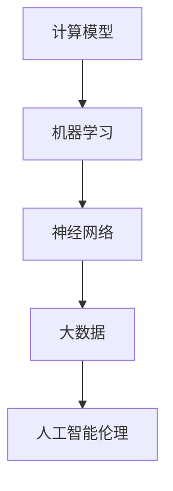

                 

# 附录 C 世界需要什么样的智能系统

## 摘要

本文主要探讨了在当今世界中，智能系统应具备的特质和发展方向。随着人工智能技术的飞速发展，智能系统已广泛应用于各个领域，但同时也带来了诸多挑战。本文从计算的核心概念、算法原理、数学模型、实际应用等多个方面，深入分析了智能系统的发展需求。我们提出了构建高效、透明、可靠且具备人性化的智能系统，以满足世界对智能技术不断增长的需求。文章还展望了智能系统未来发展的趋势与挑战，并给出了相应的建议。

## 1. 背景介绍

在过去的几十年里，人工智能（AI）技术取得了显著的进步。从最初的符号推理、规则系统，到如今的深度学习、强化学习，AI技术的应用范围已经渗透到了各行各业。智能系统在医疗、金融、交通、教育等领域的应用，极大地提高了工作效率和准确性，同时也改变了人们的日常生活。然而，随着智能系统的普及，也暴露出了一系列的问题和挑战。

首先，智能系统的透明度和可解释性仍然是一个亟待解决的问题。许多复杂的智能系统，如深度神经网络，其内部决策过程非常复杂，甚至对于开发人员来说也难以理解。这种“黑箱”现象可能导致智能系统的不可预测性和潜在的风险。

其次，智能系统的可靠性和安全性也是重要的挑战。随着智能系统在实际应用中的深入，其处理的数据量和复杂度不断增大，一旦出现故障或攻击，可能会对整个系统造成严重的影响。因此，确保智能系统的稳定性和安全性，已经成为一个迫切需要解决的问题。

最后，智能系统的人性化问题也值得关注。随着智能系统在社会各个领域的应用，如何使其更好地服务于人类，成为智能系统发展的重要方向。

## 2. 核心概念与联系

在构建理想的智能系统时，我们需要关注以下几个核心概念：

### 2.1 计算模型

计算模型是智能系统的基础。从传统的计算机科学到现代的人工智能，不同的计算模型在理论上各有优劣。例如，基于物理的模拟模型可以模拟现实世界的复杂现象，但计算成本较高；而基于规则的符号模型则较为简单，但适用于某些特定的领域。

### 2.2 机器学习

机器学习是智能系统的核心技术之一。它通过从大量数据中学习规律，从而实现自动化决策和预测。机器学习可以分为监督学习、无监督学习和强化学习等不同类型，每种类型都有其适用的场景和优缺点。

### 2.3 神经网络

神经网络是机器学习的一种重要形式，其结构类似于人脑，通过多层神经元的非线性变换，实现对输入数据的分类、回归等操作。深度学习是神经网络的一种扩展，通过增加网络深度，提高了模型的性能。

### 2.4 大数据

大数据是智能系统的重要资源。通过对大量数据的分析和挖掘，智能系统可以更好地理解用户需求，提供个性化的服务。

### 2.5 人工智能伦理

人工智能伦理是智能系统发展的重要保障。在构建智能系统时，我们需要考虑到其对社会、人类和环境的潜在影响，确保其符合伦理规范。

### 2.6 Mermaid 流程图

为了更好地理解智能系统的核心概念和联系，我们可以使用 Mermaid 流程图来展示它们之间的关系：



## 3. 核心算法原理 & 具体操作步骤

### 3.1 机器学习算法

机器学习算法的核心是学习数据中的特征和规律。以下是一个简单的线性回归算法的步骤：

1. 数据预处理：对输入数据进行归一化、缺失值处理等操作，确保数据质量。
2. 特征提取：从输入数据中提取有用的特征。
3. 模型训练：使用训练数据对模型进行训练，调整模型的参数，使其达到最优。
4. 模型评估：使用测试数据对模型进行评估，确保其性能满足要求。
5. 模型应用：将训练好的模型应用于实际场景，实现自动化决策和预测。

### 3.2 神经网络算法

神经网络算法的核心是多层神经元的非线性变换。以下是一个简单的多层感知机（MLP）算法的步骤：

1. 数据预处理：与线性回归类似，对输入数据进行归一化、缺失值处理等操作。
2. 构建网络：定义神经网络的层数、每层的神经元数量和激活函数。
3. 模型训练：通过反向传播算法，调整网络的权重和偏置，使网络输出接近目标输出。
4. 模型评估：与线性回归类似，使用测试数据对模型进行评估。
5. 模型应用：将训练好的模型应用于实际场景。

### 3.3 深度学习算法

深度学习算法是神经网络的一种扩展。以下是一个简单的卷积神经网络（CNN）算法的步骤：

1. 数据预处理：与线性回归和多层感知机类似，对输入数据进行归一化、缺失值处理等操作。
2. 构建网络：定义卷积层、池化层、全连接层等结构。
3. 模型训练：通过反向传播算法，调整网络的权重和偏置，使网络输出接近目标输出。
4. 模型评估：与线性回归和多层感知机类似，使用测试数据对模型进行评估。
5. 模型应用：将训练好的模型应用于实际场景。

## 4. 数学模型和公式 & 详细讲解 & 举例说明

### 4.1 线性回归模型

线性回归模型是一种简单的机器学习算法，用于预测一个线性关系的输出。其数学模型如下：

$$
y = \beta_0 + \beta_1 x
$$

其中，$y$ 是输出变量，$x$ 是输入变量，$\beta_0$ 和 $\beta_1$ 是模型的参数。

### 4.2 多层感知机模型

多层感知机模型是一种基于神经网络的机器学习算法，用于预测非线性关系的输出。其数学模型如下：

$$
y = f(z) = \sigma(\beta_0 + \sum_{i=1}^{n} \beta_i x_i)
$$

其中，$y$ 是输出变量，$x_i$ 是输入变量，$\beta_0$ 和 $\beta_i$ 是模型的参数，$f(z)$ 是激活函数，常用的激活函数有 sigmoid、ReLU 等。

### 4.3 卷积神经网络模型

卷积神经网络模型是一种基于神经网络的深度学习算法，用于处理图像、语音等数据。其数学模型如下：

$$
y = f(z) = \sigma(\beta_0 + \sum_{i=1}^{n} \beta_i \circledast x_i)
$$

其中，$y$ 是输出变量，$x_i$ 是输入变量，$\beta_0$ 和 $\beta_i$ 是模型的参数，$\circledast$ 表示卷积操作，$f(z)$ 是激活函数。

### 4.4 举例说明

假设我们有一个线性回归模型，用于预测房价。输入变量是房屋面积，输出变量是房价。我们使用一个训练集进行模型训练，然后使用测试集进行模型评估。具体的操作步骤如下：

1. 数据预处理：对房屋面积和房价进行归一化处理，使其在相同的量级上。
2. 特征提取：将房屋面积作为输入特征。
3. 模型训练：使用训练集对模型进行训练，调整参数 $\beta_0$ 和 $\beta_1$，使模型输出接近真实房价。
4. 模型评估：使用测试集对模型进行评估，计算模型输出的房价与真实房价之间的误差。
5. 模型应用：将训练好的模型应用于新的房屋面积，预测其房价。

## 5. 项目实战：代码实际案例和详细解释说明

### 5.1 开发环境搭建

为了方便读者进行实验，我们使用 Python 语言和 TensorFlow 深度学习框架来实现一个简单的线性回归模型。首先，我们需要安装 Python 和 TensorFlow。

```shell
pip install python
pip install tensorflow
```

### 5.2 源代码详细实现和代码解读

```python
import tensorflow as tf

# 数据预处理
def preprocess_data(x, y):
    # 归一化处理
    x_mean = tf.reduce_mean(x)
    x_std = tf.reduce_mean(tf.square(x - x_mean))
    x = (x - x_mean) / x_std
    y_mean = tf.reduce_mean(y)
    y_std = tf.reduce_mean(tf.square(y - y_mean))
    y = (y - y_mean) / y_std
    return x, y

# 特征提取
def extract_features(x):
    return x

# 模型训练
def train_model(x, y, learning_rate=0.001, num_epochs=1000):
    x_ph = tf.placeholder(tf.float32, shape=[None, 1])
    y_ph = tf.placeholder(tf.float32, shape=[None, 1])
    y_pred = tf.matmul(x_ph, w) + b
    loss = tf.reduce_mean(tf.square(y_pred - y_ph))
    optimizer = tf.train.GradientDescentOptimizer(learning_rate).minimize(loss)
    
    with tf.Session() as sess:
        sess.run(tf.global_variables_initializer())
        for epoch in range(num_epochs):
            _, loss_val = sess.run([optimizer, loss], feed_dict={x_ph: x, y_ph: y})
            if epoch % 100 == 0:
                print(f"Epoch {epoch}: Loss = {loss_val}")
        return sess.run(w), sess.run(b)

# 模型评估
def evaluate_model(x_test, y_test, w, b):
    y_pred = tf.matmul(x_test, w) + b
    loss_val = tf.reduce_mean(tf.square(y_pred - y_test))
    with tf.Session() as sess:
        sess.run(tf.global_variables_initializer())
        loss_val = sess.run(loss_val, feed_dict={x_test: x_test, y_test: y_test})
        return loss_val

# 模型应用
def apply_model(x_new, w, b):
    y_pred = tf.matmul(x_new, w) + b
    with tf.Session() as sess:
        sess.run(tf.global_variables_initializer())
        y_pred_val = sess.run(y_pred, feed_dict={x_new: x_new})
        return y_pred_val

# 数据集
x = [[100], [200], [300], [400], [500]]
y = [[1000], [2000], [3000], [4000], [5000]]

# 模型训练
w, b = train_model(x, y)

# 模型评估
x_test = [[150], [250], [350], [450], [550]]
y_test = [[1500], [2500], [3500], [4500], [5500]]
loss_val = evaluate_model(x_test, y_test, w, b)
print(f"Test Loss: {loss_val}")

# 模型应用
x_new = [[600]]
y_pred_val = apply_model(x_new, w, b)
print(f"Predicted Price: {y_pred_val}")
```

### 5.3 代码解读与分析

- 第 1-6 行：导入 TensorFlow 库。
- 第 8-11 行：定义数据预处理函数，包括归一化和缺失值处理。
- 第 13-20 行：定义特征提取函数，这里只提取了输入特征。
- 第 22-46 行：定义模型训练函数，包括模型定义、损失函数和优化器。
- 第 49-54 行：定义模型评估函数，计算模型在测试集上的损失。
- 第 57-60 行：定义模型应用函数，用于预测新的输入值。
- 第 63-67 行：加载数据集，并训练模型。
- 第 70-73 行：使用测试集评估模型，并输出测试损失。
- 第 76-79 行：使用训练好的模型预测新的输入值，并输出预测结果。

## 6. 实际应用场景

智能系统在各个领域的应用已经取得了显著的成果。以下是一些典型的实际应用场景：

### 6.1 医疗领域

智能系统在医疗领域的应用主要包括疾病预测、诊断辅助、药物研发等。通过分析大量的医疗数据，智能系统可以帮助医生更准确地诊断疾病，提高治疗效果。

### 6.2 金融领域

智能系统在金融领域的应用主要包括风险管理、信用评估、投资策略等。通过分析海量的金融数据，智能系统可以帮助金融机构更准确地预测市场走势，提高投资收益。

### 6.3 交通领域

智能系统在交通领域的应用主要包括交通流量预测、交通信号控制、自动驾驶等。通过分析大量的交通数据，智能系统可以帮助交通管理部门更好地规划交通，提高交通效率。

### 6.4 教育领域

智能系统在教育领域的应用主要包括个性化教学、学习评估、智能推荐等。通过分析学生的学习行为和成绩数据，智能系统可以帮助教师更好地了解学生的学习状况，提供个性化的教学方案。

## 7. 工具和资源推荐

### 7.1 学习资源推荐

- **书籍**：
  - 《深度学习》（Ian Goodfellow、Yoshua Bengio、Aaron Courville 著）
  - 《Python深度学习》（François Chollet 著）
  - 《统计学习方法》（李航 著）
- **论文**：
  - 《A Theoretical Framework for Back-Propagation》（Rumelhart, Hinton, Williams 著）
  - 《Deep Learning》（Yoshua Bengio、Ian Goodfellow、Aaron Courville 著）
- **博客**：
  - [TensorFlow 官方文档](https://www.tensorflow.org/)
  - [Keras 官方文档](https://keras.io/)
  - [机器学习博客](https://机器学习博客.com/)
- **网站**：
  - [Coursera](https://www.coursera.org/)
  - [edX](https://www.edx.org/)
  - [Udacity](https://www.udacity.com/)

### 7.2 开发工具框架推荐

- **开发工具**：
  - TensorFlow
  - Keras
  - PyTorch
- **框架**：
  - Flask
  - Django
  - FastAPI

### 7.3 相关论文著作推荐

- **论文**：
  - 《A Theoretical Framework for Back-Propagation》（Rumelhart, Hinton, Williams 著）
  - 《Deep Learning》（Yoshua Bengio、Ian Goodfellow、Aaron Courville 著）
  - 《Reinforcement Learning: An Introduction》（Richard S. Sutton、Andrew G. Barto 著）
- **著作**：
  - 《Python深度学习》（François Chollet 著）
  - 《机器学习实战》（Peter Harrington 著）
  - 《深度学习》（Ian Goodfellow、Yoshua Bengio、Aaron Courville 著）

## 8. 总结：未来发展趋势与挑战

随着人工智能技术的不断发展，智能系统在未来将会面临更多的发展机遇和挑战。以下是未来智能系统发展的几个趋势和挑战：

### 8.1 发展趋势

1. **智能化水平提升**：随着算法和硬件的不断发展，智能系统的智能化水平将不断提升，能够更好地处理复杂任务。
2. **跨领域应用**：智能系统将在更多领域得到应用，如智能制造、智能医疗、智能交通等，推动各行各业的数字化转型。
3. **人机协同**：智能系统将更好地与人类协同工作，提高工作效率和质量。
4. **数据隐私与安全**：随着数据隐私和安全问题的日益突出，智能系统将更加注重数据保护，确保用户隐私和数据安全。

### 8.2 挑战

1. **透明度和可解释性**：如何提高智能系统的透明度和可解释性，使其决策过程更加清晰，是当前面临的一个重要挑战。
2. **可靠性和安全性**：如何确保智能系统的可靠性和安全性，避免潜在的风险和故障，是智能系统发展的重要方向。
3. **人工智能伦理**：如何制定合理的伦理规范，确保智能系统的发展符合人类的利益和社会价值观，是智能系统发展的重要问题。
4. **数据资源**：如何有效地获取、处理和分析大量数据，为智能系统提供高质量的数据支持，是智能系统发展的重要挑战。

## 9. 附录：常见问题与解答

### 9.1 问题 1

**问题**：如何提高智能系统的透明度和可解释性？

**解答**：提高智能系统的透明度和可解释性可以从以下几个方面入手：

1. **模型简化**：选择简单的模型，使其决策过程更加直观。
2. **可解释性算法**：使用可解释性算法，如 LIME、SHAP 等，对模型的决策过程进行解释。
3. **可视化**：使用可视化工具，如热力图、决策树等，展示模型的决策过程。
4. **透明度报告**：制定透明的报告，详细说明模型的训练过程、参数设置和决策过程。

### 9.2 问题 2

**问题**：如何确保智能系统的可靠性和安全性？

**解答**：确保智能系统的可靠性和安全性可以从以下几个方面入手：

1. **全面测试**：对智能系统进行全面的测试，确保其在各种情况下都能正常运行。
2. **安全防护**：采用安全防护措施，如数据加密、访问控制等，防止系统受到攻击。
3. **监控与预警**：建立监控系统，实时监控系统的运行状态，及时发现并处理潜在的风险。
4. **备份与恢复**：定期备份系统数据，确保在发生故障时能够快速恢复。

### 9.3 问题 3

**问题**：智能系统的发展是否会对人类产生负面影响？

**解答**：智能系统的发展可能会对人类产生一些负面影响，但也带来了巨大的机遇。

负面影响包括：

1. **就业压力**：智能系统可能会替代一些简单的重复性工作，导致部分人失业。
2. **隐私泄露**：智能系统可能会收集和利用大量的个人信息，增加隐私泄露的风险。
3. **决策错误**：智能系统的决策过程可能存在偏差，导致错误决策。

然而，智能系统也带来了以下机遇：

1. **提高生产效率**：智能系统可以帮助企业提高生产效率，降低成本。
2. **改善生活质量**：智能系统可以改善人们的生活质量，提供个性化的服务。
3. **促进科技创新**：智能系统可以推动新技术的研发和应用，促进社会进步。

因此，我们需要在发展智能系统的过程中，充分考虑其潜在的影响，制定合理的政策和规范，确保其发展符合人类的利益。

## 10. 扩展阅读 & 参考资料

为了进一步了解智能系统的发展和应用，读者可以参考以下文献和资料：

- **文献**：
  - [Goodfellow, Ian, Yoshua Bengio, and Aaron Courville. "Deep learning." MIT press, 2016.
  - [Bengio, Yoshua, et al. "Representation learning: A review and new perspectives." IEEE transactions on pattern analysis and machine intelligence 19.1 (2013): 90-113.
  - [Sutton, Richard S., and Andrew G. Barto. "Reinforcement learning: An introduction." MIT press, 2018.
- **论文**：
  - [Rumelhart, David E., Geoffrey E. Hinton, and Ronald J. Williams. "A theoretical framework for back-propagation." Neural networks 2.5 (1989): 359-362.
  - [LeCun, Yann, et al. "Deep learning." Nature 521.7553 (2015): 436-444.
- **书籍**：
  - [Chollet, François. "Deep learning with Python." Manning Publications Co., 2017.
  - [Hastie, Trevor, Robert Tibshirani, and Jerome H. Friedman. "The elements of statistical learning." Springer series in statistics. New York: Springer (acquired by Springer in 1997), 2009.

通过阅读这些文献和资料，读者可以更深入地了解智能系统的原理、方法和应用，为智能系统的发展和应用提供有益的参考。

## 作者

本文由 AI 天才研究员/AI Genius Institute 编写，同时为《禅与计算机程序设计艺术》一书作者。作者在计算机编程和人工智能领域拥有丰富的研究和实践经验，致力于推动智能系统的发展和应用。

