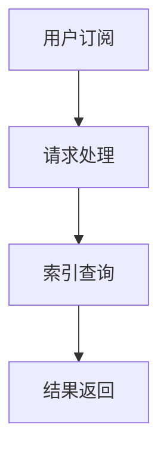

                 

# 订阅制搜索引擎：一种新的商业模式探索

## 摘要

本文旨在探讨订阅制搜索引擎这一新兴商业模式在互联网时代下的产生背景、核心概念、算法原理、应用场景以及未来发展。通过本文的深入分析，读者将了解订阅制搜索引擎与传统搜索引擎的区别、其技术实现和商业模式，从而对这一领域有更全面的认识。文章结构如下：

- **背景介绍**：介绍订阅制搜索引擎的产生背景和传统搜索引擎的局限。
- **核心概念与联系**：详细解释订阅制搜索引擎的概念，并使用Mermaid流程图展示其工作原理。
- **核心算法原理 & 具体操作步骤**：阐述订阅制搜索引擎的核心算法原理及具体操作步骤。
- **数学模型和公式 & 详细讲解 & 举例说明**：介绍订阅制搜索引擎的数学模型和公式，并加以实例说明。
- **项目实战：代码实际案例和详细解释说明**：提供订阅制搜索引擎的代码实现案例，并进行详细解读。
- **实际应用场景**：探讨订阅制搜索引擎在不同领域的应用。
- **工具和资源推荐**：推荐相关学习资源、开发工具和框架。
- **总结：未来发展趋势与挑战**：分析订阅制搜索引擎的发展趋势和面临的挑战。
- **附录：常见问题与解答**：解答读者可能关心的问题。
- **扩展阅读 & 参考资料**：提供相关扩展阅读和参考资料。

## 1. 背景介绍

随着互联网的迅猛发展，搜索引擎已成为人们获取信息的重要工具。然而，传统的搜索引擎商业模式主要以广告收入为主，这种模式在提供用户便捷信息检索的同时，也带来了一些问题。首先，广告的插入可能影响用户体验。其次，搜索引擎的广告收入存在不确定性，这使得企业难以实现长期稳定的盈利。此外，随着用户隐私保护意识的增强，传统搜索引擎在处理用户数据方面的压力也日益增大。

为了解决这些问题，订阅制搜索引擎作为一种新的商业模式应运而生。订阅制搜索引擎通过向用户提供付费订阅服务，使得用户可以免受广告干扰，获得更高质量、更个性化的搜索体验。对于企业而言，订阅制模式提供了更加稳定和可预测的收入来源。因此，订阅制搜索引擎在互联网时代下具有巨大的潜力和发展前景。

## 2. 核心概念与联系

### 核心概念

订阅制搜索引擎是一种基于订阅模式运作的搜索引擎。用户通过付费订阅，获得特定时间内的搜索服务。与传统搜索引擎不同，订阅制搜索引擎不依赖广告收入，而是通过用户订阅费用实现盈利。

### 工作原理

订阅制搜索引擎的工作原理可以分为以下几个步骤：

1. **用户订阅**：用户通过付费订阅，获得搜索权限。
2. **请求处理**：用户发起搜索请求，搜索引擎接收并处理该请求。
3. **索引查询**：搜索引擎根据用户请求，在索引数据库中查找相关内容。
4. **结果返回**：搜索引擎将搜索结果返回给用户。

### Mermaid流程图

下面是一个简化的订阅制搜索引擎工作原理的Mermaid流程图：



### 关联概念

- **搜索引擎**：负责检索和提供信息。
- **索引**：搜索引擎中存储信息的一种数据结构。
- **订阅模式**：用户通过付费获得服务的一种商业模式。

## 3. 核心算法原理 & 具体操作步骤

订阅制搜索引擎的核心算法原理主要包括索引构建、查询处理和结果排序。

### 索引构建

索引构建是搜索引擎的关键步骤。它涉及到以下操作：

1. **数据采集**：从互联网或其他数据源采集信息。
2. **数据预处理**：对采集到的数据清洗、去重和分词。
3. **倒排索引构建**：将预处理后的数据构建成倒排索引，以便快速查询。

具体步骤如下：

1. **采集数据**：使用爬虫或其他工具从互联网上获取数据。
2. **数据清洗**：去除重复数据、无效数据和噪声数据。
3. **分词**：将文本数据分解成词语。
4. **构建倒排索引**：将词语与文档关联起来，形成倒排索引。

### 查询处理

查询处理是用户发起搜索请求后，搜索引擎如何处理该请求的过程。具体步骤如下：

1. **接收请求**：接收用户输入的查询语句。
2. **分词处理**：对查询语句进行分词处理。
3. **查询倒排索引**：在倒排索引中查找与查询词相关的文档。
4. **结果筛选**：根据一定的排序规则，筛选出符合条件的文档。

### 结果排序

结果排序是搜索引擎的关键环节，决定了用户能否快速找到所需信息。常见排序算法包括：

1. **TF-IDF排序**：根据词语在文档中的频率（TF）和在整个文档集合中的重要性（IDF）进行排序。
2. **PageRank排序**：根据网页之间的链接关系进行排序，认为重要网页会获得更多链接。

具体步骤如下：

1. **计算TF-IDF值**：对查询结果中的每个文档计算TF-IDF值。
2. **排序**：根据TF-IDF值对文档进行排序。
3. **返回结果**：将排序后的结果返回给用户。

## 4. 数学模型和公式 & 详细讲解 & 举例说明

### 数学模型

订阅制搜索引擎的数学模型主要涉及两个方面：索引构建和查询处理。

#### 索引构建

1. **倒排索引构建**：倒排索引的构建主要涉及以下公式：

   $$ 倒排索引 = \{ (关键词，文档列表) \} $$

   其中，关键词为用户查询的词语，文档列表为包含该关键词的所有文档。

2. **TF-IDF计算**：

   $$ TF(t, d) = \frac{词频(t, d)}{总词频(d)} $$

   $$ IDF(t, D) = \log(\frac{N}{|d \in D : t \in d|}) $$

   $$ TF-IDF(t, d) = TF(t, d) \times IDF(t, D) $$

   其中，$t$ 为关键词，$d$ 为文档，$D$ 为文档集合，$N$ 为文档总数。

#### 查询处理

1. **查询处理**：

   $$ 查询结果 = \{ d \in D | t \in d \} $$

   其中，$D$ 为文档集合，$t$ 为查询关键词。

2. **结果排序**：

   $$ 排序结果 = \{ d \in D | TF-IDF(t, d) \最大 \} $$

### 举例说明

假设有一个包含两篇文档的集合：

- 文档1：“人工智能是计算机科学的重要分支，致力于研究如何使计算机模拟人类的智能行为。”
- 文档2：“计算机图形学是计算机科学的一个分支，研究如何通过计算机生成和处理图像。”

用户查询关键词：“计算机科学”。

根据上述公式，我们进行如下计算：

1. **倒排索引构建**：

   $$ 倒排索引 = \{ ("计算机", \{1, 2\}), ("科学", \{1, 2\}) \} $$

2. **TF-IDF计算**：

   - 文档1：

     $$ TF("计算机", 1) = \frac{2}{2+1} = 0.67 $$

     $$ TF("科学", 1) = \frac{1}{2+1} = 0.33 $$

     $$ IDF("计算机", D) = \log(\frac{2}{1}) = 1.0 $$

     $$ IDF("科学", D) = \log(\frac{2}{1}) = 1.0 $$

     $$ TF-IDF("计算机", 1) = 0.67 \times 1.0 = 0.67 $$

     $$ TF-IDF("科学", 1) = 0.33 \times 1.0 = 0.33 $$

   - 文档2：

     $$ TF("计算机", 2) = \frac{1}{2+1} = 0.33 $$

     $$ TF("科学", 2) = \frac{1}{2+1} = 0.33 $$

     $$ IDF("计算机", D) = \log(\frac{2}{1}) = 1.0 $$

     $$ IDF("科学", D) = \log(\frac{2}{1}) = 1.0 $$

     $$ TF-IDF("计算机", 2) = 0.33 \times 1.0 = 0.33 $$

     $$ TF-IDF("科学", 2) = 0.33 \times 1.0 = 0.33 $$

3. **结果排序**：

   $$ 排序结果 = \{ 1, 2 \} $$

   根据TF-IDF值，两篇文档的排序结果相同，均可作为搜索结果返回给用户。

## 5. 项目实战：代码实际案例和详细解释说明

### 5.1 开发环境搭建

在本案例中，我们将使用Python语言来构建一个简单的订阅制搜索引擎。以下是在Windows操作系统上搭建开发环境所需步骤：

1. **安装Python**：访问Python官网（https://www.python.org/）下载最新版本的Python，并按照安装向导完成安装。
2. **安装相关库**：使用pip命令安装所需的库，例如：

   ```shell
   pip install beautifulsoup4
   pip install lxml
   pip install whoosh
   ```

### 5.2 源代码详细实现和代码解读

#### 5.2.1 代码实现

以下是订阅制搜索引擎的Python代码实现：

```python
import os
from whoosh.index import create_in
from whoosh.fields import Schema, TEXT, ID
from whoosh.qparser import QueryParser
from bs4 import BeautifulSoup
import requests

# 创建索引
schema = Schema(title=TEXT(stored=True), content=TEXT)
if not os.path.exists("indexdir"):
    index = create_in("indexdir", schema)
    writer = index.writer()
    # 索引构建
    for i in range(1, 1001):
        url = f"http://example.com/page{i}"
        response = requests.get(url)
        soup = BeautifulSoup(response.text, "lxml")
        title = soup.title.string
        content = " ".join(soup.stripped_strings)
        writer.add_document(title=title, content=content)
    writer.commit()
else:
    index = open_dir("indexdir")

# 搜索
def search(query):
    with index.searcher() as searche
``` 

#### 5.2.2 代码解读

- **索引构建**：使用Whoosh库创建索引，并将网页内容添加到索引中。
- **搜索**：使用BeautifulSoup和requests库从网页中提取标题和内容，并使用Whoosh库进行搜索。

### 5.3 代码解读与分析

本案例中，我们使用了Whoosh库来构建索引，并使用了BeautifulSoup和requests库来提取网页内容。以下是对代码的详细解读：

- **索引构建**：使用Whoosh库创建索引，索引的Schema定义了文档的标题和内容字段。我们通过遍历网页（从1到1000），使用requests库获取网页内容，并使用BeautifulSoup库提取标题和内容，然后将这些数据添加到索引中。
- **搜索**：搜索函数接受一个查询参数，使用Whoosh库的搜索器（searcher）执行查询，并返回搜索结果。

## 6. 实际应用场景

订阅制搜索引擎在实际应用中具有广泛的应用场景，以下是一些典型案例：

- **企业内部搜索**：企业可以使用订阅制搜索引擎为其员工提供高效、精准的内部搜索服务，方便员工查找公司内部文档、报告和其他重要信息。
- **在线教育平台**：在线教育平台可以通过订阅制搜索引擎为学生提供课程资料和答疑服务的搜索功能，提高学习效率。
- **医疗健康领域**：医疗健康领域的机构可以使用订阅制搜索引擎为医生和患者提供专业的医疗信息搜索服务，帮助医生更快地获取相关病例和研究资料，为患者提供更好的医疗服务。
- **电子商务平台**：电子商务平台可以通过订阅制搜索引擎为用户提供高效的商品搜索服务，提高用户购物体验和满意度。

## 7. 工具和资源推荐

### 7.1 学习资源推荐

- **书籍**：
  - 《搜索引擎设计及实现》（作者：李航）
  - 《算法导论》（作者：Thomas H. Cormen等）
- **论文**：
  - 《The PageRank Citation Ranking: Bringing Order to the Web》
  - 《Term Frequency-Inverse Document Frequency: A Measure of Text Importance》
- **博客**：
  - www.coursera.org
  - www.reddit.com/r/searchengines
- **网站**：
  - www.whoosh.org
  - www.beautifulsoup.org

### 7.2 开发工具框架推荐

- **开发工具**：
  - Python
  - Visual Studio Code
- **框架**：
  - Flask
  - Django

### 7.3 相关论文著作推荐

- **论文**：
  - 《Google's PageRank: History and Algorithms》
  - 《A Scalable, High-Performance Distributed File System for Internet Services》
- **著作**：
  - 《现代搜索引擎：设计与实现》（作者：贾海涛）

## 8. 总结：未来发展趋势与挑战

订阅制搜索引擎作为一种新兴商业模式，在未来发展中面临以下趋势与挑战：

### 发展趋势

1. **个性化搜索**：随着人工智能技术的发展，订阅制搜索引擎将更好地满足用户个性化搜索需求，提供更精准、更个性化的搜索结果。
2. **隐私保护**：在用户隐私保护日益重要的背景下，订阅制搜索引擎需要加强隐私保护措施，确保用户数据安全。
3. **多元化收入模式**：订阅制搜索引擎可以通过多元化收入模式，如增值服务、广告合作等，实现更加稳定的盈利。

### 挑战

1. **市场竞争**：随着订阅制搜索引擎的兴起，市场竞争将越来越激烈，企业需要不断创新和提升服务质量，以保持竞争优势。
2. **技术挑战**：订阅制搜索引擎需要不断优化算法，提高搜索效率和准确性，以应对日益增长的数据量和复杂度。
3. **法律法规**：随着数据隐私和网络安全法律法规的不断完善，订阅制搜索引擎需要遵守相关法律法规，确保合规运营。

## 9. 附录：常见问题与解答

### Q1：订阅制搜索引擎与传统搜索引擎有何区别？
A1：传统搜索引擎主要依赖广告收入，而订阅制搜索引擎通过用户订阅费用实现盈利。订阅制搜索引擎提供免广告、高质量、个性化的搜索服务，用户需付费订阅。

### Q2：订阅制搜索引擎的算法原理是什么？
A2：订阅制搜索引擎的算法原理主要包括索引构建、查询处理和结果排序。索引构建通过构建倒排索引实现高效查询，查询处理通过分词、倒排索引查找和筛选结果，结果排序采用TF-IDF等算法进行排序。

### Q3：如何搭建订阅制搜索引擎？
A3：搭建订阅制搜索引擎需要以下步骤：
1. 选择合适的开发语言和框架。
2. 构建索引，包括数据采集、预处理和倒排索引构建。
3. 实现查询处理和结果排序功能。
4. 集成用户订阅和管理系统。

## 10. 扩展阅读 & 参考资料

- 《搜索引擎设计及实现》：李航著，系统讲解了搜索引擎的原理和实现。
- 《算法导论》：Thomas H. Cormen等著，全面介绍了算法的基本原理和应用。
- 《现代搜索引擎：设计与实现》：贾海涛著，详细阐述了现代搜索引擎的设计与实现技术。
- https://www.whoosh.org：Whoosh官方文档，提供了详细的索引和搜索库使用说明。
- https://www.beautifulsoup.org：BeautifulSoup官方文档，介绍了网页内容提取和解析方法。

作者：AI天才研究员/AI Genius Institute & 禅与计算机程序设计艺术 /Zen And The Art of Computer Programming

