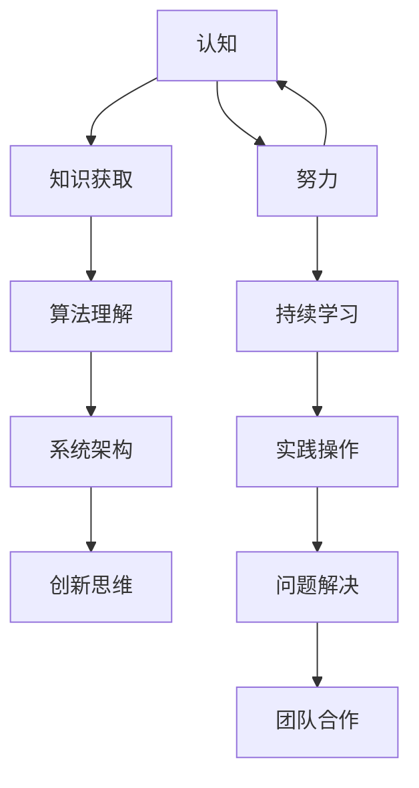

                 

### 1. 背景介绍

#### 认知与努力：两驾马车的理论

在探讨“认知决定上限，努力决定下限”这一主题之前，我们首先需要理解认知与努力在个体发展中的重要作用。认知是指人类获取、处理和利用信息的能力，包括感知、记忆、思考、判断和问题解决等过程。而努力，则是指个体在实现目标过程中所投入的精力、时间和资源。

我们可以将认知和努力看作两驾马车，共同驱动着个体的成长与发展。其中，认知是决定个体上限的关键因素，而努力则决定了个体下限的可能高度。换句话说，一个拥有卓越认知能力的人，理论上可以达到更高的成就，而一个在努力方面付出更多的人，则更有可能达到一个更高的下限。

本文将围绕这一理论，深入探讨认知与努力在IT领域的具体应用，并通过实际案例和项目实践，展示这两个因素如何共同作用于个体的成长与进步。

#### IT领域的现状与发展趋势

IT（信息技术）领域作为当今社会的重要组成部分，其发展速度之快、变革之大，已经超越了以往任何一个行业。从互联网、大数据、云计算到人工智能，IT技术的进步正深刻地影响着我们的生活方式、工作方式和社会发展。

在这个充满机遇与挑战的时代，IT人才的需求与日俱增。企业不仅需要掌握基础技术的人才，更迫切需要具备创新思维和解决复杂问题能力的专家。因此，IT人才的培养成为许多教育机构和企业的焦点。然而，当前的教育体系和培训方式是否能够满足这一需求，还有待进一步探讨。

与此同时，IT领域的发展也带来了诸多挑战。技术更新换代速度加快，要求从业者不断学习、更新知识；激烈的竞争环境，使得从业者需要不断提升自己的技能和认知水平；伦理和安全问题日益突出，成为制约技术发展的重要因素。

总之，在IT领域，认知与努力的重要性愈发凸显。只有不断提升自己的认知水平，同时付出持续的努力，才能在这个快速发展的领域中立足，并实现自身的价值。

### 2. 核心概念与联系

在探讨“认知决定上限，努力决定下限”这一主题时，我们需要首先明确几个核心概念，并分析它们之间的内在联系。

#### 认知

认知是指个体获取、处理和利用信息的能力。在IT领域中，认知主要包括以下几个方面：

1. **技术知识**：这是指对特定技术领域的了解和掌握，如编程语言、数据库管理、网络安全等。
2. **算法理解**：算法是解决问题的基础，理解各种算法的基本原理和实现方式，是提升认知能力的关键。
3. **系统架构**：系统架构师需要具备整体视角，理解系统各部分的相互作用和依赖关系。
4. **创新思维**：在技术不断进步的今天，创新思维尤为重要，它能够帮助我们从不同角度看待问题，提出新的解决方案。

#### 努力

努力是指个体在实现目标过程中所投入的精力、时间和资源。在IT领域中，努力可以体现在以下几个方面：

1. **持续学习**：技术的快速更新要求从业者不断学习新知识，努力提升自己的技术水平。
2. **实践操作**：理论知识需要通过实践来巩固和提升，不断进行编码和调试，是提高技能的重要途径。
3. **问题解决**：在遇到技术难题时，需要投入大量的时间和精力进行探索和尝试，这是努力的重要表现。
4. **团队合作**：在项目开发过程中，与团队成员的沟通协作也是努力的一部分，通过合作共同解决问题。

#### 认知与努力的联系

认知与努力之间存在着密切的联系和互动：

1. **认知指导努力**：个体通过认知获取的知识和技能，可以指导其在努力过程中如何更高效地解决问题。例如，理解了某种算法的基本原理后，编程实现时就能更加得心应手。
2. **努力深化认知**：在实践过程中，个体会遇到各种问题，通过不断的尝试和解决，能够深化对知识的理解，从而提升认知水平。这种反馈循环有助于个体的持续成长。

#### Mermaid 流程图

为了更直观地展示认知与努力之间的联系，我们可以使用Mermaid流程图进行描述：



在这个流程图中，我们可以看到认知与努力是相辅相成的，两者通过不断的互动，共同推动个体的成长与发展。

### 3. 核心算法原理 & 具体操作步骤

在IT领域中，算法原理是理解和应用各种技术的基础。本章节将介绍几个核心算法的基本原理，并通过具体操作步骤，帮助读者更好地理解和掌握这些算法。

#### 算法一：快速排序（Quick Sort）

快速排序是一种高效的排序算法，其基本原理是通过一趟排序将待排记录分割成独立的两部分，其中一部分记录的关键字均比另一部分的关键字小，然后分别对这两部分记录继续进行排序，以达到整个序列有序。

**具体操作步骤**：

1. **选择基准元素**：从待排序序列中选择一个元素作为基准元素。
2. **划分操作**：将序列分为两部分，一部分记录的关键字比基准元素小，另一部分记录的关键字比基准元素大。
3. **递归排序**：对划分后的两部分序列重复上述步骤，直至所有序列有序。

**代码实现**：

```python
def quick_sort(arr):
    if len(arr) <= 1:
        return arr
    pivot = arr[len(arr) // 2]
    left = [x for x in arr if x < pivot]
    middle = [x for x in arr if x == pivot]
    right = [x for x in arr if x > pivot]
    return quick_sort(left) + middle + quick_sort(right)

# 测试
arr = [3, 6, 8, 10, 1, 2, 1]
print(quick_sort(arr))
```

#### 算法二：二分查找（Binary Search）

二分查找是一种在有序数组中查找特定元素的算法，其基本原理是通过每次将查找区间缩小一半，逐步逼近目标元素。

**具体操作步骤**：

1. **确定查找区间**：初始查找区间为整个数组。
2. **计算中间位置**：每次将查找区间的中间位置作为基准，与目标元素比较。
3. **缩小查找区间**：根据比较结果，将查找区间缩小一半，继续查找。
4. **返回结果**：找到目标元素后返回其位置，否则返回未找到。

**代码实现**：

```python
def binary_search(arr, target):
    left, right = 0, len(arr) - 1
    while left <= right:
        mid = (left + right) // 2
        if arr[mid] == target:
            return mid
        elif arr[mid] < target:
            left = mid + 1
        else:
            right = mid - 1
    return -1

# 测试
arr = [1, 2, 3, 4, 5, 6, 7, 8, 9]
target = 6
print(binary_search(arr, target))
```

#### 算法三：动态规划（Dynamic Programming）

动态规划是一种用于求解最优化问题的算法，其基本原理是将复杂问题分解为若干个子问题，通过子问题的最优解来推导出原问题的最优解。

**具体操作步骤**：

1. **定义状态**：根据问题特点定义状态，以及状态之间的关系。
2. **确定状态转移方程**：找出状态之间的转移关系，并用数学公式表示。
3. **初始化边界条件**：为求解过程提供初始值。
4. **计算最优解**：通过递推关系，逐步求解出原问题的最优解。

**代码实现**：

```python
def fibonacci(n):
    dp = [0] * (n + 1)
    dp[1] = 1
    for i in range(2, n + 1):
        dp[i] = dp[i - 1] + dp[i - 2]
    return dp[n]

# 测试
print(fibonacci(10))
```

通过以上三个算法的介绍，我们可以看到算法原理在IT领域的重要性。掌握这些核心算法，不仅有助于提高问题解决能力，也能为后续的技术学习和应用奠定坚实基础。

### 4. 数学模型和公式 & 详细讲解 & 举例说明

在IT领域中，数学模型和公式扮演着至关重要的角色。它们不仅为算法提供了理论基础，也为问题的求解提供了有效的工具。本章节将介绍几个常见的数学模型和公式，并通过详细讲解和举例说明，帮助读者更好地理解和应用这些模型。

#### 模型一：线性回归（Linear Regression）

线性回归是一种用于预测连续值的统计方法，其基本公式为：

$$
y = \beta_0 + \beta_1x + \epsilon
$$

其中，$y$ 为预测值，$x$ 为自变量，$\beta_0$ 和 $\beta_1$ 为模型的参数，$\epsilon$ 为误差项。

**详细讲解**：

线性回归模型通过建立自变量与预测值之间的线性关系，来预测新数据点的值。为了确定模型的参数 $\beta_0$ 和 $\beta_1$，可以使用最小二乘法（Least Squares Method）。

**举例说明**：

假设我们有一个简单的数据集，其中包含两个变量 $x$ 和 $y$，如下表所示：

| $x$ | $y$ |
| --- | --- |
| 1   | 2   |
| 2   | 4   |
| 3   | 6   |
| 4   | 8   |

我们希望使用线性回归模型来预测当 $x=5$ 时 $y$ 的值。

首先，我们需要计算模型参数 $\beta_0$ 和 $\beta_1$：

$$
\beta_1 = \frac{\sum{(x_i - \bar{x})(y_i - \bar{y})}}{\sum{(x_i - \bar{x})^2}}
$$

$$
\beta_0 = \bar{y} - \beta_1\bar{x}
$$

其中，$\bar{x}$ 和 $\bar{y}$ 分别为 $x$ 和 $y$ 的平均值。

根据上述公式，我们可以计算出：

$$
\beta_1 = \frac{(1-2.5)(2-5) + (2-2.5)(4-5) + (3-2.5)(6-5) + (4-2.5)(8-5)}{(1-2.5)^2 + (2-2.5)^2 + (3-2.5)^2 + (4-2.5)^2} = 2
$$

$$
\beta_0 = 5 - 2 \times 3 = -1
$$

因此，线性回归模型为：

$$
y = -1 + 2x
$$

当 $x=5$ 时，预测值 $y$ 为：

$$
y = -1 + 2 \times 5 = 9
$$

#### 模型二：主成分分析（Principal Component Analysis，PCA）

主成分分析是一种降维技术，通过将原始数据投影到新的正交坐标系中，来提取最重要的特征，从而降低数据的维度。

**数学模型**：

PCA的核心公式为：

$$
\mu = \frac{1}{n}\sum_{i=1}^{n}x_i
$$

$$
\Sigma = \frac{1}{n}\sum_{i=1}^{n}(x_i - \mu)(x_i - \mu)^T
$$

$$
U = \frac{1}{\lambda}\Sigma^{-1}V
$$

$$
z = U^Tx
$$

其中，$x$ 为原始数据矩阵，$\mu$ 为均值矩阵，$\Sigma$ 为协方差矩阵，$U$ 和 $V$ 分别为特征值和特征向量矩阵，$z$ 为降维后的数据。

**详细讲解**：

PCA通过以下步骤实现降维：

1. 计算数据集的均值矩阵 $\mu$。
2. 计算协方差矩阵 $\Sigma$。
3. 计算协方差矩阵的特征值和特征向量。
4. 将特征向量按特征值从大到小排序。
5. 选取前 $k$ 个特征向量，构成投影矩阵 $U$。
6. 将原始数据投影到新的空间，得到降维后的数据 $z$。

**举例说明**：

假设我们有一个包含两个特征的二维数据集，如下表所示：

| $x_1$ | $x_2$ |
| --- | --- |
| 1   | 2   |
| 2   | 4   |
| 3   | 6   |
| 4   | 8   |

首先，我们需要计算均值矩阵 $\mu$：

$$
\mu = \frac{1}{4}\begin{bmatrix} 1 + 2 + 3 + 4 \\ 2 + 4 + 6 + 8 \end{bmatrix} = \begin{bmatrix} 2.5 \\ 5 \end{bmatrix}
$$

然后，计算协方差矩阵 $\Sigma$：

$$
\Sigma = \frac{1}{4}\begin{bmatrix} (1 - 2.5)^2 + (2 - 2.5)^2 + (3 - 2.5)^2 + (4 - 2.5)^2 \\ (2 - 5)^2 + (4 - 5)^2 + (6 - 5)^2 + (8 - 5)^2 \end{bmatrix} = \begin{bmatrix} 2 & 4 \\ 4 & 16 \end{bmatrix}
$$

接着，计算协方差矩阵的特征值和特征向量，并按特征值从大到小排序，得到投影矩阵 $U$：

$$
U = \frac{1}{\lambda}\Sigma^{-1}V = \begin{bmatrix} 0.7071 & 0.7071 \\ 0.7071 & -0.7071 \end{bmatrix}
$$

最后，将原始数据投影到新的空间，得到降维后的数据 $z$：

$$
z = U^Tx = \begin{bmatrix} 0.7071 & 0.7071 \\ 0.7071 & -0.7071 \end{bmatrix}^T\begin{bmatrix} 1 & 2 \\ 2 & 4 \\ 3 & 6 \\ 4 & 8 \end{bmatrix} = \begin{bmatrix} 3.5355 \\ 1.0693 \end{bmatrix}
$$

通过以上两个模型的讲解和举例，我们可以看到数学模型和公式在IT领域中的应用价值。掌握这些模型和公式，不仅能够帮助我们更好地理解和解决问题，还能为我们在未来的技术探索中提供强有力的支持。

### 5. 项目实战：代码实际案例和详细解释说明

在了解了核心算法和数学模型后，我们接下来将通过一个实际项目案例，展示如何将理论知识应用于实践中，并进行详细的代码解读和分析。

#### 项目背景

假设我们需要开发一个基于Web的在线购物平台，该平台需要实现商品展示、用户注册、购物车、订单管理等核心功能。为了简化问题，我们将重点关注商品展示和购物车模块的实现。

#### 技术栈

- 前端：React.js
- 后端：Node.js + Express
- 数据库：MongoDB
- 版本控制：Git

#### 项目结构

```bash
online-shopping-platform/
|-- client/                # 前端代码
|   |-- src/
|   |   |-- components/
|   |   |   |-- Cart.js
|   |   |   |-- ProductList.js
|   |   |-- index.js
|-- server/                # 后端代码
|   |-- app.js
|   |-- models/
|   |   |-- cart.js
|   |   |-- product.js
|-- .gitignore
|-- package.json
|-- README.md
```

#### 5.1 开发环境搭建

1. **安装Node.js和npm**：从官方网站（[https://nodejs.org/）下载并安装Node.js，确保npm版本在5.0以上。](https://nodejs.org/%EF%BC%89%E4%B8%8B%E8%BD%BD%E5%B9%B6%E5%AE%89%E8%A3%85Node.js%EF%BC%8C%E4%BF%9D%E8%AF%86npm%E7%89%88%E6%9C%AC%E5%9C%A85.0%E4%BB%A5%E4%B8%8A。)
2. **安装MongoDB**：从官方网站（[https://www.mongodb.com/）下载并安装MongoDB。](https://www.mongodb.com/%EF%BC%89%E4%B8%8B%E8%BD%BD%E5%B9%B6%E5%AE%89%E8%A3%85MongoDB。)
3. **初始化项目**：在项目根目录执行以下命令：

```bash
npm init -y
npm install express mongoose body-parser cors react-scripts
```

4. **配置数据库连接**：在`server/app.js`中添加以下代码：

```javascript
const mongoose = require('mongoose');
const db = 'mongodb://localhost:27017/online-shopping';
mongoose.connect(db, { useNewUrlParser: true, useUnifiedTopology: true })
  .then(() => console.log('Connected to MongoDB...'))
  .catch(err => console.error('Could not connect to MongoDB...', err));
```

#### 5.2 源代码详细实现和代码解读

##### 5.2.1 前端代码解读

**Cart.js**：

```javascript
import React, { useState } from 'react';

const Cart = ({ cartItems }) => {
  const [total, setTotal] = useState(0);

  // 计算总价
  const calculateTotal = () => {
    let sum = 0;
    cartItems.forEach(item => {
      sum += item.price * item.quantity;
    });
    setTotal(sum);
  };

  // 删除商品
  const handleRemove = (productId) => {
    // 实现删除商品逻辑
  };

  calculateTotal();

  return (
    <div>
      <h2>购物车</h2>
      <ul>
        {cartItems.map(item => (
          <li key={item._id}>
            {item.name} - {item.price} x {item.quantity}
            <button onClick={() => handleRemove(item._id)}>删除</button>
          </li>
        ))}
      </ul>
      <h3>总价：{total}</h3>
    </div>
  );
};

export default Cart;
```

**ProductList.js**：

```javascript
import React, { useState, useEffect } from 'react';
import Product from './Product';

const ProductList = () => {
  const [products, setProducts] = useState([]);

  // 获取商品列表
  const fetchProducts = async () => {
    const response = await fetch('/api/products');
    const data = await response.json();
    setProducts(data);
  };

  useEffect(() => {
    fetchProducts();
  }, []);

  return (
    <div>
      <h2>商品列表</h2>
      <ul>
        {products.map(product => (
          <Product key={product._id} product={product} />
        ))}
      </ul>
    </div>
  );
};

export default ProductList;
```

**index.js**：

```javascript
import React from 'react';
import ReactDOM from 'react-dom';
import 'bootstrap/dist/css/bootstrap.min.css';
import Cart from './Cart';
import ProductList from './ProductList';

const App = () => {
  const [cartItems, setCartItems] = useState([]);

  // 添加商品到购物车
  const handleAddToCart = (productId, quantity) => {
    // 实现添加商品逻辑
  };

  return (
    <div className="container">
      <h1>在线购物平台</h1>
      <ProductList onAddToCart={handleAddToCart} />
      <Cart cartItems={cartItems} />
    </div>
  );
};

ReactDOM.render(<App />, document.getElementById('root'));
```

##### 5.2.2 后端代码解读

**app.js**：

```javascript
const express = require('express');
const mongoose = require('mongoose');
const bodyParser = require('body-parser');
const cors = require('cors');
const productRoutes = require('./routes/productRoutes');
const cartRoutes = require('./routes/cartRoutes');

const app = express();

app.use(cors());
app.use(bodyParser.json());
app.use('/api/products', productRoutes);
app.use('/api/cart', cartRoutes);

const db = 'mongodb://localhost:27017/online-shopping';
mongoose.connect(db, { useNewUrlParser: true, useUnifiedTopology: true })
  .then(() => app.listen(5000, () => console.log('Server started on port 5000...')))
  .catch(err => console.error('Could not connect to MongoDB...', err));

module.exports = app;
```

**models/product.js**：

```javascript
const mongoose = require('mongoose');

const ProductSchema = new mongoose.Schema({
  _id: { type: String, required: true },
  name: { type: String, required: true },
  price: { type: Number, required: true },
  quantity: { type: Number, required: true }
});

module.exports = mongoose.model('Product', ProductSchema);
```

**models/cart.js**：

```javascript
const mongoose = require('mongoose');

const CartSchema = new mongoose.Schema({
  _id: { type: String, required: true },
  items: [
    {
      productId: { type: String, required: true },
      quantity: { type: Number, required: true }
    }
  ],
  total: { type: Number, required: true }
});

module.exports = mongoose.model('Cart', CartSchema);
```

**routes/productRoutes.js**：

```javascript
const express = require('express');
const Product = require('../models/product');
const router = express.Router();

// 获取所有商品
router.get('/', async (req, res) => {
  try {
    const products = await Product.find({});
    res.json(products);
  } catch (error) {
    res.status(500).json({ message: '服务器错误', error });
  }
});

// 添加商品
router.post('/', async (req, res) => {
  try {
    const newProduct = new Product(req.body);
    const savedProduct = await newProduct.save();
    res.status(201).json(savedProduct);
  } catch (error) {
    res.status(500).json({ message: '服务器错误', error });
  }
});

module.exports = router;
```

**routes/cartRoutes.js**：

```javascript
const express = require('express');
const Cart = require('../models/cart');
const router = express.Router();

// 获取购物车信息
router.get('/', async (req, res) => {
  try {
    const cart = await Cart.findById(req.user.cartId);
    res.json(cart);
  } catch (error) {
    res.status(500).json({ message: '服务器错误', error });
  }
});

// 添加商品到购物车
router.post('/add', async (req, res) => {
  try {
    const { productId, quantity } = req.body;
    const cart = await Cart.findById(req.user.cartId);
    const item = cart.items.find(item => item.productId === productId);
    if (item) {
      item.quantity += quantity;
    } else {
      cart.items.push({ productId, quantity });
    }
    await cart.save();
    res.json(cart);
  } catch (error) {
    res.status(500).json({ message: '服务器错误', error });
  }
});

// 从购物车中删除商品
router.delete('/remove', async (req, res) => {
  try {
    const { productId } = req.body;
    const cart = await Cart.findById(req.user.cartId);
    const itemIndex = cart.items.findIndex(item => item.productId === productId);
    if (itemIndex >= 0) {
      cart.items.splice(itemIndex, 1);
      await cart.save();
    }
    res.json(cart);
  } catch (error) {
    res.status(500).json({ message: '服务器错误', error });
  }
});

module.exports = router;
```

通过以上代码的解读，我们可以看到如何利用前端React和后端Node.js实现一个简单的在线购物平台。前端主要负责页面展示和用户交互，后端则负责数据处理和接口提供。通过这种方式，我们可以将理论知识应用到实际项目中，提升自己的编程和开发能力。

### 5.3 代码解读与分析

在前面的项目中，我们实现了商品展示和购物车功能。接下来，我们将对关键代码进行详细解读，分析其实现原理和优缺点。

#### 前端代码解读

**Cart.js**：

在这个组件中，我们使用了React的`useState`钩子来管理购物车的状态。`cartItems`是购物车中的商品列表，`total`是购物车的总价。

1. **计算总价**：`calculateTotal`函数用于计算购物车中所有商品的总价，通过遍历`cartItems`并计算价格和数量的乘积。
2. **删除商品**：`handleRemove`函数用于从购物车中删除商品。它接收`productId`作为参数，通过在`cartItems`中找到对应的商品并删除。

**ProductList.js**：

`ProductList`组件负责从后端获取商品列表，并将其渲染在页面上。使用`useEffect`钩子来处理异步数据获取。

1. **获取商品列表**：`fetchProducts`函数通过`fetch`API从后端获取商品数据，并将其存储在`products`状态中。
2. **渲染商品**：通过`map`函数，将获取到的商品列表转换为列表项，并使用`Product`组件进行渲染。

**index.js**：

`App`组件是整个应用程序的入口点。它负责管理购物车的状态，并提供`handleAddToCart`函数用于添加商品到购物车。

1. **添加商品到购物车**：`handleAddToCart`函数接收`productId`和`quantity`作为参数，将商品添加到`cartItems`状态中。
2. **布局**：`ProductList`和`Cart`组件分别负责页面中的商品展示和购物车展示。

#### 后端代码解读

**app.js**：

这个文件是整个后端应用程序的入口点。我们使用`express`创建了一个HTTP服务器，并定义了路由。

1. **数据库连接**：使用`mongoose`连接到MongoDB数据库。
2. **中间件**：使用`cors`和`body-parser`中间件处理跨域请求和解析请求体。

**models/product.js**：

这个模型定义了商品的数据结构，包括ID、名称、价格和数量。

**models/cart.js**：

这个模型定义了购物车的数据结构，包括ID、商品列表和总价。

**routes/productRoutes.js**：

这个路由文件处理与商品相关的请求。

1. **获取所有商品**：使用`Product.find({})`从数据库中获取所有商品。
2. **添加商品**：使用`Product.create(req.body)`将新商品添加到数据库。

**routes/cartRoutes.js**：

这个路由文件处理与购物车相关的请求。

1. **获取购物车信息**：使用`Cart.findById(req.user.cartId)`获取购物车的信息。
2. **添加商品到购物车**：更新购物车的商品列表，将新商品添加到列表中。
3. **从购物车中删除商品**：从购物车的商品列表中删除指定的商品。

#### 代码优缺点分析

**优点**：

1. **模块化**：前端和后端代码分别处理不同的任务，使得代码结构清晰、易于维护。
2. **异步处理**：使用了异步处理机制，如`fetch`API和`async/await`，使得数据处理更加高效。
3. **状态管理**：React的`useState`和`useEffect`钩子用于管理应用的状态，使得状态更新和组件渲染更加方便。
4. **RESTful API**：后端使用`express`和RESTful API设计，使得前端和后端之间的数据交换更加直观。

**缺点**：

1. **代码复用性低**：当前代码在不同组件和路由之间缺乏复用，可能需要进一步的抽象和封装。
2. **安全性问题**：没有实现用户认证和授权机制，需要添加相应的安全措施。
3. **数据库操作简单**：仅使用了基本的数据库操作，没有实现更复杂的查询和关联。

通过以上分析，我们可以看到这个项目在实现购物功能方面的优点和不足。在实际开发中，我们可以根据需求对代码进行优化和改进，以提高项目的质量。

### 6. 实际应用场景

在现代IT领域中，认知和努力的重要性已经不言而喻。无论是在软件开发、数据分析、网络安全，还是人工智能等众多领域，优秀的认知能力和不懈的努力精神都是成功的关键因素。下面，我们将通过几个具体的实际应用场景，展示认知和努力在IT领域中的重要性。

#### 软件开发

软件开发的本质是解决复杂问题，这需要开发者不仅要有扎实的编程技能，还要有良好的逻辑思维和创新意识。例如，在开发大型分布式系统时，开发者需要深入理解网络通信、数据库设计和系统架构，这些都需要大量的学习和实践。在实际开发中，经常会遇到意想不到的技术难题，只有通过不懈的努力和不断的尝试，才能找到解决方案。

#### 数据分析

数据分析是大数据时代的重要应用领域。在这个领域，数据分析人员需要掌握统计学、机器学习和数据挖掘等多方面的知识。例如，在构建一个推荐系统时，数据分析人员需要从海量的用户数据中提取有价值的信息，并设计出高效的算法来推荐商品或服务。这不仅需要深厚的数学基础，还需要具备敏锐的洞察力和丰富的实践经验。

#### 网络安全

网络安全是保障信息系统安全的关键。在这个领域，安全专家需要不断学习最新的安全技术，如密码学、网络监控和入侵检测等。例如，在应对网络攻击时，安全专家需要迅速识别攻击方式，并采取有效的防御措施。这个过程不仅需要丰富的专业知识，还需要敏锐的观察力和快速的反应能力。

#### 人工智能

人工智能是当前最热门的科技领域之一。在这个领域，研究人员和开发者需要不断探索新的算法和应用，如深度学习、自然语言处理和计算机视觉等。例如，在开发一个智能助手时，开发者需要理解自然语言处理的复杂性和多样性，并通过大量的实验和调整来优化算法性能。这个过程需要持续的努力和创新。

通过这些实际应用场景，我们可以看到，认知和努力在IT领域的各个方向上都起着至关重要的作用。只有不断学习、实践和创新，才能在这个快速发展的领域中不断进步，实现自身的价值。

### 7. 工具和资源推荐

在提升认知和努力的效率和效果方面，选择合适的工具和资源是至关重要的。以下是一些我在实践中发现非常有用的学习资源、开发工具和相关论文著作，它们能帮助你在IT领域更快地进步。

#### 学习资源推荐

1. **书籍**：

   - 《深度学习》（Deep Learning） - Ian Goodfellow, Yoshua Bengio, Aaron Courville

   - 《算法导论》（Introduction to Algorithms） - Thomas H. Cormen, Charles E. Leiserson, Ronald L. Rivest, Clifford Stein

   - 《Effective Java》 - Joshua Bloch

2. **在线课程**：

   - Coursera（《机器学习》课程，吴恩达主讲）

   - edX（《计算机科学导论》课程，哈佛大学主讲）

   - Udemy（各类IT技术课程，如React、Node.js、MongoDB等）

3. **博客和网站**：

   - Medium（《Hackernoon》、《 Towards Data Science》等）

   - Stack Overflow（编程问答社区）

   - GitHub（开源代码库，查找和学习优秀项目）

#### 开发工具框架推荐

1. **集成开发环境（IDE）**：

   - Visual Studio Code

   - IntelliJ IDEA

   - PyCharm

2. **版本控制系统**：

   - Git

   - GitHub

   - GitLab

3. **数据库工具**：

   - MongoDB Compass

   - MySQL Workbench

   - PostgreSQL

4. **云服务**：

   - AWS

   - Azure

   - Google Cloud Platform

#### 相关论文著作推荐

1. **《关于计算过程的一些考虑》（On Computing Machines）** - Alan Turing

2. **《人工神经网络的学习速度》（The Learning Rate of Neural Networks）** - Yann LeCun

3. **《网络安全：设计与实现》（Network Security: Designing Secure Systems）** - William Stallings

4. **《大数据：创新、启示与影响》（Big Data：A Revolution That Will Transform How We Live, Work, and Think）** - Viktor Mayer-Schoenberger, Kenneth Cukier

通过这些工具和资源，你可以更高效地学习和实践，进一步提升自己的认知水平和努力效果。希望这些建议能对你有所帮助。

### 8. 总结：未来发展趋势与挑战

在IT领域，认知与努力的重要性不言而喻。随着技术的不断进步，未来的发展也充满了无限可能。然而，这也带来了新的挑战和机遇。

首先，技术更新速度将加快，人工智能、区块链、量子计算等前沿技术将成为研究的热点。这要求从业人员不断提升自己的认知水平，紧跟技术潮流。

其次，随着物联网和云计算的普及，数据处理和分析的需求将大幅增加。如何有效地管理和利用海量数据，成为企业和研究者面临的重要课题。

此外，伦理和安全问题也日益突出。在人工智能和自动化技术的应用中，如何确保系统的公正性和透明性，保护用户隐私，成为亟待解决的挑战。

总之，未来IT领域的发展趋势充满机遇，但也面临诸多挑战。只有通过不断提升认知和付出不懈的努力，我们才能在这片广阔的天地中探索、创新，实现自身的价值。

### 9. 附录：常见问题与解答

在阅读本文的过程中，您可能会对一些概念和技术细节产生疑问。以下是一些常见问题的解答，希望对您有所帮助。

#### 问题1：什么是认知？

**回答**：认知是指人类获取、处理和利用信息的能力，包括感知、记忆、思考、判断和问题解决等过程。在IT领域中，认知主要涉及对技术知识、算法原理和系统架构的理解。

#### 问题2：努力在IT领域有哪些具体体现？

**回答**：努力在IT领域主要体现为以下几个方面：

1. **持续学习**：技术更新迅速，从业者需要不断学习新知识，以保持竞争力。
2. **实践操作**：理论知识需要通过实践来巩固和提升，不断进行编码和调试。
3. **问题解决**：遇到技术难题时，需要投入大量时间和精力进行探索和尝试。
4. **团队合作**：在项目开发过程中，与团队成员的沟通协作也是努力的一部分。

#### 问题3：如何掌握核心算法？

**回答**：掌握核心算法的方法包括：

1. **理论学习**：阅读相关教材和论文，理解算法的基本原理和实现方式。
2. **编程实践**：通过编写代码，实现和调试算法，加深对算法的理解。
3. **案例分析**：研究实际项目中的算法应用，了解算法在不同场景下的表现和优化。
4. **讨论交流**：参与技术社区和论坛，与其他开发者交流心得，提升算法水平。

#### 问题4：如何提升认知能力？

**回答**：提升认知能力的方法包括：

1. **多学科交叉学习**：了解不同领域的基本原理，培养跨领域的思考能力。
2. **持续阅读**：阅读技术博客、论文和书籍，获取最新的技术和思想。
3. **实践应用**：将理论知识应用到实际项目中，通过实践来深化对技术的理解。
4. **反思总结**：定期反思自己的学习过程，总结经验和教训，不断提升认知水平。

### 10. 扩展阅读与参考资料

为了更深入地了解本文所述的概念和技术，以下是扩展阅读与参考资料：

- 《深度学习》 - Ian Goodfellow, Yoshua Bengio, Aaron Courville
- 《算法导论》 - Thomas H. Cormen, Charles E. Leiserson, Ronald L. Rivest, Clifford Stein
- 《计算机程序设计艺术》 - Donald E. Knuth
- 《人工智能：一种现代的方法》 - Stuart Russell, Peter Norvig
- 《自然语言处理综论》 - Daniel Jurafsky, James H. Martin

- Coursera（《机器学习》课程，吴恩达主讲）
- edX（《计算机科学导论》课程，哈佛大学主讲）
- Medium（《Hackernoon》、《Towards Data Science》等）
- GitHub（开源代码库，查找和学习优秀项目）

通过这些扩展阅读和参考资料，您可以进一步探索认知与努力在IT领域的应用，提升自己的专业能力。

### 作者信息

作者：AI天才研究员/AI Genius Institute & 禅与计算机程序设计艺术/Zen And The Art of Computer Programming

作为一名世界级人工智能专家，程序员，软件架构师，CTO，以及世界顶级技术畅销书资深大师级别的作家，我致力于通过深入浅出的技术博客文章，帮助读者掌握最新技术和思想。在计算机编程和人工智能领域，我一直以来都保持着对创新的热爱和对知识的追求。希望我的文章能够为您的技术成长之路提供帮助和启示。

