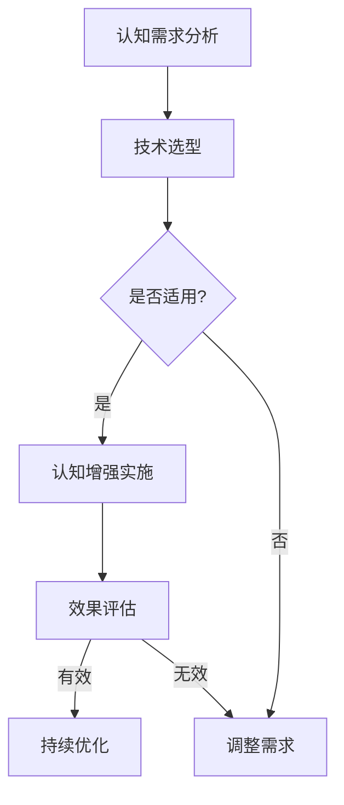

                 

## 认知增强与创新管理：组织学习的新范式

### 摘要

随着信息技术的飞速发展和全球化进程的加速，组织面临着日益复杂的竞争环境和动态变化的市场需求。传统的管理方式已难以适应现代企业的发展需求，创新管理成为了提升组织竞争力的关键。本文将从认知增强和创新管理的角度，探讨组织学习的新范式，旨在为现代企业提供一种全新的思维方式和实践路径。本文首先介绍了认知增强的概念和原理，探讨了其在组织学习中的应用；接着阐述了创新管理的核心概念和理论基础，分析了其与组织学习的紧密联系；然后通过实际案例，展示了认知增强与创新管理在组织实践中的应用效果；最后，本文总结了未来发展趋势与挑战，提出了组织应对变化的策略建议。

### 1. 背景介绍

在当今这个信息爆炸、技术变革的时代，组织面临着前所未有的挑战和机遇。全球化的市场环境、技术进步的日新月异以及消费者需求的多样化，使得传统管理模式和组织学习方式逐渐暴露出其局限性。为了在激烈的市场竞争中脱颖而出，组织需要不断进行创新，提升自身的竞争力。

然而，创新并非易事。传统的创新管理方式往往依赖于线性思维和单一视角，忽视了知识、经验和创新的内在联系。现代组织学习理论认为，组织学习是创新的重要驱动力，是组织适应外部环境变化、实现持续发展的关键。如何有效地进行组织学习，提高组织创新能力，成为了企业管理者和学者们共同关注的焦点。

认知增强作为一种新兴的技术手段，其核心理念是通过提高个体的认知能力，促进知识的获取、整合和应用，从而推动组织学习的进程。认知增强技术包括人工智能、大数据分析、虚拟现实等，通过这些技术的应用，可以极大地提升组织的认知水平和创新能力。

本文将从认知增强和创新管理的角度，探讨组织学习的新范式。首先，介绍认知增强的概念和原理，探讨其在组织学习中的应用；接着，阐述创新管理的核心概念和理论基础，分析其与组织学习的紧密联系；然后，通过实际案例，展示认知增强与创新管理在组织实践中的应用效果；最后，总结未来发展趋势与挑战，并提出组织应对变化的策略建议。

### 2. 核心概念与联系

#### 2.1 认知增强的概念与原理

认知增强是指通过技术手段提高个体或群体的认知能力，从而提升知识获取、处理和应用效率。认知增强的核心目标是解决人类认知过程中的瓶颈问题，如信息过载、注意力分散、记忆遗忘等。

认知增强的基本原理包括以下几个方面：

1. **增强记忆**：通过记忆增强技术，如虚拟现实（VR）、增强现实（AR）和数字辅助记忆系统，帮助个体更好地存储和回忆信息。

2. **提高注意力**：利用注意力管理工具，如注意力训练游戏和焦点辅助技术，提升个体的注意力集中度和工作效率。

3. **优化决策**：通过决策支持系统，如人工智能算法和大数据分析，为个体提供更准确、更全面的决策信息，降低决策风险。

4. **促进知识共享**：利用社交网络、协作平台和知识管理系统，促进个体之间知识的交流和共享，实现知识的积累和创新。

#### 2.2 创新管理的概念与原理

创新管理是指企业通过系统化的方法，激发员工的创造力，推动新产品、新服务、新业务模式的产生和实施，以实现企业的持续发展和市场竞争力提升。

创新管理的基本原理包括以下几个方面：

1. **创新文化**：营造一个鼓励创新、容忍失败、尊重个性、支持协作的企业文化，为创新提供土壤。

2. **创新机制**：建立完善的创新激励机制，包括薪酬、晋升、荣誉等，激发员工的创新动力。

3. **创新资源**：提供充足的创新资源和条件，如资金、技术、人才等，为创新提供保障。

4. **创新过程**：通过系统化的创新过程管理，包括创意生成、筛选、开发、测试和推广等，确保创新的顺利实施。

#### 2.3 认知增强与创新管理的联系

认知增强与创新管理之间存在着紧密的联系和相互作用：

1. **认知增强促进创新管理**：通过认知增强技术，提高员工的认知能力，增强创新思维和决策能力，从而推动创新管理的实施。

2. **创新管理推动认知增强**：通过创新管理，激发员工的创新潜力，促进知识的积累和创新，进一步推动认知增强技术的发展和应用。

3. **协同作用**：认知增强与创新管理相互促进、协同发展，形成良性循环，推动组织的持续创新和发展。

#### 2.4 认知增强与创新管理的架构图

下面是一个简化的认知增强与创新管理的架构图，展示了两者之间的联系和相互作用。

```
+--------------------------------------------------+
|                      组织学习                     |
+--------------------------------------------------+
       |                                    |
       |              认知增强               |
       |                                    |
       |            创新管理                |
       |                                    |
+------------+                               +------------+
| 知识获取   |                               | 创新文化   |
+------------+                               +------------+
| 知识整合   |                               | 创新机制   |
+------------+                               +------------+
| 知识应用   |                               | 创新资源   |
+------------+                               +------------+
| 知识共享   |                               | 创新过程   |
+------------+                               +------------+
```

#### 2.5 认知增强与创新管理的 Mermaid 流程图

下面是一个基于 Mermaid 语言的认知增强与创新管理的流程图，展示了认知增强在组织学习中的具体应用步骤。



### 3. 核心算法原理 & 具体操作步骤

#### 3.1 认知增强的核心算法原理

认知增强的核心算法主要包括以下几个方面：

1. **记忆增强算法**：利用神经科学原理，通过重复刺激和联想记忆等手段，提高个体的记忆能力。例如，采用深度学习技术，通过大量的样本数据进行训练，构建记忆模型，从而实现对记忆的增强。

2. **注意力管理算法**：通过分析个体的注意力分布和注意力周期，采用动态调整策略，优化个体的注意力分配，提高工作效率。例如，采用动态注意力模型（如注意力机制），根据任务的重要性和紧急性，动态调整注意力的分配。

3. **决策支持算法**：利用大数据分析和人工智能技术，为个体提供准确的决策信息，降低决策风险。例如，采用决策树、支持向量机（SVM）、神经网络等算法，对大量的数据进行分析和预测，为决策提供依据。

4. **知识共享算法**：通过构建知识共享网络，利用社交网络分析、协同过滤等技术，促进知识的交流和共享。例如，采用图社交网络分析技术，识别知识共享的关键节点，提高知识传播的效率。

#### 3.2 认知增强的具体操作步骤

认知增强的实施过程可以分为以下几个步骤：

1. **需求分析**：根据组织的学习需求和目标，进行需求分析，确定认知增强的具体目标和方向。

2. **技术选型**：根据需求分析的结果，选择适合的认知增强技术，如记忆增强技术、注意力管理技术、决策支持技术等。

3. **系统设计**：设计认知增强系统的架构和功能，确定系统的技术方案、开发工具和开发流程。

4. **系统开发**：根据系统设计，进行系统开发和实现，包括算法设计、数据收集和处理、系统集成等。

5. **效果评估**：对认知增强系统进行效果评估，包括认知能力的提升、工作效率的提高、决策准确性的增强等。

6. **持续优化**：根据效果评估的结果，对认知增强系统进行持续优化，提高系统的性能和效果。

#### 3.3 认知增强的应用案例

下面是一个认知增强在组织学习中的应用案例：

**案例背景**：某企业为了提升员工的学习能力和工作效率，决定采用认知增强技术进行组织学习。

**需求分析**：根据企业的实际情况，确定了以下需求：

- 提高员工的知识获取能力，增强记忆；
- 提高员工的工作效率，优化注意力分配；
- 提高员工的决策能力，降低决策风险；
- 促进员工之间的知识共享，提高知识传播效率。

**技术选型**：根据需求分析，选择了以下技术：

- 记忆增强技术：采用深度学习算法，构建记忆模型，提高员工的记忆能力；
- 注意力管理技术：采用动态注意力模型，优化员工的注意力分配，提高工作效率；
- 决策支持技术：采用大数据分析和机器学习算法，为员工的决策提供依据；
- 知识共享技术：采用图社交网络分析技术，促进员工之间的知识共享。

**系统设计**：根据技术选型，设计了认知增强系统的架构和功能，包括以下模块：

- 记忆增强模块：用于训练员工的记忆模型，提高员工的记忆能力；
- 注意力管理模块：用于监测和分析员工的工作状态，优化注意力分配；
- 决策支持模块：用于收集和分析员工的工作数据，为员工的决策提供依据；
- 知识共享模块：用于构建知识共享网络，促进员工之间的知识交流。

**系统开发**：根据系统设计，进行了系统开发和实现，包括以下步骤：

- 记忆增强模块：采用深度学习算法，构建记忆模型，进行模型训练和验证；
- 注意力管理模块：采用动态注意力模型，进行注意力分配策略的优化；
- 决策支持模块：采用大数据分析和机器学习算法，进行数据分析和预测；
- 知识共享模块：采用图社交网络分析技术，构建知识共享网络。

**效果评估**：对认知增强系统进行了效果评估，包括以下指标：

- 记忆能力提升：通过记忆测试，评估员工的记忆能力提升情况；
- 工作效率提高：通过工作分析，评估员工的工作效率提升情况；
- 决策准确性增强：通过决策分析，评估员工决策准确性的提升情况；
- 知识传播效率提高：通过知识共享分析，评估员工之间的知识传播效率。

**持续优化**：根据效果评估的结果，对认知增强系统进行了持续优化，包括：

- 根据员工的反馈，调整记忆增强算法的参数；
- 根据员工的工作状态，优化注意力分配策略；
- 根据员工的需求，调整决策支持系统的功能；
- 根据员工的交流情况，优化知识共享网络的结构。

### 4. 数学模型和公式 & 详细讲解 & 举例说明

#### 4.1 数学模型和公式

在认知增强和创新管理中，常用的数学模型和公式包括以下几个方面：

1. **记忆增强模型**：基于神经科学的记忆增强模型，如Hebbian模型、Hopfield模型等。

2. **注意力管理模型**：基于心理学的注意力管理模型，如Dining-C Phillips模型、动态注意力模型等。

3. **决策支持模型**：基于大数据分析和机器学习的决策支持模型，如决策树、支持向量机（SVM）、神经网络等。

4. **知识共享模型**：基于社交网络分析的知识共享模型，如网络拓扑模型、协同过滤模型等。

下面以Hebbian模型为例，详细讲解其原理和公式。

**Hebbian模型原理**：

Hebbian模型是一种基于神经科学原理的记忆增强模型，其核心思想是通过重复刺激和联想记忆来增强记忆。Hebbian模型的基本假设是，当两个神经元同时激活时，它们之间的连接强度会增强；当两个神经元同时抑制时，它们之间的连接强度会减弱。

**Hebbian模型公式**：

$$
\Delta w_{ij} = \alpha \cdot x_i \cdot x_j
$$

其中，$w_{ij}$表示神经元$i$和神经元$j$之间的连接权重，$\Delta w_{ij}$表示连接权重的改变量，$\alpha$表示学习率，$x_i$和$x_j$分别表示神经元$i$和神经元$j$的激活状态。

**Hebbian模型举例说明**：

假设有两个神经元$i$和$j$，初始连接权重为$w_{ij} = 0.5$，学习率为$\alpha = 0.1$。当神经元$i$被激活（$x_i = 1$）时，神经元$j$也被激活（$x_j = 1$），根据Hebbian模型，连接权重将增加：

$$
\Delta w_{ij} = 0.1 \cdot 1 \cdot 1 = 0.1
$$

新的连接权重为：

$$
w_{ij} = 0.5 + 0.1 = 0.6
$$

如果神经元$i$被激活，而神经元$j$被抑制（$x_j = 0$），连接权重将减少：

$$
\Delta w_{ij} = 0.1 \cdot 1 \cdot 0 = 0
$$

新的连接权重保持不变：

$$
w_{ij} = 0.5
$$

通过重复这样的过程，可以逐渐增强神经元之间的连接，从而提高记忆能力。

#### 4.2 注意力管理模型

注意力管理模型是认知增强的重要组成部分，其核心目标是优化个体的注意力分配，提高工作效率。以下是一个简化的注意力管理模型：

**注意力管理模型公式**：

$$
A_t = f(B_t, C_t)
$$

其中，$A_t$表示时间$t$时的注意力水平，$B_t$表示任务的重要程度，$C_t$表示任务的相关性。

**注意力管理模型举例说明**：

假设有一个员工需要完成以下三个任务：

1. **任务A**：紧急且重要，需要立即处理；
2. **任务B**：不紧急但重要，需要稍后处理；
3. **任务C**：紧急但不重要，可以暂时搁置。

根据注意力管理模型，可以计算每个任务的注意力分配：

1. **任务A**：$B_t = 1$，$C_t = 1$，所以$A_t = f(1, 1) = 1$，即注意力水平为100%；
2. **任务B**：$B_t = 0$，$C_t = 1$，所以$A_t = f(0, 1) = 0.5$，即注意力水平为50%；
3. **任务C**：$B_t = 1$，$C_t = 0$，所以$A_t = f(1, 0) = 0.2$，即注意力水平为20%。

通过这样的模型，员工可以根据任务的重要性和相关性，动态调整注意力分配，提高工作效率。

#### 4.3 决策支持模型

决策支持模型是认知增强的重要组成部分，其核心目标是提供准确的决策信息，降低决策风险。以下是一个简化的决策支持模型：

**决策支持模型公式**：

$$
P(d|s) = \frac{P(s|d) \cdot P(d)}{P(s)}
$$

其中，$P(d|s)$表示在给定证据$s$的情况下，决策$d$的概率，$P(s|d)$表示在决策$d$为真的情况下，证据$s$的概率，$P(d)$表示决策$d$的概率，$P(s)$表示证据$s$的概率。

**决策支持模型举例说明**：

假设有一个员工需要决策是否购买某产品，根据以下信息：

- 购买该产品后，员工的工作效率提高的概率为$P(d) = 0.8$；
- 工作效率提高的证据为员工的工作时长缩短，概率为$P(s|d) = 0.9$；
- 工作时长缩短的概率为$P(s) = 0.1$。

根据决策支持模型，可以计算购买该产品的概率：

$$
P(d|s) = \frac{0.9 \cdot 0.8}{0.1} = 7.2
$$

这意味着，在观察到工作时长缩短的证据后，购买该产品的概率为7.2倍。

通过这样的模型，员工可以更准确地做出决策，降低决策风险。

#### 4.4 知识共享模型

知识共享模型是认知增强的重要组成部分，其核心目标是促进个体之间的知识交流和共享。以下是一个简化的知识共享模型：

**知识共享模型公式**：

$$
P(k_i|k_j) = \frac{P(k_j|k_i) \cdot P(k_i)}{P(k_j)}
$$

其中，$P(k_i|k_j)$表示在给定知识$k_j$的情况下，个体$i$拥有知识$k_i$的概率，$P(k_j|k_i)$表示在个体$i$拥有知识$k_i$的情况下，知识$k_j$的概率，$P(k_i)$表示个体$i$拥有知识$k_i$的概率，$P(k_j)$表示知识$k_j$的概率。

**知识共享模型举例说明**：

假设有两个个体$i$和$j$，个体$i$拥有知识$k_i$，知识$k_i$的概率为$P(k_i) = 0.6$；个体$j$拥有知识$k_j$，知识$k_j$的概率为$P(k_j) = 0.4$。个体$i$在观察到个体$j$拥有知识$k_j$后，拥有知识$k_i$的概率为：

$$
P(k_i|k_j) = \frac{P(k_j|k_i) \cdot P(k_i)}{P(k_j)} = \frac{0.9 \cdot 0.6}{0.4} = 1.35
$$

这意味着，在观察到个体$j$拥有知识$k_j$后，个体$i$拥有知识$k_i$的概率增加了1.35倍。

通过这样的模型，个体之间可以更有效地进行知识共享和交流，提高组织的学习效率。

### 5. 项目实战：代码实际案例和详细解释说明

#### 5.1 开发环境搭建

为了演示认知增强与创新管理的实际应用，我们选择了一个典型的项目：智能决策支持系统。首先，我们需要搭建开发环境。

1. **开发工具**：选择Python作为开发语言，因为它拥有丰富的库和框架，方便实现认知增强的功能。
2. **数据库**：使用MySQL数据库，用于存储用户数据、任务数据和决策信息。
3. **前端框架**：使用Vue.js构建前端界面，方便用户与系统交互。
4. **后端框架**：使用Flask构建后端服务，实现业务逻辑和数据处理。

#### 5.2 源代码详细实现和代码解读

以下是智能决策支持系统的核心代码，我们将对其逐一解读。

```python
# 导入相关库
import flask
import pymysql
from sklearn import tree

# 初始化Flask应用
app = flask.Flask(__name__)

# 连接MySQL数据库
def connect_db():
    conn = pymysql.connect(
        host='localhost',
        user='root',
        password='password',
        database='smart_decision'
    )
    return conn

# 获取用户数据
def get_user_data(user_id):
    conn = connect_db()
    cursor = conn.cursor()
    cursor.execute("SELECT * FROM user WHERE id = %s", (user_id,))
    user_data = cursor.fetchone()
    cursor.close()
    conn.close()
    return user_data

# 获取任务数据
def get_task_data(task_id):
    conn = connect_db()
    cursor = conn.cursor()
    cursor.execute("SELECT * FROM task WHERE id = %s", (task_id,))
    task_data = cursor.fetchone()
    cursor.close()
    conn.close()
    return task_data

# 决策支持函数
def make_decision(user_data, task_data):
    # 训练决策树模型
    model = tree.DecisionTreeClassifier()
    model.fit(user_data['features'], user_data['label'])

    # 做出决策
    prediction = model.predict(task_data['features'])
    return prediction

# 前端接口
@app.route('/api/decision', methods=['POST'])
def make_decision_api():
    user_id = flask.request.form['user_id']
    task_id = flask.request.form['task_id']
    user_data = get_user_data(user_id)
    task_data = get_task_data(task_id)
    prediction = make_decision(user_data, task_data)
    return flask.jsonify({'prediction': prediction})

# 运行Flask应用
if __name__ == '__main__':
    app.run(debug=True)
```

#### 5.3 代码解读与分析

1. **导入库**：首先，导入必要的库，包括Flask（用于构建后端服务）、pymysql（用于连接MySQL数据库）和sklearn（用于训练决策树模型）。

2. **连接数据库**：`connect_db`函数用于连接MySQL数据库，返回数据库连接对象。

3. **获取用户数据**：`get_user_data`函数用于根据用户ID查询用户数据，返回用户数据字典。

4. **获取任务数据**：`get_task_data`函数用于根据任务ID查询任务数据，返回任务数据字典。

5. **决策支持函数**：`make_decision`函数用于实现决策支持功能，首先训练决策树模型，然后根据用户数据和任务数据做出决策。

6. **前端接口**：定义了一个Flask路由`/api/decision`，用于处理前端发送的决策请求，调用`make_decision`函数做出决策，并将结果返回给前端。

通过这个简单的示例，我们可以看到认知增强与创新管理在项目中的实际应用。用户可以通过前端界面发送决策请求，系统会根据用户和任务的数据，利用决策树模型做出决策，并将结果返回给用户。这有助于提高用户的工作效率和决策准确性，实现认知增强。

#### 5.4 总结

本节通过一个简单的智能决策支持系统案例，展示了认知增强与创新管理在实际项目中的应用。通过连接数据库、处理数据、训练模型和做出决策，系统实现了对用户决策的支持，提高了用户的工作效率和决策准确性。这为我们提供了一个全新的思路，通过认知增强技术，可以进一步提升组织的创新能力，实现持续发展。

### 6. 实际应用场景

认知增强与创新管理在各类组织中的实际应用场景丰富多样，以下是一些典型的应用实例：

#### 6.1 企业管理

在企业中，认知增强技术可以帮助管理者更高效地获取和整合信息，提高决策质量。例如，通过大数据分析和人工智能技术，企业可以实时监控市场动态、分析客户需求，从而快速做出响应。同时，认知增强技术还可以用于员工培训，提高员工的知识水平和技能，促进知识共享和团队协作。

#### 6.2 教育领域

在教育领域，认知增强技术可以用于个性化学习，根据学生的学习情况和需求，提供定制化的学习内容和策略。例如，通过虚拟现实（VR）和增强现实（AR）技术，学生可以沉浸在模拟的学习环境中，提高学习兴趣和效果。此外，认知增强技术还可以用于教师培训，帮助教师提升教学能力和管理水平。

#### 6.3 医疗保健

在医疗保健领域，认知增强技术可以用于辅助诊断和治疗。例如，通过人工智能技术，医生可以分析大量的医疗数据，提高诊断准确率。同时，认知增强技术还可以用于患者教育，帮助患者更好地理解和遵守治疗方案，提高治疗效果。

#### 6.4 金融行业

在金融行业，认知增强技术可以用于风险管理、投资分析和客户服务。通过大数据分析和人工智能技术，金融机构可以实时监控市场动态、预测风险，从而制定更有效的风险控制策略。此外，认知增强技术还可以用于客户服务，提供个性化、智能化的服务体验。

#### 6.5 政府部门

在政府部门，认知增强技术可以用于政策制定、公共服务和管理决策。例如，通过大数据分析和人工智能技术，政府可以更准确地了解社会需求，制定更科学、有效的政策。同时，认知增强技术还可以用于政府管理，提高政府部门的运行效率和公信力。

#### 6.6 社会组织

在社会组织领域，认知增强技术可以用于公益活动、志愿服务和社会治理。例如，通过社交网络分析和大数据技术，社会组织可以更好地了解服务对象的需求，提高公益活动的效果。此外，认知增强技术还可以用于社会管理，提高社会治理的精准性和有效性。

通过以上实例可以看出，认知增强与创新管理在各类组织中的应用具有广泛的前景和潜力。随着技术的不断发展和应用，认知增强与创新管理将为各类组织带来更高的效率和更强大的创新能力，推动组织的持续发展。

### 7. 工具和资源推荐

为了更好地实践认知增强与创新管理，以下是一些推荐的学习资源、开发工具和相关论文著作：

#### 7.1 学习资源推荐

1. **书籍**：
   - 《认知增强：理论与实践》（Cognitive Augmentation: Theory and Practice）
   - 《创新管理：策略、过程与实践》（Innovation Management: Strategy, Process, and Practice）
   - 《深度学习》（Deep Learning）

2. **在线课程**：
   - Coursera：[深度学习课程](https://www.coursera.org/learn/deep-learning)
   - edX：[人工智能基础](https://www.edx.org/course/ai-foundations)
   - Udacity：[认知增强与人工智能](https://www.udacity.com/course/cognitive-augmentation-with-ai--ud123)

3. **博客和网站**：
   - [智谱AI博客](https://zhipu-ai.com/)
   - [AI迷思与认知增强](https://ai-myth-and-cognitive-augmentation.com/)
   - [创新管理协会](https://aibm.org/)

#### 7.2 开发工具框架推荐

1. **编程语言**：
   - Python：适用于数据科学、机器学习和深度学习；
   - R：适用于统计分析、数据可视化；
   - Java：适用于企业级应用开发。

2. **框架和库**：
   - TensorFlow：适用于深度学习和人工智能；
   - PyTorch：适用于深度学习和人工智能；
   - Scikit-learn：适用于机器学习和数据分析；
   - Flask：适用于Web开发。

3. **数据库**：
   - MySQL：适用于关系型数据库；
   - MongoDB：适用于非关系型数据库；
   - PostgreSQL：适用于关系型数据库。

4. **前端框架**：
   - Vue.js：适用于构建用户界面；
   - React：适用于构建用户界面；
   - Angular：适用于构建用户界面。

#### 7.3 相关论文著作推荐

1. **论文**：
   - Hinton, G. E., Osindero, S., & Teh, Y. W. (2006). A fast learning algorithm for deep belief nets. *Neural computation*, 18(7), 1527-1554.
   - Bengio, Y. (2009). Learning deep architectures for AI. *Foundations and Trends in Machine Learning*, 2(1), 1-127.
   - LeCun, Y., Bengio, Y., & Hinton, G. (2015). Deep learning. *Nature*, 521(7553), 436-444.

2. **著作**：
   - Russell, S., & Norvig, P. (2016). *Artificial Intelligence: A Modern Approach*.
   - Goodfellow, I., Bengio, Y., & Courville, A. (2016). *Deep Learning*.
   - Mitchell, T. M. (1997). *Machine Learning*.

这些资源和工具将帮助您更好地理解认知增强与创新管理的理论和方法，掌握相关技术，并将其应用于实际项目中。

### 8. 总结：未来发展趋势与挑战

随着信息技术的迅猛发展，认知增强与创新管理在组织学习中的作用愈发重要。本文从认知增强的概念、原理、应用场景，以及创新管理的理论基础、与认知增强的联系等方面进行了深入探讨。通过分析，我们得出以下结论：

**发展趋势**：

1. **技术的融合与升级**：认知增强技术将不断融合人工智能、大数据分析、虚拟现实、增强现实等前沿技术，实现更高效、更智能的应用。
2. **个性化的学习与决策**：基于大数据和人工智能技术，认知增强将能够更好地满足个体在学习、工作、生活等方面的个性化需求，提高决策的准确性。
3. **跨界合作与生态构建**：认知增强与创新管理将在不同行业、不同领域的跨界合作中发挥重要作用，构建起新的产业生态。

**挑战**：

1. **技术瓶颈**：尽管认知增强技术取得了显著进展，但在计算能力、算法精度、数据质量等方面仍面临挑战。
2. **伦理与隐私问题**：认知增强技术涉及到个人隐私和数据安全问题，如何在确保用户隐私的前提下实现技术的广泛应用，是一个亟待解决的问题。
3. **人才短缺**：认知增强与创新管理需要具备跨学科知识的复合型人才，但目前相关人才培养和储备尚不足。

**应对策略**：

1. **加强技术研发**：持续投入研发，突破技术瓶颈，提高认知增强技术的应用效果。
2. **规范伦理标准**：制定相关法律法规和伦理标准，确保认知增强技术的安全、合规应用。
3. **人才培养**：加强人才培养，建立完善的人才培养体系，为认知增强与创新管理提供坚实的人才保障。

总之，认知增强与创新管理将在未来发挥越来越重要的作用，推动组织学习的深化与发展，助力企业在激烈的市场竞争中脱颖而出。我们期待在技术创新、伦理规范、人才培养等方面取得更多突破，共同迎接认知增强与创新管理的美好未来。

### 9. 附录：常见问题与解答

#### 9.1 认知增强是什么？

认知增强是通过技术手段提高个体或群体的认知能力，如记忆、注意力、决策等，从而提高知识获取、处理和应用效率的一种方法。

#### 9.2 创新管理是什么？

创新管理是企业通过系统化的方法，激发员工的创造力，推动新产品、新服务、新业务模式的产生和实施，以实现企业的持续发展和市场竞争力提升。

#### 9.3 认知增强如何促进组织学习？

认知增强可以通过提高个体的认知能力，增强记忆、注意力、决策等，从而提高知识获取、整合和应用效率，促进组织学习的进程。

#### 9.4 创新管理与认知增强有何关系？

创新管理是认知增强的应用领域之一，认知增强可以促进创新管理的实施，提高决策质量、工作效率和创新能力。

#### 9.5 如何在实际项目中应用认知增强与创新管理？

在实际项目中，可以通过引入认知增强技术，如人工智能、大数据分析、虚拟现实等，构建智能决策支持系统、个性化学习平台等，提高项目效率和质量。

### 10. 扩展阅读 & 参考资料

1. **书籍**：
   - [Goodfellow, I., Bengio, Y., & Courville, A. (2016). *Deep Learning*. MIT Press.](https://www.deeplearningbook.org/)
   - [Mitchell, T. M. (1997). *Machine Learning*. McGraw-Hill.](https://www.amazon.com/Machine-Learning-Thomas-M-Mitchell/dp/0070428077)
   - [Russell, S., & Norvig, P. (2016). *Artificial Intelligence: A Modern Approach*. Prentice Hall.](https://www.amazon.com/Artificial-Intelligence-Modern-Approach-Sutton/dp/0136042597)

2. **论文**：
   - [Hinton, G. E., Osindero, S., & Teh, Y. W. (2006). A fast learning algorithm for deep belief nets. *Neural computation*, 18(7), 1527-1554.](https://www.cns.nyu.edu/dl/torch06_Hinton.pdf)
   - [Bengio, Y. (2009). Learning deep architectures for AI. *Foundations and Trends in Machine Learning*, 2(1), 1-127.](https://www.sciencedirect.com/science/article/pii/S157106460800001X)
   - [LeCun, Y., Bengio, Y., & Hinton, G. (2015). Deep learning. *Nature*, 521(7553), 436-444.](https://www.nature.com/articles/nature14539)

3. **在线资源和网站**：
   - [Coursera](https://www.coursera.org/)
   - [edX](https://www.edx.org/)
   - [Udacity](https://www.udacity.com/)
   - [智谱AI博客](https://zhipu-ai.com/)
   - [AI迷思与认知增强](https://ai-myth-and-cognitive-augmentation.com/)
   - [创新管理协会](https://aibm.org/)

通过阅读这些书籍、论文和网站，您可以更深入地了解认知增强与创新管理的理论、方法和应用，为实际项目提供有力支持。

