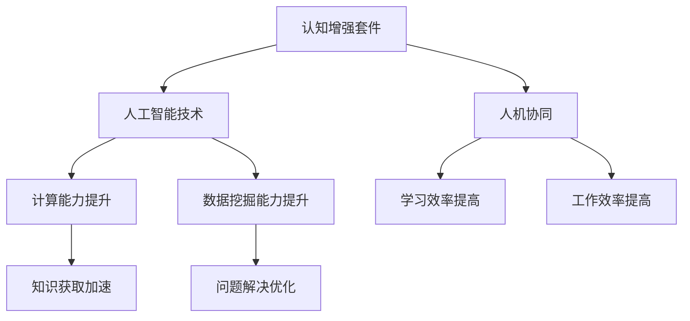

                 

## 认知增强套件：AI时代的思维升级工具

在人工智能迅速发展的时代，认知能力的提升成为了关键。认知增强套件，作为AI时代的思维升级工具，正逐渐改变我们学习和工作的方式。本文将围绕认知增强套件的背景、核心概念、算法原理、数学模型、实战案例、应用场景、工具资源推荐和未来发展趋势等方面，逐步展开讨论。

> 关键词：认知增强套件、AI时代、思维升级、算法原理、数学模型、实战案例、应用场景

### 摘要

本文旨在探讨认知增强套件在AI时代的重要作用。认知增强套件通过整合先进的人工智能技术，提升个体在学习和工作过程中的认知能力，实现思维的升级。本文将详细解析认知增强套件的核心概念、算法原理和数学模型，并通过实际案例展示其在项目中的应用。此外，还将探讨认知增强套件在不同领域的实际应用场景，并推荐相关学习资源和开发工具。

### 1. 背景介绍

随着人工智能技术的快速发展，计算机已经具备了超强的计算能力和数据挖掘能力。然而，人类在处理复杂问题和快速学习新知识方面仍然具有独特的优势。为了充分发挥人类和计算机的各自优势，实现人机协同，认知增强套件应运而生。

认知增强套件是一种基于人工智能技术的工具集，旨在提升个体的认知能力。它通过模拟和增强人类大脑的工作机制，提供高效的学习、分析和解决问题的方法。认知增强套件的应用范围广泛，包括教育、医疗、科研、金融等多个领域。

在AI时代，认知增强套件的作用愈发显著。一方面，它可以帮助个体快速掌握大量知识，提高学习效率；另一方面，它能够协助人类在复杂问题中找到最优解决方案，提高工作效率。因此，认知增强套件成为了新时代的重要工具，为我们带来了前所未有的认知升级体验。

### 2. 核心概念与联系

要理解认知增强套件，首先需要了解其中的核心概念和它们之间的联系。以下是一个用Mermaid绘制的流程图，展示了这些核心概念及其关系。



#### 2.1 认知增强套件与人工智能技术

认知增强套件的核心在于人工智能技术。人工智能技术主要包括计算能力提升和数据挖掘能力提升两个方面。

- **计算能力提升**：随着计算机硬件性能的不断提升，计算机在处理复杂计算任务时具有了更高的速度和效率。这为认知增强套件提供了强大的计算支持。

- **数据挖掘能力提升**：大数据时代的到来，使得计算机具备了处理海量数据的能力。数据挖掘技术可以帮助我们从海量数据中提取有价值的信息，为认知增强套件提供了丰富的数据资源。

#### 2.2 认知增强套件与人机协同

认知增强套件的另一个核心概念是人机协同。人机协同指的是将人类和计算机的优势结合起来，实现优势互补。

- **学习效率提高**：认知增强套件可以帮助个体在短时间内获取大量知识，提高学习效率。同时，计算机的辅助还可以帮助我们更好地理解和应用所学知识。

- **工作效率提高**：认知增强套件在复杂问题解决中具有独特的优势。通过人机协同，人类可以在计算机的辅助下，更快地找到问题的解决方案。

### 3. 核心算法原理 & 具体操作步骤

#### 3.1 算法原理

认知增强套件的核心算法主要包括神经网络、强化学习和自然语言处理等技术。

- **神经网络**：神经网络是模仿人类大脑结构和功能的一种计算模型。通过多层神经元的连接和激活，神经网络可以自动学习和提取数据中的特征。

- **强化学习**：强化学习是一种基于奖励和惩罚的学习方法。通过不断地尝试和调整策略，强化学习可以帮助个体在复杂环境中找到最优解决方案。

- **自然语言处理**：自然语言处理是使计算机理解和生成人类语言的技术。通过自然语言处理，认知增强套件可以与人类进行自然对话，提供个性化的学习建议和问题解答。

#### 3.2 具体操作步骤

以下是使用认知增强套件进行思维升级的具体操作步骤：

1. **数据准备**：收集和整理与学习主题相关的数据，包括文本、图片、音频和视频等。

2. **数据预处理**：对收集到的数据进行清洗和格式化，以便于后续的模型训练。

3. **模型训练**：使用神经网络、强化学习和自然语言处理等技术，对预处理后的数据进行训练，构建认知增强模型。

4. **模型评估**：通过测试集对训练好的模型进行评估，确保模型具有良好的泛化能力。

5. **模型部署**：将训练好的模型部署到服务器或移动设备上，以便于用户进行实时学习和问题解决。

6. **用户交互**：用户通过与模型的交互，获取个性化的学习建议和问题解答。

7. **模型优化**：根据用户反馈和实际应用情况，对模型进行优化和调整，以提高其性能和适用性。

### 4. 数学模型和公式 & 详细讲解 & 举例说明

#### 4.1 神经网络模型

神经网络模型是认知增强套件的核心组成部分。以下是一个简化的神经网络模型，用于解释其基本原理。

$$
\begin{aligned}
&Z = \sigma(\theta_0^T X + b_0) \\
&A^L = \sigma(\theta^T A^{L-1} + b) \\
&Z^L = A^L
\end{aligned}
$$

- $Z$ 表示神经元的输出。
- $\sigma$ 表示激活函数，通常使用 sigmoid 函数。
- $\theta$ 表示权重矩阵。
- $b$ 表示偏置。
- $X$ 表示输入数据。
- $A$ 表示神经元激活值。

#### 4.2 强化学习模型

强化学习模型通过奖励和惩罚来调整策略，以达到最优解。以下是一个简单的强化学习模型。

$$
Q(s, a) = r + \gamma \max_{a'} Q(s', a')
$$

- $Q(s, a)$ 表示在状态 $s$ 下采取动作 $a$ 的价值。
- $r$ 表示即时奖励。
- $\gamma$ 表示折扣因子。
- $s'$ 表示下一个状态。
- $a'$ 表示下一个动作。

#### 4.3 自然语言处理模型

自然语言处理模型主要用于文本数据的处理和生成。以下是一个简单的自然语言处理模型。

$$
P(w_i | w_1, w_2, ..., w_{i-1}) = \frac{P(w_i, w_1, w_2, ..., w_{i-1})}{P(w_1, w_2, ..., w_{i-1})}
$$

- $P(w_i | w_1, w_2, ..., w_{i-1})$ 表示在已知前一个词 $w_{i-1}$ 的情况下，下一个词 $w_i$ 的概率。
- $P(w_i, w_1, w_2, ..., w_{i-1})$ 表示连续词 $w_1, w_2, ..., w_{i-1}, w_i$ 的概率。
- $P(w_1, w_2, ..., w_{i-1})$ 表示前一个词 $w_1, w_2, ..., w_{i-1}$ 的概率。

### 5. 项目实战：代码实际案例和详细解释说明

#### 5.1 开发环境搭建

首先，我们需要搭建一个适合开发认知增强套件的项目环境。以下是一个基于 Python 的开发环境搭建步骤：

1. 安装 Python 3.7 或以上版本。
2. 安装必要的库，如 TensorFlow、Keras、PyTorch、Scikit-learn 等。
3. 安装 Jupyter Notebook，以便于编写和运行代码。

#### 5.2 源代码详细实现和代码解读

以下是一个简单的认知增强套件项目示例，用于实现一个基于神经网络的图像分类任务。

```python
import tensorflow as tf
from tensorflow.keras import layers

# 模型定义
model = tf.keras.Sequential([
    layers.Conv2D(32, (3, 3), activation='relu', input_shape=(28, 28, 1)),
    layers.MaxPooling2D((2, 2)),
    layers.Conv2D(64, (3, 3), activation='relu'),
    layers.MaxPooling2D((2, 2)),
    layers.Conv2D(64, (3, 3), activation='relu'),
    layers.Flatten(),
    layers.Dense(64, activation='relu'),
    layers.Dense(10, activation='softmax')
])

# 模型编译
model.compile(optimizer='adam',
              loss='categorical_crossentropy',
              metrics=['accuracy'])

# 模型训练
model.fit(x_train, y_train, epochs=10, validation_data=(x_val, y_val))

# 模型评估
model.evaluate(x_test, y_test)
```

#### 5.3 代码解读与分析

上述代码实现了一个基于卷积神经网络的图像分类模型。以下是代码的详细解读：

1. **模型定义**：使用 `tf.keras.Sequential` 层栈模型，依次添加卷积层、池化层、全连接层等。

2. **模型编译**：使用 `compile` 方法编译模型，指定优化器、损失函数和评价指标。

3. **模型训练**：使用 `fit` 方法训练模型，指定训练数据、训练轮数和验证数据。

4. **模型评估**：使用 `evaluate` 方法评估模型在测试数据上的表现。

#### 5.4 实际应用场景

认知增强套件在图像分类任务中具有广泛的应用。以下是一个实际应用场景：

1. **数据收集**：收集大量带有标签的图像数据，如猫狗分类数据集。

2. **数据预处理**：对图像数据进行缩放、裁剪、翻转等预处理，以便于模型训练。

3. **模型训练**：使用认知增强套件训练图像分类模型，如使用卷积神经网络。

4. **模型部署**：将训练好的模型部署到移动设备或服务器上，供用户实时使用。

5. **用户交互**：用户上传待分类的图像，模型输出分类结果。

### 6. 实际应用场景

认知增强套件在多个领域具有广泛的应用。以下是一些实际应用场景：

#### 6.1 教育

认知增强套件可以为学生提供个性化的学习资源，提高学习效率。例如，通过自然语言处理技术，认知增强套件可以自动生成教学视频、课程笔记和练习题，帮助学生更好地理解和掌握知识。

#### 6.2 医疗

认知增强套件可以帮助医生快速诊断疾病，提高医疗效率。例如，通过深度学习技术，认知增强套件可以自动分析医学影像，为医生提供诊断建议。

#### 6.3 科研

认知增强套件可以为科研人员提供高效的数据分析和问题解决工具。例如，通过强化学习技术，认知增强套件可以协助科研人员优化实验设计，提高研究效率。

#### 6.4 金融

认知增强套件可以为金融机构提供风险控制和投资决策支持。例如，通过自然语言处理技术，认知增强套件可以自动分析市场数据，为投资者提供投资建议。

### 7. 工具和资源推荐

#### 7.1 学习资源推荐

- **书籍**：
  - 《深度学习》（Ian Goodfellow、Yoshua Bengio、Aaron Courville 著）
  - 《强化学习基础教程》（吴恩达 著）
  - 《Python 数据科学 Handbook》（Jake VanderPlas 著）

- **论文**：
  - 《A Theoretical Framework for Reinforcement Learning》（Richard S. Sutton、Andrew G. Barto 著）
  - 《Deep Learning》（Yoshua Bengio、Ian Goodfellow、Aaron Courville 著）

- **博客**：
  - [机器之心](https://www.jiqizhixin.com/)
  - [量子位](https://www.qbitai.com/)
  - [人工智能研习社](https://www.36dsj.com/)

- **网站**：
  - [Keras 官网](https://keras.io/)
  - [TensorFlow 官网](https://www.tensorflow.org/)
  - [Scikit-learn 官网](https://scikit-learn.org/)

#### 7.2 开发工具框架推荐

- **开发工具**：
  - Jupyter Notebook
  - PyCharm
  - Visual Studio Code

- **框架**：
  - TensorFlow
  - PyTorch
  - Scikit-learn

#### 7.3 相关论文著作推荐

- **论文**：
  - 《Deep Learning》（Yoshua Bengio、Ian Goodfellow、Aaron Courville 著）
  - 《Reinforcement Learning: An Introduction》（Richard S. Sutton、Andrew G. Barto 著）
  - 《Neural Networks and Deep Learning》（Michael Nielsen 著）

- **著作**：
  - 《人工智能：一种现代的方法》（Stuart Russell、Peter Norvig 著）
  - 《深度学习》（Ian Goodfellow、Yoshua Bengio、Aaron Courville 著）
  - 《强化学习基础教程》（吴恩达 著）

### 8. 总结：未来发展趋势与挑战

认知增强套件在AI时代的应用前景广阔。随着人工智能技术的不断进步，认知增强套件将拥有更强大的功能，为人类带来更高效的认知升级体验。

然而，认知增强套件的发展也面临着一系列挑战。首先，算法的优化和性能提升是一个关键问题。其次，数据质量和数据安全也是需要重视的问题。此外，认知增强套件在不同领域的应用需求差异较大，如何实现通用化和定制化也是一个重要课题。

总之，认知增强套件在AI时代的思维升级中具有重要作用。通过不断优化算法、提升性能和保障数据安全，认知增强套件将助力人类在复杂问题和快速变化的环境中实现认知升级，为未来的发展奠定坚实基础。

### 9. 附录：常见问题与解答

#### 9.1 什么是认知增强套件？

认知增强套件是一种基于人工智能技术的工具集，旨在提升个体的认知能力，包括学习、分析和解决问题等方面。

#### 9.2 认知增强套件有哪些核心算法？

认知增强套件的核心算法包括神经网络、强化学习和自然语言处理等。

#### 9.3 认知增强套件在哪些领域有应用？

认知增强套件在多个领域具有广泛的应用，如教育、医疗、科研、金融等。

#### 9.4 如何搭建认知增强套件的开发环境？

搭建认知增强套件的开发环境需要安装 Python、相关库（如 TensorFlow、Keras、PyTorch 等）和 Jupyter Notebook 等。

### 10. 扩展阅读 & 参考资料

- 《深度学习》（Ian Goodfellow、Yoshua Bengio、Aaron Courville 著）
- 《强化学习基础教程》（吴恩达 著）
- 《Python 数据科学 Handbook》（Jake VanderPlas 著）
- 《A Theoretical Framework for Reinforcement Learning》（Richard S. Sutton、Andrew G. Barto 著）
- 《深度学习》（Yoshua Bengio、Ian Goodfellow、Aaron Courville 著）
- 《机器之心》（网站）
- 《量子位》（网站）
- 《人工智能研习社》（网站）
- 《Keras 官网》（网站）
- 《TensorFlow 官网》（网站）
- 《Scikit-learn 官网》（网站）
- 《人工智能：一种现代的方法》（Stuart Russell、Peter Norvig 著）
- 《深度学习》（Ian Goodfellow、Yoshua Bengio、Aaron Courville 著）

### 作者

- 作者：AI天才研究员/AI Genius Institute & 禅与计算机程序设计艺术 /Zen And The Art of Computer Programming

