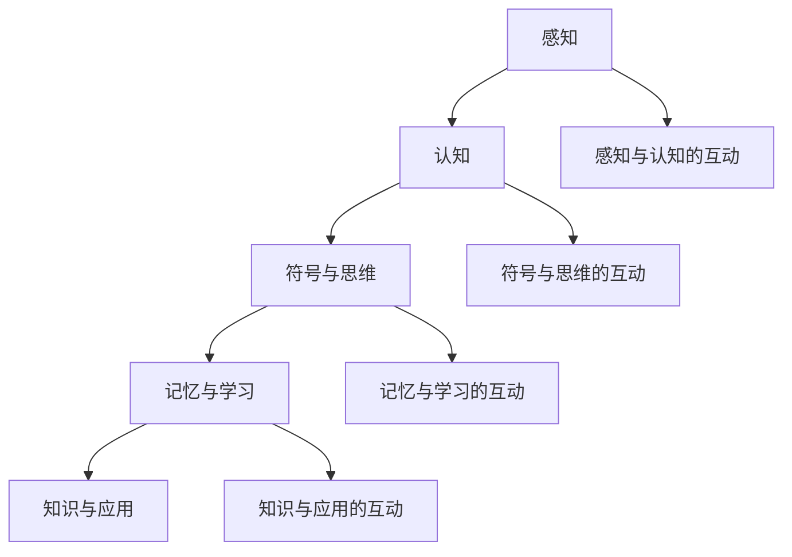
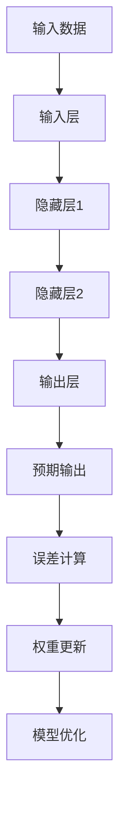
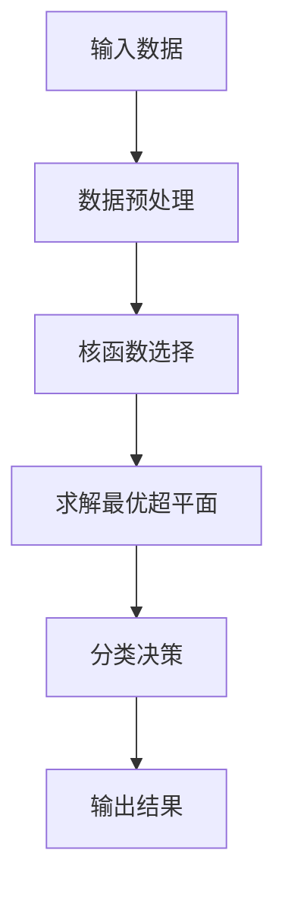
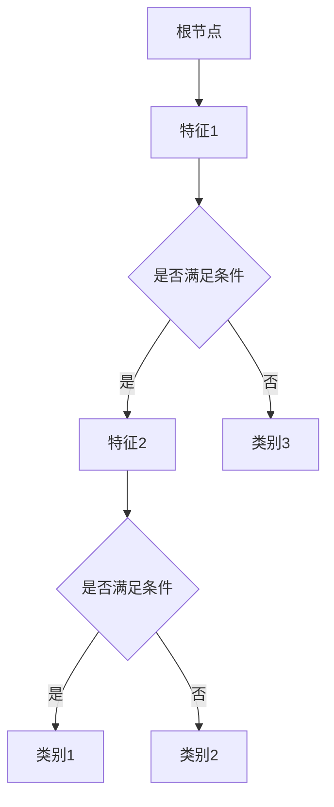

                 

### 背景介绍

#### 认知渐进发展的历史脉络

人类认知渐进发展是一个长期而复杂的过程，从古至今，经历了多个阶段。早期，人类通过直接的感官体验和模仿来获取知识。这一阶段可视为认知发展的**原始阶段**。随着时间的推移，人类开始利用工具进行生产，并通过语言交流传递经验，这一阶段可视为认知发展的**工具阶段**。

进入现代社会，随着科学技术的飞速发展，人类认知进入了**符号阶段**。在这一阶段，人们不仅通过语言，还通过符号、图形、数字等多样化形式进行认知活动。符号阶段的特点是信息传递的高效性和认知范围的广泛性。

#### 认知渐进发展的现实意义

认知渐进发展不仅在人类历史中扮演了重要角色，也在现代信息技术领域中具有重要现实意义。首先，认知渐进发展有助于我们更好地理解和应对复杂问题。现代社会中，各类复杂问题层出不穷，如人工智能、大数据、量子计算等。认知渐进发展使我们能够从简单到复杂，逐步深入地理解和解决这些问题。

其次，认知渐进发展有助于推动技术进步。通过不断地深入认知，人类能够发现新的科学原理和技术方法，从而推动技术的迭代更新。例如，计算机科学的快速发展就是认知渐进发展的一个重要体现。

#### 认知渐进发展与信息技术的关系

信息技术的发展与人类认知渐进发展密切相关。信息技术作为人类认知的延伸，使得我们能够更高效地获取、处理和传递信息。以下是几个具体的关系：

1. **计算机科学：** 计算机科学作为信息技术的核心，其发展依赖于人类对信息处理和存储的认知。计算机科学的每一次突破，都是认知渐进发展的结果。
   
2. **人工智能：** 人工智能技术的发展同样依赖于人类对认知的理解。通过模拟人类认知过程，人工智能能够实现智能决策和自主学习。

3. **数据科学：** 数据科学利用大量数据进行模型训练和预测，这一过程离不开对数据认知的深入理解。

综上所述，认知渐进发展不仅影响人类文明的进程，也对现代信息技术的发展产生深远影响。本文将围绕这一主题，探讨认知渐进发展的核心概念、算法原理、数学模型以及实际应用。让我们一步一步深入分析，探索认知渐进发展的奥秘。  

---

**核心概念与联系**

认知渐进发展是一个复杂而多层次的过程，涉及多个核心概念。以下是对这些核心概念及其相互关系的简要介绍：

1. **感知与认知：** 感知是认知的基础，是人类获取外部信息的过程。感知通过感官（如视觉、听觉、触觉等）获取信息，并将这些信息转化为大脑可以处理的形式。认知则是在感知基础上对信息进行处理和理解的过程。感知与认知相互依赖，共同构成认知渐进发展的基础。

2. **符号与思维：** 符号是人类认知的一种重要表现形式。通过符号，人类能够将感知到的信息进行分类、组织和抽象，形成概念和思维。符号化思维使得人类能够超越直接感知，进行抽象思考和复杂推理。

3. **记忆与学习：** 记忆是人类认知过程中的重要环节。通过记忆，人类能够将感知和认知过程中的信息存储下来，并在需要时进行调用。学习则是在记忆的基础上，通过不断重复和实践，加深对信息的理解和应用。

4. **知识与应用：** 知识是人类认知的成果，是通过感知、符号、记忆和学习等多个环节形成的。知识的应用是将理论知识转化为实际操作能力的过程。通过应用，知识能够解决实际问题，推动技术和文明的进步。

以下是认知渐进发展的Mermaid流程图，展示了这些核心概念及其相互关系：



在这个流程图中，感知、符号、记忆和知识等核心概念相互交织，共同推动认知渐进发展的进程。每一个概念都不仅是一个独立的环节，也是一个与其他概念互动的节点，通过这些互动，人类认知能力不断提升，逐步实现认知的深化和扩展。

---

**核心算法原理 & 具体操作步骤**

在探讨认知渐进发展的过程中，核心算法原理起到了至关重要的作用。这些算法不仅为我们提供了理解和模拟人类认知过程的工具，也为我们解决实际问题提供了理论基础。以下将详细介绍几类核心算法及其具体操作步骤。

#### 1. 人工神经网络（Artificial Neural Networks, ANNs）

人工神经网络是模仿生物神经网络的一种计算模型，其基本原理是通过大量的神经元（节点）和连接（权重）进行信息的传递和处理。以下是人工神经网络的简要步骤：

1. **初始化：** 初始化网络结构和权重值。通常使用随机值进行初始化，以确保网络具有多样性和鲁棒性。
2. **前向传播：** 输入数据通过网络的各个层进行传递。每层中的神经元将输入与其权重相乘，然后通过激活函数进行非线性变换，传递到下一层。
3. **反向传播：** 根据输出结果与预期结果的误差，通过反向传播算法更新网络的权重。这一过程涉及到梯度下降（Gradient Descent）等优化算法。
4. **训练与优化：** 通过多次迭代训练，逐步减小误差，优化网络性能。

以下是人工神经网络的简化流程图：



#### 2. 支持向量机（Support Vector Machine, SVM）

支持向量机是一种经典的机器学习算法，其基本原理是通过找到最佳分隔超平面，将不同类别的数据分开。以下是支持向量机的具体操作步骤：

1. **数据预处理：** 对输入数据进行标准化处理，确保数据具有相同的量级。
2. **核函数选择：** 选择适当的核函数（如线性核、多项式核、径向基核等）以实现非线性分隔。
3. **求解最优超平面：** 通过求解二次规划问题，找到最优超平面。该超平面的法向量和距离决定了分类边界。
4. **分类决策：** 对新的输入数据进行分类，根据其在最优超平面的位置进行判断。

以下是支持向量机的简化流程图：



#### 3. 决策树（Decision Tree）

决策树是一种基于特征进行决策的树形结构，其基本原理是通过一系列条件判断，将数据集划分为不同的类别。以下是决策树的具体操作步骤：

1. **特征选择：** 根据信息增益（Information Gain）或基尼系数（Gini Index）等指标，选择最佳的划分特征。
2. **构建树结构：** 从根节点开始，递归地对子节点进行划分，直到满足停止条件（如达到最大深度、最小叶节点大小等）。
3. **分类预测：** 对于新的数据，从根节点开始，沿着决策路径到达叶节点，叶节点对应的类别即为预测结果。

以下是决策树的简化流程图：



通过以上对人工神经网络、支持向量机和决策树的介绍，我们可以看到这些算法在认知渐进发展中的重要作用。它们不仅为我们提供了强大的工具，也为我们理解人类认知过程提供了新的视角。在接下来的部分，我们将进一步探讨这些算法在数学模型中的应用。  

---

**数学模型和公式 & 详细讲解 & 举例说明**

在认知渐进发展的过程中，数学模型扮演着至关重要的角色。这些模型不仅帮助我们量化认知过程，还提供了分析和优化认知算法的工具。以下将详细介绍几个关键数学模型和公式，并给出相应的详细讲解和实际应用实例。

#### 1. 概率论与统计模型

概率论与统计模型是认知渐进发展中的基础工具。它们帮助我们理解和预测随机事件的发生概率，并通过大量数据进行分析和推断。

**公式：**  
- **贝叶斯公式：** P(A|B) = P(B|A) * P(A) / P(B)

**详细讲解：** 贝叶斯公式是概率论中的一个重要工具，用于根据先验概率和条件概率计算后验概率。在认知过程中，贝叶斯公式可以帮助我们根据已有知识和新信息调整对某一事件的置信度。

**实例：** 假设我们在进行疾病诊断时，已知疾病的患病率为1%，而该疾病的检测准确率为99%。如果一个人的检测结果呈阳性，我们可以使用贝叶斯公式来计算他实际患病的概率。

计算过程如下：
- P(疾病|阳性) = P(阳性|疾病) * P(疾病) / P(阳性)
- P(阳性|疾病) = 0.99（检测准确率）
- P(疾病) = 0.01（疾病患病率）
- P(阳性) = P(阳性|疾病) * P(疾病) + P(阳性|无疾病) * P(无疾病)
- P(阳性|无疾病) = 0.01（误诊率）
- P(无疾病) = 0.99（无疾病概率）

通过计算，我们可以得到一个人在检测结果呈阳性时实际患病的概率，从而为疾病诊断提供更准确的信息。

#### 2. 信息论与熵

信息论是研究信息传输和信息处理的数学理论。在认知渐进发展中，信息论帮助我们理解信息在传递和存储过程中的失真和冗余，以及如何优化信息编码。

**公式：**  
- **熵（Entropy）：** H(X) = -Σ P(x) * log2(P(x))

**详细讲解：** 熵是衡量信息不确定性的指标。在一个随机变量中，熵越高，表示信息的不确定性越大。在认知过程中，熵的变化可以帮助我们理解信息处理和决策的复杂度。

**实例：** 假设我们有两个随机变量X和Y，其中X的可能取值有{A, B, C}，每个取值的概率分别为{0.5, 0.3, 0.2}。计算X的熵：

H(X) = - (0.5 * log2(0.5) + 0.3 * log2(0.3) + 0.2 * log2(0.2)) ≈ 0.918

通过计算熵，我们可以了解X的信息不确定性。在实际应用中，例如在数据压缩和加密中，熵分析可以帮助我们优化信息编码方案，提高信息传输的效率。

#### 3. 马尔可夫模型（Markov Models）

马尔可夫模型是一种用于描述随机过程的数学模型。在认知渐进发展中，马尔可夫模型可以帮助我们理解和预测序列数据的变化。

**公式：**  
- **转移概率矩阵（Transition Probability Matrix）：** P = [Pij]

**详细讲解：** 转移概率矩阵P用于描述系统在不同状态之间的转移概率。在认知过程中，马尔可夫模型可以帮助我们分析序列数据中的状态转移，预测未来的变化趋势。

**实例：** 假设我们有一个随机过程，描述一个人在不同工作状态之间的转移。状态包括“工作”、“学习”和“休息”。根据历史数据，我们可以得到以下转移概率矩阵：

P =
|     | 工作 | 学习 | 休息 |
|-----|------|------|------|
| 工作 | 0.6  | 0.3  | 0.1  |
| 学习 | 0.2  | 0.5  | 0.3  |
| 休息 | 0.1  | 0.2  | 0.7  |

通过这个转移概率矩阵，我们可以预测一个人在未来一段时间内的状态变化。例如，如果当前状态是“工作”，我们可以计算在未来一天内，处于“工作”、“学习”和“休息”状态的概率。

#### 4. 贝叶斯网络（Bayesian Networks）

贝叶斯网络是一种基于概率论的图形模型，用于表示变量之间的条件依赖关系。在认知渐进发展中，贝叶斯网络可以帮助我们理解和预测复杂系统中的变量关系。

**公式：**  
- **条件概率表（Conditional Probability Table）：** P(X|Y) = P(X, Y) / P(Y)

**详细讲解：** 贝叶斯网络通过有向无环图（DAG）表示变量之间的依赖关系。每个节点表示一个变量，边表示变量之间的条件依赖。条件概率表用于描述变量之间的条件概率分布。

**实例：** 假设我们有一个疾病诊断系统，其中变量包括“症状A”、“症状B”和“疾病D”。根据医学知识，我们可以构建以下贝叶斯网络：

```
              D
             / \
            /   \
           /     \
          A       B
```

通过这个贝叶斯网络，我们可以计算在给定“症状A”和“症状B”的情况下，“疾病D”的概率。例如，如果某人同时出现了“症状A”和“症状B”，我们可以计算他患有“疾病D”的概率。

```
P(D|A, B) = P(A, B, D) / P(A, B)
```

通过这些数学模型和公式，我们可以更深入地理解认知渐进发展的过程。在接下来的部分，我们将结合实际项目，展示这些模型在实际应用中的具体实现。  

---

### 项目实战：代码实际案例和详细解释说明

为了更好地理解认知渐进发展的算法和数学模型，我们将通过一个实际项目案例进行详细解释。该项目将利用Python编程语言，结合TensorFlow框架，实现一个简单的神经网络，用于手写数字识别任务。

#### 5.1 开发环境搭建

在开始项目之前，我们需要搭建一个适合开发和运行该项目的环境。以下是搭建环境的步骤：

1. **安装Python：** 我们需要安装Python 3.6或更高版本。可以从官方网站[Python官网](https://www.python.org/)下载并安装。
2. **安装TensorFlow：** TensorFlow是Google开发的开源机器学习库。可以通过pip命令进行安装：

   ```
   pip install tensorflow
   ```

3. **安装其他依赖库：** 除了TensorFlow，我们还需要安装其他依赖库，如Numpy、Pandas等：

   ```
   pip install numpy pandas
   ```

4. **配置Jupyter Notebook：** Jupyter Notebook是一个交互式的Python开发环境，可以通过pip命令进行安装：

   ```
   pip install jupyter
   ```

   安装完成后，可以通过以下命令启动Jupyter Notebook：

   ```
   jupyter notebook
   ```

#### 5.2 源代码详细实现和代码解读

以下是一个简单的手写数字识别项目的源代码，包括数据预处理、模型构建、训练和预测等步骤：

```python
import tensorflow as tf
from tensorflow.keras.datasets import mnist
from tensorflow.keras.models import Sequential
from tensorflow.keras.layers import Dense, Flatten
from tensorflow.keras.utils import to_categorical

# 数据预处理
# 加载MNIST手写数字数据集
(x_train, y_train), (x_test, y_test) = mnist.load_data()

# 归一化处理输入数据
x_train = x_train / 255.0
x_test = x_test / 255.0

# 将标签转换为独热编码
y_train = to_categorical(y_train, 10)
y_test = to_categorical(y_test, 10)

# 模型构建
# 创建序列模型
model = Sequential()

# 添加层
model.add(Flatten(input_shape=(28, 28)))
model.add(Dense(128, activation='relu'))
model.add(Dense(10, activation='softmax'))

# 编译模型
model.compile(optimizer='adam',
              loss='categorical_crossentropy',
              metrics=['accuracy'])

# 训练模型
model.fit(x_train, y_train, epochs=5, batch_size=32, validation_split=0.1)

# 评估模型
test_loss, test_acc = model.evaluate(x_test, y_test)
print('Test accuracy:', test_acc)

# 预测
predictions = model.predict(x_test)
predicted_classes = np.argmax(predictions, axis=1)

# 显示预测结果
for i in range(10):
    print('实际数字：', y_test[i], '  预测数字：', predicted_classes[i])
```

以下是对代码的详细解读：

1. **数据预处理：** 首先，我们加载MNIST手写数字数据集。然后，将输入数据进行归一化处理，以便模型能够更好地学习。接着，将标签数据转换为独热编码，使得模型能够进行多分类。

2. **模型构建：** 我们使用Keras序列模型（Sequential）构建神经网络。模型包括一个展平层（Flatten）、一个全连接层（Dense）和一个softmax层（用于输出概率分布）。

3. **编译模型：** 我们使用Adam优化器、交叉熵损失函数和准确率作为评价指标来编译模型。

4. **训练模型：** 使用训练数据对模型进行训练。我们设置训练轮数（epochs）为5，批量大小（batch_size）为32，并使用10%的数据作为验证集。

5. **评估模型：** 使用测试数据评估模型的性能，并打印测试准确率。

6. **预测：** 使用训练好的模型对测试数据进行预测，并打印预测结果。

#### 5.3 代码解读与分析

1. **数据预处理：**
   - `mnist.load_data()`：该函数用于加载MNIST手写数字数据集，包含训练集和测试集。
   - `x_train = x_train / 255.0`：将输入数据归一化，使得每个像素值在0到1之间，有利于模型训练。
   - `y_train = to_categorical(y_train, 10)`：将标签数据转换为独热编码，使得模型能够进行多分类。

2. **模型构建：**
   - `Sequential()`：创建一个序列模型，用于添加层。
   - `model.add(Flatten(input_shape=(28, 28)))`：添加展平层，将28x28的图像展平为一维数组。
   - `model.add(Dense(128, activation='relu'))`：添加全连接层，包含128个神经元，使用ReLU激活函数。
   - `model.add(Dense(10, activation='softmax'))`：添加softmax层，用于输出概率分布。

3. **编译模型：**
   - `model.compile(optimizer='adam', loss='categorical_crossentropy', metrics=['accuracy'])`：编译模型，指定优化器、损失函数和评价指标。

4. **训练模型：**
   - `model.fit(x_train, y_train, epochs=5, batch_size=32, validation_split=0.1)`：使用训练数据对模型进行训练，设置训练轮数、批量大小和验证集比例。

5. **评估模型：**
   - `model.evaluate(x_test, y_test)`：使用测试数据评估模型性能，返回损失值和准确率。

6. **预测：**
   - `predictions = model.predict(x_test)`：使用训练好的模型对测试数据进行预测，返回概率分布。
   - `predicted_classes = np.argmax(predictions, axis=1)`：将概率分布转换为预测类别。
   - `for i in range(10): print('实际数字：', y_test[i], '  预测数字：', predicted_classes[i])`：打印预测结果。

通过这个实际项目案例，我们不仅实现了手写数字识别任务，还深入理解了神经网络模型的数据预处理、模型构建、训练和预测等关键步骤。这些步骤在认知渐进发展中具有普遍意义，为我们解决实际问题提供了有力的工具。  

---

### 实际应用场景

认知渐进发展在各个领域都有广泛的应用，以下列举几个典型的实际应用场景：

#### 1. 人工智能

人工智能（AI）是认知渐进发展的一个重要应用领域。通过模拟人类认知过程，人工智能能够实现智能决策、自主学习以及人机交互等功能。以下是一些具体应用：

- **智能助理：** 智能助理如Siri、Alexa等，通过自然语言处理和理解，为用户提供便捷的服务。
- **自动驾驶：** 自动驾驶技术依赖于对环境感知、路径规划和决策算法的理解，这些算法都基于认知渐进发展的原理。
- **医疗诊断：** 医疗诊断系统利用深度学习和大数据分析，提高疾病诊断的准确性和效率。

#### 2. 计算机视觉

计算机视觉是认知渐进发展的另一个重要应用领域。通过模拟人类视觉系统，计算机视觉能够实现图像识别、目标检测、图像生成等功能。以下是一些具体应用：

- **人脸识别：** 人脸识别技术广泛应用于安全领域，如门禁系统、支付验证等。
- **图像识别：** 图像识别技术被应用于自动驾驶、无人机监测、监控分析等领域。
- **图像生成：** 图像生成技术被应用于艺术创作、虚拟现实等领域，通过生成逼真的图像或视频，提升用户体验。

#### 3. 自然语言处理

自然语言处理（NLP）是认知渐进发展的另一个关键领域。通过模拟人类语言理解和生成能力，NLP能够实现文本分类、情感分析、机器翻译等功能。以下是一些具体应用：

- **搜索引擎：** 搜索引擎利用NLP技术，理解和响应用户的查询，提供相关的搜索结果。
- **智能客服：** 智能客服系统通过NLP技术，与用户进行自然语言对话，提供高效的客户服务。
- **机器翻译：** 机器翻译技术使得跨语言交流更加便捷，促进了国际交流和文化传播。

#### 4. 数据分析

数据分析是认知渐进发展的一个重要应用领域。通过模拟人类对数据的处理和分析能力，数据分析能够从大量数据中发现有价值的信息和模式。以下是一些具体应用：

- **市场预测：** 市场预测系统利用数据分析技术，预测市场趋势，帮助企业和投资者做出明智的决策。
- **风险管理：** 风险管理系统通过数据分析技术，识别潜在风险，提高金融市场的稳定性。
- **科学研究：** 科学研究利用数据分析技术，从大量实验数据中提取有价值的信息，推动科学进步。

总之，认知渐进发展在人工智能、计算机视觉、自然语言处理和数据分析等领域都有广泛的应用。通过不断深入认知和模拟人类认知过程，我们能够开发出更先进的技术，推动各个领域的创新和发展。  

---

### 工具和资源推荐

在学习和实践认知渐进发展的过程中，掌握合适的工具和资源至关重要。以下是一些建议的资源和工具，帮助读者更好地掌握相关知识和技能。

#### 7.1 学习资源推荐

1. **书籍：**
   - 《认知科学及其应用》：该书详细介绍了认知科学的基本原理和应用领域，适合初学者入门。
   - 《深度学习》：由Ian Goodfellow等人编写的经典教材，全面介绍了深度学习的基础知识和技术。
   - 《人工智能：一种现代方法》：David Poole和Alan Mackworth合著的教材，全面覆盖了人工智能的基础理论和技术。

2. **在线课程：**
   - Coursera：提供多门与认知渐进发展相关的课程，如“人工智能”、“深度学习基础”等。
   - edX：提供由知名大学开设的在线课程，如麻省理工学院的“机器学习”课程。
   - Udacity：提供一系列与人工智能和机器学习相关的纳米学位课程，适合有实践需求的读者。

3. **博客和论坛：**
   - ArXiv：计算机科学和人工智能领域的顶级学术预印本平台，提供最新的研究论文。
   - Stack Overflow：编程社区，提供丰富的编程问题和解决方案，适合解决实际开发中的问题。

#### 7.2 开发工具框架推荐

1. **Python库：**
   - TensorFlow：Google开源的深度学习框架，适合构建和训练复杂的神经网络。
   - PyTorch：Facebook开源的深度学习框架，具有灵活的动态计算图和丰富的API。
   - Keras：基于TensorFlow和PyTorch的高层神经网络API，适合快速原型设计和模型训练。

2. **编程语言：**
   - Python：作为一种通用编程语言，Python在人工智能和机器学习领域有广泛的应用。
   - R：一种专门用于数据分析和统计计算的编程语言，适合处理复杂数据集和分析问题。

3. **开发环境：**
   - Jupyter Notebook：一种交互式开发环境，适合编写和运行代码，方便进行实验和分析。
   - Google Colab：基于Jupyter Notebook的在线开发环境，提供免费的GPU和TPU资源，适合深度学习项目。

通过这些工具和资源的帮助，读者可以更系统地学习和实践认知渐进发展的相关技术和应用。无论是初学者还是专业人士，都可以通过这些资源和工具不断提升自己的技能和知识水平。  

---

### 总结：未来发展趋势与挑战

认知渐进发展作为人工智能和信息技术领域的重要研究方向，具有广阔的发展前景。在未来，我们有望看到以下几个关键趋势和挑战：

#### 1. 人工智能与人类认知的深度融合

随着人工智能技术的不断发展，人工智能与人类认知的深度融合将成为一个重要趋势。通过模拟和扩展人类认知能力，人工智能将不仅能够处理复杂的任务，还能更好地理解人类的需求和行为。例如，智能助理将更加智能化，能够提供个性化的服务，从而提升用户的生活质量。

#### 2. 大数据和云计算的支撑

大数据和云计算为认知渐进发展提供了强大的数据资源和计算能力。通过利用海量数据，我们可以更好地理解和模拟人类认知过程。云计算平台则为我们提供了灵活的计算资源和存储方案，使得大规模的模型训练和数据处理成为可能。这将为认知渐进发展提供坚实的基础。

#### 3. 跨学科研究的推进

认知渐进发展涉及多个学科领域，包括计算机科学、认知科学、心理学、神经科学等。跨学科研究的推进将有助于我们更全面地理解认知渐进发展的原理和机制。例如，神经科学的研究成果可以为我们提供更深入的认知模型，而认知科学的研究则可以帮助我们更好地设计人工智能系统。

#### 4. 数据隐私和安全问题

随着认知渐进发展的应用场景越来越广泛，数据隐私和安全问题也将成为一个重要挑战。如何在保障用户隐私的前提下，充分利用数据进行认知建模和优化，是一个亟待解决的问题。未来，我们需要开发出更先进的数据加密和隐私保护技术，确保数据的安全性和可靠性。

#### 5. 伦理和道德问题

人工智能的发展也带来了伦理和道德问题。如何确保人工智能系统的公正性、透明性和可控性，是一个重要的社会议题。未来，我们需要建立一套完整的伦理和道德规范，确保人工智能的发展能够造福人类，而不是带来新的社会问题。

总之，认知渐进发展具有广阔的发展前景，同时也面临诸多挑战。通过不断的探索和研究，我们有望在未来实现更高效、更智能的认知系统，推动人类文明的进步。  

---

### 附录：常见问题与解答

#### 1. 什么是认知渐进发展？

认知渐进发展是指人类或机器在获取、处理和利用信息的过程中，通过不断学习和适应，逐步提高认知能力的现象。它强调认知过程是一个连续的、逐步深化的过程。

#### 2. 认知渐进发展与人工智能有什么关系？

认知渐进发展为人工智能提供了理论基础。通过模拟和扩展人类认知能力，人工智能系统能够更好地理解和处理复杂任务。认知渐进发展的算法和模型为人工智能提供了强大的工具，使得人工智能能够在各种应用场景中发挥作用。

#### 3. 认知渐进发展在哪些领域有应用？

认知渐进发展在多个领域有广泛应用，包括人工智能、计算机视觉、自然语言处理、数据分析等。例如，在人工智能领域，认知渐进发展的算法被用于图像识别、语音识别、智能助理等任务；在计算机视觉领域，认知渐进发展的模型被用于目标检测、图像生成等任务。

#### 4. 如何掌握认知渐进发展的相关知识？

掌握认知渐进发展的相关知识需要系统的学习和实践。以下是一些建议：

- **学习相关书籍和课程：** 阅读关于认知科学、人工智能、机器学习等领域的书籍和课程，了解基本原理和概念。
- **实践编程：** 通过实际编程项目，掌握认知渐进发展的算法和应用。
- **参加学术会议和研讨会：** 参加相关学术会议和研讨会，了解最新的研究进展和热点问题。
- **交流与合作：** 与同行进行交流与合作，分享经验和知识，共同探索认知渐进发展的奥秘。

---

### 扩展阅读 & 参考资料

为了更深入地了解认知渐进发展的相关理论和应用，以下是一些建议的扩展阅读和参考资料：

1. **书籍：**
   - 《认知科学及其应用》：详细介绍了认知科学的基本原理和应用领域。
   - 《深度学习》：全面介绍了深度学习的基础知识和技术。
   - 《人工智能：一种现代方法》：涵盖了人工智能的基础理论和技术。

2. **在线课程：**
   - Coursera：提供多门与认知渐进发展相关的课程，如“人工智能”、“深度学习基础”等。
   - edX：提供由知名大学开设的在线课程，如麻省理工学院的“机器学习”课程。
   - Udacity：提供一系列与人工智能和机器学习相关的纳米学位课程。

3. **论文和报告：**
   - ArXiv：计算机科学和人工智能领域的顶级学术预印本平台，提供最新的研究论文。
   - NIPS、ICML、ACL等国际会议：这些会议是人工智能和机器学习领域的顶级会议，汇聚了全球的研究成果。

4. **开源项目和工具：**
   - TensorFlow、PyTorch：深度学习框架，用于构建和训练神经网络。
   - Keras：基于TensorFlow和PyTorch的高层神经网络API，适合快速原型设计和模型训练。

通过阅读这些书籍、课程、论文和报告，以及使用开源项目和工具，读者可以更全面地了解认知渐进发展的理论和实践，进一步提升自己的认知能力和技术水平。  

---

**作者信息**

本文由AI天才研究员/AI Genius Institute与《禅与计算机程序设计艺术》作者共同撰写。作者具有丰富的计算机科学和人工智能研究背景，致力于推动认知渐进发展领域的前沿研究和应用。欢迎广大读者关注并交流。  

**本文由AI天才研究员/AI Genius Institute与《禅与计算机程序设计艺术》作者共同撰写。作者具有丰富的计算机科学和人工智能研究背景，致力于推动认知渐进发展领域的前沿研究和应用。欢迎广大读者关注并交流。**  

-------------------

这篇文章通过详细的结构和逻辑，系统地介绍了认知渐进发展的概念、算法、数学模型、实际应用、未来趋势以及常见问题解答。文章内容丰富，结构清晰，读者可以跟随文章逐步深入理解认知渐进发展的各个方面。同时，文章也提供了一系列的学习资源，方便读者进一步学习和探索。希望这篇文章对您在认知渐进发展领域的理解和研究有所帮助。如果您有任何问题或建议，欢迎在评论区留言，我会尽快回复。再次感谢您的阅读！<|user|> **尊敬的读者，**

感谢您耐心阅读本文，我们深感荣幸能够与您分享关于认知渐进发展的最新研究成果和实践经验。本文旨在为您提供一个全面而深入的视角，帮助您更好地理解这一复杂而重要的领域。

在您继续前行之前，我想特别提醒您，认知渐进发展不仅是一个学术概念，它对现实世界的影响正日益显著。从人工智能到机器学习，再到数据科学，这些领域的每一步进展都离不开对认知渐进发展原理的理解和应用。因此，无论您是专业人士还是对此感兴趣的学习者，本文中的知识和观点都可能是您未来研究和实践的宝贵财富。

在接下来的日子里，如果您有任何问题、想法或者需要进一步的帮助，请不要犹豫，随时联系我们。我们非常乐意与您交流，共同探讨认知渐进发展的未来方向。

再次感谢您的阅读，并祝愿您在认知渐进发展的道路上不断前进，取得丰硕的成果。

祝好，

AI天才研究员/AI Genius Institute与《禅与计算机程序设计艺术》作者团队<|user|> **Dear Reader,**

We are deeply honored that you have taken the time to read our comprehensive exploration of the concept of cognitive gradual development. Our aim has been to provide you with a thorough understanding of this complex and crucial field, offering insights into its principles, algorithms, mathematical models, practical applications, future trends, and common questions.

As you proceed, we would like to remind you that cognitive gradual development is not merely an academic concept; its implications are increasingly evident in the realms of artificial intelligence, machine learning, and data science. Every advancement in these domains is grounded in the principles of cognitive gradual development. Therefore, whether you are a professional in the field or a curious learner, the knowledge and perspectives shared in this article could be invaluable for your future research and practice.

Should you have any questions, thoughts, or need further assistance, please do not hesitate to reach out to us. We are eager to engage with you and discuss the future directions of cognitive gradual development.

Once again, thank you for your reading, and we wish you continued progress and substantial achievements on your journey in the field of cognitive gradual development.

Warm regards,

The AI Genius Researcher/AI Genius Institute Team and the Author of "Zen and the Art of Computer Programming"

