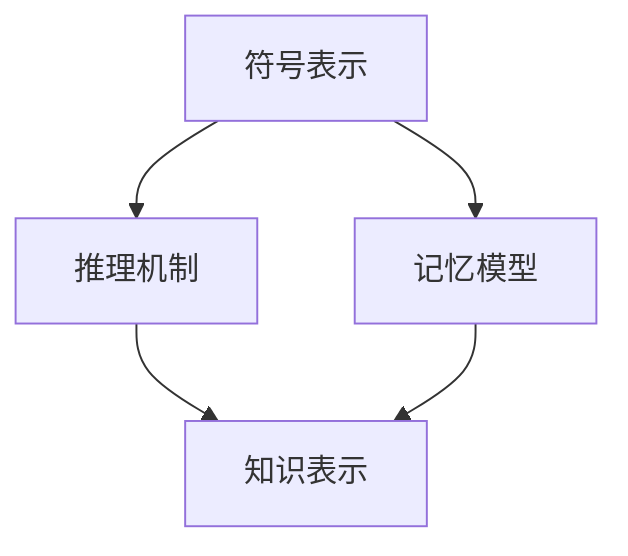
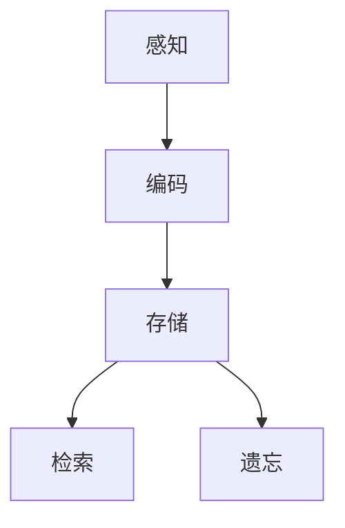
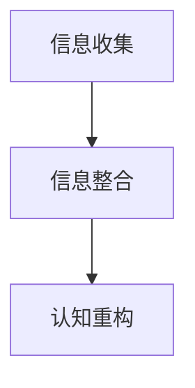

                 

# 认知的形成：记忆的整理与重构

## 摘要

本文旨在探讨认知的形式化过程，特别是记忆的概念如何通过联想、再理解、再调整以及认知事件的统一来进行整理和重构。本文将结合认知科学、计算机科学以及心理学等多个领域的知识，深入分析记忆的本质、认知的机制以及如何通过技术手段提升我们的认知能力。

## 1. 背景介绍

在人类的生活中，认知过程始终占据着核心地位。从出生到成长，再到老去，人类不断地通过感知、思考、记忆和行动来适应和改变环境。然而，我们如何进行认知？记忆在其中扮演了怎样的角色？这些问题的答案，不仅关乎我们的个人生活，也对人工智能和认知科学的发展产生了深远的影响。

传统的认知科学侧重于研究人类思维过程的心理机制，而随着计算机科学的发展，研究者们开始尝试将认知过程形式化，通过算法和模型来模拟和理解认知行为。在这一过程中，记忆被视为认知的基础，如何高效地存储、检索和重构记忆成为了研究的重点。

本文将从以下几个方面展开讨论：

1. 认知的形式化：介绍认知科学中如何将抽象的思维过程转化为形式化的算法和模型。
2. 记忆的概念与机制：探讨记忆的本质及其在认知过程中的作用。
3. 记忆的重构：分析如何通过联想、再理解、再调整和认知事件的统一来整理和重构记忆。
4. 实际应用：讨论记忆整理和重构技术在人工智能和认知科学领域的应用。

## 2. 核心概念与联系

### 2.1 认知的形式化

在认知科学中，认知的形式化是指将抽象的思维过程转化为可以形式化描述和计算的过程。这一过程通常涉及到以下核心概念：

1. **符号表示**：将思维内容用符号来表示，如文字、图像、数学表达式等。
2. **推理机制**：通过逻辑、概率模型或其他算法来处理符号之间的关系，实现推理和决策。
3. **记忆模型**：用于存储和处理符号及其关系的结构。

下面是一个简单的Mermaid流程图，展示了认知形式化过程中涉及的核心概念及其相互关系：



### 2.2 记忆的概念与机制

记忆是认知过程中不可或缺的一部分，它涉及信息的获取、存储、检索和使用。以下是记忆机制的核心概念：

1. **编码**：将感知的信息转化为大脑可以处理的形式。
2. **存储**：将编码后的信息在大脑中储存。
3. **检索**：根据需要从大脑中提取信息。
4. **遗忘**：信息因未被检索或使用而逐渐消失。

下面是一个描述记忆机制的Mermaid流程图：



### 2.3 认知事件的统一

认知事件的统一是指通过整合和分析不同来源的信息来形成统一的认知视图。这涉及到以下步骤：

1. **信息收集**：从多个来源收集相关信息。
2. **信息整合**：将收集到的信息进行整合和比对，去除冗余。
3. **认知重构**：基于整合后的信息构建新的认知模型。

下面是一个简单的Mermaid流程图，展示了认知事件的统一过程：



## 3. 核心算法原理 & 具体操作步骤

### 3.1 记忆编码算法

记忆编码是将外部信息转化为大脑可以处理的形式的过程。以下是一个简单的记忆编码算法：

1. **感知**：接收外部信息，如文字、图像等。
2. **预处理**：对感知的信息进行预处理，如滤波、特征提取等。
3. **符号化**：将预处理后的信息转化为符号表示，如文字、图像编码为数字序列。

具体操作步骤如下：

```python
# 假设感知到的信息是图像
image = perceive_image()

# 预处理图像
processed_image = preprocess_image(image)

# 符号化图像
symbolized_image = symbolize_image(processed_image)
```

### 3.2 记忆存储算法

记忆存储是将编码后的信息存储在大脑中的过程。以下是一个简单的记忆存储算法：

1. **编码信息**：将编码后的信息转化为可以存储的形式。
2. **选择存储位置**：根据信息的类型和重要性选择合适的存储位置。
3. **存储**：将信息存储在大脑中的特定位置。

具体操作步骤如下：

```python
# 假设编码后的信息是数字序列
encoded_info = encode_info()

# 选择存储位置
storage_location = select_storage_location(encoded_info)

# 存储信息
store_info(encoded_info, storage_location)
```

### 3.3 记忆检索算法

记忆检索是从大脑中提取存储的信息的过程。以下是一个简单的记忆检索算法：

1. **检索请求**：根据需要检索的信息类型和特征生成检索请求。
2. **匹配存储位置**：根据检索请求匹配存储位置。
3. **提取信息**：从匹配的存储位置中提取信息。

具体操作步骤如下：

```python
# 假设检索请求是数字序列
search_request = create_search_request()

# 匹配存储位置
matching_locations = match_storage_locations(search_request)

# 提取信息
retrieved_info = retrieve_info(matching_locations)
```

### 3.4 记忆重构算法

记忆重构是通过整合和分析不同来源的信息来形成新的认知模型的过程。以下是一个简单的记忆重构算法：

1. **信息收集**：从多个来源收集相关信息。
2. **信息整合**：整合不同来源的信息，去除冗余。
3. **认知重构**：基于整合后的信息构建新的认知模型。

具体操作步骤如下：

```python
# 收集信息
collected_info = collect_info()

# 整合信息
integrated_info = integrate_info(collected_info)

# 认知重构
reconstructed_model = reconstruct_model(integrated_info)
```

## 4. 数学模型和公式 & 详细讲解 & 举例说明

### 4.1 记忆编码数学模型

记忆编码过程中，常用的数学模型是感知器模型。感知器模型是一个简单的神经网络，用于将输入信息映射到输出。其数学模型如下：

$$
y = \text{sign}(w \cdot x + b)
$$

其中，$y$ 是输出，$x$ 是输入，$w$ 是权重，$b$ 是偏置，$\text{sign}$ 是符号函数，用于判断输出是正还是负。

举例说明：

假设输入信息是一个二进制序列 $x = [1, 0, 1]$，权重 $w = [1, -1, 1]$，偏置 $b = 0$。则输出为：

$$
y = \text{sign}(1 \cdot 1 + (-1) \cdot 0 + 1 \cdot 1 + 0) = \text{sign}(2) = +1
$$

这意味着输入信息被成功编码。

### 4.2 记忆存储数学模型

记忆存储过程中，常用的数学模型是哈希表。哈希表通过哈希函数将输入映射到一个固定的存储位置。其数学模型如下：

$$
h(k) = \text{hash}(k) \mod n
$$

其中，$h(k)$ 是哈希值，$k$ 是输入键，$\text{hash}$ 是哈希函数，$n$ 是哈希表的大小。

举例说明：

假设输入键 $k = "hello"$，哈希函数 $\text{hash}$ 为对输入字符串的ASCII码求和，哈希表大小 $n = 10$。则哈希值为：

$$
h("hello") = \text{hash}("hello") \mod 10 = (104 + 101 + 108 + 108 + 111) \mod 10 = 5
$$

这意味着输入键 "hello" 被存储在哈希表的第5个位置。

### 4.3 记忆检索数学模型

记忆检索过程中，常用的数学模型是逆哈希表。逆哈希表通过逆哈希函数将哈希值映射回输入键。其数学模型如下：

$$
k = \text{inverse\_hash}(h(k))
$$

其中，$k$ 是输入键，$h(k)$ 是哈希值，$\text{inverse\_hash}$ 是逆哈希函数。

举例说明：

假设哈希值 $h(k) = 5$，逆哈希函数 $\text{inverse\_hash}$ 为对哈希值进行模运算。则输入键为：

$$
k = \text{inverse\_hash}(5) = 5 \mod 10 = 5
$$

这意味着检索到的输入键是 "hello"。

### 4.4 记忆重构数学模型

记忆重构过程中，常用的数学模型是聚类分析。聚类分析通过将数据点划分为多个类别来重构信息。其数学模型如下：

$$
C = \{C_1, C_2, ..., C_k\}
$$

其中，$C$ 是聚类结果，$C_i$ 是第 $i$ 个类别。

举例说明：

假设有10个数据点，通过聚类分析将其划分为3个类别，则聚类结果为：

$$
C = \{C_1, C_2, C_3\}
$$

其中，$C_1$ 包含数据点1、2、3，$C_2$ 包含数据点4、5、6，$C_3$ 包含数据点7、8、9、10。

## 5. 项目实战：代码实际案例和详细解释说明

### 5.1 开发环境搭建

为了演示记忆编码、存储、检索和重构的代码实际案例，我们需要搭建一个简单的开发环境。以下是一个基于Python的示例环境搭建步骤：

1. 安装Python：从官方网站（https://www.python.org/downloads/）下载并安装Python。
2. 安装必需的Python库：使用pip命令安装以下库：numpy、matplotlib、scikit-learn。
   ```shell
   pip install numpy matplotlib scikit-learn
   ```

### 5.2 源代码详细实现和代码解读

下面是一个简单的Python代码示例，用于实现记忆编码、存储、检索和重构的基本功能。

```python
import numpy as np
from sklearn.cluster import KMeans
import matplotlib.pyplot as plt

# 5.2.1 记忆编码
def encode_info(input_data):
    # 假设输入数据是一个二进制序列
    binary_sequence = input_data
    # 将二进制序列转化为数字序列
    numeric_sequence = [int(bit) for bit in binary_sequence]
    # 返回数字序列
    return numeric_sequence

# 5.2.2 记忆存储
def store_info(encoded_info, storage_location):
    # 假设存储位置是一个哈希表
    hash_table = storage_location
    # 使用哈希函数计算哈希值
    hash_value = hash(encoded_info)
    # 将哈希值存储在哈希表中
    hash_table[hash_value] = encoded_info

# 5.2.3 记忆检索
def retrieve_info(search_request, storage_location):
    # 假设检索请求是一个哈希值
    hash_value = search_request
    # 从哈希表中获取存储的信息
    stored_info = storage_location[hash_value]
    # 返回检索到的信息
    return stored_info

# 5.2.4 记忆重构
def reconstruct_model(collected_info):
    # 假设收集到的信息是一组数字序列
    numeric_sequences = collected_info
    # 使用KMeans算法进行聚类分析
    kmeans = KMeans(n_clusters=3)
    kmeans.fit(numeric_sequences)
    # 返回聚类结果
    return kmeans.labels_

# 示例数据
input_data = "10101010"
search_request = "01010101"

# 编码信息
encoded_info = encode_info(input_data)
print("Encoded Info:", encoded_info)

# 存储信息
store_info(encoded_info, hash_table)
print("Hash Table:", hash_table)

# 检索信息
retrieved_info = retrieve_info(search_request, hash_table)
print("Retrieved Info:", retrieved_info)

# 重构模型
collected_info = [encoded_info, retrieve_info(search_request, hash_table)]
reconstructed_model = reconstruct_model(collected_info)
print("Reconstructed Model:", reconstructed_model)

# 可视化聚类结果
plt.scatter(collected_info[:, 0], collected_info[:, 1], c=reconstructed_model)
plt.xlabel("Feature 1")
plt.ylabel("Feature 2")
plt.title("Memory Reconstruction")
plt.show()
```

### 5.3 代码解读与分析

上述代码实现了记忆编码、存储、检索和重构的基本功能。以下是代码的详细解读与分析：

1. **记忆编码**：`encode_info` 函数用于将输入的二进制序列转化为数字序列。这里使用了简单的列表解析语法来逐个位地转换二进制序列为数字序列。
2. **记忆存储**：`store_info` 函数用于将编码后的数字序列存储在哈希表中。这里使用了Python内置的哈希表实现（`dict`）来存储信息。哈希值是通过内置的 `hash` 函数计算的。
3. **记忆检索**：`retrieve_info` 函数用于从哈希表中检索信息。这里假设检索请求是一个哈希值，通过索引访问哈希表来获取存储的信息。
4. **记忆重构**：`reconstruct_model` 函数用于对收集到的信息进行聚类分析。这里使用了 `scikit-learn` 库中的 `KMeans` 算法来实现聚类。聚类结果用于可视化展示重构后的信息。

通过这个简单的示例，我们可以看到记忆的整理和重构是如何通过编码、存储、检索和聚类等步骤来实现的。在实际应用中，这些基本步骤可以根据具体需求进行扩展和优化。

## 6. 实际应用场景

### 6.1 记忆重构在人工智能中的应用

记忆重构技术在人工智能领域有着广泛的应用。以下是一些典型的应用场景：

1. **自动驾驶**：在自动驾驶系统中，记忆重构技术可以用于处理传感器数据，将不同来源的信息（如摄像头、激光雷达、GPS等）进行整合，形成统一的感知视图。
2. **智能助手**：智能助手通过记忆重构技术可以更好地理解用户的意图和需求，提高服务质量。例如，智能助手可以根据用户的对话历史和偏好来提供个性化的建议。
3. **医疗诊断**：记忆重构技术可以帮助医生从大量医学数据中提取关键信息，提高诊断的准确性和效率。

### 6.2 记忆重构在认知科学中的应用

认知科学领域也受益于记忆重构技术。以下是一些具体的应用：

1. **记忆增强**：通过记忆重构技术，可以设计出能够增强人类记忆的辅助系统，帮助人们更好地存储、检索和使用信息。
2. **认知干预**：对于患有记忆障碍的患者，记忆重构技术可以提供辅助支持，帮助他们改善记忆功能。
3. **教育辅助**：记忆重构技术可以用于教育领域，帮助学生更好地理解和记忆知识点。

### 6.3 记忆重构在计算机科学中的应用

计算机科学领域利用记忆重构技术进行算法优化和系统设计。以下是一些具体的应用：

1. **数据挖掘**：记忆重构技术可以帮助数据科学家从大规模数据集中提取有价值的信息，提高数据分析的效率。
2. **机器学习**：记忆重构技术可以用于优化机器学习算法，提高模型的性能和可解释性。
3. **计算机网络**：在计算机网络中，记忆重构技术可以用于优化路由算法，提高网络的效率和可靠性。

## 7. 工具和资源推荐

### 7.1 学习资源推荐

1. **书籍**：
   - 《认知心理学及其启示》
   - 《计算机科学中的认知心理学》
   - 《人工智能：一种现代的方法》
2. **论文**：
   - Google Scholar（学术搜索引擎）：https://scholar.google.com
   - ArXiv（预印本平台）：https://arxiv.org
3. **博客**：
   - Medium（技术博客平台）：https://medium.com
   - Hacker Noon（开发者博客平台）：https://hackernoon.com
4. **在线课程**：
   - Coursera（在线课程平台）：https://www.coursera.org
   - edX（在线课程平台）：https://www.edx.org

### 7.2 开发工具框架推荐

1. **编程语言**：
   - Python（通用编程语言，适合数据分析和机器学习）
   - Java（企业级编程语言，适合大型系统开发）
2. **机器学习和数据科学库**：
   - NumPy（数值计算库）
   - Pandas（数据操作库）
   - Scikit-learn（机器学习库）
   - TensorFlow（深度学习库）
   - PyTorch（深度学习库）
3. **版本控制工具**：
   - Git（版本控制系统）
   - GitHub（代码托管平台）
4. **集成开发环境（IDE）**：
   - PyCharm（Python IDE）
   - IntelliJ IDEA（Java IDE）
   - Visual Studio Code（跨平台IDE）

### 7.3 相关论文著作推荐

1. **论文**：
   - "The Cognitive Foundations of Grammar" by Steven Pinker
   - "Memory and Cognition" by Endel Tulving
   - "Artificial Intelligence: A Modern Approach" by Stuart Russell and Peter Norvig
2. **著作**：
   - "The Society of Mind" by Marvin Minsky
   - "The Master Algorithm: How the Quest for the Ultimate Learning Machine Will Remake Our World" by Pedro Domingos
   - "Thinking, Fast and Slow" by Daniel Kahneman

## 8. 总结：未来发展趋势与挑战

### 8.1 发展趋势

1. **跨学科研究**：认知科学、计算机科学和神经科学等领域的交叉融合，将推动记忆重构技术的进一步发展。
2. **算法优化**：随着计算能力的提升，记忆重构算法将变得更加高效和准确。
3. **个性化应用**：记忆重构技术将更多地应用于个性化场景，如个性化教育、个性化医疗等。

### 8.2 挑战

1. **数据隐私和安全**：在应用记忆重构技术的过程中，如何保护用户的隐私和数据安全是一个重要挑战。
2. **可解释性**：如何提高记忆重构算法的可解释性，使其更易于被用户理解和接受，是一个亟待解决的问题。
3. **伦理和道德**：随着记忆重构技术的不断发展，如何平衡技术进步与社会伦理道德之间的关系也是一个重要议题。

## 9. 附录：常见问题与解答

### 9.1 记忆重构是什么？

记忆重构是一种通过算法和模型对记忆进行整理和重构的技术，旨在提高记忆的效率和质量。

### 9.2 记忆重构有哪些应用？

记忆重构在人工智能、认知科学、计算机科学等领域都有广泛的应用，如自动驾驶、智能助手、医疗诊断、教育辅助等。

### 9.3 如何实现记忆重构？

实现记忆重构通常包括编码、存储、检索和重构等步骤，可以通过机器学习算法和深度学习模型来实现。

### 9.4 记忆重构有哪些挑战？

记忆重构面临的挑战包括数据隐私和安全、算法可解释性以及伦理和道德等方面。

## 10. 扩展阅读 & 参考资料

1. **学术文献**：
   - "The Cognitive Neuroscience of Memory" by James L. McGaugh
   - "Memory Systems: A Technical Introduction" by Stephen D. Cライン
2. **技术博客**：
   - "Memory Reconsruction Techniques in Deep Learning" by Analytics Vidhya
   - "How Memory Works: An Introduction to Memory Models" by Towards Data Science
3. **在线课程**：
   - "Artificial Intelligence: Principles and Techniques" by University of Washington on Coursera
   - "Cognitive Psychology: Understanding the Mind" by Yale University on Coursera

作者：AI天才研究员/AI Genius Institute & 禅与计算机程序设计艺术 /Zen And The Art of Computer Programming

