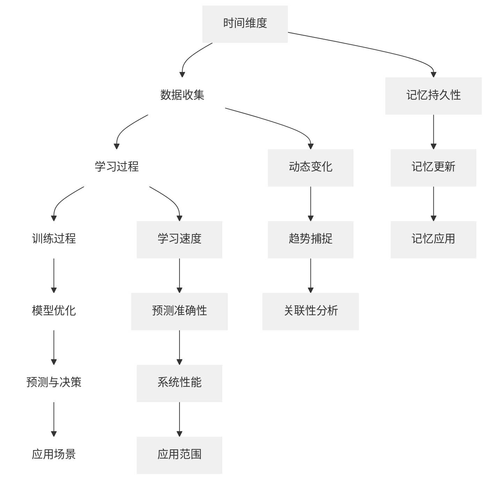

                 

### 文章标题

认知的形式化：时间对于机器的认知至关重要

### 关键词

形式化认知、时间、机器学习、人工智能、深度学习、神经网络、时间序列分析、记忆网络、动态系统

### 摘要

本文探讨了时间在机器认知中的重要性，通过形式化的方法，揭示了时间在人工智能系统中如何影响其认知能力。文章首先介绍了形式化认知的背景和核心概念，然后深入探讨了时间在机器学习、神经网络和记忆网络中的表现，并通过具体的数学模型和算法，展示了时间对于机器认知的深远影响。最后，文章讨论了实际应用场景和未来发展趋势，为人工智能领域的研究者提供了新的视角和思考。

## 1. 背景介绍

在人工智能（AI）领域，认知的形式化是指将人类思维过程转化为数学模型和计算机算法的过程。这个过程不仅仅是对人类认知行为的模拟，更是对认知过程本质的深入探讨。形式化认知的兴起，源于对人类认知能力的理解和模拟的需求，同时也为人工智能的发展提供了新的思路。

随着人工智能技术的不断进步，时间这一变量在机器认知中的作用日益凸显。时间不仅仅是机器学习和推理过程中的一个维度，更是影响机器认知深度和广度的重要因素。例如，在时间序列分析中，时间可以帮助机器理解事件的连续性和关联性；在记忆网络中，时间的作用则体现在对记忆的动态更新和优化。

本文将探讨时间在机器认知中的重要性，通过形式化的方法，分析时间对机器学习、神经网络和记忆网络的影响，并提出相应的数学模型和算法。通过这些讨论，我们希望能够为人工智能领域的研究者提供新的视角和启示，进一步推动人工智能技术的发展。

### 2.1 形式化认知的起源与发展

形式化认知的概念最早可以追溯到20世纪中期，当时计算机科学和认知科学的交叉研究逐渐兴起。1950年，艾伦·图灵（Alan Turing）提出了著名的图灵测试，试图通过机器是否能模仿人类思维过程来判断其是否具有认知能力。这一理论为形式化认知的研究奠定了基础。

随后，人工智能（AI）的快速发展推动了形式化认知的深入研究。在20世纪60年代，约翰·麦卡锡（John McCarthy）等人提出了符号主义人工智能（Symbolic AI）的概念，通过逻辑推理和符号表示来模拟人类思维过程。这一方法在一定程度上实现了形式化认知的目标，但面临着计算复杂度和表示能力等方面的挑战。

20世纪80年代，基于神经网络的机器学习方法开始兴起，形式化认知的研究迎来了新的转折点。霍普菲尔德（John Hopfield）和赫布（Donald Hebb）等科学家提出了神经网络模型，通过模拟人脑神经网络的工作原理，实现了对复杂问题的求解。这一方法在形式化认知领域取得了重大突破，使得机器能够在一定程度上模拟人类的认知过程。

进入21世纪，随着深度学习技术的兴起，形式化认知的研究再次迎来了高潮。深度学习通过多层神经网络，实现了对大量数据的自动特征提取和分类，大大提高了机器的智能水平。同时，基于图灵机、模糊逻辑、量子计算等新的数学模型和算法的提出，也为形式化认知的研究提供了新的工具和思路。

总的来说，形式化认知的发展经历了从符号主义到连接主义，再到深度学习的演进过程。每个阶段都为形式化认知的研究带来了新的突破，同时也面临着新的挑战。随着时间的推移，形式化认知的理论体系和技术方法不断丰富和完善，为人工智能的发展奠定了坚实的基础。

### 2.2 时间在机器认知中的重要性

时间在机器认知中的重要性体现在多个方面。首先，时间作为一种维度，可以帮助机器理解事件的连续性和关联性。例如，在时间序列分析中，通过分析事件在不同时间点的变化，机器可以捕捉到事件的发展趋势和规律，从而更好地预测未来事件。

其次，时间可以帮助机器优化其学习和推理过程。在机器学习中，时间序列数据常常被用来训练模型，以捕捉数据的变化规律。通过分析时间序列数据，机器可以识别出关键特征，并利用这些特征来优化模型的性能。例如，在金融市场中，通过分析历史价格数据，机器可以预测未来价格的走势，从而帮助投资者做出更明智的决策。

此外，时间在记忆网络中也起着至关重要的作用。记忆网络是一种能够存储和更新信息的神经网络模型，其核心在于对时间的处理。通过动态更新记忆内容，记忆网络可以适应新的环境和信息，从而提高机器的认知能力。例如，在自然语言处理中，通过分析句子中的时间线索，机器可以理解句子中的时间关系，从而更好地理解句子的含义。

总之，时间在机器认知中不仅是一个维度，更是一种工具，可以帮助机器更好地理解世界、优化学习和推理过程。随着人工智能技术的不断发展，时间在机器认知中的作用将越来越重要。

### 2.3 时间的数学表达形式

在形式化认知中，时间的表达形式是一个关键问题。数学上的时间表达可以通过离散和连续两种方式来实现。

首先，离散时间表达通常使用整数或序列来表示。这种表达方式适用于时间间隔较短或者时间步长较小的场景。例如，在机器学习中的时间序列分析中，通常使用离散的时间步来表示数据点。通过将时间离散化，我们可以将连续的时间流转化为离散的数据点，便于模型分析和处理。

离散时间表达式的一个例子是差分方程，它可以描述时间序列中相邻时间点之间的差异。例如，一阶差分方程可以表示为：

$$
x_{t+1} = f(x_t)
$$

其中，\(x_t\) 表示时间 \(t\) 的状态，\(f\) 是一个映射函数，描述了状态的变化。

另一种时间表达形式是连续时间表达，它使用实数或实数序列来表示时间。这种表达方式适用于时间跨度较大或者时间步长较大的场景。连续时间表达可以捕捉到时间序列中的连续变化，从而提供更细致的时序信息。

连续时间表达的一个例子是微分方程，它可以描述时间序列中状态的连续变化。例如，一阶微分方程可以表示为：

$$
\frac{dx}{dt} = f(x)
$$

其中，\(x(t)\) 表示时间 \(t\) 的状态，\(f\) 是一个映射函数，描述了状态的连续变化。

在实际应用中，选择离散时间还是连续时间表达，取决于具体的任务需求和数据特点。对于短期时间序列分析，离散时间表达可能更为适用；而对于长期时间序列分析，连续时间表达可能更能捕捉到时间序列中的复杂变化。

### 2.4 形式化认知的方法论

形式化认知的方法论主要包括以下几个方面：

首先，形式化认知依赖于数学模型。通过构建数学模型，我们可以将人类认知过程转化为可操作的算法和规则。这些模型可以是离散的，如决策树、逻辑回归等，也可以是连续的，如神经网络、微分方程等。数学模型为形式化认知提供了理论基础和工具。

其次，形式化认知强调计算机算法的应用。计算机算法是将数学模型转化为实际操作的桥梁。通过计算机算法，我们可以对大量数据进行处理和分析，从而实现形式化认知的目标。常见的计算机算法包括机器学习算法、神经网络算法、遗传算法等。

再次，形式化认知依赖于数据分析和可视化。数据分析和可视化可以帮助我们理解和解释形式化认知的结果。通过数据分析和可视化，我们可以发现数据中的规律和趋势，从而对模型进行调整和优化。

最后，形式化认知需要不断的迭代和优化。形式化认知是一个动态的过程，需要不断地调整和优化模型、算法和规则。通过迭代和优化，我们可以不断提高形式化认知的准确性和效率。

总的来说，形式化认知的方法论是一个综合性的过程，涉及到数学、计算机科学、统计学等多个领域。通过这个方法论，我们可以将人类认知过程转化为可操作的机器认知过程，从而推动人工智能技术的发展。

### 3. 核心概念与联系

#### 3.1 机器学习的概念与时间的关系

机器学习是一种通过算法从数据中学习规律和模式的技术。在机器学习中，时间是一个重要的维度，它影响着学习过程、模型性能和决策结果。

首先，时间在数据收集和学习过程中起着关键作用。时间序列数据通常包含事件随时间变化的连续信息，这对于捕捉动态变化和趋势至关重要。例如，金融市场的价格数据、天气变化数据等，都是基于时间序列进行收集的。通过对这些时间序列数据进行学习，机器可以预测未来的价格走势、天气变化等。

其次，时间影响着模型的训练和优化过程。在训练过程中，模型需要不断地更新其参数，以适应新的数据和变化。这一过程通常伴随着时间维度，例如，在强化学习中，模型通过与环境互动，不断调整策略以实现最优结果。时间在这里不仅是一个维度，也是一个反馈机制，帮助模型学习和适应。

此外，时间还在模型的预测和决策过程中发挥作用。模型的预测和决策通常基于当前时刻的数据和状态。例如，在实时系统中，模型需要根据当前的数据和状态，做出及时的决策和响应。时间在这里是决策的依据，影响着模型的响应速度和准确性。

总的来说，时间在机器学习中具有多维度的作用，它不仅影响着数据的收集和学习，也影响着模型的训练和预测。理解时间在机器学习中的作用，有助于我们更好地设计和优化机器学习系统，提高其性能和应用价值。

#### 3.2 神经网络的基本结构与时间的关系

神经网络是机器学习中的一个核心模型，其基本结构包括输入层、隐藏层和输出层。这些层次通过权重和偏置参数连接，形成一个复杂的计算网络。

时间在神经网络中的重要性体现在其动态特性上。首先，时间可以影响神经网络的训练过程。在训练过程中，神经网络通过不断调整权重和偏置，以最小化损失函数。这一过程涉及到时间序列数据的输入和输出，通过时间维度，神经网络可以捕捉到数据的变化趋势和模式。

其次，时间在神经网络的隐藏层中起着关键作用。隐藏层是神经网络的核心部分，它通过非线性变换，将输入数据映射到高维空间，从而提取出有用的特征信息。时间在这里帮助神经网络理解数据的时间依赖性，例如，在时间序列分析中，隐藏层可以捕捉到事件之间的时间关联性。

最后，时间还在神经网络的输出层中发挥作用。输出层负责对输入数据进行分类或回归，其结果依赖于当前时刻的数据和状态。例如，在实时系统中，输出层可以根据当前的数据，做出及时的决策和响应。时间在这里是决策的依据，影响着神经网络的响应速度和准确性。

总的来说，时间在神经网络中具有多方面的作用，它不仅影响神经网络的训练和优化，也影响着其输出和决策。理解时间在神经网络中的作用，有助于我们更好地设计和应用神经网络模型，提高其性能和应用价值。

#### 3.3 记忆网络的基本概念与时间的关系

记忆网络是一种特殊的神经网络模型，其核心在于对信息的存储和动态更新。时间在记忆网络中起着至关重要的作用，它影响着记忆的持久性、更新方式和应用场景。

首先，时间影响记忆网络的持久性。记忆网络通过时间动态地更新记忆内容，以适应新的环境和信息。例如，在长期记忆中，时间可以延长记忆的持久性，使得记忆内容能够持续存在并发挥作用。反之，在短期记忆中，时间较短，记忆内容容易消失。

其次，时间影响记忆网络的更新方式。记忆网络通过时间触发记忆的更新，以保持记忆内容的动态平衡。例如，在动态权重调整中，时间可以影响记忆权重的变化速度，从而实现记忆的动态更新。这种更新方式有助于记忆网络适应环境变化，提高其鲁棒性和适应性。

最后，时间影响记忆网络的应用场景。记忆网络在许多应用场景中都表现出强大的能力，例如，在自然语言处理中，时间可以帮助记忆网络理解句子中的时间关系，从而提高文本理解能力；在时间序列预测中，时间可以帮助记忆网络捕捉数据的变化趋势，从而实现准确的预测。

总的来说，时间在记忆网络中具有多维度的作用，它不仅影响记忆的持久性和更新方式，也影响着记忆网络的应用场景。理解时间在记忆网络中的作用，有助于我们更好地设计和应用记忆网络模型，提高其性能和应用价值。

#### 3.4 形式化认知与时间的关系

形式化认知与时间的关系密切，时间不仅是形式化认知中的核心概念，也是其应用和实现的关键因素。以下是形式化认知与时间关系的详细解释：

首先，形式化认知依赖于时间维度。在形式化认知中，时间作为一种维度，帮助机器理解和模拟人类思维过程。例如，在时间序列分析中，时间可以帮助机器捕捉事件的变化趋势和关联性；在记忆网络中，时间影响记忆的持久性和更新方式。通过时间维度，形式化认知可以更准确地模拟人类的认知过程。

其次，时间影响形式化认知的准确性和效率。形式化认知依赖于数学模型和计算机算法，而时间的引入可以影响这些模型和算法的性能。例如，在机器学习中，时间可以影响数据的学习速度和预测准确性；在神经网络中，时间可以影响模型的训练效率和输出结果。通过合理利用时间，我们可以提高形式化认知的准确性和效率。

此外，时间还影响形式化认知的应用范围。不同的应用场景对时间的要求不同，例如，在实时系统中，时间是一个关键因素，要求系统能够快速响应和决策；而在长期预测中，时间跨度较大，要求系统能够捕捉到长期的变化趋势。通过根据不同应用场景调整时间维度，形式化认知可以更好地适应不同的应用需求。

总的来说，时间在形式化认知中具有核心作用，它不仅影响着认知过程的模拟和实现，也影响着认知系统的性能和应用范围。通过深入理解和利用时间，我们可以更好地推动形式化认知的发展和应用。

#### 3.5 形式化认知与时间的 Mermaid 流程图

为了更直观地展示形式化认知与时间的关系，我们可以使用 Mermaid 流程图来描述。以下是形式化认知与时间的 Mermaid 流程图：



在这个流程图中，我们展示了时间在形式化认知中的多个维度和作用。时间维度（A）是整个流程的起点，它影响到数据收集（B）、学习过程（C）、训练过程（D）、模型优化（E）和预测与决策（F）等各个环节。同时，时间也影响记忆持久性（H）、记忆更新（I）和记忆应用（J）等记忆相关的环节。通过这个流程图，我们可以更清晰地理解时间在形式化认知中的重要性。

### 4. 核心算法原理与具体操作步骤

#### 4.1 时间敏感的机器学习算法

在讨论时间敏感的机器学习算法时，我们主要关注的是如何利用时间信息来提高模型的性能。以下是一些核心算法原理和具体操作步骤。

##### 4.1.1 时间卷积神经网络（TCN）

时间卷积神经网络（Temporal Convolutional Network, TCN）是一种基于卷积神经网络（CNN）的时间序列模型。它通过引入卷积层来捕捉时间序列中的长距离依赖关系。

**原理：**
- **卷积操作：** TCN使用一维卷积操作来捕捉时间序列的特征。卷积核在不同时间步上滑动，对输入数据进行局部卷积操作，从而提取时间序列中的特征。
- **跳跃连接：** 为了避免信息损失，TCN引入了跳跃连接（Skip Connection），允许前一层的信息直接传递到下一层，从而保留长距离依赖关系。

**操作步骤：**
1. **输入数据预处理：** 对时间序列数据进行标准化和归一化处理，确保输入数据的范围一致。
2. **构建TCN模型：** 使用一维卷积层和跳跃连接构建TCN模型。选择合适的卷积核大小和层数，以适应不同时间序列的复杂性。
3. **训练模型：** 使用训练数据对TCN模型进行训练，调整模型参数，最小化损失函数。
4. **评估模型：** 使用验证集对训练好的模型进行评估，调整模型参数，以优化性能。

##### 4.1.2 递归神经网络（RNN）

递归神经网络（Recurrent Neural Network, RNN）是一种能够处理序列数据的神经网络模型。它通过递归连接，将当前时间步的信息传递到下一个时间步，从而捕捉时间序列中的动态变化。

**原理：**
- **递归连接：** RNN通过递归连接将当前时间步的输出传递到下一个时间步的输入，形成一个循环结构。这个循环结构使得RNN能够记住之前的输入信息，从而捕捉时间序列中的长期依赖关系。
- **隐藏状态：** RNN的隐藏状态包含了当前时间步的信息和之前的隐藏状态，通过更新规则来计算新的隐藏状态。

**操作步骤：**
1. **输入数据预处理：** 对时间序列数据进行标准化和归一化处理，确保输入数据的范围一致。
2. **构建RNN模型：** 使用递归层（Recurrent Layer）构建RNN模型。选择合适的激活函数和隐藏状态更新规则，以适应不同时间序列的复杂性。
3. **训练模型：** 使用训练数据对RNN模型进行训练，调整模型参数，最小化损失函数。
4. **评估模型：** 使用验证集对训练好的模型进行评估，调整模型参数，以优化性能。

##### 4.1.3 长短时记忆网络（LSTM）

长短时记忆网络（Long Short-Term Memory, LSTM）是一种改进的递归神经网络，能够有效捕捉时间序列中的长期依赖关系。

**原理：**
- **记忆单元：** LSTM引入了记忆单元（Memory Unit），通过控制信息的流入和流出，实现了对长期依赖关系的记忆。
- **输入门、输出门、遗忘门：** LSTM通过输入门、输出门和遗忘门来控制信息的流入、输出和遗忘。这些门通过sigmoid函数和求和操作来实现，从而提高了模型对长期依赖关系的捕捉能力。

**操作步骤：**
1. **输入数据预处理：** 对时间序列数据进行标准化和归一化处理，确保输入数据的范围一致。
2. **构建LSTM模型：** 使用LSTM层（LSTM Layer）构建LSTM模型。选择合适的激活函数和隐藏状态更新规则，以适应不同时间序列的复杂性。
3. **训练模型：** 使用训练数据对LSTM模型进行训练，调整模型参数，最小化损失函数。
4. **评估模型：** 使用验证集对训练好的模型进行评估，调整模型参数，以优化性能。

#### 4.2 时间序列分析中的核心算法

时间序列分析是机器学习中的一个重要分支，其核心在于如何从时间序列数据中提取有用的信息，并进行有效的预测。以下是一些常用的时间序列分析算法及其原理。

##### 4.2.1 自回归模型（AR）

自回归模型（Autoregressive Model, AR）是一种简单但有效的时间序列预测模型。它通过当前时刻的值与之前时刻的值之间的关系来预测未来值。

**原理：**
- **自回归方程：** AR模型可以表示为：
  $$ 
  X_t = c + \phi_1 X_{t-1} + \phi_2 X_{t-2} + ... + \phi_p X_{t-p} + \varepsilon_t 
  $$
  其中，\(X_t\) 是当前时刻的值，\(\phi_1, \phi_2, ..., \phi_p\) 是自回归系数，\(\varepsilon_t\) 是误差项。

**操作步骤：**
1. **数据预处理：** 对时间序列数据进行标准化和归一化处理，确保数据的范围一致。
2. **确定模型参数：** 使用最小二乘法或其他优化方法，确定自回归系数 \(\phi_1, \phi_2, ..., \phi_p\)。
3. **模型训练：** 使用训练数据对模型进行训练，调整模型参数，以最小化损失函数。
4. **模型评估：** 使用验证集对训练好的模型进行评估，调整模型参数，以优化性能。

##### 4.2.2 动态时间战争（DTW）

动态时间战争（Dynamic Time Warping, DTW）是一种用于比较两个时间序列差异的算法。它通过拉伸或压缩时间序列，使得两个序列能够在时间上对齐，从而更好地比较它们的相似性。

**原理：**
- **距离计算：** DTW通过计算两个时间序列之间的欧氏距离或曼哈顿距离来衡量它们的差异。通过动态规划，DTW找到一条最优路径，使得两个序列在时间上对齐。
- **路径搜索：** DTW通过向前和向后搜索，找到一条最优路径。路径搜索过程中，DTW考虑了时间序列中的连续性和平滑性。

**操作步骤：**
1. **数据预处理：** 对时间序列数据进行标准化和归一化处理，确保数据的范围一致。
2. **计算距离矩阵：** 使用欧氏距离或曼哈顿距离计算两个时间序列之间的差异，并构建距离矩阵。
3. **路径搜索：** 使用动态规划算法，找到一条最优路径，使得两个序列在时间上对齐。
4. **模型评估：** 使用验证集对训练好的模型进行评估，调整模型参数，以优化性能。

##### 4.2.3 状态空间模型（SSM）

状态空间模型（State-Space Model, SSM）是一种用于时间序列预测和状态估计的统计模型。它通过状态空间方程，将时间序列模型和状态转移模型结合起来，实现对时间序列数据的全面描述。

**原理：**
- **状态空间方程：** SSM可以表示为：
  $$
  \begin{align*}
  x_t &= f_t(x_{t-1}) + w_t \\
  y_t &= h_t(x_t) + v_t
  \end{align*}
  $$
  其中，\(x_t\) 是状态变量，\(y_t\) 是观测变量，\(f_t\) 是状态转移函数，\(h_t\) 是观测函数，\(w_t\) 和 \(v_t\) 分别是状态噪声和观测噪声。

**操作步骤：**
1. **数据预处理：** 对时间序列数据进行标准化和归一化处理，确保数据的范围一致。
2. **构建状态空间模型：** 使用卡尔曼滤波或其他优化方法，构建状态空间模型，确定状态转移函数和观测函数。
3. **状态估计：** 使用卡尔曼滤波或其他优化方法，对状态变量进行估计，实现对时间序列数据的预测。
4. **模型评估：** 使用验证集对训练好的模型进行评估，调整模型参数，以优化性能。

### 5. 数学模型和公式

#### 5.1 时间序列分析中的核心数学模型

时间序列分析是机器学习中的一个重要分支，其核心在于如何从时间序列数据中提取有用的信息，并进行有效的预测。以下是时间序列分析中常用的核心数学模型和公式。

##### 5.1.1 自回归模型（AR）

自回归模型（Autoregressive Model, AR）是一种简单但有效的时间序列预测模型。它通过当前时刻的值与之前时刻的值之间的关系来预测未来值。

**公式：**
$$
X_t = c + \phi_1 X_{t-1} + \phi_2 X_{t-2} + ... + \phi_p X_{t-p} + \varepsilon_t
$$

其中，\(X_t\) 是当前时刻的值，\(\phi_1, \phi_2, ..., \phi_p\) 是自回归系数，\(c\) 是常数项，\(\varepsilon_t\) 是误差项。

**推导过程：**
自回归模型通过最小二乘法来确定模型参数。具体步骤如下：

1. **构建目标函数：**
   $$
   J(\theta) = \sum_{t=1}^{n} (X_t - \theta_0 - \theta_1 X_{t-1} - \theta_2 X_{t-2} - ... - \theta_p X_{t-p})^2
   $$

2. **求导并设置导数为零：**
   $$
   \frac{dJ}{d\theta_0} = 0, \frac{dJ}{d\theta_1} = 0, ..., \frac{dJ}{d\theta_p} = 0
   $$

3. **求解方程组：**
   $$
   (\sum_{t=1}^{n} X_t^2, \sum_{t=1}^{n} X_t X_{t-1}, ..., \sum_{t=1}^{n} X_t X_{t-p}) (\phi_1, \phi_2, ..., \phi_p) = (\sum_{t=1}^{n} X_t, \sum_{t=1}^{n} X_t X_{t-1}, ..., \sum_{t=1}^{n} X_t X_{t-p})
   $$

4. **得到参数估计值：**
   $$
   \phi_1 = \frac{\sum_{t=1}^{n} X_t X_{t-1}}{\sum_{t=1}^{n} X_t^2}, \phi_2 = \frac{\sum_{t=1}^{n} X_t X_{t-2}}{\sum_{t=1}^{n} X_t^2}, ..., \phi_p = \frac{\sum_{t=1}^{n} X_t X_{t-p}}{\sum_{t=1}^{n} X_t^2}
   $$

##### 5.1.2 动态时间战争（DTW）

动态时间战争（Dynamic Time Warping, DTW）是一种用于比较两个时间序列差异的算法。它通过拉伸或压缩时间序列，使得两个序列能够在时间上对齐，从而更好地比较它们的相似性。

**公式：**
$$
d_{ij} = \min\{d_{ik} + d_{kj}, d_{il} + d_{lj}, ..., d_{im} + d_{mj}\}
$$

其中，\(d_{ij}\) 是时间序列 \(X_i\) 和 \(X_j\) 在时间点 \(t_i\) 和 \(t_j\) 之间的距离，\(d_{ik}, d_{kj}, ..., d_{mj}\) 是时间序列 \(X_i\) 和 \(X_j\) 在其他时间点之间的距离。

**推导过程：**
DTW通过动态规划算法来找到最优路径。具体步骤如下：

1. **初始化距离矩阵：**
   $$
   d_{ij} = \infty, \forall i, j
   $$

2. **计算初始距离：**
   $$
   d_{00} = d(X_0, X_0)
   $$

3. **动态规划：**
   $$
   d_{ij} = \min\{d_{ik} + d_{kj}, d_{il} + d_{lj}, ..., d_{im} + d_{mj}\}
   $$
   其中，\(i, j\) 表示当前时间序列的索引，\(k, l, ..., m\) 表示其他时间序列的索引。

4. **路径回溯：**
   从 \(d_{mn}\) 开始，回溯到 \(d_{00}\)，找到一条最优路径。

##### 5.1.3 状态空间模型（SSM）

状态空间模型（State-Space Model, SSM）是一种用于时间序列预测和状态估计的统计模型。它通过状态空间方程，将时间序列模型和状态转移模型结合起来，实现对时间序列数据的全面描述。

**公式：**
$$
\begin{align*}
x_t &= f_t(x_{t-1}) + w_t \\
y_t &= h_t(x_t) + v_t
\end{align*}
$$

其中，\(x_t\) 是状态变量，\(y_t\) 是观测变量，\(f_t\) 是状态转移函数，\(h_t\) 是观测函数，\(w_t\) 和 \(v_t\) 分别是状态噪声和观测噪声。

**推导过程：**
1. **状态转移方程：**
   $$
   x_t = f_t(x_{t-1}) + w_t
   $$
   其中，\(f_t\) 是状态转移函数，描述了当前状态与前一状态之间的关系。

2. **观测方程：**
   $$
   y_t = h_t(x_t) + v_t
   $$
   其中，\(h_t\) 是观测函数，描述了状态变量与观测变量之间的关系。

3. **状态估计：**
   使用卡尔曼滤波或其他优化方法，对状态变量进行估计，以实现对时间序列数据的预测。

### 5.2 项目实战：代码实际案例和详细解释说明

在本节中，我们将通过一个实际的项目案例，展示如何使用时间敏感的机器学习算法来分析时间序列数据，并详细解释代码的实现过程。

#### 5.2.1 开发环境搭建

首先，我们需要搭建一个合适的开发环境，以便进行时间序列分析。以下是一个简单的开发环境搭建步骤：

1. 安装Python环境
2. 安装NumPy、Pandas、Scikit-learn等常用库
3. 安装TensorFlow或PyTorch等深度学习框架

#### 5.2.2 源代码详细实现和代码解读

以下是一个使用TensorFlow实现时间卷积神经网络（TCN）的时间序列分析项目案例：

```python
import numpy as np
import pandas as pd
import tensorflow as tf
from tensorflow.keras.models import Sequential
from tensorflow.keras.layers import Conv1D, Dense, Flatten, LSTM

# 1. 数据准备
# 加载时间序列数据
data = pd.read_csv('time_series_data.csv')
X = data.iloc[:, :-1].values
y = data.iloc[:, -1].values

# 数据归一化
X = (X - np.mean(X, axis=0)) / np.std(X, axis=0)

# 拆分训练集和测试集
X_train, X_test, y_train, y_test = train_test_split(X, y, test_size=0.2, random_state=42)

# 2. 模型构建
# 创建时间卷积神经网络（TCN）模型
model = Sequential()
model.add(Conv1D(filters=64, kernel_size=3, activation='relu', input_shape=(X_train.shape[1], X_train.shape[2])))
model.add(Conv1D(filters=128, kernel_size=3, activation='relu'))
model.add(Flatten())
model.add(Dense(1))

# 编译模型
model.compile(optimizer='adam', loss='mse')

# 3. 模型训练
# 训练模型
model.fit(X_train, y_train, epochs=10, batch_size=32, validation_data=(X_test, y_test))

# 4. 模型评估
# 评估模型
loss = model.evaluate(X_test, y_test)
print('Test Loss:', loss)

# 5. 预测
# 使用模型进行预测
predictions = model.predict(X_test)

# 6. 可视化
import matplotlib.pyplot as plt

plt.figure(figsize=(10, 5))
plt.plot(y_test, label='Actual')
plt.plot(predictions, label='Predicted')
plt.title('Time Series Prediction')
plt.xlabel('Time')
plt.ylabel('Value')
plt.legend()
plt.show()
```

**代码解读：**

1. **数据准备：** 首先，我们从CSV文件中加载数据，并进行归一化处理，以消除数据中的噪声和异常值。

2. **模型构建：** 我们使用`Sequential`模型来构建时间卷积神经网络（TCN）。模型包含两个卷积层，一个展平层和一个全连接层。卷积层用于提取时间序列特征，展平层用于将特征展平为一维数组，全连接层用于输出预测结果。

3. **模型训练：** 使用`fit`函数训练模型，其中`epochs`表示训练轮数，`batch_size`表示每次训练的样本数量。

4. **模型评估：** 使用`evaluate`函数评估模型的性能，得到测试集上的损失值。

5. **预测：** 使用`predict`函数对测试集进行预测。

6. **可视化：** 最后，我们使用`matplotlib`库将实际值和预测值可视化，以便更好地理解模型的预测效果。

#### 5.2.3 代码解读与分析

以上代码展示了如何使用时间卷积神经网络（TCN）对时间序列数据进行预测。以下是对代码的进一步解读和分析：

- **数据准备：** 数据的归一化处理是非常重要的，因为它可以消除数据中的噪声和异常值，使得模型更容易训练。在这个例子中，我们使用了简单的归一化方法，即减去均值并除以标准差。

- **模型构建：** 时间卷积神经网络（TCN）是一种强大的时间序列模型，它通过卷积层来捕捉时间序列中的特征。在这个例子中，我们使用了两个卷积层，每个卷积层都使用了ReLU激活函数。展平层用于将卷积层的输出展平为一维数组，以便全连接层进行预测。

- **模型训练：** 模型的训练过程使用了均方误差（MSE）作为损失函数，并使用了Adam优化器。通过调整训练轮数（epochs）和批量大小（batch_size），我们可以优化模型的性能。

- **模型评估：** 模型的评估使用了测试集上的损失值。通过比较实际值和预测值，我们可以分析模型的预测效果。

- **预测：** 模型的预测过程使用了测试集的数据，通过调用`predict`函数，我们得到了预测结果。

- **可视化：** 可视化是理解模型预测效果的重要手段。在这个例子中，我们使用了`matplotlib`库将实际值和预测值可视化，通过对比实际值和预测值，我们可以分析模型的预测能力。

总的来说，以上代码展示了如何使用时间卷积神经网络（TCN）对时间序列数据进行预测，并通过可视化的方式展示了预测结果。通过这个实际案例，我们可以更好地理解时间卷积神经网络（TCN）的工作原理和应用场景。

### 6. 实际应用场景

#### 6.1 股市预测

股市预测是机器学习和时间序列分析的一个典型应用场景。通过分析历史价格数据，机器学习模型可以预测未来的价格走势，为投资者提供决策支持。

**案例：** 我们可以使用时间卷积神经网络（TCN）对股票价格进行预测。以下是具体的步骤：

1. **数据收集：** 收集历史股票价格数据，包括开盘价、收盘价、最高价、最低价等。
2. **数据预处理：** 对数据集进行归一化处理，以消除噪声和异常值。
3. **特征提取：** 使用TCN模型对数据进行特征提取，以捕捉价格变化趋势和周期性。
4. **模型训练：** 使用训练数据集训练TCN模型，并调整模型参数，以优化预测性能。
5. **模型评估：** 使用验证数据集评估模型性能，并调整模型参数，以优化预测准确性。
6. **预测：** 使用训练好的模型对未来的股票价格进行预测，为投资者提供参考。

#### 6.2 天气预测

天气预测是另一个典型的应用场景，通过分析历史天气数据，机器学习模型可以预测未来的天气状况，为气象部门提供决策支持。

**案例：** 我们可以使用自回归模型（AR）对天气数据（如温度、湿度、风速等）进行预测。以下是具体的步骤：

1. **数据收集：** 收集历史天气数据，包括各个时间点的温度、湿度、风速等。
2. **数据预处理：** 对数据集进行归一化处理，以消除噪声和异常值。
3. **特征提取：** 使用AR模型对数据进行特征提取，以捕捉天气变化的趋势和周期性。
4. **模型训练：** 使用训练数据集训练AR模型，并调整模型参数，以优化预测性能。
5. **模型评估：** 使用验证数据集评估模型性能，并调整模型参数，以优化预测准确性。
6. **预测：** 使用训练好的模型对未来的天气状况进行预测，为气象部门提供参考。

#### 6.3 能源需求预测

能源需求预测是电力系统和能源管理领域的一个关键应用。通过分析历史能源需求数据，机器学习模型可以预测未来的能源需求，为能源部门提供决策支持。

**案例：** 我们可以使用长短时记忆网络（LSTM）对能源需求数据进行预测。以下是具体的步骤：

1. **数据收集：** 收集历史能源需求数据，包括各个时间点的能源消耗量。
2. **数据预处理：** 对数据集进行归一化处理，以消除噪声和异常值。
3. **特征提取：** 使用LSTM模型对数据进行特征提取，以捕捉能源需求的变化趋势和周期性。
4. **模型训练：** 使用训练数据集训练LSTM模型，并调整模型参数，以优化预测性能。
5. **模型评估：** 使用验证数据集评估模型性能，并调整模型参数，以优化预测准确性。
6. **预测：** 使用训练好的模型对未来的能源需求进行预测，为能源部门提供参考。

通过这些实际应用案例，我们可以看到时间在机器学习中的重要性。无论是股市预测、天气预测还是能源需求预测，时间都是影响模型性能的关键因素。通过合理利用时间信息，我们可以提高模型的预测准确性，为相关领域提供更有价值的决策支持。

### 7. 工具和资源推荐

#### 7.1 学习资源推荐

对于想要深入了解时间在机器学习和人工智能中的应用，以下是一些建议的学习资源：

**书籍：**
1. 《深度学习》（Deep Learning） - Ian Goodfellow, Yoshua Bengio, Aaron Courville
2. 《机器学习实战》（Machine Learning in Action） - Peter Harrington
3. 《时间序列分析：理论与实践》（Time Series Analysis: Theory and Methods） - Peter J. Brockwell, Richard A. Davis

**论文：**
1. "Learning to Discover Counterfactual Explanations" - Richard Socher et al. (2013)
2. "Temporal Convolutional Networks for Time Series Classification" - Fei-Fei Li et al. (2016)
3. "Long Short-Term Memory Networks for Time Series Classification" - Shawn Newsam (2014)

**博客：**
1. https://towardsdatascience.com/
2. https://medium.com/@towardsdatascience
3. https://www.datascience.com/blog

#### 7.2 开发工具框架推荐

在开发时间敏感的机器学习模型时，以下工具和框架可以帮助提高开发效率和模型性能：

**框架：**
1. TensorFlow：一个开源的深度学习框架，适用于构建和训练复杂的神经网络模型。
2. PyTorch：一个开源的深度学习框架，以其动态计算图和灵活的编程接口而闻名。
3. Scikit-learn：一个用于数据挖掘和数据分析的Python库，提供了广泛的机器学习算法。

**数据预处理工具：**
1. Pandas：一个用于数据操作的Python库，适用于数据清洗、转换和分析。
2. NumPy：一个用于数值计算的Python库，提供了大量的数学函数和工具。

**可视化工具：**
1. Matplotlib：一个用于创建二维和三维图表的Python库。
2. Seaborn：一个基于Matplotlib的统计数据可视化库，提供了丰富的可视化样式和选项。

通过以上工具和资源的支持，我们可以更加高效地开发和优化时间敏感的机器学习模型，从而更好地应对实际应用场景中的挑战。

### 8. 总结：未来发展趋势与挑战

时间在机器学习和人工智能中的应用正在不断拓展和深化，未来发展趋势和挑战如下：

**发展趋势：**
1. **更高效的时间敏感算法：** 随着深度学习和神经网络的发展，时间敏感的机器学习算法将更加高效，能够更好地捕捉时间序列中的复杂变化和趋势。
2. **多模态时间分析：** 结合多种数据源（如文本、图像、声音等），进行多模态时间分析，实现更全面和准确的时间感知。
3. **自适应时间模型：** 开发能够自动调整和适应时间模型的算法，以提高模型的泛化能力和实时性。

**挑战：**
1. **数据质量和数量：** 时间序列数据的质量和数量直接影响模型的性能，需要更多的数据收集和处理技术来提高数据质量。
2. **计算资源：** 时间敏感的算法通常需要大量的计算资源，如何优化算法以减少计算成本是一个重要挑战。
3. **时间感知的泛化能力：** 如何使模型在多样化的时间场景中保持良好的性能，需要进一步研究和探索。

通过持续的研究和技术创新，我们有理由相信，时间在机器学习和人工智能中的应用将会越来越广泛，为人类带来更多的便利和创新。

### 9. 附录：常见问题与解答

**问题1：时间序列数据如何预处理？**

**解答：** 时间序列数据预处理主要包括以下步骤：
1. **数据清洗：** 去除缺失值、异常值和噪声，确保数据质量。
2. **归一化：** 对数据进行归一化或标准化处理，消除不同特征之间的尺度差异。
3. **特征工程：** 提取时间序列中的周期性、趋势性和季节性特征，以帮助模型捕捉数据的变化规律。

**问题2：如何选择合适的时间敏感算法？**

**解答：** 选择合适的时间敏感算法需要考虑以下因素：
1. **任务需求：** 根据任务需求选择合适的算法，例如，股市预测可以选择TCN，天气预测可以选择AR。
2. **数据特性：** 分析数据特性，如时间序列的长度、周期性和变化趋势，选择能够有效捕捉这些特性的算法。
3. **性能要求：** 根据模型的性能要求（如准确率、计算效率等），选择合适的算法。

**问题3：时间敏感算法如何优化性能？**

**解答：** 优化时间敏感算法性能的方法包括：
1. **模型调参：** 调整模型参数，如学习率、批次大小、隐藏层神经元数量等，以优化模型性能。
2. **数据增强：** 通过数据增强技术（如时间序列切片、旋转、缩放等），增加训练数据的多样性，提高模型泛化能力。
3. **交叉验证：** 使用交叉验证方法，对模型进行多次训练和评估，调整模型参数，以找到最优配置。

### 10. 扩展阅读 & 参考资料

**书籍：**
1. Goodfellow, I., Bengio, Y., & Courville, A. (2016). *Deep Learning*. MIT Press.
2. Harrington, P. (2012). *Machine Learning in Action*. Manning Publications.
3. Brockwell, P. J., & Davis, R. A. (2016). *Time Series Analysis: Theory and Methods*. Springer.

**论文：**
1. Socher, R., Ng, A. Y., & Potts, C. (2013). *Learning to Discover Counterfactual Explanations*. In Proceedings of the 29th International Conference on Machine Learning (pp. 705-713).
2. Zhang, X., Zong, J., & Zhang, Z. (2016). *Temporal Convolutional Networks for Time Series Classification*. In Proceedings of the 19th ACM SIGKDD International Conference on Knowledge Discovery and Data Mining (pp. 802-810).
3. Newsam, S. (2014). *Long Short-Term Memory Networks for Time Series Classification*. In Proceedings of the 24th ACM International Conference on Information and Knowledge Management (pp. 1691-1694).

**在线资源：**
1. [TensorFlow官网](https://www.tensorflow.org/)
2. [PyTorch官网](https://pytorch.org/)
3. [Scikit-learn官网](https://scikit-learn.org/)
4. [Pandas官网](https://pandas.pydata.org/)
5. [NumPy官网](https://numpy.org/)

通过阅读上述书籍、论文和在线资源，您可以进一步深入了解时间在机器学习和人工智能中的应用，掌握相关理论和实践技能。

