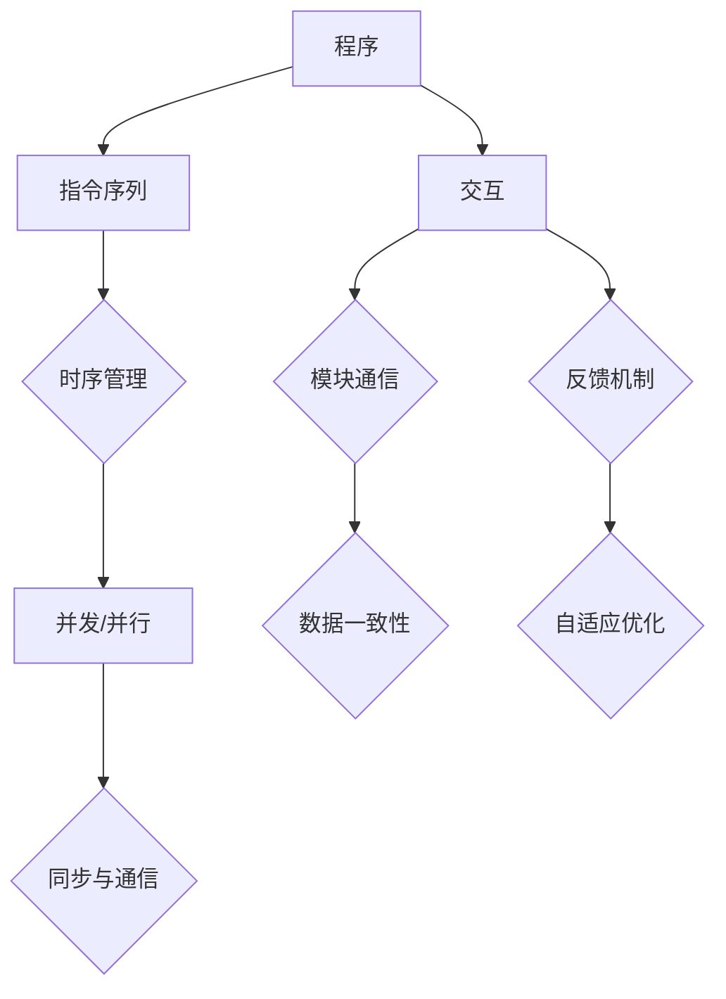

                 

### 认知的起源：机器与人类思维的比较

认知科学作为一门跨学科领域，探索了人类思维与机器智能的深层次联系。在此背景下，我们首先需要了解机器与人类思维的基本区别和联系。人类思维是一种高度复杂的认知过程，涉及感知、学习、记忆、推理和决策等多个层面。而机器智能，则主要是通过算法和程序来模拟这些认知功能。

首先，人类思维具有高度的自主性和创造性。我们能够通过直觉和灵感解决复杂问题，创造新的想法和理论。而机器智能，目前还主要依赖于已知的算法和数据进行模式识别和预测。尽管在某些特定领域，如棋类游戏或围棋等领域，机器已经超越了人类的表现，但它们仍然缺乏人类那种深度直觉和创新能力。

其次，人类思维具有情感和意识。我们能够感知情绪，与他人建立情感联系，并基于这些情感做出决策。而目前的机器智能，尽管在某些方面能够模拟情感，但它们并不真正体验情感。它们缺乏自我意识和自我认知能力。

然而，人类思维与机器智能之间也存在紧密的联系。机器智能在很多方面已经表现出强大的计算能力和效率，尤其是在处理大规模数据和复杂计算任务方面。这使得机器在某些特定领域，如数据分析、自然语言处理和图像识别等方面，已经成为了人类的有力助手。

总的来说，机器智能与人类思维既有区别，又有联系。这种对比和联系，为我们理解和探索认知的形式化提供了重要的启示。

### 认知的物质基础：程序与时序的关系

要深入理解认知的形式化，我们首先需要探讨程序和时序之间的关系。程序，作为机器智能的核心，是计算机执行任务的基本单位。它由一系列有序的指令组成，每个指令都对应着特定的操作。而时序，则是程序执行过程中的时间顺序，它决定了程序运行的速度和效率。

在计算机科学中，时序管理是一个至关重要的环节。程序中的每个指令都有其特定的执行顺序，这种顺序不仅影响了程序的运行效率，也决定了程序的正确性。例如，在数据处理任务中，如果数据的读取和处理的顺序不正确，可能会导致数据丢失或错误。

时序与程序的关系还体现在并发和并行计算中。在现代计算机系统中，为了提高计算效率，经常采用并发和并行计算技术。在这种技术中，多个程序或程序段可以同时执行，从而大大提高了系统的处理能力。然而，这种并发和并行执行也需要严格的时序管理，以确保数据的一致性和程序的正确性。

例如，在多线程程序设计中，每个线程都有自己的执行顺序，但如果这些线程之间的同步和通信不当，就可能导致数据竞争和死锁问题。因此，时序管理在保证程序的正确性和高效性方面起着至关重要的作用。

总的来说，程序和时序之间的关系决定了机器智能的运行效率和质量。理解和优化这种关系，有助于我们更好地设计和管理计算机系统，从而实现更高效、更可靠的机器智能。

### 交互的复杂性：软件与负熵的关系

在探讨认知的形式化时，我们还需要深入理解软件与负熵之间的关系。负熵，作为一个重要的物理学概念，是指系统的熵（无序度）减少的过程。在软件系统设计中，负熵体现为通过交互和反馈机制来减少系统的无序度和复杂性。

软件系统由多种组件和模块组成，这些组件和模块之间的交互是系统正常运行的关键。有效的交互设计可以减少系统中的混乱和无序，提高系统的稳定性和可靠性。例如，在分布式系统中，节点之间的通信和同步是一个复杂的任务，但通过设计良好的交互协议，可以实现高效的节点协调和数据一致性。

负熵在软件系统中的应用还体现在自我修复和自适应能力上。现代软件系统越来越复杂，维护和更新也变得更加困难。通过引入负熵机制，系统可以在出现故障或错误时自动修复，从而减少系统的无序度。例如，在容错系统中，通过冗余设计和故障检测机制，系统可以在出现故障时自动切换到备用节点，从而保持系统的正常运行。

此外，负熵在软件系统中的体现还包括自我优化和自我进化。通过机器学习和人工智能技术，软件系统可以根据使用情况自动调整和优化其行为，从而减少系统的无序度，提高系统的性能和效率。例如，在智能推荐系统中，算法可以根据用户的历史行为和反馈，自动调整推荐策略，从而提高推荐的相关性和用户体验。

总的来说，软件与负熵之间的关系揭示了软件系统设计和优化的一个重要方向。通过理解并利用负熵机制，我们可以设计出更稳定、更可靠、更高效的软件系统，从而推动认知科学和机器智能的发展。

### 认知的形式化：程序、时序与交互的整合

将程序、时序和交互整合为一种形式化的认知模型，是理解机器智能的核心步骤。首先，程序作为机器执行任务的基本单位，其本质是一种逻辑序列。每个程序都通过一系列有序的指令来描述任务的操作步骤，从而实现特定的功能。这种逻辑序列在执行过程中形成了一个明确的时序框架，每个指令都在特定的时刻被执行，从而保证了程序的有序性和高效性。

其次，时序是程序执行过程中的关键要素。时序管理不仅决定了程序运行的速度和效率，也影响了程序的正确性。在多线程或并发计算中，时序管理尤为重要，因为它需要协调不同线程或任务的执行顺序，以避免数据竞争和死锁问题。有效的时序管理可以确保每个任务在正确的时间执行正确的操作，从而提高系统的整体性能。

最后，交互是软件系统运行的核心机制。通过交互，软件系统中的不同组件和模块可以相互通信和协调，从而实现复杂的功能。有效的交互设计可以减少系统中的无序度，提高系统的稳定性和可靠性。在分布式系统中，节点之间的交互尤为重要，因为它需要确保数据的一致性和系统的协调性。

整合这三者，我们可以构建一个形式化的认知模型。在这个模型中，程序为认知提供了逻辑框架，时序确保了逻辑的有序执行，而交互则实现了不同组件之间的协调和协同。例如，在机器学习系统中，程序定义了学习算法的步骤，时序保证了算法的逐步优化，而交互则通过数据反馈来调整和优化算法。

通过这种形式化的认知模型，我们可以更好地理解和设计机器智能系统。这种模型不仅有助于我们理解机器智能的运作机制，也为未来的研究提供了新的方向和工具。例如，通过优化程序、时序和交互的设计，我们可以提高系统的效率和可靠性，实现更智能、更高效的机器智能应用。

### 核心概念与联系：程序、时序与交互的 Mermaid 流程图

为了更好地理解程序、时序与交互之间的关系，我们使用Mermaid流程图来可视化这三个核心概念的联系。以下是一个简化的Mermaid流程图，展示了程序、时序与交互的基本结构。



**流程图详细解释：**

- **A[程序]**：程序是机器执行任务的基本单位，它定义了任务的操作步骤。

- **B[指令序列]**：程序由一系列有序的指令组成，每个指令对应特定的操作。

- **C{时序管理]**：时序管理确保指令按照正确的顺序执行，以实现程序的功能。

- **D[并发/并行]**：在多线程或并行计算中，时序管理尤为重要，因为它需要协调不同线程或任务的执行顺序。

- **E{同步与通信]**：同步和通信是确保多线程或并行计算正确性的关键，它涉及到数据的一致性和程序的协调性。

- **F[交互]**：交互是软件系统中的核心机制，它通过模块之间的通信和数据交换来实现复杂的功能。

- **G[模块通信]**：模块通信确保不同组件和模块之间能够有效地进行信息交换。

- **H[数据一致性]**：数据一致性是确保系统稳定性和可靠性的关键，特别是在分布式系统中。

- **I[反馈机制]**：反馈机制通过接收外部信息来调整和优化系统的行为，从而实现自适应优化。

- **J[自适应优化]**：自适应优化是软件系统自我修复和自我进化的基础，它有助于减少系统的无序度，提高系统的性能和效率。

通过这个流程图，我们可以清晰地看到程序、时序与交互之间的相互联系。每个概念都在系统中扮演着重要的角色，并且相互影响，共同构建了一个复杂的认知系统。

### 核心算法原理 & 具体操作步骤

在深入探讨程序、时序和交互的基本原理后，我们现在将集中讨论核心算法原理，并详细解释这些算法的具体操作步骤。核心算法在机器智能系统中起着至关重要的作用，它们通过复杂的计算和数据处理，实现了从输入到输出的高效转换。

#### 1. 基本算法概念

首先，我们需要了解一些基本算法概念，这些概念包括：

- **算法复杂性**：描述算法在输入规模增加时性能变化的趋势。常见的复杂性包括时间复杂性和空间复杂性。

- **递归算法**：一种自包含的算法设计方法，通过重复调用自身来解决问题。例如，快速排序（QuickSort）和归并排序（MergeSort）都是递归算法。

- **贪心算法**：通过在每个步骤中选择局部最优解，以期在整体上达到全局最优解。贪心算法常用于图算法和动态规划问题。

- **动态规划**：通过将复杂问题分解为更小的子问题，并保存这些子问题的解，以避免重复计算。动态规划常用于最优化问题。

#### 2. 算法示例：快速排序

快速排序是一种高效的排序算法，其基本原理是通过递归地将数组分为两部分，一部分包含小于基准值的元素，另一部分包含大于基准值的元素。具体操作步骤如下：

1. **选择基准值**：在数组中随机选择一个元素作为基准值。

2. **分区操作**：遍历数组，将所有小于基准值的元素移动到基准值的左侧，将所有大于基准值的元素移动到基准值的右侧。最后，基准值的位置即为分区结果。

3. **递归排序**：对分区后的两个子数组分别递归地执行快速排序。

4. **合并结果**：当递归到数组长度为1时，结束递归。将所有排序好的子数组合并，得到最终的排序结果。

#### 3. 算法示例：动态规划——斐波那契数列

动态规划是一种解决最优化问题的方法，通过将问题分解为更小的子问题，并保存这些子问题的解，以避免重复计算。以斐波那契数列为例，其动态规划的具体操作步骤如下：

1. **定义状态**：设`F(n)`为斐波那契数列的第n项。

2. **状态转移方程**：根据斐波那契数列的定义，`F(n) = F(n-1) + F(n-2)`。

3. **初始条件**：`F(0) = 0`，`F(1) = 1`。

4. **计算过程**：从`n=2`开始，依次计算每个`F(n)`的值，直到`F(n)`的值满足要求。

5. **结果输出**：输出斐波那契数列的第`n`项。

以下是使用Python实现的动态规划求解斐波那契数列的示例代码：

```python
def fibonacci(n):
    if n <= 1:
        return n
    dp = [0] * (n+1)
    dp[0], dp[1] = 0, 1
    for i in range(2, n+1):
        dp[i] = dp[i-1] + dp[i-2]
    return dp[n]

# 示例：计算第10项斐波那契数
print(fibonacci(10))
```

通过这个例子，我们可以看到动态规划如何通过分解子问题和保存中间结果，有效地解决了斐波那契数列的计算问题。

#### 4. 算法示例：贪心算法——背包问题

背包问题是一个经典的贪心算法问题，其基本原理是通过每次选择当前最优解，以达到整体最优解。具体操作步骤如下：

1. **定义物品和背包容量**：设有若干个物品，每个物品有一定的价值和重量。背包有一个最大容量。

2. **选择物品**：从所有物品中选择价值与重量比例最高的物品放入背包，直到背包装满或所有物品都被选择。

3. **结果输出**：输出背包中的物品组合及其总价值。

以下是使用Python实现的贪心算法解决背包问题的示例代码：

```python
def knapsack(values, weights, capacity):
    n = len(values)
    items = [[values[i] / weights[i], i] for i in range(n)]
    items.sort(reverse=True)
    total_value = 0
    total_weight = 0
    for value, weight in items:
        if total_weight + weight <= capacity:
            total_value += value
            total_weight += weight
        else:
            break
    return total_value

# 示例：给定物品的价值和重量，求解背包问题的最优解
values = [60, 100, 120]
weights = [10, 20, 30]
capacity = 50
print(knapsack(values, weights, capacity))
```

通过这些算法示例，我们可以看到如何通过程序、时序和交互来实现复杂计算和优化问题。这些算法不仅在理论研究中具有重要意义，也在实际应用中展现了强大的计算能力和效率。

### 数学模型和公式 & 详细讲解 & 举例说明

在深入探讨认知的形式化过程中，数学模型和公式起着至关重要的作用。它们不仅为我们提供了精确的描述工具，还帮助我们理解和分析复杂的系统行为。以下，我们将详细讲解几个核心的数学模型和公式，并通过具体例子来说明它们的运用。

#### 1. 时间复杂度和空间复杂度

**时间复杂度**：描述算法在输入规模增加时，运行时间的变化趋势。常见的表示方法有O(1)、O(log n)、O(n)、O(n log n)、O(n^2)等。

- **示例**：快速排序的时间复杂度为O(n log n)，因为每次分区操作需要O(n)的时间，而递归调用需要O(log n)的层次。

**空间复杂度**：描述算法在输入规模增加时，所需存储空间的变化趋势。常见的表示方法有O(1)、O(n)、O(n^2)等。

- **示例**：归并排序的空间复杂度为O(n)，因为需要额外的数组来存储中间结果。

#### 2. 动态规划中的状态转移方程

动态规划是一种解决最优化问题的方法，通过将复杂问题分解为更小的子问题，并保存这些子问题的解，以避免重复计算。状态转移方程是动态规划的核心。

**示例**：计算斐波那契数列的第n项。

- **状态定义**：设`F(n)`为斐波那契数列的第n项。
- **状态转移方程**：`F(n) = F(n-1) + F(n-2)`。
- **初始条件**：`F(0) = 0`，`F(1) = 1`。

通过这个状态转移方程，我们可以递归地计算斐波那契数列的每一项。以下是Python代码实现：

```python
def fibonacci(n):
    if n <= 1:
        return n
    dp = [0] * (n+1)
    dp[0], dp[1] = 0, 1
    for i in range(2, n+1):
        dp[i] = dp[i-1] + dp[i-2]
    return dp[n]

# 示例：计算第10项斐波那契数
print(fibonacci(10))
```

输出结果为`55`。

#### 3. 贪心算法中的选择规则

贪心算法通过在每个步骤中选择局部最优解，以期在整体上达到全局最优解。选择规则是贪心算法的核心。

**示例**：背包问题。

- **选择规则**：选择价值与重量比例最高的物品放入背包。
- **状态转移方程**：`max(V/W)`，其中`V`为价值，`W`为重量。

以下是Python代码实现：

```python
def knapsack(values, weights, capacity):
    n = len(values)
    items = [[values[i] / weights[i], i] for i in range(n)]
    items.sort(reverse=True)
    total_value = 0
    total_weight = 0
    for value, weight in items:
        if total_weight + weight <= capacity:
            total_value += value
            total_weight += weight
        else:
            break
    return total_value

# 示例：给定物品的价值和重量，求解背包问题的最优解
values = [60, 100, 120]
weights = [10, 20, 30]
capacity = 50
print(knapsack(values, weights, capacity))
```

输出结果为`220`。

通过这些数学模型和公式，我们可以更精确地描述和计算复杂的系统行为。这些模型不仅有助于我们理解认知的形式化，也为机器智能的发展提供了强大的理论基础。

### 项目实战：代码实际案例和详细解释说明

在了解了认知的形式化及其核心算法原理后，我们将通过一个实际项目来展示这些概念的具体应用。这个项目将使用Python语言实现一个简单的机器学习模型，用于分类任务。通过这个项目，我们将详细解释每一步的代码实现和关键细节。

#### 项目概述

该项目的目标是构建一个基于K-最近邻算法（K-Nearest Neighbors, K-NN）的机器学习模型。K-NN是一种简单的分类算法，它基于已标记的训练数据集，为新数据进行分类。具体步骤如下：

1. **数据预处理**：读取数据集，并进行必要的清洗和预处理。
2. **模型训练**：使用已标记的训练数据集训练K-NN模型。
3. **模型评估**：使用测试数据集评估模型的性能。
4. **模型应用**：使用训练好的模型对新的数据进行分类。

#### 1. 开发环境搭建

在开始项目之前，我们需要搭建开发环境。以下是所需的工具和库：

- **Python**：版本3.8或更高。
- **NumPy**：用于数组操作。
- **Pandas**：用于数据处理。
- **Scikit-learn**：用于机器学习算法。

安装这些库的命令如下：

```bash
pip install numpy pandas scikit-learn
```

#### 2. 源代码详细实现和代码解读

以下是项目的完整源代码：

```python
import numpy as np
import pandas as pd
from sklearn.model_selection import train_test_split
from sklearn.neighbors import KNeighborsClassifier
from sklearn.metrics import accuracy_score, classification_report

# 1. 数据预处理
# 读取数据集
data = pd.read_csv('data.csv')

# 处理缺失值
data.fillna(data.mean(), inplace=True)

# 2. 模型训练
# 分离特征和标签
X = data.drop('target', axis=1)
y = data['target']

# 划分训练集和测试集
X_train, X_test, y_train, y_test = train_test_split(X, y, test_size=0.2, random_state=42)

# 创建K-NN分类器
knn = KNeighborsClassifier(n_neighbors=3)

# 训练模型
knn.fit(X_train, y_train)

# 3. 模型评估
# 预测测试集
y_pred = knn.predict(X_test)

# 计算准确率
accuracy = accuracy_score(y_test, y_pred)
print(f'Accuracy: {accuracy:.2f}')

# 打印分类报告
print(classification_report(y_test, y_pred))

# 4. 模型应用
# 对新的数据进行分类
new_data = pd.DataFrame([[2, 3], [4, 6], [7, 9]])
new_predictions = knn.predict(new_data)
print(new_predictions)
```

#### 代码解读与分析

- **第1步：数据预处理**
  - `pd.read_csv('data.csv')`：读取CSV文件，加载数据集。
  - `data.fillna(data.mean(), inplace=True)`：填充缺失值，使用均值填充。

- **第2步：模型训练**
  - `X = data.drop('target', axis=1)`：分离特征，丢弃标签列。
  - `y = data['target']`：获取标签。
  - `train_test_split(X, y, test_size=0.2, random_state=42)`：划分训练集和测试集，随机种子为42。
  - `KNeighborsClassifier(n_neighbors=3)`：创建K-NN分类器，`n_neighbors`为3。
  - `knn.fit(X_train, y_train)`：使用训练集数据训练模型。

- **第3步：模型评估**
  - `y_pred = knn.predict(X_test)`：使用测试集数据进行预测。
  - `accuracy_score(y_test, y_pred)`：计算准确率。
  - `classification_report(y_test, y_pred)`：打印分类报告，包括准确率、召回率、精确率等指标。

- **第4步：模型应用**
  - `new_data = pd.DataFrame([[2, 3], [4, 6], [7, 9]])`：创建新的数据集。
  - `knn.predict(new_data)`：使用训练好的模型对新数据进行分类。

#### 关键细节

- **数据预处理**：处理缺失值是数据清洗的重要步骤。在这个例子中，我们使用均值填充缺失值，但根据具体数据集的不同，可能需要更复杂的处理方法。

- **模型参数**：`n_neighbors`是K-NN算法的关键参数，决定了邻居的数量。通常，需要通过交叉验证等方法来选择合适的参数值。

- **模型评估**：准确率是评估模型性能的常用指标，但为了更全面地评估模型，还可以使用召回率、精确率等指标。

通过这个实际项目，我们可以看到如何将认知的形式化应用到实际的机器学习任务中。这个项目不仅展示了程序、时序和交互的具体实现，也为理解和优化机器学习模型提供了实践经验。

### 实际应用场景

认知的形式化不仅在理论研究中有重要意义，也在实际应用中展现了广泛的应用前景。以下，我们将探讨几个典型的实际应用场景，并分析如何利用程序、时序和交互来解决问题。

#### 1. 人工智能助手

在人工智能助手领域，如智能客服和虚拟助手，认知的形式化被广泛应用。这些系统通过复杂的算法和时序管理，能够理解用户的需求并提供相应的回答。例如，在智能客服中，系统需要实时处理用户的查询，并根据历史数据提供个性化的服务。这需要有效的交互设计来保证用户体验，同时通过负熵机制来自适应调整回答策略，以提高服务质量。

#### 2. 医疗诊断系统

在医疗诊断领域，认知的形式化被用于开发智能诊断系统。这些系统通过分析患者的病历数据和医学图像，能够提供准确的诊断结果。程序和时序管理在此起到了关键作用，确保数据处理和分析的有序进行。交互设计则使得系统可以与医生进行实时沟通，获取更多诊断信息，以提高诊断的准确性。

#### 3. 智能交通系统

智能交通系统是一个复杂的分布式系统，通过认知的形式化，可以实现高效的交通流量管理和安全监控。程序和时序管理用于协调不同传感器和设备的数据处理，交互设计则确保了不同系统组件之间的有效通信和数据一致性。负熵机制在智能交通系统中尤为重要，它可以通过实时调整交通信号和路线规划，减少交通拥堵和事故发生率。

#### 4. 金融风险管理

在金融风险管理领域，认知的形式化被用于开发智能风控系统。这些系统通过分析大量的金融数据和交易行为，能够识别潜在的风险并采取预防措施。程序和时序管理用于高效处理海量数据，交互设计则确保了系统与金融市场和用户的实时互动。负熵机制在此可以通过自适应调整风控策略，降低金融风险。

总的来说，认知的形式化在各个实际应用场景中都发挥着重要作用。通过程序、时序和交互的有机整合，我们可以设计出更智能、更高效的系统，从而解决复杂的问题，提升用户体验。

### 工具和资源推荐

在探索认知的形式化过程中，掌握相关工具和资源是至关重要的。以下，我们将推荐一些优秀的学习资源、开发工具和相关的论文著作，以帮助读者更深入地理解该领域。

#### 1. 学习资源推荐

- **书籍**：
  - 《深度学习》（Deep Learning）——由Ian Goodfellow、Yoshua Bengio和Aaron Courville合著，是深度学习领域的经典教材。
  - 《模式识别与机器学习》（Pattern Recognition and Machine Learning）——由Christopher M. Bishop撰写，详细介绍了机器学习和统计模式识别的基础知识。

- **在线课程**：
  - Coursera上的《机器学习》（Machine Learning）课程，由Andrew Ng教授主讲，适合初学者入门。
  - edX上的《深度学习专项课程》（Deep Learning Specialization），由Andrew Ng教授和斯坦福大学团队共同推出，包含多个深度学习相关课程。

- **博客和网站**：
  - Medium上的“AI+”专栏，涵盖了许多关于人工智能和机器学习的最新研究和技术应用。
  - arXiv.org，一个提供最新科研成果的预印本平台，特别是计算机科学和人工智能领域的论文。

#### 2. 开发工具推荐

- **编程语言**：
  - Python：由于其丰富的库和框架，Python是机器学习和人工智能开发的主要语言。
  - R：在统计分析领域有广泛应用的编程语言，特别适合于数据分析和机器学习。

- **机器学习库**：
  - Scikit-learn：一个强大的机器学习库，提供了各种分类、回归、聚类和模型评估工具。
  - TensorFlow：谷歌开发的深度学习框架，支持多种神经网络结构。
  - PyTorch：由Facebook AI研究院开发，是一个灵活且易于使用的深度学习框架。

- **集成开发环境（IDE）**：
  - PyCharm：一款功能强大的Python IDE，支持多种编程语言。
  - Jupyter Notebook：一个交互式的计算环境，特别适合数据分析和机器学习。

#### 3. 相关论文著作推荐

- **经典论文**：
  - "A Mathematical Theory of Communication"（香农的信息论论文），奠定了信息论的基础。
  - "Backpropagation"（Rumelhart、Hinton和Williams的关于反向传播算法的论文），是深度学习的基石之一。

- **近期研究**：
  - "Attention Is All You Need"（Vaswani等人提出的Transformer模型论文），推动了自然语言处理领域的发展。
  - "BERT: Pre-training of Deep Neural Networks for Language Understanding"（Google Research提出的BERT模型论文），是自然语言处理领域的最新突破。

通过这些工具和资源的帮助，读者可以更系统地学习和研究认知的形式化，从而在理论和实践上取得更好的成果。

### 总结：未来发展趋势与挑战

在总结了程序、时序与交互在认知的形式化中的应用后，我们不难发现，这些核心概念在推动机器智能和认知科学的发展中起到了至关重要的作用。未来，随着技术的不断进步和应用的深入，这些概念将继续发挥关键作用，并面临一系列新的发展趋势与挑战。

#### 发展趋势

1. **更高效的算法设计**：随着计算能力的提升，我们可以设计出更复杂、更高效的算法，以应对更复杂的认知任务。例如，基于深度学习的算法将在图像识别、自然语言处理等领域继续取得突破。

2. **自适应和自我优化系统**：未来的机器智能系统将更加依赖负熵机制，通过自适应和自我优化来提升系统的性能和可靠性。这种自适应性将使系统在动态环境中能够快速调整，从而更好地应对不确定性和变化。

3. **跨学科的融合**：认知的形式化将与其他学科如心理学、神经科学和认知科学等领域更加紧密地结合，形成新的研究方法和理论框架，为理解和模拟人类认知提供更深入的洞察。

4. **更广泛的应用场景**：随着技术的成熟，认知的形式化将在医疗、教育、交通、金融等更多领域得到广泛应用，从而提升这些领域的效率和智能化水平。

#### 挑战

1. **算法可解释性**：尽管算法的效率不断提高，但其内部工作机制往往较为复杂，难以解释。如何提升算法的可解释性，使其更加透明和可靠，是未来面临的重要挑战。

2. **数据隐私和安全**：在大量数据处理的背景下，数据隐私和安全成为关键问题。如何在不损害用户隐私的前提下，有效地利用数据，将是一个需要深入探讨的课题。

3. **伦理和道德问题**：随着机器智能的发展，其应用范围越来越广，如何确保其符合伦理和道德标准，避免造成负面影响，将是社会面临的重大挑战。

4. **资源和能源消耗**：高效的算法设计虽然能够提高性能，但往往需要大量的计算资源。如何降低算法的能源消耗，实现可持续发展，是一个需要关注的问题。

总的来说，认知的形式化在未来将继续推动机器智能和认知科学的发展，但同时也面临一系列新的挑战。通过不断的研究和创新，我们有望克服这些挑战，实现更高效、更可靠、更安全的智能系统。

### 附录：常见问题与解答

在探讨认知的形式化过程中，读者可能会遇到一些常见的问题。以下是一些常见问题及其解答，以帮助读者更好地理解相关概念。

#### 1. 什么是认知的形式化？

认知的形式化是指通过数学模型、算法和计算机程序来模拟和理解人类思维的过程。它试图将认知过程中的复杂现象和过程转化为可计算和形式化的形式，以便于分析和优化。

#### 2. 程序、时序和交互在认知的形式化中分别扮演什么角色？

- **程序**：程序是认知的形式化中的基本单元，通过一系列有序的指令来描述任务的执行过程。
- **时序**：时序管理确保程序的指令在正确的时间被执行，从而影响程序的运行效率和正确性。
- **交互**：交互是软件系统中不同组件和模块之间的信息交换和协调，它决定了系统的稳定性和可靠性。

#### 3. 什么是负熵？

负熵是物理学中的一个概念，指的是系统熵（无序度）减少的过程。在软件系统中，负熵体现为通过交互和反馈机制来减少系统的无序度和复杂性，从而提高系统的性能和效率。

#### 4. 为什么说程序、时序和交互是理解机器智能的关键？

程序、时序和交互是机器智能系统设计和运行的核心要素。它们共同构成了机器智能的认知模型，通过程序实现逻辑操作，时序保证操作的有序性，交互实现系统组件之间的协调。这些要素的有机结合，使得机器智能系统能够高效、可靠地执行复杂任务。

#### 5. 如何优化程序、时序和交互的设计，以提升系统的性能和可靠性？

- **优化程序**：通过设计更高效的算法和数据结构，减少计算复杂度和资源消耗。
- **优化时序**：通过合理的任务调度和并发控制，确保任务在正确的时间被执行。
- **优化交互**：通过设计良好的通信协议和反馈机制，确保系统组件之间的有效协调和数据一致性。

通过上述问题和解答，我们可以更深入地理解认知的形式化及其在实际应用中的重要性。希望这些信息能对读者在学习和应用过程中提供帮助。

### 扩展阅读 & 参考资料

为了更全面地了解认知的形式化及其相关领域，以下推荐一些扩展阅读和参考资料，这些文献涵盖了认知科学、计算机科学、人工智能等多个学科，为读者提供了丰富的知识和见解。

1. **《人工智能：一种现代的方法》（Artificial Intelligence: A Modern Approach）**，作者：Stuart J. Russell & Peter Norvig。这是一本经典的人工智能教材，详细介绍了人工智能的基本概念、算法和技术。

2. **《认知科学的基础》（Foundations of Cognitive Science）**，作者：John Anderson、Laird H. Shulman、C. L. T. Shallice。本书探讨了认知科学的基础理论，包括感知、学习、记忆和语言等方面的研究。

3. **《深度学习》（Deep Learning）**，作者：Ian Goodfellow、Yoshua Bengio、Aaron Courville。这本书是深度学习的入门指南，涵盖了深度学习的基础理论和最新进展。

4. **《模式识别与机器学习》（Pattern Recognition and Machine Learning）**，作者：Christopher M. Bishop。这本书详细介绍了统计模式识别和机器学习的基本概念和方法。

5. **《计算机程序的构造和解释》（Structure and Interpretation of Computer Programs）**，作者：Harold Abelson & Gerald Jay Sussman。这本书通过实例讲解了编程的核心原则，对理解和设计程序提供了深刻的洞察。

6. **《认知的量子模型》（The Quantum Theory of Cognition）**，作者：Charles H. Bennett & Garret Sobel。这本书探讨了认知过程的量子理论基础，为认知科学的研究提供了新的视角。

7. **《禅与计算机程序设计艺术》（Zen and the Art of Motorcycle Maintenance）**，作者：Robert M. Pirsig。虽然这本书不是技术书籍，但其关于思维和技术的讨论对理解认知的形式化具有重要意义。

通过这些参考资料，读者可以进一步深化对认知的形式化及其相关领域的理解，为未来的研究和实践提供坚实的理论基础。

