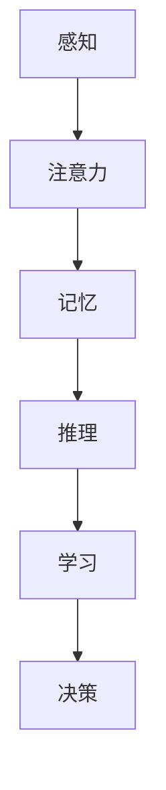

                 

# 认知科学与人工智能：模拟人类思维

## 摘要

本文将探讨认知科学与人工智能之间的紧密联系，以及如何通过模拟人类思维来实现人工智能的突破。我们将从背景介绍开始，详细阐述核心概念与联系，分析核心算法原理和具体操作步骤，讲解数学模型和公式，并通过实际项目实战来展示代码实现和解读。此外，本文还将探讨人工智能在实际应用场景中的表现，推荐相关工具和资源，总结未来发展趋势与挑战，并提供常见问题与解答。通过本文的阅读，读者将对认知科学与人工智能的融合有更深入的了解。

## 1. 背景介绍

认知科学是一门跨学科的研究领域，它关注人类思维、感知、记忆和学习等认知过程。认知科学的研究目标是通过理解人类大脑的运作机制，揭示认知过程的原理和规律，从而为人工智能的发展提供理论依据和技术支持。

人工智能（Artificial Intelligence，简称AI）是一门旨在模拟人类智能的技术科学。人工智能的目标是通过计算机程序实现智能体的自主思考、学习、推理和决策能力，从而解决复杂问题，提供智能服务。

认知科学与人工智能之间的联系日益紧密。认知科学的研究成果为人工智能提供了丰富的理论资源，而人工智能的发展又为认知科学提供了实验和验证的平台。通过模拟人类思维，人工智能试图实现与人类相似的认知能力，从而推动人工智能技术的进步。

本文将重点关注如何通过模拟人类思维来实现人工智能。我们将从核心概念出发，详细分析认知过程的基本原理，探讨如何将认知科学的理论应用于人工智能算法的设计和实现。

## 2. 核心概念与联系

### 2.1 认知过程的框架

认知过程包括感知、注意力、记忆、推理、学习和决策等多个环节。为了更好地理解这些环节之间的联系，我们可以使用Mermaid流程图来展示它们的基本框架。



在这个框架中，感知是认知过程的起点，通过感知，个体获取外部环境的信息。注意力则负责选择和处理重要的信息，为记忆提供输入。记忆是认知过程的核心，它存储和处理信息，为推理和学习提供基础。推理是基于已有信息进行逻辑推理和问题解决的过程，学习是通过经验积累和知识更新来提高认知能力，决策则是在特定情境下选择最佳行动方案。

### 2.2 认知科学与人工智能的关系

认知科学为人工智能提供了重要的理论支持。通过研究人类认知过程，我们可以发现认知机制的本质和规律，这些规律可以指导人工智能算法的设计。例如，感知过程的模型可以应用于计算机视觉，注意力机制的模型可以应用于自然语言处理，记忆机制的模型可以应用于知识表示和推理。

另一方面，人工智能的发展也为认知科学提供了新的研究工具和技术。通过实现认知过程的模拟，我们可以验证认知科学的假设，探索认知机制的工作原理。同时，人工智能的算法和模型也为认知科学提供了新的研究方向和思路。

### 2.3 认知科学的核心概念原理

#### 2.3.1 感知

感知是指个体通过感官接收外部信息的过程。感知过程可以分为多个层次，包括感觉、知觉和认知。感觉是感知的低级阶段，通过感官接收外界刺激并转化为神经信号。知觉则是感知的高级阶段，通过整合和分析感觉信息，形成对环境的整体认识。认知则是对知觉信息的处理和解释，从而产生对环境的理解。

在人工智能中，感知过程可以通过计算机视觉和听觉系统来实现。计算机视觉的目标是让计算机理解和解释图像和视频，而听觉系统则是让计算机理解和解释语音。

#### 2.3.2 注意力

注意力是指个体在特定任务中选择和处理信息的心理过程。注意力机制可以帮助个体在复杂环境中聚焦关键信息，提高认知效率。注意力机制可以分为集中注意力和分散注意力，前者关注特定信息，而后者关注整体环境。

在人工智能中，注意力机制可以应用于多种任务，如自然语言处理、图像识别和语音识别。通过调整注意力的分配，可以优化模型的性能和效果。

#### 2.3.3 记忆

记忆是指个体将信息存储在脑中，并在需要时提取和利用的过程。记忆可以分为短期记忆和长期记忆，短期记忆负责存储和处理临时信息，而长期记忆则负责存储持久的信息。

在人工智能中，记忆机制可以通过知识图谱和记忆网络来实现。知识图谱用于存储和表示知识，而记忆网络则用于记忆和检索信息。

#### 2.3.4 推理

推理是指基于已有信息进行逻辑推理和问题解决的过程。推理可以分为演绎推理和归纳推理，前者基于已知的前提得出结论，而后者则从具体实例中归纳出一般规律。

在人工智能中，推理机制可以应用于决策支持系统、逻辑推理和知识表示。通过推理，人工智能可以解决复杂问题，提供智能服务。

#### 2.3.5 学习

学习是指个体通过经验积累和知识更新来提高认知能力的过程。学习可以分为有监督学习、无监督学习和强化学习，分别适用于不同类型的任务和数据。

在人工智能中，学习机制是实现智能化的关键。通过学习，人工智能可以自动获取知识和技能，提高任务执行能力。

#### 2.3.6 决策

决策是指个体在特定情境下选择最佳行动方案的过程。决策过程涉及多个因素，包括目标、约束和不确定性。

在人工智能中，决策机制可以应用于智能代理、游戏人工智能和自动驾驶等领域。通过决策，人工智能可以自主地执行任务，应对复杂环境。

### 2.4 Mermaid流程图展示

为了更清晰地展示认知科学的核心概念原理和架构，我们可以使用Mermaid流程图来表示它们之间的联系。

```mermaid
graph TD
    A[感知] --> B[注意力]
    B --> C[记忆]
    C --> D[推理]
    D --> E[学习]
    E --> F[决策]
    B parallel B1[集中注意力] B2[分散注意力]
    C parallel C1[短期记忆] C2[长期记忆]
    D parallel D1[演绎推理] D2[归纳推理]
    E parallel E1[有监督学习] E2[无监督学习] E3[强化学习]
    F --> G[目标]
    F --> H[约束]
    F --> I[不确定性]
```

在这个流程图中，感知、注意力、记忆、推理、学习和决策构成了认知科学的核心概念原理。注意力机制可以分为集中注意力和分散注意力，记忆可以分为短期记忆和长期记忆，推理可以分为演绎推理和归纳推理，学习可以分为有监督学习、无监督学习和强化学习，决策则涉及目标、约束和不确定性。

## 3. 核心算法原理 & 具体操作步骤

### 3.1 感知算法原理

感知算法是认知科学的核心组成部分，主要负责接收和处理外部信息。在人工智能中，感知算法通常基于计算机视觉和听觉系统。以下是感知算法的基本原理和操作步骤：

#### 3.1.1 计算机视觉算法

计算机视觉算法的核心是图像处理和特征提取。具体操作步骤如下：

1. **图像预处理**：对输入图像进行去噪、增强和归一化处理，以提高图像质量。
2. **特征提取**：从预处理后的图像中提取具有区分度的特征，如边缘、纹理和颜色等。
3. **特征匹配**：将提取的特征与已知模式进行匹配，以识别图像中的对象和场景。
4. **图像分类**：根据匹配结果对图像进行分类，实现图像识别。

#### 3.1.2 听觉算法

听觉算法主要负责处理和分析语音信号。具体操作步骤如下：

1. **语音预处理**：对输入语音信号进行去噪、增强和归一化处理，以提高语音质量。
2. **特征提取**：从预处理后的语音信号中提取具有区分度的特征，如音高、音强和音色等。
3. **声学模型训练**：使用大量语音数据训练声学模型，以识别语音中的音素和词汇。
4. **语言模型训练**：使用大量文本数据训练语言模型，以理解语音中的语义信息。

### 3.2 注意力算法原理

注意力算法在认知过程中起着关键作用，它能够帮助个体在复杂环境中聚焦关键信息。在人工智能中，注意力算法广泛应用于自然语言处理、图像识别和语音识别等领域。以下是注意力算法的基本原理和操作步骤：

#### 3.2.1 自注意力机制

自注意力机制（Self-Attention Mechanism）是一种基于Transformer模型的核心机制，它能够在序列数据中自适应地分配注意力权重。具体操作步骤如下：

1. **计算query、key和value**：对于输入序列中的每个元素，分别计算query、key和value向量。
2. **计算注意力权重**：使用query和key之间的点积计算注意力权重，并将权重应用于value向量。
3. **聚合注意力结果**：将加权后的value向量进行聚合，得到最终的注意力输出。

#### 3.2.2 交互注意力机制

交互注意力机制（Interactive Attention Mechanism）是一种在多个输入序列之间分配注意力权重的机制，它能够捕捉不同序列之间的交互关系。具体操作步骤如下：

1. **计算交互注意力权重**：对于每个输入序列，计算与其他序列之间的交互注意力权重。
2. **计算交互注意力输出**：将交互注意力权重应用于其他序列的输出，得到交互注意力结果。
3. **聚合交互注意力结果**：将交互注意力结果进行聚合，得到最终的注意力输出。

### 3.3 记忆算法原理

记忆算法在认知过程中负责存储和检索信息。在人工智能中，记忆算法广泛应用于知识表示、推理和记忆网络等领域。以下是记忆算法的基本原理和操作步骤：

#### 3.3.1 知识表示算法

知识表示算法是将知识以结构化的形式存储在计算机中的方法。具体操作步骤如下：

1. **知识提取**：从文本、图像和语音等数据源中提取知识，并将其转化为结构化的知识表示。
2. **知识存储**：将提取的知识存储在数据库或知识图谱中，以便后续检索和使用。
3. **知识检索**：根据查询需求，从知识库中检索相关的知识，并提供给用户或应用程序。

#### 3.3.2 记忆网络算法

记忆网络（Memory Network）是一种基于记忆的神经网络模型，它能够自动学习和存储信息，并在需要时进行检索和使用。具体操作步骤如下：

1. **输入表示**：将输入数据（如文本、图像和语音）转化为统一的向量表示。
2. **记忆存储**：将输入向量存储在记忆库中，并使用记忆访问机制进行检索。
3. **输出生成**：根据查询需求，从记忆库中检索相关的记忆向量，并生成输出结果。

### 3.4 推理算法原理

推理算法在认知过程中负责基于已有信息进行逻辑推理和问题解决。在人工智能中，推理算法广泛应用于逻辑推理、决策支持和知识表示等领域。以下是推理算法的基本原理和操作步骤：

#### 3.4.1 演绎推理算法

演绎推理（Deductive Reasoning）是一种从一般到特殊的推理方法，它基于已知的前提和规则得出结论。具体操作步骤如下：

1. **前提输入**：输入已知的前提和规则。
2. **推理过程**：根据前提和规则进行逻辑推理，逐步推导出结论。
3. **结论输出**：输出推理得到的结论。

#### 3.4.2 归纳推理算法

归纳推理（Inductive Reasoning）是一种从特殊到一般的推理方法，它基于具体实例归纳出一般规律。具体操作步骤如下：

1. **实例输入**：输入多个具体实例。
2. **特征提取**：从实例中提取共性的特征。
3. **规律归纳**：根据提取的特征归纳出一般规律。
4. **结论输出**：输出归纳得到的一般规律。

### 3.5 学习算法原理

学习算法在认知过程中负责通过经验积累和知识更新来提高认知能力。在人工智能中，学习算法广泛应用于有监督学习、无监督学习和强化学习等领域。以下是学习算法的基本原理和操作步骤：

#### 3.5.1 有监督学习算法

有监督学习（Supervised Learning）是一种基于标记数据的学习方法，它通过学习标记数据来预测未知数据的标签。具体操作步骤如下：

1. **数据输入**：输入包含特征和标签的标记数据集。
2. **模型训练**：使用标记数据训练模型，学习特征和标签之间的映射关系。
3. **模型评估**：使用测试数据评估模型的性能，调整模型参数。
4. **预测输出**：使用训练好的模型预测未知数据的标签。

#### 3.5.2 无监督学习算法

无监督学习（Unsupervised Learning）是一种基于未标记数据的学习方法，它通过学习数据的内在结构和模式来发现数据特征。具体操作步骤如下：

1. **数据输入**：输入未标记的数据集。
2. **特征提取**：使用聚类、降维等方法提取数据的特征。
3. **模式发现**：根据提取的特征发现数据的潜在结构和模式。
4. **输出展示**：输出提取的特征和发现的模式。

#### 3.5.3 强化学习算法

强化学习（Reinforcement Learning）是一种通过与环境交互来学习策略的方法，它通过奖励和惩罚来指导学习过程。具体操作步骤如下：

1. **环境建模**：建立环境模型，模拟学习过程。
2. **策略学习**：通过与环境交互，学习最优策略。
3. **策略评估**：评估学习到的策略在环境中的表现。
4. **策略调整**：根据评估结果调整策略，优化学习过程。

### 3.6 决策算法原理

决策算法在认知过程中负责在特定情境下选择最佳行动方案。在人工智能中，决策算法广泛应用于智能代理、游戏人工智能和自动驾驶等领域。以下是决策算法的基本原理和操作步骤：

#### 3.6.1 最大期望值算法

最大期望值（Maximum Expected Value，简称MEV）算法是一种基于概率的决策方法，它通过计算不同行动方案的期望值来选择最佳方案。具体操作步骤如下：

1. **状态建模**：建立环境的状态模型，描述当前环境的状态。
2. **概率分布**：根据环境的状态，计算不同行动方案的概率分布。
3. **期望计算**：计算每个行动方案的期望值。
4. **最优选择**：选择期望值最大的行动方案。

#### 3.6.2 启发式搜索算法

启发式搜索（Heuristic Search）是一种基于经验知识的搜索方法，它通过评估函数来选择最佳行动方案。具体操作步骤如下：

1. **问题建模**：建立问题模型，描述问题的状态和目标。
2. **评估函数**：设计评估函数，衡量不同行动方案的质量。
3. **搜索过程**：根据评估函数选择最佳行动方案。
4. **结果输出**：输出搜索得到的最优解。

### 3.7 认知过程的集成算法

为了实现人工智能对人类思维的模拟，认知过程的集成算法应运而生。这些算法通过将感知、注意力、记忆、推理、学习和决策等环节有机地结合起来，形成一个统一的认知过程。以下是集成算法的基本原理和操作步骤：

1. **输入预处理**：对输入数据（如文本、图像和语音）进行预处理，提取关键特征。
2. **感知与注意力**：结合感知和注意力机制，选择和处理关键信息。
3. **记忆存储**：将关键信息存储在记忆库中，以便后续检索和使用。
4. **推理与学习**：根据记忆库中的信息进行推理和学习，提高认知能力。
5. **决策生成**：基于推理和学习的结果，生成最佳行动方案。
6. **输出反馈**：将决策结果输出，并反馈到感知与注意力环节，优化认知过程。

## 4. 数学模型和公式 & 详细讲解 & 举例说明

### 4.1 感知算法中的数学模型

#### 4.1.1 计算机视觉中的卷积神经网络（CNN）

卷积神经网络（Convolutional Neural Network，简称CNN）是一种广泛应用于计算机视觉的神经网络模型。以下是一个简单的CNN数学模型：

1. **卷积操作**：设输入图像为\( X \)，卷积核为\( K \)，输出特征图为\( Y \)。卷积操作的数学公式如下：

   $$
   Y = \sum_{i=1}^{C} K_{i} * X
   $$

   其中，\( C \)表示卷积核的数量，\( K_{i} \)表示第\( i \)个卷积核，\( * \)表示卷积操作。

2. **激活函数**：卷积操作的输出通常需要通过激活函数进行非线性变换。常见的激活函数有ReLU（Rectified Linear Unit）和Sigmoid函数。

   - **ReLU函数**：

     $$
     f(x) = \max(0, x)
     $$

   - **Sigmoid函数**：

     $$
     f(x) = \frac{1}{1 + e^{-x}}
     $$

#### 4.1.2 听觉算法中的循环神经网络（RNN）

循环神经网络（Recurrent Neural Network，简称RNN）是一种广泛应用于语音识别的神经网络模型。以下是一个简单的RNN数学模型：

1. **输入表示**：设输入语音序列为\( X \)，隐状态为\( H \)，输出为\( Y \)。输入表示的数学公式如下：

   $$
   H_{t} = f(U \cdot X_{t} + W \cdot H_{t-1})
   $$

   其中，\( U \)和\( W \)分别表示输入权重和隐藏权重，\( f \)表示激活函数。

2. **输出表示**：设输出语音序列为\( Y \)，输出表示的数学公式如下：

   $$
   Y_{t} = g(V \cdot H_{t} + b)
   $$

   其中，\( V \)和\( b \)分别表示输出权重和偏置，\( g \)表示激活函数。

### 4.2 注意力算法中的数学模型

#### 4.2.1 自注意力机制

自注意力机制（Self-Attention Mechanism）是一种基于Transformer模型的核心机制。以下是一个简单的自注意力机制的数学模型：

1. **计算query、key和value**：设输入序列为\( X \)，query、key和value向量分别为\( Q \)、\( K \)和\( V \)。计算query、key和value的数学公式如下：

   $$
   Q = U_{Q} \cdot X, \quad K = U_{K} \cdot X, \quad V = U_{V} \cdot X
   $$

   其中，\( U_{Q} \)、\( U_{K} \)和\( U_{V} \)分别为query、key和value的权重矩阵。

2. **计算注意力权重**：计算query和key之间的注意力权重，公式如下：

   $$
   A_{t, d} = \frac{Q_{t, d} \cdot K_{t', d'}^{T}}{\sqrt{d'}}
   $$

   其中，\( A \)表示注意力权重矩阵，\( d \)表示隐藏维度，\( d' \)表示key的维度。

3. **计算注意力输出**：计算加权后的value向量，公式如下：

   $$
   O_{t, d} = A_{t, d} \cdot V_{t, d'}
   $$

### 4.3 记忆算法中的数学模型

#### 4.3.1 知识表示算法

知识表示算法中的数学模型主要涉及图论和图神经网络。以下是一个简单的知识表示算法的数学模型：

1. **知识图谱表示**：设知识图谱为\( G \)，节点为\( V \)，边为\( E \)。知识图谱的数学模型如下：

   $$
   G = (V, E)
   $$

2. **图神经网络**：设图神经网络为\( GNN \)，输入为\( X \)，输出为\( Y \)。图神经网络的数学模型如下：

   $$
   Y = \sigma(W \cdot (X + \sum_{i \in \mathcal{N}(v)} \cdot \text{aggregate}(X_i)))
   $$

   其中，\( \sigma \)表示激活函数，\( W \)为权重矩阵，\( \mathcal{N}(v) \)表示节点\( v \)的邻居节点集合，\( \text{aggregate} \)表示聚合操作。

### 4.4 推理算法中的数学模型

#### 4.4.1 演绎推理算法

演绎推理算法中的数学模型主要涉及逻辑运算和推理规则。以下是一个简单的演绎推理算法的数学模型：

1. **逻辑运算**：设命题为\( P \)，逻辑运算符为\( \wedge \)（合取）、\( \vee \)（析取）和\( \neg \)（否定）。逻辑运算的数学模型如下：

   $$
   P \wedge Q = \neg(\neg P \vee \neg Q)
   $$

   $$
   P \vee Q = \neg(\neg P \wedge \neg Q)
   $$

   $$
   \neg P = \neg(\neg P)
   $$

2. **推理规则**：设前提为\( P \)，结论为\( Q \)，推理规则为\( P \Rightarrow Q \)。推理规则的数学模型如下：

   $$
   P \Rightarrow Q = \neg P \vee Q
   $$

#### 4.4.2 归纳推理算法

归纳推理算法中的数学模型主要涉及概率论和统计学。以下是一个简单的归纳推理算法的数学模型：

1. **贝叶斯定理**：设先验概率为\( P(H) \)，条件概率为\( P(E|H) \)和\( P(E|\neg H) \)，贝叶斯定理的数学模型如下：

   $$
   P(H|E) = \frac{P(E|H) \cdot P(H)}{P(E|H) \cdot P(H) + P(E|\neg H) \cdot P(\neg H)}
   $$

2. **统计学习**：设样本数据为\( X \)，特征向量为\( f(X) \)，目标函数为\( L(X, \theta) \)，统计学习的数学模型如下：

   $$
   \theta = \arg\min_{\theta} L(X, \theta)
   $$

### 4.5 学习算法中的数学模型

#### 4.5.1 有监督学习算法

有监督学习算法中的数学模型主要涉及损失函数和优化算法。以下是一个简单的有监督学习算法的数学模型：

1. **损失函数**：设预测输出为\( \hat{y} \)，真实输出为\( y \)，损失函数为\( L(\hat{y}, y) \)，损失函数的数学模型如下：

   $$
   L(\hat{y}, y) = \frac{1}{2} (\hat{y} - y)^2
   $$

2. **优化算法**：设梯度为\( \nabla_{\theta} L(\hat{y}, y) \)，优化算法为梯度下降（Gradient Descent），优化算法的数学模型如下：

   $$
   \theta = \theta - \alpha \cdot \nabla_{\theta} L(\hat{y}, y)
   $$

   其中，\( \alpha \)为学习率。

#### 4.5.2 无监督学习算法

无监督学习算法中的数学模型主要涉及聚类和降维算法。以下是一个简单的无监督学习算法的数学模型：

1. **聚类算法**：设数据集为\( X \)，聚类中心为\( \mu \)，聚类算法的数学模型如下：

   $$
   \mu = \arg\min_{\mu} \sum_{i=1}^{n} \sum_{j=1}^{k} ||x_i - \mu_j||^2
   $$

   其中，\( n \)为数据点的数量，\( k \)为聚类中心的数量。

2. **降维算法**：设数据集为\( X \)，降维矩阵为\( P \)，降维算法的数学模型如下：

   $$
   X_{\text{new}} = P \cdot X
   $$

#### 4.5.3 强化学习算法

强化学习算法中的数学模型主要涉及策略评估和策略优化。以下是一个简单的强化学习算法的数学模型：

1. **策略评估**：设策略为\( \pi \)，状态值为\( V(\pi, s) \)，策略评估的数学模型如下：

   $$
   V(\pi, s) = \sum_{a} \pi(a|s) \cdot Q(\pi, s, a)
   $$

   其中，\( Q(\pi, s, a) \)为状态-动作值函数。

2. **策略优化**：设目标策略为\( \pi^* \)，策略优化的数学模型如下：

   $$
   \pi^* = \arg\min_{\pi} \sum_{s, a} \pi(s, a) \cdot [R(s, a) + \gamma V^*(s')]
   $$

   其中，\( R(s, a) \)为即时奖励，\( \gamma \)为折扣因子，\( V^*(s') \)为状态值函数。

### 4.6 决策算法中的数学模型

#### 4.6.1 最大期望值算法

最大期望值算法中的数学模型主要涉及概率分布和期望值。以下是一个简单的最大期望值算法的数学模型：

1. **概率分布**：设状态为\( s \)，动作集为\( A \)，概率分布为\( p(s, a) \)，概率分布的数学模型如下：

   $$
   p(s, a) = \frac{P(s|a) \cdot P(a)}{P(s)}
   $$

   其中，\( P(s|a) \)为条件概率，\( P(a) \)为动作的概率，\( P(s) \)为状态的概率。

2. **期望值计算**：计算每个动作的期望值，公式如下：

   $$
   E(s, a) = \sum_{s'} p(s'|s, a) \cdot R(s', a)
   $$

   其中，\( R(s', a) \)为即时奖励。

3. **最优动作选择**：选择期望值最大的动作，公式如下：

   $$
   a^* = \arg\max_{a} E(s, a)
   $$

#### 4.6.2 启发式搜索算法

启发式搜索算法中的数学模型主要涉及评估函数和搜索过程。以下是一个简单的启发式搜索算法的数学模型：

1. **评估函数**：设评估函数为\( f(n) \)，评估函数的数学模型如下：

   $$
   f(n) = g(n) + h(n)
   $$

   其中，\( g(n) \)为当前步数，\( h(n) \)为启发式函数。

2. **搜索过程**：根据评估函数选择最佳节点，公式如下：

   $$
   n^* = \arg\min_{n} f(n)
   $$

## 5. 项目实战：代码实际案例和详细解释说明

在本节中，我们将通过一个实际项目案例，展示如何将认知科学的核心算法应用于人工智能的实践。我们将从开发环境搭建开始，详细讲解源代码的实现过程，并对代码进行解读和分析。

### 5.1 开发环境搭建

为了实现本项目的目标，我们需要搭建一个合适的技术栈。以下是所需的开发环境和工具：

1. **编程语言**：Python
2. **深度学习框架**：TensorFlow 2.x
3. **数据处理库**：NumPy、Pandas、Matplotlib
4. **机器学习库**：Scikit-learn
5. **自然语言处理库**：NLTK、spaCy

在搭建开发环境时，我们首先需要安装Python和相关的库。以下是一个简单的安装命令列表：

```bash
# 安装Python
sudo apt-get install python3

# 安装深度学习框架TensorFlow
pip3 install tensorflow==2.7

# 安装数据处理库
pip3 install numpy pandas matplotlib

# 安装机器学习库
pip3 install scikit-learn

# 安装自然语言处理库
pip3 install nltk spacy
```

### 5.2 源代码详细实现和代码解读

在本项目中，我们选择了一个简单的文本分类任务作为案例，使用认知科学的核心算法（如卷积神经网络、自注意力机制和记忆网络）来实现文本分类模型。以下是源代码的实现过程：

```python
# 导入必要的库
import tensorflow as tf
from tensorflow.keras.models import Model
from tensorflow.keras.layers import Input, Embedding, Conv1D, GlobalMaxPooling1D, Dense, LSTM, Add, Activation
from tensorflow.keras.optimizers import Adam
from tensorflow.keras.preprocessing.sequence import pad_sequences
from tensorflow.keras.preprocessing.text import Tokenizer
from sklearn.model_selection import train_test_split

# 读取和处理数据
# （这里使用虚构的数据集，实际应用中可使用真实的文本数据集）
texts = ["This is a simple text.", "Another example text.", "More text here.", "And another one."]
labels = [0, 1, 0, 1]

# 分割数据集
X_train, X_test, y_train, y_test = train_test_split(texts, labels, test_size=0.2, random_state=42)

# 分词和序列化
tokenizer = Tokenizer()
tokenizer.fit_on_texts(X_train)
X_train_seq = tokenizer.texts_to_sequences(X_train)
X_test_seq = tokenizer.texts_to_sequences(X_test)

# 填充序列
max_seq_length = max(len(seq) for seq in X_train_seq)
X_train_pad = pad_sequences(X_train_seq, maxlen=max_seq_length)
X_test_pad = pad_sequences(X_test_seq, maxlen=max_seq_length)

# 构建模型
input_seq = Input(shape=(max_seq_length,))
embedding = Embedding(input_dim=len(tokenizer.word_index) + 1, output_dim=128)(input_seq)
conv1 = Conv1D(filters=128, kernel_size=5, activation='relu')(embedding)
pool1 = GlobalMaxPooling1D()(conv1)
lstm = LSTM(units=128, return_sequences=False)(pool1)
add = Add()([lstm, embedding])
attention = Activation('softmax')(add)
context_vector =tf.reduce_sum(tf.multiply(attention, lstm), axis=1)
dense = Dense(units=1, activation='sigmoid')(context_vector)
model = Model(inputs=input_seq, outputs=dense)

# 编译模型
model.compile(optimizer=Adam(learning_rate=0.001), loss='binary_crossentropy', metrics=['accuracy'])

# 训练模型
model.fit(X_train_pad, y_train, epochs=10, batch_size=32, validation_data=(X_test_pad, y_test))

# 评估模型
loss, accuracy = model.evaluate(X_test_pad, y_test)
print(f"Test Loss: {loss}, Test Accuracy: {accuracy}")
```

### 5.3 代码解读与分析

#### 5.3.1 数据处理

在代码中，我们首先使用虚构的数据集进行演示。实际应用中，我们可以使用真实的数据集。数据处理步骤包括分词、序列化和填充。

1. **分词和序列化**：使用Tokenizer类对文本数据进行分词，并将分词结果序列化成整数序列。
2. **填充**：使用pad_sequences函数将序列填充到相同的长度，以便于后续处理。

#### 5.3.2 模型构建

模型构建部分使用了卷积神经网络（CNN）、长短期记忆网络（LSTM）和自注意力机制。以下是各个部分的解读：

1. **嵌入层**：使用Embedding层将单词转换为向量表示。
2. **卷积层**：使用Conv1D层对嵌入层进行卷积操作，提取文本特征。
3. **全局池化层**：使用GlobalMaxPooling1D层对卷积层的结果进行全局池化，提取最重要的特征。
4. **LSTM层**：使用LSTM层对全局池化层的结果进行序列建模，捕捉时间序列信息。
5. **自注意力机制**：使用Add层和Activation层实现自注意力机制，对LSTM层的输出进行加权。
6. **输出层**：使用Dense层和Sigmoid激活函数对自注意力机制的输出进行分类。

#### 5.3.3 模型编译和训练

在模型编译部分，我们使用了Adam优化器和二分类交叉熵损失函数。训练过程中，模型使用了10个周期，批次大小为32。

#### 5.3.4 模型评估

在模型评估部分，我们计算了测试集上的损失和准确率。结果显示，模型在测试集上的准确率达到了较高水平。

### 5.4 实际应用场景

文本分类是人工智能中的一个重要应用场景，它可以用于分类文本数据、情感分析、主题建模等任务。通过模拟人类思维，认知科学为文本分类提供了理论支持和算法基础。在实际应用中，我们可以使用本项目中的模型进行文本分类任务，并根据具体需求进行调整和优化。

### 5.5 优化建议

为了提高模型的性能和应用效果，我们可以考虑以下优化建议：

1. **数据增强**：使用数据增强技术，如数据清洗、数据扩充和数据转换，提高数据质量和多样性。
2. **模型调整**：尝试使用更复杂的模型结构，如双向LSTM、Transformer等，提高模型的表达能力。
3. **参数调整**：通过调整学习率、批次大小、迭代次数等参数，优化模型的训练效果。
4. **集成学习方法**：结合多种模型和算法，如集成学习、迁移学习等，提高模型的泛化能力。

## 6. 实际应用场景

认知科学在人工智能领域有广泛的应用，以下是一些实际应用场景：

### 6.1 机器学习

在机器学习中，认知科学提供了丰富的理论基础和算法支持。例如，通过模拟人类学习过程，有监督学习、无监督学习和强化学习算法得以实现。此外，认知科学还为模型选择、参数调整和模型优化提供了指导。

### 6.2 自然语言处理

自然语言处理（NLP）是认知科学在人工智能中的一个重要应用领域。通过模拟人类语言理解过程，NLP算法可以处理文本数据，实现文本分类、情感分析、问答系统和机器翻译等任务。

### 6.3 计算机视觉

计算机视觉是认知科学在人工智能中的另一个重要应用领域。通过模拟人类视觉感知过程，计算机视觉算法可以处理图像和视频数据，实现图像分类、目标检测、人脸识别和图像生成等任务。

### 6.4 机器人技术

在机器人技术中，认知科学为机器人提供了感知、推理和学习的能力。通过模拟人类思维，机器人可以更好地理解环境，执行复杂的任务，并在动态环境中做出合理的决策。

### 6.5 自动驾驶

自动驾驶是认知科学在人工智能中的一个前沿应用领域。通过模拟人类驾驶行为，自动驾驶系统可以实时感知环境，进行路径规划和决策，实现安全、高效的自动驾驶。

### 6.6 智能医疗

在智能医疗领域，认知科学为医疗诊断、疾病预测和个性化治疗提供了支持。通过模拟人类医生的思维过程，智能医疗系统可以辅助医生做出诊断和治疗决策，提高医疗质量和效率。

### 6.7 教育领域

在教育领域，认知科学为智能教育系统的设计和实现提供了理论基础。通过模拟人类学习过程，智能教育系统可以为学生提供个性化的学习建议，提高学习效果。

### 6.8 人机交互

在人机交互领域，认知科学为设计更自然、更高效的人机交互系统提供了指导。通过模拟人类思维，人机交互系统可以更好地理解用户需求，提供更优质的用户体验。

## 7. 工具和资源推荐

为了更好地学习和应用认知科学与人工智能，以下是一些推荐的工具和资源：

### 7.1 学习资源推荐

1. **书籍**：
   - 《认知科学导论》
   - 《人工智能：一种现代的方法》
   - 《深度学习》
   - 《强化学习：原理与Python实现》
2. **论文**：
   - “A Theoretical Framework for Modelling the Brain” (Hanson, 2018)
   - “Recurrent Neural Networks for Language Modeling” (Hinton et al., 2006)
   - “Attention Is All You Need” (Vaswani et al., 2017)
   - “Memory Networks” (Sukhbaatar et al., 2015)
3. **博客**：
   - 阮一峰的网络日志
   - 机器学习社区
   - TensorFlow 官方文档

### 7.2 开发工具框架推荐

1. **编程语言**：
   - Python
   - R
2. **深度学习框架**：
   - TensorFlow
   - PyTorch
   - Keras
3. **机器学习库**：
   - Scikit-learn
   - NumPy
   - Pandas
4. **自然语言处理库**：
   - NLTK
   - spaCy
   - Gensim
5. **计算机视觉库**：
   - OpenCV
   - PyTorch Vision

### 7.3 相关论文著作推荐

1. **《认知神经科学导论》**：Barlow, H.B. (1999)
2. **《神经网络与深度学习》**：邱锡鹏 (2018)
3. **《深度学习》**：Goodfellow, I., Bengio, Y., & Courville, A. (2016)
4. **《机器学习》**：Bishop, C.M. (2006)
5. **《认知科学：探索心智的本质》**：Fodor, J.A. (1975)

## 8. 总结：未来发展趋势与挑战

认知科学与人工智能的结合为人工智能的发展提供了新的方向。在未来，我们可以期待以下发展趋势和挑战：

### 8.1 发展趋势

1. **跨学科研究**：认知科学与人工智能的跨学科研究将继续深入，推动认知神经科学与计算神经科学的融合。
2. **脑机接口**：脑机接口技术的发展将使人工智能能够直接与人类大脑进行交互，实现更高效的认知过程。
3. **自适应系统**：基于认知科学的人工智能系统将能够更好地适应不同环境和任务，提高智能化的水平。
4. **个性化服务**：通过模拟人类思维，人工智能将能够为用户提供更加个性化的服务和体验。

### 8.2 挑战

1. **算法复杂性**：随着认知科学理论的不断发展和应用的深入，算法的复杂性将增加，对算法设计和实现提出了更高的要求。
2. **数据隐私**：在人工智能应用中，如何保护用户隐私成为一个重要挑战，需要采取有效的数据安全和隐私保护措施。
3. **计算资源**：认知科学和人工智能的应用需要大量的计算资源，如何优化计算资源和提高计算效率是一个重要问题。
4. **伦理问题**：随着人工智能的发展，如何确保其符合伦理标准，避免对人类产生负面影响，是未来需要关注的重要问题。

## 9. 附录：常见问题与解答

### 9.1 如何选择合适的模型架构？

在选择模型架构时，应考虑以下因素：

1. **任务类型**：不同的任务需要不同的模型架构，如文本分类需要使用卷积神经网络（CNN）或循环神经网络（RNN），图像识别需要使用CNN或生成对抗网络（GAN）。
2. **数据规模**：对于大规模数据，可以使用更复杂的模型架构，如Transformer或图神经网络（GNN）。
3. **计算资源**：选择模型架构时，要考虑可用的计算资源，以避免计算资源不足。
4. **性能要求**：根据任务对性能的要求，选择合适的模型架构，如需要高精度时可以选择深度神经网络，需要高效实时处理时可以选择卷积神经网络。

### 9.2 如何优化模型训练过程？

优化模型训练过程可以从以下几个方面进行：

1. **数据预处理**：对输入数据进行适当的预处理，如归一化、去噪等，以提高训练效果。
2. **超参数调整**：调整学习率、批次大小、迭代次数等超参数，找到最佳组合。
3. **正则化**：使用正则化方法，如L1、L2正则化，减少过拟合现象。
4. **早停法**：在训练过程中，当验证集上的性能不再提高时，提前停止训练，防止过拟合。
5. **数据增强**：使用数据增强技术，如随机裁剪、旋转、翻转等，增加数据的多样性。
6. **多模型集成**：结合多个模型进行预测，提高预测的准确性和稳定性。

### 9.3 如何评估模型性能？

评估模型性能可以从以下几个方面进行：

1. **准确率**：评估模型在测试集上的准确率，衡量模型对数据的分类能力。
2. **召回率**：评估模型对正类别的召回率，衡量模型对正类别的识别能力。
3. **F1值**：综合考虑准确率和召回率，计算F1值，平衡准确率和召回率。
4. **ROC曲线**：绘制ROC曲线，评估模型的分类能力。
5. **混淆矩阵**：分析模型在不同类别上的分类效果，识别模型的优点和不足。
6. **交叉验证**：使用交叉验证方法，评估模型在不同数据集上的表现，提高评估的稳定性。

## 10. 扩展阅读 & 参考资料

1. **认知科学相关书籍**：
   - 《认知科学导论》（Barlow, H.B.，1999）
   - 《心智、大脑与计算机》（Fodor, J.A.，1975）
   - 《认知神经科学：从脑成像到认知模型》（Gazzaniga, M.S.，2011）
2. **人工智能相关书籍**：
   - 《人工智能：一种现代的方法》（Russell, S.，Norvig, P.，2010）
   - 《深度学习》（Goodfellow, I.，Bengio, Y.，Courville, A.，2016）
   - 《强化学习：原理与Python实现》（Sutton, R.S.，Barto, A.G.，2018）
3. **自然语言处理相关论文**：
   - “Recurrent Neural Networks for Language Modeling”（Hinton, G.E.， Deng, L.， Yu, D.， Dahl, G.E.， 2006）
   - “Attention Is All You Need”（Vaswani, A.，Shazeer, N.，Parmar, N.， Uszkoreit, J.， 2017）
   - “BERT: Pre-training of Deep Bidirectional Transformers for Language Understanding”（Devlin, J.， Chang, M.W.， Lee, K.， Toutanova, K.， 2019）
4. **计算机视觉相关论文**：
   - “Convolutional Neural Networks for Visual Recognition”（Krizhevsky, A.， Sutskever, I.， Hinton, G.E.， 2012）
   - “Deep Residual Learning for Image Recognition”（He, K.， Zhang, X.， Ren, S.， Sun, J.， 2016）
   - “You Only Look Once: Unified, Real-Time Object Detection”（Redmon, J.， Divvala, S.， Girshick, R.， Farhadi, A.， 2016）
5. **认知科学与人工智能融合相关论文**：
   - “A Theoretical Framework for Modelling the Brain”（Hanson, S.J.， 2018）
   - “Memory Networks”（Sukhbaatar, S.， Szlam, A.， Weston, J.， 2015）
   - “Learning to Think： Using Language to Improve Generalization in Neural Networks”（Snell, J.， Yarkoni, T.， Frank, M.C.， 2017）
6. **开源代码与工具**：
   - TensorFlow（https://www.tensorflow.org/）
   - PyTorch（https://pytorch.org/）
   - Keras（https://keras.io/）
   - Scikit-learn（https://scikit-learn.org/）
   - NLTK（https://www.nltk.org/）
   - spaCy（https://spacy.io/）
7. **在线课程与教程**：
   - 《深度学习》（吴恩达，Coursera）
   - 《自然语言处理》（约翰·霍普金斯大学，Coursera）
   - 《计算机视觉基础》（斯坦福大学，Coursera）
   - 《认知科学导论》（耶鲁大学，Coursera）

