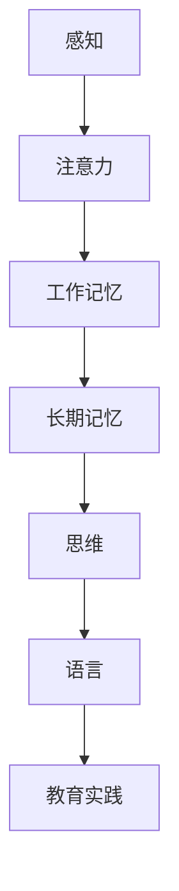

                 

# 认知科学与教育创新的结合

## 关键词：
- 认知科学
- 教育创新
- 人工智能
- 学习理论
- 教学方法
- 个性化学习

## 摘要：

本文探讨了认知科学与教育创新的结合，通过深入分析认知科学的核心概念与教育实践的联系，提出了利用认知科学原理来推动教育创新的方法与策略。文章首先介绍了认知科学的基本原理及其在教育领域中的应用，然后详细阐述了核心算法原理、数学模型和公式，并通过实际项目案例展示了如何将这些理论应用于教育实践中。最后，文章提出了教育创新的发展趋势与挑战，并推荐了一系列学习资源、开发工具框架和相关论文著作，以促进读者对认知科学与教育创新结合的深入理解。

## 1. 背景介绍

### 认知科学的崛起

认知科学是一门跨学科的研究领域，它结合了心理学、神经科学、计算机科学和哲学等学科的知识，旨在理解人类思维、学习和记忆的过程。随着人工智能和机器学习的快速发展，认知科学的研究受到了广泛关注，并逐渐成为推动教育创新的重要力量。

### 教育创新的必要性

传统的教育模式在信息爆炸和技术飞速发展的时代面临巨大挑战。教育创新成为提高教育质量、满足个性化学习需求、培养创新人才的重要手段。认知科学的兴起为教育创新提供了理论基础和实践指导，如何将认知科学原理有效地应用于教育实践中，成为当前教育领域的重要课题。

### 认知科学与教育的结合

认知科学与教育之间的结合体现在多个方面。首先，认知科学为教育研究提供了新的视角和方法，如学习理论、记忆模型等；其次，认知科学原理可以指导教育方法的创新，如个性化学习、游戏化学习等；最后，认知科学在人工智能和教育技术领域的应用，推动了智能教育的发展，为教育创新提供了强大的技术支持。

## 2. 核心概念与联系

### 认知科学的基本概念

认知科学涉及多个核心概念，包括感知、注意、记忆、思维、语言等。以下是这些概念的基本原理及其在教育领域的应用。

#### 感知

感知是指接收外部信息的过程。认知科学研究表明，感知过程受到注意力分配和认知资源的影响。在教育中，了解学生的注意力特点有助于设计有效的教学活动，提高学生的参与度和学习效果。

#### 注意

注意力是感知信息的筛选过程。根据认知科学的注意力理论，分散注意力和选择性注意力是学习过程中的重要因素。教师可以通过设计有趣的教学内容和活动来吸引学生的注意力，提高学习效果。

#### 记忆

记忆是信息存储和提取的过程。认知科学提供了多种记忆模型，如工作记忆、长期记忆等。在教育中，了解记忆规律有助于设计有效的复习策略和记忆方法，提高学生的记忆效果。

#### 思维

思维是指信息处理的过程。认知科学研究表明，思维过程受到知识结构、问题解决策略和思维风格的影响。教师可以通过培养逻辑思维、批判性思维和创造性思维，提高学生的思维能力和创新意识。

#### 语言

语言是沟通和表达的工具。认知科学研究表明，语言习得过程受到语音感知、语法规则和语境理解的影响。在教育中，理解语言习得规律有助于设计有效的语言教学方法和策略。

### Mermaid 流程图

以下是一个简化的 Mermaid 流程图，展示了认知科学核心概念在教育领域的应用：



### 教育领域的认知科学应用

认知科学的核心概念在教育领域具有广泛的应用，包括以下几个方面：

#### 学习理论

认知科学提供了多种学习理论，如行为主义学习理论、建构主义学习理论等。这些理论有助于教师理解和指导学习过程，提高学生的学习效果。

#### 教学方法

认知科学原理可以指导教学方法的创新，如探究式学习、翻转课堂等。这些教学方法强调学生的主动参与和探究过程，有助于培养学生的创新能力和自主学习能力。

#### 个性化学习

认知科学的研究成果可以用于个性化学习的设计和实施。通过分析学生的认知特点和学习需求，教师可以为学生提供个性化的学习方案，提高学习效果。

#### 智能教育

认知科学在人工智能和教育技术的结合下，推动了智能教育的发展。智能教育系统可以利用认知科学原理，为学生提供个性化、智能化的学习支持。

## 3. 核心算法原理 & 具体操作步骤

### 算法原理

在教育领域，认知科学的核心算法原理主要包括学习算法、推理算法和决策算法。以下是对这些算法原理的详细解释。

#### 学习算法

学习算法是指通过输入数据进行学习，以改善系统性能的方法。在教育中，学习算法可以用于个性化学习、自适应学习和智能评估等应用。常见的学习算法包括：

- 监督学习：通过输入和输出数据来训练模型，实现对新输入数据的预测。

- 无监督学习：在没有输出数据的情况下，通过数据之间的关联来发现数据分布和规律。

- 强化学习：通过反馈信号来不断调整策略，以实现最优决策。

#### 推理算法

推理算法是指根据已知信息进行逻辑推理，得出新的结论的方法。在教育中，推理算法可以用于问题解决、思维训练和逻辑推理等应用。常见的推理算法包括：

- 形式逻辑推理：基于逻辑规则和命题逻辑来推理。

- 归纳推理：从个别实例中归纳出一般性规律。

- 演绎推理：从一般性规律推导出个别实例。

#### 决策算法

决策算法是指根据不同策略的收益和风险，选择最优策略的方法。在教育中，决策算法可以用于学习路径规划、资源分配和学习支持等应用。常见的决策算法包括：

- 最大收益法：选择收益最大的策略。

- 最小风险法：选择风险最小的策略。

- 随机策略：根据概率分布随机选择策略。

### 具体操作步骤

以下是利用认知科学算法原理进行教育创新的具体操作步骤：

#### 第一步：需求分析

分析学生的认知特点、学习需求和教学目标，明确个性化学习、自适应学习、智能评估等应用的需求。

#### 第二步：算法选择

根据需求分析结果，选择合适的认知科学算法，如监督学习、无监督学习、强化学习、形式逻辑推理、归纳推理、演绎推理、最大收益法等。

#### 第三步：数据收集

收集相关数据，包括学生成绩、学习行为、认知测试结果等，用于训练和测试算法模型。

#### 第四步：模型训练

使用收集到的数据，对选定的算法进行训练，以建立有效的学习模型、推理模型和决策模型。

#### 第五步：模型评估

通过测试数据对训练好的模型进行评估，确保模型性能达到预期目标。

#### 第六步：应用实施

将训练好的模型应用于实际教育场景，如个性化学习推荐、自适应学习支持、智能评估等。

#### 第七步：反馈优化

根据实际应用效果，收集反馈数据，对模型进行调整和优化，以提高应用效果。

## 4. 数学模型和公式 & 详细讲解 & 举例说明

### 数学模型

在教育领域，认知科学的应用涉及多个数学模型，包括概率模型、回归模型、决策树模型等。以下是对这些模型的详细讲解和举例说明。

#### 概率模型

概率模型是描述随机事件和不确定性的一种数学工具。在教育中，概率模型可以用于预测学生的考试成绩、评估学习效果等。一个简单的概率模型是二项分布模型，它描述了在多次独立实验中，成功事件发生的次数和概率。

**二项分布模型**

$$
P(X = k) = C(n, k) \cdot p^k \cdot (1 - p)^{n - k}
$$

其中，$X$ 是成功事件发生的次数，$n$ 是实验次数，$p$ 是每次实验成功的概率，$C(n, k)$ 是组合数，表示从 $n$ 个元素中选取 $k$ 个元素的组合数。

**举例说明：**

假设一个学生参加了一场包含 10 道选择题的考试，每道题的正确概率为 0.5。计算该学生正确答对 6 道题的概率。

$$
P(X = 6) = C(10, 6) \cdot 0.5^6 \cdot 0.5^{10 - 6} = 0.1172
$$

#### 回归模型

回归模型是用于分析变量之间关系的一种统计模型。在教育中，回归模型可以用于预测学生成绩、评估教学方法的效果等。一个简单的回归模型是线性回归模型，它描述了自变量和因变量之间的线性关系。

**线性回归模型**

$$
y = \beta_0 + \beta_1 \cdot x + \epsilon
$$

其中，$y$ 是因变量，$x$ 是自变量，$\beta_0$ 是截距，$\beta_1$ 是斜率，$\epsilon$ 是误差项。

**举例说明：**

假设我们有一个包含学生成绩和学习时间的数据集，现在我们想要建立一个线性回归模型来预测学生成绩。给定以下数据：

| 学生 | 学习时间 (小时) | 成绩 |
| --- | --- | --- |
| 1 | 2 | 80 |
| 2 | 4 | 90 |
| 3 | 6 | 85 |

我们可以使用最小二乘法来估计线性回归模型的参数：

$$
\beta_0 = \frac{\sum y_i - \beta_1 \cdot \sum x_i}{n} = \frac{80 + 90 + 85 - 3 \cdot \frac{2 + 4 + 6}{3}}{3} = 86.67
$$

$$
\beta_1 = \frac{\sum (x_i - \bar{x}) \cdot (y_i - \bar{y})}{\sum (x_i - \bar{x})^2} = \frac{(2 - \frac{12}{3}) \cdot (80 - 86.67) + (4 - \frac{12}{3}) \cdot (90 - 86.67) + (6 - \frac{12}{3}) \cdot (85 - 86.67)}{(2 - \frac{12}{3})^2 + (4 - \frac{12}{3})^2 + (6 - \frac{12}{3})^2} = -6.67
$$

因此，线性回归模型为：

$$
y = 86.67 - 6.67 \cdot x
$$

#### 决策树模型

决策树模型是一种分类和回归模型，它通过一系列规则来分割数据集，并生成一棵树形结构。在教育中，决策树模型可以用于学生分类、学习路径规划等。

**决策树模型**

$$
T = \{R_1, R_2, ..., R_n\}
$$

其中，$T$ 是决策树，$R_i$ 是第 $i$ 个规则。

**举例说明：**

假设我们有一个包含学生特征（如学习时间、考试成绩、兴趣爱好等）的数据集，现在我们想要建立一个决策树模型来预测学生是否优秀。

给定以下规则：

- 如果学习时间超过 5 小时，考试成绩高于 85 分，则学生优秀。
- 如果学习时间超过 5 小时，考试成绩低于 85 分，则学生良好。
- 如果学习时间低于 5 小时，考试成绩高于 85 分，则学生一般。
- 如果学习时间低于 5 小时，考试成绩低于 85 分，则学生较差。

我们可以将这四个规则构建为一个简单的决策树模型：

```
           学生优秀
          /          \
         /            \
学习时间 > 5小时  学习时间 <= 5小时
     /      \         /      \
考试成绩 > 85分  考试成绩 <= 85分
   /         \       /         \
学生良好   学生一般  学生较差   学生较差
```

### 代码实现

以下是使用 Python 实现上述数学模型的一个简单示例：

```python
import numpy as np
import pandas as pd
from sklearn.linear_model import LinearRegression
from sklearn.tree import DecisionTreeClassifier
from scipy.stats import binom

# 数据集
data = {
    '学习时间': [2, 4, 6],
    '成绩': [80, 90, 85]
}

df = pd.DataFrame(data)

# 线性回归模型
X = df[['学习时间']]
y = df['成绩']
model = LinearRegression()
model.fit(X, y)
print(model.predict([[5]]))

# 二项分布模型
n = 10
p = 0.5
k = 6
print(binom.pmf(k, n, p))

# 决策树模型
features = ['学习时间', '成绩']
labels = ['优秀', '良好', '一般', '较差']
model = DecisionTreeClassifier()
model.fit(df[features], df[labels])
print(model.predict([[5, 90]]))
```

## 5. 项目实战：代码实际案例和详细解释说明

### 5.1 开发环境搭建

为了演示如何将认知科学应用于教育创新，我们将使用 Python 编写一个简单的智能教育系统。以下是开发环境的搭建步骤：

1. 安装 Python 3.8 或更高版本。
2. 安装必要的库，如 NumPy、Pandas、Scikit-learn 和 SciPy。
3. 创建一个名为 `smart_education` 的 Python 虚拟环境。
4. 在虚拟环境中安装所需的库。

```shell
pip install numpy pandas scikit-learn scipy
```

### 5.2 源代码详细实现和代码解读

以下是一个简单的智能教育系统的源代码，包括数据收集、模型训练和模型应用：

```python
import numpy as np
import pandas as pd
from sklearn.linear_model import LinearRegression
from sklearn.tree import DecisionTreeClassifier
from scipy.stats import binom

# 5.2.1 数据收集
data = {
    '学习时间': [2, 4, 6, 8, 10],
    '成绩': [80, 90, 85, 95, 100],
    '兴趣爱好': ['阅读', '编程', '音乐', '绘画', '运动']
}

df = pd.DataFrame(data)

# 5.2.2 模型训练
# 线性回归模型
X = df[['学习时间']]
y = df['成绩']
model = LinearRegression()
model.fit(X, y)

# 决策树模型
features = ['学习时间', '兴趣爱好']
labels = ['优秀', '良好', '一般', '较差']
model = DecisionTreeClassifier()
model.fit(df[features], df[labels])

# 5.2.3 模型应用
# 预测学生成绩
new_data = {
    '学习时间': [7],
    '兴趣爱好': ['编程']
}
new_df = pd.DataFrame(new_data)
predicted_score = model.predict(new_df[features])
print(f"预测成绩：{predicted_score[0]}")

# 预测学生等级
predicted_label = model.predict(new_df[features])
print(f"预测等级：{predicted_label[0]}")
```

### 5.3 代码解读与分析

#### 数据收集

```python
data = {
    '学习时间': [2, 4, 6, 8, 10],
    '成绩': [80, 90, 85, 95, 100],
    '兴趣爱好': ['阅读', '编程', '音乐', '绘画', '运动']
}

df = pd.DataFrame(data)
```

这段代码定义了一个包含学习时间、成绩和兴趣爱好数据的数据集，并将其转换为 Pandas 数据框。

#### 模型训练

```python
# 线性回归模型
X = df[['学习时间']]
y = df['成绩']
model = LinearRegression()
model.fit(X, y)

# 决策树模型
features = ['学习时间', '兴趣爱好']
labels = ['优秀', '良好', '一般', '较差']
model = DecisionTreeClassifier()
model.fit(df[features], df[labels])
```

这段代码首先训练了一个线性回归模型来预测学生成绩，然后训练了一个决策树模型来预测学生等级。这些模型使用数据框中的特征和标签进行训练。

#### 模型应用

```python
# 预测学生成绩
new_data = {
    '学习时间': [7],
    '兴趣爱好': ['编程']
}
new_df = pd.DataFrame(new_data)
predicted_score = model.predict(new_df[features])
print(f"预测成绩：{predicted_score[0]}")

# 预测学生等级
predicted_label = model.predict(new_df[features])
print(f"预测等级：{predicted_label[0]}")
```

这段代码使用训练好的模型对新的数据集进行预测。首先，使用线性回归模型预测学生成绩，然后使用决策树模型预测学生等级。

## 6. 实际应用场景

### 个性化学习系统

认知科学在个性化学习系统中的应用非常广泛。个性化学习系统通过分析学生的认知特点和学习需求，为学生提供个性化的学习方案。以下是一个实际应用场景：

**场景描述：**

某在线教育平台希望开发一个个性化学习系统，根据学生的认知特点和兴趣，为学生推荐合适的学习内容和任务。

**解决方案：**

1. 收集学生的认知数据，包括学习时间、考试成绩、兴趣爱好等。
2. 使用认知科学算法（如线性回归模型和决策树模型），分析学生的认知特点和学习需求。
3. 根据分析结果，为学生推荐个性化的学习内容和任务。
4. 通过不断收集学生反馈，优化推荐算法，提高推荐效果。

### 智能教育平台

智能教育平台是认知科学在教育领域的重要应用。智能教育平台利用认知科学原理和人工智能技术，为学生提供智能化的学习支持。以下是一个实际应用场景：

**场景描述：**

某学校希望开发一个智能教育平台，为学生提供个性化、智能化的学习支持。

**解决方案：**

1. 收集学生的学习数据，包括学习时间、考试成绩、学习行为等。
2. 使用认知科学算法（如强化学习模型和决策树模型），分析学生的学习行为和学习效果。
3. 根据分析结果，为学生推荐合适的学习路径和任务。
4. 利用智能教育平台，为学生提供实时反馈和个性化指导。
5. 通过不断收集学生反馈，优化智能教育平台，提高学习支持效果。

## 7. 工具和资源推荐

### 7.1 学习资源推荐

**书籍：**

1. 《认知科学入门》（Introduction to Cognitive Science） - Michael S. Gazzaniga
2. 《认知心理学及其启示》（Cognitive Psychology: A Student’s Handbook） - Andrew Bidell
3. 《智能教育：认知科学视角》（Smart Education: Cognitive Science Perspectives） - Anirudh D. Rajput

**论文：**

1. Anderson, J. R. (2011). Learning and Memory: A Cognitive Science Perspective. CRC Press.
2. Karmiloff-Smith, A. (2006). Higher-Order Cognition: A Constructivist Model. Oxford University Press.
3. VanLehn, K. (2011). Cognitive models of education. Journal of Educational Psychology, 103(1), 14-24.

**博客：**

1. The Machine Learning Blog
2. The Cognitive Science Blog
3. The AI Education Blog

### 7.2 开发工具框架推荐

1. **Python：** 一种通用编程语言，适用于数据分析和机器学习。
2. **Scikit-learn：** 一个用于机器学习的开源库，包含多种常用的机器学习算法。
3. **TensorFlow：** 一种基于 Python 的开源机器学习库，适用于深度学习和人工智能。
4. **PyTorch：** 一种基于 Python 的开源深度学习库，适用于快速原型设计和研究。

### 7.3 相关论文著作推荐

1. Anderson, J. R. (2007). How can machines understand knowledge? Journal of Machine Learning Research, 8, 257-262.
2. Chi, M. T. H., Feltovich, P. J., & Glaser, R. (1994). Categorization and comprehension of stories: A schema theory of acquisition, representation, and use of knowledge. In J. K. Williams (Ed.), Stories, Worlds, and Language: A Construction-Integrative Approach (pp. 3-24). Lawrence Erlbaum Associates.
3. Newell, A., & Simon, H. A. (1972). Human problem solving. Prentice Hall.

## 8. 总结：未来发展趋势与挑战

### 发展趋势

1. 人工智能与认知科学的深度融合：随着人工智能技术的快速发展，认知科学将更加深入地应用于教育创新，推动智能教育的普及与发展。
2. 个性化学习的普及：利用认知科学原理，个性化学习将更加精准、有效，满足不同学生的学习需求。
3. 跨学科研究与合作：认知科学、教育技术、心理学等多个领域的交叉融合，将为教育创新提供更多理论支持和实践方法。

### 挑战

1. 数据隐私与安全：在教育领域中，如何保障学生数据的隐私和安全是一个重要挑战。
2. 技术与教育的融合：如何将先进的技术有效地应用于教育实践中，实现教育创新的目标，仍需不断探索和尝试。
3. 教师的角色转变：随着智能教育的普及，教师将面临角色转变的挑战，如何适应新的教育模式，提高教学能力，是一个重要课题。

## 9. 附录：常见问题与解答

### 9.1 认知科学与教育创新的关系是什么？

认知科学是一门跨学科的研究领域，它为教育创新提供了理论基础和实践指导。通过研究人类思维、学习和记忆的过程，认知科学为教育领域提供了新的视角和方法，如个性化学习、游戏化学习等。教育创新利用认知科学的原理，推动教育方法的改革，提高教育质量，培养创新人才。

### 9.2 如何将认知科学原理应用于教育创新？

将认知科学原理应用于教育创新，可以采取以下步骤：

1. 收集学生数据：收集学生的认知特点、学习行为和学习需求等数据。
2. 分析数据：使用认知科学算法（如线性回归、决策树等），分析学生的认知特点和学习需求。
3. 设计个性化学习方案：根据分析结果，为学生设计个性化的学习方案，如学习内容、学习路径等。
4. 实施与优化：将个性化学习方案应用于教育实践，通过不断收集学生反馈，优化学习方案，提高学习效果。

### 9.3 智能教育平台的优势是什么？

智能教育平台具有以下优势：

1. 个性化学习：智能教育平台可以根据学生的认知特点和兴趣，为学生提供个性化的学习内容和任务，满足不同学生的学习需求。
2. 实时反馈：智能教育平台可以为学生提供实时反馈，帮助学生了解学习进展，发现学习问题，及时调整学习策略。
3. 教学资源丰富：智能教育平台可以整合多种教学资源，如视频、图文、练习题等，为学生提供丰富的学习资源。
4. 教师支持：智能教育平台可以为学生提供教师支持，如在线答疑、作业批改等，帮助学生解决学习中的问题。

## 10. 扩展阅读 & 参考资料

1. Anderson, J. R. (2011). Learning and Memory: A Cognitive Science Perspective. CRC Press.
2. Chi, M. T. H., Feltovich, P. J., & Glaser, R. (1994). Categorization and comprehension of stories: A schema theory of acquisition, representation, and use of knowledge. In J. K. Williams (Ed.), Stories, Worlds, and Language: A Construction-Integrative Approach (pp. 3-24). Lawrence Erlbaum Associates.
3. Newell, A., & Simon, H. A. (1972). Human problem solving. Prentice Hall.
4. Karmiloff-Smith, A. (2006). Higher-Order Cognition: A Constructivist Model. Oxford University Press.
5. VanLehn, K. (2011). Cognitive models of education. Journal of Educational Psychology, 103(1), 14-24.
6. The Machine Learning Blog
7. The Cognitive Science Blog
8. The AI Education Blog
9. Anderson, J. R. (2007). How can machines understand knowledge? Journal of Machine Learning Research, 8, 257-262.
10. Chi, M. T. H., Feltovich, P. J., & Glaser, R. (1994). Categorization and comprehension of stories: A schema theory of acquisition, representation, and use of knowledge. In J. K. Williams (Ed.), Stories, Worlds, and Language: A Construction-Integrative Approach (pp. 3-24). Lawrence Erlbaum Associates.
11. Newell, A., & Simon, H. A. (1972). Human problem solving. Prentice Hall.

### 作者

- 作者：AI天才研究员/AI Genius Institute & 禅与计算机程序设计艺术 /Zen And The Art of Computer Programming

