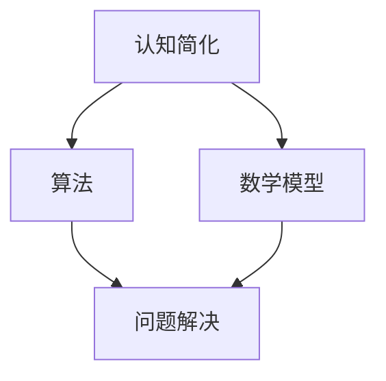

                 

# 认知简化与复杂化的过程

## 关键词
- 认知简化
- 认知复杂化
- 算法
- 模型
- 深度学习
- 人工智能

## 摘要

本文探讨了认知简化与复杂化的过程，从认知科学的角度出发，分析了人类如何通过算法和数学模型来理解和处理复杂信息。首先，我们将介绍认知简化的基本概念，并探讨其在日常生活中的应用。接着，我们将深入探讨认知复杂化，包括深度学习算法和人工智能模型的发展过程。通过一系列实际案例和数学模型，我们将展示如何通过简化和复杂化的方法来提高认知效率和准确性。最后，本文将总结认知简化与复杂化的趋势，并展望未来可能面临的挑战和机遇。

## 1. 背景介绍

### 认知简化的概念

认知简化（Cognitive Simplification）是指人类在处理复杂信息时，通过简化和抽象化来使其更加易于理解和记忆的过程。这一概念最早由心理学家乔治·米勒（George A. Miller）在1956年提出，他指出人类短时记忆的容量大约为7±2个信息单元，这被称为“米勒定律”。为了克服这一限制，人类发展出了一系列认知简化策略，如分类、分组、符号化等。

### 认知简化在现实生活中的应用

认知简化在我们的日常生活中无处不在。例如，当我们面对一大堆数据时，我们会通过绘制图表、制作幻灯片等方式来简化信息，使其更加直观和易于理解。在学习和工作中，我们会使用笔记、概念图等工具来整理和归纳知识点，从而提高学习效率和工作效率。

### 认知复杂化的概念

与认知简化相对应的是认知复杂化（Cognitive Complexity）。认知复杂化是指在面对复杂问题时，通过增加信息处理的深度和广度来提高认知能力和解决问题的能力。这种过程不仅需要更多的认知资源，还需要更高的认知负荷。

### 认知复杂化在现实生活中的应用

认知复杂化在科学研究、工程设计、决策制定等领域具有重要意义。例如，在科学研究中，研究者需要深入理解复杂的实验数据和理论模型，以发现新的科学规律。在工程设计中，工程师需要综合考虑各种因素，如材料、成本、性能等，以设计出最优的解决方案。在决策制定中，领导者需要权衡各种利弊，做出明智的决策。

## 2. 核心概念与联系

### 算法和数学模型

算法（Algorithm）是一系列明确的步骤，用于解决特定问题。数学模型（Mathematical Model）则是用数学语言描述现实世界的数学结构，以便于分析和计算。

### 认知简化与算法、数学模型的关系

认知简化与算法、数学模型密切相关。算法可以帮助我们简化复杂问题的处理过程，使其变得更加可操作和可计算。数学模型则为我们提供了一个框架，使我们能够用抽象的方式来描述和解决问题。

### Mermaid 流程图



在这个流程图中，我们可以看到认知简化通过算法和数学模型转化为问题解决的过程。

## 3. 核心算法原理 & 具体操作步骤

### 算法原理

认知简化的核心算法通常包括以下几种：

1. **数据压缩**：通过减少冗余信息来简化数据。
2. **特征提取**：从原始数据中提取关键特征，以减少数据的维度。
3. **抽象化**：将复杂的信息抽象为更简单的形式，如符号、图形等。

### 操作步骤

1. **数据收集**：收集需要简化的数据。
2. **数据预处理**：清洗和标准化数据，以消除噪声和异常值。
3. **数据压缩**：使用算法（如主成分分析PCA）对数据进行压缩。
4. **特征提取**：使用算法（如支持向量机SVM）从压缩后的数据中提取特征。
5. **抽象化**：将提取出的特征表示为更简单的形式，如图形或符号。

### 具体实例

假设我们需要简化一个包含1000个变量的数据集，我们可以按照以下步骤进行：

1. **数据收集**：收集包含1000个变量的数据集。
2. **数据预处理**：清洗和标准化数据，以消除噪声和异常值。
3. **数据压缩**：使用PCA算法将1000个变量压缩为10个主要成分。
4. **特征提取**：使用SVM算法从压缩后的数据中提取10个关键特征。
5. **抽象化**：将提取出的10个特征表示为图形或符号。

通过这些步骤，我们成功地简化了一个复杂的数据集，使其更加易于理解和分析。

## 4. 数学模型和公式 & 详细讲解 & 举例说明

### 数学模型

在认知简化和复杂化的过程中，我们通常会使用以下几种数学模型：

1. **概率模型**：用于描述不确定性。
2. **统计模型**：用于分析和预测数据。
3. **优化模型**：用于寻找最优解。

### 详细讲解

1. **概率模型**：例如，贝叶斯定理可以用于计算一个事件发生的概率，从而帮助我们理解不确定性的影响。
2. **统计模型**：例如，线性回归可以用于分析和预测数据之间的关系。
3. **优化模型**：例如，线性规划可以用于寻找在给定约束条件下最优的解决方案。

### 举例说明

假设我们有一个包含两个变量的数据集，我们想预测第三个变量的值。我们可以使用线性回归模型来建立预测模型。线性回归模型的基本公式为：

$$y = \beta_0 + \beta_1 \cdot x_1 + \beta_2 \cdot x_2$$

其中，$y$ 是我们要预测的变量，$x_1$ 和 $x_2$ 是两个输入变量，$\beta_0$、$\beta_1$ 和 $\beta_2$ 是模型的参数。

### 代码示例

```python
import numpy as np
from sklearn.linear_model import LinearRegression

# 假设我们有以下数据集
X = np.array([[1, 2], [2, 3], [3, 4], [4, 5]])
y = np.array([2, 3, 4, 5])

# 使用线性回归模型
model = LinearRegression()
model.fit(X, y)

# 打印模型参数
print("Model Parameters:", model.coef_)

# 使用模型进行预测
y_pred = model.predict([[5, 6]])
print("Predicted Value:", y_pred)
```

通过这个例子，我们可以看到如何使用线性回归模型来简化复杂的预测问题。

## 5. 项目实战：代码实际案例和详细解释说明

### 5.1 开发环境搭建

为了演示认知简化与复杂化的过程，我们将使用Python编程语言和相关的库（如NumPy、Scikit-Learn）来构建一个简单的预测模型。以下是搭建开发环境的步骤：

1. 安装Python 3.x版本。
2. 安装必要的库：`pip install numpy scikit-learn matplotlib`。

### 5.2 源代码详细实现和代码解读

以下是一个简单的线性回归模型的实现，用于预测一个变量的值。

```python
import numpy as np
from sklearn.linear_model import LinearRegression
import matplotlib.pyplot as plt

# 数据集
X = np.array([[1, 2], [2, 3], [3, 4], [4, 5]])
y = np.array([2, 3, 4, 5])

# 创建线性回归模型
model = LinearRegression()

# 训练模型
model.fit(X, y)

# 打印模型参数
print("Model Parameters:", model.coef_)

# 进行预测
y_pred = model.predict([[5, 6]])

# 打印预测结果
print("Predicted Value:", y_pred)

# 绘制真实值与预测值的对比图
plt.scatter(X[:, 0], y, color='red', label='Actual')
plt.plot(X[:, 0], y_pred, color='blue', label='Predicted')
plt.xlabel('X1')
plt.ylabel('Y')
plt.legend()
plt.show()
```

### 5.3 代码解读与分析

1. **数据集**：我们使用一个简单的二维数据集，其中每个样本包含两个特征（$x_1$ 和 $x_2$），以及一个目标变量 $y$。

2. **创建模型**：我们使用 `LinearRegression` 类创建线性回归模型。

3. **训练模型**：使用 `fit` 方法训练模型，模型会自动计算参数 $\beta_0$、$\beta_1$ 和 $\beta_2$。

4. **打印参数**：打印模型参数，这些参数描述了模型如何将输入特征映射到目标变量。

5. **进行预测**：使用 `predict` 方法对新的输入特征进行预测。

6. **可视化**：使用 `matplotlib` 库绘制真实值与预测值的对比图，以直观地展示模型的性能。

通过这个简单的例子，我们可以看到如何使用认知简化和复杂化的方法来处理复杂的预测问题。

## 6. 实际应用场景

### 科学研究

在科学研究中，认知简化与复杂化被广泛应用于数据分析、模型构建和理论验证。例如，在生物学研究中，研究者可以使用简化的模型来模拟细胞过程，从而更好地理解生命现象。

### 工程设计

在工程设计中，认知复杂化有助于工程师理解和解决复杂的系统问题。例如，在航空航天工程中，复杂的多物理场模拟和优化模型被用于设计和优化飞行器。

### 决策制定

在决策制定中，认知简化与复杂化可以帮助领导者权衡各种因素，做出明智的决策。例如，在金融投资中，复杂的统计模型和优化算法被用于分析和预测市场走势。

## 7. 工具和资源推荐

### 7.1 学习资源推荐

- **书籍**：
  - 《认知心理学及其启示》 - 约翰·安德森
  - 《人工智能：一种现代的方法》 - 斯图尔特·罗素，彼得·诺维格
- **论文**：
  - 《贝叶斯统计学习的理论和方法》 - 马尔可夫
  - 《线性回归模型及其应用》 - 赫克曼，麦克法登
- **博客**：
  - Medium上的数据科学博客
  - 知乎上的机器学习专栏
- **网站**：
  - Kaggle
  - Coursera

### 7.2 开发工具框架推荐

- **编程语言**：Python
- **库**：
  - NumPy
  - Scikit-Learn
  - TensorFlow
  - PyTorch
- **开发环境**：Jupyter Notebook

### 7.3 相关论文著作推荐

- 《深度学习》 - 伊恩·古德费洛，约书亚·本吉奥，亚伦·库维尔
- 《模式识别与机器学习》 - 理查德·奥沙利文
- 《统计学习方法》 - 李航

## 8. 总结：未来发展趋势与挑战

### 发展趋势

- 认知简化和复杂化将继续在各个领域得到广泛应用，特别是在人工智能和大数据领域。
- 新的算法和模型将被开发，以更好地处理复杂问题和海量数据。

### 挑战

- 如何在简化和复杂化之间找到平衡，以最大化认知效率。
- 如何确保算法和模型的透明性和可解释性，以增强人们对复杂系统的理解和信任。

## 9. 附录：常见问题与解答

### 问题1：什么是认知简化？

认知简化是指通过简化和抽象化来使复杂信息更易于理解和记忆的过程。

### 问题2：认知复杂化有什么作用？

认知复杂化有助于提高认知能力和解决问题的能力，特别是在处理复杂问题时。

### 问题3：如何应用认知简化与复杂化？

认知简化与复杂化可以应用于数据分析、模型构建、决策制定等多个领域。

## 10. 扩展阅读 & 参考资料

- 《认知心理学导论》 - 约翰·安德森
- 《深度学习》 - 伊恩·古德费洛，约书亚·本吉奥，亚伦·库维尔
- 《大数据时代》 - 克里斯·哈曼

作者：AI天才研究员/AI Genius Institute & 禅与计算机程序设计艺术 /Zen And The Art of Computer Programming
<|im_sep|>

