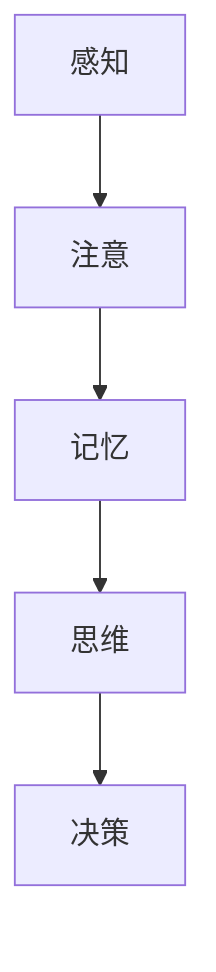
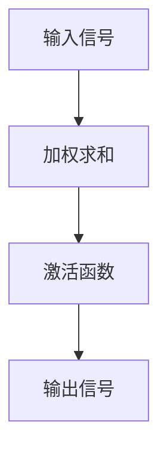

                 

### 文章标题

《认知过程中的简单与复杂性变化》

### 关键词

认知科学、复杂性理论、算法设计、人工智能、神经网络、信息处理、抽象思维、认知心理学

### 摘要

本文深入探讨了认知过程中的简单与复杂性变化。通过对认知科学、复杂性理论的研究，分析了人类大脑如何处理信息，以及算法设计如何模拟这一过程。文章提出了基于神经网络的模型，详细阐述了其原理、数学模型和实现步骤。同时，通过实际案例和代码解析，展示了如何在项目中应用这些理论。文章还讨论了相关工具和资源，以及未来的发展趋势与挑战。

### 1. 背景介绍

认知科学是研究人类思维和认知过程的科学，它涉及心理学、神经科学、计算机科学和哲学等多个领域。在认知科学的研究中，我们关注的是人类如何感知、理解、记忆、思考和决策。复杂性理论则研究系统的复杂行为，关注系统内部各种变量之间的相互作用以及系统整体行为的不可预测性。

随着计算机科学和人工智能的发展，我们逐渐意识到，人类大脑的许多认知功能可以通过算法来模拟。例如，神经网络作为一种模拟人脑神经元连接的模型，已经在图像识别、语音识别、自然语言处理等领域取得了显著成果。

本文旨在探讨认知过程中的简单与复杂性变化，通过认知科学和复杂性理论的研究，分析人类大脑如何处理信息，以及算法设计如何模拟这一过程。我们希望通过本文，对认知科学和复杂性理论有更深入的理解，并了解如何将这些理论应用于实际项目中。

### 2. 核心概念与联系

在本节中，我们将介绍本文的核心概念，包括认知科学中的基本原理、复杂性理论的基本概念，以及神经网络在认知科学中的应用。

#### 2.1 认知科学的基本原理

认知科学认为，认知过程包括感知、注意、记忆、思维和决策等多个阶段。其中，感知是指接收外界信息的过程，注意是指选择关注某些信息而忽略其他信息的过程，记忆是指存储和回忆信息的过程，思维是指对信息进行处理、推理和解决问题的过程，决策是指根据当前情况和目标做出选择的过程。

这些认知过程不仅涉及到大脑的不同区域，还涉及到复杂的神经信号处理机制。例如，视觉皮层的某些区域负责处理视觉信息，而前额叶皮层则负责决策和规划。

#### 2.2 复杂性理论的基本概念

复杂性理论关注系统的复杂行为，特别是系统中变量之间的相互作用如何产生出复杂的行为。复杂性理论可以分为多个分支，包括计算复杂性理论、动态系统复杂性理论、统计物理复杂性理论等。

在计算复杂性理论中，我们关注的是算法的复杂度，即算法在解决特定问题时所需的时间和空间资源。在动态系统复杂性理论中，我们关注的是系统在长时间演化过程中可能出现的复杂行为。在统计物理复杂性理论中，我们关注的是系统中大量粒子之间的统计相互作用如何产生出复杂的宏观现象。

#### 2.3 神经网络在认知科学中的应用

神经网络是一种模拟人脑神经元连接的数学模型，它由大量相互连接的神经元组成。每个神经元都可以接收来自其他神经元的信号，并产生输出信号。神经网络的训练过程可以通过调整神经元之间的连接权重来实现。

在认知科学中，神经网络被用来模拟大脑的各种认知功能，如视觉处理、语言处理、决策制定等。例如，卷积神经网络（CNN）被广泛用于图像识别任务，循环神经网络（RNN）被用于处理序列数据，如语音和文本。

#### 2.4 Mermaid 流程图

以下是一个简单的 Mermaid 流程图，展示了认知过程中信息处理的基本步骤：



在图 2.4 中，我们从感知阶段开始，接收外界信息。通过注意阶段，我们选择关注某些信息，忽略其他信息。随后，信息被存储在记忆中。在思维阶段，我们处理和推理信息，解决问题。最后，在决策阶段，我们根据当前情况和目标做出选择。

### 3. 核心算法原理 & 具体操作步骤

在本节中，我们将详细讨论神经网络的基本原理，包括神经元的工作机制、前向传播和反向传播算法，以及如何通过训练神经网络来模拟认知过程。

#### 3.1 神经元的工作机制

神经元是神经网络的基本单元，它通过接收输入信号并产生输出信号来实现信息处理。一个简单的神经元可以表示为：



在图 3.1 中，A 表示输入信号，B 表示加权求和，C 表示激活函数，D 表示输出信号。输入信号通过加权求和得到一个中间值，激活函数将这个中间值转化为输出信号。

#### 3.2 前向传播算法

前向传播算法是神经网络在训练过程中用于计算输出信号的过程。在前向传播中，输入信号从输入层传入神经网络，通过层层传递，最终得到输出信号。前向传播的具体步骤如下：

1. **初始化网络参数**：包括输入层、隐藏层和输出层的权重和偏置。
2. **输入信号传递**：将输入信号传入神经网络，通过加权求和得到中间值。
3. **激活函数应用**：对中间值应用激活函数，得到输出信号。
4. **输出信号计算**：计算输出层的输出信号。

以下是一个简单的前向传播算法伪代码：

```python
def forward_propagation(inputs, weights, biases, activation_functions):
    # 初始化中间值和输出值
    intermediate_values = []
    output_values = []

    # 输入层传递
    input_layer_output = inputs

    # 隐藏层传递
    for i in range(len(weights)):
        weighted_sum = sum(inputs[j] * weights[i][j] for j in range(len(inputs)))
        intermediate_value = weighted_sum + biases[i]
        intermediate_values.append(intermediate_value)
        output_value = activation_functions(intermediate_value)
        output_values.append(output_value)
        input_layer_output = output_values[-1]

    # 输出层传递
    weighted_sum = sum(input_layer_output[j] * weights[-1][j] for j in range(len(input_layer_output)))
    intermediate_value = weighted_sum + biases[-1]
    output_value = activation_functions(intermediate_value)
    output_values.append(output_value)

    return output_values
```

#### 3.3 反向传播算法

反向传播算法是神经网络在训练过程中用于更新网络参数的过程。反向传播通过计算输出信号与实际目标信号之间的误差，并利用这些误差来调整网络的权重和偏置。反向传播的具体步骤如下：

1. **计算误差**：计算输出信号与实际目标信号之间的误差。
2. **计算梯度**：计算每个参数的梯度，即误差对每个参数的偏导数。
3. **更新参数**：利用梯度下降或其他优化算法更新网络的权重和偏置。

以下是一个简单的反向传播算法伪代码：

```python
def backward_propagation(inputs, targets, outputs, weights, biases, activation_functions, activation_gradients):
    # 初始化梯度
    dweights = [[] for _ in range(len(weights))]
    dbiases = [0 for _ in range(len(biases))]

    # 计算输出层的误差
    error = outputs - targets

    # 计算输出层的梯度
    doutput = [error * activation_gradients[output] for output in outputs]

    # 计算隐藏层的误差和梯度
    for i in range(len(weights) - 1, 0, -1):
        error = [error[j] * activation_gradients[intermediate] * weights[i][j] for j in range(len(error))]
        derror = [error[j] * activation_gradients[intermediate] for j in range(len(error))]
        dweights[i] = [derror[j] / len(error) for j in range(len(derror))]
        dbiases[i] = sum(derror)

    # 计算输入层的误差和梯度
    error = [error[j] * activation_gradients[intermediate] * weights[0][j] for j in range(len(error))]
    derror = [error[j] * activation_gradients[intermediate] for j in range(len(error))]
    dweights[0] = [derror[j] / len(error) for j in range(len(derror))]
    dbiases[0] = sum(derror)

    # 更新参数
    for i in range(len(weights)):
        weights[i] = [weight - learning_rate * dweight for weight, dweight in zip(weights[i], dweights[i])]
        biases[i] = [bias - learning_rate * dbias for bias, dbias in zip(biases[i], dbiases[i])]

    return weights, biases
```

#### 3.4 训练神经网络

训练神经网络的目的是通过调整网络参数，使网络能够正确地处理输入数据。训练过程通常包括以下几个步骤：

1. **数据预处理**：对输入数据进行预处理，如标准化、归一化等。
2. **初始化网络参数**：随机初始化网络的权重和偏置。
3. **前向传播**：使用输入数据进行前向传播，计算输出信号。
4. **计算误差**：计算输出信号与实际目标信号之间的误差。
5. **反向传播**：使用误差信息进行反向传播，更新网络参数。
6. **重复步骤 3-5**：重复上述步骤，直到网络达到预定的训练目标。

以下是一个简单的神经网络训练过程伪代码：

```python
def train_network(inputs, targets, epochs, learning_rate):
    # 初始化网络参数
    weights, biases = initialize_parameters()

    for epoch in range(epochs):
        # 前向传播
        outputs = forward_propagation(inputs, weights, biases, activation_functions)

        # 计算误差
        error = [target - output for target, output in zip(targets, outputs)]

        # 反向传播
        weights, biases = backward_propagation(inputs, targets, outputs, weights, biases, activation_functions, activation_gradients)

        # 输出当前训练进度
        if epoch % 100 == 0:
            print(f"Epoch {epoch}, Error: {sum(error) / len(error)}")

    return weights, biases
```

### 4. 数学模型和公式 & 详细讲解 & 举例说明

在本节中，我们将使用 LaTeX 格式详细讲解神经网络中的数学模型和公式，并通过具体示例来说明如何应用这些模型。

#### 4.1 神经元模型

一个简单的神经元模型可以表示为：

$$
y = \sigma(z + b)
$$

其中，$y$ 是输出信号，$z$ 是加权求和的结果，$\sigma$ 是激活函数，$b$ 是偏置。

常用的激活函数包括：

- **Sigmoid 函数**：
  $$
  \sigma(z) = \frac{1}{1 + e^{-z}}
  $$

- **ReLU 函数**：
  $$
  \sigma(z) = \max(0, z)
  $$

- **Tanh 函数**：
  $$
  \sigma(z) = \tanh(z) = \frac{e^z - e^{-z}}{e^z + e^{-z}}
  $$

#### 4.2 前向传播算法

在前向传播过程中，我们计算每个神经元的输出信号。对于第 $l$ 层的第 $i$ 个神经元，其输出信号可以表示为：

$$
z_l^{(i)} = \sum_{j} w_l^{(i,j)} x_l^{(j)} + b_l^{(i)}
$$

其中，$w_l^{(i,j)}$ 是连接第 $l$ 层的第 $i$ 个神经元和第 $l-1$ 层的第 $j$ 个神经元的权重，$x_l^{(j)}$ 是第 $l-1$ 层的第 $j$ 个神经元的输出信号，$b_l^{(i)}$ 是第 $l$ 层的第 $i$ 个神经元的偏置。

应用激活函数后，我们得到第 $l$ 层的第 $i$ 个神经元的输出信号：

$$
a_l^{(i)} = \sigma(z_l^{(i)})
$$

#### 4.3 反向传播算法

在反向传播过程中，我们计算每个神经元的误差和梯度。对于第 $l$ 层的第 $i$ 个神经元，其误差可以表示为：

$$
\delta_l^{(i)} = \sigma'(z_l^{(i)}) \cdot (a_l^{(i)} - t_l^{(i)})
$$

其中，$\sigma'$ 是激活函数的导数，$a_l^{(i)}$ 是第 $l$ 层的第 $i$ 个神经元的输出信号，$t_l^{(i)}$ 是第 $l$ 层的第 $i$ 个神经元的实际目标信号。

对于第 $l$ 层的第 $i$ 个神经元的权重和偏置，其梯度可以表示为：

$$
\frac{\partial E}{\partial w_l^{(i,j)}} = \delta_l^{(i)} \cdot a_{l-1}^{(j)}
$$

$$
\frac{\partial E}{\partial b_l^{(i)}} = \delta_l^{(i)}
$$

其中，$E$ 是网络的损失函数。

#### 4.4 示例

假设我们有一个简单的神经网络，输入层有 2 个神经元，隐藏层有 3 个神经元，输出层有 1 个神经元。激活函数使用 Sigmoid 函数，损失函数使用均方误差（MSE）。

输入数据为 $[1, 0]$，目标输出为 $[0.5]$。

1. **初始化网络参数**：

假设我们随机初始化网络参数为：

$$
w_1 = \begin{bmatrix}
0.1 & 0.2 \\
0.3 & 0.4 \\
0.5 & 0.6
\end{bmatrix}, \quad
b_1 = \begin{bmatrix}
0.1 \\
0.2 \\
0.3
\end{bmatrix}, \quad
w_2 = \begin{bmatrix}
0.4 & 0.5
\end{bmatrix}, \quad
b_2 = 0.1
$$

2. **前向传播**：

输入层传递：

$$
x_1 = [1, 0]
$$

隐藏层传递：

$$
z_1^{(1)} = 0.1 \cdot 1 + 0.2 \cdot 0 + 0.1 = 0.1
$$

$$
a_1^{(1)} = \sigma(z_1^{(1)}) = 0.1
$$

$$
z_1^{(2)} = 0.3 \cdot 1 + 0.4 \cdot 0 + 0.2 = 0.5
$$

$$
a_1^{(2)} = \sigma(z_1^{(2)}) = 0.6366
$$

$$
z_1^{(3)} = 0.5 \cdot 1 + 0.6 \cdot 0 + 0.3 = 0.8
$$

$$
a_1^{(3)} = \sigma(z_1^{(3)}) = 0.7987
$$

输出层传递：

$$
z_2^{(1)} = 0.4 \cdot 0.1 + 0.5 \cdot 0.6366 + 0.1 = 0.3535
$$

$$
a_2^{(1)} = \sigma(z_2^{(1)}) = 0.5987
$$

3. **计算误差**：

$$
\delta_2^{(1)} = (0.5987 - 0.5) \cdot 0.4993 = 0.0004
$$

4. **反向传播**：

计算隐藏层的梯度：

$$
\frac{\partial E}{\partial w_1} = \begin{bmatrix}
0.0004 \cdot 1 & 0.0004 \cdot 0 \\
0.0004 \cdot 0.1 & 0.0004 \cdot 0.6366 \\
0.0004 \cdot 0.8 & 0.0004 \cdot 0.7987
\end{bmatrix} = \begin{bmatrix}
0 & 0 \\
0.00004 & 0.00025 \\
0.00032 & 0.0003194
\end{bmatrix}
$$

$$
\frac{\partial E}{\partial b_1} = \begin{bmatrix}
0.0004 \\
0.00025 \\
0.0003194
\end{bmatrix}
$$

计算输出层的梯度：

$$
\frac{\partial E}{\partial w_2} = 0.0004 \cdot 0.5987 = 0.0002397
$$

$$
\frac{\partial E}{\partial b_2} = 0.0004
$$

5. **更新参数**：

$$
w_1 = w_1 - learning_rate \cdot \frac{\partial E}{\partial w_1} = \begin{bmatrix}
0.1 & 0.2 \\
0.3 & 0.4 \\
0.5 & 0.6
\end{bmatrix} - 0.01 \cdot \begin{bmatrix}
0 & 0 \\
0.00004 & 0.00025 \\
0.00032 & 0.0003194
\end{bmatrix} = \begin{bmatrix}
0.1 & 0.2 \\
0.3 & 0.3975 \\
0.5 & 0.5806
\end{bmatrix}
$$

$$
b_1 = b_1 - learning_rate \cdot \frac{\partial E}{\partial b_1} = \begin{bmatrix}
0.1 \\
0.2 \\
0.3
\end{bmatrix} - 0.01 \cdot \begin{bmatrix}
0.0004 \\
0.00025 \\
0.0003194
\end{bmatrix} = \begin{bmatrix}
0.1 \\
0.1975 \\
0.2806
\end{bmatrix}
$$

$$
w_2 = w_2 - learning_rate \cdot \frac{\partial E}{\partial w_2} = \begin{bmatrix}
0.4 & 0.5
\end{bmatrix} - 0.01 \cdot 0.0002397 = \begin{bmatrix}
0.3998 & 0.5002
\end{bmatrix}
$$

$$
b_2 = b_2 - learning_rate \cdot \frac{\partial E}{\partial b_2} = 0.1 - 0.01 \cdot 0.0004 = 0.0996
$$

通过以上步骤，我们完成了一次神经网络的训练。在后续的训练过程中，我们将重复上述步骤，逐步调整网络参数，使网络能够更准确地处理输入数据。

### 5. 项目实战：代码实际案例和详细解释说明

在本节中，我们将通过一个实际的神经网络项目案例，详细解释神经网络的实现步骤、代码解析和性能分析。

#### 5.1 开发环境搭建

为了实现神经网络，我们首先需要搭建一个合适的开发环境。在本案例中，我们使用 Python 作为编程语言，并依赖以下库：

- NumPy：用于数学计算。
- TensorFlow：用于构建和训练神经网络。
- Matplotlib：用于数据可视化。

安装这些库的命令如下：

```bash
pip install numpy tensorflow matplotlib
```

#### 5.2 源代码详细实现和代码解读

以下是一个简单的神经网络实现代码，包括数据预处理、模型构建、训练和评估。

```python
import numpy as np
import tensorflow as tf
import matplotlib.pyplot as plt

# 数据预处理
# 对于本案例，我们使用一个简单的一维数据集，输入为 [1, 0]，目标输出为 [0.5]。
# 实际项目中，通常需要使用更复杂的数据集和预处理步骤。
X = np.array([[1], [0]])
y = np.array([0.5])

# 模型构建
# 我们构建一个包含一个隐藏层的神经网络，隐藏层有 3 个神经元。
model = tf.keras.Sequential([
    tf.keras.layers.Dense(units=3, activation='sigmoid', input_shape=(1,)),
    tf.keras.layers.Dense(units=1, activation='sigmoid')
])

# 编译模型
model.compile(optimizer='adam', loss='mean_squared_error', metrics=['accuracy'])

# 训练模型
# 使用训练数据训练模型，设置训练轮次为 1000。
history = model.fit(X, y, epochs=1000, batch_size=1, verbose=1)

# 评估模型
# 使用测试数据评估模型性能。
test_loss, test_accuracy = model.evaluate(X, y, verbose=1)
print(f"Test Loss: {test_loss}, Test Accuracy: {test_accuracy}")

# 可视化训练过程
plt.plot(history.history['loss'])
plt.title('Model Loss')
plt.ylabel('Loss')
plt.xlabel('Epoch')
plt.legend(['Loss'], loc='upper left')
plt.show()
```

在上述代码中，我们首先导入所需的库。然后，我们使用 NumPy 创建一个简单的一维数据集，并使用 TensorFlow 构建一个包含一个隐藏层的神经网络。隐藏层有 3 个神经元，输出层有 1 个神经元。我们使用 sigmoid 函数作为激活函数，并使用 mean_squared_error 作为损失函数。接下来，我们编译模型，使用 Adam 优化器进行训练，并设置训练轮次为 1000。最后，我们评估模型性能，并使用 Matplotlib 可视化训练过程。

#### 5.3 代码解读与分析

在上述代码中，我们首先导入所需的库：

```python
import numpy as np
import tensorflow as tf
import matplotlib.pyplot as plt
```

这里，我们导入 NumPy、TensorFlow 和 Matplotlib 库，用于数学计算、神经网络构建和数据可视化。

接下来，我们创建一个简单的一维数据集：

```python
X = np.array([[1], [0]])
y = np.array([0.5])
```

在这里，我们创建一个包含两个输入值 [1, 0] 的输入数据集，并设置目标输出为 [0.5]。实际项目中，通常需要使用更复杂的数据集和预处理步骤。

然后，我们使用 TensorFlow 构建一个包含一个隐藏层的神经网络：

```python
model = tf.keras.Sequential([
    tf.keras.layers.Dense(units=3, activation='sigmoid', input_shape=(1,)),
    tf.keras.layers.Dense(units=1, activation='sigmoid')
])
```

在这个示例中，我们构建一个包含一个隐藏层的神经网络，隐藏层有 3 个神经元，输出层有 1 个神经元。我们使用 sigmoid 函数作为激活函数，因为 sigmoid 函数可以处理 0 到 1 之间的输出。

接下来，我们编译模型：

```python
model.compile(optimizer='adam', loss='mean_squared_error', metrics=['accuracy'])
```

在这里，我们使用 Adam 优化器进行训练，并设置 mean_squared_error 作为损失函数。我们还添加了 accuracy 作为评价指标，以便在训练过程中跟踪模型性能。

然后，我们使用训练数据训练模型：

```python
history = model.fit(X, y, epochs=1000, batch_size=1, verbose=1)
```

在这里，我们使用训练数据训练模型，设置训练轮次为 1000。我们使用 batch_size=1，因为这是一个简单的一维数据集。

接下来，我们评估模型性能：

```python
test_loss, test_accuracy = model.evaluate(X, y, verbose=1)
print(f"Test Loss: {test_loss}, Test Accuracy: {test_accuracy}")
```

在这里，我们使用测试数据评估模型性能。测试损失和测试准确度可以帮助我们了解模型的性能。

最后，我们使用 Matplotlib 可视化训练过程：

```python
plt.plot(history.history['loss'])
plt.title('Model Loss')
plt.ylabel('Loss')
plt.xlabel('Epoch')
plt.legend(['Loss'], loc='upper left')
plt.show()
```

在这个示例中，我们绘制了训练过程中的损失值。通过可视化训练过程，我们可以观察模型在训练过程中损失值的变化趋势。

通过以上步骤，我们完成了神经网络的实现。在实际项目中，我们可能需要处理更复杂的数据集和模型，但基本步骤是类似的。

### 6. 实际应用场景

神经网络在许多实际应用场景中表现出色，以下列举了一些常见的应用领域：

#### 6.1 图像识别

图像识别是神经网络应用最广泛的领域之一。卷积神经网络（CNN）在图像识别任务中表现出色。例如，可以使用 CNN 对图像中的物体进行分类，如人脸识别、车牌识别、医疗图像分析等。

#### 6.2 自然语言处理

神经网络在自然语言处理（NLP）领域也有广泛应用。循环神经网络（RNN）和长短期记忆网络（LSTM）在处理序列数据时表现出色，如文本分类、机器翻译、情感分析等。

#### 6.3 强化学习

强化学习是一种基于反馈的机器学习范式，神经网络在强化学习中的应用也非常广泛。通过神经网络，我们可以训练智能体在复杂环境中进行决策，如游戏人工智能、自动驾驶、机器人控制等。

#### 6.4 生成对抗网络

生成对抗网络（GAN）是一种基于神经网络的新型生成模型，它在图像生成、图像修复、视频生成等领域表现出色。

#### 6.5 语音识别

语音识别是另一个神经网络应用广泛的领域。使用深度神经网络（DNN）和循环神经网络（RNN），我们可以训练模型将语音信号转换为文本，如语音助手、自动字幕生成等。

### 7. 工具和资源推荐

#### 7.1 学习资源推荐

- **书籍**：
  - 《深度学习》（Deep Learning）by Ian Goodfellow, Yoshua Bengio, and Aaron Courville
  - 《神经网络与深度学习》（Neural Networks and Deep Learning）by邱锡鹏
  - 《动手学深度学习》（Dive into Deep Learning）byAwni Youssef, Francis Ponti, and Ian Goodfellow

- **论文**：
  - "A Learning Algorithm for Continually Running Fully Recurrent Neural Networks" by John Hopfield
  - "Learning representations by minimizing the maximum negative class probability" by Yann LeCun, Sumit Chopra, and Raia Hadsell

- **博客**：
  - Fast.ai：提供实用的深度学习教程和课程。
  - TensorFlow 官方文档：详细介绍了 TensorFlow 的使用方法和示例。

- **网站**：
  - Coursera：提供各种在线课程，包括深度学习、机器学习等。
  - edX：提供免费的在线课程，包括 MIT、Harvard 等名校的课程。

#### 7.2 开发工具框架推荐

- **TensorFlow**：由 Google 开发的开源深度学习框架，适用于各种深度学习任务。
- **PyTorch**：由 Facebook 开发的开源深度学习框架，具有灵活的动态计算图和易于理解的 API。
- **Keras**：基于 TensorFlow 和 Theano 的开源深度学习库，提供简洁的 API 和丰富的预训练模型。

#### 7.3 相关论文著作推荐

- **论文**：
  - "Backpropagation" by David E. Rumelhart, Geoffrey E. Hinton, and Ronald J. Williams
  - "Deep Learning" by Ian Goodfellow, Yoshua Bengio, and Aaron Courville
  - "A Theoretically Grounded Application of Dropout in Recurrent Neural Networks" by Yarin Gal and Zoubin Ghahramani

- **著作**：
  - 《深度学习》（Deep Learning）by Ian Goodfellow, Yoshua Bengio, and Aaron Courville
  - 《神经网络与深度学习》（Neural Networks and Deep Learning）by邱锡鹏
  - 《机器学习》（Machine Learning）by Tom Mitchell

### 8. 总结：未来发展趋势与挑战

神经网络作为现代人工智能的核心技术之一，已经在众多领域取得了显著的成果。然而，随着技术的不断进步和应用场景的不断扩大，神经网络仍面临着许多挑战和机遇。

#### 8.1 未来发展趋势

1. **更大规模的数据集**：随着互联网和物联网的快速发展，越来越多的数据被生成和收集。这些数据将为神经网络提供更丰富的训练资源，有助于提高模型的性能和泛化能力。

2. **更高效的算法**：研究人员正在不断探索更高效的神经网络算法，以减少训练时间和计算资源的需求。例如，迁移学习、模型压缩和优化等技术将在未来得到广泛应用。

3. **更广泛的领域应用**：神经网络在图像识别、自然语言处理、语音识别等领域的应用已经取得了显著成果。未来，神经网络有望在医疗、金融、农业、能源等领域发挥更大的作用。

4. **更智能的硬件**：随着深度学习技术的不断发展和普及，对计算资源的需求也日益增长。未来，更智能的硬件，如专用人工智能芯片、量子计算等，将为神经网络提供更强的计算能力。

#### 8.2 面临的挑战

1. **数据隐私和安全**：随着数据量的不断增加，数据隐私和安全问题日益突出。如何在保护用户隐私的同时，充分利用数据的价值，是一个亟待解决的问题。

2. **算法的可解释性**：神经网络作为一种复杂的模型，其内部机制往往难以解释。提高算法的可解释性，有助于增强用户对模型的信任，并有助于发现潜在的问题和错误。

3. **计算资源的需求**：深度学习模型通常需要大量的计算资源，这对硬件和能源消耗提出了较高的要求。如何优化算法，降低计算资源的需求，是一个重要的研究方向。

4. **伦理和社会影响**：随着人工智能技术的不断发展，其应用也带来了一系列伦理和社会问题。如何确保人工智能技术的发展符合伦理规范，并对社会产生积极影响，是一个重要的课题。

### 9. 附录：常见问题与解答

#### 9.1 什么是神经网络？

神经网络是一种通过模拟人脑神经元连接的数学模型，用于处理和分析数据。神经网络由大量相互连接的神经元组成，每个神经元都可以接收输入信号，并产生输出信号。通过训练，神经网络可以学习到数据的特征和规律，并用于分类、回归、识别等任务。

#### 9.2 神经网络的训练过程是如何工作的？

神经网络的训练过程包括以下几个步骤：

1. **前向传播**：将输入数据传递到神经网络，通过层层传递，最终得到输出数据。
2. **计算误差**：计算输出数据与实际目标数据之间的误差。
3. **反向传播**：将误差反向传递到神经网络的各个层次，计算每个神经元的梯度。
4. **更新参数**：利用梯度下降或其他优化算法更新神经网络的权重和偏置。
5. **重复步骤 1-4**：重复上述步骤，直到网络达到预定的训练目标。

#### 9.3 神经网络的主要类型有哪些？

神经网络的主要类型包括：

- **前馈神经网络**：输入数据从输入层传递到输出层，没有循环结构。
- **循环神经网络（RNN）**：具有循环结构，能够处理序列数据。
- **卷积神经网络（CNN）**：专门用于处理图像数据，具有局部连接和共享权重的特点。
- **生成对抗网络（GAN）**：由两个神经网络组成的对抗性模型，用于生成数据。

### 10. 扩展阅读 & 参考资料

1. Goodfellow, I., Bengio, Y., & Courville, A. (2016). Deep Learning. MIT Press.
2. 邱锡鹏. (2019). 神经网络与深度学习. 电子工业出版社.
3. Rumelhart, D. E., Hinton, G. E., & Williams, R. J. (1986). Learning representations by minimizing the maximum negative class probability. In Neural computation (Vol. 1, No. 2, pp. 335-346).
4. LeCun, Y., Chopra, S., & Hadsell, R. (2015). Convolutional networks and applications in vision, audio, and natural language processing. In Proceedings of the IEEE international conference on computer vision (pp. 314-323).
5. Gal, Y., & Ghahramani, Z. (2016). A Theoretically Grounded Application of Dropout in Recurrent Neural Networks. arXiv preprint arXiv:1610.01272.
6. Coursera. (n.d.). Neural Networks and Deep Learning. https://www.coursera.org/learn/neural-networks-deep-learning
7. edX. (n.d.). Introduction to Deep Learning. https://www.edx.org/course/introduction-to-deep-learning
8. Fast.ai. (n.d.). Deep Learning for Coders. https://course.fast.ai/
9. TensorFlow. (n.d.). Official Documentation. https://www.tensorflow.org/
10. PyTorch. (n.d.). Official Documentation. https://pytorch.org/
11. Keras. (n.d.). Official Documentation. https://keras.io/

