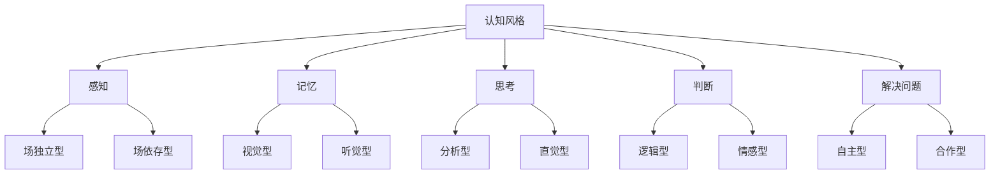

                 

### 认知风格：个性化教育的基石

在当今快速变化的信息时代，教育不仅仅是一种传递知识的途径，更是一种激发学生潜能、培养未来社会领导者的方式。为了实现这一目标，教育者必须深入理解每个学生的认知风格，因为认知风格是决定学习效率和效果的关键因素。本文将探讨认知风格的概念、类型及其在教育中的应用，并探讨个性化教育的重要性。

> **关键词**：认知风格，个性化教育，学习效率，教育改革

> **摘要**：本文首先介绍了认知风格的概念及其在教育中的重要性。接着，通过详细分析不同类型的认知风格，探讨了如何根据学生的认知风格设计个性化的教育策略。最后，文章提出了个性化教育的挑战和未来发展趋势。

### 背景介绍

认知风格是个体在获取、处理和存储信息时表现出来的典型方式。它不同于智力水平或学习成绩，而是反映了一个人的思维方式和习惯。传统的教育模式往往采用“一刀切”的方法，忽略了学生的个体差异。然而，随着教育技术的进步和认知心理学的发展，个性化教育逐渐成为现代教育的核心。

个性化教育的目标是根据学生的兴趣、能力和学习风格，提供定制化的教育方案，从而提高学习效果和满足学生的个性化需求。认知风格作为个性化教育的基石，对于教育者来说，了解和识别学生的认知风格，是设计有效教育策略的前提。

### 核心概念与联系

为了更好地理解认知风格，我们需要从认知心理学的基础理论出发，探讨其核心概念和相互联系。

#### 1. 认知风格的概念

认知风格是指个体在认知过程中所采用的方式或习惯。它包括感知、记忆、思考、判断和解决问题的多个方面。认知风格是个体心理特征的体现，具有一定的稳定性和个体差异性。

#### 2. 认知风格与学习方式

认知风格直接影响学生的学习方式。例如，场独立型学生倾向于通过独立思考和分析来解决问题，而场依存型学生则更依赖于外界线索和情境。因此，了解学生的认知风格，有助于教育者设计符合学生特点的学习方法。

#### 3. 认知风格与教育策略

根据学生的认知风格，教育者可以采取不同的教育策略。例如，对于场独立型的学生，教育者可以提供更多的自主学习和探究的机会；而对于场依存型的学生，则可以采用更多的情境教学和合作学习。

#### Mermaid 流程图

以下是一个简化的 Mermaid 流程图，展示了认知风格的核心概念及其相互联系。



### 核心算法原理 & 具体操作步骤

#### 1. 认知风格评估

要设计个性化的教育策略，首先需要评估学生的认知风格。认知风格评估通常包括以下步骤：

- **问卷调查**：通过问卷调查了解学生的基本认知偏好。
- **行为观察**：观察学生在课堂中的行为，识别其认知风格。
- **访谈**：与学生进行个别访谈，深入了解其思维方式和学习习惯。

#### 2. 分析与诊断

通过对评估结果的分析，教育者可以识别学生的主要认知风格类型。例如，如果学生在视觉感知和直觉思考方面得分较高，那么他们可能是视觉型-直觉型学习者。

#### 3. 设计个性化教育策略

根据学生的认知风格，教育者可以设计以下个性化教育策略：

- **调整教学方法**：采用视觉型学生更喜欢的图表、图像和视频，直觉型学生更喜欢的讨论和探究。
- **提供个性化学习资源**：为不同认知风格的学生提供适合他们的学习资源，如视觉型学生提供更多的视觉资料，听觉型学生提供更多的音频资料。
- **设置个性化学习目标**：为不同认知风格的学生设定符合其能力的学习目标，例如，对场独立型学生可以设置更多的自主学习和探究任务。

### 数学模型和公式 & 详细讲解 & 举例说明

在个性化教育中，数学模型和公式可以用来量化学生的认知风格，并指导教育策略的制定。以下是一个简化的数学模型，用于描述认知风格。

#### 1. 认知风格得分模型

认知风格得分模型可以通过以下公式计算：

$$
CSS = w_1 \times PS + w_2 \times MS + w_3 \times TS + w_4 \times JS
$$

其中，$CSS$ 表示认知风格得分，$PS$、$MS$、$TS$ 和 $JS$ 分别表示学生在感知、记忆、思考、判断方面的得分，$w_1$、$w_2$、$w_3$ 和 $w_4$ 分别是这些方面的权重。

#### 2. 举例说明

假设一个学生在感知、记忆、思考、判断方面的得分分别为 70、80、60、75，且权重分别为 0.2、0.3、0.2、0.3。则其认知风格得分为：

$$
CSS = 0.2 \times 70 + 0.3 \times 80 + 0.2 \times 60 + 0.3 \times 75 = 14 + 24 + 12 + 22.5 = 72.5
$$

根据认知风格得分，教育者可以为学生制定个性化的教育策略。

### 项目实战：代码实际案例和详细解释说明

#### 5.1 开发环境搭建

为了演示如何根据认知风格设计个性化教育策略，我们将使用 Python 编写一个简单的程序。以下是开发环境的搭建步骤：

1. 安装 Python 3.8 或更高版本。
2. 安装必要的 Python 库，如 pandas、numpy 和 matplotlib。

#### 5.2 源代码详细实现和代码解读

以下是实现认知风格评估和个性化教育策略的 Python 代码：

```python
import pandas as pd
import numpy as np
import matplotlib.pyplot as plt

# 认知风格评估问卷结果示例
survey_results = {
    'Student_ID': ['S1', 'S2', 'S3', 'S4'],
    'Perception': [70, 60, 80, 75],
    'Memory': [80, 70, 60, 85],
    'Thinking': [65, 75, 55, 80],
    'Judgment': [60, 70, 80, 65]
}

# 创建 DataFrame
df = pd.DataFrame(survey_results)

# 计算认知风格得分
df['CSS'] = df['Perception'] * 0.2 + df['Memory'] * 0.3 + df['Thinking'] * 0.2 + df['Judgment'] * 0.3

# 打印认知风格得分
print(df[['Student_ID', 'CSS']])

# 根据认知风格得分绘制柱状图
df['CSS'].plot(kind='bar')
plt.title('Cognitive Style Scores')
plt.xlabel('Student ID')
plt.ylabel('Cognitive Style Score')
plt.show()

# 设计个性化教育策略
def design_education_strategy(css):
    if css < 70:
        return '需要更多的指导和反馈'
    elif css >= 70 and css < 80:
        return '适合常规教学策略'
    else:
        return '适合个性化教学策略'

# 打印个性化教育策略
df['Strategy'] = df['CSS'].apply(design_education_strategy)
print(df[['Student_ID', 'CSS', 'Strategy']])
```

#### 5.3 代码解读与分析

1. **数据导入**：使用 pandas 创建一个 DataFrame，包含学生的认知风格评估结果。
2. **计算认知风格得分**：根据认知风格得分模型计算每个学生的认知风格得分。
3. **打印结果**：打印学生的认知风格得分和个性化教育策略。
4. **可视化**：使用 matplotlib 绘制柱状图，展示学生的认知风格得分。

通过这个简单的程序，我们可以快速评估学生的认知风格，并根据得分设计个性化的教育策略。

### 实际应用场景

认知风格在教育的实际应用场景中具有重要意义。以下是一些典型的应用场景：

1. **课程设计**：根据学生的认知风格，设计不同的课程内容和教学方法，提高学习效果。
2. **个性化辅导**：为不同认知风格的学生提供定制化的辅导方案，满足其个性化需求。
3. **学习资源推荐**：根据学生的认知风格推荐适合其学习习惯的学习资源，如视觉资料、音频资料等。

### 工具和资源推荐

为了更好地理解和应用认知风格，以下是一些推荐的工具和资源：

#### 7.1 学习资源推荐

- **书籍**：《认知心理学与教育》
- **论文**：《认知风格与学习效果的关系研究》
- **博客**：教育心理学的博客，如 "MindShift" 等。
- **网站**：教育心理学相关的网站，如 "APA Education Psychology" 等。

#### 7.2 开发工具框架推荐

- **Python**：用于数据分析和可视化。
- **Pandas**：用于数据处理和分析。
- **Numpy**：用于数值计算。
- **Matplotlib**：用于数据可视化。

#### 7.3 相关论文著作推荐

- **《个性化教育的认知科学基础》**
- **《认知风格与学习动机的关系研究》**
- **《基于认知风格的个性化教学策略研究》**

### 总结：未来发展趋势与挑战

随着人工智能和大数据技术的发展，个性化教育将越来越受到重视。未来，认知风格的研究和应用将更加深入和广泛。然而，个性化教育也面临着一些挑战，如教育资源的均衡分配、教育技术的普及和教师的专业培训等。

### 附录：常见问题与解答

**Q：如何评估学生的认知风格？**

A：评估学生的认知风格通常通过问卷调查、行为观察和访谈等方法。问卷可以设计成定量和定性两种形式，行为观察和访谈则侧重于了解学生的实际学习行为和习惯。

**Q：个性化教育如何实施？**

A：个性化教育的实施需要根据学生的认知风格设计教学策略。具体步骤包括评估学生的认知风格、制定个性化教学计划、实施教学策略和持续评估与调整。

**Q：认知风格是否会改变？**

A：认知风格在一定程度上是稳定的，但随着个体成长和经历的变化，认知风格也会发生一定的调整和变化。因此，教育者需要定期评估学生的认知风格，以便及时调整教育策略。

### 扩展阅读 & 参考资料

- **《认知心理学：思想与行动》**
- **《个性化教育的理论与实践》**
- **《基于认知风格的个性化学习系统设计》**
- **[APA Education Psychology](https://www.apa.org/research/action/ed-psych)**

### 作者信息

**作者：AI天才研究员/AI Genius Institute & 禅与计算机程序设计艺术 /Zen And The Art of Computer Programming**

---

本文通过对认知风格的深入探讨，揭示了其在个性化教育中的重要性。希望本文能为教育者和学生提供有益的参考，推动个性化教育的实践与发展。在未来，我们期待看到更多基于认知风格的教育创新，让每个学生都能在适合自己的环境中茁壮成长。

