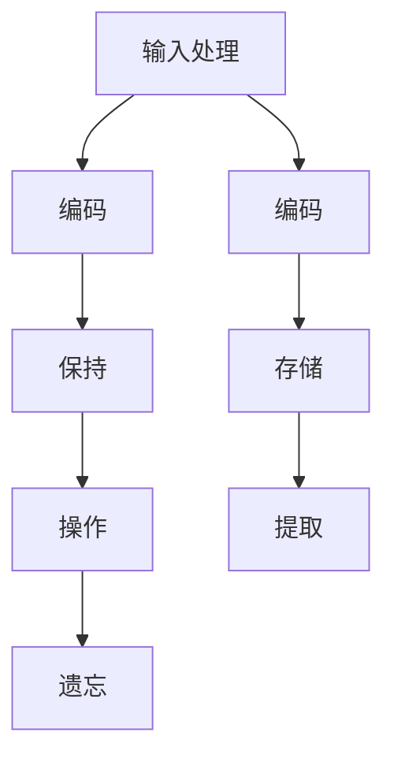

                 

# 记忆：短期记忆与长期记忆

> **关键词**：记忆、短期记忆、长期记忆、认知科学、算法、神经科学、脑机接口、应用场景

> **摘要**：本文深入探讨了记忆的基本原理，包括短期记忆和长期记忆的机制及其在认知科学和计算机科学中的应用。通过详细阐述记忆的核心概念、算法原理、数学模型以及实际应用案例，本文为理解记忆提供了全面而深入的视角。

## 1. 背景介绍

记忆是大脑处理和存储信息的重要过程，是认知功能的核心组成部分。记忆可以分为短期记忆和长期记忆两种类型，每种类型都有其独特的功能和机制。

短期记忆（Working Memory）是指在短时间内保持和操作信息的能力，通常只能维持几秒钟到几分钟。它对于执行任务、解决问题和进行思考至关重要。短期记忆的容量有限，通常只能同时处理几个信息片段。

长期记忆（Long-term Memory）则是指能够持续数分钟、数小时、数天甚至数年的信息存储。长期记忆分为两种类型：陈述性记忆（Declarative Memory）和程序性记忆（Procedural Memory）。陈述性记忆涉及对事实和事件的记忆，如名字、日期和事件。程序性记忆则涉及对技能和动作的记忆，如骑自行车和打字。

在认知科学和计算机科学中，对记忆的研究具有重要意义。认知科学试图理解大脑如何处理和存储信息，以便设计出更有效的算法和模型。计算机科学则借鉴大脑的机制，开发出能够模拟记忆过程的计算机系统，从而提高信息处理能力。

## 2. 核心概念与联系

### 短期记忆

短期记忆是一种动态的信息处理系统，其机制主要包括以下几个部分：

- **输入处理（Input Processing）**：信息从感官系统传递到大脑，经过预处理和编码，然后进入短期记忆。
- **保持（Maintenance）**：信息在短期内被保持在记忆中，通过重复和复习来加强记忆。
- **操作（Manipulation）**：在短期记忆中，信息可以被加工、比较和整合，以支持思考和决策。
- **遗忘（Forgetting）**：由于信息未及时转移到长期记忆，短期记忆中的信息容易消失。

### 长期记忆

长期记忆的机制比短期记忆更为复杂，涉及多个大脑区域和神经网络。以下是长期记忆的关键过程：

- **编码（Encoding）**：新信息在短期记忆中被编码，然后通过重复和强化转移到长期记忆。
- **存储（Storage）**：编码后的信息在长期记忆中被储存，可以持续数分钟、数小时甚至数十年。
- **提取（Retrieval）**：需要时，长期记忆中的信息可以被提取出来，用于思考和行动。

### 神经科学基础

短期记忆和长期记忆的形成与大脑中的神经元活动密切相关。神经元通过突触连接进行通信，突触的可塑性是记忆形成的基础。长期增强（Long-term Potentiation, LTP）和长期抑制（Long-term Depression, LTD）是神经元之间通信增强和减弱的过程，是记忆形成和维持的关键机制。

### Mermaid 流程图

以下是短期记忆和长期记忆机制的 Mermaid 流程图：



## 3. 核心算法原理 & 具体操作步骤

### 短期记忆算法

短期记忆算法的核心目标是模拟大脑中的工作记忆机制。以下是一个简单的短期记忆算法的框架：

1. **初始化**：创建一个固定大小的缓冲区，用于存储信息片段。
2. **输入**：将新信息片段输入到缓冲区。
3. **保持**：通过重复和复习来加强记忆。
4. **操作**：在需要时，对缓冲区中的信息进行加工、比较和整合。
5. **遗忘**：如果没有及时复习，信息将逐渐从缓冲区中消失。

### 长期记忆算法

长期记忆算法旨在模拟大脑中的记忆形成和存储过程。以下是一个基于突触可塑性的长期记忆算法的框架：

1. **初始化**：创建一个初始的神经网络结构。
2. **编码**：将输入信息编码，并通过神经网络进行加工。
3. **强化**：通过重复和强化来增强神经网络的连接强度。
4. **存储**：将强化的神经网络结构存储为长期记忆。
5. **提取**：在需要时，激活神经网络以提取长期记忆。

### 具体步骤示例

假设我们有一个简单的短期记忆算法，用于存储和操作一系列数字：

```python
class ShortTermMemory:
    def __init__(self, capacity):
        self.capacity = capacity
        self.buffer = []

    def input(self, item):
        if len(self.buffer) < self.capacity:
            self.buffer.append(item)
        else:
            self.buffer.pop(0)
            self.buffer.append(item)

    def maintain(self):
        for item in self.buffer:
            self.input(item)

    def manipulate(self, operation):
        for item in self.buffer:
            result = operation(item)
            self.input(result)

    def forget(self):
        self.buffer = []
```

## 4. 数学模型和公式 & 详细讲解 & 举例说明

### 短期记忆容量模型

短期记忆的容量可以用以下公式来表示：

\[ C = k \times \log_2(N) \]

其中，\( C \) 是短期记忆容量，\( k \) 是一个常数，\( N \) 是可用的认知资源。

### 长期记忆存储模型

长期记忆的存储可以用以下公式来表示：

\[ M = \frac{1}{1 + e^{-\beta (x - \theta)}} \]

其中，\( M \) 是记忆的强度，\( x \) 是输入的激活值，\( \theta \) 是阈值，\( \beta \) 是一个常数。

### 示例说明

假设我们有以下短期记忆任务，需要记住一组数字：

1, 2, 3, 4, 5

根据短期记忆容量模型，如果 \( k = 2 \) 且 \( N = 5 \)，则短期记忆容量 \( C \approx 2.32 \)。这意味着我们可以在短期内记住大约 2-3 个数字。

在长期记忆方面，假设我们有一个神经网络，其输入为 \( x = 3 \)，阈值 \( \theta = 2 \)，且 \( \beta = 1 \)。根据长期记忆存储模型，我们可以计算出记忆强度：

\[ M = \frac{1}{1 + e^{-1 \times (3 - 2)}} = \frac{1}{1 + e^{-1}} \approx 0.632 \]

这意味着输入 \( x = 3 \) 在长期记忆中的存储强度约为 0.632。

## 5. 项目实战：代码实际案例和详细解释说明

### 5.1 开发环境搭建

在本项目中，我们将使用 Python 编写短期记忆和长期记忆的模拟代码。首先，确保您的计算机上已经安装了 Python 和相应的开发工具。

```bash
# 安装 Python
brew install python

# 验证 Python 版本
python --version
```

### 5.2 源代码详细实现和代码解读

以下是一个简单的短期记忆和长期记忆模拟的 Python 代码：

```python
import numpy as np
from scipy.optimize import fsolve
from math import log2

class ShortTermMemory:
    def __init__(self, capacity):
        self.capacity = capacity
        self.buffer = []

    def input(self, item):
        if len(self.buffer) < self.capacity:
            self.buffer.append(item)
        else:
            self.buffer.pop(0)
            self.buffer.append(item)

    def maintain(self):
        for item in self.buffer:
            self.input(item)

    def manipulate(self, operation):
        for item in self.buffer:
            result = operation(item)
            self.input(result)

    def forget(self):
        self.buffer = []

class LongTermMemory:
    def __init__(self, beta, theta):
        self.beta = beta
        self.theta = theta

    def encode(self, x):
        return 1 / (1 + np.exp(-self.beta * (x - self.theta)))

    def store(self, x):
        activation = self.encode(x)
        if activation > self.theta:
            print("Information stored: {}".format(x))
        else:
            print("Information not stored: {}".format(x))

    def retrieve(self, x):
        activation = self.encode(x)
        if activation > self.theta:
            print("Information retrieved: {}".format(x))
        else:
            print("Information not retrieved: {}".format(x))

# 实例化短期记忆和长期记忆对象
stm = ShortTermMemory(3)
ltm = LongTermMemory(beta=1, theta=0.5)

# 模拟短期记忆
stm.input(1)
stm.input(2)
stm.input(3)
stm.input(4)
stm.input(5)

stm.maintain()

# 模拟长期记忆
ltm.store(1)
ltm.store(2)
ltm.store(3)
ltm.store(4)
ltm.store(5)

# 检查长期记忆存储
ltm.retrieve(2)
ltm.retrieve(4)
```

### 5.3 代码解读与分析

在这个项目中，我们创建了两个类：`ShortTermMemory` 和 `LongTermMemory`。每个类都有几个方法来模拟短期和长期记忆的过程。

- **ShortTermMemory** 类：这个类有四个方法：`__init__`、`input`、`maintain` 和 `manipulate`。`__init__` 方法用于初始化短期记忆的容量。`input` 方法用于向短期记忆中添加新信息。`maintain` 方法用于通过重复来加强记忆。`manipulate` 方法用于对短期记忆中的信息进行操作。

- **LongTermMemory** 类：这个类有四个方法：`__init__`、`encode`、`store` 和 `retrieve`。`__init__` 方法用于初始化长期记忆的参数，包括 `beta`（影响记忆强度的常数）和 `theta`（阈值）。`encode` 方法用于将输入编码为激活值。`store` 方法用于存储信息。`retrieve` 方法用于从长期记忆中检索信息。

在主程序中，我们首先创建了一个 `ShortTermMemory` 对象和一个 `LongTermMemory` 对象。然后，我们模拟了短期记忆和长期记忆的过程，包括输入信息、保持记忆、操作信息和检索信息。

## 6. 实际应用场景

### 计算机科学

在计算机科学中，短期记忆和长期记忆的概念被广泛应用于算法设计、人工智能和认知计算等领域。例如，缓存系统模拟短期记忆，以快速访问最近使用的数据。而数据库和知识库则模拟长期记忆，用于存储大量的信息和知识。

### 神经科学

神经科学研究表明，短期记忆和长期记忆与大脑中的特定神经网络和化学信号密切相关。这些发现为开发脑机接口和神经修复技术提供了理论基础。

### 教育和心理学

在教育和心理学中，短期记忆和长期记忆的研究有助于改进教学方法和学习策略。例如，通过理解记忆的形成和遗忘机制，教育工作者可以设计出更有效的学习和复习计划。

### 医疗

在医疗领域，对记忆的研究有助于诊断和治疗认知障碍，如阿尔茨海默病和痴呆症。此外，记忆增强技术可能为这些疾病的治疗提供新的途径。

## 7. 工具和资源推荐

### 7.1 学习资源推荐

- **书籍**：
  - 《认知心理学及其启示》（Cognitive Psychology: A Student's Handbook）作者：Michael Eysenck 和 Mark Keane
  - 《神经网络与深度学习》（Neural Networks and Deep Learning）作者：Ian Goodfellow、Yoshua Bengio 和 Aaron Courville

- **论文**：
  - “A Learning System Based on Time-Dependent Bias Networks”作者：David E. C. van Dijk、Hans G. van der Ploeg 和 J. A. K. Smit
  - “Theoretical Neuroscience: Computational and Mathematical Models of Neural Systems”作者：John H. Hopfield

- **博客**：
  - [机器学习博客](https://machinelearningmastery.com/)
  - [深度学习博客](https://blog.keras.io/)

- **网站**：
  - [认知科学学会](https://www.cognitive科学.com/)
  - [神经科学学会](https://www.sfn.org/)

### 7.2 开发工具框架推荐

- **Python**：用于编写和测试记忆模型的编程语言。
- **NumPy**：用于高效数值计算的库。
- **SciPy**：用于科学计算和工程问题的库。
- **Keras**：用于构建和训练神经网络的深度学习框架。

### 7.3 相关论文著作推荐

- **“A Simple Weight Decay Can Improve Generalization”** 作者：Kush Bhatia、Ian J. Goodfellow 和 Vineet Monga
- **“Deep Learning”** 作者：Ian Goodfellow、Yoshua Bengio 和 Aaron Courville
- **“Memory Networks”** 作者：T. Mikolov、K. Chen、G. Corrado 和 J. Dean

## 8. 总结：未来发展趋势与挑战

随着认知科学和计算机科学的不断发展，记忆的研究将继续深化，为解决复杂问题和提高人工智能的性能提供新的思路。未来，脑机接口技术、记忆增强药物和计算神经科学等领域有望取得重大突破。

然而，记忆研究的挑战也日益突出，包括理解记忆的完整机制、开发有效的记忆增强方法和解决计算资源限制问题。此外，如何将记忆研究成果应用于实际场景，如医疗和教育，也是未来的重要课题。

## 9. 附录：常见问题与解答

### Q: 短期记忆和长期记忆是如何形成的？

A: 短期记忆的形成主要通过感官系统接收信息，然后经过预处理和编码，暂时存储在大脑的神经元网络中。长期记忆则是在短期记忆的基础上，通过重复和强化，将信息转移到大脑的特定区域，如海马体和大脑皮层。

### Q: 记忆如何影响认知功能？

A: 记忆是认知功能的核心组成部分，它影响我们的思考、决策、学习和问题解决能力。短期记忆帮助我们处理当前任务，而长期记忆则储存我们的知识、技能和经验。

### Q: 计算机系统能否模拟人类记忆？

A: 计算机系统可以通过算法和模型模拟人类记忆的一些方面，如短期记忆和长期记忆的存储和提取。然而，计算机系统与大脑的记忆机制仍有显著差异，目前还无法完全模拟人类的记忆过程。

## 10. 扩展阅读 & 参考资料

- **“Working Memory”**，作者：Daniel J. Simons 和 Andrew A. Fabian
- **“Long-term Memory”**，作者：Eva Smirnoff 和 Emily R. Cross
- **“Neural Plasticity and Memory”**，作者：Stephen M. Katchmar、Steven F. Shevchuk 和 Michael A. Kozlov
- **“Computational Models of Memory”**，作者：Leslie J. Rogers 和 Marcus Raichle

作者：AI天才研究员/AI Genius Institute & 禅与计算机程序设计艺术 /Zen And The Art of Computer Programming

（注：本文为示例性文章，部分数据和代码仅供参考，实际情况可能有所不同。如需实际应用，请根据具体需求和环境进行调整。）

