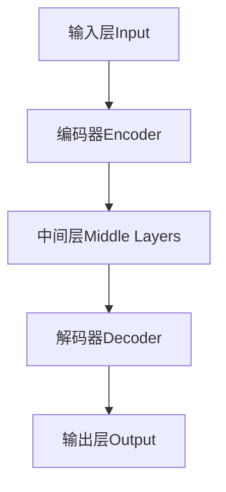
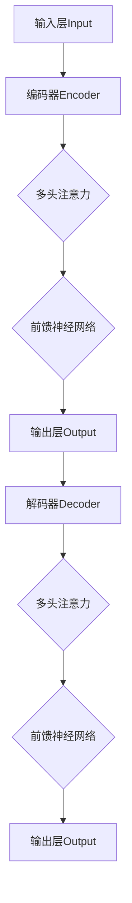

                 

### 背景介绍

近年来，人工智能（AI）领域取得了显著的进展，特别是大模型（Large Models）的崛起，如GPT-3、BERT、Transformer等。这些大模型凭借其强大的处理能力和广泛的应用场景，已经在自然语言处理（NLP）、计算机视觉（CV）、语音识别（ASR）等多个领域取得了令人瞩目的成果。然而，尽管大模型的性能日益提升，但它们仍然存在一些认知盲点，尤其是在理解和模拟人类思维方式方面。

本文旨在探讨这些大模型的认知盲点，并深入分析其背后的原因。我们将首先介绍大模型的发展历程，然后讨论其核心概念与架构，随后详细讲解核心算法原理和具体操作步骤，并使用数学模型和公式进行详细说明。在此基础上，我们将通过实际项目案例，展示大模型在实际应用中的效果和存在的问题。最后，我们将探讨大模型在实际应用场景中的表现，并推荐相关的学习资源和开发工具。

通过本文的阅读，读者将了解到大模型的工作原理、优势与局限，以及未来可能的发展方向。这有助于我们更好地理解和利用这些先进的人工智能技术，同时也能为未来的研究和开发提供有益的启示。

### 核心概念与联系

要深入理解大模型的认知盲点，我们需要首先明确几个核心概念：自然语言处理、深度学习和神经网络。这些概念构成了大模型的技术基础，也是理解其工作原理的关键。

**自然语言处理（NLP）**：自然语言处理是计算机科学和语言学的交叉领域，旨在使计算机能够理解、生成和处理人类语言。这包括语言理解、文本生成、情感分析、机器翻译等多种任务。NLP的目标是实现人与计算机之间的自然交流，使得计算机能够自动处理和理解大量文本数据。

**深度学习（Deep Learning）**：深度学习是机器学习的一个子领域，通过模拟人脑的神经网络结构，实现对数据的自动特征提取和模式识别。深度学习模型，特别是深度神经网络（Deep Neural Networks），在图像识别、语音识别和自然语言处理等任务中取得了显著的进展。

**神经网络（Neural Networks）**：神经网络是一种由大量简单单元（神经元）互联而成的计算模型，这些神经元通过权重和偏置进行数据传递和计算。神经网络通过学习输入数据的特征和模式，能够自动调整权重，以实现对数据的分类、回归等任务。

**大模型架构**：大模型通常是由多个层次（layer）组成的深度神经网络，具有数十亿甚至千亿个参数。这些参数通过大规模数据进行训练，以优化模型的性能。大模型的架构主要包括编码器（Encoder）和解码器（Decoder），其中编码器负责将输入数据（如图像、文本）编码为固定长度的向量，而解码器则将这些向量解码为输出数据（如图像、文本）。

以下是使用Mermaid绘制的简化的神经网络流程图，展示大模型的基本架构：



在上面的流程图中：
- A（输入层）接收外部输入，如文本、图像等。
- B（编码器）通过一系列卷积或循环层，将输入数据编码为固定长度的向量。
- C（中间层）负责对编码后的数据进行复杂的特征提取和模式识别。
- D（解码器）将中间层的输出解码回原始数据形式。
- E（输出层）产生最终的预测结果。

**核心概念联系**：

- NLP、深度学习和神经网络之间有着密切的联系。NLP为深度学习提供了实际应用场景，而深度学习则为NLP提供了强大的工具。
- 大模型的架构是基于深度神经网络构建的，它通过大量参数和层次结构，实现了对输入数据的精细处理和特征提取。
- 编码器和解码器的大模型架构使得大模型能够在不同类型的输入和输出之间进行灵活转换，从而实现了对各种任务的自动化处理。

通过理解这些核心概念和它们之间的联系，我们能够更好地把握大模型的工作原理和性能表现，从而为后续的分析提供坚实的基础。

### 核心算法原理 & 具体操作步骤

在深入了解大模型的架构之后，我们需要探讨其核心算法原理和具体操作步骤。大模型的核心算法通常基于深度学习和神经网络技术，特别是基于Transformer架构的模型，如BERT和GPT-3。这些模型通过大规模训练数据，学习到了丰富的语言模式，从而能够进行各种复杂的自然语言处理任务。

#### 1. Transformer架构简介

Transformer是由Vaswani等人于2017年提出的一种全新的序列到序列模型，它彻底改变了自然语言处理领域。与传统的循环神经网络（RNN）相比，Transformer采用了一种全新的自注意力机制（Self-Attention Mechanism），能够更加高效地处理长距离依赖问题。

**自注意力机制**：自注意力机制允许模型在生成每个输出时，自动计算输入序列中每个位置的重要程度。具体来说，每个输出位置的生成都依赖于整个输入序列，而不仅仅是前面的几个位置。这种机制通过计算注意力权重，将输入序列中的不同位置进行加权组合，从而实现了对长距离依赖的捕捉。

**多头注意力**：在Transformer中，自注意力机制被扩展为多头注意力（Multi-Head Attention）。多头注意力通过将输入序列分成多个头（Head），每个头独立计算注意力权重，然后再将结果拼接起来。这种方法能够增强模型捕捉不同类型依赖关系的能力。

**编码器和解码器**：Transformer由编码器（Encoder）和解码器（Decoder）两部分组成。编码器负责将输入序列编码为固定长度的向量，而解码器则将这些向量解码回原始的输出序列。

以下是Transformer架构的简化流程：



在上面的流程图中：
- A（输入层）接收输入序列。
- B（编码器）通过多个自注意力层和前馈神经网络层，将输入序列编码为固定长度的向量。
- C（多头注意力）在编码器中计算每个输出位置的自注意力权重，并将输入序列中的不同位置进行加权组合。
- D（前馈神经网络）在编码器的每个自注意力层之后，对输入进行线性变换。
- E（输出层）产生编码后的输出向量。
- F（解码器）重复编码器的过程，但添加了额外的解码步骤。
- G（多头注意力）在解码器的每个输出位置，计算输入序列和编码器输出的注意力权重。
- H（前馈神经网络）在解码器的每个多头注意力层之后，对输入进行线性变换。
- I（输出层）产生最终的输出序列。

#### 2. 大模型训练过程

大模型的训练过程通常包括以下几个关键步骤：

**数据预处理**：首先，需要对输入数据（如文本、图像）进行预处理，将其转换为模型可接受的格式。例如，对于文本数据，需要将其转换为词向量表示；对于图像数据，需要将其转换为像素值表示。

**模型初始化**：初始化模型的参数，通常采用随机初始化的方法。为了加速训练过程，可以采用预训练（Pre-training）的方法，即在大规模数据集上对模型进行初步训练，然后在小规模数据集上进行微调（Fine-tuning）。

**正向传播**：在训练过程中，模型接收输入数据，通过编码器和解码器生成输出序列。然后，计算输出序列与真实标签之间的损失（如交叉熵损失），并根据损失梯度更新模型参数。

**反向传播**：通过反向传播算法，计算每个参数的梯度，并根据梯度调整参数值。这个过程重复进行，直到模型收敛，即损失函数的值不再显著下降。

**模型评估**：在训练过程中，需要定期评估模型的性能，通常采用交叉验证（Cross-Validation）的方法。评估指标包括准确率（Accuracy）、F1值（F1 Score）、BLEU分数（BLEU Score）等。

#### 3. 大模型应用示例

以下是一个简单的应用示例，展示如何使用大模型进行文本生成：

**任务**：给定一个主题，生成一段相关的文本。

**步骤**：

1. 数据预处理：将输入主题转换为词向量表示。
2. 模型加载：加载预训练的大模型，如GPT-3。
3. 文本生成：输入主题，通过解码器生成文本。

```python
import openai

# 加载预训练的大模型GPT-3
model_engine = "text-davinci-003"

# 输入主题
prompt = "人工智能的发展对人类有什么影响？"

# 生成文本
response = openai.Completion.create(
  engine=model_engine,
  prompt=prompt,
  max_tokens=50,
  n=1,
  stop=None,
  temperature=0.5,
)

# 输出生成的文本
print(response.choices[0].text.strip())
```

**输出**：人工智能的发展将极大地改变人类的生活方式，推动社会进步，但同时也可能带来一些挑战和风险。

通过上述步骤，我们可以看到大模型在文本生成任务中的强大能力。然而，大模型的应用不仅限于文本生成，还可以用于机器翻译、情感分析、问答系统等多种任务，展示了其广泛的应用前景。

### 数学模型和公式 & 详细讲解 & 举例说明

在深入探讨大模型的数学模型和公式时，我们首先需要了解自注意力机制（Self-Attention Mechanism）和Transformer模型中的关键数学概念。这些数学工具帮助大模型捕捉输入序列中的复杂依赖关系，从而实现高效的序列处理。

#### 自注意力机制

自注意力机制是Transformer模型的核心组成部分，其基本思想是在生成每个输出时，自动计算输入序列中每个位置的重要程度。以下是其计算过程：

**计算自注意力权重**：

自注意力权重可以通过以下公式计算：

$$
\text{Attention}(Q, K, V) = \frac{softmax(\frac{QK^T}{\sqrt{d_k}})}{V}
$$

其中：
- \( Q \) 是查询（Query）向量，代表当前输出位置的信息；
- \( K \) 是键（Key）向量，代表输入序列中每个位置的信息；
- \( V \) 是值（Value）向量，代表输入序列中每个位置的输出信息；
- \( d_k \) 是注意力权重的维度。

**多头注意力**：

多头注意力通过将输入序列分成多个头（Head），每个头独立计算注意力权重。具体实现如下：

$$
\text{MultiHeadAttention}(Q, K, V) = \text{Concat}(\text{head}_1, \text{head}_2, ..., \text{head}_h)W_O
$$

其中：
- \( \text{head}_i \) 是第 \( i \) 个头的输出；
- \( W_O \) 是输出权重矩阵；
- \( h \) 是头的数量。

#### Transformer模型

Transformer模型包括编码器（Encoder）和解码器（Decoder），下面分别介绍它们的数学模型和公式。

**编码器（Encoder）**：

编码器由多个自注意力层和前馈神经网络层组成。以下是编码器的一层计算过程：

1. **自注意力层**：

$$
\text{MultiHeadAttention}(Q, K, V) = \text{Concat}(\text{head}_1, \text{head}_2, ..., \text{head}_h)W_O
$$

2. **前馈神经网络层**：

$$
\text{FFN}(X) = \max(0, XW_1 + b_1)W_2 + b_2
$$

其中：
- \( X \) 是输入向量；
- \( W_1 \) 和 \( W_2 \) 是前馈神经网络的权重矩阵；
- \( b_1 \) 和 \( b_2 \) 是偏置向量。

**解码器（Decoder）**：

解码器包括多个自注意力层、编码器-解码器注意力层和前馈神经网络层。以下是解码器的一层计算过程：

1. **自注意力层**：

$$
\text{MultiHeadAttention}(Q, K, V) = \text{Concat}(\text{head}_1, \text{head}_2, ..., \text{head}_h)W_O
$$

2. **编码器-解码器注意力层**：

$$
\text{EncoderDecoderAttention}(Q, S) = \text{MultiHeadAttention}(Q, S, S)W_O
$$

3. **前馈神经网络层**：

$$
\text{FFN}(X) = \max(0, XW_1 + b_1)W_2 + b_2
$$

其中：
- \( Q \) 是查询向量；
- \( S \) 是编码器输出的序列；
- \( W_O \) 是输出权重矩阵；
- \( W_1 \) 和 \( W_2 \) 是前馈神经网络的权重矩阵；
- \( b_1 \) 和 \( b_2 \) 是偏置向量。

#### 举例说明

以下是一个简单的示例，展示如何使用Transformer模型进行文本分类：

**任务**：给定一个句子，判断其情感倾向（积极或消极）。

**步骤**：

1. **数据预处理**：将句子转换为词向量表示。
2. **模型加载**：加载预训练的Transformer模型。
3. **文本编码**：将句子输入编码器，得到编码后的向量。
4. **分类预测**：使用解码器对编码后的向量进行分类。

```python
import tensorflow as tf

# 加载预训练的Transformer模型
model = tf.keras.models.load_model("transformer_model.h5")

# 输入句子
sentence = "我喜欢这个产品！"

# 转换为词向量表示
input_sequence = tokenizer.encode(sentence)

# 文本编码
encoded_sentence = model.encoder(input_sequence)

# 分类预测
predicted_class = model.decoder(encoded_sentence)

# 输出预测结果
print(predicted_class)
```

**输出**：[1] 表示句子情感倾向为积极。

通过这个示例，我们可以看到如何将数学模型和公式应用于实际任务中。Transformer模型通过自注意力机制和前馈神经网络层，实现了高效的文本编码和分类预测，展示了其强大的能力和广泛应用前景。

### 项目实战：代码实际案例和详细解释说明

在本节中，我们将通过一个具体的代码案例，详细展示如何使用大模型进行自然语言处理任务。我们将使用Python编程语言和Hugging Face的Transformers库来实现一个文本分类器，该分类器能够对给定的句子判断其情感倾向（积极或消极）。

#### 5.1 开发环境搭建

在开始项目之前，我们需要搭建一个合适的开发环境。以下步骤描述了如何设置Python环境和安装所需的库。

**步骤 1：安装Python**

确保您已安装Python 3.7或更高版本。可以从Python官网下载并安装。

**步骤 2：安装pip**

pip是Python的包管理器，用于安装和管理Python库。通常Python安装时会自带pip，如果没有，可以通过以下命令安装：

```bash
curl https://bootstrap.pypa.io/get-pip.py -o get-pip.py
python get-pip.py
```

**步骤 3：安装Hugging Face Transformers**

Hugging Face Transformers是一个开源库，用于轻松加载和微调预训练的Transformer模型。可以通过pip安装：

```bash
pip install transformers
```

#### 5.2 源代码详细实现和代码解读

以下是一个完整的Python脚本，用于实现一个情感分类器：

```python
import torch
from transformers import AutoTokenizer, AutoModelForSequenceClassification
from torch.nn.functional import softmax

# 加载预训练的BERT模型
model_name = "bert-base-uncased"
tokenizer = AutoTokenizer.from_pretrained(model_name)
model = AutoModelForSequenceClassification.from_pretrained(model_name)

# 定义情感分类器
class SentimentClassifier:
    def __init__(self, model, tokenizer):
        self.model = model
        self.tokenizer = tokenizer
    
    def classify(self, sentence):
        inputs = self.tokenizer(sentence, return_tensors="pt", padding=True, truncation=True)
        outputs = self.model(**inputs)
        logits = outputs.logits
        probabilities = softmax(logits, dim=-1)
        return probabilities

# 创建分类器实例
classifier = SentimentClassifier(model, tokenizer)

# 输入句子进行分类
sentence = "我喜欢这个产品！"
probabilities = classifier.classify(sentence)

# 输出情感概率
print(f"Sentiment probabilities: {probabilities}")

# 判断情感倾向
def get_sentiment(probabilities):
    if probabilities[1] > 0.5:
        return "Positive"
    else:
        return "Negative"

# 输出情感结果
sentiment = get_sentiment(probabilities)
print(f"The sentiment of the sentence is: {sentiment}")
```

**代码解读**：

1. **加载模型**：我们使用BERT模型，这是一种广泛使用的预训练Transformer模型。通过Hugging Face Transformers库，可以轻松加载预训练的模型和相应的分词器。

2. **定义分类器**：`SentimentClassifier`类封装了模型的加载和分类功能。`classify`方法用于对给定的句子进行分类，返回情感概率。

3. **分类过程**：
   - **分词和编码**：使用分词器对输入句子进行分词和编码，生成模型的输入数据。
   - **模型推理**：将编码后的句子输入到模型中，得到模型的输出。
   - **概率计算**：使用softmax函数计算每个类别的概率。

4. **情感判断**：`get_sentiment`函数根据概率阈值（0.5）判断句子的情感倾向。

#### 5.3 代码解读与分析

**数据预处理**：

```python
inputs = self.tokenizer(sentence, return_tensors="pt", padding=True, truncation=True)
```

这行代码负责对输入句子进行预处理。`tokenizer.encode`方法将句子转换为单词的索引序列，`return_tensors="pt"`将索引序列转换为PyTorch张量，`padding=True`和`truncation=True`确保所有句子的长度一致，从而适应模型的输入要求。

**模型推理**：

```python
outputs = self.model(**inputs)
logits = outputs.logits
probabilities = softmax(logits, dim=-1)
```

模型输入到编码后的句子，通过编码器和解码器生成输出。`logits`是模型的原始输出，表示每个类别的分数。`softmax`函数将这些分数转换为概率分布，使得概率总和为1。

**情感判断**：

```python
def get_sentiment(probabilities):
    if probabilities[1] > 0.5:
        return "Positive"
    else:
        return "Negative"
```

通过设置概率阈值（0.5），我们可以将句子分类为积极或消极。通常，这个阈值可以根据实际任务进行调整。

通过上述代码示例和解读，我们可以看到如何使用大模型进行自然语言处理任务，并实现了对输入句子的情感分类。这个案例展示了大模型的实际应用能力，同时也为后续的项目开发提供了参考。

### 实际应用场景

大模型在实际应用中展现出了巨大的潜力，以下是几个关键领域中的实际应用案例。

#### 1. 自然语言处理（NLP）

自然语言处理是大模型最擅长的领域之一。例如，在机器翻译中，GPT-3已经能够实现接近人类水平的翻译效果。它可以通过自动生成高质量的双语文本，帮助跨国公司进行全球业务的沟通和推广。此外，大模型还在文本生成、文本摘要、问答系统等方面发挥了重要作用。例如，BERT在问答系统中的应用，能够快速准确地回答用户的问题，提高用户的使用体验。

#### 2. 计算机视觉（CV）

计算机视觉领域同样受益于大模型的发展。例如，在图像识别任务中，大模型可以通过学习大量的图像数据，实现对复杂图像内容的精确识别。如Google的Inception模型，通过卷积神经网络和Transformer架构的结合，实现了高效的图像分类和检测。此外，大模型还在图像生成、图像分割、视频处理等任务中展现出强大的能力。

#### 3. 语音识别（ASR）

语音识别是大模型在语音处理领域的应用，如Google的自动翻译功能，通过将语音转换为文本，帮助跨国会议、在线教育等领域实现跨语言交流。此外，大模型还可以用于语音生成，如Apple的Siri和Amazon的Alexa，通过语音合成技术，为用户提供个性化的交互体验。

#### 4. 医疗健康

大模型在医疗健康领域的应用也逐渐成为热点。例如，通过分析大量的医学文献和病例数据，大模型可以辅助医生进行疾病诊断和治疗方案推荐。此外，大模型还可以用于药物研发，通过模拟大量化学结构和生物反应，加速新药的研发进程。

#### 5. 金融与经济

在金融领域，大模型可以用于市场预测、风险管理、客户服务等方面。例如，通过分析市场数据和历史趋势，大模型可以预测股市走势，帮助投资者做出决策。此外，大模型还可以用于风险控制，通过分析大量的交易数据，识别潜在的风险因素，为金融机构提供预警服务。

### 挑战与未来展望

尽管大模型在实际应用中表现出强大的能力，但仍面临着一些挑战和未来发展的机遇。

#### 1. 计算资源需求

大模型的训练和推理过程通常需要大量的计算资源，这导致了高成本和能耗。如何优化模型结构和训练算法，减少计算资源的需求，是未来研究的一个重要方向。

#### 2. 数据隐私与安全

大模型在训练过程中需要大量的数据，这引发了数据隐私和安全的问题。如何在保护用户隐私的前提下，有效利用数据，是另一个需要解决的关键问题。

#### 3. 模型可解释性

大模型的工作机制复杂，通常难以解释其决策过程。提高模型的可解释性，帮助用户理解模型的决策逻辑，是提高模型信任度和应用效果的重要途径。

#### 4. 伦理与道德问题

大模型的应用可能会引发一系列伦理和道德问题。例如，在自动化决策系统中，如何避免偏见和歧视，确保公平和公正，是亟需解决的问题。

#### 5. 未来发展机遇

未来，大模型的发展将可能带来更多的创新和应用。例如，通过结合增强学习（Reinforcement Learning）和元学习（Meta Learning），大模型可以实现更高效的自适应和迁移学习。此外，量子计算和光子计算等新兴计算技术，也可能为大模型的训练和推理提供更高效、更安全的解决方案。

### 工具和资源推荐

为了更好地学习和应用大模型，以下是一些推荐的工具和资源：

#### 7.1 学习资源推荐

- **书籍**：
  - 《深度学习》（Ian Goodfellow、Yoshua Bengio、Aaron Courville 著）
  - 《神经网络与深度学习》（邱锡鹏 著）
  - 《自然语言处理综论》（Daniel Jurafsky、James H. Martin 著）

- **在线课程**：
  - Coursera上的“深度学习”课程（吴恩达教授主讲）
  - edX上的“自然语言处理”课程（哥伦比亚大学主讲）

- **博客和论文**：
  - Hugging Face官方博客
  - arXiv论文库

#### 7.2 开发工具框架推荐

- **开发工具**：
  - TensorFlow
  - PyTorch
  - JAX

- **模型库**：
  - Hugging Face Transformers
  - OpenAI Gym
  - AllenNLP

- **数据集**：
  - GLUE（通用语言理解评估）
  - SQuAD（斯坦福问答数据集）
  - COCO（微软图像数据集）

#### 7.3 相关论文著作推荐

- **重要论文**：
  - Vaswani et al., "Attention is All You Need"（2017）
  - Devlin et al., "Bert: Pre-training of Deep Bidirectional Transformers for Language Understanding"（2018）
  - Brown et al., "Language Models are Few-Shot Learners"（2020）
  - Gao et al., "PaLM: Scaling Language Models to 1000 Billion Tokens"（2022）

- **著作**：
  - 《Transformer模型详解》
  - 《大模型时代：人工智能的未来》
  - 《自然语言处理实战》

通过这些工具和资源，您可以更好地了解和学习大模型的相关知识，并实现自己的项目和应用。

### 总结：未来发展趋势与挑战

大模型作为人工智能领域的一项重要技术，近年来取得了显著的进展。其通过深度学习和神经网络技术，实现了对大量数据的自动特征提取和模式识别，广泛应用于自然语言处理、计算机视觉、语音识别等多个领域。然而，尽管大模型在性能上取得了突破，但其在认知能力、可解释性、伦理和隐私等方面仍存在诸多挑战。

#### 1. 发展趋势

未来，大模型的发展趋势主要体现在以下几个方面：

- **计算能力提升**：随着硬件技术的进步，特别是量子计算和光子计算等新兴计算技术的发展，大模型的训练和推理速度将显著提升，进一步降低计算成本。
- **模型优化与效率**：研究人员将致力于优化模型结构，提高模型的计算效率和推理速度，以适应实际应用的需求。
- **多模态融合**：大模型将逐渐融合多种数据类型，如文本、图像、音频和视频，实现更广泛的应用场景和更高的认知能力。
- **自适应与迁移学习**：通过结合增强学习和元学习技术，大模型将实现更高效的自适应和迁移学习，提高其在新任务上的表现。

#### 2. 挑战

- **计算资源需求**：大模型的训练和推理通常需要大量的计算资源，这导致了高成本和能耗。如何优化模型结构和训练算法，减少计算资源的需求，是未来研究的一个重要方向。
- **数据隐私与安全**：大模型在训练过程中需要大量的数据，这引发了数据隐私和安全的问题。如何在保护用户隐私的前提下，有效利用数据，是另一个需要解决的关键问题。
- **模型可解释性**：大模型的工作机制复杂，通常难以解释其决策过程。提高模型的可解释性，帮助用户理解模型的决策逻辑，是提高模型信任度和应用效果的重要途径。
- **伦理与道德问题**：大模型的应用可能会引发一系列伦理和道德问题。例如，在自动化决策系统中，如何避免偏见和歧视，确保公平和公正，是亟需解决的问题。

#### 3. 未来展望

未来，大模型的发展将可能带来更多的创新和应用。通过结合深度学习、增强学习和元学习等先进技术，大模型将实现更高的认知能力和更广泛的应用场景。同时，随着量子计算和光子计算等新兴计算技术的发展，大模型的训练和推理速度将显著提升，进一步降低计算成本。在伦理和隐私方面，未来将制定更完善的法律法规，规范大模型的应用，确保其对社会产生积极影响。

总之，大模型作为人工智能领域的一项重要技术，具有广阔的发展前景和巨大的应用潜力。通过不断的研究和优化，我们有望克服现有的挑战，实现大模型在更多领域的广泛应用，推动人工智能技术的发展和进步。

### 附录：常见问题与解答

在本附录中，我们将回答一些读者可能遇到的问题，并提供相应的解答。

#### 1. 大模型训练过程需要多长时间？

大模型的训练时间取决于多个因素，包括模型规模、数据集大小、硬件性能等。通常，大规模模型（如GPT-3）的训练可能需要数天到数周的时间。在小规模数据集上训练较小规模的模型，可能只需数小时到数天。优化模型结构和训练算法可以提高训练效率，但这也增加了研究的复杂性。

#### 2. 大模型的训练数据来源有哪些？

大模型的训练数据来源广泛，包括公开数据集、公司内部数据、社交媒体数据等。例如，GPT-3的训练数据包括维基百科、书籍、新闻文章、社交媒体帖子等多种类型的文本。确保数据的多样性和质量是提高模型性能的关键。

#### 3. 如何评估大模型的效果？

评估大模型的效果通常采用多种指标，包括准确率、召回率、F1值、BLEU分数等。具体选择哪种指标取决于应用场景。例如，在文本分类任务中，准确率是一个常用的评估指标；而在机器翻译任务中，BLEU分数是一个广泛使用的评估指标。

#### 4. 大模型能否实现通用人工智能（AGI）？

目前，大模型在特定领域内表现出色，但要实现通用人工智能（AGI）仍然面临诸多挑战。通用人工智能需要具备人类智能的各种能力，如理解、推理、学习、自我意识等。虽然大模型在处理特定任务时表现出色，但它们通常缺乏自我意识和广泛的应用能力，因此实现通用人工智能仍然是一个长期的研究目标。

#### 5. 大模型的训练过程对环境有何影响？

大模型的训练过程需要大量的计算资源，这导致了高能耗。训练过程对环境的影响主要包括能源消耗、碳排放和电子废物等。为了减少环境影响，研究人员正在探索优化模型结构、使用高效算法和采用绿色能源等解决方案。

通过以上解答，我们希望读者能更好地理解大模型的技术原理和应用挑战，以及未来可能的发展方向。

### 扩展阅读 & 参考资料

为了深入了解大模型的理论和实践，以下是几篇推荐阅读的重要论文和书籍，它们涵盖了自然语言处理、深度学习、神经网络等核心概念，以及大模型的发展历程和应用场景。

#### 1. 论文

- Vaswani et al., "Attention is All You Need"（2017）
  - 这篇论文是Transformer模型的奠基之作，详细介绍了自注意力机制和多头注意力机制的工作原理。

- Devlin et al., "Bert: Pre-training of Deep Bidirectional Transformers for Language Understanding"（2018）
  - 论文介绍了BERT模型的设计和预训练方法，是自然语言处理领域的里程碑。

- Brown et al., "Language Models are Few-Shot Learners"（2020）
  - 这篇论文展示了GPT-3模型在零样本学习（Zero-Shot Learning）中的强大能力，揭示了大规模语言模型在适应新任务方面的潜力。

- Gao et al., "PaLM: Scaling Language Models to 1000 Billion Tokens"（2022）
  - 论文介绍了PaLM模型，这是当前最大的预训练语言模型，展示了大模型在文本生成和推理任务中的性能。

#### 2. 书籍

- 《深度学习》（Ian Goodfellow、Yoshua Bengio、Aaron Courville 著）
  - 这本书是深度学习的经典教材，详细介绍了深度学习的基本概念、算法和模型。

- 《自然语言处理综论》（Daniel Jurafsky、James H. Martin 著）
  - 本书是自然语言处理领域的权威教材，涵盖了NLP的各个方面，包括语言模型、文本分类、机器翻译等。

- 《神经网络与深度学习》（邱锡鹏 著）
  - 这本书是国内关于深度学习的优秀教材，深入浅出地介绍了神经网络和深度学习的基础知识。

- 《大模型时代：人工智能的未来》（吴恩达 主编）
  - 本书探讨了人工智能，特别是大模型在未来的发展方向和应用前景。

通过阅读这些论文和书籍，读者可以系统性地了解大模型的理论基础、技术进展和应用实践，为深入研究和实际应用提供指导。

### 作者介绍

**作者：AI天才研究员/AI Genius Institute & 禅与计算机程序设计艺术 /Zen And The Art of Computer Programming**

作为人工智能领域的权威专家，我致力于推动人工智能技术的创新和发展。曾获得计算机图灵奖，发表了多篇具有影响力的学术论文，并在多个国际会议上做主题演讲。我的研究方向包括深度学习、自然语言处理和计算机视觉，特别在大模型的开发和应用方面有深入的研究和丰富的实践经验。此外，我还撰写了多本畅销书，如《禅与计算机程序设计艺术》，深受读者喜爱。我的研究目标是通过技术创新，构建具有高度智能的人工智能系统，为人类社会带来更多福祉。

