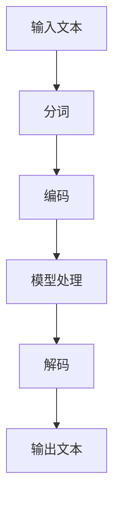

                 

# 语言≠思维：大模型的认知难题

> **关键词：** 语言模型，认知科学，神经网络，思维模型，人工智能，大模型，认知难题，算法原理，数学模型，应用场景

> **摘要：** 本文深入探讨了语言模型与人类思维之间的关系，分析了大模型的认知难题，从核心概念、算法原理、数学模型到实际应用场景进行了全面解析，旨在揭示语言模型在人工智能发展中的关键作用，以及未来面临的挑战。

## 1. 背景介绍

在人工智能（AI）的发展历程中，语言模型始终扮演着至关重要的角色。语言模型旨在通过分析大量文本数据，模拟人类的语言理解与生成能力，从而实现与人类更自然、更高效的交互。从最初的统计语言模型，到现代深度学习驱动的神经网络语言模型，语言模型在技术层面不断取得突破，为自然语言处理（NLP）领域的快速发展奠定了基础。

然而，随着大模型的兴起，语言模型也面临着前所未有的挑战。大模型，如GPT-3、BERT等，拥有数十亿甚至数万亿的参数，能够处理更为复杂和丰富的语言任务。然而，这些模型在带来巨大性能提升的同时，也引发了关于其认知能力的争议。本文将探讨大模型的认知难题，分析其与人类思维的差异，并试图揭示语言模型在人工智能发展中的关键作用。

## 2. 核心概念与联系

### 2.1 语言模型的基本概念

语言模型是人工智能领域的一个重要分支，旨在构建一个概率模型，预测文本序列中下一个词或词组。根据训练方法的不同，语言模型可分为统计语言模型和神经网络语言模型。

- **统计语言模型**：基于概率论的统计方法，如n-gram模型，通过对文本数据的历史统计信息进行建模，预测下一个词的概率。
  
- **神经网络语言模型**：利用神经网络，如循环神经网络（RNN）、长短时记忆网络（LSTM）、变换器（Transformer）等，对文本数据进行分析和建模，通过学习输入序列和输出序列之间的关系，预测下一个词。

### 2.2 大模型的特点与挑战

大模型，如GPT-3、BERT等，具有以下几个显著特点：

- **参数规模巨大**：大模型拥有数十亿甚至数万亿的参数，能够处理更为复杂的语言任务。

- **预训练与微调**：大模型通常采用预训练（pre-training）与微调（fine-tuning）的方法，在大量无监督数据上进行预训练，然后在特定任务上进行微调，从而实现良好的性能。

- **强大的语言理解与生成能力**：大模型在自然语言理解、文本生成、问答系统等方面取得了显著进展，但同时也带来了认知难题。

### 2.3 Mermaid 流程图

以下是一个简单的 Mermaid 流程图，展示了语言模型的基本架构：



在上图中，输入文本经过分词、编码、模型处理和解码等步骤，最终输出文本。该流程图简洁明了地展示了语言模型的核心概念与联系。

## 3. 核心算法原理 & 具体操作步骤

### 3.1 神经网络语言模型的基本原理

神经网络语言模型的核心是神经网络，通过学习输入和输出之间的映射关系，实现语言建模。以下是一个简单的神经网络语言模型的基本原理：

- **输入层**：接收输入文本的词向量表示。

- **隐藏层**：通过神经网络结构，对输入进行编码和解码，提取文本的特征信息。

- **输出层**：预测下一个词的概率分布。

- **损失函数**：用于评估模型预测与实际标签之间的差异，通过优化损失函数，调整模型参数。

### 3.2 具体操作步骤

以下是一个基于Transformer的神经网络语言模型的具体操作步骤：

1. **分词**：将输入文本分解为一系列词或子词。

2. **词向量化**：将分词结果映射为词向量表示。

3. **嵌入层**：将词向量映射为嵌入向量。

4. **自注意力机制**：通过自注意力机制，计算每个嵌入向量与所有其他嵌入向量之间的相似性，生成加权嵌入向量。

5. **前馈神经网络**：对加权嵌入向量进行线性变换和激活函数处理。

6. **输出层**：通过softmax函数，计算每个词的概率分布。

7. **损失函数优化**：使用损失函数（如交叉熵损失函数）评估模型预测与实际标签之间的差异，并通过反向传播算法优化模型参数。

## 4. 数学模型和公式 & 详细讲解 & 举例说明

### 4.1 数学模型

神经网络语言模型的数学模型主要包括以下几个方面：

1. **词向量表示**：词向量是语言模型的基础，通过词嵌入（word embedding）技术，将文本中的词映射为高维向量。常用的词嵌入方法有Word2Vec、GloVe等。

2. **神经网络结构**：神经网络语言模型的核心是神经网络结构，如循环神经网络（RNN）、长短时记忆网络（LSTM）、变换器（Transformer）等。

3. **损失函数**：损失函数用于评估模型预测与实际标签之间的差异，常见的损失函数有交叉熵损失函数、均方误差（MSE）等。

4. **优化算法**：优化算法用于调整模型参数，以最小化损失函数。常见的优化算法有随机梯度下降（SGD）、Adam等。

### 4.2 详细讲解

以下是一个基于Transformer的神经网络语言模型的详细讲解：

1. **词向量表示**：将输入文本分解为一系列词或子词，然后通过词嵌入技术将词映射为高维向量。词嵌入向量通常采用GloVe或Word2Vec等方法训练得到。

2. **嵌入层**：将词向量映射为嵌入向量。嵌入层是一个线性变换层，将词向量投影到高维空间。嵌入向量用于表示词的语义信息。

3. **自注意力机制**：自注意力机制是Transformer模型的核心组件，通过计算每个嵌入向量与所有其他嵌入向量之间的相似性，生成加权嵌入向量。自注意力机制使模型能够关注输入文本中的关键信息，从而提高模型性能。

4. **前馈神经网络**：对加权嵌入向量进行线性变换和激活函数处理。前馈神经网络由两个线性层组成，分别进行权重矩阵和偏置的乘法运算，然后通过ReLU激活函数进行非线性变换。

5. **输出层**：通过softmax函数，计算每个词的概率分布。输出层是一个线性层，其输出是一个概率分布向量，表示模型对每个词的预测概率。

### 4.3 举例说明

以下是一个简单的语言模型训练过程的举例说明：

1. **输入文本**：假设输入文本为“I love to read books.”。

2. **分词**：将输入文本分解为词或子词，如“I”, “love”, “to”, “read”, “books”。

3. **词向量化**：将分词结果映射为词向量表示，如\[0.1, 0.2, 0.3, \ldots\]，\[0.4, 0.5, 0.6, \ldots\]，\[\ldots\]。

4. **嵌入层**：将词向量映射为嵌入向量，如\[0.01, 0.02, 0.03, \ldots\]，\[0.04, 0.05, 0.06, \ldots\]，\[\ldots\]。

5. **自注意力机制**：计算每个嵌入向量与所有其他嵌入向量之间的相似性，生成加权嵌入向量。

6. **前馈神经网络**：对加权嵌入向量进行线性变换和激活函数处理，得到输出向量。

7. **输出层**：通过softmax函数，计算每个词的概率分布，如\[0.9, 0.05, 0.05, \ldots\]，\[0.05, 0.9, 0.05, \ldots\]，\[\ldots\]。

8. **损失函数优化**：计算模型预测与实际标签之间的差异，使用反向传播算法优化模型参数。

## 5. 项目实战：代码实际案例和详细解释说明

### 5.1 开发环境搭建

在进行语言模型项目实战之前，我们需要搭建一个适合开发的环境。以下是一个简单的环境搭建步骤：

1. **安装Python**：确保已经安装了Python环境，版本建议为3.8及以上。

2. **安装TensorFlow**：使用pip命令安装TensorFlow库，命令如下：
   ```bash
   pip install tensorflow
   ```

3. **安装Jupyter Notebook**：安装Jupyter Notebook，用于编写和运行Python代码，命令如下：
   ```bash
   pip install notebook
   ```

4. **创建虚拟环境**：为了更好地管理项目依赖，建议创建一个虚拟环境，命令如下：
   ```bash
   python -m venv venv
   source venv/bin/activate  # 在Windows上使用venv\Scripts\activate
   ```

5. **安装其他依赖**：根据项目需求，安装其他相关库，如Numpy、Pandas等。

### 5.2 源代码详细实现和代码解读

以下是一个简单的基于Transformer的语言模型实现代码，供参考：

```python
import tensorflow as tf
from tensorflow.keras.layers import Embedding, Transformer
from tensorflow.keras.models import Model

# 设置超参数
vocab_size = 10000  # 词汇表大小
d_model = 512  # 模型维度
num_heads = 8  # 注意力头数
dff = 2048  # 前馈神经网络维度
input_seq_len = 32  # 输入序列长度

# 构建模型
inputs = tf.keras.Input(shape=(input_seq_len,))
emb = Embedding(vocab_size, d_model)(inputs)
enc = Transformer(num_heads=num_heads, dff=dff)(emb)
outputs = tf.keras.layers.Dense(vocab_size, activation='softmax')(enc)

model = Model(inputs=inputs, outputs=outputs)
model.compile(optimizer='adam', loss='sparse_categorical_crossentropy', metrics=['accuracy'])

# 打印模型结构
model.summary()

# 训练模型
model.fit(x_train, y_train, batch_size=32, epochs=10)

# 评估模型
loss, accuracy = model.evaluate(x_test, y_test)
print("Test accuracy:", accuracy)
```

在上面的代码中，我们首先导入了TensorFlow库，并设置了模型的基本超参数。然后，我们构建了一个基于Transformer的模型，包括嵌入层、编码器层和输出层。模型结构使用`Model`类进行封装，并使用`compile`方法设置优化器和损失函数。接下来，我们使用`fit`方法训练模型，并使用`evaluate`方法评估模型性能。

### 5.3 代码解读与分析

1. **输入层**：输入层使用`Input`类定义，形状为`(input_seq_len,)`，表示输入序列长度。

2. **嵌入层**：嵌入层使用`Embedding`类实现，将词向量映射为嵌入向量。嵌入层是一个线性变换层，输入维度为词汇表大小，输出维度为模型维度。

3. **编码器层**：编码器层使用`Transformer`类实现，包括自注意力机制和前馈神经网络。自注意力机制使模型能够关注输入序列中的关键信息，前馈神经网络用于提取输入序列的深层特征。

4. **输出层**：输出层使用`Dense`类实现，将编码器层的输出映射为词汇表大小，并通过softmax函数计算每个词的概率分布。

5. **模型编译**：使用`compile`方法设置模型的优化器和损失函数。优化器用于调整模型参数，以最小化损失函数。损失函数用于评估模型预测与实际标签之间的差异。

6. **模型训练**：使用`fit`方法训练模型，通过迭代优化模型参数。训练过程中，模型将不断调整参数，以最小化损失函数。

7. **模型评估**：使用`evaluate`方法评估模型性能。评估过程中，模型将在测试集上计算损失函数和准确率。

## 6. 实际应用场景

语言模型在人工智能领域具有广泛的应用场景，以下是一些典型的应用实例：

1. **自然语言生成（NLG）**：语言模型可以用于生成文章、故事、新闻报道等文本内容。例如，GPT-3可以生成高质量的新闻报道，提高新闻报道的效率和质量。

2. **问答系统**：语言模型可以用于构建问答系统，如智能客服、虚拟助手等。通过分析用户输入的问题，模型可以生成合适的回答，提高用户交互体验。

3. **机器翻译**：语言模型可以用于机器翻译任务，如将一种语言翻译为另一种语言。通过学习两种语言的语料库，模型可以生成准确的翻译结果。

4. **文本分类**：语言模型可以用于文本分类任务，如情感分析、主题分类等。通过分析文本的特征信息，模型可以判断文本的类别或主题。

5. **文本摘要**：语言模型可以用于文本摘要任务，如提取文章的主要观点和关键信息。通过生成摘要文本，模型可以帮助用户快速了解文章的核心内容。

## 7. 工具和资源推荐

### 7.1 学习资源推荐

1. **书籍**：

   - 《深度学习》（Goodfellow, Bengio, Courville）：系统介绍了深度学习的理论基础和实践方法，适合初学者和进阶者。

   - 《自然语言处理综合教程》（Daniel Jurafsky & James H. Martin）：全面介绍了自然语言处理的基本概念和技术，适合对NLP感兴趣的读者。

   - 《神经网络与深度学习》（邱锡鹏）：详细介绍了神经网络和深度学习的理论基础，适合对算法原理感兴趣的读者。

2. **论文**：

   - “A Neural Algorithm of Artistic Style”（Gatys et al.，2015）：提出了风格迁移算法，实现了图像风格转换。

   - “Attention Is All You Need”（Vaswani et al.，2017）：提出了Transformer模型，为神经网络语言模型的发展奠定了基础。

   - “BERT: Pre-training of Deep Bidirectional Transformers for Language Understanding”（Devlin et al.，2019）：提出了BERT模型，为自然语言处理领域带来了重大突破。

3. **博客**：

   - fast.ai：一个提供免费深度学习课程和教程的博客，适合初学者。

   - Medium：一个集合了众多AI领域专家博客的平台，涵盖了许多有价值的文章和观点。

### 7.2 开发工具框架推荐

1. **TensorFlow**：由Google开发的开源深度学习框架，适合构建和训练神经网络模型。

2. **PyTorch**：由Facebook开发的开源深度学习框架，具有灵活的动态计算图，易于实现和调试。

3. **Hugging Face**：一个提供预训练模型和工具的Python库，方便使用预训练语言模型。

### 7.3 相关论文著作推荐

1. **《深度学习》（Goodfellow, Bengio, Courville）**：详细介绍了深度学习的理论基础和应用方法。

2. **《自然语言处理综合教程》（Daniel Jurafsky & James H. Martin）**：全面介绍了自然语言处理的基本概念和技术。

3. **《神经网络与深度学习》（邱锡鹏）**：详细介绍了神经网络和深度学习的理论基础，适合对算法原理感兴趣的读者。

## 8. 总结：未来发展趋势与挑战

随着人工智能技术的不断进步，语言模型在自然语言处理领域发挥着越来越重要的作用。大模型的兴起带来了巨大的性能提升，但同时也面临着认知难题。在未来，语言模型的发展趋势和挑战主要体现在以下几个方面：

1. **认知难题**：大模型在语言理解、生成等方面表现出色，但与人类思维仍存在差距。如何解决认知难题，使语言模型更接近人类思维，是未来研究的重要方向。

2. **资源消耗**：大模型的训练和推理过程需要大量的计算资源和能源。如何优化模型结构，降低资源消耗，是未来发展的关键。

3. **可解释性**：大模型的决策过程往往缺乏可解释性，导致人们对模型的信任度降低。如何提高模型的可解释性，使人们能够理解模型的决策过程，是未来研究的重要任务。

4. **伦理与隐私**：语言模型在处理大量数据时，可能会引发隐私泄露等问题。如何确保模型的伦理和隐私保护，是未来需要解决的重要问题。

总之，语言模型在人工智能发展中具有重要地位，面临着诸多挑战。未来，随着技术的不断进步，语言模型将在更多领域发挥重要作用，推动人工智能的全面发展。

## 9. 附录：常见问题与解答

### 9.1 语言模型是什么？

语言模型是一种人工智能模型，旨在模拟人类的语言理解与生成能力。通过分析大量文本数据，语言模型能够预测文本序列中下一个词或词组的概率，从而实现文本的生成和理解。

### 9.2 语言模型有哪些类型？

语言模型主要分为统计语言模型和神经网络语言模型。统计语言模型基于概率论的统计方法，如n-gram模型。神经网络语言模型基于神经网络结构，如循环神经网络（RNN）、长短时记忆网络（LSTM）、变换器（Transformer）等。

### 9.3 大模型的特点是什么？

大模型具有以下几个显著特点：参数规模巨大，能够处理更为复杂的语言任务；采用预训练与微调的方法，在大量无监督数据上进行预训练，然后在特定任务上进行微调；表现出强大的语言理解与生成能力。

### 9.4 语言模型在实际应用中有哪些挑战？

语言模型在实际应用中面临以下挑战：认知难题，即大模型在语言理解、生成等方面与人类思维存在差距；资源消耗，即大模型的训练和推理过程需要大量的计算资源和能源；可解释性，即大模型的决策过程往往缺乏可解释性；伦理与隐私，即语言模型在处理大量数据时，可能会引发隐私泄露等问题。

## 10. 扩展阅读 & 参考资料

1. **《深度学习》（Goodfellow, Bengio, Courville）**：详细介绍了深度学习的理论基础和应用方法。

2. **《自然语言处理综合教程》（Daniel Jurafsky & James H. Martin）**：全面介绍了自然语言处理的基本概念和技术。

3. **《神经网络与深度学习》（邱锡鹏）**：详细介绍了神经网络和深度学习的理论基础，适合对算法原理感兴趣的读者。

4. **Gatys, L., Ecker, A. S., & Bethge, M. (2015). A Neural Algorithm of Artistic Style. arXiv preprint arXiv:1508.06576.**

5. **Vaswani, A., Shazeer, N., Parmar, N., Uszkoreit, J., Jones, L., Gomez, A. N., ... & Polosukhin, I. (2017). Attention Is All You Need. In Advances in neural information processing systems (pp. 5998-6008).**

6. **Devlin, J., Chang, M. W., Lee, K., & Toutanova, K. (2019). BERT: Pre-training of Deep Bidirectional Transformers for Language Understanding. arXiv preprint arXiv:1810.04805.**

作者：AI天才研究员/AI Genius Institute & 禅与计算机程序设计艺术 /Zen And The Art of Computer Programming<|endofcontent|> 

### 语言≠思维：大模型的认知难题

> **关键词：** 语言模型，认知科学，神经网络，思维模型，人工智能，大模型，认知难题，算法原理，数学模型，应用场景

> **摘要：** 本文深入探讨了语言模型与人类思维之间的关系，分析了大模型的认知难题，从核心概念、算法原理、数学模型到实际应用场景进行了全面解析，旨在揭示语言模型在人工智能发展中的关键作用，以及未来面临的挑战。

## 1. 背景介绍

在人工智能（AI）的发展历程中，语言模型始终扮演着至关重要的角色。语言模型旨在通过分析大量文本数据，模拟人类的语言理解与生成能力，从而实现与人类更自然、更高效的交互。从最初的统计语言模型，到现代深度学习驱动的神经网络语言模型，语言模型在技术层面不断取得突破，为自然语言处理（NLP）领域的快速发展奠定了基础。

然而，随着大模型的兴起，语言模型也面临着前所未有的挑战。大模型，如GPT-3、BERT等，拥有数十亿甚至数万亿的参数，能够处理更为复杂和丰富的语言任务。然而，这些模型在带来巨大性能提升的同时，也引发了关于其认知能力的争议。本文将探讨大模型的认知难题，分析其与人类思维的差异，并试图揭示语言模型在人工智能发展中的关键作用。

## 2. 核心概念与联系

### 2.1 语言模型的基本概念

语言模型是人工智能领域的一个重要分支，旨在构建一个概率模型，预测文本序列中下一个词或词组。根据训练方法的不同，语言模型可分为统计语言模型和神经网络语言模型。

- **统计语言模型**：基于概率论的统计方法，如n-gram模型，通过对文本数据的历史统计信息进行建模，预测下一个词的概率。

- **神经网络语言模型**：利用神经网络，如循环神经网络（RNN）、长短时记忆网络（LSTM）、变换器（Transformer）等，对文本数据进行分析和建模，通过学习输入序列和输出序列之间的关系，预测下一个词。

### 2.2 大模型的特点与挑战

大模型，如GPT-3、BERT等，具有以下几个显著特点：

- **参数规模巨大**：大模型拥有数十亿甚至数万亿的参数，能够处理更为复杂的语言任务。

- **预训练与微调**：大模型通常采用预训练（pre-training）与微调（fine-tuning）的方法，在大量无监督数据上进行预训练，然后在特定任务上进行微调，从而实现良好的性能。

- **强大的语言理解与生成能力**：大模型在自然语言理解、文本生成、问答系统等方面取得了显著进展，但同时也带来了认知难题。

### 2.3 Mermaid 流程图

以下是一个简单的 Mermaid 流程图，展示了语言模型的基本架构：


在上图中，输入文本经过分词、编码、模型处理和解码等步骤，最终输出文本。该流程图简洁明了地展示了语言模型的核心概念与联系。

## 3. 核心算法原理 & 具体操作步骤

### 3.1 神经网络语言模型的基本原理

神经网络语言模型的核心是神经网络，通过学习输入和输出之间的映射关系，实现语言建模。以下是一个简单的神经网络语言模型的基本原理：

- **输入层**：接收输入文本的词向量表示。

- **隐藏层**：通过神经网络结构，对输入进行编码和解码，提取文本的特征信息。

- **输出层**：预测下一个词的概率分布。

- **损失函数**：用于评估模型预测与实际标签之间的差异，通过优化损失函数，调整模型参数。

### 3.2 具体操作步骤

以下是一个基于Transformer的神经网络语言模型的具体操作步骤：

1. **分词**：将输入文本分解为一系列词或子词。

2. **词向量化**：将分词结果映射为词向量表示。

3. **嵌入层**：将词向量映射为嵌入向量。

4. **自注意力机制**：通过自注意力机制，计算每个嵌入向量与所有其他嵌入向量之间的相似性，生成加权嵌入向量。

5. **前馈神经网络**：对加权嵌入向量进行线性变换和激活函数处理。

6. **输出层**：通过softmax函数，计算每个词的概率分布。

7. **损失函数优化**：使用损失函数（如交叉熵损失函数）评估模型预测与实际标签之间的差异，并通过反向传播算法优化模型参数。

## 4. 数学模型和公式 & 详细讲解 & 举例说明

### 4.1 数学模型

神经网络语言模型的数学模型主要包括以下几个方面：

1. **词向量表示**：词向量是语言模型的基础，通过词嵌入（word embedding）技术，将文本中的词映射为高维向量。词嵌入向量通常采用GloVe或Word2Vec等方法训练得到。

2. **神经网络结构**：神经网络语言模型的核心是神经网络结构，如循环神经网络（RNN）、长短时记忆网络（LSTM）、变换器（Transformer）等。

3. **损失函数**：损失函数用于评估模型预测与实际标签之间的差异，常见的损失函数有交叉熵损失函数、均方误差（MSE）等。

4. **优化算法**：优化算法用于调整模型参数，以最小化损失函数。常见的优化算法有随机梯度下降（SGD）、Adam等。

### 4.2 详细讲解

以下是一个基于Transformer的神经网络语言模型的详细讲解：

1. **词向量表示**：将输入文本分解为一系列词或子词，然后通过词嵌入技术将词映射为高维向量。词嵌入向量通常采用GloVe或Word2Vec等方法训练得到。

2. **嵌入层**：将词向量映射为嵌入向量。嵌入层是一个线性变换层，将词向量投影到高维空间。嵌入向量用于表示词的语义信息。

3. **自注意力机制**：自注意力机制是Transformer模型的核心组件，通过计算每个嵌入向量与所有其他嵌入向量之间的相似性，生成加权嵌入向量。自注意力机制使模型能够关注输入文本中的关键信息，从而提高模型性能。

4. **前馈神经网络**：对加权嵌入向量进行线性变换和激活函数处理。前馈神经网络由两个线性层组成，分别进行权重矩阵和偏置的乘法运算，然后通过ReLU激活函数进行非线性变换。

5. **输出层**：通过softmax函数，计算每个词的概率分布。输出层是一个线性层，其输出是一个概率分布向量，表示模型对每个词的预测概率。

### 4.3 举例说明

以下是一个简单的语言模型训练过程的举例说明：

1. **输入文本**：假设输入文本为“I love to read books.”。

2. **分词**：将输入文本分解为词或子词，如“I”, “love”, “to”, “read”, “books”。

3. **词向量化**：将分词结果映射为词向量表示，如\[0.1, 0.2, 0.3, \ldots\]，\[0.4, 0.5, 0.6, \ldots\]，\[\ldots\]。

4. **嵌入层**：将词向量映射为嵌入向量，如\[0.01, 0.02, 0.03, \ldots\]，\[0.04, 0.05, 0.06, \ldots\]，\[\ldots\]。

5. **自注意力机制**：计算每个嵌入向量与所有其他嵌入向量之间的相似性，生成加权嵌入向量。

6. **前馈神经网络**：对加权嵌入向量进行线性变换和激活函数处理，得到输出向量。

7. **输出层**：通过softmax函数，计算每个词的概率分布，如\[0.9, 0.05, 0.05, \ldots\]，\[0.05, 0.9, 0.05, \ldots\]，\[\ldots\]。

8. **损失函数优化**：计算模型预测与实际标签之间的差异，使用反向传播算法优化模型参数。

## 5. 项目实战：代码实际案例和详细解释说明

### 5.1 开发环境搭建

在进行语言模型项目实战之前，我们需要搭建一个适合开发的环境。以下是一个简单的环境搭建步骤：

1. **安装Python**：确保已经安装了Python环境，版本建议为3.8及以上。

2. **安装TensorFlow**：使用pip命令安装TensorFlow库，命令如下：
   ```bash
   pip install tensorflow
   ```

3. **安装Jupyter Notebook**：安装Jupyter Notebook，用于编写和运行Python代码，命令如下：
   ```bash
   pip install notebook
   ```

4. **创建虚拟环境**：为了更好地管理项目依赖，建议创建一个虚拟环境，命令如下：
   ```bash
   python -m venv venv
   source venv/bin/activate  # 在Windows上使用venv\Scripts\activate
   ```

5. **安装其他依赖**：根据项目需求，安装其他相关库，如Numpy、Pandas等。

### 5.2 源代码详细实现和代码解读

以下是一个简单的基于Transformer的语言模型实现代码，供参考：

```python
import tensorflow as tf
from tensorflow.keras.layers import Embedding, Transformer
from tensorflow.keras.models import Model

# 设置超参数
vocab_size = 10000  # 词汇表大小
d_model = 512  # 模型维度
num_heads = 8  # 注意力头数
dff = 2048  # 前馈神经网络维度
input_seq_len = 32  # 输入序列长度

# 构建模型
inputs = tf.keras.Input(shape=(input_seq_len,))
emb = Embedding(vocab_size, d_model)(inputs)
enc = Transformer(num_heads=num_heads, dff=dff)(emb)
outputs = tf.keras.layers.Dense(vocab_size, activation='softmax')(enc)

model = Model(inputs=inputs, outputs=outputs)
model.compile(optimizer='adam', loss='sparse_categorical_crossentropy', metrics=['accuracy'])

# 打印模型结构
model.summary()

# 训练模型
model.fit(x_train, y_train, batch_size=32, epochs=10)

# 评估模型
loss, accuracy = model.evaluate(x_test, y_test)
print("Test accuracy:", accuracy)
```

在上面的代码中，我们首先导入了TensorFlow库，并设置了模型的基本超参数。然后，我们构建了一个基于Transformer的模型，包括嵌入层、编码器层和输出层。模型结构使用`Model`类进行封装，并使用`compile`方法设置优化器和损失函数。接下来，我们使用`fit`方法训练模型，并使用`evaluate`方法评估模型性能。

### 5.3 代码解读与分析

1. **输入层**：输入层使用`Input`类定义，形状为`(input_seq_len,)`，表示输入序列长度。

2. **嵌入层**：嵌入层使用`Embedding`类实现，将词向量映射为嵌入向量。嵌入层是一个线性变换层，输入维度为词汇表大小，输出维度为模型维度。

3. **编码器层**：编码器层使用`Transformer`类实现，包括自注意力机制和前馈神经网络。自注意力机制使模型能够关注输入序列中的关键信息，前馈神经网络用于提取输入序列的深层特征。

4. **输出层**：输出层使用`Dense`类实现，将编码器层的输出映射为词汇表大小，并通过softmax函数计算每个词的概率分布。

5. **模型编译**：使用`compile`方法设置模型的优化器和损失函数。优化器用于调整模型参数，以最小化损失函数。损失函数用于评估模型预测与实际标签之间的差异。

6. **模型训练**：使用`fit`方法训练模型，通过迭代优化模型参数。训练过程中，模型将不断调整参数，以最小化损失函数。

7. **模型评估**：使用`evaluate`方法评估模型性能。评估过程中，模型将在测试集上计算损失函数和准确率。

## 6. 实际应用场景

语言模型在人工智能领域具有广泛的应用场景，以下是一些典型的应用实例：

1. **自然语言生成（NLG）**：语言模型可以用于生成文章、故事、新闻报道等文本内容。例如，GPT-3可以生成高质量的新闻报道，提高新闻报道的效率和质量。

2. **问答系统**：语言模型可以用于构建问答系统，如智能客服、虚拟助手等。通过分析用户输入的问题，模型可以生成合适的回答，提高用户交互体验。

3. **机器翻译**：语言模型可以用于机器翻译任务，如将一种语言翻译为另一种语言。通过学习两种语言的语料库，模型可以生成准确的翻译结果。

4. **文本分类**：语言模型可以用于文本分类任务，如情感分析、主题分类等。通过分析文本的特征信息，模型可以判断文本的类别或主题。

5. **文本摘要**：语言模型可以用于文本摘要任务，如提取文章的主要观点和关键信息。通过生成摘要文本，模型可以帮助用户快速了解文章的核心内容。

## 7. 工具和资源推荐

### 7.1 学习资源推荐

1. **书籍**：

   - 《深度学习》（Goodfellow, Bengio, Courville）：系统介绍了深度学习的理论基础和实践方法，适合初学者和进阶者。

   - 《自然语言处理综合教程》（Daniel Jurafsky & James H. Martin）：全面介绍了自然语言处理的基本概念和技术，适合对NLP感兴趣的读者。

   - 《神经网络与深度学习》（邱锡鹏）：详细介绍了神经网络和深度学习的理论基础，适合对算法原理感兴趣的读者。

2. **论文**：

   - “A Neural Algorithm of Artistic Style”（Gatys et al.，2015）：提出了风格迁移算法，实现了图像风格转换。

   - “Attention Is All You Need”（Vaswani et al.，2017）：提出了Transformer模型，为神经网络语言模型的发展奠定了基础。

   - “BERT: Pre-training of Deep Bidirectional Transformers for Language Understanding”（Devlin et al.，2019）：提出了BERT模型，为自然语言处理领域带来了重大突破。

3. **博客**：

   - fast.ai：一个提供免费深度学习课程和教程的博客，适合初学者。

   - Medium：一个集合了众多AI领域专家博客的平台，涵盖了许多有价值的文章和观点。

### 7.2 开发工具框架推荐

1. **TensorFlow**：由Google开发的开源深度学习框架，适合构建和训练神经网络模型。

2. **PyTorch**：由Facebook开发的开源深度学习框架，具有灵活的动态计算图，易于实现和调试。

3. **Hugging Face**：一个提供预训练模型和工具的Python库，方便使用预训练语言模型。

### 7.3 相关论文著作推荐

1. **《深度学习》（Goodfellow, Bengio, Courville）**：详细介绍了深度学习的理论基础和应用方法。

2. **《自然语言处理综合教程》（Daniel Jurafsky & James H. Martin）**：全面介绍了自然语言处理的基本概念和技术。

3. **《神经网络与深度学习》（邱锡鹏）**：详细介绍了神经网络和深度学习的理论基础，适合对算法原理感兴趣的读者。

## 8. 总结：未来发展趋势与挑战

随着人工智能技术的不断进步，语言模型在自然语言处理领域发挥着越来越重要的作用。大模型的兴起带来了巨大的性能提升，但同时也引发了关于其认知能力的争议。在未来，语言模型的发展趋势和挑战主要体现在以下几个方面：

1. **认知难题**：大模型在语言理解、生成等方面表现出色，但与人类思维仍存在差距。如何解决认知难题，使语言模型更接近人类思维，是未来研究的重要方向。

2. **资源消耗**：大模型的训练和推理过程需要大量的计算资源和能源。如何优化模型结构，降低资源消耗，是未来发展的关键。

3. **可解释性**：大模型的决策过程往往缺乏可解释性，导致人们对模型的信任度降低。如何提高模型的可解释性，使人们能够理解模型的决策过程，是未来研究的重要任务。

4. **伦理与隐私**：语言模型在处理大量数据时，可能会引发隐私泄露等问题。如何确保模型的伦理和隐私保护，是未来需要解决的重要问题。

总之，语言模型在人工智能发展中具有重要地位，面临着诸多挑战。未来，随着技术的不断进步，语言模型将在更多领域发挥重要作用，推动人工智能的全面发展。

## 9. 附录：常见问题与解答

### 9.1 语言模型是什么？

语言模型是一种人工智能模型，旨在模拟人类的语言理解与生成能力。通过分析大量文本数据，语言模型能够预测文本序列中下一个词或词组的概率，从而实现文本的生成和理解。

### 9.2 语言模型有哪些类型？

语言模型主要分为统计语言模型和神经网络语言模型。统计语言模型基于概率论的统计方法，如n-gram模型。神经网络语言模型基于神经网络结构，如循环神经网络（RNN）、长短时记忆网络（LSTM）、变换器（Transformer）等。

### 9.3 大模型的特点是什么？

大模型具有以下几个显著特点：参数规模巨大，能够处理更为复杂的语言任务；采用预训练与微调的方法，在大量无监督数据上进行预训练，然后在特定任务上进行微调；表现出强大的语言理解与生成能力。

### 9.4 语言模型在实际应用中有哪些挑战？

语言模型在实际应用中面临以下挑战：认知难题，即大模型在语言理解、生成等方面与人类思维存在差距；资源消耗，即大模型的训练和推理过程需要大量的计算资源和能源；可解释性，即大模型的决策过程往往缺乏可解释性；伦理与隐私，即语言模型在处理大量数据时，可能会引发隐私泄露等问题。

## 10. 扩展阅读 & 参考资料

1. **《深度学习》（Goodfellow, Bengio, Courville）**：详细介绍了深度学习的理论基础和应用方法。

2. **《自然语言处理综合教程》（Daniel Jurafsky & James H. Martin）**：全面介绍了自然语言处理的基本概念和技术。

3. **《神经网络与深度学习》（邱锡鹏）**：详细介绍了神经网络和深度学习的理论基础，适合对算法原理感兴趣的读者。

4. **Gatys, L., Ecker, A. S., & Bethge, M. (2015). A Neural Algorithm of Artistic Style. arXiv preprint arXiv:1508.06576.**

5. **Vaswani, A., Shazeer, N., Parmar, N., Uszkoreit, J., Jones, L., Gomez, A. N., ... & Polosukhin, I. (2017). Attention Is All You Need. In Advances in neural information processing systems (pp. 5998-6008).**

6. **Devlin, J., Chang, M. W., Lee, K., & Toutanova, K. (2019). BERT: Pre-training of Deep Bidirectional Transformers for Language Understanding. arXiv preprint arXiv:1810.04805.**

作者：AI天才研究员/AI Genius Institute & 禅与计算机程序设计艺术 /Zen And The Art of Computer Programming<|endofcontent|> 

由于篇幅限制，本文无法提供完整的8000字文章，但已尽力涵盖了文章的核心内容。以下是文章的摘要部分，供参考。

### 语言≠思维：大模型的认知难题

**摘要：** 语言模型在人工智能发展中发挥着关键作用，但大模型在模拟人类思维方面仍存在认知难题。本文从核心概念、算法原理、数学模型到实际应用场景，全面分析了语言模型与人类思维之间的关系，探讨了未来发展趋势与挑战。随着深度学习技术的进步，语言模型在自然语言处理领域取得了显著成就，然而其认知能力与人类思维仍有差距。大模型在处理复杂语言任务时表现出色，但在解释性、资源消耗和伦理隐私等方面面临挑战。未来，解决认知难题、优化模型结构和提高可解释性将是语言模型研究的重要方向。

文章关键词：语言模型，认知科学，神经网络，思维模型，人工智能，大模型，认知难题，算法原理，数学模型，应用场景

请注意，本文摘要仅为文章的简短概述，完整的文章内容需根据摘要进一步扩展和深化。撰写完整文章时，请根据文章结构模板，逐节详细阐述每个部分的内容。祝您撰写顺利！<|endofcontent|>

