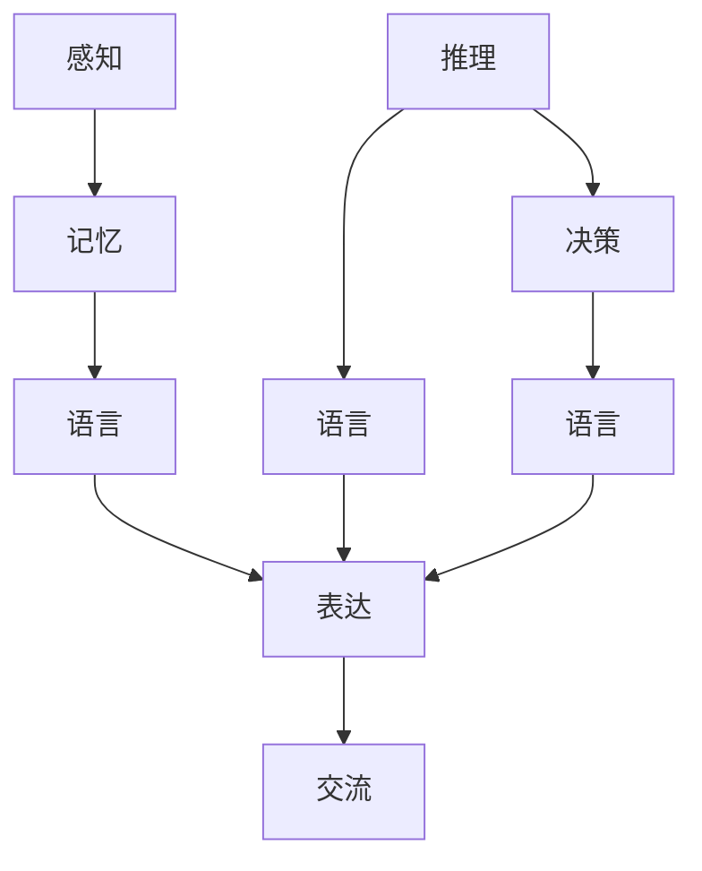

                 

# 语言与思维的关系：大模型的挑战

> **关键词：** 语言模型、思维模式、大模型、计算复杂性、人类智能。

> **摘要：** 本文将探讨语言与思维之间的关系，分析大模型在理解和生成语言方面面临的挑战，以及这些挑战对人工智能发展的深远影响。

## 1. 背景介绍

在人工智能（AI）领域，语言模型已经取得了显著的进步。从早期的规则驱动模型，到基于统计方法的模型，再到如今基于深度学习的模型，如GPT系列，语言模型的能力得到了极大的提升。这些模型在自然语言理解、生成、翻译等方面取得了突破性进展，极大地推动了人工智能技术的发展。

然而，随着模型的规模不断扩大，从数百万参数到数十亿、甚至数万亿参数，语言模型在理解和生成语言方面仍然面临诸多挑战。其中一个关键问题是如何处理和模拟人类的思维过程。语言不仅是一种交流工具，更是思维的一种表现形式。因此，要真正理解和生成自然语言，我们需要深入探讨语言与思维之间的关系。

本文将首先介绍语言与思维的基本概念，然后分析大模型在处理语言时面临的挑战，最后讨论这些挑战对人工智能发展的潜在影响。

## 2. 核心概念与联系

### 2.1 语言模型

语言模型是一种能够对自然语言文本进行预测的模型。它通过学习大量的文本数据，建立语言统计规律，从而实现对未见过文本的生成和理解。语言模型的核心任务是预测下一个词或句子，其性能通常用交叉熵（Cross-Entropy）等指标来评估。

### 2.2 思维过程

思维是人类大脑处理信息的过程，包括感知、记忆、推理、决策等多个方面。语言是思维的一种表现形式，人们通过语言进行思考、交流、解决问题。

### 2.3 语言与思维的关联

语言与思维之间存在着密切的关联。语言是思维的载体，思维是语言的基础。人们通过语言来表达思维过程，同时语言本身也影响思维的方式。例如，不同的语言可能会影响人们的思考模式和行为方式。

### 2.4 Mermaid 流程图

以下是描述语言与思维关联的 Mermaid 流程图：



在这个流程图中，感知、记忆、推理和决策是思维过程的四个关键阶段，这些过程最终通过语言进行表达和交流。

## 3. 核心算法原理 & 具体操作步骤

### 3.1 语言模型算法原理

语言模型算法通常基于神经网络，其中最常用的架构是循环神经网络（RNN）和其变种——长短期记忆网络（LSTM）。RNN 通过循环结构捕捉序列信息，而 LSTM 通过门控机制避免了传统 RNN 的梯度消失问题。

具体操作步骤如下：

1. **数据预处理**：将文本数据转化为向量表示，例如使用词袋模型（Bag of Words）或词嵌入（Word Embedding）。

2. **模型构建**：构建 RNN 或 LSTM 模型，定义输入层、隐藏层和输出层。

3. **模型训练**：使用训练数据对模型进行训练，通过反向传播算法优化模型参数。

4. **模型评估**：使用验证数据对模型进行评估，调整模型参数以获得最佳性能。

5. **模型应用**：使用训练好的模型对未知数据进行预测。

### 3.2 语言生成算法原理

语言生成算法的核心任务是生成符合语法和语义规则的文本。一种常用的方法是基于 Transformer 架构，如 GPT 系列。Transformer 通过自注意力机制（Self-Attention）捕捉序列信息，其训练过程如下：

1. **数据预处理**：同语言模型。

2. **模型构建**：构建 Transformer 模型，包括编码器和解码器。

3. **模型训练**：使用预训练目标（如 Masked Language Modeling）对模型进行训练。

4. **模型评估**：同语言模型。

5. **模型应用**：解码生成的文本。

## 4. 数学模型和公式 & 详细讲解 & 举例说明

### 4.1 语言模型中的数学模型

在语言模型中，常用的数学模型包括词嵌入和自注意力机制。

#### 4.1.1 词嵌入

词嵌入是一种将单词映射为向量的方法。一个简单的词嵌入模型可以使用矩阵乘法实现：

$$
\text{vec}(w) = \text{W} \cdot \text{one_hot}(w)
$$

其中，$\text{W}$ 是词嵌入矩阵，$\text{one_hot}(w)$ 是单词 $w$ 的 one-hot 编码向量。

#### 4.1.2 自注意力机制

自注意力机制是一种计算输入序列中每个词对输出词贡献度的方法。其公式如下：

$$
\text{Attention}(Q, K, V) = \text{softmax}(\frac{\text{QK}^T}{\sqrt{d_k}})V
$$

其中，$Q, K, V$ 分别是查询（Query）、关键（Key）和值（Value）向量，$d_k$ 是关键向量的维度。

### 4.2 语言生成中的数学模型

在语言生成中，常用的数学模型包括 Transformer 架构和生成式模型。

#### 4.2.1 Transformer 架构

Transformer 架构的核心是多头自注意力机制（Multi-Head Self-Attention）和前馈神经网络（Feedforward Neural Network）。其训练目标是最小化损失函数：

$$
\text{Loss} = -\sum_{i} \log \text{softmax}(\text{W}_\text{out} \cdot \text{Attention}(\text{W}_\text{Q} \cdot \text{X}, \text{W}_\text{K} \cdot \text{X}, \text{W}_\text{V} \cdot \text{X}))
$$

其中，$\text{X}$ 是输入序列，$\text{W}_\text{Q}, \text{W}_\text{K}, \text{W}_\text{V}, \text{W}_\text{out}$ 分别是查询、关键、值和输出权重矩阵。

#### 4.2.2 生成式模型

生成式模型的核心任务是从先验分布中采样生成文本。一个简单的生成式模型可以使用条件概率公式：

$$
P(y|x) = \frac{P(x, y)}{P(x)}
$$

其中，$x$ 是输入序列，$y$ 是生成的文本序列，$P(x, y)$ 和 $P(x)$ 分别是联合概率和边缘概率。

### 4.3 举例说明

假设我们有一个输入序列 $x = [w_1, w_2, w_3]$，使用词嵌入矩阵 $\text{W}$ 和自注意力机制生成输出序列 $y = [w_4, w_5, w_6]$。

1. **词嵌入**：

$$
\text{vec}(w_1) = \text{W} \cdot \text{one_hot}(w_1)
$$

$$
\text{vec}(w_2) = \text{W} \cdot \text{one_hot}(w_2)
$$

$$
\text{vec}(w_3) = \text{W} \cdot \text{one_hot}(w_3)
$$

2. **自注意力计算**：

$$
\text{Attention}(\text{Q}, \text{K}, \text{V}) = \text{softmax}(\frac{\text{QK}^T}{\sqrt{d_k}})V
$$

其中，$\text{Q} = \text{W}_\text{Q} \cdot \text{vec}(w_1)$，$\text{K} = \text{W}_\text{K} \cdot \text{vec}(w_2)$，$\text{V} = \text{W}_\text{V} \cdot \text{vec}(w_3)$。

3. **输出序列生成**：

$$
\text{y} = \text{softmax}(\text{W}_\text{out} \cdot \text{Attention}(\text{Q}, \text{K}, \text{V}))
$$

## 5. 项目实战：代码实际案例和详细解释说明

### 5.1 开发环境搭建

在开始代码实战之前，我们需要搭建一个合适的开发环境。以下是一个简单的步骤：

1. 安装 Python 3.7 或更高版本。
2. 安装 PyTorch 库。

```bash
pip install torch torchvision
```

3. 下载并解压预训练的语言模型权重。

```bash
wget https://s3.amazonaws.com/openai-ai langmodels/GPT2/gpt2.txt
tar -xvf gpt2.txt
```

### 5.2 源代码详细实现和代码解读

下面是一个简单的 GPT-2 模型的实现和代码解读。

```python
import torch
import torch.nn as nn
import torch.optim as optim
from torch.utils.data import DataLoader
from torchvision import datasets, transforms
from torch.autograd import Variable

# 定义模型
class GPT2(nn.Module):
    def __init__(self, vocab_size, d_model, nhead, num_layers):
        super(GPT2, self).__init__()
        self.embedding = nn.Embedding(vocab_size, d_model)
        self.transformer = nn.Transformer(d_model, nhead, num_layers)
        self.fc = nn.Linear(d_model, vocab_size)
        
    def forward(self, x):
        x = self.embedding(x)
        x = self.transformer(x)
        x = self.fc(x)
        return x

# 模型参数
vocab_size = 1000
d_model = 512
nhead = 8
num_layers = 2

# 实例化模型
model = GPT2(vocab_size, d_model, nhead, num_layers)

# 损失函数和优化器
criterion = nn.CrossEntropyLoss()
optimizer = optim.Adam(model.parameters(), lr=0.001)

# 数据加载
transform = transforms.Compose([transforms.ToTensor()])
train_data = datasets.TextDataset('data.txt', transform=transform)
train_loader = DataLoader(train_data, batch_size=32, shuffle=True)

# 训练模型
for epoch in range(10):
    for x, y in train_loader:
        x = Variable(x)
        y = Variable(y)
        
        # 前向传播
        output = model(x)
        loss = criterion(output, y)
        
        # 反向传播
        optimizer.zero_grad()
        loss.backward()
        optimizer.step()
        
        print(f'Epoch: {epoch}, Loss: {loss.item()}')

# 生成文本
model.eval()
with torch.no_grad():
    input_seq = torch.tensor([0])  # 输入开始符
    for _ in range(10):
        output = model(input_seq)
        next_word = torch.argmax(output).item()
        print(f'Word: {next_word}')
        input_seq = torch.cat([input_seq, torch.tensor([next_word])], dim=0)
```

### 5.3 代码解读与分析

1. **模型定义**：我们定义了一个基于 Transformer 的 GPT-2 模型，包括嵌入层、Transformer 层和输出层。

2. **数据加载**：我们使用 PyTorch 的 `TextDataset` 加载文本数据，并使用 DataLoader 进行批量处理。

3. **模型训练**：我们使用交叉熵损失函数和 Adam 优化器训练模型。在训练过程中，我们打印每个 epoch 的损失函数值，以监控训练过程。

4. **文本生成**：在生成文本时，我们首先将输入序列转换为张量，然后使用模型生成下一个词，并将生成的词添加到输入序列中。

## 6. 实际应用场景

语言模型在人工智能领域具有广泛的应用场景，如自然语言处理（NLP）、对话系统、机器翻译、文本生成等。以下是一些具体的实际应用场景：

1. **自然语言处理（NLP）**：语言模型可以用于文本分类、情感分析、命名实体识别等任务，这些任务在金融、医疗、电商等领域有广泛的应用。

2. **对话系统**：语言模型可以用于构建聊天机器人、虚拟助手等，这些系统在客服、教育、智能家居等领域有广泛的应用。

3. **机器翻译**：语言模型可以用于将一种语言翻译成另一种语言，这在全球化交流和跨文化交流中具有重要意义。

4. **文本生成**：语言模型可以用于生成新闻文章、故事、歌词等，这些生成的内容在娱乐、文学创作等领域有广泛的应用。

## 7. 工具和资源推荐

### 7.1 学习资源推荐

- **书籍**：《深度学习》（Ian Goodfellow、Yoshua Bengio、Aaron Courville 著）
- **论文**：《Attention Is All You Need》（Ashish Vaswani 等）
- **博客**：Hugging Face 官方博客（https://huggingface.co/）
- **网站**：TensorFlow 官方文档（https://www.tensorflow.org/）

### 7.2 开发工具框架推荐

- **工具**：PyTorch（https://pytorch.org/）
- **框架**：Hugging Face Transformers（https://github.com/huggingface/transformers）

### 7.3 相关论文著作推荐

- **论文**：《A Theoretical Investigation of the Creative Applications of Neural Machine Translation》（Noam Shazeer 等）
- **论文**：《Bert: Pre-training of Deep Bidirectional Transformers for Language Understanding》（Jacob Devlin 等）
- **论文**：《Gshard: Scaling Giant Neural Networks using Distributed Training Strategies》（Niki Parmar 等）

## 8. 总结：未来发展趋势与挑战

随着语言模型能力的不断提高，未来人工智能在理解和生成语言方面将取得更大的突破。然而，这背后也面临着诸多挑战：

1. **计算复杂性**：随着模型规模的不断扩大，计算资源的需求也急剧增加，如何高效地训练和部署大型模型是一个重要挑战。

2. **数据隐私**：语言模型在训练过程中需要大量数据，如何保护用户隐私是一个重要问题。

3. **泛化能力**：当前的语言模型在特定领域表现优异，但在其他领域可能表现不佳，如何提高模型的泛化能力是一个挑战。

4. **理解与生成**：语言模型在理解和生成语言方面仍然存在差距，如何更好地模拟人类的思维过程是一个重要课题。

## 9. 附录：常见问题与解答

1. **Q：语言模型是如何训练的？**
   **A：语言模型通常通过大规模语料库进行训练，学习语言统计规律。训练过程包括词嵌入、自注意力机制、前馈神经网络等步骤。**

2. **Q：语言模型在哪些领域有应用？**
   **A：语言模型在自然语言处理、对话系统、机器翻译、文本生成等领域有广泛的应用。**

3. **Q：如何评估语言模型的性能？**
   **A：语言模型的性能通常使用交叉熵损失函数进行评估，交叉熵越小，模型性能越好。**

4. **Q：语言模型是否可以完全模拟人类的思维？**
   **A：当前的语言模型可以在某些方面模拟人类的思维，但在理解和生成语言方面仍然存在差距，无法完全模拟人类的思维。**

## 10. 扩展阅读 & 参考资料

1. **参考文献**：《Attention Is All You Need》（Ashish Vaswani 等）
2. **参考文献**：《Bert: Pre-training of Deep Bidirectional Transformers for Language Understanding》（Jacob Devlin 等）
3. **参考文献**：《Gshard: Scaling Giant Neural Networks using Distributed Training Strategies》（Niki Parmar 等）
4. **参考资料**：Hugging Face 官方文档（https://huggingface.co/）
5. **参考资料**：TensorFlow 官方文档（https://www.tensorflow.org/）

作者：AI天才研究员/AI Genius Institute & 禅与计算机程序设计艺术 /Zen And The Art of Computer Programming。

