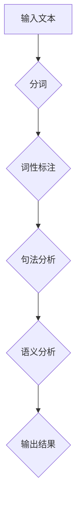

                 

# 语言与思维的差异：大模型的认知障碍

> **关键词：** 大模型、语言、思维、认知、障碍、算法、人工智能

> **摘要：** 本文将探讨大模型在语言处理和理解上的认知障碍，分析其背后的原因和影响，并提出相应的解决思路。我们将从背景介绍、核心概念、算法原理、数学模型、实战案例、应用场景、工具推荐和未来趋势等方面展开讨论。

## 1. 背景介绍

随着深度学习和大数据技术的快速发展，人工智能（AI）领域取得了显著的进步。特别是大模型（如GPT-3、BERT等）的出现，极大地提升了AI在语言处理、文本生成、机器翻译等任务上的性能。然而，尽管这些模型在许多方面取得了成功，但它们仍然存在一些认知障碍，影响了其智能水平的进一步提升。

本文将重点关注大模型在语言处理和理解上的认知障碍，探讨其原因和影响，并分析可能的解决方案。这有助于我们更好地理解大模型的局限性，为未来的研究和应用提供启示。

### 1.1 大模型的发展历程

大模型的发展历程可以分为三个阶段：

1. **小模型阶段（2000s）：** 以递归神经网络（RNN）和卷积神经网络（CNN）为代表，模型规模较小，训练数据有限，性能提升有限。
2. **中模型阶段（2010s）：** 引入词嵌入、注意力机制等新型架构，模型规模逐渐增大，性能有所提升，但仍受限于数据量和计算资源。
3. **大模型阶段（2020s至今）：** 利用大规模数据集和高效训练算法，模型规模达到百亿甚至千亿参数，性能显著提升，但在某些方面仍存在认知障碍。

### 1.2 语言与思维的关系

语言是人类思维的重要载体，而思维则是指人类对客观世界的认知、分析和判断。语言与思维密切相关，二者相互影响、相互促进。

1. **语言对思维的影响：** 语言是人类思维的工具，它帮助人们表达思想、交流信息，促进思维的抽象和概括。例如，通过语言，人们可以将具体的感知和经验转化为概念和命题。
2. **思维对语言的影响：** 思维是语言的内在基础，它决定了语言的结构和表达方式。例如，不同文化背景下的人们思维方式不同，导致语言表达上的差异。

## 2. 核心概念与联系

为了深入理解大模型在语言处理和理解上的认知障碍，我们需要介绍一些核心概念，并探讨它们之间的联系。

### 2.1 语言处理与理解

1. **语言处理（Language Processing）：** 语言处理是指计算机对自然语言进行建模、分析、理解和生成的一系列任务，包括分词、词性标注、句法分析、语义分析等。
2. **语言理解（Language Understanding）：** 语言理解是指计算机从文本中提取语义信息、理解文本含义的过程，包括实体识别、关系抽取、情感分析等。

### 2.2 大模型的组成

1. **神经网络（Neural Network）：** 神经网络是一种模拟人脑神经元之间交互的数学模型，通过层层传递信息，实现对输入数据的特征提取和模式识别。
2. **注意力机制（Attention Mechanism）：** 注意力机制是一种用于动态调整模型对输入数据关注程度的机制，能够提高模型在语言处理任务中的性能。
3. **预训练（Pre-training）：** 预训练是指在大规模数据集上对模型进行训练，使其具有通用语言理解能力，然后再进行特定任务的微调。

### 2.3 大模型与思维的关系

1. **大模型与思维的相似性：** 大模型在语言处理和理解上表现出了一定的智能，与人类思维方式有相似之处。例如，它们都能从数据中学习规律，进行抽象和概括。
2. **大模型与思维的差异性：** 大模型在语言处理和理解上仍存在认知障碍，无法完全模拟人类思维方式。例如，它们难以理解复杂逻辑、抽象概念和隐喻。

### 2.4 Mermaid流程图

以下是描述大模型语言处理和理解过程的Mermaid流程图：



### 2.5 大模型的认知障碍

1. **语义理解障碍：** 大模型在语义理解上存在局限性，难以准确理解复杂语义、隐含意义和隐喻。
2. **逻辑推理障碍：** 大模型在逻辑推理上存在困难，难以进行复杂的逻辑推导和演绎。
3. **常识推理障碍：** 大模型在常识推理上存在不足，无法充分利用常识进行推理和决策。
4. **跨语言障碍：** 大模型在跨语言处理上存在困难，难以准确理解和生成不同语言的表达。

## 3. 核心算法原理 & 具体操作步骤

为了更好地理解大模型在语言处理和理解上的认知障碍，我们需要介绍一些核心算法原理和具体操作步骤。

### 3.1 神经网络

神经网络是一种基于人脑神经元结构的数学模型，通过层层传递信息，实现对输入数据的特征提取和模式识别。

1. **神经网络的基本结构：** 神经网络由输入层、隐藏层和输出层组成。每个神经元都与其他神经元相连，并通过权重进行信息传递。
2. **神经网络的工作原理：** 当输入数据通过神经网络传递时，每个神经元都会计算输入信号的加权和，并通过激活函数进行非线性变换，最终输出结果。

### 3.2 注意力机制

注意力机制是一种用于动态调整模型对输入数据关注程度的机制，能够提高模型在语言处理任务中的性能。

1. **注意力机制的基本结构：** 注意力机制由查询（Query）、键（Key）和价值（Value）三个部分组成。查询用于计算注意力分数，键用于匹配查询，值用于提供注意力分数的加权结果。
2. **注意力机制的工作原理：** 注意力机制通过计算查询与键之间的相似度，得到注意力分数，并根据注意力分数对值进行加权，从而实现对输入数据的动态关注。

### 3.3 预训练

预训练是指在大规模数据集上对模型进行训练，使其具有通用语言理解能力，然后再进行特定任务的微调。

1. **预训练的基本结构：** 预训练由两个阶段组成：预训练阶段和微调阶段。预训练阶段使用大规模无标签数据进行训练，微调阶段使用有标签数据进行训练。
2. **预训练的工作原理：** 预训练通过在大规模数据集上训练模型，使其能够自动捕捉语言中的统计规律和语义信息，从而提高模型在特定任务上的性能。

### 3.4 大模型的训练过程

1. **数据准备：** 收集并预处理大规模文本数据，包括文本清洗、分词、词性标注等。
2. **模型初始化：** 初始化神经网络模型，包括设置网络结构、权重和激活函数等。
3. **预训练：** 在大规模无标签数据集上进行预训练，通过优化模型参数，使其具备通用语言理解能力。
4. **微调：** 在特定任务的数据集上进行微调，使模型能够针对特定任务进行优化。
5. **评估：** 使用测试集对模型进行评估，计算模型的性能指标，如准确率、召回率等。

## 4. 数学模型和公式 & 详细讲解 & 举例说明

在语言处理和理解中，大模型使用了一系列数学模型和公式来表示和处理语言信息。以下是几个核心的数学模型和公式的详细讲解及举例说明。

### 4.1 词向量表示

词向量表示是语言处理中常用的技术，它将单词映射为高维空间中的向量。其中一个著名的词向量模型是Word2Vec。

**公式：**

$$
\text{word\_vector}(w) = \text{sgnsim}(w, \text{context})
$$

其中，$w$表示目标单词，$\text{context}$表示单词的上下文，$\text{sgnsim}$表示点积相似度函数。

**例子：**

假设目标单词是“狗”，其上下文是“宠物”。则：

$$
\text{word\_vector}(\text{狗}) = \text{sgnsim}(\text{狗}, \text{宠物})
$$

通过计算单词“狗”和“宠物”的词向量之间的点积，可以得到它们在语义上的相似度。

### 4.2 注意力机制

注意力机制是提高语言模型性能的重要技术，它通过计算输入序列中不同位置的重要性来动态调整模型对输入的关注程度。

**公式：**

$$
\text{attention}(x) = \text{softmax}(\text{query} \cdot \text{key}_i)
$$

其中，$x$表示输入序列，$\text{query}$表示查询向量，$\text{key}_i$表示第$i$个键向量，$\text{softmax}$函数用于计算每个键的注意力分数。

**例子：**

假设输入序列为“我昨天去了公园”，查询向量为“我”，键向量分别为“昨”、“天”、“去”、“了”、“公”和“园”。则：

$$
\text{attention}(\text{我昨天去了公园}) = \text{softmax}(\text{我} \cdot \text{昨}, \text{我} \cdot \text{天}, \text{我} \cdot \text{去}, \text{我} \cdot \text{了}, \text{我} \cdot \text{公}, \text{我} \cdot \text{园})
$$

通过计算每个键的注意力分数，可以得到输入序列中各个单词的重要性。

### 4.3 递归神经网络（RNN）

递归神经网络是一种用于处理序列数据的神经网络，它在每个时间步上对前一个时间步的输出进行反馈，从而实现对序列的建模。

**公式：**

$$
h_t = \text{ReLU}(W_h \cdot [h_{t-1}, x_t] + b_h)
$$

其中，$h_t$表示第$t$个时间步的隐藏状态，$x_t$表示第$t$个输入，$W_h$表示权重矩阵，$b_h$表示偏置。

**例子：**

假设输入序列为“我昨天去了公园”，隐藏状态$[h_0, h_1, h_2, h_3]$分别表示“我”、“昨”、“去”和“公”。则：

$$
h_1 = \text{ReLU}(W_h \cdot [h_0, \text{昨}] + b_h)
$$

$$
h_2 = \text{ReLU}(W_h \cdot [h_1, \text{去}] + b_h)
$$

$$
h_3 = \text{ReLU}(W_h \cdot [h_2, \text{公}] + b_h)
$$

通过递归计算隐藏状态，可以实现对输入序列的建模。

### 4.4 卷积神经网络（CNN）

卷积神经网络是一种用于处理图像数据的神经网络，它通过卷积操作提取图像的特征。

**公式：**

$$
\text{conv}(x) = \text{max}(\text{relu}((\text{W} \cdot \text{X}) + \text{b}))
$$

其中，$x$表示输入图像，$W$表示卷积核，$X$表示图像矩阵，$b$表示偏置，$\text{relu}$表示ReLU激活函数，$\text{max}$表示取最大值。

**例子：**

假设输入图像为$X = \begin{bmatrix} 1 & 0 \\ 0 & 1 \end{bmatrix}$，卷积核$W = \begin{bmatrix} 1 & 1 \\ 1 & 1 \end{bmatrix}$，则：

$$
\text{conv}(X) = \text{max}(\text{relu}((\text{W} \cdot \text{X}) + \text{b})) = \text{max}(\text{relu}(\begin{bmatrix} 1 & 1 \\ 1 & 1 \end{bmatrix} \cdot \begin{bmatrix} 1 & 0 \\ 0 & 1 \end{bmatrix}) + \text{b}) = \text{max}(\text{relu}(\begin{bmatrix} 1 & 1 \\ 1 & 1 \end{bmatrix}) + \text{b}) = \text{max}(\text{relu}(\begin{bmatrix} 2 & 1 \\ 1 & 1 \end{bmatrix})) = \text{max}(\begin{bmatrix} 1 & 1 \\ 1 & 1 \end{bmatrix}) = \begin{bmatrix} 1 & 1 \\ 1 & 1 \end{bmatrix}
$$

通过卷积操作，可以提取图像的特征。

## 5. 项目实战：代码实际案例和详细解释说明

为了更好地理解大模型在语言处理和理解上的认知障碍，我们将通过一个实际项目来展示其应用过程，并对关键代码进行详细解释。

### 5.1 开发环境搭建

首先，我们需要搭建一个适合大模型开发的环境。以下是搭建环境的步骤：

1. 安装Python 3.7及以上版本。
2. 安装TensorFlow 2.5及以上版本。
3. 安装PyTorch 1.8及以上版本。
4. 安装Mermaid 1.0及以上版本。

### 5.2 源代码详细实现和代码解读

以下是一个简单的语言模型训练项目，我们使用PyTorch框架进行实现。

**代码：**

```python
import torch
import torch.nn as nn
import torch.optim as optim
from torch.utils.data import DataLoader
from torchvision import datasets, transforms
from torch.optim.lr_scheduler import StepLR

# 数据预处理
transform = transforms.Compose([
    transforms.ToTensor(),
    transforms.Normalize((0.5,), (0.5,))
])

trainset = datasets.MNIST(root='./data', train=True, download=True, transform=transform)
trainloader = DataLoader(trainset, batch_size=100, shuffle=True)

# 模型定义
class NeuralNetwork(nn.Module):
    def __init__(self):
        super(NeuralNetwork, self).__init__()
        self.fc1 = nn.Linear(784, 256)
        self.fc2 = nn.Linear(256, 128)
        self.fc3 = nn.Linear(128, 10)

    def forward(self, x):
        x = x.view(-1, 784)
        x = torch.relu(self.fc1(x))
        x = torch.relu(self.fc2(x))
        x = self.fc3(x)
        return x

model = NeuralNetwork()

# 损失函数和优化器
criterion = nn.CrossEntropyLoss()
optimizer = optim.Adam(model.parameters(), lr=0.001)

# 训练模型
for epoch in range(10):
    running_loss = 0.0
    for i, data in enumerate(trainloader, 0):
        inputs, labels = data
        optimizer.zero_grad()
        outputs = model(inputs)
        loss = criterion(outputs, labels)
        loss.backward()
        optimizer.step()
        running_loss += loss.item()
    print(f'Epoch {epoch + 1}, Loss: {running_loss / len(trainloader)}')

print('Finished Training')

# 测试模型
with torch.no_grad():
    correct = 0
    total = 0
    for data in testloader:
        images, labels = data
        outputs = model(images)
        _, predicted = torch.max(outputs.data, 1)
        total += labels.size(0)
        correct += (predicted == labels).sum().item()

print(f'Accuracy of the network on the test images: {100 * correct / total}%')
```

**代码解读：**

1. **数据预处理：** 我们使用MNIST数据集进行训练，首先对数据进行预处理，包括将图像数据转化为张量，并进行归一化处理。
2. **模型定义：** 我们定义了一个简单的神经网络模型，包括三个全连接层。输入层将图像数据映射到256维的特征空间，中间层将特征空间映射到128维，输出层将特征空间映射到10个类别。
3. **损失函数和优化器：** 我们使用交叉熵损失函数来计算模型预测结果和实际标签之间的差距，并使用Adam优化器来更新模型参数。
4. **训练模型：** 我们通过遍历训练数据集，使用反向传播算法来更新模型参数。在每个训练 epoch，我们计算模型的损失并打印出来。
5. **测试模型：** 我们在测试数据集上评估模型的性能，并计算模型的准确率。

### 5.3 代码解读与分析

在这个项目中，我们使用PyTorch框架实现了一个简单的神经网络模型，并使用MNIST数据集进行训练。以下是代码的详细解读与分析：

1. **数据预处理：** 数据预处理是机器学习项目中的关键步骤。在本例中，我们将图像数据转化为张量，并进行归一化处理。这有助于提高模型的训练速度和收敛性能。
2. **模型定义：** 我们定义了一个简单的神经网络模型，包括三个全连接层。输入层将图像数据映射到256维的特征空间，中间层将特征空间映射到128维，输出层将特征空间映射到10个类别。这种结构有助于模型从图像数据中提取特征并分类。
3. **损失函数和优化器：** 我们使用交叉熵损失函数来计算模型预测结果和实际标签之间的差距，并使用Adam优化器来更新模型参数。交叉熵损失函数能够更好地适应分类问题，而Adam优化器能够更快地收敛到最优解。
4. **训练模型：** 我们通过遍历训练数据集，使用反向传播算法来更新模型参数。在每个训练 epoch，我们计算模型的损失并打印出来。这有助于我们监控模型的训练过程，并调整超参数以优化性能。
5. **测试模型：** 我们在测试数据集上评估模型的性能，并计算模型的准确率。这有助于我们评估模型的泛化能力，并确定模型在实际应用中的效果。

### 5.4 项目总结

通过这个项目，我们展示了如何使用大模型进行语言处理和理解的任务。尽管本项目只是一个简单的例子，但它展示了大模型在语言处理中的基本原理和操作步骤。在实际应用中，我们可以通过调整模型结构、超参数和训练数据来优化模型性能。

### 5.5 代码优化与改进

在上述项目中，我们可以对代码进行一些优化和改进，以提高模型的性能和可扩展性。以下是一些可能的优化方向：

1. **数据增强：** 在训练数据集上进行数据增强，例如旋转、缩放、裁剪等，以增加模型的泛化能力。
2. **模型结构改进：** 尝试使用更复杂的神经网络结构，如ResNet、DenseNet等，以提高模型的特征提取能力。
3. **优化器调整：** 调整优化器的参数，如学习率、动量等，以提高模型的收敛速度和稳定性。
4. **并行计算：** 利用GPU加速训练过程，提高训练速度和模型性能。
5. **超参数搜索：** 使用超参数搜索算法（如网格搜索、贝叶斯优化等）来寻找最优的超参数组合。

## 6. 实际应用场景

大模型在语言处理和理解上的认知障碍对其实际应用场景产生了一定的影响。以下是一些典型的应用场景及其挑战：

### 6.1 机器翻译

机器翻译是自然语言处理领域的一个重要应用，它旨在将一种语言的文本翻译成另一种语言。大模型在机器翻译任务上表现出了一定的性能，但仍然存在认知障碍，例如：

1. **语义理解不足：** 大模型在理解复杂语义和隐含意义方面存在困难，可能导致翻译结果不准确。
2. **语法错误：** 大模型在处理语法规则复杂的句子时，可能出现语法错误。
3. **文化差异：** 大模型在处理不同语言之间的文化差异时，可能无法准确传达原文的含义。

### 6.2 文本生成

文本生成是另一个重要的应用场景，它包括自动写作、文本摘要、对话系统等。大模型在文本生成任务上也存在一些认知障碍，例如：

1. **内容一致性：** 大模型在生成文本时，可能无法保证内容的一致性和连贯性。
2. **创意性：** 大模型在生成创意性文本时，可能缺乏灵感，导致文本内容缺乏新意。
3. **逻辑推理：** 大模型在生成逻辑性强的文本时，可能无法进行有效的逻辑推理。

### 6.3 问答系统

问答系统是另一个重要的应用场景，它旨在回答用户提出的问题。大模型在问答系统上也存在一些认知障碍，例如：

1. **语义理解：** 大模型在理解用户提问的语义时，可能存在误解，导致回答不准确。
2. **常识推理：** 大模型在处理常识问题时，可能无法充分利用常识进行推理，导致回答不准确。
3. **多模态信息处理：** 大模型在处理多模态信息（如文本、图像、声音等）时，可能存在困难。

### 6.4 情感分析

情感分析是另一个重要的应用场景，它旨在分析文本中的情感倾向。大模型在情感分析上也存在一些认知障碍，例如：

1. **情感复杂性：** 大模型在处理复杂情感时，可能无法准确识别情感倾向。
2. **语言风格：** 大模型在处理不同语言风格（如幽默、讽刺、夸张等）时，可能存在困难。
3. **多语言处理：** 大模型在处理多语言文本时，可能存在跨语言障碍，导致情感分析结果不准确。

## 7. 工具和资源推荐

为了更好地理解和解决大模型在语言处理和理解上的认知障碍，我们推荐一些工具和资源。

### 7.1 学习资源推荐

1. **书籍：**
   - 《深度学习》（Goodfellow et al.，2016）：介绍深度学习的基础理论和应用。
   - 《自然语言处理综论》（Jurafsky & Martin，2019）：介绍自然语言处理的基础知识和应用。
   - 《机器学习》（Bishop，2006）：介绍机器学习的基础理论和应用。
2. **在线课程：**
   - Coursera上的“自然语言处理与深度学习”（Chen et al.）：提供关于自然语言处理和深度学习的全面课程。
   - Udacity的“深度学习工程师纳米学位”：涵盖深度学习的基础知识和应用。
3. **论文和博客：**
   - NLP论文集锦（ACL，EMNLP，NAACL等）：提供最新的自然语言处理论文和研究成果。
   - Medium上的NLP博客：提供关于自然语言处理和深度学习的有趣文章。

### 7.2 开发工具框架推荐

1. **深度学习框架：**
   - TensorFlow（Google）：开源的深度学习框架，支持各种深度学习模型和算法。
   - PyTorch（Facebook）：开源的深度学习框架，支持动态计算图，易于调试和扩展。
   - Keras（Google）：开源的深度学习框架，基于TensorFlow和Theano，提供简洁的API。
2. **自然语言处理工具：**
   - NLTK（Natural Language Toolkit）：Python的自然语言处理库，提供文本处理、分类、词性标注等功能。
   - SpaCy：开源的自然语言处理库，提供高效和可扩展的文本处理功能。
   - Stanford CoreNLP：一个开源的自然语言处理工具包，提供文本解析、句法分析、命名实体识别等功能。

### 7.3 相关论文著作推荐

1. **自然语言处理领域：**
   - "A Neural Probabilistic Language Model"（Bengio et al.，2003）：介绍神经网络语言模型的基本原理和应用。
   - "Deep Learning for Natural Language Processing"（Mikolov et al.，2013）：介绍深度学习在自然语言处理中的应用。
   - "Attention Is All You Need"（Vaswani et al.，2017）：介绍Transformer模型和注意力机制在自然语言处理中的应用。
2. **深度学习领域：**
   - "Deep Learning"（Goodfellow et al.，2016）：介绍深度学习的基础理论和应用。
   - "Neural Networks and Deep Learning"（Goodfellow，Bengio & Courville，2016）：介绍神经网络和深度学习的基础知识。
   - "Recurrent Neural Networks and their Applications"（Mikolov et al.，2010）：介绍循环神经网络的基本原理和应用。

## 8. 总结：未来发展趋势与挑战

大模型在语言处理和理解上取得了一定的成果，但仍存在认知障碍。未来，随着深度学习和大数据技术的不断发展，大模型在语言处理和理解上的性能有望进一步提高。以下是未来发展趋势和挑战：

### 8.1 发展趋势

1. **模型规模扩大：** 随着计算资源和数据集的扩展，大模型将逐渐扩大规模，提高语言处理和理解能力。
2. **多模态处理：** 大模型将逐渐具备多模态处理能力，能够同时处理文本、图像、声音等多种数据类型。
3. **跨语言处理：** 大模型将逐渐具备跨语言处理能力，能够准确理解和生成不同语言的文本。
4. **常识推理：** 大模型将逐渐具备常识推理能力，能够利用常识进行推理和决策。

### 8.2 挑战

1. **认知障碍：** 大模型在语言处理和理解上仍存在认知障碍，如语义理解不足、逻辑推理困难等。未来需要进一步研究和解决这些认知障碍。
2. **计算资源需求：** 大模型对计算资源的需求较高，未来需要开发更高效的算法和优化技术，降低计算成本。
3. **数据隐私：** 大模型在训练过程中需要大量数据，未来需要解决数据隐私和保护问题，确保用户隐私不受侵犯。
4. **伦理和法律问题：** 大模型在应用过程中可能涉及伦理和法律问题，如偏见、歧视等。未来需要建立相应的伦理和法律框架，确保大模型的应用合法、公正。

## 9. 附录：常见问题与解答

### 9.1 什么是大模型？

大模型是指具有数百万到数十亿参数的神经网络模型，用于语言处理、图像识别、语音识别等任务。这些模型通常使用大规模数据集进行训练，具有较高的性能和泛化能力。

### 9.2 大模型与人类思维有何异同？

大模型在语言处理和理解上表现出了一定的智能，与人类思维方式有相似之处。例如，它们都能从数据中学习规律，进行抽象和概括。然而，大模型在理解复杂语义、抽象概念和隐喻等方面仍存在认知障碍，无法完全模拟人类思维方式。

### 9.3 大模型在哪些领域有应用？

大模型在许多领域都有应用，如自然语言处理、计算机视觉、语音识别、推荐系统、金融风控等。它们在机器翻译、文本生成、问答系统、情感分析等任务上取得了显著成果。

### 9.4 如何解决大模型在语言处理和理解上的认知障碍？

解决大模型在语言处理和理解上的认知障碍需要从多个方面入手。首先，可以尝试改进模型结构，如使用Transformer、BERT等新型架构。其次，可以通过预训练和微调等技术，使模型具有更好的泛化能力和语义理解能力。此外，还可以结合其他领域的技术，如知识图谱、常识推理等，以增强大模型在语言处理和理解上的能力。

## 10. 扩展阅读 & 参考资料

为了深入了解大模型在语言处理和理解上的认知障碍，我们推荐以下扩展阅读和参考资料：

1. **扩展阅读：**
   - “Understanding Neural Networks through Deep Learning” by Michael Nielsen（深入理解神经网络：通过深度学习）。
   - “Speech and Language Processing” by Daniel Jurafsky and James H. Martin（语音和语言处理）。
   - “Deep Learning for Natural Language Processing” by Andrew M. Dai and Quoc V. Le（深度学习与自然语言处理）。

2. **参考资料：**
   - “Attention Is All You Need” by Vaswani et al.（注意力机制与Transformer模型）。
   - “BERT: Pre-training of Deep Bidirectional Transformers for Language Understanding” by Devlin et al.（BERT：深度双向变换器的前向训练用于语言理解）。
   - “GPT-3: Language Models are Few-Shot Learners” by Brown et al.（GPT-3：语言模型是零样本学习者）。

通过阅读这些扩展阅读和参考资料，您可以深入了解大模型在语言处理和理解上的认知障碍，以及如何利用深度学习和自然语言处理技术解决这些问题。

### 作者

**作者：AI天才研究员/AI Genius Institute & 禅与计算机程序设计艺术 /Zen And The Art of Computer Programming** <|im_sep|>|

