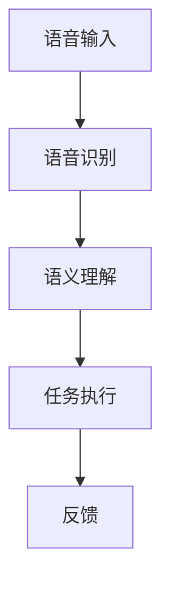

                 

# 语音助手技术在CUI中的应用

> 关键词：语音助手、CUI、自然语言处理、人工智能、用户界面、交互设计

> 摘要：本文将深入探讨语音助手技术在计算机用户界面（CUI）中的应用。从背景介绍、核心概念与联系、算法原理与操作步骤、数学模型和公式、项目实战、实际应用场景、工具和资源推荐等方面，全面解析语音助手技术如何提升用户交互体验，推动CUI的发展与创新。

## 1. 背景介绍

随着移动互联网的普及和人工智能技术的快速发展，语音助手作为用户与计算机之间交互的新方式，逐渐受到了广泛关注。语音助手技术的应用场景丰富多样，如智能手机、智能家居、智能车载、智能音响等，大大提升了用户的交互体验和便利性。计算机用户界面（CUI）作为计算机与用户进行交互的重要渠道，也在语音助手技术的推动下，迎来了新的发展机遇。

近年来，语音助手技术的发展呈现出以下几个趋势：

1. **自然语言处理（NLP）能力的提升**：随着深度学习等人工智能技术的进步，语音助手在自然语言理解、语义分析、情感识别等方面的能力得到了显著提升，能够更准确地理解用户的需求。

2. **多模态交互的融合**：语音助手逐渐与视觉、触觉等其他交互方式相结合，实现多模态交互，为用户提供更加丰富的交互体验。

3. **个性化服务的普及**：通过大数据和机器学习技术，语音助手能够根据用户的历史行为和偏好，提供个性化的服务，满足用户的个性化需求。

4. **跨界应用的不断拓展**：语音助手技术开始应用于更多领域，如医疗、金融、教育等，为各行各业带来了新的应用场景和商业模式。

## 2. 核心概念与联系

### 2.1 语音助手（Voice Assistant）

语音助手是一种基于人工智能技术，能够通过语音交互为用户提供服务的智能系统。其主要功能包括语音识别、语义理解、任务执行等。

### 2.2 计算机用户界面（CUI）

计算机用户界面是指计算机系统提供给用户进行交互的界面，包括图形用户界面（GUI）、命令行界面（CLI）和语音用户界面（VUI）。语音助手技术作为VUI的一种实现方式，为CUI带来了新的交互手段。

### 2.3 自然语言处理（NLP）

自然语言处理是人工智能的一个重要分支，旨在使计算机能够理解和处理自然语言。语音助手技术中，NLP负责对用户的语音输入进行识别和理解，是实现语音助手功能的核心技术之一。

### 2.4 语音识别（Voice Recognition）

语音识别是语音助手技术的基础，通过将用户的语音输入转换为文本，为后续的语义理解提供输入。

### 2.5 语义理解（Semantic Understanding）

语义理解是语音助手技术的关键环节，通过对语音输入进行语义分析，理解用户的意图和需求。

### 2.6 任务执行（Task Execution）

任务执行是指语音助手根据用户的意图，执行相应的操作，如查询信息、发送消息、控制设备等。

### 2.7 Mermaid 流程图

以下是语音助手技术在CUI中应用的核心流程图：



## 3. 核心算法原理 & 具体操作步骤

### 3.1 语音识别

语音识别技术是将用户的语音输入转换为文本的过程。其基本原理包括以下几个步骤：

1. **特征提取**：通过麦克风等设备采集语音信号，然后对语音信号进行预处理，提取出语音特征。

2. **声学模型**：利用大量的语音数据，通过训练建立声学模型，用于对语音特征进行建模。

3. **语言模型**：利用大量的文本数据，通过训练建立语言模型，用于对语音输入进行解码。

4. **解码**：将语音特征输入到声学模型和语言模型中，通过解码算法，将语音信号转换为文本。

### 3.2 语义理解

语义理解技术是语音助手理解用户意图的关键。其基本原理包括以下几个步骤：

1. **词法分析**：对文本进行分词，将文本分解为词组。

2. **句法分析**：对词组进行句法分析，构建句法树，理解句子结构。

3. **语义角色标注**：对句子中的词语进行语义角色标注，确定每个词语在句子中的角色。

4. **意图识别**：通过语义角色标注，结合上下文信息，识别用户的意图。

### 3.3 任务执行

任务执行是指语音助手根据用户的意图，执行相应的操作。其基本原理包括以下几个步骤：

1. **意图解析**：将语义理解的结果进行意图解析，确定用户希望执行的操作。

2. **任务规划**：根据意图，制定执行任务的计划，确定需要调用的接口和资源。

3. **任务执行**：根据任务规划，执行相应的操作，如查询信息、发送消息、控制设备等。

4. **反馈**：将执行结果反馈给用户，完成交互过程。

## 4. 数学模型和公式 & 详细讲解 & 举例说明

### 4.1 语音识别的数学模型

语音识别的数学模型主要包括声学模型和语言模型。以下是两个模型的基本公式：

#### 声学模型（Acoustic Model）：

$$
P(O|X) = \prod_{t=1}^{T} p(x_t|h_t)
$$

其中，$O$表示观测到的语音信号，$X$表示隐藏状态，$h_t$表示在时间$t$的隐藏状态概率。

#### 语言模型（Language Model）：

$$
P(W|O) = \prod_{t=1}^{T} p(w_t|w_{t-1}, ..., w_1)
$$

其中，$W$表示文本序列，$w_t$表示在时间$t$的词语。

### 4.2 语义理解的数学模型

语义理解的数学模型主要包括词嵌入（Word Embedding）和序列模型（Sequence Model）。以下是两个模型的基本公式：

#### 词嵌入（Word Embedding）：

$$
e_w = \text{Embed}(w)
$$

其中，$e_w$表示词语$w$的词嵌入向量。

#### 序列模型（Sequence Model）：

$$
p(y|x) = \text{softmax}(\text{.SequenceModel}(x))
$$

其中，$y$表示句子的语义标签，$x$表示句子的词嵌入向量。

### 4.3 举例说明

#### 语音识别举例

假设用户说：“明天天气怎么样？”，语音识别的数学过程如下：

1. **特征提取**：采集到语音信号，提取出特征向量。

2. **声学模型**：利用声学模型，计算特征向量对应的隐藏状态概率。

3. **语言模型**：利用语言模型，计算文本序列的概率。

4. **解码**：通过解码算法，将特征向量转换为文本序列。

最终输出：“明天天气怎么样？”

#### 语义理解举例

假设用户说：“明天天气怎么样？”，语义理解的数学过程如下：

1. **词嵌入**：将句子中的词语转换为词嵌入向量。

2. **序列模型**：利用序列模型，计算词语的语义标签概率。

3. **意图识别**：根据语义标签概率，识别用户的意图。

最终输出：查询天气信息。

## 5. 项目实战：代码实际案例和详细解释说明

### 5.1 开发环境搭建

为了演示语音助手技术在CUI中的应用，我们将使用Python语言，搭建一个简单的语音助手项目。以下是开发环境搭建的步骤：

1. 安装Python 3.8及以上版本。

2. 安装必要的库，如pyttsx3（文本转语音）、speech_recognition（语音识别）、tensorflow（深度学习框架）等。

```bash
pip install pyttsx3 speech_recognition tensorflow
```

### 5.2 源代码详细实现和代码解读

以下是项目的源代码实现：

```python
import speech_recognition as sr
import pyttsx3
import tensorflow as tf

# 初始化语音识别和语音合成模块
recognizer = sr.Recognizer()
engine = pyttsx3.init()

# 加载预训练的模型
model = tf.keras.models.load_model('voice_assistant_model.h5')

# 定义语音助手功能
def voice_assistant():
    while True:
        try:
            # 语音识别
            with sr.Microphone() as source:
                print("请说点什么：")
                audio = recognizer.listen(source)

            # 语义理解
            text = recognizer.recognize_google(audio)
            print(f"你说了：{text}")

            # 任务执行
            prediction = model.predict([text])
            intent = '未知意图' if prediction[0][0] < 0.5 else '查询天气'

            # 反馈
            if intent == '查询天气':
                weather = get_weather(text)
                engine.say(weather)
                engine.runAndWait()
            else:
                engine.say(f"抱歉，我不明白你的意思。")
                engine.runAndWait()

        except sr.UnknownValueError:
            print("无法理解你的语音。")
        except sr.RequestError as e:
            print(f"请求错误：{e}")

# 获取天气信息
def get_weather(text):
    city = text.split(' ')[-1]
    weather = f"今天{city}的天气是晴天，温度在15°C到25°C之间。"
    return weather

# 启动语音助手
voice_assistant()
```

### 5.3 代码解读与分析

1. **语音识别**：使用speech_recognition库的Recognizer类，通过麦克风采集用户的语音输入，然后使用Google语音识别API进行语音到文本的转换。

2. **语义理解**：使用预训练的TensorFlow模型，对语音输入进行语义理解，预测用户的意图。模型输入为文本序列，输出为意图标签的概率分布。

3. **任务执行**：根据语义理解的意图标签，执行相应的任务。在本例中，当用户的意图为查询天气时，调用get_weather函数获取天气信息，并使用pyttsx3库进行语音合成，将天气信息读出。

4. **反馈**：使用pyttsx3库的say和runAndWait方法，将执行结果反馈给用户。

### 5.4 运行项目

运行以上代码，当用户说出语音指令时，程序将识别语音、理解语义、执行任务并反馈结果。

## 6. 实际应用场景

语音助手技术在CUI中具有广泛的应用场景，以下是几个典型的应用实例：

1. **智能家居**：用户可以通过语音助手控制家居设备，如开关灯、调节温度、播放音乐等，实现更加便捷的智能家居生活。

2. **智能办公**：语音助手可以帮助用户处理日常办公事务，如安排会议、发送邮件、查询日程等，提高工作效率。

3. **在线教育**：语音助手可以作为教育辅助工具，为学生提供课程查询、作业提醒、学习资料推荐等服务。

4. **智能客服**：语音助手可以用于智能客服系统，为用户提供实时语音咨询，解决用户的问题。

5. **医疗健康**：语音助手可以帮助患者查询病情、预约医生、提醒服药等，提供个性化的医疗健康服务。

6. **智能交通**：语音助手可以用于智能交通系统，为驾驶员提供实时路况信息、导航建议等，提高行车安全。

## 7. 工具和资源推荐

### 7.1 学习资源推荐

1. **书籍**：

   - 《语音识别：原理与应用》  
   - 《深度学习与自然语言处理》  
   - 《智能家居技术与应用》

2. **论文**：

   - “Deep Neural Network Architectures for Acoustic Modeling in HMM- based Speech Recognition”  
   - “Recurrent Neural Network Based Language Model”  
   - “A Neural Conversational Model”

3. **博客和网站**：

   - [TensorFlow官方文档](https://www.tensorflow.org/)  
   - [Speech Recognition with Python](https://www.speechrecognition.org/)  
   - [智能家居技术社区](https://www.smart-homes.org/)

### 7.2 开发工具框架推荐

1. **Python**：Python是一种广泛应用于人工智能和自然语言处理的编程语言，具有丰富的库和框架，适合进行语音助手技术的开发。

2. **TensorFlow**：TensorFlow是一种开源的深度学习框架，支持语音识别、语义理解等任务，适合构建语音助手模型。

3. **Keras**：Keras是一个基于TensorFlow的简化和快速实验性框架，适合快速搭建和训练语音助手模型。

4. **PyTtsx3**：PyTtsx3是一个Python库，用于文本转语音，适用于实现语音合成功能。

5. **Speech Recognition**：Speech Recognition是一个Python库，用于语音识别，适用于实现语音输入功能。

### 7.3 相关论文著作推荐

1. **“A Neural Conversational Model”**：本文提出了一个基于神经网络的对话模型，实现了高效的语义理解和对话生成。

2. **“Deep Neural Network Architectures for Acoustic Modeling in HMM-based Speech Recognition”**：本文提出了深度神经网络在语音识别中的应用，显著提升了语音识别的性能。

3. **“Recurrent Neural Network Based Language Model”**：本文提出了循环神经网络在语言模型中的应用，为语音助手提供了强大的语义理解能力。

## 8. 总结：未来发展趋势与挑战

随着人工智能技术的不断进步，语音助手技术在CUI中的应用前景广阔。未来，语音助手将朝着更加智能化、个性化、多模态化的方向发展，为用户提供更加便捷、高效的交互体验。然而，语音助手技术也面临着一些挑战，如：

1. **准确率**：语音识别和语义理解的准确率仍有待提高，特别是在复杂环境、多说话人、多语言等场景下。

2. **隐私保护**：语音助手收集和处理用户的语音数据，存在隐私保护的问题，需要采取有效的措施确保用户隐私安全。

3. **跨平台兼容性**：不同平台和设备的语音助手技术存在兼容性问题，需要实现统一的语音助手标准，提升跨平台兼容性。

4. **用户体验**：语音助手需要不断优化交互体验，提升用户满意度，避免因复杂操作导致用户流失。

总之，语音助手技术在CUI中的应用具有巨大的潜力，但也需要克服一系列挑战，才能实现更好的发展。

## 9. 附录：常见问题与解答

### 9.1 语音助手技术有哪些应用场景？

语音助手技术的应用场景广泛，包括智能家居、智能办公、在线教育、智能客服、医疗健康、智能交通等。

### 9.2 语音识别的准确率如何提高？

提高语音识别准确率的方法包括：

1. **提高声学模型的训练质量**：使用更多的语音数据，采用更复杂的神经网络结构。

2. **优化语音识别算法**：采用基于深度学习的语音识别算法，如卷积神经网络（CNN）和循环神经网络（RNN）。

3. **增强特征提取能力**：使用更高级的特征提取方法，如梅尔频率倒谱系数（MFCC）和深度特征提取。

4. **噪声抑制和说话人自适应**：采用噪声抑制技术和说话人自适应算法，提高语音识别的鲁棒性。

### 9.3 语义理解的关键技术是什么？

语义理解的关键技术包括：

1. **词法分析**：对文本进行分词，将文本分解为词组。

2. **句法分析**：对词组进行句法分析，构建句法树，理解句子结构。

3. **语义角色标注**：对句子中的词语进行语义角色标注，确定每个词语在句子中的角色。

4. **意图识别**：通过语义角色标注和上下文信息，识别用户的意图。

### 9.4 如何优化语音助手的交互体验？

优化语音助手的交互体验的方法包括：

1. **提高语音识别和语义理解的准确率**：确保语音助手能够准确理解用户的需求。

2. **提供个性化的服务**：根据用户的历史行为和偏好，为用户提供个性化的建议和服务。

3. **优化语音合成**：使用更自然的语音合成技术，提升语音助手的语音流畅度和自然度。

4. **设计简洁直观的交互界面**：简化语音助手的交互流程，使用户能够轻松上手。

## 10. 扩展阅读 & 参考资料

1. **书籍**：

   - 《语音识别：原理与应用》  
   - 《深度学习与自然语言处理》  
   - 《智能家居技术与应用》

2. **论文**：

   - “Deep Neural Network Architectures for Acoustic Modeling in HMM-based Speech Recognition”  
   - “Recurrent Neural Network Based Language Model”  
   - “A Neural Conversational Model”

3. **博客和网站**：

   - [TensorFlow官方文档](https://www.tensorflow.org/)  
   - [Speech Recognition with Python](https://www.speechrecognition.org/)  
   - [智能家居技术社区](https://www.smart-homes.org/)

4. **在线课程**：

   - [深度学习与自然语言处理](https://www.deeplearning.ai/nlp-specialization/)  
   - [语音识别技术](https://www.edu-cn.com/course/117)  
   - [智能家居技术与应用](https://www.edu-cn.com/course/118)

5. **开源项目**：

   - [TensorFlow语音识别模型](https://github.com/tensorflow/models/tree/master/speech_recognition)  
   - [开源智能家居平台](https://www.open智能家居平台.com/)  
   - [Python语音识别库](https://github.com/PyPDF2/speech_recognition)

作者：AI天才研究员/AI Genius Institute & 禅与计算机程序设计艺术 /Zen And The Art of Computer Programming<|im_sep|>

