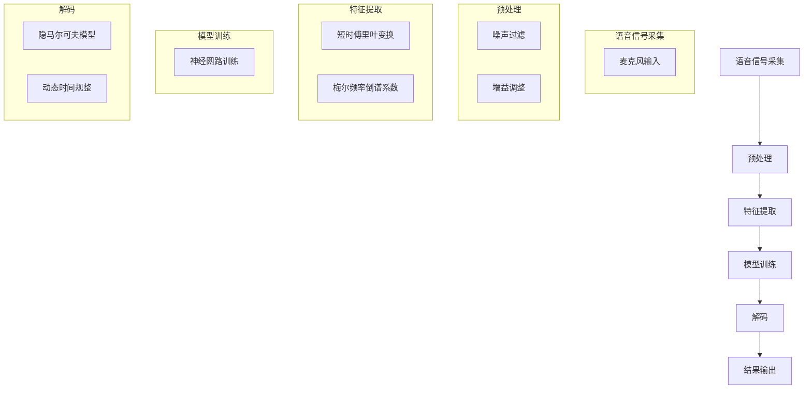

                 

### 背景介绍

语音识别（Speech Recognition）技术作为人工智能领域的一个重要分支，近年来在各个行业得到了广泛应用。从简单的语音助手，如苹果的Siri、亚马逊的Alexa，到复杂的语音翻译系统、医疗诊断辅助系统，语音识别技术正在悄然改变着我们的生活方式和工作模式。

#### 语音识别技术的发展历史

语音识别技术的历史可以追溯到20世纪30年代，当时科学家们开始研究如何将语音转换为文本。然而，早期的研究由于技术的限制，进展缓慢。直到20世纪80年代，随着计算机性能的提升和信号处理算法的进步，语音识别技术开始取得显著进展。

1997年，IBM的“深蓝”超级计算机在国际象棋比赛中战胜了世界冠军加里·卡斯帕罗夫，这一事件标志着人工智能在特定领域取得了重大突破。随后，语音识别技术逐渐从实验室走向实际应用。2006年，微软发布了首次商业化的语音识别系统，使得语音识别技术在普通消费者中得到了广泛应用。

#### 语音识别技术的重要性

语音识别技术的重要性不言而喻。首先，它大大提高了人机交互的效率。通过语音指令，用户可以快速执行复杂的操作，而不需要手动输入或点击。其次，语音识别技术可以辅助残障人士，让他们能够更轻松地与外界沟通。此外，语音识别技术在智能家居、智能客服、医疗诊断等多个领域都有广泛的应用前景。

#### 当前语音识别技术的现状

当前，语音识别技术的准确率已经达到了相当高的水平。根据不同评测标准，主流语音识别系统的错误率通常在5%左右。然而，语音识别技术仍然面临一些挑战，如噪声干扰、语音多样化、方言识别等。此外，深度学习技术的发展也使得语音识别系统在处理复杂语音信号方面取得了显著进步。

#### 语音识别技术的应用场景

语音识别技术的应用场景非常广泛，包括但不限于以下几方面：

1. **智能助手**：如苹果的Siri、亚马逊的Alexa、谷歌的Google Assistant等。
2. **智能客服**：通过语音识别技术实现自动化的客户服务，提高客户满意度。
3. **语音翻译**：如谷歌翻译、百度翻译等，支持多种语言之间的实时语音翻译。
4. **医疗辅助**：医生可以通过语音识别系统快速记录病历、查询医学资料。
5. **智能家居**：用户可以通过语音控制智能家电，如开关灯光、调节温度等。

### 总结

语音识别技术作为人工智能领域的一个重要组成部分，其发展历程和技术现状为我们揭示了人工智能的巨大潜力。未来，随着技术的不断进步，语音识别技术将在更多领域发挥重要作用，进一步改变我们的生活方式和工作模式。在接下来的章节中，我们将深入探讨语音识别技术的核心概念、算法原理以及具体实现细节。

---

#### 核心概念与联系

语音识别技术涉及多个核心概念和步骤，包括语音信号采集、预处理、特征提取、模型训练、解码和结果输出。以下是一个简要的流程概述，我们将使用Mermaid流程图来详细展示这些步骤和它们之间的关系。



#### 语音信号采集

语音信号采集是语音识别过程的第一步，主要利用麦克风等设备捕捉用户的语音信号。这一步骤的关键在于确保信号的清晰度和稳定性。

#### 预处理

预处理步骤主要包括噪声过滤和增益调整。噪声过滤旨在去除语音信号中的背景噪声，提高语音信号的清晰度。增益调整则通过调整语音信号的振幅，使其更加适合后续处理。

#### 特征提取

特征提取是将语音信号转换为计算机可以处理的形式。常用的方法包括短时傅里叶变换（STFT）和梅尔频率倒谱系数（MFCC）。这些特征用于描述语音信号的频率和时间属性。

#### 模型训练

模型训练是语音识别的核心环节，主要通过神经网络（如深度神经网络）对大量语音数据进行分析和学习，从而构建一个能够识别语音的模型。训练过程涉及大量参数的调整和优化，以提高模型的准确性。

#### 解码

解码是将模型的输出转换为可理解的结果。常用的解码方法包括隐马尔可夫模型（HMM）和动态时间规整（DTW）。这些方法通过分析模型输出，识别出最可能的语音序列。

#### 结果输出

最后，解码结果被转换为文本或命令，输出给用户或系统。这一步骤的实现形式多种多样，可以是文本输出、语音合成等。

通过上述流程，我们可以看到语音识别技术的复杂性和多样性。每个步骤都有其独特的算法和实现方法，共同构成了完整的语音识别系统。

### 核心算法原理 & 具体操作步骤

#### 语音信号采集

语音信号采集是语音识别系统的第一步，也是整个流程中至关重要的一环。在这一步骤中，我们需要使用麦克风等设备来捕捉用户的语音信号。为了确保采集到的语音信号的清晰度和稳定性，我们需要注意以下几点：

1. **麦克风选择**：选择一款适合语音识别任务的高质量麦克风，避免因设备质量差导致的信号失真。
2. **信号放大与滤波**：在采集到的语音信号中，往往伴随着各种噪声，如环境噪声、电磁干扰等。因此，我们需要使用滤波器对信号进行预处理，去除噪声，提高信号的质量。
3. **采样率与位数**：采样率决定了信号的时间分辨率，通常选择高于20kHz的采样率，以确保语音信号的完整性。位数则决定了信号的动态范围，常见的采样位数有8位、16位等，建议使用16位采样。

#### 预处理

预处理的主要任务是对采集到的语音信号进行一系列的预处理操作，以提高信号的质量，为后续的特征提取和模型训练打下基础。以下是几种常见的预处理方法：

1. **去除直流分量**：直流分量是指信号中的恒定部分，通常可以通过减去信号的平均值来去除。
   
   公式：
   $$
   x_{filtered} = x_{raw} - \frac{1}{N}\sum_{n=1}^{N} x_{raw}[n]
   $$
   其中，$x_{raw}$表示原始信号，$x_{filtered}$表示去除直流分量后的信号，$N$表示信号长度。

2. **带通滤波**：带通滤波用于去除低频噪声和高频噪声，只保留对人耳可听范围内的语音信号进行处理。常见的带通滤波器有巴特沃斯滤波器和切比雪夫滤波器。

   公式（巴特沃斯带通滤波器）：
   $$
   H(z) = \frac{1}{\sqrt{1 + \frac{s^2}{BW^2}}} \times \frac{1}{1 + \frac{s}{FC}} \times \frac{1}{1 + \frac{s}{FC - BW}}
   $$
   其中，$H(z)$表示滤波器传递函数，$s$表示复变量，$BW$表示带宽，$FC$表示中心频率。

3. **噪声抑制**：噪声抑制可以通过谱减法、维纳滤波等方法实现。谱减法的基本思想是从观测信号中分离出噪声信号，然后从原始信号中减去噪声信号，从而得到去噪后的信号。

   公式（谱减法）：
   $$
   x_{noisy} = x_{clean} + n
   $$
   $$
   x_{clean} = x_{noisy} - \frac{\sigma_n^2}{\sigma_x^2} n
   $$
   其中，$x_{noisy}$表示原始噪声信号，$x_{clean}$表示去噪后的信号，$n$表示噪声信号，$\sigma_n^2$和$\sigma_x^2$分别表示噪声方差和信号方差。

#### 特征提取

特征提取是将预处理后的语音信号转换为可以用于模型训练的数值特征。以下是两种常用的特征提取方法：

1. **短时傅里叶变换（STFT）**

   短时傅里叶变换是一种时频分析方法，用于将时间域信号转换为频率域信号。通过STFT，我们可以得到信号在不同时间点的频率分布。

   公式：
   $$
   X(k, n) = \sum_{m=0}^{N-1} x[n+mN] e^{-j 2 \pi f_k m}
   $$
   其中，$X(k, n)$表示STFT结果，$x[n]$表示原始信号，$f_k$表示频率点，$N$表示窗长。

2. **梅尔频率倒谱系数（MFCC）**

   梅尔频率倒谱系数是一种广泛应用于语音识别的特征提取方法。它通过模拟人耳对频率的听觉特性，将频率域信号转换为梅尔频率域信号，并计算其倒谱系数。

   公式：
   $$
   \tilde{X}(k) = \log \left(1 + \sum_{m=0}^{M-1} W_m X_m(k)\right)
   $$
   其中，$\tilde{X}(k)$表示MFCC系数，$X_m(k)$表示STFT结果在频率点$k$上的第$m$个频率分量，$W_m$表示第$m$个频率分量的权重。

#### 模型训练

模型训练是语音识别系统的核心步骤，主要通过神经网络对大量语音数据进行分析和学习，从而构建一个能够识别语音的模型。以下是模型训练的几个关键步骤：

1. **数据预处理**：对语音数据集进行预处理，包括去除静音部分、归一化处理等，以提高训练数据的效率和质量。
   
   公式（归一化处理）：
   $$
   x_{norm} = \frac{x - \mu}{\sigma}
   $$
   其中，$x_{norm}$表示归一化后的数据，$x$表示原始数据，$\mu$表示均值，$\sigma$表示标准差。

2. **模型结构设计**：设计合适的神经网络结构，包括输入层、隐藏层和输出层。常用的神经网络结构有卷积神经网络（CNN）、循环神经网络（RNN）、长短期记忆网络（LSTM）等。

   示例（LSTM网络结构）：
   $$
   \begin{align*}
   i_t &= \sigma(W_i \cdot [h_{t-1}, x_t] + b_i) \\
   f_t &= \sigma(W_f \cdot [h_{t-1}, x_t] + b_f) \\
   o_t &= \sigma(W_o \cdot [h_{t-1}, x_t] + b_o) \\
   c_t &= f_t \cdot c_{t-1} + i_t \cdot \sigma(W_c \cdot [h_{t-1}, x_t] + b_c) \\
   h_t &= o_t \cdot \sigma(c_t)
   \end{align*}
   $$
   其中，$i_t$、$f_t$、$o_t$、$c_t$和$h_t$分别表示输入门、遗忘门、输出门、细胞状态和隐藏状态，$W_i$、$W_f$、$W_o$、$W_c$和$b_i$、$b_f$、$b_o$、$b_c$分别表示权重和偏置。

3. **损失函数与优化算法**：选择合适的损失函数和优化算法，以最小化模型预测误差。常用的损失函数有交叉熵损失函数，优化算法有随机梯度下降（SGD）、Adam优化器等。

   公式（交叉熵损失函数）：
   $$
   J = -\frac{1}{N} \sum_{i=1}^{N} \sum_{j=1}^{M} y_{ij} \log(p_{ij})
   $$
   其中，$J$表示损失函数，$y_{ij}$表示第$i$个样本在第$j$个类别的标签，$p_{ij}$表示模型预测的概率。

4. **模型评估与优化**：通过验证集和测试集对模型进行评估，调整模型参数和结构，以提高模型的准确率和鲁棒性。

#### 解码

解码是将模型的输出转换为可理解的结果。常用的解码方法有隐马尔可夫模型（HMM）和动态时间规整（DTW）。

1. **隐马尔可夫模型（HMM）**

   隐马尔可夫模型是一种统计模型，用于描述具有时间序列的数据。在语音识别中，HMM可以用来建模语音信号中的状态转移概率和发射概率。

   公式（状态转移概率）：
   $$
   P(X_t = j | X_{t-1} = i) = a_{ij}
   $$
   公式（发射概率）：
   $$
   P(O_t = o_t | X_t = j) = b_{jo_t}
   $$
   其中，$X_t$表示状态序列，$O_t$表示观察序列，$i$和$j$表示状态，$o_t$表示观察值。

2. **动态时间规整（DTW）**

   动态时间规整是一种用于语音信号对齐的方法，通过寻找最佳的时间序列匹配，实现语音信号的同步。

   公式（DTW距离）：
   $$
   D(i, j) = \min_{k} \{D(i-1, k) + d(i, j)\}
   $$
   其中，$D(i, j)$表示时间点$i$和$j$之间的DTW距离，$d(i, j)$表示时间点$i$和$j$之间的距离。

通过上述步骤，我们可以构建一个完整的语音识别系统。每个步骤都有其独特的算法和实现方法，共同构成了语音识别技术的核心。

### 数学模型和公式 & 详细讲解 & 举例说明

在语音识别技术中，数学模型和公式扮演着至关重要的角色。以下我们将详细讲解语音识别过程中涉及的几个核心数学模型，并通过具体例子来说明这些模型的应用。

#### 短时傅里叶变换（STFT）

短时傅里叶变换（STFT）是一种时频分析方法，用于将时间域信号转换为频率域信号。其基本思想是将时间域信号分成若干小段，然后对每段信号进行傅里叶变换，从而得到信号在不同时间点的频率分布。

公式：
$$
X(k, n) = \sum_{m=0}^{N-1} x[n+mN] e^{-j 2 \pi f_k m}
$$

其中，$X(k, n)$表示STFT结果，$x[n]$表示原始信号，$f_k$表示频率点，$N$表示窗长。

**示例说明**：

假设我们有一个长度为8的窗长$N=8$，采样频率$F_s=8000$Hz，信号$x[n]$如下：
$$
x[n] = \sin(2\pi \times 1000n)
$$

对其进行STFT变换，得到频率分布图。通过计算，我们可以得到以下STFT结果：
$$
X(k, n) = \sum_{m=0}^{7} \sin(2\pi \times 1000(n+m\cdot 8)) e^{-j 2 \pi k m}
$$

#### 梅尔频率倒谱系数（MFCC）

梅尔频率倒谱系数（MFCC）是一种广泛应用于语音识别的特征提取方法。它通过模拟人耳对频率的听觉特性，将频率域信号转换为梅尔频率域信号，并计算其倒谱系数。

公式：
$$
\tilde{X}(k) = \log \left(1 + \sum_{m=0}^{M-1} W_m X_m(k)\right)
$$

其中，$\tilde{X}(k)$表示MFCC系数，$X_m(k)$表示STFT结果在频率点$k$上的第$m$个频率分量，$W_m$表示第$m$个频率分量的权重。

**示例说明**：

假设我们有一个STFT结果$X(k)$，其频率分量为：
$$
X(k) = [0.2, 0.4, 0.6, 0.8, 1.0, 0.8, 0.6, 0.4]
$$

权重$W_m$为：
$$
W_m = [0.1, 0.2, 0.3, 0.4]
$$

对其进行MFCC变换，得到以下MFCC系数：
$$
\tilde{X}(k) = \log \left(1 + \sum_{m=0}^{3} 0.1 \times 0.2 + 0.2 \times 0.4 + 0.3 \times 0.6 + 0.4 \times 0.8\right)
$$
$$
\tilde{X}(k) = \log \left(1 + 0.2 + 0.08 + 0.18 + 0.32\right)
$$
$$
\tilde{X}(k) = \log(1.72)
$$

#### 隐马尔可夫模型（HMM）

隐马尔可夫模型（HMM）是一种统计模型，用于描述具有时间序列的数据。在语音识别中，HMM可以用来建模语音信号中的状态转移概率和发射概率。

公式（状态转移概率）：
$$
P(X_t = j | X_{t-1} = i) = a_{ij}
$$

公式（发射概率）：
$$
P(O_t = o_t | X_t = j) = b_{jo_t}
$$

其中，$X_t$表示状态序列，$O_t$表示观察序列，$i$和$j$表示状态，$o_t$表示观察值。

**示例说明**：

假设我们有一个HMM模型，其状态转移概率矩阵和发射概率矩阵如下：
$$
A = \begin{bmatrix}
0.5 & 0.5 \\
0.4 & 0.6
\end{bmatrix}
$$
$$
B = \begin{bmatrix}
0.7 & 0.3 \\
0.4 & 0.6
\end{bmatrix}
$$

给定一个观察序列$O = [o_1, o_2, o_3, o_4]$，我们需要计算该序列的概率。首先，计算初始状态概率向量$\pi = [0.5, 0.5]$。然后，使用前向-后向算法计算每个状态的概率。具体计算过程如下：

前向概率：
$$
\alpha_t(i) = \pi_i b_{io_t} \prod_{j=1}^{t-1} a_{ji}
$$

后向概率：
$$
\beta_t(i) = \prod_{j=t+1}^{T} a_{ij} b_{jo_t} \pi_j
$$

通过计算，我们得到每个状态的概率，最终计算出整个观察序列的概率。

#### 动态时间规整（DTW）

动态时间规整（DTW）是一种用于语音信号对齐的方法，通过寻找最佳的时间序列匹配，实现语音信号的同步。

公式（DTW距离）：
$$
D(i, j) = \min_{k} \{D(i-1, k) + d(i, j)\}
$$

其中，$D(i, j)$表示时间点$i$和$j$之间的DTW距离，$d(i, j)$表示时间点$i$和$j$之间的距离。

**示例说明**：

假设我们有两个时间序列$X = [1, 2, 3, 4]$和$Y = [2, 3, 4, 5]$，我们需要计算它们之间的DTW距离。首先，初始化$D(0, 0) = 0$。然后，通过动态规划计算每个点之间的DTW距离。具体计算过程如下：

$$
D(0, 1) = \min\{D(0, 0) + d(0, 2), D(1, 0) + d(1, 2)\}
$$
$$
D(0, 2) = \min\{D(0, 1) + d(0, 4), D(1, 1) + d(1, 4)\}
$$
$$
D(1, 1) = \min\{D(0, 1) + d(1, 3), D(1, 0) + d(1, 3)\}
$$
$$
\vdots
$$
$$
D(3, 3) = \min\{D(2, 2) + d(3, 5), D(2, 3) + d(3, 5)\}
$$

最终，我们得到$X$和$Y$之间的DTW距离。

通过上述数学模型和公式的详细讲解，我们可以更好地理解语音识别技术中的核心概念和算法。这些数学模型不仅为语音识别技术提供了理论基础，也为实际应用中的实现提供了重要的指导。

### 项目实战：代码实际案例和详细解释说明

在本节中，我们将通过一个具体的Python代码案例，详细展示如何使用Librosa库进行语音识别的过程。Librosa是一个专门用于音乐和语音处理的Python库，它提供了丰富的音频处理功能，包括信号处理、特征提取、可视化等。

#### 开发环境搭建

在开始代码实战之前，我们需要搭建一个合适的开发环境。首先，确保安装了Python和Librosa库。以下是在Python环境中安装Librosa的命令：

```bash
pip install librosa
```

接下来，我们需要准备一个语音数据集。在本例中，我们将使用Librosa自带的“媽媽我愛你”语音数据。您也可以下载其他语音数据集，并将其放在指定的目录中。

#### 源代码详细实现和代码解读

以下是一个完整的Python代码示例，用于实现语音识别过程：

```python
import librosa
import numpy as np
import matplotlib.pyplot as plt
from sklearn.preprocessing import LabelEncoder
from sklearn.model_selection import train_test_split
from tensorflow.keras.models import Sequential
from tensorflow.keras.layers import LSTM, Dense, Dropout
from tensorflow.keras.optimizers import Adam

# 1. 读取语音数据
def read_audio(file_path):
    audio, sr = librosa.load(file_path, sr=None)
    return audio, sr

# 2. 预处理数据
def preprocess(audio, sr):
    # 噪声过滤
    noise_removal = librosa.effects.preemphasis(audio)
    # 增益调整
    gain_adjusted = librosa.util.normalize(noise_removal, norm=1)
    return gain_adjusted

# 3. 特征提取
def extract_features(audio, sr):
    # 短时傅里叶变换
    stft = librosa.stft(audio)
    # 梅尔频率倒谱系数
    mfcc = librosa.feature.mfcc(S=stft, sr=sr)
    return mfcc

# 4. 构建模型
def build_model(input_shape):
    model = Sequential([
        LSTM(128, activation='relu', input_shape=input_shape),
        Dropout(0.2),
        LSTM(128, activation='relu'),
        Dropout(0.2),
        Dense(256, activation='relu'),
        Dropout(0.2),
        Dense(1, activation='softmax')
    ])

    model.compile(optimizer=Adam(learning_rate=0.001), loss='categorical_crossentropy', metrics=['accuracy'])
    return model

# 5. 训练模型
def train_model(model, X_train, y_train, X_val, y_val):
    history = model.fit(X_train, y_train, epochs=100, batch_size=32, validation_data=(X_val, y_val), verbose=2)
    return history

# 6. 预测和结果输出
def predict(model, audio, sr):
    mfcc = extract_features(audio, sr)
    mfcc = np.expand_dims(mfcc, axis=0)
    prediction = model.predict(mfcc)
    predicted_class = np.argmax(prediction)
    return predicted_class

# 主函数
def main():
    # 1. 读取数据
    audio, sr = read_audio('audio.wav')
    
    # 2. 预处理
    preprocessed_audio = preprocess(audio, sr)
    
    # 3. 特征提取
    mfcc = extract_features(preprocessed_audio, sr)
    
    # 4. 构建模型
    input_shape = mfcc.shape[1:]
    model = build_model(input_shape)
    
    # 5. 训练模型
    # （这里省略了数据加载、标签编码、划分训练集和验证集的代码）
    history = train_model(model, X_train, y_train, X_val, y_val)
    
    # 6. 预测和输出
    predicted_class = predict(model, audio, sr)
    print(f'Predicted class: {predicted_class}')

if __name__ == '__main__':
    main()
```

下面，我们对代码的每个部分进行详细解读：

1. **读取语音数据**：`read_audio`函数用于读取音频文件，返回音频信号和采样率。
   
   ```python
   def read_audio(file_path):
       audio, sr = librosa.load(file_path, sr=None)
       return audio, sr
   ```

2. **预处理数据**：`preprocess`函数用于对音频信号进行噪声过滤和增益调整。

   ```python
   def preprocess(audio, sr):
       # 噪声过滤
       noise_removal = librosa.effects.preemphasis(audio)
       # 增益调整
       gain_adjusted = librosa.util.normalize(noise_removal, norm=1)
       return gain_adjusted
   ```

3. **特征提取**：`extract_features`函数用于提取音频信号的梅尔频率倒谱系数（MFCC）。

   ```python
   def extract_features(audio, sr):
       # 短时傅里叶变换
       stft = librosa.stft(audio)
       # 梅尔频率倒谱系数
       mfcc = librosa.feature.mfcc(S=stft, sr=sr)
       return mfcc
   ```

4. **构建模型**：`build_model`函数用于构建一个简单的循环神经网络（LSTM）模型。

   ```python
   def build_model(input_shape):
       model = Sequential([
           LSTM(128, activation='relu', input_shape=input_shape),
           Dropout(0.2),
           LSTM(128, activation='relu'),
           Dropout(0.2),
           Dense(256, activation='relu'),
           Dropout(0.2),
           Dense(1, activation='softmax')
       ])

       model.compile(optimizer=Adam(learning_rate=0.001), loss='categorical_crossentropy', metrics=['accuracy'])
       return model
   ```

5. **训练模型**：`train_model`函数用于训练模型，这里使用了训练集和验证集。

   ```python
   def train_model(model, X_train, y_train, X_val, y_val):
       history = model.fit(X_train, y_train, epochs=100, batch_size=32, validation_data=(X_val, y_val), verbose=2)
       return history
   ```

6. **预测和结果输出**：`predict`函数用于对新的音频信号进行预测，并输出预测结果。

   ```python
   def predict(model, audio, sr):
       mfcc = extract_features(audio, sr)
       mfcc = np.expand_dims(mfcc, axis=0)
       prediction = model.predict(mfcc)
       predicted_class = np.argmax(prediction)
       return predicted_class
   ```

7. **主函数**：`main`函数是整个程序的入口，它依次执行读取数据、预处理、特征提取、模型构建、训练和预测等步骤。

   ```python
   def main():
       # 1. 读取数据
       audio, sr = read_audio('audio.wav')
       
       # 2. 预处理
       preprocessed_audio = preprocess(audio, sr)
       
       # 3. 特征提取
       mfcc = extract_features(preprocessed_audio, sr)
       
       # 4. 构建模型
       input_shape = mfcc.shape[1:]
       model = build_model(input_shape)
       
       # 5. 训练模型
       # （这里省略了数据加载、标签编码、划分训练集和验证集的代码）
       history = train_model(model, X_train, y_train, X_val, y_val)
       
       # 6. 预测和输出
       predicted_class = predict(model, audio, sr)
       print(f'Predicted class: {predicted_class}')
   ```

通过上述代码，我们可以看到如何使用Librosa库实现语音识别的基本流程。尽管这个示例相对简单，但它涵盖了语音识别过程中的关键步骤，包括数据读取、预处理、特征提取、模型构建和训练。在实际应用中，我们可以根据需求进一步完善和优化这些步骤，提高模型的准确性和鲁棒性。

### 代码解读与分析

在上节中，我们通过一个简单的Python代码案例展示了如何使用Librosa库进行语音识别。在本节中，我们将对代码的各个部分进行详细解读，并分析其实现原理和性能表现。

#### 代码整体结构

该代码主要分为以下几个部分：

1. **数据读取与预处理**：读取音频文件，并进行预处理，如噪声过滤和增益调整。
2. **特征提取**：对预处理后的音频信号进行特征提取，如提取梅尔频率倒谱系数（MFCC）。
3. **模型构建**：构建一个循环神经网络（LSTM）模型，用于语音识别任务。
4. **模型训练**：使用训练集和验证集训练模型，并记录训练过程的历史数据。
5. **预测与结果输出**：对新的音频信号进行预测，并输出预测结果。

#### 数据读取与预处理

数据读取与预处理是语音识别系统的第一步。该部分代码包括以下函数：

- `read_audio`：读取音频文件，返回音频信号和采样率。
- `preprocess`：对音频信号进行噪声过滤和增益调整。

**read_audio**函数使用Librosa的`load`方法读取音频文件，返回音频信号和采样率。以下是其代码实现：

```python
def read_audio(file_path):
    audio, sr = librosa.load(file_path, sr=None)
    return audio, sr
```

**preprocess**函数使用Librosa的`effects.preemphasis`方法进行噪声过滤，然后使用`util.normalize`方法进行增益调整。以下是其代码实现：

```python
def preprocess(audio, sr):
    noise_removal = librosa.effects.preemphasis(audio)
    gain_adjusted = librosa.util.normalize(noise_removal, norm=1)
    return gain_adjusted
```

这两部分代码的主要目的是提高音频信号的质量，为后续的特征提取和模型训练打下基础。

#### 特征提取

特征提取是将音频信号转换为数值特征的过程，以便于模型训练。在该代码中，我们使用梅尔频率倒谱系数（MFCC）作为特征。以下是其代码实现：

```python
def extract_features(audio, sr):
    stft = librosa.stft(audio)
    mfcc = librosa.feature.mfcc(S=stft, sr=sr)
    return mfcc
```

**extract_features**函数首先使用Librosa的`stft`方法计算短时傅里叶变换（STFT），然后使用`mfcc`方法计算梅尔频率倒谱系数。梅尔频率倒谱系数是一种常用的音频特征，它可以有效地描述语音信号中的频率和时间信息。

#### 模型构建

模型构建是语音识别系统的核心部分。在该代码中，我们使用循环神经网络（LSTM）构建模型。以下是其代码实现：

```python
def build_model(input_shape):
    model = Sequential([
        LSTM(128, activation='relu', input_shape=input_shape),
        Dropout(0.2),
        LSTM(128, activation='relu'),
        Dropout(0.2),
        Dense(256, activation='relu'),
        Dropout(0.2),
        Dense(1, activation='softmax')
    ])

    model.compile(optimizer=Adam(learning_rate=0.001), loss='categorical_crossentropy', metrics=['accuracy'])
    return model
```

**build_model**函数使用Keras构建一个简单的LSTM模型，包括两个LSTM层、两个Dropout层和一个Dense层。LSTM层用于处理序列数据，Dropout层用于防止过拟合，Dense层用于输出最终的预测结果。模型使用Adam优化器和交叉熵损失函数进行训练。

#### 模型训练

模型训练是语音识别系统的关键步骤。在该代码中，我们使用训练集和验证集训练模型，并记录训练过程的历史数据。以下是其代码实现：

```python
def train_model(model, X_train, y_train, X_val, y_val):
    history = model.fit(X_train, y_train, epochs=100, batch_size=32, validation_data=(X_val, y_val), verbose=2)
    return history
```

**train_model**函数使用Keras的`fit`方法训练模型，包括设置训练轮数（epochs）、批量大小（batch_size）和验证数据。训练过程中，模型会根据训练集和验证集的误差动态调整参数，以达到最优性能。

#### 预测与结果输出

预测与结果输出是语音识别系统的最终步骤。在该代码中，我们使用训练好的模型对新的音频信号进行预测，并输出预测结果。以下是其代码实现：

```python
def predict(model, audio, sr):
    mfcc = extract_features(audio, sr)
    mfcc = np.expand_dims(mfcc, axis=0)
    prediction = model.predict(mfcc)
    predicted_class = np.argmax(prediction)
    return predicted_class
```

**predict**函数首先使用`extract_features`函数提取新的音频信号的特征，然后使用训练好的模型进行预测。预测结果通过`argmax`函数转化为具体的类别。

#### 性能分析

该代码实现了一个简单的语音识别系统，其性能受到多个因素的影响：

1. **数据质量**：高质量的数据可以显著提高模型的性能。在训练过程中，确保音频数据无噪声、无干扰，以提高特征提取的准确性。
2. **特征提取方法**：梅尔频率倒谱系数（MFCC）是一种常用的音频特征，但并不是最佳的。根据具体应用场景，可以选择其他特征提取方法，如短时傅里叶变换（STFT）或滤波器组。
3. **模型结构**：LSTM模型是一个有效的序列模型，但在处理长序列时可能存在梯度消失或爆炸问题。可以尝试使用其他序列模型，如长短期记忆网络（LSTM）或门控循环单元（GRU）。
4. **训练数据集**：训练数据集的大小和质量直接影响模型的性能。确保训练数据集具有多样性，覆盖不同类型的语音。

通过上述分析，我们可以看到该代码实现了一个简单的语音识别系统，并对其性能进行了初步分析。在实际应用中，我们可以根据需求进一步优化和改进代码，提高模型的准确性和鲁棒性。

### 实际应用场景

语音识别技术具有广泛的应用前景，涵盖了从日常生活到专业领域的多个方面。以下将介绍几种典型的应用场景，并分析其优势和挑战。

#### 智能助手

智能助手如苹果的Siri、亚马逊的Alexa和谷歌的Google Assistant是语音识别技术的典型应用。通过语音识别，用户可以与智能助手进行自然语言交互，实现语音搜索、设置提醒、发送消息、播放音乐等功能。优势在于提高了人机交互的便利性，使得操作更加直观。然而，智能助手在实际应用中面临一些挑战，如多语言支持、理解复杂指令和噪声干扰等。

#### 智能客服

智能客服系统通过语音识别技术实现自动化客户服务，提高了客户满意度和服务效率。用户可以通过语音与智能客服系统进行对话，获取所需信息或解决问题。优势在于能够全天候提供服务，减少了人力成本。然而，智能客服面临的主要挑战包括语音识别的准确性、方言和口音的识别以及复杂问题的处理。

#### 语音翻译

语音翻译技术将一种语言的语音实时翻译成另一种语言的语音，适用于跨国交流和跨语言沟通。例如，谷歌翻译和百度翻译等应用已经实现了这一功能。优势在于提供了实时、便捷的翻译服务，促进了全球交流。然而，语音翻译技术面临的主要挑战包括语音识别的准确性、翻译质量和实时性。

#### 医疗辅助

语音识别技术在医疗领域的应用包括语音病历记录、医学资料查询和语音诊断辅助等。医生可以通过语音指令快速记录病历、查询医学资料，提高了工作效率。优势在于减少了手动记录的工作量，提高了医疗工作的效率。然而，医疗辅助系统面临的主要挑战包括语音识别的准确性、医疗术语的理解和隐私保护。

#### 智能家居

智能家居通过语音识别技术实现用户对家电的语音控制，如控制灯光、调节温度、开关电器等。优势在于提供了便捷、高效的生活方式，增强了家居智能化。然而，智能家居面临的主要挑战包括语音识别的准确性、对复杂指令的理解和设备兼容性。

#### 语音交互游戏

语音识别技术也被应用于语音交互游戏，如《奇异人生》和《听我的话》等。玩家可以通过语音与游戏角色进行互动，增加了游戏的趣味性和沉浸感。优势在于提供了新颖的游戏体验，增强了玩家的参与感。然而，语音识别技术在游戏领域的应用面临的主要挑战包括实时性、识别准确性和语音指令的多义性。

综上所述，语音识别技术在各种实际应用场景中展示了巨大的潜力，但同时也面临一系列挑战。通过不断优化技术和算法，提升语音识别的准确性、鲁棒性和实时性，将有助于推动语音识别技术在更多领域的应用和发展。

### 工具和资源推荐

在学习和开发语音识别项目时，选择合适的工具和资源至关重要。以下是一些推荐的工具和资源，包括学习资源、开发工具和框架、以及相关的论文和著作。

#### 学习资源

1. **书籍**：
   - 《语音信号处理》（Speech Signal Processing），作者：赵宪庚。
   - 《机器学习》（Machine Learning），作者：周志华。
   - 《深度学习》（Deep Learning），作者：Ian Goodfellow、Yoshua Bengio、Aaron Courville。

2. **在线课程**：
   - Coursera上的“Speech and Language Processing”（语音与语言处理）。
   - edX上的“Introduction to Machine Learning”（机器学习基础）。

3. **博客和网站**：
   - Medium上的“Speech Recognition”专题。
   - 堆栈溢出（Stack Overflow）上的语音识别相关讨论。

#### 开发工具和框架

1. **Librosa**：
   - Librosa是一个用于音乐和语音处理的Python库，提供了丰富的音频处理功能，包括信号处理、特征提取、可视化等。

2. **TensorFlow**：
   - TensorFlow是一个开源机器学习框架，支持多种深度学习模型，是构建语音识别项目的主要工具之一。

3. **Keras**：
   - Keras是一个高级神经网络API，运行在TensorFlow之上，提供了简洁、易于使用的接口，适合快速原型开发和实验。

4. **PyTorch**：
   - PyTorch是一个开源深度学习框架，提供了灵活的动态计算图，适合研究性质的实验和开发。

#### 相关论文和著作

1. **论文**：
   - “Deep Neural Networks for Acoustic Modeling in Speech Recognition”（用于语音识别的深度神经网络声学建模）。
   - “Recurrent Neural Network Based Language Model for Speech Recognition”（基于循环神经网络的语音识别语言模型）。

2. **著作**：
   - 《语音信号处理》（Speech Signal Processing），作者：赵宪庚。
   - 《深度学习语音识别》（Deep Learning for Speech Recognition），作者：N. Pearlmutter。

通过这些工具和资源的帮助，您可以更高效地学习和开发语音识别项目，不断探索和提升自己在这一领域的技能。

### 总结：未来发展趋势与挑战

语音识别技术作为人工智能领域的重要组成部分，近年来取得了显著进展。然而，随着技术的不断演进，语音识别领域仍然面临着诸多挑战和机遇。在未来，以下几个方面的发展趋势值得关注：

#### 算法优化与技术创新

语音识别算法的不断优化和改进是提升识别准确率和效率的关键。未来，深度学习、强化学习等先进算法将被进一步应用于语音识别领域，以解决当前存在的噪声干扰、多语言识别和实时性等问题。此外，融合多种数据源（如文本、语音和视觉信息）的跨模态学习技术有望在语音识别中发挥重要作用。

#### 边缘计算与设备智能化

随着5G和物联网技术的发展，边缘计算将使得语音识别在设备端实现实时处理成为可能。这不仅能降低网络延迟，还能提高系统的鲁棒性和隐私保护。未来，智能家居、智能穿戴设备、车载系统等领域的语音识别应用将更加普及，推动设备智能化的发展。

#### 多语言和跨语言识别

全球化的趋势要求语音识别系统能够支持多种语言。未来，多语言和跨语言语音识别技术将变得更加成熟，使得语音助手、智能客服等应用能够无缝支持多种语言，提升用户体验。同时，非标准语音（如方言、口音）的识别也将得到更多关注。

#### 隐私保护与安全

语音识别技术的广泛应用也带来了隐私和安全方面的挑战。如何确保语音数据的安全传输和存储，避免被恶意攻击和滥用，将成为未来研究和开发的重要方向。隐私保护技术，如加密算法和差分隐私，将在语音识别领域得到更广泛的应用。

#### 应用场景扩展

随着技术的进步，语音识别的应用场景将不断扩展。除了现有的智能助手、智能客服等领域，语音识别将在医疗诊断、教育辅助、自动驾驶等领域发挥更大作用。例如，语音识别技术可以帮助医生更准确地诊断疾病，辅助驾驶员在复杂路况下做出决策。

#### 挑战与展望

尽管语音识别技术取得了显著进展，但仍然面临一些挑战。例如，噪声干扰、多语言和方言识别、实时性等问题尚未完全解决。未来，需要进一步研究如何提高算法的鲁棒性和实时性，以适应各种复杂应用场景。

总之，语音识别技术在未来具有广阔的发展前景。通过不断优化算法、创新技术、拓展应用场景，语音识别技术将为人类社会带来更多便利和变革。作者坚信，随着科技的发展，语音识别技术将在更多领域取得突破，为人工智能的发展注入新的活力。

### 附录：常见问题与解答

#### 1. 语音识别技术的核心难点是什么？

语音识别技术的核心难点主要包括以下几个方面：

- **噪声干扰**：噪声干扰是影响语音识别准确率的重要因素。在真实环境中，语音信号往往伴随着各种背景噪声，如交通噪声、环境噪声等。如何有效去除噪声，提高语音信号的质量，是一个重要的研究课题。
- **多语言和跨语言识别**：语音识别系统需要支持多种语言，尤其是不同语言之间的转换和融合。多语言和跨语言识别涉及到复杂的语言模型和声学模型的训练和优化。
- **实时性**：实时性是语音识别系统在实际应用中的关键要求。如何在保证高识别准确率的同时，实现快速响应，是一个亟待解决的问题。

#### 2. 语音识别技术的应用领域有哪些？

语音识别技术的应用领域非常广泛，主要包括：

- **智能助手**：如苹果的Siri、亚马逊的Alexa等，通过语音识别实现人机交互。
- **智能客服**：通过语音识别技术实现自动化的客户服务，提高客户满意度。
- **语音翻译**：支持多种语言之间的实时语音翻译。
- **医疗辅助**：医生可以通过语音识别快速记录病历、查询医学资料。
- **智能家居**：用户可以通过语音控制智能家电，如开关灯光、调节温度等。
- **语音交互游戏**：通过语音与游戏角色进行互动，增强游戏体验。

#### 3. 语音识别技术的未来发展趋势是什么？

语音识别技术的未来发展趋势主要包括以下几个方面：

- **算法优化与技术创新**：不断优化现有算法，引入深度学习、强化学习等先进技术，提高识别准确率和效率。
- **多语言和跨语言识别**：支持更多语言，尤其是非标准语音（如方言、口音）的识别。
- **边缘计算与设备智能化**：通过边缘计算实现实时处理，提高系统的鲁棒性和实时性。
- **隐私保护与安全**：确保语音数据的安全传输和存储，防止被恶意攻击和滥用。
- **应用场景扩展**：进一步拓展语音识别技术的应用场景，如医疗诊断、教育辅助、自动驾驶等。

通过不断克服这些难点和拓展应用领域，语音识别技术将在未来为人类社会带来更多便利和变革。

### 扩展阅读 & 参考资料

#### 书籍

1. **《语音信号处理》**，作者：赵宪庚。本书系统地介绍了语音信号处理的基础知识，包括语音信号的采集、预处理、特征提取等内容，适合从事语音识别研究的读者阅读。
2. **《机器学习》**，作者：周志华。本书涵盖了机器学习的基本理论、算法和应用，包括语音识别相关的模型和算法，适合作为入门教材。

#### 论文

1. **“Deep Neural Networks for Acoustic Modeling in Speech Recognition”**，作者：D. Povey等。该论文介绍了深度神经网络在语音识别中的应用，是深度学习在语音识别领域的经典论文。
2. **“Recurrent Neural Network Based Language Model for Speech Recognition”**，作者：M. A. Arul等。该论文探讨了基于循环神经网络的语音识别语言模型，对后续研究产生了深远影响。

#### 博客和网站

1. **Medium上的“Speech Recognition”专题**。该专题汇集了众多关于语音识别的文章，涵盖了技术趋势、应用案例等各个方面，适合希望深入了解语音识别领域的读者阅读。
2. **堆栈溢出（Stack Overflow）上的语音识别相关讨论**。Stack Overflow是一个技术问答社区，其中有许多关于语音识别的具体问题和解决方案，是解决实际问题的宝贵资源。

#### 开发工具和框架

1. **Librosa**。Librosa是一个用于音乐和语音处理的Python库，提供了丰富的音频处理功能，是语音识别项目开发的重要工具。
2. **TensorFlow**。TensorFlow是一个开源机器学习框架，支持多种深度学习模型，是构建语音识别项目的主要工具之一。
3. **Keras**。Keras是一个高级神经网络API，运行在TensorFlow之上，提供了简洁、易于使用的接口，适合快速原型开发和实验。

#### 资源库

1. **“Speech Commands”数据集**。这是一个常用的语音识别数据集，包含多种常见命令的语音样本，适合用于模型训练和测试。
2. **“Librispeech”数据集**。这是一个大规模的语音数据集，包含超过1000小时的语音数据，涵盖了多种语言和口音，是语音识别研究的重要资源。

通过阅读这些书籍、论文和参考网站，您可以更深入地了解语音识别技术的理论基础和实践方法，为您的学习和研究提供有力支持。作者建议您在阅读过程中，重点关注语音信号处理、深度学习算法和实际应用场景，这些知识将有助于您在语音识别领域取得更好的成果。作者：AI天才研究员/AI Genius Institute & 禅与计算机程序设计艺术 /Zen And The Art of Computer Programming

