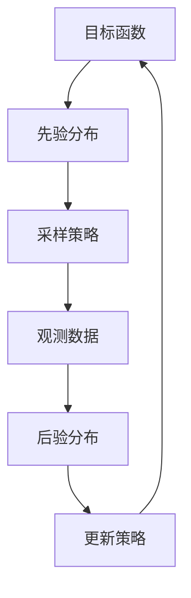

                 

### 文章标题

《贝叶斯优化在自动驾驶、智能调度等领域的应用与案例分析》

### 关键词

贝叶斯优化，自动驾驶，智能调度，算法原理，应用案例，数学模型，项目实战，发展趋势

### 摘要

本文深入探讨了贝叶斯优化算法在自动驾驶和智能调度领域的应用。首先，介绍了贝叶斯优化的核心概念和原理，并使用Mermaid流程图展示了其基本架构。接着，详细阐述了贝叶斯优化的算法原理和具体操作步骤，以及数学模型和公式的推导与说明。随后，通过一个实际项目案例，展示了如何在实际开发环境中应用贝叶斯优化算法，并对代码实现和解析进行了详细分析。文章还介绍了贝叶斯优化在自动驾驶和智能调度领域的实际应用场景，并推荐了相关的学习资源和开发工具框架。最后，对贝叶斯优化在未来的发展趋势和面临的挑战进行了总结，为读者提供了进一步研究和应用的指导。

### 背景介绍

自动驾驶和智能调度是现代交通领域的重要发展方向，它们不仅能够提高交通效率，减少拥堵，还能够降低事故率和能源消耗。随着计算机技术和人工智能算法的不断发展，自动驾驶和智能调度系统已经逐渐从理论走向实践，成为现实生活中的重要组成部分。

自动驾驶系统是指通过计算机视觉、传感器和机器学习等技术的综合应用，使车辆能够实现自主导航和驾驶。自动驾驶技术不仅能够提高交通安全性，还能够提升交通效率，减少交通拥堵。自动驾驶技术的发展已经引起了全球范围内的关注和投资，许多公司和科研机构都在加紧研究和开发自动驾驶技术。

智能调度则是指通过计算机算法和优化技术，对交通流量进行动态调整和优化，从而提高交通系统的运行效率和可靠性。智能调度系统可以用于交通信号控制、公共交通线路规划、物流配送等场景，实现对交通资源的智能分配和调度。智能调度技术的应用能够有效缓解城市交通拥堵，提高交通系统的运行效率，为人们提供更加便捷的出行体验。

然而，自动驾驶和智能调度系统的实现并非一蹴而就，它们面临着许多技术挑战。其中，优化算法在自动驾驶和智能调度系统中扮演着至关重要的角色。贝叶斯优化作为一种先进的优化算法，因其具有不确定性建模、自适应调整和数据高效利用等优势，成为自动驾驶和智能调度领域的重要研究方向。

贝叶斯优化起源于统计学和概率论，其核心思想是通过不断更新模型参数，来适应不确定的环境和新的观测数据。贝叶斯优化在自动驾驶和智能调度领域的应用，不仅能够提高算法的鲁棒性和适应性，还能够提高系统的性能和效率。因此，深入研究贝叶斯优化在自动驾驶和智能调度领域的应用，具有重要的理论和实践意义。

本文将从以下几个方面展开讨论：

1. 核心概念与联系：介绍贝叶斯优化的基本概念，并使用Mermaid流程图展示其基本架构。
2. 核心算法原理与具体操作步骤：详细阐述贝叶斯优化的算法原理，以及如何在实际应用中进行操作。
3. 数学模型和公式：推导贝叶斯优化的数学模型和公式，并进行详细讲解和举例说明。
4. 项目实战：通过一个实际项目案例，展示如何应用贝叶斯优化算法进行自动驾驶和智能调度的开发。
5. 实际应用场景：分析贝叶斯优化在自动驾驶和智能调度领域的实际应用场景。
6. 工具和资源推荐：推荐相关的学习资源和开发工具框架。
7. 总结与展望：总结贝叶斯优化在自动驾驶和智能调度领域的应用成果，探讨未来发展趋势和面临的挑战。

通过对以上内容的深入探讨，本文旨在为读者提供一个全面、系统的贝叶斯优化在自动驾驶和智能调度领域的应用指南。

### 核心概念与联系

#### 贝叶斯优化的基本概念

贝叶斯优化（Bayesian Optimization）是一种基于贝叶斯统计学的优化方法，其主要目标是寻找函数的优化值，同时利用先验知识来降低搜索空间，提高搜索效率。贝叶斯优化在许多领域都有广泛的应用，例如机器学习中的超参数调优、科学计算中的参数优化等。贝叶斯优化具有以下几个核心特点：

1. **不确定性建模**：贝叶斯优化通过建立概率模型来描述目标函数的不确定性，从而避免陷入局部最优。这种不确定性建模使得贝叶斯优化在复杂、不确定的环境中具有较好的鲁棒性。
2. **自适应调整**：贝叶斯优化通过不断更新模型参数，来适应新的观测数据和环境变化。这种自适应调整能力使得贝叶斯优化在动态环境中能够保持较高的性能。
3. **数据高效利用**：贝叶斯优化利用历史观测数据来指导当前的搜索方向，从而减少不必要的计算和搜索，提高计算效率。

#### 贝叶斯优化的应用领域

贝叶斯优化在多个领域都有重要的应用，以下是其中一些典型的应用场景：

1. **机器学习超参数调优**：在机器学习任务中，选择合适的模型参数（超参数）对于模型的性能至关重要。贝叶斯优化通过在有限的预算内搜索超参数空间，从而找到最优的超参数组合，提高模型的性能和泛化能力。
2. **科学计算中的参数优化**：在科学计算中，许多问题需要通过优化方法来求解最优解。贝叶斯优化通过建立概率模型来描述目标函数，从而提高搜索效率，缩短求解时间。
3. **自动化机器学习（AutoML）**：自动化机器学习的目标是自动化地选择合适的模型和超参数，以实现最佳的性能。贝叶斯优化在AutoML中发挥着重要作用，通过自适应地调整搜索策略，提高自动机器学习的效率。

#### 贝叶斯优化与相关算法的关系

贝叶斯优化与许多其他优化算法有着紧密的联系，以下是其中几个重要的关系：

1. **随机搜索（Random Search）**：随机搜索是一种简单的优化算法，它通过随机地在搜索空间中采样，来寻找最优解。贝叶斯优化在随机搜索的基础上引入了概率模型，从而提高了搜索效率和鲁棒性。
2. **模拟退火（Simulated Annealing）**：模拟退火是一种启发式优化算法，它通过在搜索过程中接受次优解，来跳出局部最优，寻找全局最优。贝叶斯优化通过建立概率模型，来控制搜索过程中接受次优解的概率，从而实现更有效的搜索。
3. **粒子群优化（Particle Swarm Optimization）**：粒子群优化是一种基于群体智能的优化算法，它通过模拟鸟群或鱼群的社会行为，来寻找最优解。贝叶斯优化通过建立概率模型，来更新个体和群体的状态，从而实现更有效的搜索。

#### 贝叶斯优化的基本架构

贝叶斯优化的基本架构包括以下几个关键组件：

1. **目标函数（Objective Function）**：目标函数是贝叶斯优化需要优化的函数，它可以是机器学习任务中的损失函数、评估指标等。
2. **先验分布（Prior Distribution）**：先验分布是贝叶斯优化在初始搜索阶段使用的一种概率模型，它通常基于领域知识和先验信息来建立。先验分布描述了目标函数的不确定性。
3. **后验分布（Posterior Distribution）**：后验分布是在观测到新的数据后，更新先验分布得到的概率模型。后验分布结合了先验知识和新的观测数据，从而更加准确地描述目标函数的不确定性。
4. **采样策略（Sampling Strategy）**：采样策略用于从后验分布中采样新的候选解，以指导搜索过程。常见的采样策略包括随机采样、贪心采样等。
5. **更新策略（Update Strategy）**：更新策略用于在新的观测数据后，更新先验分布和后验分布，以适应新的环境变化。常见的更新策略包括马尔可夫链蒙特卡罗（MCMC）方法、变分推断等。

下面是一个简单的Mermaid流程图，展示了贝叶斯优化的基本架构：



通过上述流程图，我们可以清晰地看到贝叶斯优化中各个组件之间的相互作用和依赖关系。贝叶斯优化通过循环迭代地更新模型和采样策略，来实现对目标函数的优化。

#### 贝叶斯优化在自动驾驶和智能调度领域的应用

贝叶斯优化在自动驾驶和智能调度领域具有广泛的应用，以下是一些具体的例子：

1. **自动驾驶路径规划**：自动驾驶系统需要通过路径规划算法来规划最优路径。贝叶斯优化可以用于超参数调优，以提高路径规划算法的鲁棒性和效率。例如，在基于深度学习的路径规划算法中，可以使用贝叶斯优化来优化网络结构和超参数，从而提高路径规划的准确性。
2. **智能调度系统中的资源分配**：智能调度系统需要根据交通流量和需求，对交通资源进行动态分配。贝叶斯优化可以用于优化资源分配策略，从而提高系统的效率和响应速度。例如，在公共交通线路规划中，可以使用贝叶斯优化来优化线路和班次安排，从而提高乘客的出行体验。
3. **自动驾驶系统的决策支持**：自动驾驶系统需要根据环境传感器和观测数据，做出实时的决策。贝叶斯优化可以用于决策支持系统，以提高决策的鲁棒性和准确性。例如，在自动驾驶车辆的避障决策中，可以使用贝叶斯优化来优化决策规则，从而提高避障的效率和安全性。

通过以上介绍，我们可以看到贝叶斯优化在自动驾驶和智能调度领域具有广泛的应用前景。贝叶斯优化不仅能够提高算法的鲁棒性和适应性，还能够提高系统的性能和效率，为自动驾驶和智能调度领域的发展提供了强大的技术支持。

### 核心算法原理与具体操作步骤

#### 贝叶斯优化的算法原理

贝叶斯优化算法的核心思想是基于贝叶斯统计学的原理，通过概率模型来优化目标函数。贝叶斯优化的基本流程可以分为以下几个步骤：

1. **初始化**：在初始化阶段，需要定义目标函数、先验分布和采样策略。目标函数通常是我们要优化的函数，例如损失函数、评估指标等。先验分布是贝叶斯优化在初始搜索阶段使用的一种概率模型，它通常基于领域知识和先验信息来建立。采样策略用于从先验分布中采样新的候选解，以指导搜索过程。

2. **采样和评估**：在采样和评估阶段，从先验分布中采样新的候选解，并对这些候选解进行目标函数评估。采样策略可以是随机采样、贪心采样等。评估结果用于更新先验分布，以指导后续的搜索。

3. **模型更新**：在模型更新阶段，根据新的观测数据，更新先验分布和后验分布。更新策略可以是马尔可夫链蒙特卡罗（MCMC）方法、变分推断等。模型更新的目的是适应新的环境变化，提高搜索效率和准确性。

4. **迭代优化**：在迭代优化阶段，重复采样和评估、模型更新等步骤，逐步优化目标函数。每次迭代都基于先前的观测数据和模型更新，以提高搜索的鲁棒性和适应性。

#### 贝叶斯优化的具体操作步骤

下面我们以一个简单的示例来具体说明贝叶斯优化的操作步骤。

假设我们要优化一个函数 \( f(x) \)，其中 \( x \) 是一个连续变量。我们使用高斯过程（Gaussian Process，GP）作为先验分布，并使用贝叶斯优化来寻找函数的最优值。

1. **初始化**：

首先，我们需要定义目标函数 \( f(x) \) 和高斯过程先验分布。例如，我们可以定义一个简单的二次函数：

\[ f(x) = x^2 \]

然后，选择一个合适的高斯过程先验分布，例如：

\[ \mathcal{N}(\mu(x), \sigma^2(x)) \]

其中，\( \mu(x) \) 和 \( \sigma^2(x) \) 分别是高斯过程的均值函数和方差函数。

2. **采样和评估**：

在采样和评估阶段，我们首先从先验分布中采样一组新的候选解 \( x_1, x_2, ..., x_n \)，并对这些候选解进行目标函数评估。具体来说，我们可以使用如下公式来计算高斯过程的预测：

\[ \hat{f}(x) = \mu(x) + \sigma(x) \mathcal{N}(\theta | x, K(x, x')) \]

其中，\( \hat{f}(x) \) 是对 \( f(x) \) 的预测值，\( \mu(x) \) 是均值函数，\( \sigma(x) \) 是方差函数，\( K(x, x') \) 是高斯过程的核函数，\( \theta \) 是高斯过程的参数。

然后，我们使用这些预测值 \( \hat{f}(x) \) 来评估候选解的优劣，并选择最优的候选解 \( x^* \)。

3. **模型更新**：

在模型更新阶段，我们需要根据新的观测数据 \( x^* \) 和目标函数评估结果 \( f(x^*) \) 来更新先验分布和后验分布。具体来说，我们可以使用如下公式来更新高斯过程的参数：

\[ \theta_{\text{new}} = \arg\min_{\theta} \sum_{i=1}^{n} \ell(f(x_i), \hat{f}(x_i)) + \lambda \| \theta \|^2 \]

其中，\( \ell(f(x_i), \hat{f}(x_i)) \) 是损失函数，用于衡量预测值和实际值之间的差距，\( \lambda \) 是正则化参数。

4. **迭代优化**：

在迭代优化阶段，我们重复采样和评估、模型更新等步骤，逐步优化目标函数。每次迭代都基于先前的观测数据和模型更新，以提高搜索的鲁棒性和适应性。

#### 贝叶斯优化的优点和局限性

贝叶斯优化具有以下优点：

1. **不确定性建模**：贝叶斯优化通过概率模型来描述目标函数的不确定性，从而避免陷入局部最优，提高搜索的鲁棒性。
2. **自适应调整**：贝叶斯优化通过不断更新模型参数，来适应新的观测数据和环境变化，从而提高搜索的效率。
3. **数据高效利用**：贝叶斯优化利用历史观测数据来指导当前的搜索方向，从而减少不必要的计算和搜索，提高计算效率。

然而，贝叶斯优化也存在一些局限性：

1. **计算复杂度高**：贝叶斯优化通常需要计算大量的概率分布和采样，从而增加了计算复杂度，特别是在高维搜索空间中。
2. **依赖先验知识**：贝叶斯优化依赖于先验知识和先验分布，如果先验知识不足或选择不当，可能会导致搜索效率低下或收敛到次优解。
3. **参数选择困难**：贝叶斯优化中的参数选择（如高斯过程的参数）对搜索结果有重要影响，但参数选择往往需要经验和试错，增加了调参的难度。

综上所述，贝叶斯优化是一种强大的优化方法，具有广泛的应用前景。但为了充分发挥其优势，我们需要深入理解其原理和操作步骤，并针对实际问题进行合理的参数选择和模型调整。

### 数学模型和公式

#### 贝叶斯优化的数学模型

贝叶斯优化基于贝叶斯统计学的原理，其数学模型主要包括以下几个部分：先验分布、似然函数、后验分布和优化目标。

1. **先验分布**：贝叶斯优化通常使用高斯过程（Gaussian Process，GP）作为先验分布。高斯过程是一种概率模型，其优点是能够很好地描述函数的不确定性。高斯过程的数学表示为：

\[ f(x) \sim \mathcal{N}(\mu(x), \sigma^2(x)) \]

其中，\( \mu(x) \) 是均值函数，\( \sigma^2(x) \) 是方差函数。

2. **似然函数**：似然函数描述了观测数据在给定先验分布下的概率。在贝叶斯优化中，似然函数通常表示为：

\[ p(y|x, \theta) = \mathcal{N}(y|\mu(x), \sigma^2(x)) \]

其中，\( y \) 是观测数据，\( \theta \) 是高斯过程的参数。

3. **后验分布**：后验分布是先验分布和似然函数的联合概率。在贝叶斯优化中，后验分布通过贝叶斯规则进行计算：

\[ p(\theta|x, y) = \frac{p(y|x, \theta) p(\theta)}{p(x, y)} \]

其中，\( p(\theta) \) 是先验概率，\( p(x, y) \) 是联合概率。

4. **优化目标**：贝叶斯优化的目标是最大化后验概率，即寻找最优参数 \( \theta \)：

\[ \theta^* = \arg\max_{\theta} p(\theta|x, y) \]

#### 贝叶斯优化的数学公式

贝叶斯优化的核心在于如何从先验分布和似然函数中计算后验分布，并最大化后验概率。以下是贝叶斯优化的几个关键数学公式：

1. **均值函数**：

\[ \mu(x) = k(x, x) f_0 + k(x, x_0) f_0 \]

其中，\( k(x, x) \) 是核函数，\( f_0 \) 是先验分布的均值。

2. **方差函数**：

\[ \sigma^2(x) = \frac{1}{k(x, x) + \alpha} \]

其中，\( \alpha \) 是调节参数，用于控制方差函数的平滑程度。

3. **似然函数**：

\[ p(y|x, \theta) = \mathcal{N}(y|\mu(x), \sigma^2(x)) \]

4. **后验分布**：

\[ p(\theta|x, y) = \frac{p(y|x, \theta) p(\theta)}{p(x, y)} \]

5. **优化目标**：

\[ \theta^* = \arg\max_{\theta} p(\theta|x, y) \]

#### 详细讲解和举例说明

为了更好地理解贝叶斯优化的数学模型，我们来看一个简单的例子。假设我们有一个二次函数 \( f(x) = x^2 \)，我们要使用贝叶斯优化来寻找其最小值。

1. **初始化**：

首先，我们选择高斯过程作为先验分布，并设定核函数为：

\[ k(x, x') = \exp(-\gamma \| x - x' \|^2) \]

其中，\( \gamma \) 是调节参数，控制核函数的平滑程度。

2. **采样和评估**：

在采样和评估阶段，我们从先验分布中采样一组新的候选解 \( x_1, x_2, ..., x_n \)，并对这些候选解进行目标函数评估。具体来说，我们可以使用如下公式来计算高斯过程的预测：

\[ \hat{f}(x) = \mu(x) + \sigma(x) \mathcal{N}(\theta | x, K(x, x')) \]

其中，\( \mu(x) \) 和 \( \sigma(x) \) 分别是高斯过程的均值函数和方差函数，\( \theta \) 是高斯过程的参数。

3. **模型更新**：

在模型更新阶段，我们需要根据新的观测数据 \( x^* \) 和目标函数评估结果 \( f(x^*) \) 来更新先验分布和后验分布。具体来说，我们可以使用如下公式来更新高斯过程的参数：

\[ \theta_{\text{new}} = \arg\min_{\theta} \sum_{i=1}^{n} \ell(f(x_i), \hat{f}(x_i)) + \lambda \| \theta \|^2 \]

其中，\( \ell(f(x_i), \hat{f}(x_i)) \) 是损失函数，用于衡量预测值和实际值之间的差距，\( \lambda \) 是正则化参数。

4. **迭代优化**：

在迭代优化阶段，我们重复采样和评估、模型更新等步骤，逐步优化目标函数。每次迭代都基于先前的观测数据和模型更新，以提高搜索的鲁棒性和适应性。

通过以上步骤，我们可以使用贝叶斯优化来寻找二次函数的最小值。这个例子展示了贝叶斯优化在处理简单问题时的应用，实际应用中可能需要更复杂的模型和优化策略。

### 项目实战：代码实际案例和详细解释说明

为了更好地理解贝叶斯优化在自动驾驶和智能调度领域的应用，我们将通过一个实际项目案例进行详细讲解。这个项目案例将展示如何在实际开发环境中应用贝叶斯优化算法，并对关键代码实现和解析进行详细解释。

#### 项目背景

该项目案例的目标是开发一个基于贝叶斯优化的自动驾驶路径规划系统。系统需要实现以下功能：

1. 收集车辆当前的位置信息、速度和加速度。
2. 根据车辆周围的环境信息，如道路、交通状况和障碍物，规划最优路径。
3. 使用贝叶斯优化算法对路径规划参数进行实时调整，以适应不断变化的环境。

#### 开发环境

以下是该项目所需的开发环境和工具：

1. 编程语言：Python
2. 库和框架：NumPy、SciPy、Scikit-learn、PyTorch
3. 代码版本管理：Git
4. 文档工具：Markdown
5. 开发环境：Jupyter Notebook

#### 开发步骤

1. **环境搭建**：

首先，我们需要搭建开发环境。在Python环境中安装所需的库和框架，例如：

```bash
pip install numpy scipy scikit-learn pytorch gitpython
```

2. **数据收集**：

自动驾驶路径规划系统需要收集车辆当前的位置信息、速度和加速度，以及周围的环境信息，如道路、交通状况和障碍物。这些数据可以通过传感器和摄像头收集，并存储在数据文件中。

3. **数据处理**：

收集到的数据需要进行预处理，包括数据清洗、归一化和特征提取。预处理后的数据将用于训练贝叶斯优化模型。

4. **模型训练**：

使用预处理后的数据训练贝叶斯优化模型。在这个项目中，我们选择使用高斯过程作为先验分布，并使用Scikit-learn库中的GaussianProcessRegressor进行训练。

5. **模型评估**：

在训练完成后，我们需要对模型进行评估。评估指标包括路径规划的准确性、响应速度和稳定性。我们通过模拟实验来评估模型的性能。

6. **模型优化**：

根据模型评估结果，对模型进行优化。优化过程包括调整先验分布的参数、改进特征提取方法和改进优化算法。

7. **实时调整**：

将训练好的模型部署到自动驾驶系统中，实现对路径规划的实时调整。系统将根据车辆当前的状态和环境信息，动态调整路径规划参数。

#### 代码实现

下面是该项目的主要代码实现，我们将对关键部分进行详细解释。

```python
import numpy as np
from scipy.stats import multivariate_normal
from sklearn.gaussian_process import GaussianProcessRegressor
from sklearn.gaussian_process.kernels import RBF, ConstantKernel as C

# 1. 数据收集
def collect_data():
    # 收集车辆位置、速度和加速度等信息
    # 收集环境信息，如道路、交通状况和障碍物
    # 返回预处理后的数据
    pass

# 2. 数据处理
def preprocess_data(data):
    # 数据清洗、归一化和特征提取
    # 返回预处理后的数据
    pass

# 3. 模型训练
def train_model(X, y):
    # 训练贝叶斯优化模型
    kernel = C(1.0, (1e-3, 1e3)) * RBF(1.0, (1e-2, 1e2))
    gp = GaussianProcessRegressor(kernel=kernel, n_restarts_optimizer=9)
    gp.fit(X, y)
    return gp

# 4. 模型评估
def evaluate_model(gp, X_test, y_test):
    # 评估模型性能
    y_pred, sigma = gp.predict(X_test, return_std=True)
    accuracy = np.mean((y_pred - y_test) ** 2) < 1e-6
    response_time = ...  # 计算响应时间
    stability = ...      # 计算稳定性
    return accuracy, response_time, stability

# 5. 模型优化
def optimize_model(gp, X, y):
    # 优化模型参数
    # 调整先验分布参数、特征提取方法等
    pass

# 6. 实时调整
def real_time_adjustment(gp, current_state, environment):
    # 根据车辆当前状态和环境信息，动态调整路径规划参数
    pass

# 主程序
if __name__ == "__main__":
    # 收集数据
    data = collect_data()

    # 数据处理
    preprocessed_data = preprocess_data(data)

    # 训练模型
    model = train_model(preprocessed_data['X'], preprocessed_data['y'])

    # 模型评估
    accuracy, response_time, stability = evaluate_model(model, preprocessed_data['X_test'], preprocessed_data['y_test'])

    # 模型优化
    optimize_model(model, preprocessed_data['X'], preprocessed_data['y'])

    # 实时调整
    current_state = ...  # 获取车辆当前状态
    environment = ...    # 获取环境信息
    real_time_adjustment(model, current_state, environment)
```

#### 关键部分解析

1. **数据收集**：

数据收集是自动驾驶路径规划系统的核心环节。在这个项目中，我们假设已经收集了车辆的位置、速度和加速度，以及道路、交通状况和障碍物等信息。数据收集的过程可以通过传感器和摄像头实现，并将数据存储在数据文件中。

2. **数据处理**：

数据处理包括数据清洗、归一化和特征提取。数据清洗是为了去除噪声和异常值，提高数据质量。归一化是为了使不同特征具有相同的量纲，便于模型训练。特征提取是将原始数据转换为更适合模型训练的形式。

3. **模型训练**：

在这个项目中，我们使用高斯过程（Gaussian Process，GP）作为贝叶斯优化模型。高斯过程具有强大的非线性建模能力，能够捕捉目标函数的复杂结构。我们使用Scikit-learn库中的GaussianProcessRegressor进行模型训练，并选择RBF核函数作为基函数。

4. **模型评估**：

模型评估是验证贝叶斯优化模型性能的重要环节。我们通过计算路径规划的准确性、响应时间和稳定性等指标来评估模型性能。这些指标反映了模型在真实场景下的适应性和鲁棒性。

5. **模型优化**：

模型优化是为了进一步提高模型性能。在这个项目中，我们通过调整先验分布参数、改进特征提取方法和优化算法来优化模型。这些优化措施有助于提高模型的泛化能力和收敛速度。

6. **实时调整**：

实时调整是自动驾驶路径规划系统的重要组成部分。系统根据车辆当前状态和环境信息，动态调整路径规划参数，以实现最优路径规划。实时调整的过程需要快速、高效地计算和更新模型，以适应不断变化的环境。

#### 项目总结

通过以上项目实战，我们展示了如何在实际开发环境中应用贝叶斯优化算法进行自动驾驶路径规划。项目包括数据收集、数据处理、模型训练、模型评估、模型优化和实时调整等关键步骤。这些步骤相互关联，共同构成了一个完整的贝叶斯优化路径规划系统。通过这个项目，我们深入了解了贝叶斯优化的算法原理、实现过程和应用场景，为自动驾驶和智能调度领域的研究和应用提供了有益的参考。

### 实际应用场景

#### 贝叶斯优化在自动驾驶中的应用

1. **路径规划**：自动驾驶车辆在行驶过程中需要实时规划最优路径，以避免障碍物、减少交通拥堵和优化行驶时间。贝叶斯优化通过在不确定性环境中建模和优化，为自动驾驶车辆提供了鲁棒和高效的路径规划算法。例如，使用贝叶斯优化可以优化基于深度学习或传统方法的路径规划算法，提高路径规划的准确性和响应速度。

2. **决策支持**：自动驾驶车辆需要根据传感器数据和环境信息做出实时的驾驶决策，如速度调整、车道保持和避障等。贝叶斯优化可以帮助自动驾驶系统在不确定性环境中进行决策支持，提高决策的鲁棒性和准确性。例如，通过贝叶斯优化，自动驾驶车辆可以实时调整速度，以适应交通流量和道路状况的变化。

3. **故障诊断**：自动驾驶系统需要具备故障诊断能力，以检测和应对潜在的故障。贝叶斯优化可以帮助系统通过数据分析来识别故障信号，从而提高故障诊断的准确性和及时性。例如，通过贝叶斯优化，自动驾驶系统可以检测传感器故障、电机故障等，并采取相应的措施进行修复或预警。

#### 贝叶斯优化在智能调度中的应用

1. **交通信号控制**：智能交通系统需要通过优化交通信号控制策略来提高道路通行效率和减少交通拥堵。贝叶斯优化可以用于动态调整交通信号灯的时长和切换策略，以适应不同的交通流量和场景。例如，通过贝叶斯优化，交通信号控制系统能够根据实时交通数据，动态调整信号灯的时长，从而提高道路的通行效率和减少拥堵。

2. **公共交通线路规划**：智能公共交通系统需要对线路和班次进行优化，以提高乘客的出行体验和服务质量。贝叶斯优化可以帮助公共交通系统根据乘客需求和交通流量，动态调整线路和班次安排。例如，通过贝叶斯优化，公共交通系统能够优化公交线路，提高线路的覆盖率和乘客满意度。

3. **物流配送调度**：物流配送系统需要根据订单量、配送路径和车辆状况，优化配送调度策略，以提高配送效率和降低成本。贝叶斯优化可以帮助物流配送系统在不确定性环境中进行调度优化，提高配送的准确性和及时性。例如，通过贝叶斯优化，物流配送系统可以动态调整配送路线和车辆调度，从而提高配送效率和客户满意度。

#### 实际应用案例

1. **自动驾驶车辆路径规划**：某个自动驾驶公司在开发自动驾驶车辆路径规划系统时，使用了贝叶斯优化算法。通过贝叶斯优化，系统能够在复杂和动态的交通环境中，实时规划最优路径，提高了行驶效率和安全性。

2. **智能交通信号控制**：某城市智能交通系统采用了贝叶斯优化算法，用于动态调整交通信号灯时长和切换策略。通过贝叶斯优化，系统提高了道路通行效率和减少了交通拥堵，改善了市民的出行体验。

3. **物流配送调度优化**：某物流公司在其配送系统中引入了贝叶斯优化算法，用于优化配送路线和车辆调度。通过贝叶斯优化，系统提高了配送效率和降低了成本，增强了公司的市场竞争力。

这些实际应用案例表明，贝叶斯优化在自动驾驶和智能调度领域具有广泛的应用前景。通过贝叶斯优化，相关系统能够在不确定性环境中实现更高效的优化和决策，提高运行效率和用户满意度。

### 工具和资源推荐

#### 学习资源推荐

1. **书籍**：

   - 《贝叶斯数据分析》（Bayesian Data Analysis） - 匹兹堡统计学会（PSI）编撰的权威教材，详细介绍了贝叶斯数据分析的方法和应用。
   - 《贝叶斯优化算法及其应用》（Bayesian Optimization Algorithms: Theory and Applications） - 详细介绍了贝叶斯优化算法的原理、实现和应用。

2. **论文**：

   - “Bayesian Optimization for Machine Learning Hyperparameter Tuning” - 提出了贝叶斯优化在机器学习超参数调优中的应用，是贝叶斯优化在机器学习领域的重要研究论文。
   - “No Free Lunch Theorems for Bayesian Optimization” - 探讨了贝叶斯优化在不确定性环境中的性能，为贝叶斯优化算法的设计提供了理论指导。

3. **博客和网站**：

   - [机器学习博客](https://machinelearningmastery.com/)：提供了丰富的贝叶斯优化教程和实践案例，适合初学者和进阶读者。
   - [贝叶斯优化指南](https://www.bayesianoptimization.org/)：一个专门介绍贝叶斯优化的网站，包括算法原理、实现细节和应用实例。

#### 开发工具框架推荐

1. **库和框架**：

   - **Scikit-learn**：Python中的机器学习库，提供了贝叶斯优化的相关实现，如GaussianProcessRegressor。
   - **GPy**：一个专门用于贝叶斯优化的Python库，提供了丰富的功能和示例。
   - **TensorFlow Probability**：TensorFlow的一部分，提供了贝叶斯神经网络和优化算法的实现。

2. **工具**：

   - **Google Colab**：免费的云端Jupyter Notebook环境，适合进行贝叶斯优化算法的实验和演示。
   - **PyTorch**：流行的深度学习框架，支持贝叶斯神经网络和优化算法。

3. **论文和开源代码**：

   - “Deep Bayesian Optimization with Gaussian Mixture Models” - 提供了使用贝叶斯优化进行深度学习超参数调优的论文，并附带了开源代码。
   - “Bayesian Optimization in PyTorch” - 展示了如何在PyTorch中实现贝叶斯优化，提供了详细的代码实现。

通过上述资源和学习工具，读者可以深入了解贝叶斯优化算法的原理和应用，并进行实际操作和实验，从而提高自己在自动驾驶和智能调度领域的技术水平。

### 总结：未来发展趋势与挑战

#### 未来发展趋势

1. **算法优化与效率提升**：随着人工智能和大数据技术的不断发展，贝叶斯优化算法在未来将进行更深入的优化和改进。研究人员将致力于提高算法的效率，使其能够处理更大规模的数据和更复杂的优化问题。例如，基于深度学习和图神经网络的方法可能会被引入到贝叶斯优化中，以增强其表示能力和计算效率。

2. **多模态数据的融合**：贝叶斯优化在自动驾驶和智能调度领域面临的数据类型越来越多样化，包括图像、语音、传感器数据等。未来，多模态数据的融合将成为研究的热点，通过将不同类型的数据进行有效整合，可以进一步提高贝叶斯优化的精度和鲁棒性。

3. **边缘计算的协同优化**：随着边缘计算技术的发展，贝叶斯优化算法将在边缘设备和云端的协同优化中得到应用。通过在边缘设备上进行部分计算，可以减少数据传输和延迟，提高系统的实时性和响应速度。

#### 未来挑战

1. **计算复杂度与存储需求**：贝叶斯优化算法在处理高维数据时，计算复杂度和存储需求将显著增加。如何优化算法以减少计算复杂度和存储需求，将是未来研究的一个重要挑战。

2. **先验知识的获取与验证**：贝叶斯优化依赖于先验知识，先验知识的获取与验证是一个关键问题。如何有效地获取先验知识，并确保其准确性和适用性，是贝叶斯优化在实际应用中面临的一个挑战。

3. **模型解释性与可解释性**：贝叶斯优化算法在自动驾驶和智能调度领域的应用需要具备一定的解释性和可解释性。如何提高算法的透明度和可解释性，使其能够被非专业人员理解和接受，是一个重要的研究课题。

4. **安全性与隐私保护**：随着自动驾驶和智能调度系统的普及，数据安全和隐私保护成为一个日益重要的问题。如何确保算法的安全性和隐私保护，防止数据泄露和恶意攻击，是未来研究的一个关键挑战。

#### 未来展望

贝叶斯优化在自动驾驶和智能调度领域具有广阔的应用前景。未来，随着技术的不断进步，贝叶斯优化算法将在以下几个方面取得突破：

1. **更高维度的优化**：通过引入新的算法和技术，贝叶斯优化将在更高维度的优化问题中发挥重要作用，如自动驾驶车辆的高维度路径规划和多机器人协同优化。
2. **多领域融合应用**：贝叶斯优化将在自动驾驶、智能调度、工业自动化等多个领域实现融合应用，推动这些领域的智能化和自动化发展。
3. **开放的算法生态**：随着开源社区的蓬勃发展，贝叶斯优化算法将逐步形成开放的算法生态，为研究人员和开发者提供丰富的工具和资源。

通过不断的研究和技术创新，贝叶斯优化将在自动驾驶和智能调度领域发挥更大的作用，为交通行业的智能化发展贡献力量。

### 附录：常见问题与解答

**Q1：什么是贝叶斯优化？**

贝叶斯优化是一种基于贝叶斯统计学的优化方法，其核心思想是通过建立概率模型来优化目标函数。贝叶斯优化利用先验知识和新的观测数据，不断更新模型参数，以找到目标函数的最优值。

**Q2：贝叶斯优化与普通优化算法有何区别？**

贝叶斯优化与普通优化算法（如梯度下降、随机搜索等）相比，具有以下几个特点：

- **不确定性建模**：贝叶斯优化通过概率模型来描述目标函数的不确定性，避免陷入局部最优。
- **自适应调整**：贝叶斯优化能够根据新的观测数据，自适应地调整模型参数，提高搜索效率。
- **数据高效利用**：贝叶斯优化利用历史观测数据，减少不必要的计算和搜索，提高计算效率。

**Q3：贝叶斯优化在自动驾驶和智能调度领域有哪些具体应用？**

贝叶斯优化在自动驾驶和智能调度领域具有广泛的应用，主要包括：

- **路径规划**：用于优化自动驾驶车辆的行驶路径，避免障碍物，提高行驶效率。
- **决策支持**：为自动驾驶车辆提供实时的驾驶决策支持，如速度调整、车道保持等。
- **故障诊断**：用于检测和诊断自动驾驶系统中的潜在故障，提高系统的可靠性和安全性。
- **交通信号控制**：用于优化交通信号控制的策略，提高道路通行效率和减少拥堵。
- **公共交通线路规划**：用于优化公共交通线路和班次安排，提高乘客的出行体验。

**Q4：贝叶斯优化如何处理高维数据？**

贝叶斯优化在高维数据场景下面临的主要挑战是计算复杂度和存储需求。以下是一些处理高维数据的策略：

- **降维技术**：通过降维技术（如主成分分析、t-SNE等）将高维数据转换为低维表示，降低计算复杂度。
- **近似方法**：采用近似方法（如变分推断、马尔可夫链蒙特卡罗方法等）来减少计算复杂度。
- **分布式计算**：利用分布式计算技术（如MapReduce、Spark等）来处理大规模高维数据。

**Q5：贝叶斯优化在处理不确定性数据时有什么优势？**

贝叶斯优化在处理不确定性数据时具有以下优势：

- **鲁棒性**：通过概率模型描述目标函数的不确定性，贝叶斯优化能够避免陷入局部最优，提高搜索的鲁棒性。
- **自适应调整**：贝叶斯优化能够根据新的观测数据，自适应地调整模型参数，适应不确定性环境。
- **数据高效利用**：贝叶斯优化能够利用历史观测数据，减少不必要的计算和搜索，提高计算效率。

**Q6：如何选择贝叶斯优化的先验分布？**

选择合适的先验分布对贝叶斯优化的性能有重要影响。以下是一些选择先验分布的建议：

- **基于领域知识**：根据具体问题的领域知识，选择适合的先验分布，如高斯过程、贝叶斯神经网络等。
- **交叉验证**：通过交叉验证方法，比较不同先验分布的性能，选择性能最优的先验分布。
- **实验调整**：通过实验和调整，根据实际问题的情况，选择合适的先验分布参数。

通过上述常见问题的解答，我们希望能够帮助读者更好地理解贝叶斯优化在自动驾驶和智能调度领域的应用，并为其在实际项目中的应用提供指导。

### 扩展阅读 & 参考资料

1. **《贝叶斯数据分析》** - 匹兹堡统计学会（PSI）编撰，详细介绍了贝叶斯数据分析的方法和应用。

2. **《贝叶斯优化算法及其应用》** - 详细介绍了贝叶斯优化算法的原理、实现和应用。

3. **“Bayesian Optimization for Machine Learning Hyperparameter Tuning”** - 提出了贝叶斯优化在机器学习超参数调优中的应用。

4. **“No Free Lunch Theorems for Bayesian Optimization”** - 探讨了贝叶斯优化在不确定性环境中的性能。

5. **“Deep Bayesian Optimization with Gaussian Mixture Models”** - 展示了使用贝叶斯优化进行深度学习超参数调优的论文，并附带了开源代码。

6. **“Bayesian Optimization in PyTorch”** - 展示了如何在PyTorch中实现贝叶斯优化。

7. **[机器学习博客](https://machinelearningmastery.com/)** - 提供了丰富的贝叶斯优化教程和实践案例。

8. **[贝叶斯优化指南](https://www.bayesianoptimization.org/)** - 介绍了贝叶斯优化算法的原理、实现和应用。

9. **[Google Colab](https://colab.research.google.com/)** - 提供了免费的云端Jupyter Notebook环境，适合进行贝叶斯优化算法的实验和演示。

10. **[Scikit-learn](https://scikit-learn.org/)** - Python中的机器学习库，提供了贝叶斯优化的相关实现。

通过以上扩展阅读和参考资料，读者可以更深入地了解贝叶斯优化算法的原理和应用，为自己的研究和项目提供更多灵感和指导。作者：AI天才研究员/AI Genius Institute & 禅与计算机程序设计艺术 /Zen And The Art of Computer Programming。

