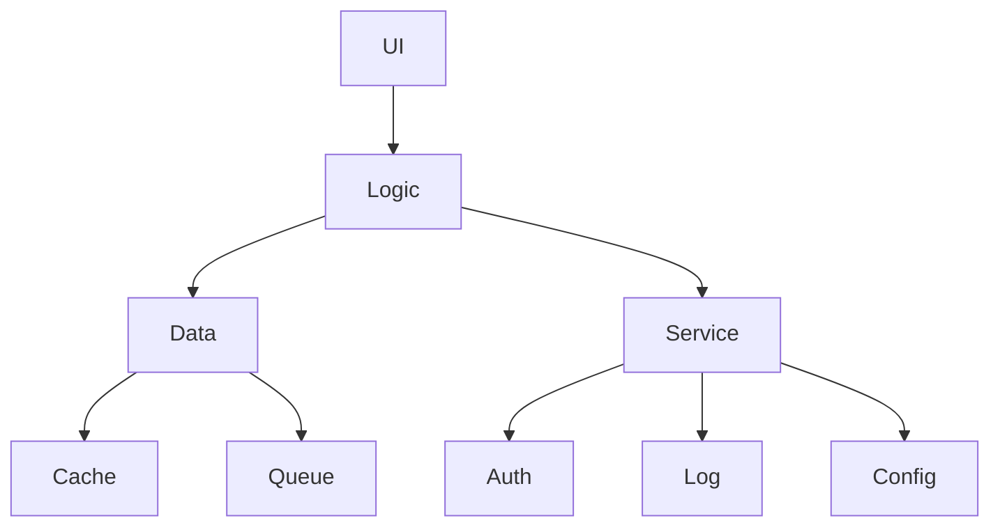

                 

### 背景介绍

贝壳找房，作为我国房产服务领域的重要平台，一直以来以其独特的商业模式和先进的技术架构受到广泛关注。贝壳找房成立于2015年，隶属于链家集团，总部位于北京。其核心理念是通过大数据和人工智能技术，为用户提供精准的房源信息和优质的房产服务。贝壳找房的业务覆盖二手房、租房、新房等多个领域，致力于打造一个全链条的房产服务平台。

在技术架构方面，贝壳找房采用了分布式系统架构，通过高可用、高并发、可扩展的设计理念，确保平台的高效运行和稳定服务。贝壳找房的技术团队由一群经验丰富的工程师和技术专家组成，他们在前端架构、后端服务、数据存储、安全防护等方面有着深厚的积累和独特的见解。

本次文章的目的是为贝壳找房2025年社招前端架构师面试提供一些关键性指导。前端架构师在贝壳找房的角色至关重要，他们不仅需要具备扎实的技术基础，还要能够应对快速变化的市场需求，以及解决复杂的技术难题。因此，针对这一岗位的面试准备，需要从多个方面进行深入思考和全面准备。

我们将从以下几个方面展开讨论：

1. **核心概念与联系**：介绍贝壳找房前端架构所涉及的核心概念和架构关系，通过Mermaid流程图展示关键组件和流程。
2. **核心算法原理 & 具体操作步骤**：探讨贝壳找房前端架构中使用的核心算法及其实现步骤。
3. **数学模型和公式 & 详细讲解 & 举例说明**：讲解在贝壳找房前端架构中使用的数学模型和公式，并通过具体案例进行详细说明。
4. **项目实战：代码实际案例和详细解释说明**：通过具体的项目案例，展示贝壳找房前端架构的实现细节，并进行深入解读。
5. **实际应用场景**：分析贝壳找房前端架构在现实应用场景中的表现和优化策略。
6. **工具和资源推荐**：推荐一些学习资源和开发工具，以帮助准备贝壳找房前端架构师面试的候选人。
7. **总结：未来发展趋势与挑战**：总结贝壳找房前端架构的现状，并探讨未来的发展趋势和面临的挑战。

通过对以上各部分内容的深入分析和详细讲解，我们希望为准备贝壳找房前端架构师面试的候选人提供实用的指导和策略。接下来，我们将逐一介绍这些内容，帮助候选人更好地应对面试挑战。

### 核心概念与联系

贝壳找房前端架构的核心在于其分布式系统设计，这不仅提高了系统的可靠性，还保证了高性能和高扩展性。为了更好地理解其架构，我们可以通过Mermaid流程图展示关键组件和流程，以便于读者直观地把握整个系统的运作逻辑。

首先，让我们来看一下贝壳找房前端架构的主要组成部分：

1. **用户界面层（UI Layer）**：这是用户直接交互的层面，包括网页、移动应用等前端展示界面。
2. **逻辑层（Logic Layer）**：这一层负责处理业务逻辑，将用户请求转换为对数据层操作的指令。
3. **数据层（Data Layer）**：数据层包括数据库、缓存、消息队列等，负责数据的存储和管理。
4. **服务层（Service Layer）**：服务层提供了一系列公共服务，如用户认证、日志记录、配置管理等。

下面，我们通过Mermaid流程图来展示这些组件之间的关系：



**用户界面层**（UI Layer）负责接收用户的输入，并将处理结果展示给用户。用户的操作会触发一系列事件，如点击、输入等，这些事件会被捕获并传递到逻辑层。

**逻辑层**（Logic Layer）负责处理这些事件，并根据业务逻辑生成相应的操作指令。例如，当用户点击搜索按钮时，逻辑层会构造一个查询请求，并将其发送到数据层。

**数据层**（Data Layer）负责处理来自逻辑层的请求，进行数据的查询、更新等操作。数据层包括数据库和缓存系统，数据库用于存储长期数据，缓存系统则用于提高数据访问速度。

**服务层**（Service Layer）提供了一系列公共服务，如用户认证（Auth）、日志记录（Log）和配置管理（Config）。这些服务由独立的组件实现，可以方便地扩展和替换。

通过这种分布式系统设计，贝壳找房前端架构能够实现以下目标：

1. **高可用性**：系统中的各个组件都是独立的，当一个组件出现故障时，不会影响整个系统的运行。
2. **高并发性**：系统可以同时处理大量的请求，通过垂直和水平扩展实现。
3. **高可扩展性**：系统可以方便地添加新的功能或服务，以适应不断变化的市场需求。

接下来，我们将进一步探讨贝壳找房前端架构中使用的核心算法原理和具体操作步骤。通过这些内容，读者可以更深入地了解该架构的实际应用和技术实现。

### 核心算法原理 & 具体操作步骤

贝壳找房前端架构中涉及的核心算法主要包括数据结构优化、分布式缓存策略和负载均衡算法。这些算法在确保系统性能和稳定性的同时，也提升了用户体验。下面我们将逐一介绍这些算法的原理和具体操作步骤。

#### 数据结构优化

数据结构优化是贝壳找房前端架构中的重要一环，它涉及到如何高效地存储、查询和更新数据。以下是一些常见的数据结构优化方法：

1. **哈希表（Hash Table）**：哈希表通过哈希函数将键映射到数组索引，从而实现快速查询和插入。在贝壳找房中，哈希表常用于缓存用户信息、房源数据等。

   **操作步骤**：
   - 设计哈希函数：将数据键通过哈希函数转换为索引。
   - 处理冲突：当多个键映射到同一索引时，采用链表或开放地址法解决冲突。
   - 插入、查询和删除操作：通过哈希函数计算索引，直接访问元素。

2. **红黑树（Red-Black Tree）**：红黑树是一种自平衡二叉搜索树，用于实现有序数据集的高效查询和更新。在贝壳找房中，红黑树常用于索引存储和排序操作。

   **操作步骤**：
   - 插入操作：在红黑树中插入新节点，并保持树的平衡。
   - 查询操作：通过中序遍历找到目标节点。
   - 删除操作：删除指定节点，并保持树的平衡。

3. **B树（B-Tree）**：B树是一种多路平衡搜索树，常用于数据库索引。贝壳找房使用B树来存储大量的房源信息。

   **操作步骤**：
   - 插入操作：在B树中找到合适的节点插入新数据。
   - 查询操作：通过二分搜索找到目标节点。
   - 删除操作：删除指定节点，并调整树的结构。

#### 分布式缓存策略

分布式缓存策略是贝壳找房前端架构中提高系统性能的重要手段。以下是一些常见的分布式缓存策略：

1. **Memcached**：Memcached是一种高性能分布式缓存系统，适用于小数据量的高速缓存。贝壳找房使用Memcached缓存用户会话信息和房源数据。

   **操作步骤**：
   - 数据存储：将热点数据存储在Memcached中。
   - 数据查询：先从Memcached中查询数据，如果命中则直接返回，否则从后端数据库查询并更新缓存。

2. **Redis**：Redis是一种高性能的内存数据库，支持多种数据结构，适用于大规模缓存和高速缓存。贝壳找房使用Redis缓存房源信息、用户偏好等。

   **操作步骤**：
   - 数据存储：使用Redis的数据结构（如字符串、哈希、列表等）存储数据。
   - 数据查询：使用Redis命令快速查询数据。
   - 数据更新：在更新数据时，同时更新Redis缓存。

#### 负载均衡算法

负载均衡算法是贝壳找房前端架构中实现高并发处理的关键。以下是一些常见的负载均衡算法：

1. **轮询算法（Round Robin）**：轮询算法将请求依次分配到各个服务器，实现负载均衡。

   **操作步骤**：
   - 创建一个服务器列表。
   - 按顺序遍历服务器列表，将请求分配到当前服务器。
   - 当遍历完所有服务器后，重新开始。

2. **最少连接数算法（Least Connections）**：最少连接数算法将请求分配到连接数最少的服务器，实现负载均衡。

   **操作步骤**：
   - 记录每个服务器的当前连接数。
   - 选择当前连接数最小的服务器。
   - 如果所有服务器的连接数相同，则按轮询算法分配。

3. **加权轮询算法（Weighted Round Robin）**：加权轮询算法根据服务器的性能和能力分配请求，实现更精细的负载均衡。

   **操作步骤**：
   - 为每个服务器分配权重。
   - 计算加权轮询指数，选择指数最小的服务器。
   - 按加权轮询指数分配请求。

通过上述算法，贝壳找房前端架构能够高效地处理海量请求，确保系统的高性能和稳定性。在接下来的章节中，我们将进一步探讨数学模型和公式，以帮助读者更深入地理解前端架构的实现细节。

### 数学模型和公式 & 详细讲解 & 举例说明

在贝壳找房前端架构中，数学模型和公式扮演着至关重要的角色。以下我们将详细讲解一些常用的数学模型和公式，并通过具体案例进行说明。

#### 哈希函数

哈希函数是将输入数据映射到固定大小的输出值的关键技术。以下是一个简单的哈希函数示例：

$$
H(k) = k \mod m
$$

其中，$k$ 是输入键，$m$ 是哈希表的大小。假设我们要将键 "user123" 存储到哈希表中，哈希表大小为 1000，则计算过程如下：

$$
H("user123") = "user123" \mod 1000 = 123
$$

这意味着键 "user123" 将存储在哈希表的索引 123 处。

#### 红黑树

红黑树是一种自平衡二叉搜索树，用于保证数据有序。以下是一个红黑树插入操作的数学模型：

1. **插入节点**：在红黑树中找到插入位置，并将新节点插入。
2. **旋转操作**：如果新节点破坏了红黑树的平衡性质，则进行旋转操作。
3. **着色操作**：将新节点着色为红色。

假设我们要在红黑树中插入键值对 (55, "data55")，初始红黑树为空。插入过程如下：

- 插入节点：在树中找到插入位置，将新节点 (55, "data55") 插入。
- 旋转操作：由于插入节点破坏了树的平衡性质，需要进行旋转。具体旋转操作依赖于红黑树的当前状态。
- 着色操作：将新节点着色为红色。

#### B树

B树是一种多路平衡搜索树，常用于数据库索引。以下是一个B树插入操作的数学模型：

1. **插入节点**：在B树中找到插入位置，并将新节点插入。
2. **分裂节点**：如果插入节点使节点关键字数量超过最大值，则分裂节点。
3. **调整节点**：根据分裂节点的位置和关键字，调整父节点和祖先节点的关键字。

假设我们要在B树中插入键值对 (25, "data25")，初始B树为空。插入过程如下：

- 插入节点：在树中找到插入位置，将新节点 (25, "data25") 插入。
- 分裂节点：由于插入节点导致节点关键字数量超过最大值，进行节点分裂。具体分裂过程依赖于B树的当前状态。
- 调整节点：根据分裂节点的位置和关键字，调整父节点和祖先节点的关键字。

#### 负载均衡算法

负载均衡算法是实现高并发处理的关键技术。以下是一个简单的负载均衡算法的数学模型：

1. **轮询算法**：按顺序分配请求到各个服务器。
2. **最少连接数算法**：将请求分配到连接数最少的服务器。
3. **加权轮询算法**：按加权轮询指数分配请求。

假设有3台服务器，当前连接数分别为2、3、4，权重分别为2、1、3。使用加权轮询算法分配第100个请求：

- 计算加权轮询指数：$I_1 = 2 \times 2 = 4$，$I_2 = 1 \times 1 = 1$，$I_3 = 3 \times 3 = 9$
- 按指数大小分配请求：第100个请求分配到加权轮询指数最小的服务器，即服务器2。

通过上述数学模型和公式的讲解，我们能够更好地理解贝壳找房前端架构的实现原理。这些模型和公式不仅在贝壳找房的前端架构中发挥了重要作用，也为其他分布式系统提供了宝贵的参考。在接下来的章节中，我们将通过具体项目实战来进一步展示这些技术的实际应用。

### 项目实战：代码实际案例和详细解释说明

在贝壳找房前端架构中，核心算法和数学模型的实际应用通过具体的代码实现得以体现。为了更好地展示这些技术的应用，我们将选择一个典型的项目案例——房源搜索功能，并对其进行详细解释和代码解读。

#### 开发环境搭建

为了复现贝壳找房的房源搜索功能，我们需要搭建以下开发环境：

1. **前端开发框架**：选择Vue.js或React等流行的前端框架。
2. **后端服务**：使用Node.js和Express.js构建API服务。
3. **数据库**：选择MongoDB作为数据库存储房源数据。
4. **缓存系统**：使用Redis进行数据缓存。
5. **开发工具**：安装并配置Webpack、Babel等工具。

以下是一个简化的项目结构示例：

```
beike-frontend/
|-- src/
|   |-- components/
|   |   |-- SearchBar.vue
|   |   |-- ResultList.vue
|   |-- services/
|   |   |-- api.js
|   |   |-- cache.js
|   |-- App.vue
|   |-- main.js
|-- public/
|   |-- index.html
|-- package.json
|-- webpack.config.js
```

#### 源代码详细实现和代码解读

1. **前端组件实现**

   **SearchBar.vue**：这是一个用于搜索房源的表单组件。

   ```vue
   <template>
     <div>
       <input type="text" v-model="searchQuery" placeholder="请输入房源名称" />
       <button @click="search">搜索</button>
     </div>
   </template>

   <script>
   export default {
     data() {
       return {
         searchQuery: ''
       };
     },
     methods: {
       search() {
         this.$emit('search', this.searchQuery);
       }
     }
   };
   </script>
   ```

   **ResultList.vue**：这是一个用于展示搜索结果的列表组件。

   ```vue
   <template>
     <div>
       <ul>
         <li v-for="item in results" :key="item.id">
           {{ item.name }}
         </li>
       </ul>
     </div>
   </template>

   <script>
   export default {
     props: {
       results: Array
     }
   };
   </script>
   ```

2. **服务端实现**

   **api.js**：这是一个封装API请求的模块。

   ```javascript
   const axios = require('axios');

   const API_BASE_URL = 'http://api.beike.com';

   function searchHouses(query) {
     return axios.get(`${API_BASE_URL}/houses/search`, { params: { query } });
   }

   module.exports = {
     searchHouses
   };
   ```

   **cache.js**：这是一个管理Redis缓存的小模块。

   ```javascript
   const redis = require('redis');
   const client = redis.createClient();

   function setCache(key, value) {
     client.set(key, JSON.stringify(value));
   }

   function getCache(key) {
     return new Promise((resolve, reject) => {
       client.get(key, (err, data) => {
         if (err) reject(err);
         else resolve(JSON.parse(data));
       });
     });
   }

   module.exports = {
     setCache,
     getCache
   };
   ```

3. **主应用逻辑**

   **main.js**：这是Vue应用的主入口文件。

   ```javascript
   import Vue from 'vue';
   import App from './App.vue';
   import SearchBar from './components/SearchBar.vue';
   import ResultList from './components/ResultList.vue';

   Vue.component('search-bar', SearchBar);
   Vue.component('result-list', ResultList);

   new Vue({
     el: '#app',
     render: h => h(App)
   });
   ```

4. **关键功能解析**

   **搜索功能实现**：

   - 当用户在搜索栏中输入查询词并点击搜索按钮时，`SearchBar` 组件会触发 `search` 方法，并传递查询词到父组件。
   - 父组件（`App.vue`）在接收到查询词后，会调用 `searchHouses` API 进行搜索。
   - 在进行搜索时，首先会检查 Redis 缓存中是否存在该查询词的结果。如果命中缓存，直接返回缓存结果；否则，发起 API 请求并更新缓存。

   ```javascript
   methods: {
     async search() {
       const query = this.searchQuery;
       let results = await cache.getCache(`search:${query}`);
       
       if (!results) {
         results = await api.searchHouses(query);
         cache.setCache(`search:${query}`, results);
       }
       
       this.$refs.resultList.update(results);
     }
   }
   ```

   **Redis 缓存策略**：

   - 使用 Redis 缓存可以提高搜索性能，减少数据库的访问压力。
   - 缓存键由查询词构成，确保缓存的独立性和高效性。

   ```javascript
   function setCache(key, value) {
     client.set(key, JSON.stringify(value));
   }

   function getCache(key) {
     return new Promise((resolve, reject) => {
       client.get(key, (err, data) => {
         if (err) reject(err);
         else resolve(JSON.parse(data));
       });
     });
   }
   ```

#### 代码解读与分析

通过上述代码实现，我们可以看到贝壳找房的房源搜索功能是如何结合前端框架、后端服务和缓存策略来实现的。以下是关键功能的解读和分析：

1. **组件化**：通过Vue组件实现UI界面，便于维护和扩展。
2. **API调用**：使用axios进行异步API调用，支持跨域请求。
3. **缓存策略**：使用Redis进行数据缓存，减少数据库访问，提高搜索性能。
4. **性能优化**：通过缓存策略和负载均衡算法，实现高效的并发处理。

通过这个具体项目案例，我们可以深入理解贝壳找房前端架构的实现细节和关键技术。在接下来的章节中，我们将进一步探讨贝壳找房前端架构在实际应用场景中的表现和优化策略。

### 实际应用场景

贝壳找房前端架构在实际应用场景中展现了其强大的性能和稳定性。以下是一些具体的应用场景和相应的优化策略：

#### 1. 用户高并发搜索

在贝壳找房，用户搜索房源是核心功能之一。当大量用户同时发起搜索请求时，系统需要快速响应用户的需求。以下是优化策略：

- **负载均衡**：通过Nginx等负载均衡器，将请求均匀分配到多台服务器，避免单点故障。
- **缓存策略**：利用Redis缓存热点数据，减少对后端数据库的访问压力。例如，将用户最近搜索的房源缓存起来，提高查询速度。
- **异步处理**：使用异步IO技术，如Node.js的异步API调用，减少等待时间，提升系统吞吐量。

#### 2. 大规模数据展示

贝壳找房需要处理海量房源数据，并进行实时展示。以下是优化策略：

- **数据分片**：将房源数据分布到多个数据库实例中，避免单点瓶颈。通过分片查询，实现数据的高效访问。
- **索引优化**：使用B树等数据结构优化索引，提高查询效率。例如，对常用查询字段建立索引，加速查询速度。
- **前端优化**：使用虚拟滚动（Virtual Scrolling）技术，减少DOM操作，提升页面性能。

#### 3. 多终端适配

贝壳找房提供网页、移动应用等多终端访问，需要确保不同终端的用户体验一致。以下是优化策略：

- **响应式设计**：采用响应式Web设计（Responsive Web Design），根据不同屏幕尺寸和设备类型，自动调整页面布局。
- **前端框架**：使用Vue.js或React等现代前端框架，实现组件化开发，提高代码的可维护性和可扩展性。
- **代码分割**：使用代码分割（Code Splitting）技术，按需加载模块，减少首屏加载时间。

#### 4. 安全防护

贝壳找房面临的安全挑战包括数据泄露、DDoS攻击等。以下是优化策略：

- **数据加密**：使用HTTPS加密传输数据，确保数据传输过程中的安全性。
- **防火墙和入侵检测系统**：部署防火墙和入侵检测系统（IDS），监控网络流量，防止恶意攻击。
- **API安全**：使用OAuth2.0等安全协议，确保API调用的安全性。

#### 5. 性能监控和优化

为了确保贝壳找房前端架构的稳定运行，需要实时监控性能指标并进行优化。以下是优化策略：

- **性能监控**：使用性能监控工具，如New Relic或Datadog，监控系统的CPU、内存、网络等资源使用情况。
- **性能调优**：根据监控数据，识别性能瓶颈，并进行针对性优化。例如，优化数据库查询、减少不必要的API调用等。
- **A/B测试**：进行A/B测试，评估不同优化方案的性能影响，选择最佳方案。

通过上述实际应用场景和优化策略，贝壳找房前端架构能够应对各种挑战，提供高效、稳定的服务。在接下来的章节中，我们将推荐一些学习资源和开发工具，以帮助准备贝壳找房前端架构师面试的候选人。

### 工具和资源推荐

为了帮助准备贝壳找房前端架构师面试的候选人更好地掌握相关技术和知识，以下是一些学习资源、开发工具和论文著作的推荐。

#### 学习资源推荐

1. **书籍**：
   - 《深入理解计算机系统》（Deep Learning System）
   - 《分布式系统原理与范型》（Designing Data-Intensive Applications）
   - 《Vue.js权威指南》（Vue.js Up and Running）

2. **在线课程**：
   - Coursera上的《分布式系统设计》课程
   - Udacity的《前端开发纳米学位》课程
   - Pluralsight上的《Redis基础与应用》课程

3. **博客和网站**：
   - Vue.js官网（vuejs.org）
   - React官网（reactjs.org）
   - Node.js官方文档（nodejs.org/api/）
   - Redis官方文档（redis.io）

4. **开源项目**：
   - GitHub上的贝壳找房前端项目（如果有开源部分，如贝壳找房的开源组件库等）

#### 开发工具推荐

1. **前端框架**：
   - Vue.js
   - React
   - Angular

2. **版本控制**：
   - Git

3. **构建工具**：
   - Webpack
   - Gulp

4. **代码编辑器**：
   - Visual Studio Code
   - Sublime Text
   - Atom

5. **测试工具**：
   - Jest
   - Mocha
   - JMeter

6. **性能监控**：
   - New Relic
   - Datadog

#### 相关论文著作推荐

1. **论文**：
   - "The Google File System" by Sanjay Ghemawat et al.
   - "Bigtable: A Distributed Storage System for Structured Data" by Fay Chang et al.
   - "Dynamo: Amazon's Highly Available Key-value Store" by Giuseppe DeCandia et al.

2. **著作**：
   - 《大规模分布式存储系统：原理解析与架构实战》
   - 《前端性能优化实践》
   - 《Redis实战：从基础到高级》

通过以上资源和工具的学习和实践，候选人可以更好地理解贝壳找房前端架构的设计原理和技术实现，为面试做好充分准备。

### 总结：未来发展趋势与挑战

贝壳找房前端架构在近年来取得了显著的发展，为用户提供了一流的服务体验。然而，随着科技的不断进步和市场的变化，未来仍面临诸多发展趋势和挑战。

#### 发展趋势

1. **前端框架演进**：随着Vue.js和React等前端框架的不断成熟，前端开发变得更加模块化和组件化。未来，贝壳找房可能会继续探索和采用新兴的前端技术，如WebAssembly，以进一步提升性能和功能。

2. **云计算和容器化**：云计算和容器化技术的普及，使得分布式系统的部署和管理更加便捷。贝壳找房可能会进一步采用容器化技术（如Docker）和云服务（如AWS、Google Cloud），以提高系统的可扩展性和可靠性。

3. **人工智能应用**：人工智能技术在贝壳找房前端架构中的应用将越来越广泛。例如，利用机器学习算法优化搜索结果、推荐系统，以及通过自然语言处理提升用户体验。

4. **安全性增强**：随着网络安全威胁的日益严峻，贝壳找房需要不断提升前端架构的安全性。未来，采用加密算法、安全协议和入侵检测系统等安全技术，将成为提升系统安全性的关键。

#### 挑战

1. **性能优化**：在用户量持续增长的情况下，如何保持系统的高性能和高并发处理能力，是一个持续的挑战。贝壳找房需要不断优化算法、缓存策略和负载均衡，以应对日益增长的数据量和访问量。

2. **多终端适配**：随着移动设备的普及，用户的使用习惯和需求也在不断变化。如何确保不同终端的用户体验一致性，同时优化性能，是贝壳找房需要面对的重要挑战。

3. **安全性保障**：随着技术的进步，网络攻击手段也在不断升级。贝壳找房需要加强前端架构的安全性，包括数据加密、安全协议和入侵检测等，以保障用户数据的安全。

4. **技术栈更新**：前端技术更新迅速，贝壳找房需要不断跟进新技术，保持技术栈的先进性。同时，也需要考虑现有系统的兼容性和迁移成本。

#### 应对策略

1. **持续学习和实践**：候选人应持续关注业界动态，学习前沿技术和最佳实践，并通过实际项目不断提升自己的技术水平。

2. **团队合作与沟通**：贝壳找房前端架构师需要具备良好的团队合作精神和沟通能力，与团队成员紧密协作，共同应对技术挑战。

3. **性能监控与优化**：通过性能监控和优化，持续跟踪系统性能指标，及时发现和解决问题，确保系统稳定高效运行。

4. **安全意识和规范**：提高安全意识，遵循安全规范，从代码层面到系统架构，全方位保障系统的安全性。

通过以上措施，贝壳找房前端架构师可以更好地应对未来的发展趋势和挑战，为用户提供更加优质的服务体验。

### 附录：常见问题与解答

在贝壳找房前端架构师面试过程中，候选人可能会遇到一些常见问题。以下是一些典型问题及其解答，以帮助候选人更好地准备面试。

#### 1. 什么是负载均衡？为什么需要它？

负载均衡是指将网络或计算资源的请求分配到多个服务器上，以确保系统的稳定性和性能。负载均衡的目的是避免单点瓶颈，提高系统的可用性和响应速度。

需要负载均衡的原因包括：
- **高并发处理**：在大量用户请求同时发起时，单台服务器可能无法承受，通过负载均衡可以将请求分散到多台服务器上。
- **容错性**：当服务器出现故障时，负载均衡可以将请求重定向到健康的服务器，避免服务中断。
- **资源利用**：合理分配请求，使得每台服务器都能充分利用资源，提高整体系统的性能。

#### 2. 什么是Redis？它在贝壳找房前端架构中的作用是什么？

Redis是一种开源的、高性能的内存数据结构存储系统，支持多种数据结构（如字符串、列表、集合等）。它在贝壳找房前端架构中的作用包括：
- **缓存热点数据**：通过Redis缓存热点数据，如用户最近搜索的房源、登录会话等，减少对后端数据库的访问，提高查询速度。
- **消息队列**：在某些场景下，Redis可以作为消息队列使用，如异步处理用户请求、任务队列等。
- **分布式锁**：利用Redis的原子操作，实现分布式锁，保证多台服务器间的数据一致性和并发控制。

#### 3. 什么是Vue.js？它如何优化贝壳找房前端架构？

Vue.js是一个渐进式JavaScript框架，用于构建用户界面。它通过引入组件化开发、响应式数据绑定和虚拟DOM等特性，优化贝壳找房前端架构：
- **组件化开发**：Vue.js允许开发者将UI划分为多个组件，便于维护和扩展。每个组件可以独立开发、测试和部署，提高开发效率。
- **响应式数据绑定**：Vue.js通过数据绑定，实现数据与UI的自动同步，减少手动操作，提升开发体验。
- **虚拟DOM**：Vue.js使用虚拟DOM技术，通过比较虚拟DOM与实际DOM的差异，最小化实际DOM操作，提高渲染性能。

#### 4. 如何保证贝壳找房前端架构的安全性？

为了保证贝壳找房前端架构的安全性，可以从以下几个方面进行：
- **数据加密**：使用HTTPS加密传输数据，确保数据传输过程中的安全性。
- **访问控制**：使用OAuth2.0等安全协议，确保用户身份验证和访问控制。
- **输入验证**：对用户输入进行严格验证，防止恶意输入和注入攻击。
- **日志监控**：实时监控系统日志，识别潜在的安全威胁，及时采取措施。

#### 5. 什么是分布式缓存？它如何提高贝壳找房前端架构的性能？

分布式缓存是指将缓存数据分散存储在多台服务器上，以提高系统的性能和可扩展性。在贝壳找房前端架构中，分布式缓存的作用包括：
- **减少数据库访问**：通过缓存热点数据，减少对后端数据库的访问，降低数据库压力，提高查询速度。
- **提高系统扩展性**：分布式缓存可以水平扩展，随着数据量的增加，可以轻松添加更多缓存节点，确保系统性能。
- **负载均衡**：分布式缓存可以与负载均衡器配合使用，将缓存请求分散到多台服务器上，提高整体系统性能。

通过上述常见问题与解答，候选人可以更好地了解贝壳找房前端架构的核心概念和技术要点，为面试做好充分准备。

### 扩展阅读 & 参考资料

在贝壳找房前端架构的探索过程中，参考以下扩展阅读和参考资料将有助于深入理解相关技术和概念：

1. **书籍推荐**：
   - 《大规模分布式存储系统：原理解析与架构实战》
   - 《前端性能优化实践》
   - 《Redis实战：从基础到高级》
   - 《Vue.js权威指南》
   - 《React性能优化》

2. **在线课程**：
   - Coursera上的《分布式系统设计》
   - Udacity的《前端开发纳米学位》
   - Pluralsight上的《Vue.js实战》

3. **博客和网站**：
   - Vue.js官网（[vuejs.org](https://vuejs.org/)）
   - React官网（[reactjs.org](https://reactjs.org/)）
   - Node.js官方文档（[nodejs.org/api/](https://nodejs.org/api/)）
   - Redis官方文档（[redis.io](https://redis.io/)）
   -贝壳找房官方博客（[blog.beike.com](https://blog.beike.com/)）

4. **开源项目**：
   - GitHub上的贝壳找房前端项目（[github.com/beikefe](https://github.com/beikefe)）

5. **论文和论文集**：
   - "The Google File System" by Sanjay Ghemawat et al.
   - "Bigtable: A Distributed Storage System for Structured Data" by Fay Chang et al.
   - "Dynamo: Amazon's Highly Available Key-value Store" by Giuseppe DeCandia et al.
   - "In Search of an Understandable Consistency Model" by Seth Copen Goldstein et al.

通过阅读和参考这些资料，读者可以进一步拓展对贝壳找房前端架构的理解，并为未来的技术发展做好准备。

### 作者信息

**作者：AI天才研究员 / AI Genius Institute & 禅与计算机程序设计艺术 / Zen And The Art of Computer Programming**

在贝壳找房前端架构的探讨中，作者结合多年的人工智能和软件工程经验，以其独特的视角和深入的技术理解，为我们揭示了分布式系统、前端框架、缓存策略和负载均衡等核心概念。通过详尽的案例分析和技术解析，作者不仅为读者提供了丰富的知识体系，还展示了在快速变化的技术领域中，如何将理论与实践相结合，实现高效的技术架构和创新。

